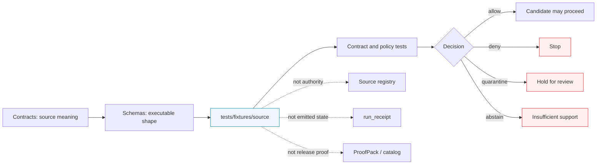

<!-- [KFM_META_BLOCK_V2]
doc_id: kfm://doc/NEEDS_VERIFICATION__tests_fixtures_source_readme
title: Source Fixtures
type: standard
version: v1
status: draft
owners: @bartytime4life
created: NEEDS_VERIFICATION__YYYY-MM-DD
updated: NEEDS_VERIFICATION__YYYY-MM-DD
policy_label: NEEDS_VERIFICATION__public_or_internal
related: [../../README.md, NEEDS_VERIFICATION__../README.md, ../../policy/README.md, ../../reproducibility/README.md, ../../contracts/README.md, ../../../README.md, ../../../contracts/README.md, ../../../schemas/README.md, ../../../schemas/contracts/v1/source/source_descriptor.schema.json, ../../../policy/README.md, ../../../.github/CODEOWNERS, ../../../.github/workflows/README.md]
tags: [kfm, tests, fixtures, source, source-descriptor, validation, verification]
notes: [Parent README for source-facing test fixtures. Owner is grounded at the broader /tests/ scope in surfaced repo-facing docs; exact active-branch source-fixture inventory, leaf ownership, policy label, created/updated dates, validator wiring, and workflow enforcement remain NEEDS VERIFICATION.]
[/KFM_META_BLOCK_V2] -->

<a id="top"></a>

# Source Fixtures

Deterministic, public-safe fixture home for small source-admission and source-metadata examples that help KFM test source identity, source role, rights posture, temporal support, and fail-closed behavior.

> [!NOTE]
> **Status:** `experimental`  
> **Owners:** `@bartytime4life` *(confirmed at the broader `/tests/` scope in surfaced repo-facing docs; source-fixture leaf ownership still needs active-branch verification)*  
> **Path:** `tests/fixtures/source/README.md`  
> **Repo fit:** parent README for source-facing fixture lanes under the governed `tests/` verification surface  
> **Quick jumps:** [Scope](#scope) · [Repo fit](#repo-fit) · [Accepted inputs](#accepted-inputs) · [Exclusions](#exclusions) · [Directory tree](#directory-tree) · [Quickstart](#quickstart) · [Usage](#usage) · [Diagram](#diagram) · [Operating tables](#operating-tables) · [Task list / definition of done](#task-list--definition-of-done) · [FAQ](#faq) · [Appendix](#appendix)


> [!IMPORTANT]
> `tests/fixtures/source/` is a **verification-support lane**, not a source registry, data mirror, policy engine, schema authority, or publication surface.  
> Fixtures here should make source-admission behavior easy to test without implying live connector, workflow, signing, or release maturity.

---

## Scope

`tests/fixtures/source/` exists to keep source-facing examples small, explicit, reviewable, and subordinate to KFM’s governed truth path.

This directory is the right place for fixture material that helps tests prove:

- source identity before fetch, scheduling, normalization, or publication
- source role before flattening into generic “data”
- documented access mode before automation expands
- rights, citation, redistribution, and sensitivity posture before ingest becomes habitual
- temporal support, observation windows, intervals, support geometry, CRS, and uncertainty where they affect meaning
- fail-closed `allow` / `deny` / `quarantine` / `abstain` behavior at the source-admission edge
- the boundary **fixture ≠ receipt ≠ proof ≠ catalog ≠ source registry**

This directory should stay boring in the best possible way: tiny examples, named failure reasons, clear authority boundaries, and no silent provider mirrors.

### Truth labels used in this README

| Label | Meaning here |
| --- | --- |
| **CONFIRMED** | Supported by surfaced KFM doctrine, surfaced repo-facing README patterns, or direct current-session inspection |
| **INFERRED** | Conservative reading that fits adjacent KFM docs but is not directly proven as active-branch source-fixture reality |
| **PROPOSED** | Recommended fixture shape or growth pattern consistent with KFM doctrine but not asserted as mounted implementation |
| **UNKNOWN** | Not verified strongly enough to describe as current repo reality |
| **NEEDS VERIFICATION** | Reviewer action required before treating a path, owner, inventory item, validator, or workflow claim as settled |

### Current evidence posture

| Surface | Status | Why it matters |
| --- | --- | --- |
| `tests/` as a governed verification boundary | **CONFIRMED** | Keeps this directory under test/proof discipline rather than generic sample-data practice |
| `/tests/` owner coverage | **CONFIRMED at family scope** | Supports the visible owner line while avoiding a leaf-specific ownership overclaim |
| `SourceDescriptor` as a first-wave source contract family | **CONFIRMED as surfaced doctrine / repo-facing adjacency** | Grounds this lane in source admission, not ad hoc source vocabulary |
| `schemas/contracts/v1/source/source_descriptor.schema.json` | **CONFIRMED as surfaced adjacency / NEEDS VERIFICATION on active branch** | Nearest visible machine-contract companion for source fixtures |
| `tests/fixtures/source/` active branch inventory | **NEEDS VERIFICATION** | This README should not pretend to know exact child files without branch inspection |
| Current validator wiring for this lane | **UNKNOWN / NEEDS VERIFICATION** | Fixture examples do not prove executable enforcement |
| Current workflow or branch-protection enforcement | **UNKNOWN / NEEDS VERIFICATION** | README language must not imply merge-blocking behavior unless workflow evidence proves it |

[Back to top](#top)

---

## Repo fit

**Path:** `tests/fixtures/source/README.md`  
**Role:** parent fixture README for source-admission, source-metadata, and source-role test examples.

| Direction | Surface | Why it matters |
| --- | --- | --- |
| Parent verification boundary | [`tests/README.md`][tests-readme] | Keeps this directory subordinate to KFM’s governed verification model |
| Immediate fixture family | `tests/fixtures/README.md` **NEEDS VERIFICATION** | Should govern cross-fixture placement if present or added |
| Policy-facing tests | [`tests/policy/README.md`][tests-policy-readme] | Source fixtures may feed policy tests, but policy truth does not originate here |
| Reproducibility-facing tests | [`tests/reproducibility/README.md`][tests-repro-readme] | Fixtures should remain stable enough for replayability and digest checks |
| Contract-facing tests | [`tests/contracts/README.md`][tests-contracts-readme] | Contract tests may consume fixtures; fixtures do not define contract meaning |
| Root operating posture | [`README.md`][root-readme] | This lane should remain aligned with repo-wide KFM posture |
| Contract authority | [`contracts/README.md`][contracts-readme] | Human semantic contract meaning stays upstream from fixtures |
| Schema authority | [`schemas/README.md`][schemas-readme] | Executable shape and machine constraints stay upstream from fixtures |
| Source schema companion | [`schemas/contracts/v1/source/source_descriptor.schema.json`][source-schema] | Likely nearest machine-checkable companion for source-admission fixtures |
| Policy authority | [`policy/README.md`][policy-readme] | Rights, sensitivity, and promotion gates remain policy-owned |
| Ownership boundary | [`.github/CODEOWNERS`][codeowners] | Final source-fixture owner routing should be checked here before merge |
| Workflow boundary | [`.github/workflows/README.md`][workflows-readme] | This directory must not imply hidden CI wiring or branch enforcement |

> [!TIP]
> Keep the split visible: **fixtures pressure-test source contracts; contracts define meaning; schemas define executable shape; policy decides admissibility; receipts/proofs/catalogs record later state.**

[Back to top](#top)

---

## Accepted inputs

Content that belongs here should stay **small**, **explicit**, and **safe to review in Git**.

| Input class | Typical examples | Why it belongs here |
| --- | --- | --- |
| Valid source descriptor fixture | minimal YAML or JSON object with `SourceDescriptor` identity, role, access, support, and rights fields | proves the positive source-admission shape |
| Invalid source descriptor fixture | missing source ID, missing rights posture, undocumented access mode, ambiguous time support | keeps negative states first-class |
| Source-role comparison note | tiny fragments distinguishing `direct_observation`, `regulatory_context`, `modeled_derivative`, or `community_observation` | prevents source authority collapse |
| Access-surface fixture | minimal metadata naming documented API, CSV, tile, or service surfaces | keeps acquisition mode visible without mirroring a provider |
| Temporal/support fixture | observation interval, valid-time support, retrieval time, coverage window, support geometry, CRS, or uncertainty fields | preserves meaning-bearing metadata |
| Expected validation output | compact `allow`, `deny`, `quarantine`, or `abstain` fragments consumed by a real test | makes validator behavior reviewable |
| Fixture README for a child lane | source-specific or renderer-source-specific README, such as a Mesonet or MapLibre source-metadata leaf | documents local placement without replacing this parent |

### Input rules

1. Keep fixtures **tiny enough for pull-request review**.
2. Name files by **behavior or failure reason**, not vague buckets.
3. Keep source role and acquisition mode visible inside the fixture.
4. Keep rights, citation, redistribution, and sensitivity posture explicit.
5. Keep time, support, CRS, and uncertainty explicit when they affect trust.
6. Label normalized or derived examples as **derived**; do not let them masquerade as raw provider truth.
7. Add expected output fragments only when a test or validator actually consumes them.
8. Preserve the boundary **fixture ≠ receipt ≠ proof ≠ catalog ≠ source registry**.

[Back to top](#top)

---

## Exclusions

| Does **not** belong here | Put it here instead | Why |
| --- | --- | --- |
| Canonical source semantics | [`contracts/README.md`][contracts-readme] or a source contract document | Fixtures should test meaning, not define it |
| Executable schema authority | [`schemas/README.md`][schemas-readme] and schema files | Fixtures should pressure-test schema law, not replace it |
| Policy bundle source files or reviewer-role registries | [`policy/README.md`][policy-readme] | This lane may support policy tests, but policy remains the source of truth |
| Full provider pulls, scrape caches, copied catalogs, or convenience dumps | governed data zones, ignored local paths, or source registry processes after review | Public fixtures should stay tiny and rights-conscious |
| Live connector code, watcher code, scheduler configuration, or workflow YAML | tool, pipeline, watcher, or workflow lanes on the active branch | A fixture README is not implementation proof |
| Source registry instances as authoritative records | `data/registry/source-descriptors/` or the repo’s verified registry home | Registry records are source-governance objects, not test fixtures |
| Release manifests, signed proofs, SBOMs, or promoted artifacts as primary records | governed receipt, proof, release, or catalog surfaces | Fixture examples are not authoritative trust objects |
| Secrets, API credentials, cookies, tokens, or consent-sensitive helpers | secret manager, local host configuration, or excluded private paths | Public test paths must remain safe to clone and review |
| One-off analyst scratch files | local ignored paths | Checked-in fixtures should be reusable and reviewable |
| Browser-only trust reconstruction logic | nowhere in this lane | KFM keeps truth-bearing computation upstream from public clients |

> [!CAUTION]
> Do not commit a full provider snapshot here because it was easy to fetch.  
> The goal is the **smallest meaningful proof slice**, not the largest convenient archive.

[Back to top](#top)

---

## Directory tree

### Current safe claim

```text
tests/fixtures/source/
└── README.md
```

That is the only subtree claim this README can make safely without direct active-branch inspection of this exact directory.

<details>
<summary><strong>Possible stable growth shape</strong> (<strong>PROPOSED</strong>)</summary>

```text
tests/fixtures/source/
├── README.md
├── source_descriptor/
│   ├── valid/
│   │   └── descriptor.minimal_public_safe.yaml
│   ├── invalid/
│   │   ├── descriptor.missing_source_id.yaml
│   │   ├── descriptor.missing_rights.yaml
│   │   ├── descriptor.undocumented_access_mode.yaml
│   │   └── descriptor.ambiguous_time_support.yaml
│   └── expected/
│       ├── decision.allow.json
│       ├── decision.deny.json
│       └── decision.quarantine.json
├── kansas_mesonet_source_descriptor/   # NEEDS VERIFICATION if retained on active branch
│   └── README.md
└── maplibre_source_meta/               # NEEDS VERIFICATION if retained on active branch
    └── README.md
```

Working rule: add the **smallest real pair** first — one valid fixture and one invalid fixture named by failure reason — before inventing broader subtrees.

</details>

[Back to top](#top)

---

## Quickstart

### Safe inspection commands

These commands inspect the current branch shape without assuming a hidden runner, live workflow, or unverified subtree.

```bash
# inspect this directory exactly as the checked-out branch exposes it
find tests/fixtures/source -maxdepth 4 -type f 2>/dev/null | sort

# inspect adjacent README surfaces before changing source fixtures
sed -n '1,260p' tests/README.md 2>/dev/null || true
sed -n '1,220p' tests/policy/README.md 2>/dev/null || true
sed -n '1,220p' tests/reproducibility/README.md 2>/dev/null || true
sed -n '1,220p' tests/contracts/README.md 2>/dev/null || true
sed -n '1,260p' contracts/README.md 2>/dev/null || true
sed -n '1,260p' schemas/README.md 2>/dev/null || true
sed -n '1,260p' schemas/contracts/v1/README.md 2>/dev/null || true
sed -n '1,220p' policy/README.md 2>/dev/null || true
sed -n '1,220p' .github/CODEOWNERS 2>/dev/null || true
sed -n '1,220p' .github/workflows/README.md 2>/dev/null || true
```

### Fast drift check

Use this before renaming the lane, inventing new source-object vocabulary, or widening fixtures into provider data.

```bash
git grep -n \
  -e 'SourceDescriptor' \
  -e 'source_descriptor.schema' \
  -e 'source_role' \
  -e 'EvidenceBundle' \
  -e 'run_receipt' \
  -e 'fixture ≠ receipt' \
  -e 'source intake' \
  -- tests contracts schemas policy docs data .github 2>/dev/null || true
```

### Parent-path sanity check

```bash
# check whether a parent fixture README already exists
find tests/fixtures -maxdepth 3 -name README.md 2>/dev/null | sort
```

[Back to top](#top)

---

## Usage

### What this directory is trying to prove

A healthy first-wave fixture set under `tests/fixtures/source/` should make the following obvious:

- source identity is explicit before automation touches the source
- source role is explicit before data become observations, context, models, layers, or claims
- acquisition mode is documented before scheduled fetches normalize it as acceptable
- rights posture is visible before ingest becomes habitual
- temporal support is visible before freshness or stale-state logic runs
- support geometry, CRS, precision, and uncertainty stay meaning-bearing
- expected validator decisions are reviewable and finite
- examples do not imply publication, release approval, signing, or catalog closure

### Working rule for adding or revising a fixture

1. Pick the upstream contract or schema the fixture exists to test.
2. Choose the smallest source example that proves one behavior.
3. Add one valid case and one invalid case before widening coverage.
4. Name invalid cases by failure reason, for example `descriptor.missing_rights.yaml`.
5. Keep expected outputs compact and machine-readable.
6. Do not add provider mirrors, unbounded snapshots, or scraped convenience caches.
7. Update this README when fixture placement, naming rules, or authority boundaries change.

### Naming guidance

| Pattern | Use for | Example |
| --- | --- | --- |
| `descriptor.<behavior>.yaml` | valid source descriptor cases | `descriptor.minimal_public_safe.yaml` |
| `descriptor.<failure-reason>.yaml` | invalid source descriptor cases | `descriptor.undocumented_access_mode.yaml` |
| `decision.<outcome>.json` | compact expected validator decisions | `decision.quarantine.json` |
| `note.<topic>.md` | small explanatory fixture notes | `note.source_role_comparison.md` |

[Back to top](#top)

---

## Diagram



[Back to top](#top)

---

## Operating tables

### Fixture boundary matrix

| Surface | Owns | Does not own |
| --- | --- | --- |
| `tests/fixtures/source/` | reviewable source-admission examples and expected validation fragments | source registry authority, connector implementation, policy semantics, release truth |
| `contracts/` | human semantic meaning and invariants | fixture inventory or emitted proof instances |
| `schemas/` | executable machine shape | source meaning as prose-only authority |
| `policy/` | admissibility, rights, sensitivity, and gate logic | example payload storage |
| `data/registry/` | governed source registry records, if verified | test examples as the only evidence of source status |
| `data/receipts/` | emitted process-memory records | fixture definitions |
| `data/proofs/` | release-grade or proof-bearing objects | raw examples or local test inputs |

### Recommended quarantine triggers

| Trigger | Why it should fail closed |
| --- | --- |
| Missing source identity | The system cannot cite or govern an unnamed source |
| Missing source role | Authority collapses into generic “data” |
| Missing rights or redistribution posture | Publication risk is not reviewable |
| Undocumented acquisition mode | Automation can normalize an unsafe access pattern |
| Ambiguous time support | Freshness and stale-state checks become meaningless |
| Missing support geometry, CRS, or precision where relevant | Spatial claims become visually convincing but weakly supported |
| Provider mirror or oversized fixture | Reviewability and rights posture degrade |
| Expected decision output missing where required | The test cannot prove the intended outcome |

### Outcome vocabulary for this lane

| Outcome | Fixture implication |
| --- | --- |
| `allow` | Minimal source-admission requirements are met for the tested scope |
| `deny` | The fixture violates a non-negotiable rule or unsafe condition |
| `quarantine` | The fixture might be useful but needs review, source clarification, or policy resolution |
| `abstain` | The fixture lacks enough support to answer or decide truthfully |
| `error` | The fixture is malformed or cannot be evaluated as intended |

[Back to top](#top)

---

## Task list / definition of done

Treat this README as healthy only when it remains both readable and truthful.

- [ ] Verify the active-branch inventory under `tests/fixtures/source/`.
- [ ] Replace placeholder `doc_id`, `created`, `updated`, and `policy_label` values with repo-backed metadata.
- [ ] Reconfirm `/tests/` owner routing and any narrower source-fixture CODEOWNERS entry.
- [ ] Verify whether `tests/fixtures/README.md` exists and should be linked.
- [ ] Verify that the source schema companion path is still `schemas/contracts/v1/source/source_descriptor.schema.json`.
- [ ] Land one valid and one invalid source descriptor fixture before widening the directory.
- [ ] Keep fixture filenames tied to behavior or failure reason.
- [ ] Add expected decision fragments only when tests consume them.
- [ ] Keep provider-derived slices tiny, rights-conscious, and reviewable.
- [ ] Verify that this README does not imply workflow YAML, branch protection, live connector code, signing, or release maturity the branch does not prove.

### Definition of done

This directory is ready to move from `draft` toward `review` when:

1. the active checkout proves the source-fixture subtree
2. at least one valid and one invalid fixture exist
3. failure reasons are visible in filenames
4. a repo-backed schema companion is directly surfaced
5. expected outputs are distinct from receipts, proofs, and catalog entries
6. no fixture acts as a hidden provider archive
7. placeholder metadata is replaced with verified values
8. links to upstream contracts, schemas, policies, and tests resolve from this path
9. validator or workflow claims are backed by inspected files, not assumption

[Back to top](#top)

---

## FAQ

### Why is this under `tests/fixtures/` instead of `data/registry/`?

Because the primary job here is **verification support**. A fixture is an example that helps tests prove behavior. A source registry record is a governed source-control object. They can resemble each other, but they are not the same thing.

### Can fixtures contain real provider data?

Only when the slice is tiny, rights-conscious, non-sensitive, and necessary for a specific test. Prefer synthetic or minimized public-safe examples unless provider terms and review state clearly support checked-in use.

### Can this directory hold expected receipts?

It can hold compact expected fragments only when a test consumes them, but those fragments must remain clearly separate from authoritative emitted `run_receipt`, proof, or catalog objects.

### Should every source get a child directory here?

No. Start with behavior and burden, not taxonomy sprawl. A child directory is justified when the source needs repeated valid/invalid fixtures, source-specific notes, or a dedicated README to prevent authority confusion.

### What should happen when a source fixture reveals policy ambiguity?

Fail closed. Use `quarantine`, `deny`, or `abstain` as appropriate, then update the policy, source descriptor, or verification backlog rather than smoothing the ambiguity away.

[Back to top](#top)

---

## Appendix

<details>
<summary><strong>Illustrative minimal fixtures</strong> (<strong>illustrative only</strong>)</summary>

These examples are here to make the directory concrete without pretending the final checked-in filenames, fields, or validator outputs are already verified.

### Minimal valid descriptor sketch

```yaml
version: v1
kind: SourceDescriptor

identity:
  source_id: NEEDS_VERIFICATION__example_public_source
  title: Example Public Source
  provider: Example Provider

role_and_scope:
  source_role: direct_observation_measurement
  primary_lane: NEEDS_VERIFICATION__domain_lane
  publication_intent: fixture_only

access:
  mode: documented_public_http
  auth_model: none_documented
  preferred_surfaces:
    - NEEDS_VERIFICATION__documented_endpoint_or_service

rights_and_sensitivity:
  public_use_with_citation: NEEDS_VERIFICATION
  redistribution_posture: NEEDS_VERIFICATION
  sensitivity_posture: public_safe_fixture_only

support:
  temporal:
    basis: observation_time
    documented_intervals: [NEEDS_VERIFICATION]
  spatial:
    crs: EPSG:4326
    precision_served: generalized_fixture

validation:
  required_checks:
    - source_identity_present
    - source_role_present
    - documented_access_mode
    - rights_posture_present
    - temporal_support_explicit
```

### Minimal invalid descriptor sketch

```yaml
version: v1
kind: SourceDescriptor

identity:
  title: Example Source Without Stable ID

access:
  mode: undocumented_scrape

support:
  temporal: {}

# invalid because:
# - source_id is missing
# - rights posture is missing
# - undocumented acquisition is normalized as ordinary
# - temporal basis is absent
```

### Review questions before merge

- Is this still the smallest meaningful fixture?
- Does the filename name the behavior or failure reason clearly?
- Is the source role explicit?
- Is the access mode explicit?
- Are rights, sensitivity, and time support visible?
- Did this accidentally become a provider mirror?
- Did it preserve the boundary fixture ≠ receipt ≠ proof ≠ catalog?
- Does the README claim workflow, signing, or storage maturity that the branch still does not prove?

</details>

[Back to top](#top)

[tests-readme]: ../../README.md
[tests-policy-readme]: ../../policy/README.md
[tests-repro-readme]: ../../reproducibility/README.md
[tests-contracts-readme]: ../../contracts/README.md
[root-readme]: ../../../README.md
[contracts-readme]: ../../../contracts/README.md
[schemas-readme]: ../../../schemas/README.md
[source-schema]: ../../../schemas/contracts/v1/source/source_descriptor.schema.json
[policy-readme]: ../../../policy/README.md
[codeowners]: ../../../.github/CODEOWNERS
[workflows-readme]: ../../../.github/workflows/README.md
