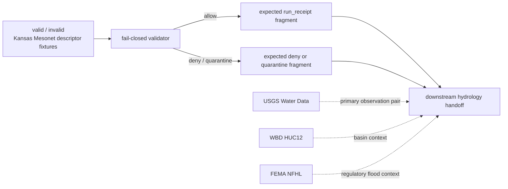

<!-- [KFM_META_BLOCK_V2]
doc_id: kfm://doc/NEEDS_VERIFICATION__kansas_mesonet_source_descriptor_fixtures_readme
title: Kansas Mesonet Source Descriptor Fixtures
type: standard
version: v1
status: draft
owners: @bartytime4life
created: NEEDS_VERIFICATION__YYYY-MM-DD
updated: NEEDS_VERIFICATION__YYYY-MM-DD
policy_label: NEEDS_VERIFICATION__public_or_internal
related: [../../../README.md, ../../../policy/README.md, ../../../reproducibility/README.md, ../../../../README.md, ../../../../contracts/README.md, ../../../../policy/README.md, ../../../../schemas/README.md, ../../../../schemas/contracts/v1/source/source_descriptor.schema.json, ../../../../.github/CODEOWNERS, ../../../../.github/workflows/README.md]
tags: [kfm, tests, fixtures, source-descriptor, mesonet, hydrology]
notes: [Owner is confirmed at the /tests/ scope via surfaced CODEOWNERS-backed repo-facing docs; exact leaf subtree, dates, policy label, and active-branch fixture inventory remain branch-level verification items. This README is intentionally fixture-facing and does not claim live watcher, workflow, or signing integration.]
[/KFM_META_BLOCK_V2] -->

# Kansas Mesonet Source Descriptor Fixtures

Deterministic, public-safe fixture lane for **Kansas Mesonet** `SourceDescriptor` examples used to prove source-admission, rights posture, and fail-closed validation without turning tests into a provider mirror.

> **Status:** `experimental`  
> **Owners:** `@bartytime4life` *(confirmed at `/tests/` scope in surfaced repo-facing docs; leaf-specific ownership should still be rechecked before merge)*  
> **Path:** `tests/fixtures/source/kansas_mesonet_source_descriptor/README.md`  
> **Repo fit:** child fixture README for `SourceDescriptor` examples inside the broader `tests/` verification boundary  
> **Quick jumps:** [Scope](#scope) · [Repo fit](#repo-fit) · [Accepted inputs](#accepted-inputs) · [Exclusions](#exclusions) · [Directory tree](#directory-tree) · [Quickstart](#quickstart) · [Usage](#usage) · [Diagram](#diagram) · [Operating tables](#operating-tables) · [Task list](#task-list--definition-of-done) · [FAQ](#faq) · [Appendix](#appendix)


> [!IMPORTANT]
> This README is **source-bounded** and **fixture-bounded**. It is written to fit the surfaced `tests/` documentation pattern and the current KFM source-descriptor doctrine. It does **not** prove that the active checkout already contains a full leaf subtree, runnable validators, merge-blocking coverage, or production automation.

> [!WARNING]
> **Kansas Mesonet is a valuable public connector, not a free-for-all ingestion surface.**  
> Keep checked-in examples tiny, reviewable, and rights-conscious. Do not let this directory become a silent archive of provider pulls or an end-run around documented usage constraints.

---

## Scope

This leaf exists to make one thing boring and reviewable:

> how **Kansas Mesonet** should first appear in KFM when it is admitted as a `SourceDescriptor` candidate.

That means this directory is the right place for fixture material that helps tests prove:

- source identity before fetch or scheduling
- source role before flattening into generic “sensor data”
- documented access mode before automation expands
- rights posture before ingest becomes habitual
- time, interval, and soil-depth semantics when those affect trust
- fail-closed allow/deny/quarantine behavior at the source-admission edge
- the boundary **fixture ≠ receipt ≠ proof ≠ catalog**

This directory is **not** the right place for:

- canonical schema authority
- live connector code
- hidden workflow logic
- release-grade proofs
- secret-bearing automation helpers
- full provider mirrors
- silent publication by convenience

### Truth labels used in this README

| Label | Meaning here |
| --- | --- |
| **CONFIRMED** | Supported by surfaced KFM doctrine, surfaced repo-facing docs, or currently documented Kansas Mesonet service/policy pages |
| **INFERRED** | Conservative reading that fits adjacent surfaces but is not directly proven as active-branch leaf reality |
| **PROPOSED** | Recommended fixture shape or growth pattern consistent with KFM doctrine but not asserted as mounted fact |
| **UNKNOWN** | Not surfaced strongly enough to describe as current repo reality |
| **NEEDS VERIFICATION** | Path, owner, file inventory, workflow wiring, or implementation detail that should be rechecked against the active branch before merge |

### Current evidence posture

| Surface | Status | Why it matters |
| --- | --- | --- |
| `tests/` as a governed verification boundary | **CONFIRMED** | Grounds this leaf as a proof-support surface rather than a generic data folder |
| `SourceDescriptor` as a first-wave contract family | **CONFIRMED** | This leaf should support source-admission proof, not invent a new source-object vocabulary |
| `schemas/contracts/v1/source/source_descriptor.schema.json` as visible schema-side adjacency | **CONFIRMED in surfaced repo-facing docs** | The nearest visible machine-contract neighbor is already named and should remain the authority target |
| Kansas Mesonet public REST/CSV surfaces and data-usage limits | **CONFIRMED** | These directly shape what safe fixtures may imply |
| Soil-moisture semantics relevant to Mesonet source admission | **CONFIRMED** | Depth, interval, VWC, and percent-saturation meaning are part of honest fixture design |
| Exact active-branch leaf inventory under this directory | **NEEDS VERIFICATION** | This README should not pretend to know files that were not surfaced directly |
| Exact owner/date/policy label for this leaf | **NEEDS VERIFICATION** | Metadata must be branch-backed before merge |
| Current validator, workflow, and scheduler wiring | **UNKNOWN / NEEDS VERIFICATION** | Documentation should not upgrade doctrine into implementation proof |

---

## Repo fit

**Path:** `tests/fixtures/source/kansas_mesonet_source_descriptor/README.md`  
**Role:** leaf README for public-safe source-admission fixtures under the broader KFM verification surface.

| Direction | Surface | Why it matters |
| --- | --- | --- |
| Parent verification boundary | [`tests/README.md`][tests-readme] | Keeps this leaf subordinate to the repo’s governed verification model |
| Neighboring test burden | [`tests/policy/README.md`][tests-policy-readme] | Policy-facing test work may consume fixtures from here, but policy truth does not originate here |
| Neighboring deterministic burden | [`tests/reproducibility/README.md`][tests-repro-readme] | Stable fixture content matters when replayability and digest checks are the burden |
| Root operating posture | [`README.md`][root-readme] | This leaf should read like native repo documentation, not like an isolated memo |
| Contract authority | [`contracts/README.md`][contracts-readme] | Contract meaning stays upstream from fixtures |
| Schema authority | [`schemas/README.md`][schemas-readme] | Fixtures should pressure-test schema law, not replace it |
| Schema companion target | [`schemas/contracts/v1/source/source_descriptor.schema.json`][source-schema] | The nearest surfaced machine-contract home for this family |
| Policy authority | [`policy/README.md`][policy-readme] | Fail-closed decision logic remains a policy-owned concern |
| Ownership boundary | [`.github/CODEOWNERS`][codeowners] | Final owner routing should be checked here before merge |
| Workflow boundary | [`.github/workflows/README.md`][workflows-readme] | This leaf should not imply hidden CI wiring that the branch does not prove |

> [!TIP]
> Keep the split visible: **fixture admission shape here, contract authority upstream, receipt emission in execution lanes, proof bundles downstream, and catalog closure later**.

---

## Accepted inputs

Content that belongs here should stay **small**, **explicit**, and **safe to review in Git**.

| Input class | Typical examples | Why it belongs here |
| --- | --- | --- |
| Valid descriptor fixture | one tiny YAML or JSON object for a public-safe Kansas Mesonet `SourceDescriptor` | proves the positive admission shape directly |
| Invalid descriptor fixture | missing rights posture, undocumented access mode, missing policy label, missing time basis | keeps negative states first-class |
| Access-surface note | tiny examples or metadata fragments naming `stationnames`, `stationactive`, `mostrecent`, or documented station-data pulls | keeps intake mode visible without mirroring the provider |
| Expected validation output | compact allow / deny / quarantine fragments, named reason codes, tiny `run_receipt` expectations | proves fail-closed behavior around the fixture |
| Tiny semantic support example | small fragments that preserve depth, interval, VWC, or percent-saturation meaning | prevents “soil moisture” from becoming semantically vague |
| Comparison context note | explicit role notes for **USGS Water Data**, **WBD HUC12**, and **FEMA NFHL** | keeps source-role separation visible in hydrology work |

### Input rules

1. Keep fixtures **small enough to review in a pull request**.
2. Keep **Kansas Mesonet** named explicitly; do not flatten it into generic “sensor data.”
3. Keep **access mode** explicit; documented REST/CSV use and prohibited automation are part of the burden.
4. Keep **time basis** explicit; stale-state logic collapses without observation windows or intervals.
5. Keep **depth and unit meaning** explicit when soil-moisture semantics appear.
6. Label anything derived as **derived**; do not let a normalized example masquerade as raw provider truth.
7. Preserve the boundary **fixture ≠ receipt ≠ proof ≠ catalog**.

> [!NOTE]
> The strongest current first-wave role for this leaf is **Kansas Mesonet** itself. Tiny comparison fixtures or context notes tied to **USGS Water Data**, **WBD HUC12**, or **FEMA NFHL** are useful only when they clarify source-role boundaries rather than widening this directory into a multi-source archive.

---

## Exclusions

| Does **not** belong here | Put it here instead | Why |
| --- | --- | --- |
| Canonical schema files | [`contracts/README.md`][contracts-readme] and [`schemas/README.md`][schemas-readme] | Fixtures should pressure-test schema authority, not replace it |
| Policy bundle source files or reviewer-role registries | [`policy/README.md`][policy-readme] | This leaf may support policy tests, but policy remains the source of truth |
| Full Kansas Mesonet pulls or scrape caches | governed data zones or local ignored paths | Public fixture surfaces should stay tiny and rights-conscious |
| Live connector code, workflow YAML, or scheduler configuration | watcher / pipeline / tool lanes on the active branch | A fixture README is not implementation proof |
| Release manifests, signed proofs, SBOMs, or promoted artifacts as primary records | governed receipt / proof / release surfaces | A fixture example is not the authoritative trust object |
| Secrets, API credentials, or consent-sensitive helpers | secret manager / host configuration | Public test paths must remain safe to clone and review |
| One-off analyst scratch files | local ignored paths | Checked-in fixtures should be reusable and reviewable |
| “Convenience dumps” of live provider data | nowhere in this lane | That would blur fixture practice into silent mirroring |

> [!CAUTION]
> Do not commit a full provider snapshot here just because it is easy to fetch.  
> The goal is the **smallest meaningful proof slice**, not the largest convenient archive.

---

## Directory tree

### Current safe claim

```text
tests/fixtures/source/kansas_mesonet_source_descriptor/
└── README.md
```

That is the only subtree claim this README can make safely without direct branch inspection of this exact leaf.

<details>
<summary><strong>Possible stable growth shape</strong> (<strong>PROPOSED</strong>)</summary>

```text
tests/fixtures/source/kansas_mesonet_source_descriptor/
├── README.md
├── valid/
│   └── descriptor.public_safe.yaml
├── invalid/
│   ├── descriptor.missing_rights.yaml
│   ├── descriptor.undocumented_access_mode.yaml
│   └── descriptor.missing_time_basis.yaml
└── expected/
    ├── run_receipt.allow.json
    └── run_receipt.deny.json
```

Working rule: add the **smallest real pair** first — one valid fixture and one invalid fixture named by failure reason — before inventing broader subtrees.

</details>

---

## Quickstart

### Safe inspection commands

These commands are safe because they inspect the current branch shape without assuming a hidden runner, live workflow, or unverified subtree.

```bash
# inspect the exact leaf as the checked-out branch exposes it
find tests/fixtures/source/kansas_mesonet_source_descriptor -maxdepth 4 -type f 2>/dev/null | sort

# re-read the family and authority surfaces before editing this leaf
sed -n '1,260p' tests/README.md 2>/dev/null || true
sed -n '1,220p' tests/policy/README.md 2>/dev/null || true
sed -n '1,220p' tests/reproducibility/README.md 2>/dev/null || true
sed -n '1,260p' contracts/README.md 2>/dev/null || true
sed -n '1,260p' schemas/README.md 2>/dev/null || true
sed -n '1,260p' schemas/contracts/v1/README.md 2>/dev/null || true
sed -n '1,220p' policy/README.md 2>/dev/null || true
sed -n '1,220p' .github/CODEOWNERS 2>/dev/null || true
sed -n '1,220p' .github/workflows/README.md 2>/dev/null || true
```

### Fast drift check

Use this before inventing new field families or renaming the source role casually:

```bash
git grep -n \
  -e 'Kansas Mesonet' \
  -e 'SourceDescriptor' \
  -e 'source_descriptor.schema' \
  -e 'USGS Water Data' \
  -e 'WBD HUC12' \
  -e 'FEMA NFHL' \
  -- tests contracts schemas policy docs .github 2>/dev/null || true
```

### Parent-path sanity check

If a parent `tests/fixtures/README.md` or `tests/fixtures/source/README.md` exists on the active branch, add it here only after direct reinspection.

```bash
find tests/fixtures -maxdepth 3 -name README.md 2>/dev/null | sort
```

---

## Usage

### What this leaf is trying to prove

A healthy first-wave fixture in this directory should make the following obvious:

- **Kansas Mesonet** enters as a **direct observation / measurement** source, not as regulatory truth or modeled output
- documented access starts from the public REST/CSV surfaces, not from page scraping
- public use is citation-bearing and data are preliminary
- automated page scraping or data ingesting without written consent is not silently normalized as acceptable
- soil-moisture semantics stay explicit when used: interval, depth, VWC, and percent-saturation meaning do not blur
- allow / deny / quarantine behavior can be tested without pretending the fixture itself is a release object

### Working rule for adding or revising a fixture

1. Start with the **smallest meaningful descriptor case**.
2. Name the file by **behavior or failure reason**, not by a vague bucket.
3. Keep the source role and access mode visible in the fixture itself.
4. If the fixture exercises soil-moisture semantics, keep **depth** and **unit** explicit.
5. Add an expected allow / deny fragment only when a test actually consumes it.
6. Do not let a fixture imply live watcher, scheduler, signing, or publish-path maturity that the branch does not prove.

### Naming guidance

| Good name | Why it helps |
| --- | --- |
| `descriptor.public_safe.yaml` | positive case is obvious |
| `descriptor.missing_rights.yaml` | failure reason is obvious |
| `descriptor.undocumented_access_mode.yaml` | usage-policy burden stays visible |
| `descriptor.missing_time_basis.yaml` | stale-state burden remains explicit |
| `run_receipt.deny.json` | expected negative-path artifact is legible |

Avoid vague names like `sample.yaml`, `mesonet2.json`, or `tmp_fixture.csv`.

---

## Diagram



> [!NOTE]
> The point of this leaf is not to finish hydrology by itself.  
> Its job is to make the **source-admission seam** concrete and reviewable.

---

## Operating tables

### Descriptor summary

| Field family | Fixture expectation | Status |
| --- | --- | --- |
| Source title | `Kansas Mesonet` | **CONFIRMED** |
| Source family | public station-observation source family with documented REST/CSV access surfaces | **CONFIRMED** |
| KFM source role | `direct observation / measurement` | **CONFIRMED** |
| First-wave lane fit | complementary Kansas station context in the hydrology proof slice | **CONFIRMED** |
| Exact machine `source_id` | final identifier not surfaced for this leaf | **NEEDS VERIFICATION** |
| Immediate semantic burden | station context, soil-moisture context, and local environmental observation support | **INFERRED** |
| Publication intent | support governed hydrology/context releases; raw Mesonet visibility is not publication | **CONFIRMED / INFERRED** |
| Auth model for surfaced public pages | no auth requirement documented on the public pages reviewed here | **CONFIRMED for surfaced pages** |
| Conditional-fetch guarantees | no uniform `ETag` / `Last-Modified` guarantee should be assumed here | **NEEDS VERIFICATION** |
| Rights posture | public use/download with citation; preliminary data; explicit automation constraints | **CONFIRMED** |
| Bulk or unattended ingest posture | must remain policy-gated and consent-aware | **CONFIRMED / INFERRED** |
| Exact steward approval path | not surfaced in the current working evidence | **UNKNOWN** |

### Neighboring hydrology/context sources

| Source | Role in first-wave hydrology work | Keep visible |
| --- | --- | --- |
| **USGS Water Data** | primary watched hydrology observation family | federal hydrology observation role |
| **Kansas Mesonet** | complementary Kansas station and soil-moisture context | Kansas-first station / soil-moisture role |
| **WBD HUC12** | hydrologic grouping and basin context | boundary / grouping context, not observation |
| **FEMA NFHL** | regulatory flood context | regulatory status, not live inundation |

### Documented access surfaces

| Surface | Use | Status | Notes |
| --- | --- | --- | --- |
| [`RESTful Services`][mesonet-rest] | primary service documentation / entry surface | **CONFIRMED** | treat as the starting point for documented access patterns |
| `rest/url-builder/` | request-construction helper for station observations | **CONFIRMED** | documented station-observation pulls require explicit parameters and are limited to 3000 records per request |
| `rest/stationnames/` | station roster and basic station metadata | **CONFIRMED** | useful for source-side roster context |
| `rest/stationactive/` | station activity window / recency context | **CONFIRMED** | exposes observation interval in seconds plus first/most-recent timestamps |
| `rest/mostrecent` | most recent ingested data by interval family | **CONFIRMED** | useful for freshness and watcher health checks |
| [`Data Usage Policy`][mesonet-usage] | rights, citation, and prohibited automation behavior | **CONFIRMED** | public use/download is allowed with citation; automated page scraping or data ingesting without written consent is prohibited |
| [`About Soil Moisture`][mesonet-soil-data] | soil-moisture collection method and standardized depths | **CONFIRMED** | states four standardized depths: 5, 10, 20, and 50 cm |
| [`Using Soil Moisture Page`][mesonet-soil-page] | page semantics for VWC, percent saturation, and downloadable artifacts | **CONFIRMED** | keeps quantity meaning and download posture explicit |

### Minimum gate set

| Check family | What should pass | What should deny or quarantine |
| --- | --- | --- |
| Identity | source title, role, reference surface, and policy posture are explicit | missing source identity or missing rights posture |
| Access mode | fixture uses documented surfaces | page scraping or undocumented collection pattern treated as ordinary |
| Time basis | interval and observed window are explicit where relevant | ambiguous interval, unordered timestamps, or silent clock mixing |
| Station support | station identifiers or roster logic are explicit when included | unnamed or unresolvable station context |
| Unit / depth semantics | VWC / percent saturation and depth basis remain explicit | mixed quantity kinds, missing units, or missing depth basis |
| Preliminary-data posture | QC mutability and access time remain visible | presentation that implies immutable final truth |
| Policy label | candidate batch carries an explicit policy label when required by downstream validation | missing or ambiguous policy label |
| Receipt discipline | expected `run_receipt` fragment exists on allow and deny paths when tests require it | validation path with no machine-readable outcome artifact |
| Handoff discipline | promotion handoff appears only after successful validation | silent promotion after failed or incomplete checks |

### Recommended first quarantine triggers

- missing source identity
- missing rights or automation posture
- undocumented acquisition mode
- ambiguous time window
- missing interval basis
- missing units or soil-depth semantics where relevant
- malformed station-roster mapping
- absent expected `run_receipt` where the test requires one
- promotion handoff attempted after validation failure

[Back to top](#kansas-mesonet-source-descriptor-fixtures)

---

## Task list / definition of done

Treat this README as healthy only when it stays both readable and truthful.

- [ ] Verify whether `tests/fixtures/source/kansas_mesonet_source_descriptor/` already exists on the active branch beyond this README.
- [ ] Replace placeholder `doc_id`, `created`, `updated`, and `policy_label` values with repo-backed metadata.
- [ ] Reconfirm that `/tests/` ownership still resolves to `@bartytime4life` for this leaf on the active branch.
- [ ] Verify that the schema companion path is still [`schemas/contracts/v1/source/source_descriptor.schema.json`][source-schema].
- [ ] Land one **valid** and one **invalid** descriptor fixture before widening the subtree.
- [ ] Add at least one positive and one negative expected `run_receipt` fragment only if a real validator consumes them.
- [ ] Keep any real provider-derived slices tiny enough for pull-request review.
- [ ] Verify that this README does not imply workflow YAML, branch protection, or mounted automation the branch does not prove.
- [ ] Keep source-role clarity visible beside **USGS Water Data**, **WBD HUC12**, and **FEMA NFHL**.

### Definition of done

This leaf is ready to move from `draft` toward `review` when all of the following are true:

1. the active checkout clearly proves the leaf subtree
2. at least one valid and one invalid fixture exist
3. failure reasons are named cleanly in filenames
4. a repo-backed schema companion is directly surfaced
5. any receipt-adjacent expected outputs remain clearly distinct from proof bundles
6. the leaf does not become a hidden provider archive
7. placeholders in the meta block are replaced with real values
8. the README no longer implies workflow, signing, or storage maturity that the branch does not prove

[Back to top](#kansas-mesonet-source-descriptor-fixtures)

---

## FAQ

### Why keep this under `tests/fixtures/` instead of a data folder?

Because the primary job here is **verification support**, not data custody. These files should help tests prove behavior, not become the authoritative home of source data.

### Why keep saying **Kansas Mesonet** instead of just “soil sensors”?

Because KFM doctrine treats source roles as admission contracts, not decorative labels. A **Kansas Mesonet** REST endpoint, **USGS Water Data** series, **WBD HUC12** boundary, and **FEMA NFHL** regulatory layer do not enter under the same trust conditions.

### Does this lane own `run_receipt` or proof objects?

No. It may contain tiny expected-output fragments that help tests prove downstream handoff, but **receipt**, **proof**, and **catalog** roles should remain visibly distinct.

### Does this README prove live automation already exists?

No. It documents a truthful fixture-lane shape that fits the surfaced doctrine and repo-facing patterns. Runner wiring, workflow YAML, scheduler details, and signed publication behavior still need direct branch verification.

### Should this lane commit full Kansas Mesonet pulls?

No. That would blur the line between a fixture lane and a provider mirror, and it would make rights, attribution, and review posture harder to manage.

### Why keep mentioning usage constraints?

Because the surfaced source documentation explicitly makes them part of the source contract. Fixture practice should reflect that instead of quietly ignoring it.

[Back to top](#kansas-mesonet-source-descriptor-fixtures)

---

## Appendix

<details>
<summary><strong>Illustrative fixtures</strong> (<strong>illustrative only</strong>)</summary>

These examples are here to make the lane concrete without pretending the final checked-in filenames or field names are already verified.

### Minimal valid descriptor sketch

```yaml
version: v1
kind: SourceDescriptor

identity:
  source_id: NEEDS_VERIFICATION__kansas_mesonet
  title: Kansas Mesonet
  provider: Kansas Mesonet / Kansas State University

role_and_scope:
  source_role: direct_observation_measurement
  primary_lane: hydrology
  publication_intent: station_context

access:
  mode: public_http_csv
  auth_model: none_documented
  preferred_surfaces:
    - rest/url-builder/
    - rest/stationnames/
    - rest/stationactive/
    - rest/mostrecent

rights_and_sensitivity:
  public_use_with_citation: true
  redistribution_posture: NEEDS_VERIFICATION
  automation_constraints:
    - written_consent_required_for_automated_page_scraping_or_data_ingesting

support:
  temporal:
    documented_intervals: [5min, hour, day]
  soil_moisture_depths_cm: [5, 10, 20, 50]
  quantity_kinds:
    - VWC
    - percent_saturation

validation:
  required_checks:
    - source_identity_present
    - documented_surface_only
    - interval_explicit
    - policy_gate_for_automation
```

### Minimal invalid descriptor sketch

```yaml
version: v1
kind: SourceDescriptor

identity:
  title: Kansas Mesonet

access:
  mode: page_scrape

support:
  temporal: {}

# invalid because:
# - source_id missing
# - rights posture missing
# - undocumented access mode normalized as ordinary
# - temporal basis absent
```

### Review questions before merge

- Is this still the **smallest meaningful fixture**?
- Does the filename name the behavior or failure reason clearly?
- Is the source role explicit?
- Is the access mode explicit?
- Did we accidentally commit a provider mirror instead of a fixture?
- Did we preserve the boundary **fixture ≠ receipt ≠ proof ≠ catalog**?
- Does the README say anything about workflows, signing, or storage that the branch still does not prove?

</details>

[Back to top](#kansas-mesonet-source-descriptor-fixtures)

[tests-readme]: ../../../README.md
[tests-policy-readme]: ../../../policy/README.md
[tests-repro-readme]: ../../../reproducibility/README.md
[root-readme]: ../../../../README.md
[contracts-readme]: ../../../../contracts/README.md
[policy-readme]: ../../../../policy/README.md
[schemas-readme]: ../../../../schemas/README.md
[source-schema]: ../../../../schemas/contracts/v1/source/source_descriptor.schema.json
[codeowners]: ../../../../.github/CODEOWNERS
[workflows-readme]: ../../../../.github/workflows/README.md
[mesonet-rest]: https://mesonet.k-state.edu/rest/
[mesonet-usage]: https://mesonet.k-state.edu/about/usage/
[mesonet-soil-data]: https://mesonet.k-state.edu/about/soilmoist/data/
[mesonet-soil-page]: https://mesonet.k-state.edu/about/soilmoist/page/
