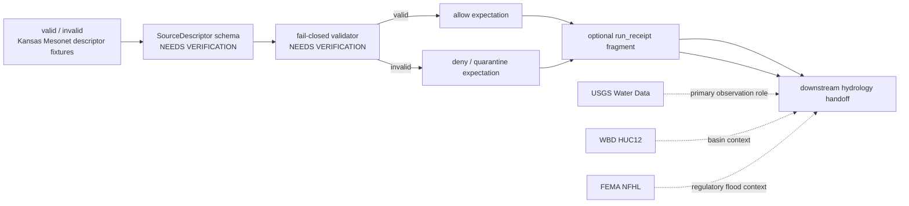

<!-- [KFM_META_BLOCK_V2]
doc_id: kfm://doc/NEEDS_VERIFICATION__kansas_mesonet_source_descriptor_fixtures_readme
title: Kansas Mesonet Source Descriptor Fixtures
type: standard
version: v1
status: draft
owners: NEEDS_VERIFICATION__owner_or_team
created: NEEDS_VERIFICATION__YYYY-MM-DD
updated: 2026-04-27
policy_label: NEEDS_VERIFICATION__public_or_internal
related: [../../../README.md, ../../README.md, ../README.md, ../../../../README.md, ../../../../contracts/README.md, ../../../../schemas/README.md, ../../../../schemas/contracts/v1/source/source_descriptor.schema.json, ../../../../policy/README.md, ../../../../.github/CODEOWNERS, ../../../../.github/workflows/README.md]
tags: [kfm, tests, fixtures, source-descriptor, kansas-mesonet, hydrology, soil-moisture]
notes: [Fixture-facing README for the Kansas Mesonet SourceDescriptor leaf. Active branch inventory, owner assignment, created date, policy label, schema-home authority, validator wiring, workflow wiring, and fixture filenames remain NEEDS VERIFICATION. This document does not claim live watcher, signing, promotion, or public-release behavior.]
[/KFM_META_BLOCK_V2] -->

<a id="top"></a>

# Kansas Mesonet Source Descriptor Fixtures

Deterministic, public-safe fixture lane for **Kansas Mesonet** `SourceDescriptor` examples used to prove source admission, rights posture, access-mode discipline, and fail-closed validation.

> [!NOTE]
> **Status:** `experimental`  
> **Document status:** `draft`  
> **Owners:** `NEEDS_VERIFICATION__owner_or_team`  
> **Path:** `tests/fixtures/source/kansas_mesonet_source_descriptor/README.md`  
> **Repo fit:** child fixture README under `tests/fixtures/source/`; supports source-descriptor validation without becoming a provider mirror  
> **Quick jumps:** [Scope](#scope) · [Repo fit](#repo-fit) · [Accepted inputs](#accepted-inputs) · [Exclusions](#exclusions) · [Directory tree](#directory-tree) · [Quickstart](#quickstart) · [Usage](#usage) · [Diagram](#diagram) · [Operating tables](#operating-tables) · [Task list](#task-list--definition-of-done) · [FAQ](#faq) · [Appendix](#appendix)


> [!IMPORTANT]
> This README is **fixture-bounded** and **source-bounded**. It may describe the intended fixture seam, validation expectations, and review burden for Kansas Mesonet descriptors. It does **not** prove that the active checkout already contains sibling fixtures, runnable validators, workflow YAML, signing, branch protection, scheduled ingestion, or public release wiring.

> [!WARNING]
> **Kansas Mesonet is a valuable public source, not a free-for-all ingest surface.** Keep citation, preliminary-data posture, and automation constraints visible in every descriptor fixture that relies on this source family.

---

## Scope

This leaf exists to make **Kansas Mesonet source admission** concrete enough to test.

A healthy fixture here helps reviewers answer:

- Does the descriptor name **Kansas Mesonet** explicitly?
- Does it preserve the source role as `direct_observation_measurement` rather than regulatory, modeled, or catalog truth?
- Does it use documented REST/CSV surfaces instead of normalizing page scraping as acceptable?
- Does it carry rights, citation, preliminary-data, and automation posture?
- Does it keep interval, station, unit, depth, and quantity semantics visible where soil moisture appears?
- Does fail-closed behavior produce a clear allow, deny, or quarantine expectation?

This directory is **not** a data custody location and not the canonical source registry.

[Back to top](#top)

---

## Repo fit

| Surface | Relationship | Status |
| --- | --- | --- |
| `tests/fixtures/source/kansas_mesonet_source_descriptor/` | target fixture leaf | **NEEDS VERIFICATION** beyond this README |
| [`tests/README.md`][tests-readme] | broader test boundary and ownership convention | **NEEDS VERIFICATION** in active checkout |
| [`tests/fixtures/README.md`][fixtures-readme] | fixture-family guidance | **NEEDS VERIFICATION** |
| [`tests/fixtures/source/README.md`][source-fixtures-readme] | source-fixture parent | **NEEDS VERIFICATION** |
| [`schemas/contracts/v1/source/source_descriptor.schema.json`][source-schema] | intended schema companion for `SourceDescriptor` fixtures | **NEEDS VERIFICATION** |
| [`contracts/README.md`][contracts-readme] / [`schemas/README.md`][schemas-readme] | schema and contract authority context | **NEEDS VERIFICATION** |
| [`policy/README.md`][policy-readme] | policy source of truth; this leaf may only exercise policy behavior | **NEEDS VERIFICATION** |
| `.github/workflows/` | possible CI execution surface | **UNKNOWN** until workflow files are inspected |
| downstream receipts / proofs / catalogs | downstream trust objects; not owned here | **PROPOSED** relationship only |

> [!TIP]
> Keep the split visible: **fixture ≠ receipt ≠ proof ≠ catalog**. This leaf can pressure-test admission and failure behavior, but it must not become the release-proof or publication surface.

[Back to top](#top)

---

## Accepted inputs

The following belong here when they are small, reviewable, and intentionally shaped for tests.

| Accepted input | Why it belongs | Required posture |
| --- | --- | --- |
| Minimal valid Kansas Mesonet `SourceDescriptor` fixture | proves the happy path for source admission | source role, rights, access mode, and citation posture visible |
| Minimal invalid descriptor fixture | proves fail-closed validation | failure reason named in filename and fixture content |
| Tiny expected `run_receipt` fragment | helps tests prove allow/deny/quarantine outcomes | only when an actual validator consumes it |
| Tiny station or access-surface note | clarifies source-role or station-context semantics | not a live provider mirror |
| Soil-moisture semantics fixture | preserves depth, VWC, percent-saturation, interval, and unit meaning | explicit `depth_cm`, `quantity_kind`, `unit`, and time basis |
| Neighbor-source comparison note | keeps **USGS Water Data**, **WBD HUC12**, and **FEMA NFHL** roles distinct | comparison only; do not widen this leaf into a hydrology archive |

### Input rules

1. Keep fixtures **small enough for pull-request review**.
2. Keep **Kansas Mesonet** named; do not flatten it into generic “sensor data.”
3. Keep **access mode** explicit.
4. Keep **time basis** explicit.
5. Keep soil-moisture **depth and unit meaning** explicit.
6. Label derived examples as derived.
7. Preserve the boundary **fixture ≠ receipt ≠ proof ≠ catalog**.
8. Do not imply live automation or publication maturity from static fixtures.

[Back to top](#top)

---

## Exclusions

| Does **not** belong here | Put it here instead | Why |
| --- | --- | --- |
| Full Kansas Mesonet pulls or scrape caches | governed data zones or ignored local paths | public test fixtures should not become a hidden provider mirror |
| Live connector code | watcher, pipeline, or tool lanes on the active branch | this README cannot prove runner or scheduler behavior |
| Workflow YAML or scheduler configuration | `.github/workflows/` or repo-native orchestration paths | fixture docs are not CI implementation proof |
| Canonical schema definitions | [`schemas/README.md`][schemas-readme] or [`contracts/README.md`][contracts-readme] | fixtures test schemas; they do not define schema authority |
| Policy source files | [`policy/README.md`][policy-readme] | policy remains the source of truth |
| Release manifests, signed proof bundles, SBOMs, or promoted artifacts | governed proof, release, or catalog surfaces | fixture examples are not release-significant trust objects |
| Secrets, credentials, consent tokens, or scraping helpers | secret manager / host configuration | public test paths must remain safe to clone |
| Analyst scratch files | ignored local paths | checked-in fixtures should be reusable and deterministic |
| “Convenience dumps” of provider data | nowhere in this leaf | easy fetches are not automatically admissible fixtures |

> [!CAUTION]
> Do not commit a large provider snapshot here just because it is easy to fetch. The target is the **smallest meaningful proof slice**, not the largest convenient archive.

[Back to top](#top)

---

## Directory tree

### Current safe claim

```text
tests/fixtures/source/kansas_mesonet_source_descriptor/
└── README.md
```

This README does not claim that sibling fixtures already exist on the active branch.

<details>
<summary><strong>Possible stable growth shape</strong> (<strong>PROPOSED</strong>)</summary>

```text
tests/fixtures/source/kansas_mesonet_source_descriptor/
├── README.md
├── valid/
│   └── descriptor.public_safe.yaml
├── invalid/
│   ├── descriptor.missing_rights.yaml
│   ├── descriptor.undocumented_access_mode.yaml
│   └── descriptor.missing_time_basis.yaml
└── expected/
    ├── run_receipt.allow.json
    └── run_receipt.deny.json
```

Use this only after direct branch inspection confirms local naming conventions, schema paths, and validator expectations.

</details>

[Back to top](#top)

---

## Quickstart

Run these checks from the repository root before adding or revising fixtures.

```bash
git status --short
find tests/fixtures/source/kansas_mesonet_source_descriptor -maxdepth 3 -type f 2>/dev/null | sort
test -f schemas/contracts/v1/source/source_descriptor.schema.json && echo "source descriptor schema present"
```

Then use the smallest safe fixture sequence.

```text
descriptor fixture
  -> schema validation
  -> fail-closed policy/validator check
  -> expected allow / deny / quarantine fragment
  -> downstream receipt or hydrology handoff test
```

> [!NOTE]
> The commands above are inspection commands only. They do not fetch Kansas Mesonet data, create provider mirrors, write receipts, sign artifacts, or publish releases.

[Back to top](#top)

---

## Usage

### What this leaf is trying to prove

A first-wave fixture in this directory should make these truths easy to inspect:

- **Kansas Mesonet** enters as a `direct_observation_measurement` source.
- Documented REST/CSV access is different from page scraping.
- Public use remains citation-bearing and preliminary-data-aware.
- Automated page scraping or data ingesting without written consent is not silently normalized as acceptable.
- Soil-moisture semantics stay explicit when used: interval, depth, VWC, and percent saturation do not blur.
- Allow / deny / quarantine behavior can be tested without pretending that a fixture is a release artifact.

### Working rule for adding or revising a fixture

1. Start with the **smallest meaningful descriptor case**.
2. Name the file by **behavior or failure reason**.
3. Keep the source role and access mode visible in the fixture.
4. If soil moisture is included, keep `depth_cm`, `quantity_kind`, `unit`, and `observed_window` explicit.
5. Add expected allow / deny fragments only when tests consume them.
6. Never use a fixture to imply live watcher, scheduler, signing, catalog, or publication maturity.

### Naming guidance

| Good name | Why it helps |
| --- | --- |
| `descriptor.public_safe.yaml` | positive case is obvious |
| `descriptor.missing_rights.yaml` | failure reason is obvious |
| `descriptor.undocumented_access_mode.yaml` | usage-policy burden stays visible |
| `descriptor.missing_time_basis.yaml` | time-window burden remains explicit |
| `run_receipt.deny.json` | expected negative-path artifact is legible |

Avoid vague names like `sample.yaml`, `mesonet2.json`, `data.csv`, or `tmp_fixture.json`.

[Back to top](#top)

---

## Diagram



> [!NOTE]
> The point of this leaf is not to finish hydrology. Its job is to make the **source-admission seam** concrete, small, and reviewable.

[Back to top](#top)

---

## Operating tables

### Descriptor summary

| Field family | Fixture expectation | Status |
| --- | --- | --- |
| Source title | `Kansas Mesonet` | **CONFIRMED** |
| Source family | public station-observation source family with documented REST/CSV access surfaces | **CONFIRMED** |
| KFM source role | `direct_observation_measurement` | **CONFIRMED / PROJECT-DOCTRINE** |
| First-wave lane fit | complementary Kansas station context in hydrology and soil-moisture work | **CONFIRMED / INFERRED** |
| Exact machine `source_id` | final identifier for this repo leaf | **NEEDS VERIFICATION** |
| Immediate semantic burden | station context, soil-moisture context, local environmental observations | **INFERRED** |
| Publication intent | support governed hydrology/context releases; raw Mesonet visibility is not publication | **CONFIRMED / INFERRED** |
| Auth model for public docs | no auth requirement is documented for the referenced public pages | **CONFIRMED for referenced pages** |
| Conditional-fetch guarantees | do not assume uniform `ETag` or `Last-Modified` behavior | **NEEDS VERIFICATION** |
| Rights posture | public use/download with citation; preliminary data; explicit automation constraints | **CONFIRMED** |
| Bulk or unattended ingest posture | policy-gated and consent-aware | **CONFIRMED / INFERRED** |
| Exact steward approval path | not surfaced in current workspace evidence | **UNKNOWN** |

### Neighboring hydrology/context sources

| Source | Role in first-wave hydrology work | Keep visible |
| --- | --- | --- |
| **USGS Water Data** | primary watched hydrology observation family | federal hydrology observation role |
| **Kansas Mesonet** | complementary Kansas station and soil-moisture context | Kansas-first station / soil-moisture role |
| **WBD HUC12** | hydrologic grouping and basin context | boundary / grouping context, not observation |
| **FEMA NFHL** | regulatory flood context | regulatory status, not live inundation |

### Documented access surfaces

| Surface | Use | Status | Fixture consequence |
| --- | --- | --- | --- |
| [`RESTful Services`][mesonet-rest] | primary service documentation / CSV entry surface | **CONFIRMED** | fixtures should point to documented service surfaces |
| `rest/url-builder/` | request-construction helper for station observations | **CONFIRMED** | include interval and time-window burden when used |
| `rest/stationnames/` | station roster and basic station metadata | **CONFIRMED** | useful for station-context validation |
| `rest/stationactive/` | station activity window / recency context | **CONFIRMED** | useful for first/most-recent timestamp checks |
| `rest/mostrecent` | most recent ingested data by interval family | **CONFIRMED** | useful for freshness fixtures |
| [`Data Usage Policy`][mesonet-usage] | rights, citation, preliminary-data, and automation posture | **CONFIRMED** | fixture must not normalize prohibited automation as acceptable |
| [`About Soil Moisture`][mesonet-soil-data] | soil-moisture collection method and standardized depths | **CONFIRMED** | preserve 5, 10, 20, and 50 cm depth semantics |
| [`Using Soil Moisture Page`][mesonet-soil-page] | VWC, percent saturation, map/table/download semantics | **CONFIRMED** | do not mix VWC and percent saturation without qualifier |

### Minimum gate set

| Check family | What should pass | What should deny or quarantine |
| --- | --- | --- |
| Identity | source title, role, reference surface, and policy posture are explicit | missing source identity or missing rights posture |
| Access mode | fixture uses documented surfaces | page scraping or undocumented collection pattern treated as ordinary |
| Time basis | interval and observed window are explicit where relevant | ambiguous interval, unordered timestamps, or silent clock mixing |
| Station support | station identifiers or roster logic are explicit when included | unnamed or unresolvable station context |
| Unit / depth semantics | VWC / percent saturation and depth basis remain explicit | mixed quantity kinds, missing units, or missing depth basis |
| Preliminary-data posture | QC mutability and access time remain visible | presentation that implies immutable final truth |
| Policy label | candidate batch carries explicit policy label when required by downstream validation | missing or ambiguous policy label |
| Receipt discipline | expected `run_receipt` fragment exists on allow and deny paths when tests require it | validation path with no machine-readable outcome artifact |
| Handoff discipline | promotion handoff appears only after successful validation | silent promotion after failed or incomplete checks |

### Recommended first quarantine triggers

- missing source identity
- missing rights or automation posture
- undocumented acquisition mode
- ambiguous time window
- missing interval basis
- missing units or soil-depth semantics where relevant
- malformed station-roster mapping
- absent expected `run_receipt` where the test requires one
- promotion handoff attempted after validation failure

[Back to top](#top)

---

## Task list / definition of done

Treat this README as healthy only when it remains readable, bounded, and truthful.

- [ ] Verify whether `tests/fixtures/source/kansas_mesonet_source_descriptor/` already exists on the active branch beyond this README.
- [ ] Replace placeholder `doc_id`, `created`, `owners`, and `policy_label` values with repo-backed metadata.
- [ ] Verify leaf ownership through [`CODEOWNERS`][codeowners] or the repo’s documented ownership surface.
- [ ] Verify that the schema companion path is still [`schemas/contracts/v1/source/source_descriptor.schema.json`][source-schema].
- [ ] Land one **valid** and one **invalid** descriptor fixture before widening the subtree.
- [ ] Add positive and negative expected `run_receipt` fragments only if a real validator consumes them.
- [ ] Keep real provider-derived slices tiny enough for pull-request review.
- [ ] Verify that this README does not imply workflow YAML, branch protection, scheduler, signing, or mounted automation that the branch does not prove.
- [ ] Keep source-role clarity visible beside **USGS Water Data**, **WBD HUC12**, and **FEMA NFHL**.

### Definition of done

This leaf is ready to move from `draft` toward `review` when all of the following are true:

1. the active checkout clearly proves the leaf subtree
2. at least one valid and one invalid fixture exist
3. failure reasons are named cleanly in filenames
4. a repo-backed schema companion is directly surfaced
5. any receipt-adjacent expected outputs remain clearly distinct from proof bundles
6. the leaf does not become a hidden provider archive
7. placeholders in the meta block are replaced with real values
8. the README no longer implies workflow, signing, or storage maturity that the branch does not prove

[Back to top](#top)

---

## FAQ

### Why keep this under `tests/fixtures/` instead of a data folder?

Because the primary job here is **verification support**, not data custody. These files should help tests prove behavior, not become the authoritative home of source data.

### Why keep saying **Kansas Mesonet** instead of just “soil sensors”?

Because KFM treats source roles as admission contracts, not decorative labels. A **Kansas Mesonet** REST endpoint, **USGS Water Data** series, **WBD HUC12** boundary, and **FEMA NFHL** regulatory layer do not enter under the same trust conditions.

### Does this leaf own `run_receipt` or proof objects?

No. It may contain tiny expected-output fragments that help tests prove downstream handoff, but **receipt**, **proof**, and **catalog** roles should remain visibly distinct.

### Does this README prove live automation already exists?

No. It documents the fixture burden and preferred shape of the leaf. Runner wiring, workflow YAML, scheduler details, signed publication behavior, and branch protections still need direct branch verification.

### Should this leaf commit full Kansas Mesonet pulls?

No. That would blur the line between a fixture lane and a provider mirror, and it would make rights, attribution, and review posture harder to maintain.

### Why keep mentioning usage constraints?

Because source usage constraints are part of the source contract. Fixture practice should preserve them instead of quietly ignoring them.

[Back to top](#top)

---

## Appendix

<details>
<summary><strong>Illustrative fixtures</strong> (<strong>illustrative only</strong>)</summary>

These examples make the lane concrete without pretending the final filenames, field names, or schema enum values are already verified.

### Minimal valid descriptor sketch

```yaml
version: v1
kind: SourceDescriptor

identity:
  source_id: NEEDS_VERIFICATION__kansas_mesonet
  title: Kansas Mesonet
  provider: Kansas Mesonet / Kansas State University

role_and_scope:
  source_role: direct_observation_measurement
  primary_lane: hydrology
  publication_intent: station_context

access:
  mode: public_http_csv
  auth_model: none_documented_for_referenced_public_pages
  preferred_surfaces:
    - rest/url-builder/
    - rest/stationnames/
    - rest/stationactive/
    - rest/mostrecent

rights_and_sensitivity:
  public_use_with_citation: true
  redistribution_posture: NEEDS_VERIFICATION
  policy_label_default: NEEDS_VERIFICATION__public_or_internal
  automation_constraints:
    - written_consent_required_for_automated_page_scraping_or_data_ingesting

support:
  temporal:
    documented_intervals: [5min, hour, day]
  soil_moisture_depths_cm: [5, 10, 20, 50]
  quantity_kinds:
    - VWC
    - percent_saturation

validation:
  required_checks:
    - source_identity_present
    - documented_surface_only
    - interval_explicit
    - policy_gate_for_automation
    - rights_posture_present
```

### Minimal invalid descriptor sketch

```yaml
version: v1
kind: SourceDescriptor

identity:
  title: Kansas Mesonet

access:
  mode: page_scrape

support:
  temporal: {}

# invalid because:
# - source_id missing
# - rights posture missing
# - access mode normalizes undocumented/page-scrape behavior
# - temporal basis absent
```

### Review questions before merge

- Is this still the **smallest meaningful fixture**?
- Does the filename name the behavior or failure reason clearly?
- Is the source role explicit?
- Is the access mode explicit?
- Did we accidentally commit a provider mirror instead of a fixture?
- Did we preserve the boundary **fixture ≠ receipt ≠ proof ≠ catalog**?
- Does the README say anything about workflows, signing, or storage that the branch still does not prove?

</details>

[Back to top](#top)

[tests-readme]: ../../../README.md
[fixtures-readme]: ../../README.md
[source-fixtures-readme]: ../README.md
[root-readme]: ../../../../README.md
[contracts-readme]: ../../../../contracts/README.md
[schemas-readme]: ../../../../schemas/README.md
[source-schema]: ../../../../schemas/contracts/v1/source/source_descriptor.schema.json
[policy-readme]: ../../../../policy/README.md
[codeowners]: ../../../../.github/CODEOWNERS
[workflows-readme]: ../../../../.github/workflows/README.md
[mesonet-rest]: https://mesonet.k-state.edu/rest/
[mesonet-usage]: https://mesonet.k-state.edu/about/usage/
[mesonet-soil-data]: https://mesonet.k-state.edu/about/soilmoist/data/
[mesonet-soil-page]: https://mesonet.k-state.edu/about/soilmoist/page/
