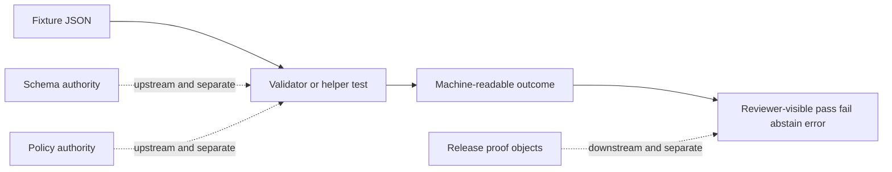

<!-- [KFM_META_BLOCK_V2]
doc_id: kfm://doc/NEEDS_VERIFICATION__maplibre_source_meta_fixtures_readme
title: MapLibre Source Meta Fixtures
type: standard
version: v1
status: draft
owners: @bartytime4life
created: NEEDS_VERIFICATION__YYYY-MM-DD
updated: NEEDS_VERIFICATION__YYYY-MM-DD
policy_label: NEEDS_VERIFICATION__public_or_internal
related: [
  ../../../README.md,
  ../../README.md,
  ../README.md,
  ../../../../README.md,
  ../../../../contracts/README.md,
  ../../../../schemas/README.md,
  ../../../../policy/README.md,
  ../../../../tools/validators/README.md,
  ../../../../tests/README.md,
  ../../../../.github/CODEOWNERS
]
tags: [kfm, tests, fixtures, maplibre, source-meta, validator, time-aware]
notes: [
  This README is intentionally narrow: it documents deterministic fixtures for MapLibre-style source.meta validation.
  Exact subtree inventory, dates, policy label, and any landed validator/helper paths remain branch-verification items until checked in the active checkout.
]
[/KFM_META_BLOCK_V2] -->

<a id="top"></a>

# MapLibre Source Meta Fixtures

Deterministic, public-safe fixtures for validating **MapLibre-style `source.meta` blocks** used in time-aware, governed source declarations.

> [!NOTE]
> **Status:** `experimental`  
> **Owners:** `@bartytime4life` *(leaf-specific routing still needs active-branch verification)*  
> **Path:** `tests/fixtures/source/maplibre_source_meta/README.md`  
> **Repo fit:** fixture leaf for small validation inputs consumed by source-meta helpers and validator tests  
> **Quick jumps:** [Scope](#scope) · [Repo fit](#repo-fit) · [Accepted inputs](#accepted-inputs) · [Exclusions](#exclusions) · [Directory tree](#directory-tree) · [Quickstart](#quickstart) · [Usage](#usage) · [Diagram](#diagram) · [Tables](#tables) · [Task list](#task-list--definition-of-done) · [FAQ](#faq) · [Appendix](#appendix)


> [!IMPORTANT]
> This leaf documents **fixtures**, not authority.  
> A file here may help prove that a `source.meta` block is shaped correctly, linked honestly, and handled fail-closed. It must **not** become the schema home, policy home, release-manifest home, or proof-pack home.

---

## Scope

This leaf exists to make one thing reviewable:

> small, deterministic fixture inputs for validating `source.meta` on MapLibre-style sources.

The primary burden here is not rendering. It is **declared source metadata**:

- `epoch`
- `license`
- `digest`
- optional linkage fields such as `proof_ref` and `manifest_ref`

These fixtures are intended to support:

- positive validation of minimal valid `source.meta`
- negative validation for missing or malformed fields
- digest-to-manifest comparison
- required-linkage checks when strict validator mode is enabled
- deterministic `ALLOW | ABSTAIN | DENY | ERROR` outcomes in validator tests

This leaf is **not** the place for:

- full style catalogs
- production map styles
- runtime rendering logic
- release manifests as authoritative trust objects
- policy logic
- large binary tile assets
- hidden CI orchestration
- connector code
- provider mirrors

### Truth labels used in this README

| Label | Meaning |
| --- | --- |
| **CONFIRMED** | Supported by surfaced repo doctrine or by the checked-in file shape this README is documenting |
| **INFERRED** | Conservative conclusion from adjacent repo patterns, but not directly proven for this exact leaf |
| **PROPOSED** | Recommended file shape or growth pattern not yet claimed as mounted fact |
| **UNKNOWN** | Not surfaced strongly enough to describe as current repo reality |
| **NEEDS VERIFICATION** | Should be checked against the active branch before merge |

### Current evidence posture

| Surface | Status | Why it matters |
| --- | --- | --- |
| `tests/fixtures/` as a reusable verification-support surface | **CONFIRMED** | Grounds this leaf as fixture support rather than runtime ownership |
| `valid/`, `invalid/`, and optional `edge/` subtree pattern | **CONFIRMED as visible repo pattern** | Gives this leaf a clean, reviewable structure |
| Filename-by-behavior or failure-reason convention | **CONFIRMED as visible repo pattern** | Keeps fixtures audit-friendly |
| `source.meta` validation focus for this leaf | **CONFIRMED by current task direction** | Narrows the lane to the validator/helper work |
| Exact landed fixture inventory in the active branch | **NEEDS VERIFICATION** | Do not overclaim files until branch-backed |
| Exact validator/helper import paths consuming these fixtures | **NEEDS VERIFICATION** | Keep README truthful about integration state |
| Final `doc_id`, `created`, `updated`, `policy_label` values | **NEEDS VERIFICATION** | Replace placeholders before merge |

[Back to top](#top)

---

## Repo fit

**Path:** `tests/fixtures/source/maplibre_source_meta/README.md`  
**Role:** small deterministic fixtures for source-meta validation in MapLibre-style source declarations.

| Direction | Surface | Why it matters |
| --- | --- | --- |
| Parent verification boundary | [`tests/README.md`][tests-readme] | This leaf stays subordinate to the broader governed test surface |
| Fixture family context | [`tests/fixtures/README.md`][fixtures-readme] | Shared fixture expectations should stay consistent if this parent exists on branch |
| Source fixture context | [`tests/fixtures/source/README.md`][source-fixtures-readme] | Keeps this leaf aligned with neighboring source-oriented fixtures if present |
| Validator lane | [`tools/validators/README.md`][validators-readme] | Validator logic belongs there, not here |
| Root doctrine | [`README.md`][root-readme] | Keeps terminology and trust posture aligned |
| Contract authority | [`contracts/README.md`][contracts-readme] | Contracts stay upstream from fixtures |
| Schema authority | [`schemas/README.md`][schemas-readme] | Machine-contract truth does not originate in this leaf |
| Policy authority | [`policy/README.md`][policy-readme] | Fail-closed decision logic remains policy-owned |
| Ownership boundary | [`.github/CODEOWNERS`][codeowners] | Recheck final routing before merge |

> [!TIP]
> Keep the split visible: **fixtures here, validator logic elsewhere, schema authority upstream, and release/proof objects downstream**.

[Back to top](#top)

---

## Accepted inputs

Content that belongs here should be **tiny**, **deterministic**, and **safe to review in Git**.

| Input class | Examples | Why it belongs here |
| --- | --- | --- |
| Valid style fixture | `valid/style.single-source.valid.json` | Proves minimal accepted `source.meta` shape |
| Valid manifest fixture | `valid/manifest.single-source.match.json` | Supports digest match checks |
| Invalid style fixture | `invalid/style.missing-meta.json` | Proves fail-closed behavior |
| Invalid manifest fixture | `invalid/manifest.single-source.mismatch.json` | Supports digest mismatch checks |
| Edge case fixture | `edge/style.manifest-supplied-but-source-unmapped.json` | Proves deterministic `ABSTAIN` behavior |
| Tiny fixture README | this file | Explains intent, boundaries, and growth rules |

### Input rules

1. Keep fixtures **small enough to review line-by-line**.
2. Name fixtures by **behavior or failure reason**.
3. Keep each fixture focused on **one main condition** where possible.
4. Prefer JSON fixtures unless a real consumer requires another format.
5. Keep example values synthetic and public-safe.
6. Preserve the boundary **fixture ≠ manifest authority ≠ proof object ≠ runtime output**.
7. Add new edge cases only when a real validator, helper, or test consumes them.

[Back to top](#top)

---

## Exclusions

| Does **not** belong here | Put it here instead | Why |
| --- | --- | --- |
| Full production style JSON | docs/style or app-specific style lanes | This leaf is about fixtures, not map ownership |
| Validator implementation | `tools/validators/` | Logic should not live in fixture paths |
| TypeScript helper implementation | code or library lane | Helpers are consumers, not fixtures |
| Canonical source or release schemas | `schemas/` and `contracts/` | Authority stays upstream |
| Policy rules or role logic | `policy/` | Deny-by-default logic does not originate here |
| Signed proof packs or release manifests as trust records | release or proof lanes | Fixtures are not authoritative trust objects |
| Large binary PMTiles, MBTiles, or COG assets | governed data zones or ignored local paths | This leaf should remain tiny and diffable |
| Secrets, credentials, or tokens | secret management surfaces | Public fixture paths must remain safe |

[Back to top](#top)

---

## Directory tree

### Current intended shape

```text
tests/fixtures/source/maplibre_source_meta/
├── README.md
├── valid/
│   ├── style.single-source.valid.json
│   └── manifest.single-source.match.json
├── invalid/
│   ├── style.missing-meta.json
│   ├── style.missing-digest.json
│   ├── style.invalid-epoch.json
│   ├── style.digest-mismatch.json
│   ├── style.missing-proof-ref.required.json
│   └── manifest.single-source.mismatch.json
└── edge/
    ├── style.manifest-supplied-but-source-unmapped.json
    └── manifest.source-unmapped.json
```

> [!WARNING]
> The exact subtree above should be treated as **PROPOSED** until rechecked in the active branch.

### Growth rule

Add the **smallest meaningful pair** first:

- one valid case
- one invalid case named by one failure reason

Add `edge/` only when a real consumer needs ambiguity or partial-linkage coverage.

[Back to top](#top)

---

## Quickstart

### Inspect the leaf

```bash
find tests/fixtures/source/maplibre_source_meta -maxdepth 3 -type f 2>/dev/null | sort
```

### Re-read nearby authority surfaces

```bash
sed -n '1,220p' tests/README.md 2>/dev/null || true
sed -n '1,220p' tools/validators/README.md 2>/dev/null || true
sed -n '1,220p' contracts/README.md 2>/dev/null || true
sed -n '1,220p' schemas/README.md 2>/dev/null || true
sed -n '1,220p' policy/README.md 2>/dev/null || true
sed -n '1,220p' .github/CODEOWNERS 2>/dev/null || true
```

### Run a validator against fixtures

```bash
node tools/validators/kfm-source-meta-verify.ts \
  --style tests/fixtures/source/maplibre_source_meta/valid/style.single-source.valid.json \
  --manifest tests/fixtures/source/maplibre_source_meta/valid/manifest.single-source.match.json \
  --require-proof true \
  --require-manifest-ref true
```

> [!NOTE]
> The command above is illustrative until the validator path is confirmed in the active checkout.

[Back to top](#top)

---

## Usage

### What these fixtures are trying to prove

A healthy fixture set here should make the following obvious:

- a source may carry a `meta` object
- `epoch`, `license`, and `digest` are first-wave fields worth checking
- linkage fields such as `proof_ref` and `manifest_ref` may be required by strict validation
- a supplied manifest may:
  - match the declared digest
  - mismatch the declared digest
  - omit mapping for the source and force an `ABSTAIN`
- malformed or missing metadata should fail closed

### Minimal valid example

```json
{
  "version": 8,
  "sources": {
    "soil_moisture_q1": {
      "type": "vector",
      "url": "https://tiles.example/q1.pmtiles",
      "meta": {
        "epoch": "2026-01-01/2026-03-31",
        "license": "CC-BY-4.0",
        "digest": "sha256:aaaaaaaaaaaaaaaaaaaaaaaaaaaaaaaaaaaaaaaaaaaaaaaaaaaaaaaaaaaaaaaa",
        "proof_ref": "kfm://proof/soil-moisture/2026Q1",
        "manifest_ref": "kfm://manifest/soil-moisture/2026Q1"
      }
    }
  }
}
```

### Minimal invalid example

```json
{
  "version": 8,
  "sources": {
    "soil_moisture_q1": {
      "type": "vector",
      "url": "https://tiles.example/q1.pmtiles"
    }
  }
}
```

Invalid because the source declares no `meta` block at all.

### Working rule for adding fixtures

1. Start with one behavior.
2. Use synthetic values.
3. Keep names explicit.
4. Avoid bundling multiple unrelated failures into one file.
5. Add paired manifest fixtures only when they are actually consumed.
6. Keep runtime or release semantics out of the fixture unless the validator explicitly tests them.

[Back to top](#top)

---

## Diagram



[Back to top](#top)

---

## Tables

### First cases worth proving

| Case | Why it matters | Expected outcome |
| --- | --- | --- |
| Valid source meta + matching manifest | Proves clean positive path | `ALLOW` |
| Missing `meta` | Proves fail-closed baseline | `DENY` |
| Missing `digest` | Proves required field enforcement | `DENY` |
| Invalid epoch range | Proves shape and order checks | `DENY` or `ABSTAIN` depending on strictness |
| Digest mismatch | Proves integrity comparison | `DENY` |
| Missing `proof_ref` when required | Proves strict linkage enforcement | `DENY` |
| Manifest supplied but source unmapped | Proves non-blocking ambiguity path | `ABSTAIN` |

### Field seams to pressure-test

| Field | Example issue | Why it matters |
| --- | --- | --- |
| `epoch` | missing, malformed, or reversed range | Time-aware source selection depends on it |
| `license` | missing or malformed token | Rights disclosure should travel with the source |
| `digest` | missing or mismatched | Integrity comparison depends on it |
| `proof_ref` | absent in strict mode | Proof linkage should be explicit when required |
| `manifest_ref` | absent in strict mode | Manifest linkage should be explicit when required |

[Back to top](#top)

---

## Task list / definition of done

- [ ] Verify the active branch contains this leaf and its intended files.
- [ ] Replace all placeholder meta-block values.
- [ ] Reconfirm owner routing in `.github/CODEOWNERS`.
- [ ] Confirm any parent `tests/fixtures/README.md` and `tests/fixtures/source/README.md` links.
- [ ] Land at least one valid and one invalid fixture.
- [ ] Keep filenames behavior-based and failure-reason-based.
- [ ] Verify the validator and helper paths that consume these fixtures.
- [ ] Ensure this README does not imply schema, policy, or release authority.

### Definition of done

This leaf is ready to move toward review when:

1. the branch proves the subtree
2. the placeholder metadata is replaced
3. at least one valid and one invalid fixture exist
4. fixture names clearly describe behavior or failure reason
5. consumer paths are confirmed or illustrative language is retained
6. the README stays narrow and does not overclaim integration state

[Back to top](#top)

---

## FAQ

### Why keep this under `tests/fixtures/`?

Because the primary job is verification support. These files are meant to be consumed by tests and validators, not by production runtime paths as authoritative records.

### Why focus only on `source.meta` here?

Because the immediate burden is a small, deterministic validation surface for `epoch`, `license`, `digest`, and optional linkage refs. Wider MapLibre style concerns belong elsewhere unless a real fixture consumer requires them.

### Does this lane own full MapLibre styles?

No. It may contain tiny style fragments, but not production style catalogs or render design decisions.

### Does this lane own manifests or proof packs?

No. It may contain tiny manifest-like fixtures for comparison tests, but those are fixtures, not authoritative trust objects.

### Should this lane contain PMTiles, MBTiles, or COG assets?

No. This leaf should remain text-only and reviewable in Git.

[Back to top](#top)

---

## Appendix

<details>
<summary><strong>Illustrative starter set and review reminders</strong></summary>

### Illustrative starter set

The following filenames are the narrowest useful first wave for this leaf:

- `valid/style.single-source.valid.json`
- `valid/manifest.single-source.match.json`
- `invalid/style.missing-meta.json`
- `invalid/style.missing-digest.json`
- `invalid/style.invalid-epoch.json`
- `invalid/style.digest-mismatch.json`
- `invalid/style.missing-proof-ref.required.json`
- `invalid/manifest.single-source.mismatch.json`
- `edge/style.manifest-supplied-but-source-unmapped.json`
- `edge/manifest.source-unmapped.json`

### Review questions before merge

- Does the active branch actually contain the linked parent README files?
- Are the validator and helper consumers landed at the documented paths?
- Are the placeholder meta-block fields now resolvable from branch evidence?
- Does the README still preserve the boundary **fixture ≠ manifest authority ≠ proof object ≠ runtime output**?
- Is the subtree still small, deterministic, and public-safe?

</details>

[Back to top](#top)

[tests-readme]: ../../../README.md
[fixtures-readme]: ../../README.md
[source-fixtures-readme]: ../README.md
[root-readme]: ../../../../README.md
[contracts-readme]: ../../../../contracts/README.md
[schemas-readme]: ../../../../schemas/README.md
[policy-readme]: ../../../../policy/README.md
[validators-readme]: ../../../../tools/validators/README.md
[codeowners]: ../../../../.github/CODEOWNERS