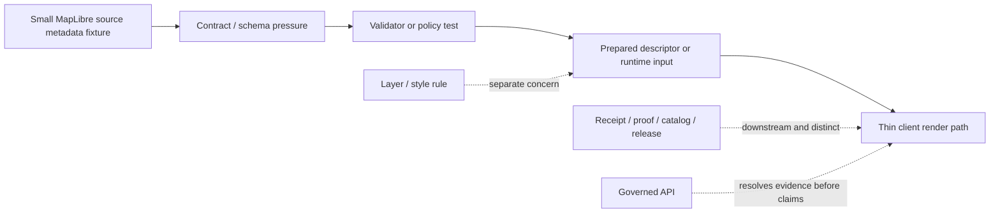

<!-- [KFM_META_BLOCK_V2]
doc_id: kfm://doc/NEEDS_VERIFICATION__maplibre_source_meta_fixtures_readme
title: MapLibre Source Metadata Fixtures
type: standard
version: v1
status: draft
owners: NEEDS_VERIFICATION__tests_owner
created: NEEDS_VERIFICATION__YYYY-MM-DD
updated: 2026-04-27
policy_label: NEEDS_VERIFICATION__public_or_internal
related: [../../../README.md, ../../../policy/README.md, ../../../reproducibility/README.md, ../../../contracts/README.md, ../../../../README.md, ../../../../contracts/README.md, ../../../../schemas/README.md, ../../../../schemas/contracts/v1/source/source_descriptor.schema.json, ../../../../policy/README.md, ../../../../.github/CODEOWNERS, ../../../../.github/workflows/README.md]
tags: [kfm, tests, fixtures, maplibre, source-metadata, source-descriptor, delivery]
notes: [Prepared as a README-like standard doc for tests/fixtures/source/maplibre_source_meta. Direct active-branch ownership, fixture inventory, doc_id, created date, policy label, workflow wiring, and MapLibre-specific validator/schema coverage still need verification. Related paths are branch-verification targets from surfaced KFM README patterns and source-descriptor doctrine.]
[/KFM_META_BLOCK_V2] -->

<a id="top"></a>

# MapLibre Source Metadata Fixtures

Deterministic, public-safe fixture lane for small **MapLibre** source-metadata examples that help KFM test source/layer boundaries, adapter disclosure, and fail-closed source admission.

> [!IMPORTANT]
> **Impact block**  
> **Status:** `experimental`  
> **Owners:** `NEEDS_VERIFICATION__tests_owner`  
> **Path:** `tests/fixtures/source/maplibre_source_meta/README.md`  
> **Authority class:** fixture support surface; not schema, policy, catalog, proof, or release authority  
> **Quick jumps:** [Scope](#scope) · [Repo fit](#repo-fit) · [Accepted inputs](#accepted-inputs) · [Exclusions](#exclusions) · [Current evidence boundary](#current-evidence-boundary) · [Directory tree](#directory-tree) · [Quickstart](#quickstart) · [Usage](#usage) · [Diagram](#diagram) · [Operating tables](#operating-tables) · [Task list](#task-list--definition-of-done) · [FAQ](#faq) · [Appendix](#appendix)


> [!WARNING]
> **MapLibre is a renderer/spec ecosystem, not sovereign truth.**  
> A fixture in this lane may help prove source metadata, source/layer separation, and adapter disclosure. It must not quietly become a style catalog, provider mirror, release object, runtime receipt, or publication shortcut.

---

## Scope

This leaf exists to make one thing boring and reviewable:

> how a **MapLibre source** should first appear in KFM when tests need a small, explicit metadata example.

This directory supports tests that need to prove:

- source identity before runtime assumptions expand
- **source vs layer** separation before style logic gets flattened
- adapter or protocol dependence before delivery details are treated as “just data”
- support, CRS, time, and uncertainty disclosure where they materially affect meaning
- web/native or renderer-parity caveats before local behavior is mistaken for universal behavior
- fail-closed `ALLOW` / `DENY` / `QUARANTINE` behavior around source admission or metadata handling
- the boundary **fixture ≠ receipt ≠ proof ≠ catalog ≠ release**

This directory does **not** establish canonical schema law, policy law, source authority, publication state, or production runtime behavior.

### Truth labels used in this README

| Label | Meaning here |
| --- | --- |
| **CONFIRMED** | Supported by surfaced KFM doctrine, surfaced repo-facing documentation patterns, or surfaced MapLibre ecosystem material |
| **INFERRED** | Conservative reading that fits adjacent KFM surfaces but is not directly proven as active-branch leaf reality |
| **PROPOSED** | Recommended fixture shape or growth pattern consistent with KFM doctrine but not asserted as implemented |
| **UNKNOWN** | Not surfaced strongly enough to describe as current repo reality |
| **NEEDS VERIFICATION** | Path, owner, file inventory, workflow wiring, validator, schema, or branch state that must be rechecked before merge |

[Back to top](#top)

---

## Repo fit

**Path:** `tests/fixtures/source/maplibre_source_meta/README.md`  
**Role:** child fixture README for governed, public-safe **MapLibre** source-metadata examples inside the broader `tests/` verification boundary.

| Direction | Surface | Why it matters |
| --- | --- | --- |
| Parent verification boundary | [`tests/README.md`][tests-readme] | Keeps this leaf subordinate to the repo’s governed verification model |
| Neighboring policy tests | [`tests/policy/README.md`][tests-policy-readme] | Policy-facing tests may consume fixtures here, but policy truth does not originate here |
| Neighboring reproducibility tests | [`tests/reproducibility/README.md`][tests-repro-readme] | Stable fixture content matters when replayability and digest checks carry the burden |
| Neighboring contract tests | [`tests/contracts/README.md`][tests-contracts-readme] | Contract-facing verification stays distinct from leaf-level examples |
| Root operating posture | [`README.md`][root-readme] | This leaf should read like native KFM documentation, not an isolated memo |
| Contract authority | [`contracts/README.md`][root-contracts-readme] | Contract meaning stays upstream from fixtures |
| Schema authority | [`schemas/README.md`][schemas-readme] | Fixtures pressure-test schema law; they do not replace it |
| Source schema companion | [`schemas/contracts/v1/source/source_descriptor.schema.json`][source-schema] | Nearest surfaced machine-contract target for source admission and metadata disclosure |
| Policy authority | [`policy/README.md`][policy-readme] | Fail-closed decision logic remains a policy-owned concern |
| Ownership routing | [`.github/CODEOWNERS`][codeowners] | Final owner routing must be checked before merge |
| Workflow boundary | [`.github/workflows/README.md`][workflows-readme] | This leaf must not imply hidden CI wiring the branch does not prove |

> [!TIP]
> Keep the split visible: **fixture examples here, contract authority upstream, validator logic elsewhere, released trust objects downstream, and runtime rendering thinner than truth-making**.

[Back to top](#top)

---

## Accepted inputs

Content that belongs here should stay **small**, **explicit**, deterministic, and safe to review in Git.

| Input class | Typical examples | Why it belongs here | Status |
| --- | --- | --- | --- |
| Valid source metadata fixture | one tiny JSON or YAML object for a `vector`, `raster`, `geojson`, or `raster-dem` source | proves the positive source-metadata shape directly | **CONFIRMED source class / PROPOSED local file form** |
| Invalid source metadata fixture | missing `type`, undisclosed adapter dependency, missing bounds/zoom note, parity overclaim | makes negative states first-class | **PROPOSED** |
| Adapter disclosure note | tiny fragment naming PMTiles, COG, WMS-as-tiles, or Martin-served dependency | keeps delivery assumptions visible instead of magical | **CONFIRMED concept / PROPOSED local file form** |
| Source/layer boundary note | compact example showing that a source alone does not render until a layer references it | prevents source fixtures from drifting into style ownership | **CONFIRMED concept / PROPOSED local file form** |
| Parity caution fragment | note or metadata flag for web/native or renderer behavior differences | keeps “works in one runtime” from silently becoming “works everywhere” | **CONFIRMED concept / PROPOSED local file form** |
| Expected validation output | compact `ALLOW`, `DENY`, or `QUARANTINE` fragments with reason codes | proves validator behavior only when a real validator consumes them | **INFERRED / PROPOSED** |
| Tiny comparison note | small MVT-vs-MLT or GeoJSON-vs-vector-tile support note | keeps metadata choices inspectable without widening into a tutorial | **CONFIRMED concept / PROPOSED local file form** |

### Input rules

1. Keep fixtures **small enough to review in a pull request**.
2. Keep **MapLibre** named explicitly; do not flatten this lane into generic “map config.”
3. Keep **source vs layer** separation visible in the fixture or companion note.
4. If a fixture leans on **PMTiles**, **COG**, WMS-as-tiles, or Martin, keep the adapter or protocol dependence explicit.
5. Keep **CRS**, support, time, freshness, and uncertainty visible when they materially affect source meaning.
6. Keep web/native parity qualified; do not silently normalize GL JS behavior into universal runtime behavior.
7. If a fixture is derived or normalized, label it as derived or normalized.
8. Preserve the distinction **fixture ≠ receipt ≠ proof ≠ catalog ≠ release**.

> [!NOTE]
> The strongest first-wave burden here is not cartographic polish. It is **honest metadata**: what the source is, how it should be consumed, what it depends on, and what it must not imply.

[Back to top](#top)

---

## Exclusions

| Does **not** belong here | Put it here instead | Why |
| --- | --- | --- |
| Canonical schema files | [`contracts/README.md`][root-contracts-readme] and [`schemas/README.md`][schemas-readme] | Fixtures should pressure-test schema authority, not replace it |
| Full style JSON documents or style catalogs | style-authoring or UI lanes once surfaced on the active branch | This leaf is about source metadata, not full cartographic ownership |
| Policy bundle source files or reviewer-role registries | [`policy/README.md`][policy-readme] | This leaf may support policy tests, but policy remains the source of truth |
| Live connector code, workflow YAML, or scheduler configuration | watcher, pipeline, or tool lanes on the active branch | A fixture README is not implementation proof |
| Large PMTiles, MBTiles, COG files, or provider mirrors | governed data zones or local ignored paths | Public fixture surfaces should stay tiny and reviewable |
| Release manifests, signed proofs, SBOMs, or promoted artifacts as primary records | governed receipt, proof, release, or catalog surfaces | Fixture examples are not authoritative trust objects |
| Secrets, API credentials, signed URLs, or token-bearing helper files | secret manager or host configuration | Public test paths must remain safe to clone and review |
| Browser-side trust joins or ad hoc runtime reconstruction logic | nowhere in this lane | KFM doctrine keeps truth-bearing computation upstream |
| One-off analyst scratch files | local ignored paths | Checked-in fixtures should be reusable and reviewable |

> [!CAUTION]
> Do not commit a full provider snapshot, copied tutorial catalog, convenience archive, or private tile bundle here just because it is easy to fetch.  
> The goal is the **smallest meaningful proof slice**, not the largest convenient archive.

[Back to top](#top)

---

## Current evidence boundary

| Surface | Status | What this README may safely do |
| --- | --- | --- |
| KFM MapLibre doctrine | **CONFIRMED** | Treat MapLibre as a governed downstream renderer/spec ecosystem, not a truth source |
| README-like repo pattern | **CONFIRMED doctrine / NEEDS VERIFICATION active branch** | Use meta block, status/owner/path block, quick jumps, repo fit, inputs, exclusions, diagrams, and definition of done |
| `SourceDescriptor` vocabulary | **CONFIRMED doctrine / PROPOSED local pressure test** | Align source fixtures to source-admission and disclosure burden rather than inventing a second source-object vocabulary |
| `schemas/contracts/v1/source/source_descriptor.schema.json` | **NEEDS VERIFICATION active branch** | Treat as nearest surfaced companion path until direct repo inspection confirms it |
| Source/layer separation | **CONFIRMED concept** | Keep source metadata distinct from layer/style authority |
| MapLibre source categories | **CONFIRMED concept** | Use `vector`, `raster`, `raster-dem`, `geojson`, `image`, `video`, and `canvas` examples only where useful |
| CRS, support, time, freshness, uncertainty | **CONFIRMED KFM burden** | Keep meaning-bearing metadata visible |
| Exact subtree contents | **UNKNOWN / NEEDS VERIFICATION** | Do not claim any child fixture inventory until the active branch proves it |
| Current validator or workflow wiring | **UNKNOWN / NEEDS VERIFICATION** | Do not imply runnable automation unless branch evidence exists |
| Leaf-specific owner, created date, doc ID, policy label | **NEEDS VERIFICATION** | Keep placeholders reviewable in the meta block |

[Back to top](#top)

---

## Directory tree

### Current safe claim

Without direct active-branch inspection, this README claims no child inventory beyond the intended target file.

```text
tests/fixtures/source/maplibre_source_meta/
└── README.md
```

<details>
<summary><strong>Possible stable growth shape</strong> (<strong>PROPOSED</strong>)</summary>

```text
tests/fixtures/source/maplibre_source_meta/
├── README.md
├── valid/
│   ├── source.vector_tilejson_min.json
│   ├── source.geojson_small.json
│   ├── source.raster_wms_template.json
│   ├── source.raster_dem_min.json
│   └── source.pmtiles_protocol_note.json
├── invalid/
│   ├── source.missing_type.json
│   ├── source.undisclosed_adapter_dependency.json
│   ├── source.ambiguous_support_time.json
│   ├── source.parity_overclaim.json
│   └── source.geojson_large_payload.note.md
└── expected/
    ├── decision.allow.json
    └── decision.deny.json
```

Working rule: add the **smallest real pair** first — one valid fixture and one invalid fixture named by failure reason — before inventing broader subtrees.

</details>

[Back to top](#top)

---

## Quickstart

### Safe inspection commands

These commands inspect the current branch shape without assuming a hidden runner, live workflow, or unverified subtree.

```bash
# inspect the exact leaf as the checked-out branch exposes it
find tests/fixtures/source/maplibre_source_meta -maxdepth 4 -type f 2>/dev/null | sort

# inspect nearby README surfaces before editing this leaf
find tests/fixtures -maxdepth 3 -name README.md 2>/dev/null | sort

# re-read the family and authority surfaces
sed -n '1,260p' tests/README.md 2>/dev/null || true
sed -n '1,220p' tests/policy/README.md 2>/dev/null || true
sed -n '1,220p' tests/reproducibility/README.md 2>/dev/null || true
sed -n '1,220p' tests/contracts/README.md 2>/dev/null || true
sed -n '1,260p' contracts/README.md 2>/dev/null || true
sed -n '1,260p' schemas/README.md 2>/dev/null || true
sed -n '1,260p' schemas/contracts/v1/README.md 2>/dev/null || true
sed -n '1,220p' policy/README.md 2>/dev/null || true
sed -n '1,220p' .github/CODEOWNERS 2>/dev/null || true
sed -n '1,220p' .github/workflows/README.md 2>/dev/null || true
```

### Fast drift check

Use this before inventing new field families or renaming the lane casually.

```bash
git grep -n \
  -e 'MapLibre' \
  -e 'SourceDescriptor' \
  -e 'source_descriptor.schema' \
  -e 'source-layer' \
  -e 'raster-dem' \
  -e 'pmtiles' \
  -e 'cog://' \
  -e 'WMS' \
  -e 'MLT' \
  -- tests contracts schemas policy docs .github 2>/dev/null || true
```

### Fixture naming check

A filename should tell reviewers what behavior it proves or what failure it exercises.

```bash
# examples of names that reveal purpose
printf '%s\n' \
  valid/source.vector_tilejson_min.json \
  valid/source.raster_dem_min.json \
  invalid/source.missing_type.json \
  invalid/source.undisclosed_adapter_dependency.json
```

[Back to top](#top)

---

## Usage

### What this leaf is trying to prove

A healthy first-wave fixture in this directory should make the following obvious:

- a **MapLibre source** is a **data-input declaration**, not the styling rule that renders it
- adding a source is not enough to display data; a layer still owns the visual representation
- source type matters: `vector`, `raster`, `raster-dem`, `geojson`, `image`, `video`, or `canvas`
- delivery assumptions matter: PMTiles, COG, WMS-as-tiles, and Martin are not silent generic URLs
- GeoJSON can be useful for tiny examples, but large-data behavior should not be normalized as ordinary
- support, CRS, time, freshness, and uncertainty are part of meaning, not metadata garnish
- web/native parity is not automatic just because the same style family exists across MapLibre surfaces
- allow, deny, and quarantine behavior can be tested without pretending the fixture itself is a release object

### Working rule for adding or revising a fixture

1. Start with the **smallest meaningful source example**.
2. Name the file by **behavior or failure reason**, not by a vague bucket.
3. Keep the source type and delivery mode visible in the fixture itself.
4. If a fixture implies vector-tile usage, keep the `source-layer` obligation visible in the companion note or expected layer reference.
5. If a fixture uses PMTiles, COG, WMS-as-tiles, or Martin, make the protocol or adapter assumption explicit.
6. If a fixture implies terrain or advanced runtime behavior, keep parity cautions visible instead of assuming universal support.
7. Add an expected allow/deny/quarantine fragment only when a real validator consumes it.
8. Do not let a fixture imply live watcher, scheduler, signing, storage, branch protection, or publish-path maturity that the branch does not prove.

### MapLibre-specific seams worth keeping visible

| Seam | Keep visible | Why |
| --- | --- | --- |
| Source vs layer | source declares data; layer declares rendering | prevents this leaf from silently becoming style authority |
| `url` vs `tiles` | TileJSON endpoint versus inline tile template | helps reviewers see delivery intent immediately |
| `source-layer` obligation | required when a vector tile source is used by a layer | keeps vector-source metadata honest |
| `scheme`, `bounds`, zoom limits | `xyz` vs `tms`, request bounds, `minzoom`, `maxzoom` | avoids hidden request-pattern assumptions |
| `encoding` | `mvt` versus `mlt` when relevant | keeps MLT usage explicit instead of accidental |
| Adapter or protocol dependence | WMS-as-tiles, COG protocol, PMTiles protocol, Martin-served sources | stops adapter magic from disappearing into prose |
| Support / CRS / time / uncertainty | outward support and trust semantics | aligns this leaf with KFM representation discipline |
| Parity caveat | web/native support can diverge | prevents “works here” from becoming “works everywhere” |
| Publication boundary | fixture stays distinct from receipts, proofs, catalogs, and releases | preserves KFM trust-object separation |

[Back to top](#top)

---

## Diagram



Plain-language read: this directory helps tests inspect source metadata before it travels into validation or runtime input. It does not own style rendering, proof objects, release state, or evidence resolution.

[Back to top](#top)

---

## Operating tables

### MapLibre source cases worth proving first

| Case | Why it matters | Minimum visible cues | Status |
| --- | --- | --- | --- |
| `vector` + TileJSON / MVT | default scalable vector-source path | `type`, `url` or `tiles`, bounds/zoom clues, `source-layer` note when relevant | **CONFIRMED concept / PROPOSED local fixture form** |
| `vector` + MLT | next-generation vector path that deserves explicit labeling | `type: vector`, `encoding: mlt`, maturity/parity caveat | **CONFIRMED concept / PROPOSED local fixture form** |
| `geojson` small example | common starter path, easy to misuse at scale | tiny payload, explicit “small fixture only” posture | **CONFIRMED concept / PROPOSED local fixture form** |
| `raster` + WMS-as-tiles | common raster-template pattern, not special truth authority | raster template, EPSG:3857 note, caching caveat | **CONFIRMED concept / PROPOSED local fixture form** |
| `raster-dem` | terrain and hillshade behavior depend on explicit source metadata | DEM encoding note, terrain dependency, parity caveat | **CONFIRMED concept / PROPOSED local fixture form** |
| PMTiles | useful delivery option with range-request assumptions | protocol or serving note, range-request requirement | **CONFIRMED concept / PROPOSED local fixture form** |
| COG via protocol adapter | valid ecosystem path, but adapter disclosure matters | protocol/adapter note, range/CORS caveat | **CONFIRMED concept / PROPOSED local fixture form** |
| MBTiles | important ecosystem format, usually server-side or offline rather than direct browser source | “served indirectly” note | **CONFIRMED concept / PROPOSED local fixture form** |

### Metadata seams to pressure-test

| Seam | Example failure reason | Why it matters |
| --- | --- | --- |
| Missing source type | `source.missing_type.json` | makes the source undecidable before runtime |
| Silent adapter magic | `source.undisclosed_adapter_dependency.json` | hides real delivery or hosting burden |
| Ambiguous support/time | `source.ambiguous_support_time.json` | flattens meaning-bearing metadata |
| Parity overclaim | `source.parity_overclaim.json` | turns local success into fake cross-platform certainty |
| Implicit vector-layer dependency | `source.missing_source_layer_note.json` | obscures how vector tile sources are actually consumed |
| Large-data normalization | `source.geojson_large_payload.note.md` | treats a known anti-pattern as ordinary |
| Receipt/proof confusion | `expected.runtime_receipt_as_fixture.json` | collapses trust-bearing object classes |
| Publication by convenience | `source.release_like_payload.json` | blurs fixture work into release work |

### Review posture by fixture class

| Fixture class | Review burden | Merge posture |
| --- | --- | --- |
| Tiny valid source fragment | source type, delivery mode, support/freshness caveats visible | acceptable once schema companion and validator expectations are clear |
| Tiny invalid source fragment | failure reason named in file and expected outcome | acceptable when the negative state is useful and not decorative |
| Adapter-dependent fragment | adapter/protocol dependency disclosed | acceptable only when not hiding runtime or hosting assumptions |
| Expected decision fragment | finite outcome and reason code visible | acceptable only when consumed by a real test or documented as illustrative |
| Large binary artifact | rights, hosting, sensitivity, and review burden unresolved | does not belong here |

[Back to top](#top)

---

## Task list / definition of done

Treat this README as healthy only when it stays both readable and truthful.

- [ ] Verify whether `tests/fixtures/source/maplibre_source_meta/` already exists on the active branch beyond this README.
- [ ] Replace placeholder `doc_id`, `created`, `owners`, and `policy_label` values with repo-backed metadata.
- [ ] Confirm CODEOWNERS coverage for this leaf or its nearest parent.
- [ ] Verify that the nearest schema companion path is still [`schemas/contracts/v1/source/source_descriptor.schema.json`][source-schema].
- [ ] Land one **valid** and one **invalid** source-metadata fixture before widening the subtree.
- [ ] Add at least one positive and one negative expected decision fragment only if a real validator consumes them.
- [ ] Keep adapter dependence visible wherever a fixture implies PMTiles, COG, WMS-as-tiles, Martin, or any protocol plugin.
- [ ] Keep `source-layer`, support/time disclosure, and parity cautions visible wherever the fixture needs them.
- [ ] Verify that this README does not imply workflow YAML, branch protection, signing, runtime parity, or mounted automation the branch does not prove.
- [ ] Keep source/layer separation and thin-client discipline visible rather than burying them in later docs.

### Definition of done

This leaf is ready to move from `draft` toward `review` when all of the following are true:

1. the active checkout clearly proves the leaf subtree
2. at least one valid and one invalid fixture exist
3. failure reasons are named cleanly in filenames
4. a repo-backed schema companion is directly surfaced
5. any receipt-adjacent expected outputs remain clearly distinct from proof bundles
6. adapter-dependent cases stay visibly qualified rather than magical
7. placeholders in the meta block are replaced with real values
8. quickstart commands work from the repo root
9. the README no longer implies workflow, signing, storage, release, or runtime parity that the branch does not prove

[Back to top](#top)

---

## FAQ

### Why keep this under `tests/fixtures/` instead of a style or docs folder?

Because the primary job here is **verification support**, not style ownership or data custody. Files here should help tests prove metadata behavior, not become the authoritative home of full styles, runtime delivery, or source data.

### Why say **MapLibre source metadata** instead of just “map config”?

Because KFM treats source roles and metadata burdens as admission contracts, not decorative labels. A `vector` source, a `raster-dem` source, a WMS raster template, and a PMTiles or COG adapter path do not enter under the same trust assumptions.

### Does this lane own complete style JSON?

No. It may reference style-spec consequences, but it should not quietly become the home of full style catalogs, layer systems, or render design decisions.

### Does this lane prove live MapLibre runtime behavior already exists in the repo?

No. It documents a truthful fixture-lane shape that fits surfaced doctrine and README patterns. Validator wiring, workflow YAML, platform coverage, and runtime examples still need direct branch verification.

### Should this lane commit PMTiles, MBTiles, or COG assets?

No. A tiny metadata fragment may mention them. Large binary artifacts, provider mirrors, private bundles, or convenience archives do not belong here.

### Why keep mentioning web/native parity?

Because MapLibre is an ecosystem with web, native, tile, style, server, and adapter surfaces. Fixture practice should avoid turning one runtime’s successful behavior into a universal claim.

### Does this lane own `run_receipt`, proof objects, or catalog closure?

No. It may contain tiny expected-output fragments that help tests prove downstream handoff, but **receipt**, **proof**, **catalog**, and **release** roles remain visibly distinct.

[Back to top](#top)

---

## Appendix

<details>
<summary><strong>Illustrative starter fragments</strong> — examples only, not confirmed repo schemas</summary>

### Minimal vector source metadata fragment

```json
{
  "type": "vector",
  "tiles": ["https://example.invalid/tiles/{z}/{x}/{y}.mvt"],
  "minzoom": 0,
  "maxzoom": 12,
  "bounds": [-102.1, 36.9, -94.6, 40.1],
  "attribution": "Example fixture only"
}
```

Review note: if a layer consumes this source, the layer-side `source-layer` obligation should be visible in the companion test, expected output, or fixture note.

### Minimal invalid source fragment

```json
{
  "tiles": ["https://example.invalid/tiles/{z}/{x}/{y}.mvt"],
  "minzoom": 0,
  "maxzoom": 12
}
```

Expected reason: missing source `type`.

### Adapter disclosure note shape

```json
{
  "fixture_note": "Illustrative only",
  "delivery_mode": "pmtiles_protocol",
  "adapter_required": true,
  "runtime_claim": "NEEDS_VERIFICATION",
  "not_a_release_manifest": true
}
```

</details>

<details>
<summary><strong>Starter review questions for new fixture PRs</strong></summary>

- What source type is being proved?
- Does the fixture disclose delivery mode clearly?
- Is a layer/style concern being smuggled into source metadata?
- Does the fixture imply runtime behavior that no test proves?
- Does it disclose adapter/protocol assumptions?
- Does it need support, CRS, time, freshness, or uncertainty fields?
- Is the fixture small enough to review directly?
- Does it contain credentials, private endpoints, exact sensitive locations, or provider mirrors?
- Is the expected decision finite and named?
- Is this a fixture, receipt, proof, catalog, or release object — and is that role unmistakable?

</details>

<details>
<summary><strong>Reference links used by this README</strong></summary>

These links are intentionally repo-relative. Verify each one from this file’s actual location before merge.

- [Parent tests README][tests-readme]
- [Tests policy README][tests-policy-readme]
- [Tests reproducibility README][tests-repro-readme]
- [Tests contracts README][tests-contracts-readme]
- [Root README][root-readme]
- [Contracts README][root-contracts-readme]
- [Schemas README][schemas-readme]
- [Source descriptor schema][source-schema]
- [Policy README][policy-readme]
- [CODEOWNERS][codeowners]
- [Workflows README][workflows-readme]

</details>

[Back to top](#top)

[tests-readme]: ../../../README.md
[tests-policy-readme]: ../../../policy/README.md
[tests-repro-readme]: ../../../reproducibility/README.md
[tests-contracts-readme]: ../../../contracts/README.md
[root-readme]: ../../../../README.md
[root-contracts-readme]: ../../../../contracts/README.md
[schemas-readme]: ../../../../schemas/README.md
[source-schema]: ../../../../schemas/contracts/v1/source/source_descriptor.schema.json
[policy-readme]: ../../../../policy/README.md
[codeowners]: ../../../../.github/CODEOWNERS
[workflows-readme]: ../../../../.github/workflows/README.md
