<div align="center">

# 🌐 Kansas Frontier Matrix — **Source Manifest Fixtures**  
`tests/fixtures/sources/`

### *“Prove the pipeline before the data flows.”*

[](../../../.github/workflows/tests.yml)  
[](../../../docs/)  
[](../../../LICENSE)

</div>

---

```yaml
---
title: "KFM • Source Manifest Fixtures (tests/fixtures/sources/)"
version: "v1.2.0"
last_updated: "2025-10-17"
created: "2025-09-28"
owners: ["@kfm-data", "@kfm-ingestion", "@kfm-validation"]
status: "Stable"
maturity: "Production"
tags: ["sources","manifests","fetch","fixtures","ingestion","mcp","stac-compat"]
license: "MIT"
semantic_alignment:
  - FAIR Data Principles (Findable, Accessible, Interoperable, Reusable)
  - MCP-DL v6.3 Provenance & Reproducibility
  - STAC-Compatible Ingestion (downstream sync)
  - JSON Schema Draft-07
---
```

---

## 🧭 Overview

The **Source Manifest Fixtures** are **mock source descriptors** used to validate KFM’s **ingestion and fetch utilities**  
without touching external networks. Each file mirrors a minimal `data/sources/*.json` entry and is designed for:

- 🔎 **Parsing & Validation** — strict JSON Schema checks  
- 🌐 **Fetch Simulation** — deterministic URLs, sizes, and checksums for HTTP mocks  
- 🧾 **Provenance** — embedded license, lineage, and integrity metadata  
- 🔁 **STAC Compatibility** — fields map cleanly into downstream STAC-building steps

> **Purpose:** Guarantee that manifest parsing, HTTP fetching, and provenance logging behave identically across environments and CI.

---

## ⚙️ Architecture

```mermaid
flowchart TD
  A["Source Manifest Fixture<br/>(tests/fixtures/sources/*.json)"]
  --> B["Fetch Utilities<br/>(tools/fetch_data.py)"]
  B --> C["Schema Checks<br/>(jsonschema · SOURCE_SCHEMA)"]
  C --> D["Provenance Log<br/>checksums · sizes · license"]
  D --> E["STAC Sync<br/>tools/build_config.py → layers/STAC"]

  classDef n fill:#eaf3ff,stroke:#005cc5,color:#111;
  class A,B,C,D,E n;
```


<!-- END OF MERMAID -->

---

## 🗂 Directory Layout

```text
tests/fixtures/sources/
├── usgs_topo_sample.json            # Example USGS topographic GeoTIFF source
├── noaa_climate_sample.json         # Example NOAA CSV climate source
├── treaty_boundaries_sample.json    # Example vector/GeoJSON boundary source
└── README.md                        # This documentation file
```

---

## 🧩 Manifest Schema (Simplified)

Every fixture mirrors `data/sources/schema/source.schema.json`.

| Field         | Type   | Description                         | Example                                                         |
| :------------ | :----- | :---------------------------------- | :-------------------------------------------------------------- |
| `id`          | string | Unique dataset identifier           | `"usgs_topo_larned_1894"`                                       |
| `title`       | string | Descriptive name                    | `"USGS Topographic Map (Larned, 1894)"`                         |
| `description` | string | Summary of dataset content          | `"Historic topographic map scanned and georeferenced."`         |
| `license`     | string | Usage rights / license              | `"Public Domain"`                                               |
| `format`      | string | File format                         | `"GeoTIFF"`                                                     |
| `category`    | string | Thematic classification             | `"Topography"`                                                  |
| `contact`     | string | Data provider or curator            | `"U.S. Geological Survey"`                                      |
| `created`     | string | ISO 8601 creation date              | `"1894-01-01T00:00:00Z"`                                        |
| `source`      | object | Remote file info & integrity fields | `{"url":"...","checksum":"sha256:...","size":51200,"method":"GET"}` |

---

## 🧠 Example — `usgs_topo_sample.json`

```json
{
  "id": "usgs_topo_larned_1894",
  "title": "USGS Topographic Map (Larned, 1894)",
  "description": "Historic topographic survey of Larned, Kansas digitized from the USGS archive.",
  "license": "Public Domain",
  "format": "GeoTIFF",
  "category": "Topography",
  "contact": "U.S. Geological Survey",
  "source": {
    "url": "https://example.org/data/usgs_topo_larned_1894.tif",
    "checksum": "sha256:94d1b2a4e9b6f4e5c30dff7f91b8d09c0bdf43c2e61af5cba7c1a123456789ab",
    "size": 51200,
    "method": "GET"
  },
  "created": "1894-01-01T00:00:00Z"
}
```

> Validates GeoTIFF ingest and checksum verification with deterministic metadata.

---

## 🧠 Example — `noaa_climate_sample.json`

```json
{
  "id": "noaa_kansas_precip_1936",
  "title": "NOAA Kansas Precipitation Data (1936)",
  "description": "Daily precipitation values collected during the Dust Bowl period.",
  "license": "Public Domain",
  "format": "CSV",
  "category": "Climate",
  "contact": "National Oceanic and Atmospheric Administration",
  "source": {
    "url": "https://example.org/data/noaa_kansas_precip_1936.csv",
    "checksum": "sha256:11af2eef776d2a0c0f7b7b4e0e3bd3b1c6a2e8c4f13b5e7b905a1c23456789cd",
    "size": 2048,
    "method": "GET"
  },
  "created": "1936-01-01T00:00:00Z"
}
```

> Ensures CSV fetch + integrity check path is stable in CI.

---

## 🧠 Example — `treaty_boundaries_sample.json`

```json
{
  "id": "treaty_boundaries_kansas_v1",
  "title": "Treaty Boundaries — Kansas (Sample)",
  "description": "Vector boundary sample for historic treaty polygons across Kansas.",
  "license": "Public Domain",
  "format": "GeoJSON",
  "category": "Boundaries",
  "contact": "KFM Synthetic Vector Source",
  "source": {
    "url": "https://example.org/data/treaty_boundaries_kansas_v1.geojson",
    "checksum": "sha256:a3f98c0c3e3b9f7a1a1d2c2b3c4d5e6f7a8b9c0d1e2f3a4b5c6d7e8f90123456",
    "size": 4096,
    "method": "GET"
  },
  "created": "1850-01-01T00:00:00Z"
}
```

> Exercises vector ingest and downstream STAC sync for boundary overlays.

---

## 🧪 Usage in Tests

### ✅ Pytest — Parsing & Schema

```python
import json
from tools.utils.schemas import SOURCE_SCHEMA

def test_source_manifest_valid(fixtures_dir):
    mf = json.loads((fixtures_dir / "sources/usgs_topo_sample.json").read_text())
    from jsonschema import validate
    validate(instance=mf, schema=SOURCE_SCHEMA)
```

### ✅ Pytest — Fetch Mock

```python
import responses
from tools.fetch_data import fetch_file

@responses.activate
def test_fetch_from_manifest(fixtures_dir, tmp_path):
    mf = json.loads((fixtures_dir / "sources/noaa_climate_sample.json").read_text())
    url = mf["source"]["url"]
    responses.add(responses.GET, url, body=b"FAKECSV", status=200)
    path = fetch_file(url, tmp_path)
    assert path.exists() and path.read_bytes() == b"FAKECSV"
```

### ✅ CLI

```bash
pytest tools/tests/test_fetch_data.py::test_fetch_manifest
```

---

## 🧾 Provenance & Integrity

| Artifact         | Description                                                         |
| :--------------- | :------------------------------------------------------------------ |
| **Inputs**       | Synthetic JSON manifests (USGS, NOAA, treaty samples)               |
| **Outputs**      | Validated manifests consumed by fetch + STAC build steps            |
| **Dependencies** | `pytest`, `jsonschema`, `responses`/`requests-mock`                 |
| **Integrity**    | SHA-256 checksums embedded; CI re-validates sizes & hashes          |
| **Traceability** | Mapped to exemplar entries in `data/sources/` for real-world parity |

---

## ♿ Accessibility & Compliance

- UTF-8 encoded JSON with human-readable keys  
- Compatible with **STAC-aligned** downstream processes (license/provenance fields)  
- Schema documented under `data/sources/schema/`  
- Works in air-gapped CI via deterministic network mocks  

---

## 🧮 Versioning & Metadata

| Field | Value |
|:------|:------|
| **Version** | `v1.2.0` |
| **Codename** | *Deterministic Ingestion Manifests* |
| **Last Updated** | 2025-10-17 |
| **Maintainers** | @kfm-data · @kfm-ingestion |
| **License** | MIT (code) · CC-BY 4.0 (docs) |
| **Semantic Alignment** | FAIR · MCP-DL v6.3 · JSON Schema Draft-07 · STAC-Compatible |
| **Maturity** | Production |
| **Integrity** | Checksums verified in CI (tests.yml) |

---

## 🧾 CHANGELOG

| Version | Date | Author | Summary |
|:--------|:-----|:-------|:--------|
| **v1.2.0** | 2025-10-17 | @kfm-ingestion | Added `method`, refined checksum/size parity checks |
| **v1.1.0** | 2025-10-10 | @kfm-data | Expanded examples (NOAA CSV, treaty GeoJSON) |
| **v1.0.0** | 2025-10-01 | @kfm-ci | Initial minimal fixtures for ingestion tests |

---

## 🧠 MCP-DL v6.3 Compliance

| Principle | Implementation |
|:-----------|:----------------|
| **Documentation-First** | Versioned fixtures + README schema mapping |
| **Reproducibility** | Deterministic URLs, sizes, and SHA-256 hashes |
| **Provenance** | License + lineage fields within manifests |
| **Accessibility** | Human-readable JSON, UTF-8 |
| **Open Standards** | JSON Schema Draft-07, STAC compatibility |
| **Auditability** | CI logs and artifacts validate every manifest |

---

<div align="center">

**© Kansas Frontier Matrix — Source Manifest Fixtures**  
Maintained under the **Master Coder Protocol (MCP)**

[]()  
[]()

</div>