<div align="center">

# 🗂️ Kansas Frontier Matrix — **STAC Fixtures**  
`tests/fixtures/stac/`

### *“Metadata Integrity · Provenance Precision · Schema Alignment.”*

[](../../../.github/workflows/tests.yml)  
[](../../../.github/workflows/stac-validate.yml)  
[](../../../docs/)  
[](../../../LICENSE)

</div>

---

## 🪶 Overview

The **STAC Fixtures** directory contains **minimal yet complete STAC Items and Collections** that define Kansas Frontier Matrix’s (KFM)  
canonical reference models for metadata validation, ingestion, and reproducibility testing.

These JSON files represent **the smallest possible valid STAC examples** — schema-aligned, human-readable, and deterministic —  
used across unit, integration, and CI workflows.

- 📦 **Schema-Driven** — aligned with STAC 1.0.0 and KFM-specific extensions  
- 🧱 **Deterministic** — fixed JSON structure and fields for consistent validation  
- 🧭 **Provenance-Aware** — includes checksum and lineage fields per MCP standard  
- 🧩 **Cross-Domain** — supports validation across Geo, AI, and Metadata pipelines  

> **Purpose:** Ensure full compliance with STAC 1.0.0 and JSON Schema standards for every dataset managed within KFM.

---

## ⚙️ Architecture

```mermaid
flowchart TD
  A["Fixture Creation<br/>STAC Item / Collection"] --> B["Schema Validation<br/>STAC 1.0 + JSONSchema"]
  B --> C["Integration Tests<br/>PySTAC · Build Config"]
  C --> D["CI Validation<br/>Provenance & Integrity Checks"]
  D --> E["Deploy Ready<br/>Linked to STAC Catalog Index"]
  classDef n fill:#eaf3ff,stroke:#005cc5,color:#111;
  class A,B,C,D,E n;
```


<!-- END OF MERMAID -->

---

## 🗂 Directory Layout

```text
tests/fixtures/stac/
├── stac_item_min.json           # Minimal valid STAC Item (Feature)
├── stac_collection_min.json     # Minimal valid STAC Collection
├── stac_item_ai_example.json    # Item with AI metadata extension
├── stac_item_provenance.json    # Item with provenance + lineage fields
└── README.md                    # This documentation file
```

---

## 🧩 Fixture Summary

| File | Type | Description | Schema | Used In |
|:-----|:-----|:-------------|:--------|:--------|
| `stac_item_min.json` | STAC Item | Minimal valid STAC Feature with raster asset | STAC 1.0.0 | `tools/validate_stac.py`, CI schema tests |
| `stac_collection_min.json` | STAC Collection | Minimal STAC Collection (spatial + temporal extent) | STAC 1.0.0 | Collection schema and integration tests |
| `stac_item_ai_example.json` | STAC Item | Example with KFM-AI metadata extension | STAC 1.0 + AI Extension | AI/ML provenance validation |
| `stac_item_provenance.json` | STAC Item | Demonstrates PROV-O style lineage tracking | STAC 1.0 + PROV-O alignment | Provenance and lineage validation |

---

## 🧠 Example — `stac_item_min.json`

```json
{
  "type": "Feature",
  "stac_version": "1.0.0",
  "id": "usgs_topo_larned_1894",
  "properties": {
    "datetime": "1894-01-01T00:00:00Z",
    "proj:epsg": 4326,
    "version": "v1.0.1",
    "checksum:sha256": "d4c8f7a91b17bfae81b531e9d1d8a4931b2a3a3e..."
  },
  "geometry": {
    "type": "Polygon",
    "coordinates": [[
      [-99.4, 38.1],
      [-99.0, 38.1],
      [-99.0, 38.4],
      [-99.4, 38.4],
      [-99.4, 38.1]
    ]]
  },
  "bbox": [-99.4, 38.1, -99.0, 38.4],
  "links": [],
  "assets": {
    "cog": {
      "href": "data/cogs/usgs_topo_larned_1894.tif",
      "type": "image/tiff; application=geotiff; profile=cloud-optimized",
      "roles": ["data"]
    }
  }
}
```

> Minimal STAC Item example ensuring deterministic validation across schemas and CI builds.

---

## 🧱 Example — `stac_collection_min.json`

```json
{
  "stac_version": "1.0.0",
  "id": "historic_topo_maps",
  "type": "Collection",
  "description": "A sample collection of historic Kansas topographic maps.",
  "license": "Public Domain",
  "extent": {
    "spatial": { "bbox": [[-102.05, 36.99, -94.6, 40.0]] },
    "temporal": { "interval": [["1890-01-01T00:00:00Z", "1905-12-31T23:59:59Z"]] }
  },
  "summaries": { "proj:epsg": [4326] },
  "links": []
}
```

> Defines the smallest valid STAC Collection with both temporal and spatial extent.

---

## 🧩 Example — Provenance Fixture

```json
{
  "type": "Feature",
  "id": "treaty_boundaries_overlay",
  "properties": {
    "datetime": "1850-01-01T00:00:00Z",
    "prov:wasDerivedFrom": ["data/raw/treaty_maps_original.tif"],
    "kfm:processedBy": "convert_gis.py",
    "kfm:checksum:sha256": "e4b9f1c93e91d...",
    "version": "v1.2.0"
  },
  "assets": {
    "overlay": {
      "href": "data/processed/maps/treaty_overlay.svg",
      "type": "image/svg+xml",
      "roles": ["visual"]
    }
  },
  "bbox": [-100.0, 37.0, -95.0, 40.0]
}
```

> Demonstrates STAC + PROV-O alignment for transparent provenance and reproducibility.

---

## 🧮 Versioning & Metadata

| Field | Value |
|:------|:------|
| **Version** | `v1.2.0` |
| **Codename** | *Provenance Schema Extension* |
| **Last Updated** | 2025-10-17 |
| **Maintainers** | @kfm-data · @kfm-validation |
| **License** | MIT (code) · CC-BY 4.0 (docs) |
| **Semantic Alignment** | STAC 1.0.0 · JSON Schema Draft-07 · PROV-O · MCP-DL v6.3 |
| **Maturity** | Production |
| **Integrity** | SHA-256 checksum verified for all fixtures |

---

## 🧾 CHANGELOG

| Version | Date | Author | Summary |
|:--------|:------|:--------|:--------|
| **v1.2.0** | 2025-10-17 | @kfm-validation | Added PROV-O lineage & checksum attributes |
| **v1.1.0** | 2025-10-10 | @kfm-data | Updated Collection fixture with temporal range |
| **v1.0.0** | 2025-10-01 | @kfm-ci | Initial minimal STAC Item and Collection examples |

---

## 🧩 Testing Integration

These fixtures are consumed by:

- `tools/validate_stac.py` — schema + STAC structure validation  
- `tools/build_config.py` — synchronization with web layer configuration  
- `tests/tools/test_validate_stac.py` — CI integration test suite  
- **GitHub Actions (tests.yml)** — automated JSON schema validation  

**Example Validation Snippet:**

```python
from pystac import Item
from pathlib import Path

def test_stac_item_valid(fixtures_dir):
    item_path = Path(fixtures_dir) / "stac/stac_item_min.json"
    item = Item.from_file(item_path)
    item.validate()
```

---

## 🧠 MCP-DL v6.3 Compliance

| Principle | Implementation |
|:-----------|:----------------|
| **Documentation-First** | Each fixture versioned and described in this README |
| **Reproducibility** | Deterministic JSON + fixed schema |
| **Provenance** | Includes lineage and checksum properties |
| **Accessibility** | Human-readable UTF-8 JSON |
| **Open Standards** | STAC 1.0.0, JSON Schema Draft-07 |
| **Auditability** | CI validation + hash verification per build |

---

<div align="center">

**© Kansas Frontier Matrix — STAC Fixtures**  
Maintained under the **Master Coder Protocol (MCP)**  

[]()  
[]()

</div>