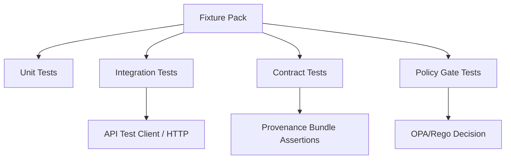

# 🧪 Synthetic Test Fixtures (KFM)


Synthetic (non-real) fixtures used across unit/integration/contract/policy tests.

> [!IMPORTANT]
> **No production / real-world / sensitive data belongs in this folder.**  
> If you think you need “just a small sample” of real data, stop and route it through governance review and an approved redaction/sanitization process **outside** this directory.

---

## Why this folder exists

KFM is a **governed, evidence-first** system. Tests must reflect that reality while still being:

- **Fast** (CI-friendly)
- **Deterministic** (same inputs ⇒ same digests ⇒ same outputs)
- **Safe** (no PII, no sensitive locations, no restricted materials)
- **Representative** (covers happy-path + governance failure modes)

These fixtures are designed to validate KFM’s “truth path” behavior: schema → policy gates → provenance/catalog emission → API/Focus Mode constraints.

---

## What belongs here

✅ **Allowed**
- Minimal, synthetic GeoJSON/CSV/JSON fixtures that exercise validators, mappers, and policy rules.
- “Golden” expected outputs for regressions (stable checksums).
- Synthetic **catalog artifacts** (STAC/DCAT/PROV) used by contract tests.
- Policy test inputs/expected decisions (e.g., OPA/Rego cases).
- Story/Focus Mode synthetic Story Node examples **with citations that resolve to synthetic evidence**.

🚫 **Not allowed**
- Real addresses, parcel boundaries from restricted sources, private individual data, sacred/culturally restricted info.
- Copies of licensed datasets without explicit permission.
- Large binaries unless there is a very strong reason (prefer generated-on-the-fly fixtures).
- “Convenience” dumps of real DBs.

---

## Non‑negotiables (fixture contract)

> [!NOTE]
> If your fixture violates any of these rules, tests should fail, reviewers should block the PR, and CI should enforce it.

1. **Deterministic**: Fixtures must be stable in content and ordering (no randomness without fixed seed).
2. **Small**: Fixtures must be minimal (see size budget below).
3. **Governed metadata**: Fixture packs that model datasets must include:
   - a synthetic **run receipt** (`kfm.run_receipt.v1` shape),
   - and synthetic **catalog artifacts** (DCAT always; STAC/PROV when applicable).
4. **Policy-first**: Every “published” synthetic dataset must include license + classification labels; missing metadata is a **fail-closed** test case.
5. **No side channels**: Fixtures must not create a pathway for tests to bypass policy (e.g., “just query DB directly”).

---

## Size budget

To keep CI fast and local development snappy:

- **Per file**: ≤ **250 KB**
- **Per pack** (folder): ≤ **2 MB**
- **Total for this directory**: aim ≤ **25 MB**

If you must exceed this:
- Use a generator script (preferred), or
- Use Git LFS only after explicit approval and clear justification in PR.

---

## Directory layout (expected)

```text
tests/fixtures/synthetic/
├─ README.md                                   # You are here: synthetic-fixture rules (safe-only, deterministic, reviewed)
│
├─ packs/                                      # Scenario-based fixture packs (one pack = one “test story”)
│  └─ <pack_id>/                               # Pack identifier (kebab/snake OK; keep stable once referenced)
│     ├─ pack.meta.json                        # REQUIRED: pack metadata (intent, version, owners, target tests)
│     ├─ checksums.sha256                      # REQUIRED: sha256 for every file in this pack (tamper detection)
│     │
│     ├─ inputs/                               # Raw-ish inputs to pipelines/services (tiny; synthetic; reproducible)
│     ├─ expected/                             # Golden outputs (normalized/stable; diff-friendly)
│     │
│     ├─ catalog/                              # Synthetic catalog artifacts (publish prerequisites)
│     │  ├─ stac/                              # STAC Collections/Items for this scenario
│     │  ├─ dcat/                              # DCAT dataset/distribution records
│     │  └─ prov/                              # PROV lineage/run refs tying inputs → outputs
│     │
│     ├─ policy/                               # Policy vectors for this scenario
│     │  ├─ inputs/                            # OPA input objects (actor/resource/context)
│     │  └─ expected/                          # Expected decisions (allow/deny + reasons/redactions)
│     │
│     └─ notes.md                              # Optional: reviewer notes (why this exists, what edge case it covers)
│
└─ shared/                                     # Reusable primitives (tiny building blocks used by multiple packs)
   ├─ geo/                                     # Canonical small geometries/extents (points/lines/polys; valid/invalid)
   ├─ time/                                    # Canonical timestamps/ranges/calendars (TZ, open/closed intervals)
   └─ ids/                                     # Canonical ID patterns + edge cases (slugs, UUIDs, stable refs)
```

> [!TIP]
> If your repo doesn’t yet have `packs/` and `shared/`, create them when you add the first fixture pack.  
> This README defines the **target convention** so fixtures don’t sprawl into an unmaintainable pile.

---

## Fixture packs

A **fixture pack** is the unit of ownership and review.  
It bundles inputs + expected outputs + governance artifacts for a coherent scenario.

### Pack ID convention

Use lowercase + dots + dashes; keep it stable:

- `kfm.synthetic.<domain>.<scenario>.v<major>`

Examples:
- `kfm.synthetic.catalog.happy-path.v1`
- `kfm.synthetic.policy.missing-license.v1`
- `kfm.synthetic.geometry.invalid-self-intersection.v1`
- `kfm.synthetic.focus.no-source-no-answer.v1`

### Required files in every pack

| File | Required | Purpose |
|---|---:|---|
| `pack.meta.json` | ✅ | Declares scenario intent + what it validates |
| `checksums.sha256` | ✅ | Ensures regression stability + supply-chain style integrity |
| `inputs/` | ✅ | What the test consumes |
| `expected/` | ✅ | What the test asserts |
| `catalog/` | ✅ (if pack models a publishable dataset) | DCAT/STAC/PROV artifacts |
| `policy/` | ✅ (if pack targets policy gates) | OPA inputs + expected allow/deny |
| `notes.md` | optional | reviewer guidance (why this exists, what to watch for) |

---

## `pack.meta.json` schema (required)

Minimal required fields:

```json
{
  "pack_id": "kfm.synthetic.catalog.happy-path.v1",
  "purpose": "Golden-path publishable dataset with complete license + catalogs + provenance.",
  "kfm_layers_covered": ["pipeline", "catalog", "policy", "api"],
  "expected_outcome": "pass",
  "data_classification": "public",
  "contains_real_data": false,
  "created_utc": "2026-02-13T00:00:00Z",
  "owners": ["kfm-eng"],
  "tags": ["ci-fast", "deterministic", "golden"]
}
```

Rules:
- `contains_real_data` must always be **false** here.
- `created_utc` should be stable (do not auto-update it each time you touch the pack).
- `expected_outcome` is one of: `pass | fail | redact`.

---

## `checksums.sha256` format (required)

Standard `sha256sum`-style lines:

```text
<sha256hex>  inputs/source.csv
<sha256hex>  expected/normalized.parquet
<sha256hex>  catalog/dcat.dataset.jsonld
<sha256hex>  catalog/stac.item.json
<sha256hex>  catalog/prov.json
```

Rules:
- Checksum file must include **every file** in the pack except `notes.md`.
- Tests must fail if any referenced file’s digest changes without the checksum being updated.

---

## Core scenarios we expect to cover (minimum suite)

Even if you don’t implement all of them on day one, this list defines the contract this folder is meant to support.

| Scenario | Pack example | Expected result | What it protects |
|---|---|---|---|
| Golden publish path | `...catalog.happy-path.v1` | ✅ pass | baseline end-to-end health |
| Missing license | `...policy.missing-license.v1` | ❌ fail | “No Source, No Answer” |
| Missing STAC/DCAT/PROV | `...policy.missing-catalogs.v1` | ❌ fail | publish prerequisites |
| Sensitive location | `...policy.sensitive-location.v1` | ⚠️ redact/deny | prevents location leaks |
| Invalid geometry | `...geometry.invalid-self-intersection.v1` | ❌ fail | geometry validator |
| Temporal inconsistency | `...time.future-date.v1` | ❌ fail | historic integrity rules |
| Citation resolution | `...focus.citation-resolves.v1` | ✅ pass | evidence resolver works |
| Cite-or-abstain | `...focus.no-source-no-answer.v1` | ✅ abstain/deny | Focus Mode hard gate |

---

## Synthetic run receipt (template + example)

When a pack models an ingest/publish run, include a receipt file in `catalog/` or `expected/`:

**Recommended filename:** `catalog/run_receipt.kfm.run_receipt.v1.json`

Example (fully filled; no placeholders):

```json
{
  "example": "kfm.run_receipt.v1",
  "run_id": "synthetic-20260213-000000Z-catalog-happy-path",
  "fetched_at": "2026-02-13T00:00:00Z",
  "accessURL": "https://example.org/source/synthetic",
  "etag": "W/\"abc123\"",
  "last_modified": "Wed, 12 Feb 2026 00:00:00 GMT",
  "spec_hash": "sha256:6a2f4b0f1baf0a9c4d4d2d1a2b8aeb0ad7a9bba6e2d6c6cf0bde12a0f1a2b3c4",
  "artifact_digest": "sha256:9f1c2d3e4a5b6c7d8e9f00112233445566778899aabbccddeeff001122334455",
  "tool_versions": {
    "pipeline": "1.0.0",
    "policy": "1.0.0"
  },
  "policy_gate": {
    "status": "pass",
    "checks": [
      "license_present",
      "dcat_present",
      "stac_present",
      "prov_present"
    ]
  }
}
```

Rules:
- `spec_hash` must be derived from a **canonicalized spec** (stable ordering).
- `artifact_digest` must match what STAC/DCAT claims (tests should verify).
- For “fail” packs, set `policy_gate.status = "fail"` and list the expected failing checks.

---

## Synthetic STAC/DCAT/PROV (minimum shapes)

### Minimal STAC Item (`catalog/stac.item.json`)

```json
{
  "type": "Feature",
  "stac_version": "1.0.0",
  "id": "synthetic-item-0001",
  "bbox": [-98.5, 38.5, -98.4, 38.6],
  "geometry": {
    "type": "Polygon",
    "coordinates": [
      [
        [-98.5, 38.5],
        [-98.4, 38.5],
        [-98.4, 38.6],
        [-98.5, 38.6],
        [-98.5, 38.5]
      ]
    ]
  },
  "properties": {
    "datetime": "2026-02-13T00:00:00Z"
  },
  "assets": {
    "data": {
      "href": "inputs/synthetic.geojson",
      "type": "application/geo+json",
      "roles": ["data"]
    }
  }
}
```

### Minimal DCAT Dataset (`catalog/dcat.dataset.jsonld`)

```json
{
  "@context": {
    "dcat": "http://www.w3.org/ns/dcat#",
    "dct": "http://purl.org/dc/terms/"
  },
  "@type": "dcat:Dataset",
  "dct:identifier": "kfm.synthetic.catalog.happy-path.v1",
  "dct:title": "KFM Synthetic Fixture — Catalog Happy Path v1",
  "dct:license": "https://creativecommons.org/publicdomain/zero/1.0/",
  "dct:description": "Synthetic dataset for CI tests; contains no real-world records.",
  "dcat:distribution": [
    {
      "@type": "dcat:Distribution",
      "dcat:accessURL": "https://example.org/synthetic/download",
      "dct:format": "application/geo+json"
    }
  ]
}
```

### Minimal PROV (`catalog/prov.json`)

```json
{
  "entity": {
    "synthetic:raw_asset": {
      "prov:label": "synthetic.geojson"
    }
  },
  "activity": {
    "synthetic:ingest_activity": {
      "prov:label": "synthetic ingest",
      "prov:startTime": "2026-02-13T00:00:00Z"
    }
  },
  "wasGeneratedBy": {
    "wGB1": {
      "prov:entity": "synthetic:raw_asset",
      "prov:activity": "synthetic:ingest_activity"
    }
  }
}
```

> [!IMPORTANT]
> These are **minimum shapes** intended for tests. Production catalogs will be richer, but tests should start from the smallest valid objects.

---

## Policy fixtures (OPA/Rego / Conftest style)

A policy pack should include:

- `policy/input.json` (input to OPA)
- `policy/expected.json` (expected allow/deny + reasons)

Example `policy/input.json`:

```json
{
  "dataset_id": "kfm.synthetic.policy.missing-license.v1",
  "classification": "public",
  "dcat_present": true,
  "stac_present": true,
  "prov_present": true,
  "license_present": false
}
```

Example `policy/expected.json`:

```json
{
  "decision": "deny",
  "violations": [
    {
      "code": "LICENSE_MISSING",
      "message": "Dataset promotion requires a license."
    }
  ]
}
```

---

## Using fixtures in tests (language-agnostic)

### General rule

Tests must treat fixtures as **read-only** input.  
If a test needs to mutate data, copy it to a temp directory first.

### Common pattern

1. Load fixture pack files from disk.
2. Run function/endpoint/policy under test.
3. Assert against `expected/` outputs.
4. Verify digests (checksums) for regression stability.

### Path resolution examples

#### Python

```python
from pathlib import Path

FIXTURES = Path(__file__).resolve().parents[3] / "tests" / "fixtures" / "synthetic" / "packs"
PACK = FIXTURES / "kfm.synthetic.catalog.happy-path.v1"

run_receipt = (PACK / "catalog" / "run_receipt.kfm.run_receipt.v1.json").read_text(encoding="utf-8")
```

#### TypeScript (Node)

```ts
import * as path from "path";
import * as fs from "fs";

const FIXTURES = path.resolve(__dirname, "..", "..", "..", "tests", "fixtures", "synthetic", "packs");
const PACK = path.join(FIXTURES, "kfm.synthetic.catalog.happy-path.v1");

const runReceipt = fs.readFileSync(path.join(PACK, "catalog", "run_receipt.kfm.run_receipt.v1.json"), "utf-8");
```

---

## Determinism rules (do not break these)

To keep fixtures stable across machines:

- ✅ Use **fixed timestamps** in fixtures (like `2026-02-13T00:00:00Z`), not `now()`.
- ✅ Use fixed seeds for any generator (`SEED=0` or explicit integer).
- ✅ Canonicalize JSON before hashing:
  - stable key ordering
  - stable float formatting
  - no trailing whitespace
- ✅ Use LF line endings (`\n`) for text files.
- ✅ If using CSV, keep:
  - stable column ordering
  - stable row ordering
  - explicit header row
- ✅ If using GeoJSON, keep:
  - stable `id` values
  - stable coordinate precision (recommend 6 decimals)

---

## Governance & safety notes

> [!WARNING]
> Synthetic fixtures can still leak sensitive information if you copy/paste from real sources.  
> **Assume every fixture is public** and will be shared broadly.

- Use obviously synthetic entity names (e.g., “Example County A”, “Station-001”).
- Avoid real addresses or exact site coordinates for anything plausibly sensitive.
- If you need a “Kansas-like” extent for validation tests, use generalized bounding boxes/polygons that do not correspond to a real private location.

---

## Adding a new fixture pack (standard workflow)

1. Create pack directory under `packs/<pack_id>/`.
2. Add `pack.meta.json`.
3. Add minimal inputs to `inputs/`.
4. Add expected outputs to `expected/`.
5. If modeling publishable data, add `catalog/` artifacts (DCAT required; STAC/PROV as applicable).
6. Add policy test files if the pack targets policy.
7. Generate `checksums.sha256` covering all pack files (except `notes.md`).
8. Add/adjust tests to:
   - load fixtures,
   - validate schema,
   - run policy,
   - verify checksums,
   - assert expected pass/fail/redact.
9. Ensure CI runs the new tests and fails on violations.

### Definition of Done (for any new pack)

- [ ] Pack follows naming + layout rules above.
- [ ] Pack is ≤ size budget (or has approved exception).
- [ ] Pack includes checksums and tests verify them.
- [ ] Pack contains **no real data** and is safe to share.
- [ ] Tests cover at least one governance rule (license/catalog/provenance/policy).
- [ ] If the pack targets Focus Mode behavior, citations resolve to synthetic evidence or the test asserts abstention/denial.

---

## Visualization of how packs are used



Plain-English fallback: fixture packs feed unit/integration/contract/policy tests; policy tests must deny on missing governance artifacts; contract tests must ensure responses include provenance bundles and respect redaction/deny rules.

---

## FAQ

### Why “synthetic” instead of “sample”?
Because “sample” tends to become “a little bit of real data,” which is how privacy, licensing, and governance problems enter test suites.

### Can I add a bigger fixture if I need to test performance?
Prefer a generator and run it in performance tests (not CI). If you must commit large artifacts, get explicit approval and document why.

### Where do “golden outputs” live?
Inside the pack’s `expected/` folder, with digests pinned in `checksums.sha256`.

---

## License

Unless explicitly stated otherwise in a pack’s metadata, **synthetic fixtures are treated as CC0** for internal reuse and test portability.

> If a fixture pack includes any content derived from third-party material (even if heavily transformed), it must include explicit attribution and an allowed license in `pack.meta.json` and the relevant catalog artifacts.

