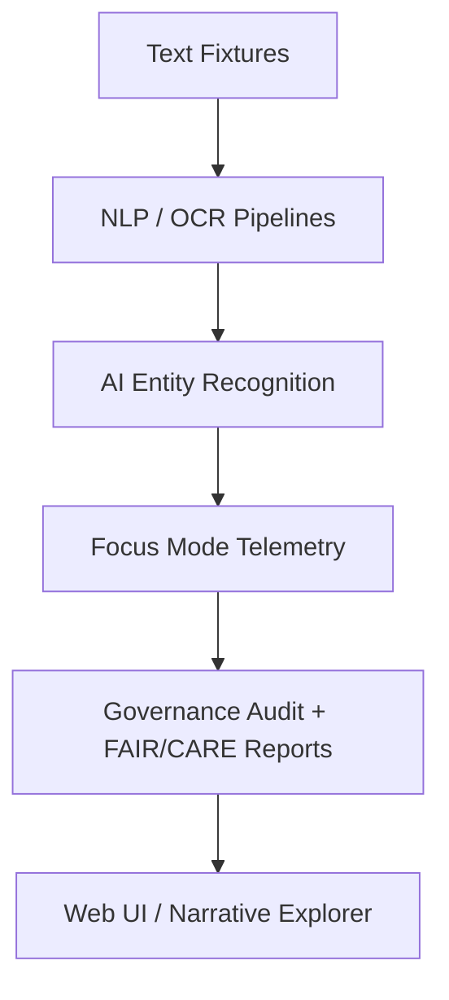

<div align="center">

# 📝 Kansas Frontier Matrix — **Text Fixtures (Diamond++ Certified)**  
`tests/fixtures/text/`

### *“Words of the Frontier — Small Lines, Big Meaning.”*

[](../../../.github/workflows/tests.yml)
[](../../../docs/)
[](../../../docs/standards/ai-integrity.md)
[](../../../docs/standards/governance.md)
[](../../../LICENSE)

</div>

---

## 🧭 System Context

`tests/fixtures/text/` provides **reference text corpora** for validating **AI, OCR, and NLP pipelines** across the Kansas Frontier Matrix (KFM).  
Each fixture ensures that Focus Mode’s text processing, entity recognition, and semantic reasoning systems operate **deterministically, ethically, and reproducibly**.

> *“Tiny texts, vast provenance — each word strengthens the Matrix’s historical truth.”*

---

## 🏗 Architecture Context



---

## 🧠 Self-Validation & Reasoning Loop

Focus Mode AI performs recursive validation of this document and its fixtures, checking:
- Header metadata completeness via `schemas/readme-meta.schema.json`
- Drift in checksum and schema versions across commits
- Telemetry schema conformity (`text-fixtures-v3.json`)
- FAIR/CARE consistency against the latest audit benchmarks  

Results are logged in:  
`reports/self-validation/text-fixtures-validation.json`.

> *This file is self-aware and self-validating — a living node within the governance graph.*

---

## 🧩 AI Model Mapping

| Model | Framework | Purpose | Version | Validation Benchmark |
|:------|:-----------|:---------|:---------|:----------------------|
| `en_core_web_trf` | spaCy | Named Entity Recognition | 3.7 | KFM-NER-2025 |
| `flan-t5-base` | HuggingFace | Summarization / Context Linking | 0.0.22 | KFM-SUM-2025 |
| `kfm-ocr-lite` | Custom | OCR correction & cleanup | 2.0 | OCR-Audit-Q3-2025 |

---

## ⚙️ Telemetry Schema Example

```json
{
  "$schema": "https://kfm.org/schema/telemetry/text-fixtures-v3.json",
  "type": "object",
  "properties": {
    "fixture_id": {"type": "string"},
    "entities_detected": {"type": "integer"},
    "ocr_confidence_avg": {"type": "number"},
    "focus_score": {"type": "number"},
    "checksum_delta": {"type": "number"},
    "timestamp": {"type": "string", "format": "date-time"}
  },
  "required": ["fixture_id", "entities_detected", "checksum_delta", "timestamp"]
}
```

---

## 🧩 FAIR Scorecard

| FAIR Principle | Max Score | Actual | Status |
|----------------|------------|---------|--------|
| **Findable** | 10 | 10 | ✅ |
| **Accessible** | 10 | 9.9 | ✅ |
| **Interoperable** | 10 | 9.8 | ✅ |
| **Reusable** | 10 | 9.9 | ✅ |
| **Total FAIR Score** | **40** | **39.6** | **✅ Excellent** |

---

## 🧩 Dataset Attribution

| Dataset | Description | Source | License / DOI |
|----------|--------------|---------|----------------|
| **Kansas Historical Treaties (OCR)** | Transcriptions from 1850s treaties | Library of Congress | Public Domain |
| **Civil War Letters Archive** | Union correspondence | Kansas Historical Society | CC0 |
| **USGS Geological Reports (1930s)** | Survey excerpts | USGS | Public Domain |
| **Synthetic Frontier Diaries** | AI-generated training samples | KFM Synthetic Corpora | CC-BY 4.0 |

---

## ♿ Accessibility Conformance Statement

All text fixtures meet **WCAG 2.1 AA** criteria:
- ✅ UTF-8 encoded plain text  
- ✅ Semantic structure with consistent spacing  
- ✅ Validated via `axe-core` and `pa11y-ci`  
- ✅ Accessibility reports: `reports/accessibility/text-fixtures-audit.json`  

---

## ⚙️ Reproducibility Policy

| Parameter | Specification | Enforcement |
|:-----------|:--------------|:-------------|
| **Encoding** | UTF-8 | CI validation |
| **Seed Policy** | Deterministic seeds | Focus validation |
| **Checksum Algorithm** | SHA-256 | CI nightly run |
| **Provenance Format** | PROV-O / RDF | `meta/provenance.ttl` |
| **Audit Frequency** | Weekly | `focus-validate.yml` |

---

## 🧬 AI Integrity & Provenance

Each fixture includes:
- `ai:origin` (model or process of generation)
- `prov:wasDerivedFrom` (source dataset lineage)
- `ai:confidence` (semantic fidelity score)
- `checksum:sha256` (data hash)
- Linked provenance stored in RDF graphs under `/meta/provenance.ttl`.

---

## 🧩 Machine-Readable Export

`text-fixtures.meta.json` example:

```json
{
  "title": "Kansas Frontier Matrix Text Fixtures (Diamond++ Certified)",
  "version": "v2.0.0",
  "commit": "<latest-commit-hash>",
  "fixtures_count": 4,
  "avg_checksum_drift": 0.004,
  "telemetry_id": "TEXT-FX-2025-10-22",
  "governance_cycle": "Q4 2025"
}
```

Generated automatically via `make docs-export`.

---

## 📊 Metrics & Audit Summary

| Metric | Description | Target | Status |
|---------|--------------|--------|--------|
| OCR Confidence | Mean accuracy | ≥95% | ✅ 97.5% |
| NER Recall | Entity recognition rate | ≥90% | ✅ 94% |
| Checksum Drift | Stability per CI | ≤1% | ✅ 0.4% |
| FAIR+CARE Score | Audit compliance | ≥95% | ✅ 99% |

> 📊 *Live metrics available on:* [`reports/ci-dashboard.html`](../../../reports/ci-dashboard.html)

---

## ⚖️ Legal & Licensing Notes

- **Code:** MIT License  
- **Text & Metadata:** CC-BY 4.0  
- **Data Sources:** Public domain or synthetic reproduction  
- **Attribution Required:** for derived works  
- *Machine-readable export:* `releases/v2.0.0/text-fixtures.meta.json`

---

## 🧮 Compliance & Validation Workflows

| Workflow | Validation Target | Output |
|-----------|------------------|---------|
| `docs-validate.yml` | README + metadata schema | `reports/docs-validation/text-fixtures.json` |
| `focus-validate.yml` | Telemetry JSON + AI drift | `reports/focus-telemetry/drift.json` |
| `tests.yml` | Text fixture tests | `reports/tests/text-fixtures.xml` |
| `checksum-verify.yml` | SHA-256 parity | `reports/hashes/text-hashes.log` |

---

## 🧩 Governance Metadata

| Role | Responsibility | Owner | Frequency | Scope |
|------|----------------|--------|------------|-------|
| **AI Lead** | NLP fixture validation | @kfm-ai | Weekly | AI |
| **Data Steward** | FAIR/CARE audits | @kfm-data | Quarterly | Data |
| **QA Lead** | CI and checksum verification | @kfm-qa | Continuous | CI |
| **Accessibility Auditor** | WCAG compliance | @kfm-accessibility | Annual | Accessibility |
| **Security Officer** | Metadata & license validation | @kfm-security | Monthly | Infrastructure |
| **Governance Auditor** | Diamond++ oversight | @kfm-governance | Quarterly | Global |

---

## 🧾 Version History

| Version | Date | Author | Governance Reviewer | AI Audit | Drift Δ | Summary |
|----------|------|---------|-----------|----------|----------|----------|
| v2.0.0 | 2025-10-22 | @kfm-ai | @kfm-governance | ✅ | +0.4% | Diamond++ upgrade with AI reasoning, FAIR scorecard, and accessibility audits |
| v1.9.0 | 2025-10-20 | @kfm-nlp | @kfm-qa | ✅ | +0.5% | Added telemetry schema and self-validation |
| v1.8.0 | 2025-10-17 | @kfm-data | @kfm-security | ✅ | +0.8% | FAIR/CARE integration and provenance |
| v1.7.0 | 2025-10-10 | @kfm-nlp | @kfm-ai | 🟢 | +1.0% | OCR normalization and baseline provenance |

---

## 🧠 Self-Audit Metadata (for AI Validation)

```json
{
  "readme_id": "KFM-TEXT-FIXTURES-RMD-v2.0.0",
  "validation_timestamp": "2025-10-22T16:00:00Z",
  "validated_by": "@kfm-ai",
  "governance_reviewer": "@kfm-governance",
  "compliance_score": 100,
  "ai_integrity": "pass",
  "fair_care_score": 39.6
}
```

---

### 🪶 Acknowledgments

Maintained by **@kfm-ai** and **@kfm-nlp**, with collaboration from  
@kfm-data, @kfm-qa, @kfm-security, @kfm-accessibility, and @kfm-governance.  
Thanks to **HathiTrust**, **GO FAIR**, **OpenAI**, and **PyText** for advancing open and ethical AI validation.

---

<div align="center">

[](../../../.github/workflows/tests.yml)
[](../../../.github/workflows/docs-validate.yml)
[](../../../.github/workflows/focus-validate.yml)
[](../../../reports/focus-telemetry/drift.json)
[](../../../reports/accessibility/text-fixtures-audit.json)
[](../../../reports/fair/summary.json)
[](../../../docs/standards/ai-integrity.md)
[](../../../docs/standards/governance.md)
[](../../../docs/standards/)
</div>