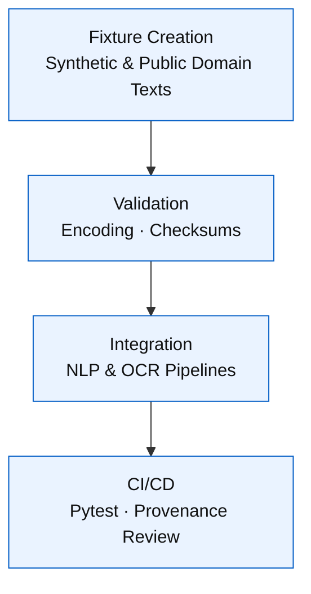

<div align="center">

# 📝 Kansas Frontier Matrix — **Text Fixtures**  
`tests/fixtures/text/`

### *“Words of the Frontier — Small Lines, Big Meaning.”*

[](../../../.github/workflows/tests.yml)  
[](../../../docs/)  
[](../../../LICENSE)

</div>

---

## 🪶 Overview

The **Text Fixtures** directory contains **OCR, historical, and NLP sample texts** that verify KFM’s **AI and language-processing pipelines**.  
Each file is **synthetic, lightweight, and deterministic**, allowing consistent validation of **NER, OCR, and summarization** logic.

- 🧠 **AI/NLP Ready** — formatted for entity recognition, tokenization, and semantic tests  
- 📜 **Historically Grounded** — inspired by Kansas frontier diaries and reports  
- 🧩 **Deterministic** — fixed wording for reproducible parsing  
- 🔍 **Provenance-Tracked** — each file has metadata + checksum  
- ♿ **Accessible** — WCAG 2.1 AA–aligned plain-text design  

---

## ⚙️ Architecture


<!-- END OF MERMAID -->

---

## 🗂 Directory Layout

```text
tests/fixtures/text/
├── sample_diary.txt        # OCR-style diary entry snippet (1890s)
├── treaty_excerpt.txt      # Partial Kansas treaty transcription
├── letter_fragment.txt     # Civil War–era correspondence
├── report_excerpt.txt      # Geological survey text fragment
├── treaty_excerpt.meta.json # Metadata example (license, checksum)
└── README.md               # This documentation file
```

---

## 🧩 Fixture Summary

| File | Type | Context | Used In | Purpose |
|:-----|:-----|:---------|:--------|:---------|
| `sample_diary.txt` | OCR transcription | 1890s farm diary | `ai_entity_extraction.ipynb`, NLP tests | NER for dates and places |
| `treaty_excerpt.txt` | Historical treaty text | 1850s U.S.–Tribal treaty | Relation extraction, STAC linkage | Validate entity relationships |
| `letter_fragment.txt` | Civil War letter | Union soldier correspondence | OCR correction, token normalization | Validate AI text cleaning |
| `report_excerpt.txt` | Geological field report | 1930s Kansas survey | Summarization + segmentation tests | Sentence boundary validation |

---

## 🧠 Example — `sample_diary.txt`

```text
March 12, 1894 – The Arkansas River overflowed near Larned.  
Father said the fields by the creek turned to silt overnight.  
We repaired the fence before noon and rode east toward Ellsworth for seed.
```

> Contains **date**, **locations**, and **narrative context** — ideal for NER and OCR validation.

---

## 🧪 Usage Examples

### 🐍 Python

```python
from pathlib import Path

def test_text_fixture(fixtures_dir):
    diary = (fixtures_dir / "text/sample_diary.txt").read_text(encoding="utf-8")
    assert "Larned" in diary
    assert "Arkansas River" in diary
```

### 🤖 NLP Integration

```python
from tools.ai_utils import extract_entities

text = open("tests/fixtures/text/treaty_excerpt.txt").read()
entities = extract_entities(text)
assert any(e['type'] == "Place" for e in entities)
```

### 🧬 OCR Simulation

Used by post-processing functions to test:

- Whitespace normalization  
- OCR confidence scoring  
- Correction of misread characters (e.g., “Lamed” → “Larned”)  

---

## ⚙️ Design & Provenance

| Attribute | Specification |
|:-----------|:--------------|
| **Encoding** | UTF-8 |
| **Line Endings** | Unix (`\n`) |
| **Character Set** | ASCII + diacritics |
| **File Size** | < 5 KB |
| **Randomness** | None |
| **Provenance** | Generated or adapted from public-domain data |
| **Metadata** | Optional `.meta.json` with checksum + license |

**Example Metadata (`treaty_excerpt.meta.json`):**

```json
{
  "id": "treaty_excerpt",
  "version": "v1.1.0",
  "source": "Public domain transcription based on 1850s Kansas treaty records",
  "license": "Public Domain",
  "checksum:sha256": "27bca6a578e2f5e97a13b59f6126a914..."
}
```

---

## 🔄 Regeneration Workflow

| Step | Tool | Description |
|:-----|:-----|:-------------|
| 1️⃣ | `tools/notebooks/ai_entity_extraction.ipynb` | Generate or refine text fixtures |
| 2️⃣ | `text_cleaner.py` | Normalize encoding, punctuation, and whitespace |
| 3️⃣ | `sha256sum` | Compute file checksums for provenance |
| 4️⃣ | `pytest` | Run CI validation (encoding, schema, checksum) |

All new fixtures must include a metadata JSON and be validated in CI prior to merge.

---

## 🧾 Versioning & Metadata

| Field | Value |
|:------|:------|
| **Version** | `v1.2.0` |
| **Codename** | *Linguistic Provenance Alignment* |
| **Last Updated** | 2025-10-17 |
| **Maintainers** | @kfm-ai · @kfm-nlp |
| **License** | MIT (code) · CC-BY 4.0 (docs/texts) |
| **Semantic Alignment** | FAIR Principles · MCP-DL v6.3 · WCAG 2.1 AA |
| **Maturity** | Production |
| **Integrity** | SHA-256 validated per `.meta.json` files |

---

## 🧮 CHANGELOG

| Version | Date | Author | Summary |
|:--------|:------|:--------|:--------|
| **v1.2.0** | 2025-10-17 | @kfm-nlp | Added checksum and metadata tracking |
| **v1.1.0** | 2025-10-10 | @kfm-ai | Integrated OCR normalization rules |
| **v1.0.0** | 2025-10-01 | @kfm-data | Initial NLP text fixture set |

---

## 🧠 MCP-DL v6.3 Compliance

| Principle | Implementation |
|:-----------|:----------------|
| **Documentation-First** | Each fixture documented and versioned |
| **Reproducibility** | Deterministic plain-text samples |
| **Provenance** | Metadata JSONs with SHA-256 |
| **Accessibility** | WCAG-aligned UTF-8 text |
| **Open Standards** | Plain text + JSON metadata |
| **Auditability** | CI checks for hash + encoding integrity |

---

<div align="center">

**© Kansas Frontier Matrix — Text Fixtures**  
Developed under the **Master Coder Protocol (MCP)**  

[]()  
[]()

</div>