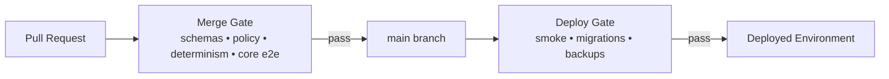

<!--
File: tests/governance/README.md
KFM: Governed • Evidence-first • FAIR+CARE aligned
-->

# 🧭 Governance Test Gatehouse (Merge-Blocking)


> [!IMPORTANT]
> This directory is the **governance gatehouse**: tests here are intended to be **merge-blocking**.
> If something fails, the correct fix is almost always **“repair the artifact/policy/receipt”**, not “relax the gate.”

KFM’s architecture and documentation repeatedly emphasize that governance is not a slogan—it’s enforced through **validation gates** (schemas, policies, determinism, and end-to-end evidence checks) so that maps, narratives, and AI outputs stay **traceable, permissioned, and reviewable**.

---

## Why this exists

KFM is designed as a governed spatio-temporal knowledge system:

**data → pipeline → catalogs/provenance → APIs → UI/Focus Mode**

That “truth path” only remains credible if the platform **fails closed** whenever:
- provenance is missing,
- rights/licensing is incomplete,
- sensitivity/CARE constraints are violated,
- determinism drifts,
- or citations/evidence can’t be resolved.

This folder turns those promises into **tests**.

---

## What this folder protects

### Governance invariants

| Invariant (must hold) | What it means in practice | How we enforce it here |
|---|---|---|
| **Evidence-first** | Claims must trace to approved sources or be labeled “not confirmed.” | Contract tests + “citation handshake” fixtures |
| **Trust membrane** | No UI/external client bypasses the governed API policy boundary. | E2E tests must go through API endpoints (never direct DB reads) |
| **Policy-as-code** | Default-deny policies are executable and tested in CI and match runtime behavior. | OPA/Rego unit tests + Conftest test suite |
| **FAIR + CARE operational** | Metadata quality (FAIR) + authority/control/consent (CARE) become checks, not vibes. | Promotion-gate policy fixtures + sensitivity tests |
| **Determinism** | Same canonical spec → same `spec_hash`; stable IDs across re-emits when material inputs don’t change. | Golden tests + canonicalization tests |
| **Cite-or-abstain** | If citations cannot be produced, **the system must refuse** (especially Focus Mode). | Focus Mode output schema tests + refusal/deny tests |

---

## CI gate model

KFM documentation calls for two distinct CI/CD gates:

1) **Merge gate** — artifact correctness (schemas, policies, determinism, key E2E checks)  
2) **Deploy gate** — environment smoke tests + migrations + backup verification



> [!NOTE]
> This README documents **merge-gate governance tests**. Deploy-gate smoke tests can live elsewhere,
> but must still enforce deny-by-default behavior.

---

## Directory layout

> [!TIP]
> If your repo differs, update this tree to match reality. The *pattern* matters more than the exact paths.

```text
tests/
└── governance/
    ├── README.md                          # You are here
    ├── fixtures/
    │   ├── policy_inputs/                 # JSON inputs to policy packs (promotion manifests, receipts, etc.)
    │   ├── focus_mode/                    # “answer objects” + refusal cases + citation bundles
    │   ├── catalogs/                      # Small DCAT/STAC/PROV samples (valid + invalid)
    │   └── known_leaks/                   # Negative fixtures: “if this passes, we leaked”
    ├── schemas/
    │   ├── pinned/                        # Pinned schema versions used by CI (DCAT/STAC/PROV + KFM shapes)
    │   └── kfm/                           # KFM-specific schemas (e.g., focus_answer.v1.json)
    ├── policy/
    │   ├── opa/                           # Test harness policies (or link/alias to repo policy packs)
    │   └── README.md                      # How to run Conftest locally
    ├── golden/
    │   ├── spec_hash/                     # Golden snapshots verifying stable hashing/canonicalization
    │   └── ids/                           # Golden snapshots for stable canonical IDs
    └── test_*.{py,ts,js}                  # Governance tests (language per repo stack)
```

---

## What we test

### 1) Schema contract validation (DCAT / STAC / PROV)

**Goal:** stop “silent metadata drift” and broken evidence links by validating catalog artifacts against **pinned schema versions**.

**Typical checks:**
- DCAT records validate (required fields present; URLs/identifiers well-formed)
- STAC collections/items validate (spatiotemporal footprints, assets, temporal fields)
- PROV receipts validate (required provenance fields and artifact references exist)

**Expected outputs:** fail fast with a clear “which schema / which field” report.

---

### 2) Policy packs (OPA/Rego + Conftest) — *fail closed*

**Goal:** enforce governance rules as executable policies with deny-by-default behavior.

Common policy gates include:
- receipts required (e.g., `artifact_digest` present)
- no insecure URLs (e.g., reject `http://`)
- rights/license present
- CARE/sensitivity rules satisfied (labels, consent facets, etc.)

**Conftest example (pattern):**
```bash
# Example patterns; adapt paths to your repo
conftest verify -p policy/opa
conftest test tests/governance/fixtures/policy_inputs/*.json -p policy/opa
```

> [!IMPORTANT]
> Policies must be tested in CI **and** enforced at runtime. If CI allows something runtime denies (or vice‑versa),
> governance becomes brittle and “default deny” can fail open through drift.

---

### 3) Determinism gates (spec_hash + stable canonical IDs)

**Goal:** ensure the same canonical specification produces the same identifiers and hashes.

We run golden tests to ensure:
- **`spec_hash` stability**: same canonical spec → same hash
- canonical IDs don’t change on non-material jitter

**Recommendation:**
- Use a canonical JSON serialization approach for any hashed/signed objects (e.g., JSON Canonicalization Scheme / RFC 8785).

---

### 4) Sensitivity & CARE gates (including tribal consent patterns)

**Goal:** prevent high-risk leaks of restricted locations or culturally restricted data.

We test:
- policy labels at dataset/record/field level are present where required
- derivatives show explicit redaction/generalization provenance
- fail-closed checks block promotion/public exposure when required consent/authority facets are missing

**Negative fixtures (“known leak fixtures”)**
- Deliberately include a case that would be a leak (e.g., precise coordinates for a restricted site) and verify **policy denies**.

> [!WARNING]
> **Never commit real sensitive coordinates, PII, or restricted records** as fixtures.
> Use synthetic geometry and synthetic IDs that mimic the dangerous shape of the data.

---

### 5) Focus Mode “cite-or-abstain” governance tests

**Goal:** enforce the citation handshake:
- at least one citation object must exist with dataset identifiers (e.g., DOI/provider key)
- citation links must resolve to evidence endpoints (DCAT landing + STAC collection/item)
- if citations are missing → **policy deny** (refusal)

We test:
- schema requires citations for non-refusal answers
- refusal answers are correctly shaped and do not include disallowed content
- citations resolve through the evidence resolver endpoints in E2E mode

---

### 6) End-to-end governance proof tests

These tests validate the highest-level guarantees:
- **tiles served correspond to processed artifacts**
- **citations resolve via evidence endpoints**
- **Focus Mode refuses without citations**

These should be:
- **small** (few cases)
- **deterministic**
- **merge-blocking**

---

## How to run locally

> [!NOTE]
> This repo may be polyglot. The governance intent is stable; the runner can vary.
> If you haven’t wired a unified runner yet, start with the minimal commands below.

### Minimal “gatehouse” run (suggested)
```bash
# Policy unit tests (OPA/Rego)
conftest verify -p policy/opa
conftest test tests/governance/fixtures/policy_inputs -p policy/opa

# Contract + golden + governance tests (choose one runner per repo language)
pytest -q tests/governance        # if Python
# OR
npm test -- tests/governance      # if Node/Jest
```

### CI expectations
- Governance tests must be **merge-blocking**
- Failures must surface:
  - which artifact/fixture failed
  - which schema/policy rule denied
  - actionable remediation guidance

---

## Adding a new governance rule (Definition of Done)

When adding a new rule/policy gate:

- [ ] Define the **contract** (schema or policy input shape) and version it
- [ ] Add **positive** fixtures (allowed)
- [ ] Add **negative** fixtures (denied) — include at least one “known leak fixture” when applicable
- [ ] Add unit tests for the policy pack (Rego tests and/or Conftest fixtures)
- [ ] Add/extend any schema validation tests (DCAT/STAC/PROV/KFM schemas)
- [ ] If the rule affects end-user outputs (UI/Focus Mode), add an E2E proof test
- [ ] Document how the rule maps to FAIR/CARE and what risks it mitigates
- [ ] Confirm default behavior is **fail closed**

---

## Troubleshooting guide

<details>
<summary><strong>Schema validation failing</strong></summary>

- Confirm you are validating against the **pinned schema** version expected by CI.
- Don’t “fix” failures by loosening schemas—fix the artifact emitters or adapters.
</details>

<details>
<summary><strong>Policy pack denies unexpectedly</strong></summary>

- Read the deny reasons: treat them as governance requirements, not “bugs to bypass.”
- Check for drift between CI policy inputs and runtime policy inputs.
</details>

<details>
<summary><strong>spec_hash golden changed</strong></summary>

- Determine whether the spec changed materially (expected) vs canonicalization drift (bug).
- Ensure deterministic ordering and canonical serialization for hashed objects.
</details>

<details>
<summary><strong>Focus Mode tests fail (“missing citations”)</strong></summary>

- If the answer contains factual content, it must carry at least one citation bundle.
- If no citeable evidence exists, the correct behavior is **refusal**.
</details>

---

## Governance review notes

> [!IMPORTANT]
> Any PR that changes governance policies, schemas, or gate behavior should be treated as a **production change**:
> require CODEOWNER review and ensure the change is accompanied by fixtures + tests.

> [!TIP]
> Keep governance fixtures **small, synthetic, and explicit**. The goal is to test policy logic, not to embed real data.

---

