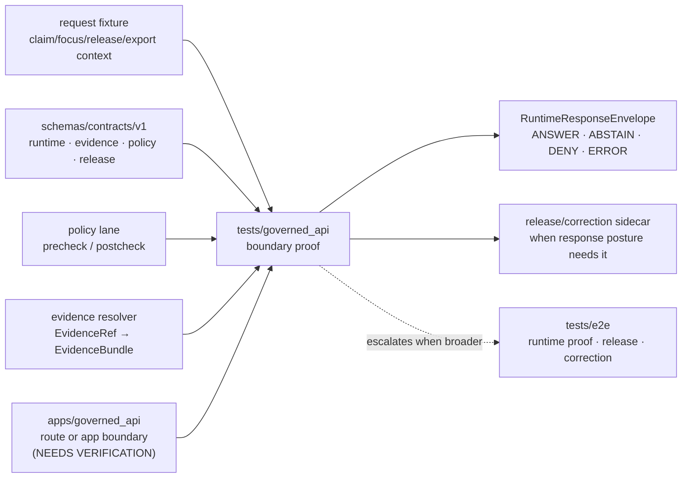

<!-- [KFM_META_BLOCK_V2]
doc_id: kfm://doc/TODO-NEEDS-VERIFICATION
title: Governed API Tests
type: standard
version: v1
status: draft
owners: TODO-VERIFY(@bartytime4life inherited from surfaced /tests ownership; leaf owner still needs active-branch verification)
created: TODO-VERIFY(YYYY-MM-DD)
updated: TODO-VERIFY(YYYY-MM-DD)
policy_label: TODO-VERIFY(public|restricted)
related: [../README.md, ../contracts/README.md, ../integration/README.md, ../e2e/README.md, ../policy/README.md, ../reproducibility/README.md, ../unit/README.md, TODO-VERIFY(../../apps/governed_api/README.md), TODO-VERIFY(../../schemas/contracts/v1/runtime/README.md), TODO-VERIFY(../../schemas/contracts/v1/evidence/README.md), TODO-VERIFY(../../policy/README.md)]
tags: [kfm, tests, governed-api, runtime-envelope, evidence, policy, no-bypass]
notes: [Target path supplied by current request as tests/governed_api/README.md, local checkout was not mounted during this drafting pass, surfaced KFM docs support /tests ownership and governed API doctrine but exact leaf existence runner CI wiring route names and branch enforcement remain NEEDS VERIFICATION]
[/KFM_META_BLOCK_V2] -->

<a id="top"></a>

# Governed API Tests

Verification lane for KFM governed API boundary behavior: evidence resolution, policy mediation, finite runtime envelopes, and no-bypass public response discipline.

> [!IMPORTANT]
> **Status:** `experimental`  
> **Owners:** `TODO-VERIFY(@bartytime4life inherited from /tests; leaf owner still needs active-branch verification)`  
> **Path target:** `tests/governed_api/README.md`  
> **Repo fit:** child lane under [`../README.md`](../README.md); adjacent to [`../contracts/README.md`](../contracts/README.md), [`../integration/README.md`](../integration/README.md), [`../e2e/README.md`](../e2e/README.md), [`../policy/README.md`](../policy/README.md), [`../unit/README.md`](../unit/README.md), and [`../reproducibility/README.md`](../reproducibility/README.md)  
> **Downstream candidates:** `../../apps/governed_api/`, `../../schemas/contracts/v1/runtime/`, `../../schemas/contracts/v1/evidence/`, `../../policy/`, and `../../data/published/governed_api/` are **NEEDS VERIFICATION** from the active branch before converting to hard links.  
> **Quick jumps:** [Scope](#scope) · [Repo fit](#repo-fit) · [Accepted inputs](#accepted-inputs) · [Exclusions](#exclusions) · [Directory tree](#directory-tree) · [Quickstart](#quickstart) · [Usage](#usage) · [Diagram](#diagram) · [Operating tables](#operating-tables) · [Task list](#task-list--definition-of-done) · [FAQ](#faq) · [Appendix](#appendix)


> [!CAUTION]
> This directory should prove **governed API behavior**, not become a second home for schemas, policy source, application code, release artifacts, model providers, or canonical evidence stores.

---

## Scope

`tests/governed_api/` is the focused verification lane for the API trust membrane.

It exists to prove that outward API responses are built from governed evidence, policy, release state, and runtime-envelope contracts rather than hidden joins, raw-store reads, browser-side reconstruction, or direct model calls.

### What this lane should prove

A test belongs here when the main question is:

- Does the governed API route or app boundary return a finite `RuntimeResponseEnvelope`?
- Does a request resolve `EvidenceRef → EvidenceBundle` before a consequential response?
- Does the API fail visibly as `ABSTAIN`, `DENY`, or `ERROR` instead of smoothing failure into a false success?
- Does the boundary keep public clients away from `RAW`, `WORK`, `QUARANTINE`, canonical stores, and direct model runtimes?
- Does correction, supersession, withdrawal, stale state, or release posture remain visible at the response boundary?
- Does the route wrapper preserve policy decisions rather than re-implementing policy logic in a test-only path?
- Does the response include auditable references such as request id, evidence bundle refs, policy decision refs, run receipt refs, or release/correction sidecars when the contract requires them?

### What this lane should not claim yet

The active repository was not mounted during this drafting pass. Keep these statements downgraded until branch evidence proves them:

| Claim | Current label | Required proof before upgrade |
| --- | ---: | --- |
| `tests/governed_api/` already exists | **NEEDS VERIFICATION** | active repo tree |
| runner is `pytest`, `vitest`, or another specific harness | **NEEDS VERIFICATION** | package/config files or existing tests |
| `apps/governed_api/` is the final implementation home | **NEEDS VERIFICATION** | mounted app tree and ADR/path reconciliation |
| route names and app registration are implemented | **NEEDS VERIFICATION** | route source files and app-level tests |
| CI blocks merges on this lane | **NEEDS VERIFICATION** | workflow YAML and branch-protection evidence |
| production public traffic uses these exact tests | **UNKNOWN** | deployment/runtime logs and release proof |

<p align="right"><a href="#top">Back to top ↑</a></p>

---

## Repo fit

### Placement

```text
tests/governed_api/README.md
```

This lane sits between general integration testing and full end-to-end runtime proof.

| Neighbor | Relationship | Working rule |
| --- | --- | --- |
| [`../README.md`](../README.md) | parent governed verification index | inherit the repo-wide test posture and labels |
| [`../contracts/README.md`](../contracts/README.md) | contract shape and example validation | consume schema truth; do not redefine it here |
| [`../policy/README.md`](../policy/README.md) | policy behavior and decision grammar | assert policy effects at the API boundary; keep policy source outside this lane |
| [`../integration/README.md`](../integration/README.md) | cross-boundary slice tests | use when the proof is broader than a route wrapper but not full public runtime proof |
| [`../e2e/README.md`](../e2e/README.md) | release, correction, runtime-proof drills | escalate there when promotion, release assembly, or multi-surface runtime proof is required |
| [`../unit/README.md`](../unit/README.md) | cheap local helper proof | use only for pure local logic with no real boundary |
| [`../reproducibility/README.md`](../reproducibility/README.md) | deterministic rebuild and digest checks | use when the main burden is stable identity, counts, or rerun equivalence |

### Downstream surfaces to verify before hard-linking

| Candidate surface | Why this README references it | Current label |
| --- | --- | ---: |
| `../../apps/governed_api/` | likely app/route boundary for governed API behavior | **NEEDS VERIFICATION** |
| `../../apps/governed-api/` | naming variant visible in prior doctrine; may be legacy or alternate home | **NEEDS VERIFICATION** |
| `../../schemas/contracts/v1/runtime/` | likely `RuntimeResponseEnvelope` schema family | **NEEDS VERIFICATION** |
| `../../schemas/contracts/v1/evidence/` | likely `EvidenceBundle` / `EvidenceRef` schema family | **NEEDS VERIFICATION** |
| `../../schemas/contracts/v1/policy/` | likely `PolicyDecision` / `DecisionEnvelope` schema family | **NEEDS VERIFICATION** |
| `../../data/published/governed_api/` | expected emitted response artifact lane for runtime/public surfaces | **NEEDS VERIFICATION** |

> [!TIP]
> Prefer current branch path names over manual shorthand. Prefer KFM burden language over folder aesthetics when deciding where a test belongs.

<p align="right"><a href="#top">Back to top ↑</a></p>

---

## Accepted inputs

Content that belongs in `tests/governed_api/` includes:

- route-wrapper tests for governed API responses;
- app-registration tests that prove one boundary path is actually mounted;
- no-direct-model-client tests;
- no-public-raw-store / no-work / no-quarantine access tests;
- fixture-backed `EvidenceRef → EvidenceBundle` response tests;
- runtime envelope tests for `ANSWER`, `ABSTAIN`, `DENY`, and `ERROR`;
- release/correction sidecar visibility tests when a response depends on supersession, withdrawal, correction, or stale-state posture;
- adapter-boundary tests that consume already-governed outward artifacts;
- smoke tests that prove policy precheck/postcheck results are represented at the API boundary;
- small fixtures that are execution-oriented and safe to expose in review;
- narrowly scoped README or fixture notes for active governed API test sublanes.

### Preferred test names

Use names that say what trust burden is being proved.

```text
test_governed_api_app_registration.py
test_governed_api_no_direct_model_client.py
test_governed_api_no_raw_store_bypass.py
test_runtime_response_envelope_outcomes.py
test_evidence_bundle_resolution_boundary.py
test_release_sidecar_visibility.py
test_policy_denial_visible_at_boundary.py
```

<p align="right"><a href="#top">Back to top ↑</a></p>

---

## Exclusions

Do **not** put the following here as authoritative truth:

| Excluded material | Put it here instead | Reason |
| --- | --- | --- |
| canonical schemas, vocabularies, OpenAPI definitions | `../../schemas/` or `../../contracts/` | this lane verifies contracts; it does not author them |
| policy source, reviewer-role maps, obligation registries | `../../policy/` | policy authority must remain separate from API tests |
| runtime app code, routes, adapters, middleware | `../../apps/` or `../../packages/` | tests should not become shadow implementation |
| release manifests, receipts, proof packs, promoted artifacts | governed artifact/release lanes | tests may fixture or assert them, not own them |
| large datasets, raw source samples, scratch dumps | governed data zones or ignored local paths | test fixtures must remain small, safe, and reviewable |
| full release assembly or multi-surface correction drills | [`../e2e/`](../e2e/) | that burden is broader than one API boundary lane |
| direct provider prompts, provider credentials, model outputs | governed adapter/test fixtures only | direct public model access is a denial condition |

<p align="right"><a href="#top">Back to top ↑</a></p>

---

## Directory tree

> [!WARNING]
> **NEEDS VERIFICATION:** this tree is a proposed review shape for `tests/governed_api/`. Do not claim these files exist until the active repository confirms them.

```text
tests/governed_api/
├── README.md
├── fixtures/
│   ├── README.md
│   ├── evidence_ref.valid.json
│   ├── evidence_ref.missing_bundle.invalid.json
│   ├── runtime_answer.valid.json
│   ├── runtime_abstain.valid.json
│   ├── runtime_deny.valid.json
│   └── runtime_error.valid.json
├── test_governed_api_app_registration.py
├── test_governed_api_no_direct_model_client.py
├── test_governed_api_no_raw_store_bypass.py
├── test_evidence_bundle_resolution_boundary.py
├── test_policy_denial_visible_at_boundary.py
├── test_release_sidecar_visibility.py
└── test_runtime_response_envelope_outcomes.py
```

### Relationship to existing runtime-proof lanes

If the test requires full release/correction/public-runtime proof, keep it under the specific downstream family:

```text
tests/e2e/runtime_proof/
tests/e2e/release_assembly/
tests/e2e/correction/
```

If the test only validates object shape, keep it under the contract family:

```text
tests/contracts/
schemas/contracts/v1/
schemas/tests/
```

<p align="right"><a href="#top">Back to top ↑</a></p>

---

## Quickstart

### 1. Inspect before running

Run from the repository root after the real checkout is mounted.

```bash
pwd
git status --short
git branch --show-current || true

find tests/governed_api -maxdepth 4 -type f 2>/dev/null | sort || true
find tests/contracts tests/integration tests/e2e tests/policy -maxdepth 4 -type f 2>/dev/null | sort | sed -n '1,200p'

find apps/governed_api apps/governed-api apps/api packages -maxdepth 5 -type f 2>/dev/null | sort | sed -n '1,240p'
find schemas/contracts/v1 policy data/published -maxdepth 5 -type f 2>/dev/null | sort | sed -n '1,240p'
```

### 2. Check for bypass risks

```bash
grep -RInE "localhost:11434|OLLAMA_HOST|/api/generate|/api/chat|/v1/chat|/v1/responses" \
  apps packages tests 2>/dev/null || true

grep -RInE "data/raw|/raw/|data/work|/work/|data/quarantine|/quarantine/" \
  apps packages tests 2>/dev/null || true
```

### 3. Run branch-native tests only after the runner is verified

```bash
# NEEDS VERIFICATION: use only if the active branch proves pytest is the test runner.
python -m pytest tests/governed_api -q
```

> [!TIP]
> Do not paste runner commands into CI or docs as settled fact until the branch proves the toolchain. Inspection-first is safer than inventing `pytest`, `npm test`, `pnpm test`, or any other command.

<p align="right"><a href="#top">Back to top ↑</a></p>

---

## Usage

### Working placement rule

Put a test in `tests/governed_api/` when the proof needs the API boundary but not the full release/promotion system.

| Main proof burden | Best home | Why |
| --- | --- | --- |
| Pure helper behavior | `../unit/` | cheapest convincing proof wins |
| Object shape, required fields, valid/invalid examples | `../contracts/` | schema truth stays explicit |
| Policy grammar, reason codes, allow/deny/abstain behavior | `../policy/` | decision logic stays isolated |
| Real API boundary response behavior | `tests/governed_api/` | this lane owns governed API trust membrane proof |
| Cross-component slice broader than one API boundary | `../integration/` | integration owns multi-component proof |
| Full runtime/public behavior, release proof, or correction lineage | `../e2e/` | e2e owns broader release/runtime burden |
| Digest stability or rerun equivalence | `../reproducibility/` | determinism has its own burden |

### Minimal acceptable governed API case

A useful governed API test should name:

1. the request shape or fixture;
2. the boundary under test;
3. the evidence requirement;
4. the policy/release posture;
5. the expected finite outcome;
6. the audit or sidecar references that must remain visible;
7. the negative case that proves failure is not hidden.

```text
request fixture
  -> governed API boundary
  -> EvidenceRef resolution or ABSTAIN
  -> policy/release decision reflected
  -> RuntimeResponseEnvelope emitted
  -> correction/release sidecar visible when applicable
  -> no raw/work/quarantine/direct-model bypass
```

<p align="right"><a href="#top">Back to top ↑</a></p>

---

## Diagram



<p align="right"><a href="#top">Back to top ↑</a></p>

---

## Operating tables

### Boundary invariants

| Invariant | Required test pressure | Minimum negative case |
| --- | --- | --- |
| Evidence before consequential answer | unresolved `EvidenceRef` causes `ABSTAIN` or `ERROR`, not a fluent answer | missing bundle ref |
| Policy is visible | denied scope returns `DENY` with reason code / policy ref | hidden denial or success body |
| No raw-store bypass | public route never reads `RAW`, `WORK`, or `QUARANTINE` paths | route imports or path literals to forbidden zones |
| No direct model client | browser/public route does not call provider directly | provider URL or model endpoint in public path |
| Runtime outcome is finite | response outcome is `ANSWER`, `ABSTAIN`, `DENY`, or `ERROR` | unsupported outcome |
| Release/correction posture survives | superseded/withdrawn/corrected state is visible through envelope or sidecar | stale claim silently served |
| Auditability is preserved | response carries request id and traceable refs required by contract | missing audit ref or run receipt ref |

### Label discipline

| Label | Use inside this README |
| --- | --- |
| **CONFIRMED** | directly verified from the active repo, current commands, or checked-in files |
| **PROPOSED** | recommended but not proven as current implementation |
| **INFERRED** | derived from adjacent surfaced docs but not independently confirmed at this leaf |
| **UNKNOWN** | not verifiable from current evidence |
| **NEEDS VERIFICATION** | a concrete check must happen before upgrading the claim |

<p align="right"><a href="#top">Back to top ↑</a></p>

---

## Task list / Definition of done

Use this checklist before merging this README or tests beneath it.

- [ ] Active branch confirms whether `tests/governed_api/` exists or is newly introduced.
- [ ] Parent [`../README.md`](../README.md) links to this lane or explicitly explains why it does not.
- [ ] Leaf owner is verified from `CODEOWNERS` or recorded as a TODO.
- [ ] Branch-native test runner is verified before any command is documented as canonical.
- [ ] Tests prove at least one negative path, not only a happy path.
- [ ] Tests do not redefine schemas, policy, or release objects.
- [ ] `RuntimeResponseEnvelope` expectations are imported from the canonical contract lane or fixture authority.
- [ ] Evidence resolution behavior is tested with both resolvable and unresolved evidence refs.
- [ ] Policy denial is visibly represented at the boundary.
- [ ] No test fixture contains raw sensitive data, credentials, provider tokens, or large source dumps.
- [ ] No public route or fixture path reaches `RAW`, `WORK`, or `QUARANTINE`.
- [ ] No direct model-client or provider URL is reachable from public/UI-facing tests.
- [ ] Release/correction sidecar behavior is tested when a response depends on superseded, withdrawn, corrected, stale, or redacted state.
- [ ] CI wiring is either verified or explicitly marked **NEEDS VERIFICATION**.
- [ ] Rollback is simple: remove this leaf and any unreferenced tests without changing canonical schemas, policy, or published artifacts.

<p align="right"><a href="#top">Back to top ↑</a></p>

---

## FAQ

### Is this the same as `tests/integration/`?

No. `tests/governed_api/` is for the governed API boundary specifically. If the slice grows into multiple independent components, release objects, catalog closure, or full correction lineage, move it to [`../integration/`](../integration/) or [`../e2e/`](../e2e/) as appropriate.

### Should this directory contain canonical response JSON?

Only small, execution-oriented fixtures. Canonical schemas and examples belong in the contract/schema lane. This directory may consume them, assert against them, and document fixture intent.

### Can this lane test `Focus Mode`?

Yes, but only as a governed API response path. It should prove that Focus uses resolved evidence, policy checks, citation validation, and finite outcomes. It should not test direct provider prompts as a public path.

### Why is `apps/governed_api/` not hard-linked everywhere?

The active repository path is **NEEDS VERIFICATION**. Prior materials show both `apps/governed_api` and `apps/governed-api` naming pressure. This README keeps the dependency visible without pretending the path is settled.

### Why not put every runtime test here?

Because KFM uses a verification lattice. Shape belongs in contracts, policy logic belongs in policy tests, full public runtime proof belongs in e2e, and local deterministic behavior belongs in unit tests. This lane owns the governed API seam.

<p align="right"><a href="#top">Back to top ↑</a></p>

---

## Appendix

<details>
<summary><strong>Reviewer inspection checklist</strong></summary>

### Files to open first

```bash
sed -n '1,260p' tests/README.md 2>/dev/null || true
sed -n '1,260p' tests/contracts/README.md 2>/dev/null || true
sed -n '1,260p' tests/integration/README.md 2>/dev/null || true
sed -n '1,260p' tests/e2e/README.md 2>/dev/null || true
sed -n '1,260p' tests/e2e/runtime_proof/README.md 2>/dev/null || true
sed -n '1,260p' tests/policy/README.md 2>/dev/null || true

sed -n '1,260p' apps/governed_api/README.md 2>/dev/null || true
sed -n '1,260p' apps/governed-api/README.md 2>/dev/null || true

sed -n '1,220p' schemas/contracts/v1/runtime/README.md 2>/dev/null || true
sed -n '1,220p' schemas/contracts/v1/evidence/README.md 2>/dev/null || true
sed -n '1,220p' policy/README.md 2>/dev/null || true
```

### Search terms that matter

```bash
grep -RInE "EvidenceRef|EvidenceBundle|RuntimeResponseEnvelope|DecisionEnvelope|PolicyDecision|ReleaseResponseSidecar|CorrectionNotice|RunReceipt|AIReceipt|ANSWER|ABSTAIN|DENY|ERROR|raw|quarantine|work|direct model|ModelAdapter|MockAdapter|CitationValidator" \
  tests apps packages schemas policy data tools docs 2>/dev/null || true
```

### Promotion rule for this README

Upgrade this README from **experimental** only when active-branch evidence proves:

1. the leaf exists;
2. at least one meaningful governed API test is executable;
3. a negative path fails before the fix and passes after the fix;
4. parent docs link to the lane;
5. no canonical authority was moved into the tests tree.

</details>

<details>
<summary><strong>Change and rollback notes</strong></summary>

### Safe change pattern

1. Update contract/schema or policy authority first, if needed.
2. Add a small fixture under the owning fixture lane.
3. Add one governed API boundary test.
4. Add one negative case.
5. Update this README and parent test index.
6. Wire CI only after the runner and path are verified.

### Rollback

Because this README and its proposed tests should not own canonical state, rollback should be low-risk:

- remove `tests/governed_api/` files added by the PR;
- remove parent README link if added;
- revert CI job that references this lane;
- leave schemas, policies, release objects, receipts, and published artifacts untouched unless the same PR changed them and the rollback plan says otherwise.

</details>

<p align="right"><a href="#top">Back to top ↑</a></p>
