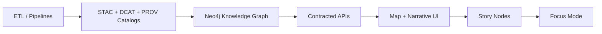

# 🧪 `tests/graph/` — Knowledge Graph QA + Test Reports 🕸️📈


> **TL;DR**  
> This folder is the **quality gate** for the Kansas Frontier Matrix (KFM) **Knowledge Graph** + graph-adjacent workflows.  
> If a change breaks provenance, schema integrity, time semantics, or query guarantees — it should fail here ✅

---

## 🧭 What “graph” means in KFM (in practice)

In KFM, “graph” is **not just an algorithmic data structure** — it’s the **semantic layer** that connects:

- 🗺️ **Places** (counties, rivers, towns, sites)
- 🧑‍🏫 **People** & 🏛️ **Organizations**
- 🗓️ **Events** (historical + contemporary)
- 🧾 **Documents** (articles, photos, legal docs)
- 📦 **Datasets** and their **lineage / provenance**

This test suite protects the *relationship fabric* that makes KFM more than “a pile of layers”.

---

## 🧬 Canonical flow (what we test around)



✅ `tests/graph/` focuses primarily on **C**, plus the boundaries **B→C** and **C→D**.

---

## 🎯 Goals

### ✅ Must-pass guarantees
- 🧾 **No “mystery nodes/edges”**: graph content must remain traceable to versioned evidence & contracts
- 🧱 **Schema stability**: label/relationship changes require migrations + tests
- ⏳ **Temporal correctness**: time-enabled entities/relations behave predictably
- 🔗 **Referential integrity**: no orphan edges, missing canonical nodes, or broken cross-links to catalog IDs
- 🚦 **Query contracts**: “known-good” queries return expected shapes and constraints (even as data grows)
- 📈 **Performance budgets**: important traversals stay within agreed limits

### 🚫 Non-goals (by default)
- Running full production-scale rebuilds in PRs
- Hosting long-lived external services (tests should spin up ephemeral dependencies)

---

## 🗂️ Suggested layout for this folder

> Your repo may differ — this is the **intended** structure for a clean `tests/graph/` suite.

```text
tests/
└── graph/ 🕸️
    ├── README.md 📄  (you are here)
    ├── conftest.py 🧰
    ├── fixtures/ 🧪
    │   ├── small/ 🐜        # tiny deterministic graphs (golden fixtures)
    │   ├── generated/ 🧬    # synthetic graphs for property/perf tests
    │   └── sample_data/ 📦  # minimal STAC/DCAT/PROV + CSV/Cypher snippets
    ├── test_schema.py 🧱
    ├── test_provenance.py 🧾
    ├── test_temporal.py ⏳
    ├── test_queries.py 🔎
    ├── test_integrations.py 🔌
    ├── test_performance.py 🚀
    └── reports/ 📈
        ├── benchmarks/ ⏱️
        ├── plots/ 🖼️
        └── snapshots/ 📸
```

---

## 🚀 Running the tests

### 🐍 Python-first (recommended)
```bash
# from repo root
pytest -q tests/graph
```

### 🎯 Run just the “fast gate” locally
```bash
pytest -q tests/graph -m "not integration and not perf"
```

### 🧱 Run schema + query contract tests
```bash
pytest -q tests/graph -k "schema or queries"
```

### 🐳 Integration tests (Neo4j/Postgres/etc.)
If your repo uses Docker for ephemeral test infra:

```bash
# Example only — align with your repo’s docker-compose/devcontainer
docker compose up -d neo4j postgres
pytest -q tests/graph -m integration
docker compose down -v
```

---

## 🧪 Test types (what belongs here)

| Type | Purpose | Typical runtime | Stored outputs |
|------|---------|------------------|----------------|
| 🧱 Schema tests | constraints, indices, migrations, stable labels/edges | fast | snapshots |
| 🧾 Provenance tests | every node/edge traces back to contracts/evidence | fast | JSON reports |
| ⏳ Temporal tests | valid-time / transaction-time / timeline semantics | fast–medium | snapshots |
| 🔎 Query contract tests | “Focus Mode-safe” traversals + expected shapes | medium | snapshots |
| 🔌 Integration tests | full graph load into ephemeral Neo4j + query assertions | medium | logs + dumps |
| 🚀 Performance tests | benchmark traversals, import speed, cardinality scaling | slower | benchmark JSON + plots |

---

## 🧾 Provenance-first invariants (examples)

These are the “never break” rules that tests should encode:

- Every node/edge has:
  - 🆔 stable identifier strategy
  - 🧾 provenance pointer(s) (catalog record / source reference / derivation chain)
  - 📜 license / usage metadata where applicable
- No orphan edges (relationship endpoints must exist)
- Canonical “glossary” nodes do not fragment into near-duplicates
- Graph state is reproducible from contracts + pipelines (no manual-only mutations)

---

## ⏳ Temporal graph expectations

KFM is time-aware (historical + current + predictive). Graph entities should support:

- 🗓️ valid-time (real-world time a thing is true)
- 🧾 transaction-time (when the system recorded it)

Even if your implementation starts simple, keep tests shaped so we can grow into
**bi-temporal** query behavior without breaking consumers later.

---

## 🔎 Query contracts (Focus Mode safety)

Graph queries should be testable as **contracts**, similar to APIs:

✅ Good tests here:
- “Find events involving Person X in Place Y during Time Range Z”
- “Return all datasets linked to Concept C and their citations”
- “Traverse from a story node to all referenced evidence items”

🚫 Avoid in this folder:
- UI-level E2E (belongs in `tests/e2e/` or similar)
- Long exploratory notebooks (belongs in `mcp/`)

---

## 📈 Reports + Graphing outputs (this folder should produce artifacts)

Suggested artifact contract:

- `reports/benchmarks/*.json` ⏱️ raw benchmark runs
- `reports/plots/*.png` 🖼️ plots (runtime vs size, query latency distributions)
- `reports/snapshots/*.json` 📸 golden query outputs / schema snapshots
- `reports/summary.md` 🧾 human-readable rollup (generated)

### 🧰 Typical “make me a plot” workflow
- Use **Python** for quick plots & CI-friendly rendering
- Use **R** for exploratory statistical graphics when needed
- Keep plots deterministic (fixed seeds, pinned sampling)

---

## 🧩 How to add a new graph feature (checklist)

When you add **a new node type**, **edge type**, or **query**, ship it with:

- [ ] 🧱 schema/migration update (Cypher/DDL/etc.)
- [ ] 🧪 unit tests for parsing/transform logic (domain layer)
- [ ] 🔌 integration test that loads a tiny graph and validates:
  - [ ] constraint exists
  - [ ] query returns expected shape
  - [ ] provenance fields are present
- [ ] 📸 snapshot / golden fixture update (if output shape changes)
- [ ] 📈 benchmark update if traversal costs change materially

---

## 🔐 Security + data sovereignty considerations (graph-specific)

Graph is a **high-value** aggregation layer. Tests here can also enforce:

- 🔑 access control expectations (who can query what)
- 🧾 redaction policies (sensitive attributes don’t leak into public graph exports)
- 📦 “data space” style requirements: encryption-in-transit, mutual auth, auditability

---

## 📚 Project Library (the files that shape these tests)

This test suite is built to reflect the **project’s full knowledge base** — architecture, GIS, data engineering, statistics, security, UI, and governance.

<details>
<summary>📖 Click to expand the full library list (all project files)</summary>

### 🧠 Core KFM docs / governance / workflow
- `Kansas Frontier Matrix (KFM) – Comprehensive Technical Documentation.pdf`
- `MARKDOWN_GUIDE_v13.md.gdoc` *(project structure + canonical pipeline ordering)*
- `Scientific Method _ Research _ Master Coder Protocol Documentation.pdf`
- `Kansas-Frontier-Matrix_ Open-Source Geospatial Historical Mapping Hub Design.pdf`

### 🕸️ Graph theory & graph computing
- `Spectral Geometry of Graphs.pdf`
- `Scalable Data Management for Future Hardware.pdf`

### 🗄️ Databases & scale
- `Database Performance at Scale.pdf`
- `PostgreSQL Notes for Professionals - PostgreSQLNotesForProfessionals.pdf`

### 📊 Statistics, experiments, modeling
- `Understanding Statistics & Experimental Design.pdf`
- `think-bayes-bayesian-statistics-in-python.pdf`
- `regression-analysis-with-python.pdf`
- `Regression analysis using Python - slides-linear-regression.pdf`
- `Scientific Modeling and Simulation_ A Comprehensive NASA-Grade Guide.pdf`

### 🛰️ GIS, mapping, remote sensing, spatial pipelines
- `python-geospatial-analysis-cookbook.pdf`
- `making-maps-a-visual-guide-to-map-design-for-gis.pdf`
- `Mobile Mapping_ Space, Cartography and the Digital - 9789048535217.pdf`
- `Archaeological 3D GIS_26_01_12_17_53_09.pdf`
- `Cloud-Based Remote Sensing with Google Earth Engine-Fundamentals and Applications.pdf`

### 🧩 UI + visualization + rendering
- `responsive-web-design-with-html5-and-css3.pdf`
- `webgl-programming-guide-interactive-3d-graphics-programming-with-webgl.pdf`
- `compressed-image-file-formats-jpeg-png-gif-xbm-bmp.pdf`

### 🔐 Security, ethics, law, humanism
- `ethical-hacking-and-countermeasures-secure-network-infrastructures.pdf`
- `Gray Hat Python - Python Programming for Hackers and Reverse Engineers (2009).pdf`
- `Data Spaces.pdf`
- `On the path to AI Law’s prophecies and the conceptual foundations of the machine learning age.pdf`
- `Introduction to Digital Humanism.pdf`

### 🧠 Systems / concurrency / optimization / broader theory
- `concurrent-real-time-and-distributed-programming-in-java-threads-rtsj-and-rmi.pdf`
- `Generalized Topology Optimization for Structural Design.pdf`
- `Principles of Biological Autonomy - book_9780262381833.pdf`
- `graphical-data-analysis-with-r.pdf`

### 📚 Programming compendiums (multi-book reference packs)
- `A programming Books.pdf`
- `B-C programming Books.pdf`
- `D-E programming Books.pdf`
- `F-H programming Books.pdf`
- `I-L programming Books.pdf`
- `M-N programming Books.pdf`
- `O-R programming Books.pdf`
- `S-T programming Books.pdf`
- `U-X programming Books.pdf`
- `Deep Learning for Coders with fastai and PyTorch - Deep.Learning.for.Coders.with.fastai.and.PyTorchpdf`

</details>

---

## 🧯 Troubleshooting (common pain points)

- **Tests fail only in CI**: check pinned dependency versions + ensure docker services are available (Neo4j/Postgres)
- **Flaky graph results**: enforce deterministic ordering + stable IDs + seed all RNG sources
- **Slow traversals**: add indices/constraints, reduce cardinality early, and re-check query patterns
- **Snapshot churn**: when output format must change, update snapshots *and* add a migration note

---

## ✅ Maintainer note

If you’re unsure where a test belongs:

- Graph build logic → `src/graph/`
- Graph QA + contracts → `tests/graph/` ✅
- Story narrative correctness → `docs/reports/story_nodes/` + related tests
- Long experiments / notebooks → `mcp/`

Keep the graph trustworthy. Keep the story provable. 🧾🗺️✨
