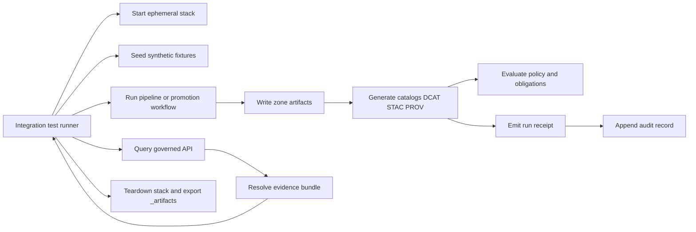

<!-- [KFM_META_BLOCK_V2]
doc_id: kfm://doc/8b6a8fa9-2a30-4b0d-9b7f-10b68c3e6d3d
title: Integration Tests
type: standard
version: v1
status: draft
owners: kfm-eng,kfm-governance
created: 2026-02-22
updated: 2026-02-22
policy_label: public
related:
  - tests/
  - docs/
  - docs/architecture/
  - docs/governance/
tags: [kfm, tests, integration, promotion, policy, provenance, trust-membrane]
notes:
  - This README defines the integration-test harness and the contracts it must enforce.
  - Command snippets are templates; align them to the repo’s actual scripts and CI workflows.
[/KFM_META_BLOCK_V2] -->

# Integration tests
End-to-end checks that enforce **KFM’s trust membrane** and **Promotion Contract** across **data → catalogs → governed API → UI surfaces**.


**Owners:** `kfm-eng`, `kfm-governance`  
**Last updated:** 2026-02-22

**Jump to:** [Quick start](#quick-start) • [What we test](#what-we-test) • [Directory layout](#directory-layout) • [Core contracts](#core-contracts) • [Promotion gates](#promotion-gates) • [Writing tests](#writing-tests) • [CI expectations](#ci-expectations) • [Troubleshooting](#troubleshooting) • [References](#references)

> [!IMPORTANT]
> Integration tests are **governance gates**. They must **fail closed** when required artifacts, provenance, catalogs, or policy decisions are missing.

---

## Quick start

### Prerequisites
- A container runtime (Docker or Podman) if the integration stack uses containers.
- The repo’s runtime and package manager (Node/Python/etc.) as defined by the root build tooling.
- Enough disk space for ephemeral test artifacts (fixtures + generated catalogs + receipts).

### Run locally
This repo may expose one “blessed” entrypoint. If not, adopt one and keep it stable.

```bash
# 1) Start the ephemeral integration stack (if this repo provides one)
docker compose -f tests/integration/compose.yml up -d --build

# 2) Run the integration suite (choose the repo’s runner)
make test-integration
# or:
npm run test:integration
# or:
pytest -m integration

# 3) Tear down
docker compose -f tests/integration/compose.yml down -v
```

> [!NOTE]
> If `tests/integration/compose.yml` (or equivalent) does not exist yet, create one as part of the first integration slice and keep the stack **fully local** (no external network dependency) unless explicitly approved.

### What success looks like
A passing integration run proves that:
- A fixture “dataset version” can be ingested through zones and promoted only when **gates pass**.
- **DCAT + STAC + PROV** are present, validate under KFM profiles, and **cross-link** deterministically.
- Policy evaluation is enforced (including **default-deny** behavior and redaction/generalization obligations).
- A **run receipt** and append-only audit record are emitted for the run.

[Back to top](#integration-tests)

---

## What we test

Integration tests exist to validate behavior *across boundaries*, not to maximize coverage. The goal is to ensure the system cannot “accidentally publish” anything that violates governance invariants.

### In scope
- **Truth path flow**: Upstream → RAW → WORK/QUARANTINE → PROCESSED → CATALOG/TRIPLET → PUBLISHED surfaces
- **Trust membrane**: Clients do not touch storage/DB directly; access is only via governed APIs with policy + logging.
- **Promotion Contract**: Promotion fails unless gates pass (identity, licensing, sensitivity, catalogs, receipts, policy tests).
- **Catalog triplet contract**: DCAT answers dataset-level questions; STAC answers asset-level questions; PROV answers lineage questions.
- **Evidence resolution**: Evidence refs resolve into evidence bundles and respect policy.
- **Auditability**: Each run produces receipts that enumerate inputs/outputs with digests and record environment.

### Out of scope
- Performance tuning / benchmarks (keep separate, unless a “smoke threshold” is explicitly a gate).
- Non-deterministic tests (flaky timing, remote API calls, “latest” web scraping) unless sandboxed and explicitly permitted.
- Large-scale datasets (integration uses *small, synthetic* fixtures).

> [!WARNING]
> No production data. No sensitive locations. No credentials. If a fixture requires real-world geometry, generalize it and keep it synthetic.

[Back to top](#integration-tests)

---

## Directory layout

This layout is the **target convention** for this folder. If the repo differs, update this README to match.

```text
tests/
└─ integration/
   ├─ README.md
   ├─ fixtures/                      # Synthetic fixture inputs + expected outputs
   │  └─ example_dataset/
   │     ├─ raw/                     # Immutable fixture “acquisition” inputs
   │     ├─ expected/                # Golden expected outputs (catalogs, checksums, receipts)
   │     └─ policy/                  # Policy fixtures: allow/deny scenarios
   ├─ contracts/                     # Contract-focused suites (promotion, catalogs, evidence)
   ├─ cases/                         # Scenario tests (golden paths across multiple modules)
   ├─ helpers/                       # Shared helpers (stack control, diff, link checks)
   ├─ stack/                         # Container / local stack configs (compose/kind/etc.)
   └─ _artifacts/                    # Test outputs (gitignored); CI uploads as job artifacts
```

> [!TIP]
> Treat `tests/integration/_artifacts/` as an **ephemeral** workspace: receipts, generated catalogs, QA reports, and logs live here during runs.

[Back to top](#integration-tests)

---

## Core contracts

Legend:
- ✅ **Confirmed**: Required by KFM governance/architecture invariants.
- 🧪 **Proposed**: Recommended repo convention; implement if not present.
- ❓ **Unknown**: Must be verified against the repo and CI workflows.

### Contract registry
| Contract ID | Status | Purpose | What must be true in an integration run |
|---|---:|---|---|
| `TRUST_MEMBRANE` | ✅ | Enforce the policy/provenance boundary | Clients/fixtures interact via governed APIs; no direct DB/object-store reads for “runtime” behavior |
| `TRUTH_PATH_ZONES` | ✅ | Enforce zone semantics | RAW append-only; QUARANTINE blocks promotion; PROCESSED includes checksums + runtime metadata |
| `CATALOG_TRIPLET` | ✅ | Treat catalogs as contract surfaces | DCAT/STAC/PROV validate under profile and cross-link; link-checker passes |
| `PROMOTION_CONTRACT_V1` | ✅ | Fail-closed promotion gate set | Promotion blocked unless gates A–G pass (see next section) |
| `RUN_RECEIPTS` | ✅ | Ensure auditability | Each producing run emits a run receipt enumerating inputs/outputs + env + validation + policy decision |
| `POLICY_DEFAULT_DENY` | ✅ | Prevent accidental publication | Unknown/unclear licensing or restricted sensitivity must deny promotion and serving |
| `EVIDENCE_RESOLUTION` | ✅ | Support evidence-first UX + cite-or-abstain | Representative EvidenceRefs resolve to EvidenceBundles and respect policy obligations |
| `CANONICAL_REBUILDABLE` | 🧪 | Ensure projections are rebuildable | Rebuildable indexes can be re-derived from promoted artifacts + catalogs deterministically |

[Back to top](#integration-tests)

---

## Promotion gates

Integration tests must explicitly cover both **allow** and **deny** paths for the minimum credible gate set.

### Gate coverage matrix
| Gate | What it means | Minimum integration assertions |
|---|---|---|
| A — Identity and versioning | Dataset and DatasetVersion IDs are deterministic and stable | Recompute `spec_hash` (or equivalent) and ensure it matches; rerun pipeline and ensure IDs don’t drift |
| B — Licensing and rights metadata | License is explicit and compatible | Missing/unknown license ⇒ QUARANTINE/deny; explicit license ⇒ allow path proceeds |
| C — Sensitivity classification and redaction plan | policy label assigned; obligations recorded | Restricted/sensitive fixtures deny by default unless explicit obligations are applied and recorded |
| D — Catalog triplet validation | DCAT/STAC/PROV exist and validate under profile | Schema validation passes; required fields present; catalogs produced for promoted versions |
| E — Run receipt and checksums | Receipts enumerate inputs/outputs + digests + environment | Digests exist for all artifacts; environment captured; receipt stored as an immutable artifact |
| F — Policy tests and contract tests | Policy fixtures pass and evidence resolves | Policy pack tests include allow+deny; evidence resolution works in CI without secrets |
| G — Optional production posture | SBOM/provenance, perf/a11y smokes | If enabled in CI: SBOM present; verification passes; UI a11y smoke doesn’t regress |

> [!IMPORTANT]
> The “deny” cases are not optional. Every gate must have at least one fixture designed to fail it, and the suite must verify the failure mode is safe and audited.

[Back to top](#integration-tests)

---

## How the integration suite runs



Principles:
- The stack must be **deterministic** (fixed clock/seeds where possible).
- Tests must be **offline-capable** (no remote dependencies) unless explicitly approved.
- Outputs (catalogs/receipts) must be **content-addressable** or at minimum include digests.

[Back to top](#integration-tests)

---

## Writing tests

### Test design rules
- Prefer **contract tests** over incidental behavior:
  - “Catalog link-checker fails when a referenced receipt is missing.”
  - “Policy denies when license is unclear.”
  - “Evidence resolver refuses restricted geometry unless generalized.”
- Keep fixtures small and explicit:
  - Include “expected” outputs for catalogs and receipts when possible.
  - Use fixed timestamps and stable IDs (or an explicit deterministic ID function).
- Make the failure mode part of the test:
  - Assert deny outputs include reason codes and required obligations.

### Add a new integration scenario
1. Create a fixture folder under `fixtures/<dataset_slug>/`.
2. Add at least one **allow** and one **deny** case.
3. Add a contract test in `contracts/` that asserts the gate behavior.
4. Ensure outputs land in `_artifacts/` and are uploaded in CI.
5. Update the registry tables in this README.

### Definition of Done for a new integration test
- [ ] Has a deterministic fixture set (no network required).
- [ ] Exercises at least one Promotion Contract gate.
- [ ] Produces and validates catalogs (or explicitly asserts why catalogs are not applicable).
- [ ] Produces a run receipt and verifies it enumerates inputs/outputs with digests.
- [ ] Contains a deny case that fails closed and produces an auditable error.
- [ ] Documents any required stack services and ports.

[Back to top](#integration-tests)

---

## CI expectations

### Required CI properties
- Integration tests run in CI as a **gate** for promotion-related changes.
- The job uploads `_artifacts/` (receipts, catalogs, validation reports) for audit/debug.
- CI must not require long-lived secrets for “standard” integration runs.

### Recommended CI behavior
- Run integration tests:
  - on PRs touching pipelines/catalog/policy/evidence/api code, and/or
  - on a nightly schedule for drift detection (if watchers/pipelines are time-based).
- Treat missing catalogs/receipts as failures, not warnings.
- Keep a clean rollback story for failed promotion attempts.

> [!NOTE]
> If CI currently lacks these behaviors, implement them as a thin slice: one promotable fixture dataset + one fail-closed policy gate.

[Back to top](#integration-tests)

---

## Troubleshooting

### Common failures
- **Port conflicts**: stop local services or remap stack ports.
- **Flaky timing**: freeze time; avoid sleeping; poll with bounded retries.
- **Catalog cross-link failures**: verify all `href`s exist and all “describedby” links resolve.
- **Policy failures**: confirm the fixture’s policy label + license; ensure deny cases are intentional.
- **Digest mismatch**: ensure canonicalization and hashing rules are stable and consistently applied.

### Debug checklist
- [ ] Re-run with verbose logs enabled for policy evaluation and catalog validation.
- [ ] Inspect `_artifacts/` for generated catalogs, receipts, and validation reports.
- [ ] Confirm the test did not fetch remote data.
- [ ] Confirm the deny path produced an auditable reason and did not partially publish.

[Back to top](#integration-tests)

---

## References

In-repo (paths may vary; keep these aligned with actual repo structure):
- `docs/` — governed design, governance, and operational documentation
- `schemas/` — schema definitions for catalogs, receipts, and domain artifacts
- `policy/` — policy-as-code packs and fixtures
- `tools/validation/` — schema + link-checking validators
- `src/` — pipeline runners, catalog generators, evidence resolver, API boundary code

External interoperability context (do not treat as “repo truth” unless adopted as profiles):
- DCAT (W3C)
- STAC (OGC community spec)
- PROV (W3C)
- JSON Canonicalization Scheme (RFC 8785) for deterministic hashes

[Back to top](#integration-tests)
