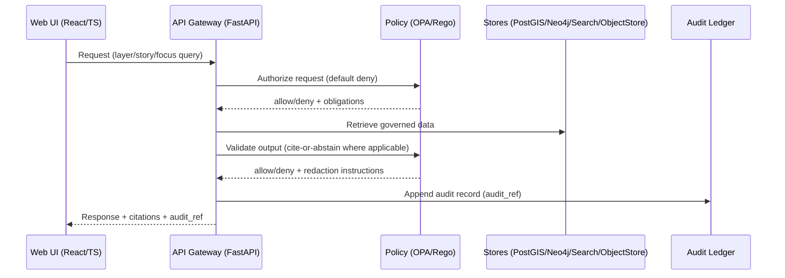

<!--
File: tests/integration/README.md
Scope: KFM governed integration test harness + operator runbook
-->

# KFM Integration Tests (Governed)

> [!IMPORTANT]
> **Integration tests are part of KFM’s governance boundary.**
>
> They exist to prove end-to-end enforcement of KFM invariants (trust membrane, policy checks, provenance, promotion gates).
> If you change behavior across services, you are expected to update/add integration tests in the same PR.

---

## Table of contents

- [What these tests protect](#what-these-tests-protect)
- [What “integration test” means in KFM](#what-integration-test-means-in-kfm)
- [Folder layout](#folder-layout)
- [System under test (SUT)](#system-under-test-sut)
  - [Compose baseline services](#compose-baseline-services)
  - [Key runtime flow (conceptual)](#key-runtime-flow-conceptual)
- [Quickstart](#quickstart)
  - [Prerequisites](#prerequisites)
  - [Bring up the stack](#bring-up-the-stack)
  - [Run the integration tests](#run-the-integration-tests)
  - [Tear down](#tear-down)
- [Test suite conventions](#test-suite-conventions)
  - [Markers and categories](#markers-and-categories)
  - [Determinism & hermeticity rules](#determinism--hermeticity-rules)
  - [Fixture data and catalogs](#fixture-data-and-catalogs)
- [Coverage map: invariants → tests](#coverage-map-invariants--tests)
- [CI expectations](#ci-expectations)
- [Troubleshooting](#troubleshooting)
- [Security & governance notes](#security--governance-notes)
- [Definition of Done](#definition-of-done)

---

## What these tests protect

KFM’s platform architecture and governance model define **non-negotiable invariants** that must be enforced continuously in CI and validated through integration testing:

1. **Trust membrane**
   - The frontend never talks to databases directly.
   - Policy evaluation occurs on every data/story/AI request.
   - Backend logic uses repository interfaces (ports) and cannot bypass them.
   - Audit and provenance are produced as part of the normal request path.

2. **Truth-path and publishable data**
   - Only **Processed** data is publishable.
   - Raw/Work zones exist for ingestion and QA, but must not be served as publishable truth.

3. **Promotion gates (raw/work → processed/public)**
   - Promotion is blocked unless:
     1) license present,
     2) sensitivity classification present,
     3) schema & geospatial checks pass,
     4) checksums computed,
     5) STAC/DCAT/PROV artifacts exist and validate,
     6) audit event recorded,
     7) human approval if sensitive.

4. **Evidence UX / resolvability**
   - Every provenance/citation reference used in UI or Focus Mode must be resolvable through an API endpoint and reviewable.

> [!NOTE]
> Integration tests are where we verify *the system behaves like the model*, not just that individual functions work.

---

## What “integration test” means in KFM

An integration test in KFM is a test that crosses at least one of these boundaries:

- API ↔ Policy (OPA/Rego) authorization/validation
- API ↔ Storage (PostGIS, Neo4j, Search, Object Store)
- Pipeline/catalog outputs ↔ Runtime consumption (STAC/DCAT/PROV)
- Policy ↔ Redaction / access control behavior
- Evidence references ↔ Evidence resolution endpoints and formats

This folder is **not** for:
- Pure unit tests (domain invariants, pure functions)
- Contract tests for DTO/schema only (unless they need live policy/store)
- UI end-to-end browser automation (that belongs in web/ e2e suites)

---

## Folder layout

This README defines the **canonical layout** for integration tests.

```text
tests/
└─ integration/                                     # Service-backed tests (API/DB/OPA/etc.) — validates end-to-end behavior
   ├─ README.md                                     # How to run locally/CI, required services, env vars, failure triage
   ├─ requirements.txt                              # Optional: extra deps for host-side runner (kept minimal)
   ├─ pytest.ini                                    # Integration markers, default opts, timeouts/retry conventions
   ├─ conftest.py                                   # Shared fixtures: base URLs, clients, auth stubs, wait-for helpers
   │
   ├─ fixtures/                                     # Deterministic inputs used by integration tests (synthetic + small)
   │  ├─ datasets/
   │  │  └─ example_dataset/                        # Test-only dataset slice (stable across runs)
   │  │     ├─ raw/                                 # Tiny deterministic raw slice (never publish; used to exercise pipeline)
   │  │     ├─ work/                                # Intermediate artifacts (validation reports, transforms, logs)
   │  │     ├─ processed/                           # Publishable artifacts used by tests (what “would ship”)
   │  │     └─ catalog/                             # Catalog triplet required for promotion/serving
   │  │        ├─ dcat/                             # DCAT JSON/JSON-LD dataset + distribution records
   │  │        ├─ stac/                             # STAC Collections/Items describing processed assets
   │  │        └─ prov/                             # PROV lineage records + run references tying outputs to inputs
   │  │
   │  └─ policy/
   │     ├─ input/                                  # OPA input payload fixtures (actor/resource/context)
   │     └─ expected/                               # Expected allow/deny decisions + redaction outputs (snapshots)
   │
   ├─ scripts/                                      # CI helpers (service readiness + diagnostics)
   │  ├─ wait_for_http.sh                           # Wait for HTTP endpoint health (poll /healthz or similar)
   │  ├─ wait_for_tcp.sh                            # Wait for port readiness (DB/OPA/etc. accepting connections)
   │  └─ dump_logs.sh                               # On failure: dump docker/service logs for CI artifacts
   │
   └─ testcases/                                    # Integration test suite (asserts cross-component invariants)
      ├─ test_trust_membrane.py                     # UI/API boundary invariant: no forbidden direct-access paths
      ├─ test_policy_default_deny.py                # Fail-closed policy: unknown/invalid context must deny
      ├─ test_promotion_gate.py                     # Promotion prerequisites: STAC+DCAT+PROV + manifests/digests required
      ├─ test_policy_redaction.py                   # Redaction behavior: allowed transforms vs deny when impossible
      ├─ test_evidence_resolver.py                  # Evidence resolver: citation → artifact fetch, policy filtering applied
      └─ test_focus_mode_cite_or_abstain.py         # Focus Mode contract: citations required or explicit abstain w/ reasons
```

> [!TIP]
> If your repo already has a different structure, you can keep it — but this README should be updated to match reality.
> “Docs must match behavior” is itself a governance requirement.

---

## System under test (SUT)

### Compose baseline services

The expected local/dev baseline uses Docker Compose and includes (at minimum):

| Service | Default host port(s) | Why it exists in integration tests |
|---|---:|---|
| `api` (FastAPI REST + optional GraphQL) | `8000` | The trust membrane gatekeeper and governed API surface |
| `web` (React/TS) | `3000` | Optional: smoke checks for “no direct DB” and evidence UX wiring |
| `postgis` | `5432` | Spatial truth store + tiles + audit ledger persistence |
| `neo4j` | `7474`, `7687` | Knowledge graph / lineage / relationships |
| `opensearch` | `9200` | Search index for discovery + retrieval |
| `opa` | `8181` | Policy decision point (authorize + output validation) |

> [!NOTE]
> Integration tests should be able to run against:
> 1) a running developer Compose stack, or
> 2) a CI-launched Compose stack (service containers).

### Key runtime flow (conceptual)



---

## Quickstart

### Prerequisites

You need:

- Docker Engine and the Docker Compose plugin (`docker compose`)
- A working Git checkout of the repo
- **Recommended:** run tests inside the `api` container so dependency versions match

If you run tests from host (not required), you also need:

- Python + `pytest` (plus whatever client libs are used, e.g., `httpx`)

### Bring up the stack

From repo root:

```bash
cp .env.example .env
docker compose up --build -d
```

Expected endpoints:

- API docs: `http://localhost:8000/docs`
- UI: `http://localhost:3000`

> [!IMPORTANT]
> If you change env vars in `.env`, restart the affected services:
> `docker compose down && docker compose up -d --build`

### Run the integration tests

#### Option A (recommended): run inside the API container

```bash
docker compose exec api pytest -m integration -q
```

If you want verbose output + stop on first failure:

```bash
docker compose exec api pytest -m integration -vv -x
```

#### Option B: run from host, calling the running API

```bash
export KFM_BASE_URL="http://localhost:8000"
pytest -m integration -q
```

> [!NOTE]
> Host-side runs must be treated as “best-effort convenience.”
> CI should use containerized runs for reproducibility.

### Tear down

```bash
docker compose down -v
```

---

## Test suite conventions

### Markers and categories

Integration tests must be explicitly marked.

**Required marker:**
- `integration` — all tests under this folder should be tagged

**Optional markers (use sparingly):**
- `slow` — long-running; should be excluded from default PR gating unless explicitly enabled
- `requires_search` — requires OpenSearch to be healthy and seeded
- `requires_graph` — requires Neo4j to be healthy and seeded
- `requires_ai` — requires a configured LLM backend (should be skipped by default)

Example:

```python
import pytest

@pytest.mark.integration
def test_promotion_requires_license():
    ...
```

### Determinism & hermeticity rules

Integration tests must be:

- **Deterministic** (same inputs → same outputs)
- **Idempotent** (rerunning does not corrupt state)
- **Fail-closed aware** (policy failures are expected and asserted)
- **Audit-friendly** (tests should assert an `audit_ref` is returned when required)

Rules:

1. Never depend on external networks or third-party APIs.
2. Use **fixed small slices** of fixture data.
3. Avoid time-based assertions unless time is controlled (freeze time or use tolerances).
4. If a test creates records, it must clean up, or namespace by a unique run/test ID.

### Fixture data and catalogs

Fixture datasets are used to prove promotion gates and evidence resolvability.

A minimal dataset fixture must include:

- Deterministic raw slice (small)
- Processed artifact(s) (small)
- Catalog artifacts:
  - DCAT (always)
  - STAC (for spatial assets)
  - PROV (for lineage and “review evidence”)

Recommended example structure:

```text
tests/integration/fixtures/datasets/example_dataset/
  raw/...
  work/validation_report.json
  processed/example.parquet
  catalog/
    dcat/dataset.json
    stac/collection.json
    prov/run_record.json
```

---

## Coverage map: invariants → tests

This section is the “boss-level” checklist. If you add a new invariant, you add integration coverage here.

| Invariant / requirement | Minimum integration test(s) | Expected outcome |
|---|---|---|
| Frontend does not access DB directly | `test_trust_membrane.py` | No direct DB connections from web; all calls go through API |
| Policy evaluated on every request | `test_policy_default_deny.py` | Requests without auth/context are denied (default deny) |
| Backend uses repository ports (no bypass) | `test_trust_membrane.py` | Structural + behavioral checks (e.g., no direct DB creds in API handlers; enforcement via adapter boundary) |
| Audit + provenance on normal request path | `test_evidence_resolver.py` | Responses include audit reference and resolvable citations where applicable |
| Processed-only publishable truth | `test_promotion_gate.py` | API refuses serving raw/work artifacts as publishable outputs |
| Promotion gate checklist enforced | `test_promotion_gate.py` | Missing license/sensitivity/checksums/catalogs blocks promotion |
| Policy redaction for restricted/sensitive fields | `test_policy_redaction.py` | Restricted fields/geometry are redacted or generalized |
| Evidence resolvability | `test_evidence_resolver.py` | Every citation/prov ref resolves via API to evidence payload |
| Focus Mode cite-or-abstain enforced | `test_focus_mode_cite_or_abstain.py` | Output without citations is denied/abstains, and audit_ref is present |

> [!IMPORTANT]
> When a failure occurs, treat it as one of:
> 1) A real regression, or
> 2) An invariant change (requires governance review).
>
> “Just update the test” is not an acceptable default.

---

## CI expectations

Integration tests are expected to be **merge-blocking** for changes that touch:

- Policy rules
- API authorization paths
- Promotion gates and validators
- Evidence/citation resolution endpoints
- Data model/schema changes that affect catalogs or provenance

Recommended CI behavior:

- PRs: run `pytest -m integration` against a clean, containerized stack
- Nightly: run `-m "integration and slow"` plus larger fixture slices if maintained

On failure, CI should:

1. Dump `docker compose logs` for `api`, `opa`, and stores
2. Preserve relevant test artifacts (validation reports, snapshots, etc.)

---

## Troubleshooting

### Ports already in use

Common defaults and what to change:

- Postgres/PostGIS: `5432`
- API: `8000`
- Web: `3000`
- Neo4j: `7474`, `7687`
- OpenSearch: `9200`
- OPA: `8181`

If you have a local Postgres, stop it or change Compose port mappings.

### Dependencies not ready (race conditions)

If `api` can’t connect to `postgis` on startup:

- Check logs: `docker compose logs api`
- Restart: `docker compose up -d`

### “My changes don’t show up” (dev volumes)

If the API/web hot-reload isn’t picking up changes:

- Confirm volumes are mounted in `docker-compose.yml`
- Rebuild: `docker compose up --build -d`

### Debugging OPA decisions

If a request is denied unexpectedly:

1. Capture the input (integration tests should log it).
2. Query OPA directly (example):

```bash
curl -s http://localhost:8181/v1/data/<package>/<rule> -d @tests/integration/fixtures/policy/input/request.json
```

---

## Security & governance notes

- Do **not** commit secrets in test fixtures.
- Never use production datasets for integration tests unless explicitly approved for this purpose.
- If a test case needs “sensitive-location” semantics, use synthetic geometry and verify **redaction/generalization behavior**, not real coordinates.
- Prefer fail-closed outcomes: if a dependency is missing, tests should fail clearly (or skip only when marked optional).

---

## Definition of Done

A PR that changes cross-service behavior is not “done” until:

- [ ] All integration tests pass locally (containerized run recommended)
- [ ] Any new invariant has an integration test and is added to the coverage map
- [ ] Promotion gate behavior remains enforced (or governance review is attached)
- [ ] Evidence references used by UI/Focus outputs remain resolvable
- [ ] CI logs are useful: failures show enough context to diagnose policy/store issues
- [ ] README stays accurate (no “it should” without also documenting how)

---

