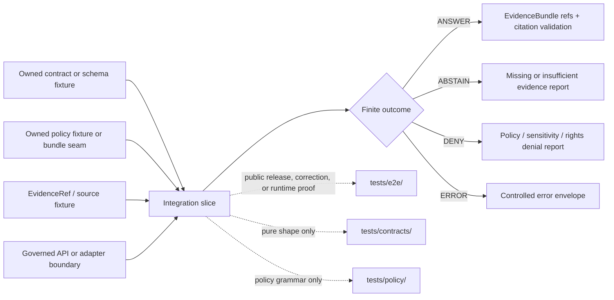

<!-- [KFM_META_BLOCK_V2]
doc_id: kfm://doc/NEEDS_VERIFICATION__tests_integration_readme
title: integration
type: standard
version: v1
status: draft
owners: @bartytime4life
created: NEEDS_VERIFICATION__YYYY-MM-DD
updated: 2026-04-27
policy_label: public
related: [../README.md, ../contracts/README.md, ../policy/README.md, ../e2e/README.md, ../reproducibility/README.md, ../accessibility/README.md, ../../contracts/README.md, ../../schemas/README.md, ../../schemas/contracts/README.md, ../../policy/README.md, ../../docs/README.md, ../../.github/CODEOWNERS]
tags: [kfm, tests, integration, verification, governed-slice, evidence, fail-closed]
notes: [doc_id and created date need verification; current workspace did not expose a mounted repository; current public-main snapshot is sourced from surfaced repo-facing docs and should be rechecked in the active checkout before merge]
[/KFM_META_BLOCK_V2] -->

# integration

Governed slices across real KFM boundaries: broader than unit, contract, or policy checks; narrower than full end-to-end release proof.

> [!NOTE]
> **Status:** experimental  
> **Owners:** `@bartytime4life`  
> **Path:** `tests/integration/README.md`  
> **Repo fit:** downstream of [`../README.md`](../README.md), [`../../contracts/README.md`](../../contracts/README.md), [`../../schemas/contracts/README.md`](../../schemas/contracts/README.md), [`../../policy/README.md`](../../policy/README.md), and [`../../docs/README.md`](../../docs/README.md); upstream of future executable slices under `tests/integration/**` and any escalation into [`../e2e/`](../e2e/).  
> **Quick jumps:** [Scope](#scope) · [Repo fit](#repo-fit) · [Accepted inputs](#accepted-inputs) · [Exclusions](#exclusions) · [Current documented snapshot](#current-documented-snapshot) · [Directory tree](#directory-tree) · [Quickstart](#quickstart) · [Usage](#usage) · [Authority routing](#authority-routing) · [Diagram](#diagram) · [Operating tables](#operating-tables) · [Task list / definition of done](#task-list--definition-of-done) · [FAQ](#faq) · [Appendix](#appendix)


> [!IMPORTANT]
> `tests/integration/` is a first-class verification family, not a miscellaneous bucket. Put a test here only when the smallest honest proof crosses a real KFM boundary.

> [!CAUTION]
> The surfaced public-main docs show `tests/integration/` as README-only. They do **not** prove an executable suite, fixture inventory, local runner, required workflow, or branch-protection status for this family.

---

## Scope

Integration tests belong here when a slice must prove behavior across at least one meaningful seam:

| Slice burden | Example seam | Why it belongs here |
|---|---|---|
| Contract interpretation + policy decision | contract-shaped payload is mediated by policy | Too broad for `tests/contracts/`; too narrow for release proof |
| Source admission + validation state | source descriptor fixture enters candidate, quarantine, or denial path | Crosses source, validator, and state-transition logic |
| Evidence resolution + finite runtime outcome | `EvidenceRef` resolves to `EvidenceBundle`, then produces `ANSWER`, `ABSTAIN`, `DENY`, or `ERROR` | Tests the trust membrane, not just schema shape |
| Freshness or projection state + outward behavior | released derivative is stale, missing, corrected, or generalized | Proves downstream surfaces stay honest about state |
| Adapter or resolver behavior + trust-visible result | mock provider, evidence resolver, or policy client emits bounded outcome | Exercises a boundary without turning it into full e2e |

Status markers used in this README:

| Marker | Meaning here |
|---|---|
| **CONFIRMED** | Directly surfaced in current repo-facing docs or current-session workspace evidence |
| **INFERRED** | Strongly supported by adjacent docs, but not re-proven as executable behavior |
| **PROPOSED** | Recommended shape that fits KFM doctrine, not asserted as current repo fact |
| **UNKNOWN** | Not verified strongly enough to present as current branch reality |
| **NEEDS VERIFICATION** | Requires active-checkout, platform, runner, workflow, or owner recheck before merge |

[Back to top](#integration)

---

## Repo fit

**Path:** `tests/integration/`

### Upstream authorities

| Surface | Integration dependency |
|---|---|
| [`../README.md`](../README.md) | Test-family placement, sibling boundaries, and repo-wide verification vocabulary |
| [`../../contracts/README.md`](../../contracts/README.md) | Human-readable contract law and trust-object responsibilities |
| [`../../schemas/contracts/README.md`](../../schemas/contracts/README.md) | Machine-contract families when a slice depends on schema-side shape |
| [`../../policy/README.md`](../../policy/README.md) | Policy bundles, fixtures, reason codes, and fail-closed behavior |
| [`../../schemas/README.md`](../../schemas/README.md) | Schema-side context and unresolved schema-home authority |
| [`../../docs/README.md`](../../docs/README.md) | Long-form architecture, runbooks, and rationale |
| [`../../.github/CODEOWNERS`](../../.github/CODEOWNERS) | Review routing and ownership boundary |
| [`../../.github/workflows/README.md`](../../.github/workflows/README.md) | Workflow posture; executable CI wiring still **NEEDS VERIFICATION** |
| [`../../CONTRIBUTING.md`](../../CONTRIBUTING.md) | Contributor workflow and review expectations |

### Lateral test-family boundaries

| Sibling | Use it when the burden is... |
|---|---|
| [`../unit/`](../unit/) | Pure local deterministic behavior |
| [`../contracts/README.md`](../contracts/README.md) | Schema or envelope shape without cross-boundary behavior |
| [`../policy/README.md`](../policy/README.md) | Policy grammar, deny rules, reason codes, or obligation logic by itself |
| [`../accessibility/README.md`](../accessibility/README.md) | Keyboard, motion, contrast, readable trust state, or operability checks by themselves |
| [`../reproducibility/README.md`](../reproducibility/README.md) | Digest, count, rerun, or profile stability without broader slice behavior |
| [`../e2e/README.md`](../e2e/README.md) | Full runtime, release, correction, or public publish-path proof |

### Downstream dependents

Future executable integration slices should be small enough to review, but strong enough to stop false confidence before e2e. A healthy slice usually feeds one of these downstream outcomes:

- a later release-assembly proof in [`../e2e/release_assembly/`](../e2e/release_assembly/)
- a runtime-outcome proof in [`../e2e/runtime_proof/`](../e2e/runtime_proof/)
- a correction or supersession drill in [`../e2e/correction/`](../e2e/correction/)
- a domain-lane thin slice that needs one governed seam proven before live-source activation

[Back to top](#integration)

---

## Accepted inputs

Content belongs here when it proves a governed slice across real boundaries without becoming full release proof.

| Accepted input | What belongs here | Status posture |
|---|---|---|
| Narrow scenario definitions | One named seam, one expected finite outcome, one negative path | **PROPOSED** until executable files exist |
| Reused authoritative fixtures | Contract, schema, policy, source, or evidence fixtures from owning homes | **CONFIRMED** as direction; inventory **NEEDS VERIFICATION** |
| Source-admission slices | SourceDescriptor fixture + validator + candidate/quarantine/deny behavior | **PROPOSED** |
| Evidence-resolution slices | `EvidenceRef` → `EvidenceBundle` → bounded response behavior | **CONFIRMED** as burden; local implementation **UNKNOWN** |
| Policy-mediation slices | allow, deny, abstain, hold, or redaction behavior across a real payload | **CONFIRMED** as burden; local implementation **UNKNOWN** |
| Projection/freshness slices | released derivative, manifest, stale marker, or correction visibility | **PROPOSED** |
| Adapter-boundary slices | deterministic mock provider, resolver, or API seam with no direct public model call | **PROPOSED** |
| Stable comparison reports | Machine-readable pass/fail reports that explain what boundary was proven | **PROPOSED** |

### Minimum slice shape

A good integration slice can answer this in one sentence:

> This case proves `<boundary>` by feeding `<owned fixture>` through `<real seam>` and expecting `<finite outcome>` with `<evidence/policy/proof reference>`.

Illustrative manifest pattern — **PROPOSED**, not a required current schema:

```yaml
# illustrative only — do not treat as current repo schema
slice_id: evidence_resolution_missing_bundle_abstains
boundary: evidence_resolution_plus_runtime_outcome
fixtures:
  evidence_ref: tests/fixtures/evidence/missing_bundle.ref.json
  policy_context: policy/fixtures/public_context.valid.json
expected:
  decision: ABSTAIN
  reason_code: evidence_bundle_unresolved
must_not:
  - read_raw_data
  - call_model_runtime_directly
  - publish_uncited_answer
escalates_to_e2e: false
```

[Back to top](#integration)

---

## Exclusions

Do not place authority objects here. This directory proves behavior; it does not own truth.

| Keep out of `tests/integration/` | Why | Put it here instead |
|---|---|---|
| Pure local helper tests | No cross-boundary burden | [`../unit/`](../unit/) |
| Schema-shape-only validation | Contract shape without runtime or policy mediation | [`../contracts/README.md`](../contracts/README.md) or [`../../schemas/contracts/`](../../schemas/contracts/) |
| Policy grammar or reason-code-only tests | Decision logic without broader slice behavior | [`../policy/README.md`](../policy/README.md) and [`../../policy/`](../../policy/) |
| Full release, correction, or publish-path proof | Too consequential and broad for an integration slice | [`../e2e/README.md`](../e2e/README.md) |
| Accessibility-only checks | Trust-surface operability without slice behavior | [`../accessibility/README.md`](../accessibility/README.md) |
| Reproducibility-only checks | Repeatability without boundary behavior | [`../reproducibility/README.md`](../reproducibility/README.md) |
| Canonical schemas, vocabularies, OpenAPI files, or standards profiles | Integration tests should not become contract authority | [`../../contracts/`](../../contracts/) and [`../../schemas/`](../../schemas/) |
| Policy bundle source files or steward-role maps | Silent policy divergence risk | [`../../policy/`](../../policy/) |
| App code, ingestion workers, resolvers, UI components, or CI helper implementations | Runtime code belongs in implementation surfaces | `../../apps/`, `../../packages/`, `../../tools/`, or `../../infra/` |
| Release manifests, receipts, SBOMs, proof packs, or promoted artifacts as primary records | Artifact storage and publication state are governed elsewhere | `../../data/receipts/`, `../../data/proofs/`, `../../data/catalog/`, or release-specific homes |
| Long-form architecture rationale or runbooks | Documentation is not executable proof | [`../../docs/`](../../docs/) |

[Back to top](#integration)

---

## Current documented snapshot

The following snapshot is sourced from surfaced repo-facing documentation, not from a mounted checkout in this session. Re-run the quickstart commands in the active branch before treating it as merge evidence.

| Item | Status | Why it matters |
|---|---|---|
| `tests/integration/` exists as a test-family lane | **CONFIRMED** from surfaced repo-facing docs | Keep the repo-visible family name |
| `tests/integration/` currently exposes `README.md` only | **CONFIRMED** from surfaced repo-facing docs | Do not imply executable coverage yet |
| `/tests/` owner marker is `@bartytime4life` | **CONFIRMED** from surfaced repo-facing docs | Reuse the owner marker unless CODEOWNERS changes |
| `.github/workflows/` is documentation-led in the surfaced snapshot | **CONFIRMED** / executable wiring **UNKNOWN** | CI enforcement must be verified in an active checkout |
| `policy/` is a real top-level lane in surfaced docs | **CONFIRMED** from surfaced repo-facing docs | Integration slices should reuse policy seams, not copy policy |
| `contracts/` and `schemas/contracts/` both matter | **CONFIRMED** as documented tension | Point slices at the exact surface they exercise |
| Exact runner, fixture inventory, branch protections, and required checks | **UNKNOWN** | Do not claim merge-blocking behavior without proof |

[Back to top](#integration)

---

## Directory tree

### Documented current snapshot — **CONFIRMED** from surfaced repo-facing docs

```text
tests/
└── integration/
    └── README.md
```

### Proposed maturity shape — **PROPOSED / NEEDS VERIFICATION**

```text
tests/
└── integration/
    ├── README.md
    ├── source_admission/
    ├── evidence_resolution/
    ├── policy_mediation/
    ├── projection_freshness/
    └── shared/
        ├── fixtures/
        └── helpers/
```

> [!TIP]
> Treat the proposed tree as a starter pattern, not current repo fact. Add a child directory only when a real slice justifies it.

[Back to top](#integration)

---

## Quickstart

### 1. Inspect the active checkout before making claims

```bash
git status --short
git branch --show-current
find tests/integration -maxdepth 4 -type d | sort
find tests/integration -maxdepth 4 -type f | sort
```

### 2. Re-check adjacent authority surfaces

```bash
sed -n '1,240p' tests/README.md
sed -n '1,220p' contracts/README.md
sed -n '1,220p' schemas/README.md
sed -n '1,220p' schemas/contracts/README.md
sed -n '1,220p' policy/README.md
sed -n '1,220p' .github/CODEOWNERS
sed -n '1,220p' .github/workflows/README.md
sed -n '1,220p' CONTRIBUTING.md
```

### 3. Locate owned fixtures before creating local copies

```bash
find tests/contracts tests/policy tests/fixtures schemas/tests policy/fixtures -maxdepth 4 -type f 2>/dev/null | sort
find schemas/contracts -maxdepth 4 -type f 2>/dev/null | sort | sed -n '1,160p'
find policy -maxdepth 4 -type f 2>/dev/null | sort | sed -n '1,160p'
```

### 4. Verify the repo-native runner

```bash
find . -maxdepth 3 \( \
  -name package.json -o \
  -name pyproject.toml -o \
  -name pytest.ini -o \
  -name vitest.config.\* -o \
  -name Makefile \
\) -print | sort
```

> [!WARNING]
> Do not add a hard-coded runner command to this README or CI until the active branch proves the test framework and package manager.

[Back to top](#integration)

---

## Usage

### Add an integration slice

1. Name the boundary first: `evidence_resolution`, `source_admission`, `policy_mediation`, or another narrow seam.
2. Reuse fixtures from their owning homes instead of copying authority objects locally.
3. Include at least one positive or expected path and one fail-closed path.
4. Assert a finite outcome: `ANSWER`, `ABSTAIN`, `DENY`, or `ERROR` where runtime behavior is involved.
5. Prove the slice does **not** bypass governed APIs, source registries, policy checks, or evidence resolution.
6. Escalate to [`../e2e/`](../e2e/) when the claim becomes full release, correction, public publish, or runtime proof.
7. Update this README if a new child family becomes real.

### Naming guidance

Use names that expose the burden:

| Better | Avoid |
|---|---|
| `evidence_resolution_missing_bundle_abstains` | `test_api_1` |
| `source_admission_unknown_rights_quarantines` | `source_test` |
| `policy_redaction_exact_geometry_denies` | `policy_integration` |
| `projection_stale_manifest_marks_surface` | `map_test` |

[Back to top](#integration)

---

## Authority routing

Integration tests should route evidence and authority to the smallest correct owner.

| Question | Route to |
|---|---|
| Is the payload shape valid? | [`../contracts/`](../contracts/) and [`../../schemas/contracts/`](../../schemas/contracts/) |
| Is the policy rule correct by itself? | [`../policy/`](../policy/) and [`../../policy/`](../../policy/) |
| Does a real seam combine contract, policy, evidence, runtime, or projection behavior? | `tests/integration/` |
| Does the slice prove user-visible runtime outcome, release assembly, or correction behavior? | [`../e2e/`](../e2e/) |
| Is the claim about repeatable digests, counts, or profiles only? | [`../reproducibility/`](../reproducibility/) |
| Is the claim about keyboard, contrast, motion, or screen-reader trust visibility only? | [`../accessibility/`](../accessibility/) |
| Is the claim about long-form doctrine, ADRs, or runbooks? | [`../../docs/`](../../docs/) |

[Back to top](#integration)

---

## Diagram


```mermaid
flowchart LR
    A[Owned contract or schema fixture] --> S[Integration slice]
    B[Owned policy fixture or bundle seam] --> S
    C[EvidenceRef / source fixture] --> S
    D[Governed API or adapter boundary] --> S

    S --> O{Finite outcome}
    O -->|ANSWER| E[EvidenceBundle refs + citation validation]
    O -->|ABSTAIN| F[Missing or insufficient evidence report]
    O -->|DENY| G[Policy / sensitivity / rights denial report]
    O -->|ERROR| H[Controlled error envelope]

    S -. public release, correction, or runtime proof .-> I[tests/e2e/]
    S -. pure shape only .-> J[tests/contracts/]
    S -. policy grammar only .-> K[tests/policy/]
```

The integration lane proves that the handoff works. It does not own the canonical contract, policy bundle, source registry, or release object.

[Back to top](#integration)

---

## Operating tables

### Integration gate matrix

| Gate | Required question | Fail-closed expectation |
|---|---|---|
| Boundary named | What real KFM seam is exercised? | Reject vague “integration” labels |
| Fixture ownership | Are fixtures reused from owning homes? | Do not copy authority objects into this directory |
| Evidence resolution | Does any claim resolve `EvidenceRef` to `EvidenceBundle` when required? | `ABSTAIN` or `DENY`, not a fluent unsupported answer |
| Policy mediation | Are rights, sensitivity, and review constraints checked where relevant? | `DENY`, `HOLD`, or `ABSTAIN` with reason |
| Trust membrane | Does the slice avoid RAW, WORK, QUARANTINE, canonical stores, and direct model calls? | Fail the slice |
| Negative path | Is at least one failure or refusal path asserted? | Slice is incomplete |
| Escalation | Does this belong in e2e instead? | Move it before it blurs release proof |

### Starter slice families

| Family | Purpose | First useful case |
|---|---|---|
| `source_admission/` | Prove source descriptor + validator + candidate/quarantine behavior | unknown rights blocks public promotion |
| `evidence_resolution/` | Prove evidence lookup and citation support | missing bundle abstains |
| `policy_mediation/` | Prove policy decision over a real payload | restricted exact geometry denies |
| `projection_freshness/` | Prove derived layer or manifest state stays visible | stale derivative reports stale state |
| `shared/` | Shared helpers and thin fixtures only when more than one slice needs them | common assertion helper |

[Back to top](#integration)

---

## Task list / definition of done

A `tests/integration/` change is done enough when all applicable checks are true:

- [ ] The active checkout was inspected and the current tree was not assumed from old docs.
- [ ] The slice name states the boundary being tested.
- [ ] The test uses fixtures from owning surfaces or explains why a local fixture is necessary.
- [ ] Canonical contract, schema, policy, source, receipt, proof, and release objects were not relocated here.
- [ ] The expected outcome is finite and explicit.
- [ ] At least one negative or fail-closed path is covered.
- [ ] The slice does not call model runtimes, RAW, WORK, QUARANTINE, canonical/internal stores, graph internals, vector indexes, or unpublished candidates directly.
- [ ] Any EvidenceRef-dependent claim resolves to an EvidenceBundle or abstains/denies.
- [ ] Rights, sensitivity, review state, and freshness constraints are checked when they affect interpretation.
- [ ] The test emits or asserts a stable report shape if the runner supports reports.
- [ ] The slice is escalated to `tests/e2e/` if it becomes release, correction, public publish, or full runtime proof.
- [ ] This README and any parent index are updated when a new child family becomes real.

[Back to top](#integration)

---

## FAQ

### Why not put every cross-boundary test in `tests/e2e/`?

Because KFM needs small, reviewable proof slices before full release proof. Integration tests should catch seam failures early without staging a miniature platform.

### Can this directory contain fixtures?

Yes, but only thin fixtures that support integration behavior and do not become shadow authority. Prefer fixtures from `tests/contracts/`, `tests/policy/`, `schemas/tests/`, `policy/fixtures/`, or other owning homes.

### Can an integration test call a real external source?

Default to no. Live-source behavior is source-rights-, cadence-, quota-, and environment-sensitive. Use fixed fixtures unless the active repo has a documented live-source test policy and safe credentials handling.

### Can an integration slice use AI or model adapters?

Only through governed, deterministic, test-safe boundaries such as a mock adapter. Direct public model calls, uncited model answers, and hidden prompt/evidence shortcuts do not belong here.

### When should a slice move to e2e?

Move it when the burden includes public runtime proof, release assembly, correction, withdrawal, published aliases, UI-visible runtime state, or whole-path evidence.

[Back to top](#integration)

---

## Appendix

<details>
<summary>Glossary</summary>

| Term | Meaning in this README |
|---|---|
| Governed slice | A narrow test case that crosses at least one real KFM boundary while preserving evidence, policy, and review semantics |
| Trust membrane | Boundary that prevents public clients and normal UI surfaces from reaching canonical/internal stores or unreviewed data directly |
| EvidenceRef | Pointer that must resolve to an EvidenceBundle before a supported claim is released |
| EvidenceBundle | Claim-supporting package containing source, provenance, rights, sensitivity, review, integrity, and correction context |
| DecisionEnvelope | Finite outcome object such as `ANSWER`, `ABSTAIN`, `DENY`, or `ERROR` |
| Process memory | Receipts and run details useful for audit/replay but not public truth by themselves |
| Proof object | Release-significant evidence used to support a promoted artifact or claim |
| Projection | Rebuildable derived view, tile, search index, graph edge, summary, or scene; never sovereign truth |
| Fail-closed | Refuse, abstain, quarantine, deny, or hold when evidence, rights, policy, sensitivity, or review state is insufficient |

</details>

<details>
<summary>Slice review prompt</summary>

Use this short review prompt before accepting a new integration test:

1. What real boundary does this slice prove?
2. Which owning surfaces provide the fixtures?
3. What would make the slice fail closed?
4. What does it explicitly refuse to do?
5. Does it belong in `tests/e2e/` instead?
6. What new confidence can maintainers now honestly claim?

</details>

[Back to top](#integration)
