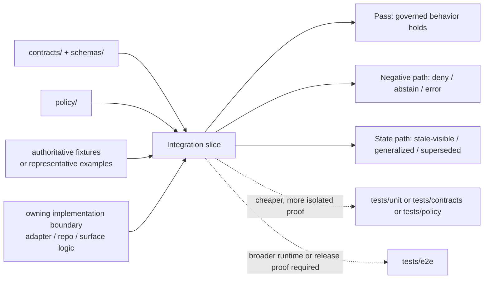

# integration

Governed slices across real boundaries for KFM behavior that is broader than a single unit or contract check, but narrower than full end-to-end release proof.

> [!NOTE]
> **Status:** experimental  
> **Owners:** @bartytime4life  
>      
> **Path:** `tests/integration/README.md`  
> **Repo fit:** downstream of [`tests/README.md`](../README.md), [`contracts/README.md`](../../contracts/README.md), [`policy/README.md`](../../policy/README.md), [`schemas/README.md`](../../schemas/README.md), [`docs/README.md`](../../docs/README.md), [`.github/workflows/README.md`](../../.github/workflows/README.md), and [`.github/PULL_REQUEST_TEMPLATE.md`](../../.github/PULL_REQUEST_TEMPLATE.md); upstream of future executable slices under `tests/integration/**` and any escalation into [`../e2e/`](../e2e/).  
> **Quick jump:** [Scope](#scope) · [Repo fit](#repo-fit) · [Inputs](#inputs) · [Exclusions](#exclusions) · [Directory tree](#directory-tree) · [Quickstart](#quickstart) · [Usage](#usage) · [Diagram](#diagram) · [Tables](#tables) · [Task list](#task-list) · [FAQ](#faq) · [Appendix](#appendix)

> [!IMPORTANT]
> The parent `tests/README.md` keeps `integration/` as a first-class repo family. This file follows the repo-visible name and burden: prove **governed slices across real boundaries** without silently collapsing the work into `unit/`, `contracts/`, `policy/`, or `e2e/`.

> [!CAUTION]
> **Current verified snapshot:** the current repo-visible tree proves that `tests/integration/` exists, but it does **not** yet prove an executable suite, fixture layout, local runner, or checked-in workflow hook for this family. Anything below that current snapshot is marked **PROPOSED** or **NEEDS VERIFICATION** on purpose.

## Scope

**Legend used in this README**

- **CONFIRMED** — visible in the current repo tree or adjacent repo documentation
- **PROPOSED** — recommended shape for this directory once real suites land
- **NEEDS VERIFICATION** — not proven from the current repo-visible evidence

Integration belongs here when a test has to cross at least one real KFM boundary, such as:

- contract interpretation plus policy decision
- source admission plus validation plus quarantine or candidate-state behavior
- evidence resolution plus runtime outcome selection
- freshness or projection state plus outward surface behavior
- repository or adapter behavior plus trust-visible state

Good integration slices are small, named, and burden-led. They prove one consequential seam cleanly instead of staging a miniature full platform.

## Repo fit

**Path:** `tests/integration/`

**Upstream authorities**

- [`../README.md`](../README.md) — test-family purpose, boundaries, and repo naming
- [`../../contracts/README.md`](../../contracts/README.md) — machine-readable contract direction
- [`../../policy/README.md`](../../policy/README.md) — deny-by-default decision posture
- [`../../schemas/README.md`](../../schemas/README.md) — schema-authority guardrails
- [`../../docs/README.md`](../../docs/README.md) — human-readable docs surface, not executable authority
- [`../../.github/workflows/README.md`](../../.github/workflows/README.md) — workflow intent and current limitations
- [`../../.github/PULL_REQUEST_TEMPLATE.md`](../../.github/PULL_REQUEST_TEMPLATE.md) — PR evidence, validation, and negative-path expectations

**Downstream consequences**

- Future `tests/integration/**` slices should live here.
- Escalate to `tests/e2e/` when a proof needs public/runtime flow, release assembly, or multi-surface correction behavior.
- Fall back to `tests/unit/`, `tests/contracts/`, or `tests/policy/` when the seam is isolated enough to be proved more cheaply and more honestly there.

### Current verified snapshot

| Item | Status | Why it matters |
| --- | --- | --- |
| `tests/integration/` exists as its own family | **CONFIRMED** | Keep the repo-visible family name instead of rewriting it away in prose. |
| The current public branch view shows only `README.md` in this directory | **CONFIRMED** | Do not claim executable coverage that the tree does not prove. |
| `/tests/` is code-owned at the repo level | **CONFIRMED** | Use the same ownership marker here unless repo ownership changes. |
| `.github/workflows/` is currently documentation-visible | **CONFIRMED** | Treat CI wiring for this family as **NEEDS VERIFICATION** until real workflow files are visible. |

## Inputs

Accepted inputs for this directory include the following:

| Accepted input | What belongs here | Notes |
| --- | --- | --- |
| Representative multi-boundary fixtures | A small, consequential slice that crosses at least one real seam | Prefer one slice with a clear burden over many decorative stubs. |
| Cross-family examples | Contract examples, policy decisions, or evidence objects reused from their authoritative homes | Reuse; do not duplicate authority. |
| Negative-path scenarios | `deny`, `abstain`, `error`, stale-visible, generalized, superseded, or withdrawn behavior where relevant | Fail-closed behavior is part of the proof, not an afterthought. |
| Freshness and lineage-sensitive cases | Examples where release, correction, or projection state changes user-visible behavior | Especially important when surfaces can otherwise bluff. |
| Thin-slice lanes with strong place/time semantics | **PROPOSED:** one representative lane such as hydrology-first | A lane example belongs here only when it proves a real boundary. |

## Exclusions

What does **not** belong here, and where it should go instead:

| Exclusion | Keep it out of `tests/integration/` | Put it here instead |
| --- | --- | --- |
| Pure function or local utility checks | No real cross-boundary behavior | `tests/unit/` |
| Schema-shape-only validation | Contract structure without runtime coupling | `tests/contracts/` plus authoritative contract/schema homes in `../../contracts/` and `../../schemas/` |
| Policy bundle grammar or reason-code-only checks | Decision logic with no broader slice | `tests/policy/` plus authoritative policy sources in `../../policy/` |
| Full public-surface or release-proof sweeps | Multi-boundary runtime proof with publication consequences | `tests/e2e/` |
| Accessibility-only behavior | Surface readability, motion, keyboard, or contrast checks with no broader integration burden | `tests/accessibility/` |
| Reproducibility or determinism-only checks | Repeatability without broader slice behavior | `tests/reproducibility/` |
| Human-readable guidance, runbooks, or ADR prose | Documentation is not executable proof | `../../docs/` |
| Canonical source, contract, or policy objects | This directory proves behavior; it does not own authority | Their owning repo surfaces |

## Directory tree

### Current confirmed snapshot

```text
tests/
└── integration/
    └── README.md
```

### Proposed maturity shape — NEEDS VERIFICATION

```text
tests/
└── integration/
    ├── README.md
    ├── source_admission/
    ├── evidence_resolution/
    ├── policy_mediation/
    ├── projection_freshness/
    └── shared/
        ├── fixtures/
        └── helpers/
```

> [!TIP]
> Treat the proposed tree as a starter pattern, not as current repo fact. Add real files only when a slice exists to justify them.

## Quickstart

1. Inspect the current directory exactly as the repo shows it.

```bash
find tests/integration -maxdepth 4 -type d | sort
find tests/integration -maxdepth 4 -type f | sort
```

2. Cross-check the adjacent authority surfaces before adding anything here.

```bash
sed -n '1,220p' tests/README.md
sed -n '1,220p' .github/PULL_REQUEST_TEMPLATE.md
sed -n '1,220p' .github/workflows/README.md
sed -n '1,220p' contracts/README.md
sed -n '1,220p' policy/README.md
sed -n '1,220p' schemas/README.md
sed -n '1,220p' docs/README.md
```

3. Search the repo for KFM object families and fail-closed outcomes before inventing new test language.

```bash
grep -RIn \
  -e 'SourceDescriptor' \
  -e 'IngestReceipt' \
  -e 'ValidationReport' \
  -e 'DatasetVersion' \
  -e 'DecisionEnvelope' \
  -e 'EvidenceBundle' \
  -e 'RuntimeResponseEnvelope' \
  -e 'CorrectionNotice' \
  -e 'ABSTAIN' \
  -e 'DENY' \
  -e 'ERROR' \
  -e 'stale' \
  tests contracts policy schemas docs .github 2>/dev/null || true
```

4. Start with one slice that proves a real seam. Do **not** widen this directory just to make the tree look mature.

## Usage

### When to place a test here

Use `tests/integration/` when the smallest honest proof has to cross a real boundary:

- a policy decision changes an outward runtime outcome
- a source or dataset state changes validation, quarantine, or promotion behavior
- evidence resolution drives visible surface state
- projection freshness, generalization, or correction state must be preserved across a boundary
- a representative lane slice proves a governed path better than isolated tests can

### Naming guidance

Prefer burden-led names over tool-led names.

| Better | Avoid |
| --- | --- |
| `source_admission/` | `misc/` |
| `evidence_resolution/` | `service_tests/` |
| `policy_mediation/` | `integration_v2/` |
| `projection_freshness/` | `helpers_everything/` |

Suggested test-file naming pattern:

```text
<slice>.<behavior>.<outcome>.test.<runner-extension>
```

Examples:

```text
source_admission.quarantine.invalid_geom.test.*
evidence_resolution.runtime.abstain.test.*
policy_mediation.export.denied.test.*
projection_freshness.map.stale_visible.test.*
```

### Escalation rule

Escalate from integration to end-to-end when the proof must include:

- public/runtime route flow
- release assembly or promotion evidence
- cross-surface correction behavior
- role-gated review or stewardship workflow
- multiple independent boundaries that would make a so-called “integration test” indistinguishable from a full system proof

## Diagram


```mermaid
flowchart LR
    A[contracts/ + schemas/] --> I[Integration slice]
    B[policy/] --> I
    C[authoritative fixtures<br/>or representative examples] --> I
    D[owning implementation boundary<br/>adapter / repo / surface logic] --> I

    I --> P[Pass: governed behavior holds]
    I --> N[Negative path: deny / abstain / error]
    I --> S[State path: stale-visible / generalized / superseded]

    I -. cheaper, more isolated proof .-> U[tests/unit or tests/contracts or tests/policy]
    I -. broader runtime or release proof required .-> E[tests/e2e]
```

## Tables

### Placement matrix

| If you need to prove... | Best home | Why |
| --- | --- | --- |
| Pure local logic | `tests/unit/` | Cheapest convincing proof wins. |
| Contract shape and valid/invalid examples | `tests/contracts/` | Keep structure validation separate from broader behavior. |
| Policy grammar, reason codes, obligation codes, or bundle logic | `tests/policy/` | Decision grammar should stay explicit and isolated when possible. |
| A governed slice across real boundaries | `tests/integration/` | This directory exists for cross-boundary proof. |
| Full runtime/public behavior, release proof, or multi-surface correction | `tests/e2e/` | That burden is broader than one integration slice. |
| Accessibility-only behavior | `tests/accessibility/` | Keep readability and interaction proof first-class, not incidental. |
| Repeatability/determinism checks | `tests/reproducibility/` | Separate reproducibility proof from broader slice scope. |

### Candidate first slices

| Candidate slice | Why it matters | Likely adjacent authorities | Status |
| --- | --- | --- | --- |
| Source admission -> validation/quarantine | Proves intake does not silently bypass governed checks | `contracts/`, `policy/`, `tests/contracts/` | **PROPOSED** |
| Evidence resolution -> runtime outcome | Proves evidence-backed outcomes instead of fluent bluffing | `contracts/`, `policy/`, owning runtime boundary | **PROPOSED** |
| Policy denial visibility | Proves denial changes behavior visibly instead of disappearing into logs | `policy/`, `tests/policy/`, surface-state expectations | **PROPOSED** |
| Projection freshness / stale-visible behavior | Proves freshness context crosses the boundary into outward behavior | release/correction references, docs/runbook expectations | **PROPOSED** |
| Hydrology-first representative slice | Good thin-slice candidate because of strong place/time semantics and public-safe burden | source descriptors, release/evidence objects, map surface behavior | **PROPOSED** |

> [!IMPORTANT]
> A good first executable slice is usually smaller than people want. KFM gains more from one real proof than from a wide but hollow directory tree.

## Task list

### First executable suite bootstrap

- [ ] Confirm whether an existing repo-wide runner, fixture convention, or workflow already governs this directory.
- [ ] Add one real slice before adding broad subtrees.
- [ ] Reuse authoritative contract and policy language instead of cloning it into test-local copies.
- [ ] Include at least one fail-closed expectation whenever the scenario can deny, abstain, error, stale, generalize, or supersede.
- [ ] Record how the slice is invoked locally if CI wiring is still **NEEDS VERIFICATION**.
- [ ] Update adjacent docs when this directory stops being README-only.

### Definition of done for any integration slice

1. The slice crosses a real boundary.
2. The scenario is named in KFM vocabulary, not generic test jargon.
3. Inputs, expected outputs, and visible state changes are explicit.
4. Negative-path behavior is asserted where relevant.
5. The slice does not create a second authority for contracts, policy, or docs.
6. Manual and/or CI execution path is documented.
7. The PR can point to fixtures, proof of behavior, and proof of failure behavior.

## FAQ

### Why not collapse this into `tests/e2e/`?

Because not every cross-boundary proof needs full public/runtime sweep, release assembly, or multi-surface correction behavior. This directory exists to keep those burdens honest and smaller.

### Does the current repo prove executable integration coverage?

No. The current repo-visible snapshot proves the directory and this README, not a runnable suite.

### Can `tests/integration/` own canonical schemas or policy bundles?

No. This directory proves behavior. It should consume authoritative contract and policy surfaces, not replace them.

### What is the best first slice?

A single representative governed slice across real boundaries. A hydrology-first example is a strong **PROPOSED** candidate, but the exact executable shape remains **NEEDS VERIFICATION** until real files land.

### What should trigger updates to this README?

Any change that introduces real suite files, runner conventions, shared helpers, fixture layout, or a stable escalation rule to `tests/e2e/`.

## Appendix

<details>
<summary><strong>Representative KFM object families this directory is likely to touch</strong></summary>

These are not all required for every slice. They are the KFM object families most likely to appear when an integration case becomes consequential.

| Object family | Why integration may touch it |
| --- | --- |
| `SourceDescriptor` | Source admission, access, cadence, and publication intent affect upstream behavior. |
| `IngestReceipt` | Integration may need to prove fetch/landing consequences across a boundary. |
| `ValidationReport` | Quarantine, pass/fail severity, and reason codes often change what happens next. |
| `DatasetVersion` | Candidate vs promoted state can change outward behavior or downstream eligibility. |
| `DecisionEnvelope` | Policy results are often the turning point in a governed slice. |
| `EvidenceBundle` | Trust-visible support should remain one hop away from consequential behavior. |
| `RuntimeResponseEnvelope` | Outward runtime outcomes should stay accountable and finite. |
| `CorrectionNotice` | Corrections, withdrawal, supersession, or narrowing can change the user-visible result. |

Keep these object families authoritative in their owning contract/policy homes. This directory should prove how they behave together, not redefine them.

</details>

[Back to top](#integration)
