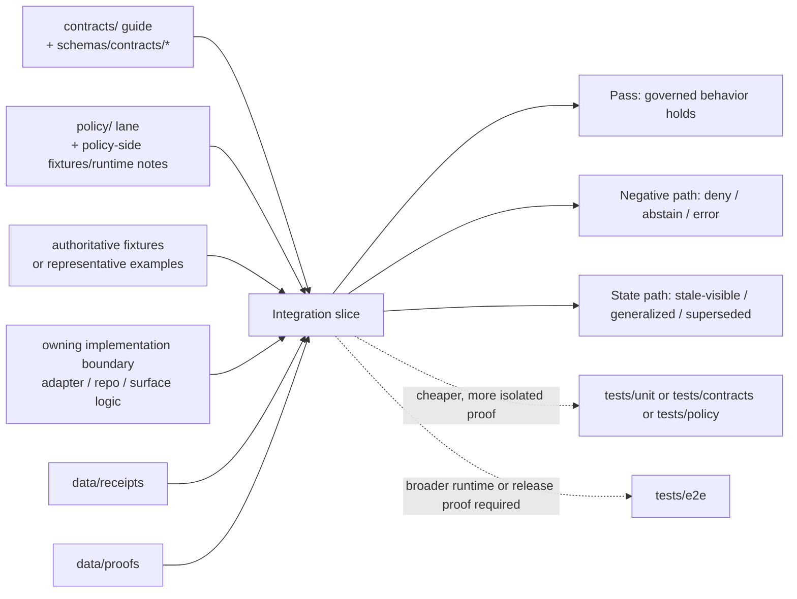

<!-- [KFM_META_BLOCK_V2]
doc_id: kfm://doc/NEEDS_VERIFICATION
title: integration
type: standard
version: v1
status: draft
owners: @bartytime4life
created: NEEDS_VERIFICATION
updated: 2026-04-16
policy_label: public
related: [
  ../README.md,
  ../contracts/README.md,
  ../policy/README.md,
  ../validators/README.md,
  ../ci/README.md,
  ../catalog/README.md,
  ../e2e/README.md,
  ../reproducibility/README.md,
  ../accessibility/README.md,
  ../../README.md,
  ../../contracts/README.md,
  ../../schemas/contracts/README.md,
  ../../policy/README.md,
  ../../schemas/README.md,
  ../../docs/README.md,
  ../../data/receipts/README.md,
  ../../data/proofs/README.md,
  ../../tools/validators/README.md,
  ../../tools/validators/promotion_gate/README.md,
  ../../tools/attest/README.md,
  ../../tools/ci/README.md,
  ../../.github/README.md,
  ../../.github/workflows/README.md,
  ../../.github/watchers/README.md,
  ../../.github/PULL_REQUEST_TEMPLATE.md,
  ../../.github/CODEOWNERS,
  ../../CONTRIBUTING.md
]
tags: [kfm, tests, integration, governed-slice, receipts, proofs, policy, contracts]
notes: [
  Updated to align the integration family with the fuller tests lattice, explicit receipt/proof separation, validator/attest adjacency, and the newer workflow and watcher boundary documentation.
  Preserves current public-tree truth: tests/integration/ is still README-only unless a checked-out branch proves more.
  doc_id, created date, and any executable runner/toolchain details remain NEEDS VERIFICATION until branch-visible evidence confirms them.
]
[/KFM_META_BLOCK_V2] -->

<a id="top"></a>

# `integration`

Governed slices across real boundaries for KFM behavior that is broader than a single unit or contract check, but narrower than full end-to-end release proof.

> **Status:** experimental  
> **Owners:** `@bartytime4life`  
> **Path:** `tests/integration/README.md`  
> **Repo fit:** downstream of [`tests/README.md`](../README.md), [`../../contracts/README.md`](../../contracts/README.md), [`../../schemas/contracts/README.md`](../../schemas/contracts/README.md), [`../../policy/README.md`](../../policy/README.md), [`../../schemas/README.md`](../../schemas/README.md), [`../../docs/README.md`](../../docs/README.md), [`../../data/receipts/README.md`](../../data/receipts/README.md), [`../../data/proofs/README.md`](../../data/proofs/README.md), [`../../tools/validators/README.md`](../../tools/validators/README.md), [`../../tools/validators/promotion_gate/README.md`](../../tools/validators/promotion_gate/README.md), [`../../tools/attest/README.md`](../../tools/attest/README.md), [`../../tools/ci/README.md`](../../tools/ci/README.md), [`../../.github/README.md`](../../.github/README.md), [`../../.github/workflows/README.md`](../../.github/workflows/README.md), [`../../.github/watchers/README.md`](../../.github/watchers/README.md), [`../../.github/PULL_REQUEST_TEMPLATE.md`](../../.github/PULL_REQUEST_TEMPLATE.md), and [`../../CONTRIBUTING.md`](../../CONTRIBUTING.md); upstream of future executable slices under `tests/integration/**` and any escalation into [`../e2e/`](../e2e/)  
>          
> **Quick jump:** [Scope](#scope) · [Repo fit](#repo-fit) · [Accepted inputs](#accepted-inputs) · [Exclusions](#exclusions) · [Current verified snapshot](#current-verified-snapshot) · [Directory tree](#directory-tree) · [Quickstart](#quickstart) · [Usage](#usage) · [Authority routing](#authority-routing) · [Diagram](#diagram) · [Tables](#tables) · [Task list / definition of done](#task-list--definition-of-done) · [FAQ](#faq) · [Appendix](#appendix)

> [!IMPORTANT]
> The parent [`tests/README.md`](../README.md) keeps `integration/` as a first-class repo family.
>
> This file follows the repo-visible burden:
>
> **prove governed slices across real boundaries**
>
> without silently collapsing the work into `unit/`, `contracts/`, `policy/`, `validators/`, or `e2e/`.

> [!TIP]
> Keep the KFM trust split visible here:
>
> **integration slice ≠ contract authority ≠ policy authority ≠ validator proof ≠ runtime e2e proof ≠ receipt authority ≠ proof authority**
>
> - `tests/integration/` proves a real boundary crossing
> - `tests/contracts/` proves shape and valid/invalid examples
> - `tests/policy/` proves decision behavior
> - `tests/validators/` proves gate behavior
> - `tests/e2e/` proves whole-path runtime, release, or correction behavior
> - receipts remain process memory
> - proofs remain higher-order trust objects

> [!CAUTION]
> Current public `main` proves that `tests/integration/` exists and currently exposes `README.md` only.
>
> It does **not** yet prove:
>
> - an executable suite
> - fixture layout
> - local runner
> - required checks
> - checked-in workflow YAML for this family
> - mounted receipt/proof-aware integration slices
>
> Everything below that boundary stays marked **INFERRED**, **PROPOSED**, **UNKNOWN**, or **NEEDS VERIFICATION** on purpose.

---

## Scope

`tests/integration/` is the KFM family for **governed slices across real boundaries**.

Use this directory when the smallest honest proof has to cross at least one real seam, but does **not** yet need the full public/runtime/release/correction burden of `tests/e2e/`.

Good integration slices are:

- small
- named
- burden-led
- cross-boundary
- fail-closed where relevant
- explicit about the authority surfaces they consume

They prove one consequential seam cleanly instead of staging a miniature full platform.

### Strong-fit slice types

Integration belongs here when the smallest honest proof has to cross a real KFM boundary such as:

- contract interpretation plus policy decision
- source admission plus validation plus quarantine or candidate-state behavior
- evidence resolution plus runtime outcome selection
- freshness or projection state plus outward surface behavior
- repository or adapter behavior plus trust-visible state
- validator output plus downstream machine-consumer behavior, without widening into full runtime or release proof
- receipt/proof visibility crossing an actual boundary, without turning the test into whole-path end-to-end trust proof

### What this family should prove

- a real seam exists and the slice crosses it intentionally
- upstream authority remains outside the slice
- outward behavior changes for the right reason
- negative paths stay visible (`deny`, `abstain`, `error`, `stale-visible`, `generalized`, `superseded`, and similar states when relevant)
- receipts, proofs, decisions, and rendered cues remain distinguishable when more than one appears in the same slice
- the test is smaller than an e2e proof and more consequential than a local unit or shape-only check

### What this family should not absorb

- pure local logic
- schema-shape-only validation
- policy grammar by itself
- validator-only proof with no broader seam
- renderer-only proof
- full request-time runtime proof
- release-assembly proof
- correction-lineage proof
- receipt/proof storage semantics
- silent contract-home or schema-home arbitration by convenience

### Status markers used here

| Marker | Meaning in this README |
| --- | --- |
| **CONFIRMED** | Visible on the current public branch or directly grounded in adjacent repo documentation |
| **INFERRED** | Strongly supported by adjacent repo docs or parent-lane coverage, but not re-proven as mounted executable behavior |
| **PROPOSED** | Recommended shape or first-slice pattern that fits KFM doctrine but is not asserted as current repo fact |
| **UNKNOWN** | Not verified strongly enough in this session to present as current repo reality |
| **NEEDS VERIFICATION** | A path, command, runner, protection rule, or workflow detail that should be checked before merge |

[Back to top](#top)

---

## Repo fit

**Path:** `tests/integration/`  
**Role:** family README for governed cross-boundary slices that stop short of full e2e proof.

### Upstream authorities

| Surface | Why it matters |
| --- | --- |
| [`../README.md`](../README.md) | test-family purpose, placement boundaries, and public-tree vocabulary |
| [`../../contracts/README.md`](../../contracts/README.md) | human-readable contract doctrine, trust-object list, and split-state warning |
| [`../../schemas/contracts/README.md`](../../schemas/contracts/README.md) | live machine-file-bearing contract subtree when a slice depends on a specific family or registry lane |
| [`../../policy/README.md`](../../policy/README.md) | deny-by-default posture and top-level policy-lane routing |
| [`../../schemas/README.md`](../../schemas/README.md) | schema-home ambiguity and current public inventory boundary |
| [`../../docs/README.md`](../../docs/README.md) | documentation as a production-facing trust surface, not executable authority |
| [`../../data/receipts/README.md`](../../data/receipts/README.md) | process-memory boundary for receipt-bearing slices |
| [`../../data/proofs/README.md`](../../data/proofs/README.md) | proof boundary for higher-order trust objects |
| [`../../tools/validators/README.md`](../../tools/validators/README.md) | validator/gate behavior belongs there when the seam is narrower than a governed integration slice |
| [`../../tools/validators/promotion_gate/README.md`](../../tools/validators/promotion_gate/README.md) | a useful adjacent machine chain for promotion-oriented slices that still stop short of e2e release proof |
| [`../../tools/attest/README.md`](../../tools/attest/README.md) | attestation visibility may matter in a slice without moving sign/verify ownership here |
| [`../../tools/ci/README.md`](../../tools/ci/README.md) | downstream rendering may consume outputs, but rendering proof remains elsewhere |
| [`../../.github/README.md`](../../.github/README.md) | repo gatehouse for review routing, workflow-bearing control, and governance intake |
| [`../../.github/workflows/README.md`](../../.github/workflows/README.md) | current workflow-lane visibility and limitations |
| [`../../.github/watchers/README.md`](../../.github/watchers/README.md) | watcher/process-memory boundary for receipt-bearing and freshness-aware slices |
| [`../../.github/PULL_REQUEST_TEMPLATE.md`](../../.github/PULL_REQUEST_TEMPLATE.md) | PR evidence, truth-label discipline, and proof-link expectations |
| [`../../CONTRIBUTING.md`](../../CONTRIBUTING.md) | contributor rules for truth posture, docs/tests co-movement, and fail-closed review discipline |

### Downstream consequences

- Future `tests/integration/**` executable slices should live here.
- Escalate to [`../e2e/`](../e2e/) when a proof needs public/runtime route flow, release assembly, or multi-surface correction behavior.
- Prefer specific end-to-end families such as [`../e2e/correction/`](../e2e/correction/), [`../e2e/release_assembly/`](../e2e/release_assembly/), or [`../e2e/runtime_proof/`](../e2e/runtime_proof/) when the burden is clearly correction, release, or request-time runtime proof.
- Fall back to [`../unit/`](../unit/), [`../contracts/`](../contracts/), [`../policy/`](../policy/), [`../validators/`](../validators/), [`../ci/`](../ci/), [`../catalog/`](../catalog/), [`../accessibility/`](../accessibility/), or [`../reproducibility/`](../reproducibility/) when the seam is isolated enough to be proved more cheaply and more honestly there.

### Working rule

Use `tests/integration/` when the slice is:

- real
- cross-boundary
- smaller than e2e
- larger than unit/contract/policy-only proof
- explicit about authority routing
- honest about fail-closed outcomes

[Back to top](#top)

---

## Accepted inputs

Content that belongs in this directory includes:

| Accepted input | What belongs here | Notes |
| --- | --- | --- |
| Representative multi-boundary fixtures | A small, consequential slice that crosses at least one real seam | Prefer one slice with a clear burden over many decorative stubs. |
| Cross-family examples | Contract examples, policy decisions, validator outputs, receipt refs, proof refs, or evidence objects reused from their authoritative homes | Reuse; do not duplicate authority. |
| Exact references into live authority lanes | A slice may name the specific `schemas/contracts/`, `policy/`, validator, receipt, or proof seam it depends on | Name the seam; do not fork it locally. |
| Negative-path scenarios | `deny`, `abstain`, `error`, `stale-visible`, `generalized`, `superseded`, or `withdrawn` behavior where relevant | Fail-closed behavior is part of the proof, not an afterthought. |
| Freshness and lineage-sensitive cases | Examples where release, correction, or projection state changes outward behavior across a real seam | Especially important when surfaces can otherwise bluff. |
| Thin-slice lanes with strong place/time semantics | **PROPOSED:** one representative lane such as hydrology-first | A lane example belongs here only when it proves a real boundary. |
| Trust-chain-aware slices | Cases where `receipt_ref`, `proof_ref`, release linkage, or attestation-visible state changes a boundary outcome without requiring full e2e proof | Keep the trust objects explicit and non-flattened. |

### Input rules

1. Reuse authoritative fixtures where possible.
2. Name the exact seam being crossed.
3. Keep negative-path outcomes explicit.
4. Keep receipts as process memory and proofs as higher-order trust objects when both appear.
5. Do not create a second authority for contracts, policy, receipts, proofs, or docs inside this family.

## Exclusions

What does **not** belong here, and where it should go instead:

| Exclusion | Keep it out of `tests/integration/` | Put it here instead |
| --- | --- | --- |
| Pure local logic | No real cross-boundary behavior | [`../unit/`](../unit/) |
| Schema-shape-only validation | Contract structure without runtime coupling | [`../contracts/`](../contracts/) plus authoritative guidance in [`../../contracts/README.md`](../../contracts/README.md) and the current machine-file-bearing lane at [`../../schemas/contracts/README.md`](../../schemas/contracts/README.md) |
| Policy bundle grammar or reason-code-only checks | Decision logic with no broader slice | [`../policy/`](../policy/) plus authoritative policy sources in [`../../policy/`](../../policy/) |
| Validator-only gate behavior | A machine gate with no broader seam | [`../validators/`](../validators/) |
| Renderer-only behavior | Formatting or handoff composition with no broader seam | [`../ci/`](../ci/) |
| Catalog-helper-only closure behavior | Metadata closure with no broader seam | [`../catalog/`](../catalog/) |
| Full public-surface or release-proof sweeps | Multi-boundary runtime proof with publication consequences | [`../e2e/`](../e2e/) |
| Accessibility-only behavior | Surface readability, motion, keyboard, or contrast checks with no broader integration burden | [`../accessibility/`](../accessibility/) |
| Reproducibility or determinism-only checks | Repeatability without broader slice behavior | [`../reproducibility/`](../reproducibility/) |
| Human-readable guidance, runbooks, or ADR prose | Documentation is not executable proof | [`../../docs/`](../../docs/) |
| Canonical source, contract, policy, receipt, or proof objects | This directory proves behavior; it does not own authority | Their owning repo surfaces |

> [!IMPORTANT]
> A slice that touches receipts or proofs does **not** automatically belong here.
> It belongs here only when crossing a real boundary is the main burden.

## Current verified snapshot

The current public `main` branch proves the following:

| Item | Status | Why it matters |
| --- | --- | --- |
| `integration/` exists as its own family under `tests/` | **CONFIRMED** | Keep the repo-visible family name instead of rewriting it away in prose. |
| `tests/integration/` currently exposes `README.md` only | **CONFIRMED** | Do not imply executable coverage that the tree does not prove. |
| `/tests/` is covered by `@bartytime4life` in `.github/CODEOWNERS` | **CONFIRMED** | Reuse the same owner marker here unless repo ownership changes. |
| `.github/workflows/` is currently README-only on public `main` | **CONFIRMED** | Treat CI wiring for this family as **UNKNOWN** or **NEEDS VERIFICATION** until a checked-out branch proves more. |
| `.github/watchers/README.md` now exists as a public watcher-boundary document | **CONFIRMED** | Integration slices can now be described more cleanly relative to process-memory and watcher-generated observations. |
| `policy/` is a real top-level lane with `bundles/`, `fixtures/`, `policy-runtime/`, `tests/`, and `README.md` | **CONFIRMED** | Integration slices can reuse policy-side seams rather than recreating them here. |
| `contracts/` remains README-only while `schemas/contracts/` now exposes `v1/` and `vocab/` | **CONFIRMED** | Cases that depend on contract shape should point at the exact lane they exercise. |
| `data/receipts/` and `data/proofs/` now exist as explicit trust-boundary docs | **CONFIRMED** | Trust-chain-aware slices should keep these surfaces explicit rather than flattening them. |
| The broader `tests/` surface lists `integration/` beside `accessibility/`, `contracts/`, `e2e/`, `policy/`, `reproducibility/`, and `unit/` | **CONFIRMED** | Integration is a first-class placement decision, not a leftover bucket. |

> [!WARNING]
> What is still **not** proven here:
>
> - exact test runner
> - executable case depth
> - fixture inventory
> - required checks
> - branch-protection settings
> - whether rollback/correction drills are exercised on the active branch
> - mounted receipt/proof-aware integration slices

## Directory tree

### Current confirmed public-main snapshot

```text
tests/
└── integration/
    └── README.md
```

### Proposed maturity shape — `PROPOSED` / `NEEDS VERIFICATION`

```text
tests/
└── integration/
    ├── README.md
    ├── source_admission/
    ├── evidence_resolution/
    ├── policy_mediation/
    ├── projection_freshness/
    └── shared/
        ├── fixtures/
        └── helpers/
```

> [!TIP]
> Treat the proposed tree as a starter pattern, not as current repo fact.
> Add real files only when a slice exists to justify them.

## Quickstart

### 1) Inspect the current family exactly as the repo shows it

```bash
find tests/integration -maxdepth 4 -type d | sort
find tests/integration -maxdepth 4 -type f | sort
```

### 2) Re-check adjacent governance and authority surfaces before adding anything here

```bash
sed -n '1,240p' tests/README.md
sed -n '1,220p' tests/contracts/README.md
sed -n '1,220p' tests/policy/README.md
sed -n '1,220p' tests/validators/README.md
sed -n '1,220p' tests/ci/README.md
sed -n '1,220p' tests/catalog/README.md
sed -n '1,220p' tests/e2e/README.md
sed -n '1,220p' tests/reproducibility/README.md
sed -n '1,220p' tests/accessibility/README.md
sed -n '1,220p' .github/README.md
sed -n '1,220p' .github/CODEOWNERS
sed -n '1,220p' .github/PULL_REQUEST_TEMPLATE.md
sed -n '1,220p' .github/workflows/README.md
sed -n '1,220p' .github/watchers/README.md
sed -n '1,220p' CONTRIBUTING.md
sed -n '1,220p' contracts/README.md
sed -n '1,220p' schemas/contracts/README.md
sed -n '1,220p' policy/README.md
sed -n '1,220p' schemas/README.md
sed -n '1,220p' docs/README.md
sed -n '1,220p' data/receipts/README.md
sed -n '1,220p' data/proofs/README.md
sed -n '1,220p' tools/validators/README.md
sed -n '1,220p' tools/validators/promotion_gate/README.md
sed -n '1,220p' tools/attest/README.md
sed -n '1,220p' tools/ci/README.md
```

### 3) Inspect the live machine-file and policy-side seams before inventing local copies

```bash
find schemas/contracts -maxdepth 4 -type f 2>/dev/null | sort | sed -n '1,160p'
find policy -maxdepth 3 -type f 2>/dev/null | sort | sed -n '1,160p'
find tests/contracts tests/policy -maxdepth 3 -type f 2>/dev/null | sort
```

### 4) Search for KFM object families, trust refs, and fail-closed outcomes before inventing new test language

```bash
grep -RIn \
  -e 'SourceDescriptor' \
  -e 'IngestReceipt' \
  -e 'ValidationReport' \
  -e 'DatasetVersion' \
  -e 'DecisionEnvelope' \
  -e 'EvidenceBundle' \
  -e 'RuntimeResponseEnvelope' \
  -e 'CorrectionNotice' \
  -e 'receipt_ref' \
  -e 'proof_ref' \
  -e 'run_receipt' \
  -e 'ai_receipt' \
  -e 'ABSTAIN' \
  -e 'DENY' \
  -e 'ERROR' \
  -e 'stale' \
  tests contracts policy schemas docs .github data tools 2>/dev/null || true
```

### 5) Start with one slice that proves a real seam

Do **not** widen this directory just to make the tree look mature.

## Usage

### When to place a test here

Use `tests/integration/` when the smallest honest proof has to cross a real boundary:

- a policy decision changes an outward runtime outcome
- a source or dataset state changes validation, quarantine, or candidate-state behavior
- evidence resolution drives visible surface state
- projection freshness, generalization, or correction state must be preserved across a boundary
- a representative lane slice proves a governed path better than isolated tests can
- receipt/proof visibility changes the outcome at a seam, but the case still stops short of full e2e proof

### Authority routing

Current public `main` shows a split contract signal:

- [`../../contracts/README.md`](../../contracts/README.md) remains the human-readable contract guide.
- [`../../schemas/contracts/README.md`](../../schemas/contracts/README.md) is a live machine-file-bearing scaffold with `v1/` and `vocab/`.

When a slice depends on contract shape, make two things explicit:

1. which human-readable guide or lane boundary explains the burden, and
2. which exact machine-file-bearing or policy-side seam the slice is exercising.

Do **not** let `tests/integration/` become the place where unresolved contract-home questions are accidentally decided by convenience.

The same rule now applies to trust surfaces:

1. name when a slice depends on process memory
2. name when it depends on higher-order proof visibility
3. keep receipts and proofs explicit instead of flattening them into a generic “trust object present” assertion

### Naming guidance

Prefer burden-led names over tool-led names.

| Better | Avoid |
| --- | --- |
| `source_admission/` | `misc/` |
| `evidence_resolution/` | `service_tests/` |
| `policy_mediation/` | `integration_v2/` |
| `projection_freshness/` | `helpers_everything/` |

Suggested test-file naming pattern:

```text
<slice>.<behavior>.<outcome>.test.<runner-extension>
```

Examples:

```text
source_admission.quarantine.invalid_geom.test.*
evidence_resolution.runtime.abstain.test.*
policy_mediation.export.denied.test.*
projection_freshness.map.stale_visible.test.*
trust_visibility.bundle_receipt_split.visible.test.*
```

### Escalation rule

Escalate from integration to end-to-end when the proof must include:

- public/runtime route flow
- release assembly or promotion evidence
- cross-surface correction behavior
- role-gated review or stewardship workflow
- multiple independent boundaries that would make a so-called “integration test” indistinguishable from a full system proof

When the burden is already clearly narrowed to correction, release assembly, or request-time runtime proof, prefer the specific downstream family under [`../e2e/`](../e2e/) instead of widening this directory.

## Diagram


```mermaid
flowchart LR
    A[contracts/ guide<br/>+ schemas/contracts/*] --> I[Integration slice]
    B[policy/ lane<br/>+ policy-side fixtures/runtime notes] --> I
    C[authoritative fixtures<br/>or representative examples] --> I
    D[owning implementation boundary<br/>adapter / repo / surface logic] --> I
    R[data/receipts] --> I
    P[data/proofs] --> I

    I --> P1[Pass: governed behavior holds]
    I --> N[Negative path: deny / abstain / error]
    I --> S[State path: stale-visible / generalized / superseded]

    I -. cheaper, more isolated proof .-> U[tests/unit or tests/contracts or tests/policy]
    I -. broader runtime or release proof required .-> E[tests/e2e]
```

## Tables

### Placement matrix

| If you need to prove... | Best home | Why |
| --- | --- | --- |
| Pure local logic | [`../unit/`](../unit/) | Cheapest convincing proof wins. |
| Contract shape and valid/invalid examples | [`../contracts/`](../contracts/) plus the exact owning machine-file lane under [`../../schemas/contracts/`](../../schemas/contracts/) when relevant | Keep structure validation separate from broader behavior, and name the real source of shape truth. |
| Policy grammar, reason codes, obligation codes, or bundle logic | [`../policy/`](../policy/) plus owning surfaces under [`../../policy/`](../../policy/) | Decision grammar should stay explicit and isolated when possible. |
| Validator-only or gate-only behavior | [`../validators/`](../validators/) | Keep gate proof bounded when a broader seam is not the real burden. |
| Renderer-only behavior | [`../ci/`](../ci/) | Formatting and handoff proof should stay explicit. |
| Catalog-closure-only behavior | [`../catalog/`](../catalog/) | Metadata closure is a distinct burden. |
| A governed slice across real boundaries | `tests/integration/` | This directory exists for cross-boundary proof. |
| Full runtime/public behavior, release proof, or multi-surface correction | [`../e2e/`](../e2e/) | That burden is broader than one integration slice. |
| Accessibility-only behavior | [`../accessibility/`](../accessibility/) | Keep readability and interaction proof first-class, not incidental. |
| Repeatability or determinism checks | [`../reproducibility/`](../reproducibility/) | Separate reproducibility proof from broader slice scope. |

### Candidate first slices

| Candidate slice | Why it matters | Likely adjacent authorities | Status |
| --- | --- | --- | --- |
| Source admission -> validation/quarantine | Proves intake does not silently bypass governed checks | `contracts/`, `policy/`, `tests/contracts/` | **PROPOSED** |
| Evidence resolution -> runtime outcome | Proves evidence-backed outcomes instead of fluent bluffing | `contracts/`, `policy/`, owning runtime boundary | **PROPOSED** |
| Policy denial visibility | Proves denial changes behavior visibly instead of disappearing into logs | `policy/`, `tests/policy/`, surface-state expectations | **PROPOSED** |
| Projection freshness / stale-visible behavior | Proves freshness context crosses the boundary into outward behavior | release/correction references, docs/runbook expectations | **PROPOSED** |
| Hydrology-first representative slice | Good thin-slice candidate because of strong place/time semantics and public-safe burden | source descriptors, release/evidence objects, map surface behavior | **PROPOSED** |
| Trust visibility seam | Proves receipts, proofs, and emitted decisions stay explicit across one real boundary | receipts/proofs docs, validators, runtime or release-facing consumer | **PROPOSED** |

> [!IMPORTANT]
> A good first executable slice is usually smaller than people want.
> KFM gains more from one real proof than from a wide but hollow directory tree.

## Task list / definition of done

### First executable suite bootstrap

- [ ] Confirm whether an existing repo-wide runner, fixture convention, or workflow already governs this directory.
- [ ] Add one real slice before adding broad subtrees.
- [ ] Reuse authoritative contract and policy language instead of cloning it into test-local copies.
- [ ] Name the exact contract or policy lane consumed whenever a slice relies on the current `contracts/` ↔ `schemas/contracts/` split state.
- [ ] Include at least one fail-closed expectation whenever the scenario can deny, abstain, error, stale, generalize, or supersede.
- [ ] Record how the slice is invoked locally if CI wiring is still **UNKNOWN** or **NEEDS VERIFICATION**.
- [ ] Update adjacent docs when this directory stops being README-only.
- [ ] Add receipt/proof-aware assertions only when the slice truly depends on those trust surfaces.
- [ ] Keep receipt/proof/process-memory distinctions explicit whenever the slice crosses a trust-bearing boundary.

### Definition of done for any integration slice

1. The slice crosses a real boundary.
2. The scenario is named in KFM vocabulary, not generic test jargon.
3. Inputs, expected outputs, and visible state changes are explicit.
4. Negative-path behavior is asserted where relevant.
5. The slice does not create a second authority for contracts, policy, docs, receipts, or proofs.
6. Manual and/or CI execution path is documented.
7. The PR can point to fixtures, proof of behavior, and proof of failure behavior.
8. If the slice touches trust objects, it preserves receipt/proof distinctions rather than flattening them.

## FAQ

### Why not collapse this into `tests/e2e/`?

Because not every cross-boundary proof needs full public/runtime sweep, release assembly, or multi-surface correction behavior. This directory exists to keep those burdens honest and smaller.

### Does the current repo prove executable integration coverage?

No. The current repo-visible snapshot proves the directory and this README, not a runnable suite.

### Why mention `schemas/contracts/` in an integration README?

Because current public `main` now exposes a real machine-file-bearing contract subtree there, while `contracts/README.md` remains the human-readable contract guide. Integration slices should point at the exact surfaces they depend on instead of silently choosing an authority by convenience.

### Can `tests/integration/` own canonical schemas or policy bundles?

No. This directory proves behavior. It should consume authoritative contract and policy surfaces, not replace them.

### Why mention receipts and proofs here?

Because real seams often cross trust-bearing boundaries before they escalate to full e2e proof. Mentioning them keeps process memory and higher-order proof state explicit without moving ownership into this family.

### What is the best first slice?

A single representative governed slice across real boundaries. A hydrology-first example is a strong **PROPOSED** candidate, but the exact executable shape remains **NEEDS VERIFICATION** until real files land.

### What should trigger updates to this README?

Any change that introduces real suite files, runner conventions, shared helpers, fixture layout, stable receipt/proof-aware slice patterns, or a stable escalation rule to `tests/e2e/`.

## Appendix

<details>
<summary><strong>Representative KFM object families this directory is likely to touch</strong></summary>

These are not all required for every slice. They are the KFM object families most likely to appear when an integration case becomes consequential.

| Object family | Why integration may touch it |
| --- | --- |
| `SourceDescriptor` | Source admission, access, cadence, and publication intent affect upstream behavior. |
| `IngestReceipt` | Integration may need to prove fetch/landing consequences across a boundary. |
| `ValidationReport` | Quarantine, pass/fail severity, and reason codes often change what happens next. |
| `DatasetVersion` | Candidate vs promoted state can change outward behavior or downstream eligibility. |
| `DecisionEnvelope` | Policy results are often the turning point in a governed slice. |
| `EvidenceBundle` | Trust-visible support should remain one hop away from consequential behavior. |
| `RuntimeResponseEnvelope` | Outward runtime outcomes should stay accountable and finite. |
| `CorrectionNotice` | Corrections, withdrawal, supersession, or narrowing can change the user-visible result. |
| `run_receipt` / `ai_receipt` | Process-memory continuity may matter at a real seam without requiring full e2e proof. |
| `proof_ref` / attestation-visible state | Higher-order trust visibility may cross a slice boundary without becoming full release or runtime e2e proof. |

Keep these object families authoritative in their owning contract, policy, receipt, and proof homes.  
This directory should prove how they behave together, not redefine them.

</details>

[Back to top](#top)
