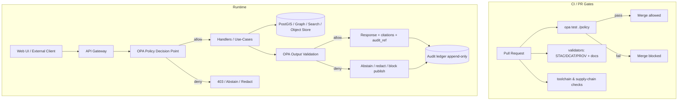

# Policy Test Suite (OPA/Rego)


This directory (`tests/policy/`) is the **merge-blocking policy test suite** for the KFM OPA/Rego policy pack.

- **Policy source of truth:** `policy/` (Rego modules + policy data)
- **Test harness & fixtures:** `tests/policy/` (unit tests, regression cases, and governed fixtures)

KFM governance is **default-deny** and **fail-closed**. If policy cannot be evaluated (missing bundle, invalid input, missing evidence, runtime error), the system must **deny** access/promotion/answers rather than "best-effort allow".

> ✅ **Non‑negotiables (KFM):**
> - **Trust membrane**: UI/external clients never access databases directly; all access goes through the governed API + policy boundary.
> - **Policy on every request**: data, Story Nodes, and AI/Focus Mode.
> - **Fail‑closed**: evaluation errors result in deny.
> - **Promotion gates**: Raw → Work → Processed; promotion requires checksums + STAC/DCAT/PROV artifacts.
> - **Focus Mode**: cite-or-abstain; every governed answer produces an `audit_ref`.

---

## Table of Contents

- [What This Covers](#what-this-covers)
- [Where Policy Runs (CI + Runtime)](#where-policy-runs-ci--runtime)
- [Repository Layout](#repository-layout)
- [Quickstart](#quickstart)
  - [Run the Unit Tests (OPA)](#run-the-unit-tests-opa)
  - [Run Formatting (OPA fmt)](#run-formatting-opa-fmt)
  - [Run Conftest Checks (Optional)](#run-conftest-checks-optional)
- [CI Expectations](#ci-expectations)
  - [Minimal CI Job (Example)](#minimal-ci-job-example)
  - [What Must Be Merge-Blocking](#what-must-be-merge-blocking)
- [Policy Surfaces and Contracts](#policy-surfaces-and-contracts)
  - [Policy Surface Matrix](#policy-surface-matrix)
  - [Input Contract (Common Shape)](#input-contract-common-shape)
  - [Decision Contract (Common Shape)](#decision-contract-common-shape)
  - [Error Semantics (Fail-Closed)](#error-semantics-fail-closed)
- [Writing Policy Tests](#writing-policy-tests)
  - [Unit Tests (Rego)](#unit-tests-rego)
  - [Regression / Golden Fixtures](#regression--golden-fixtures)
  - [Negative/Safety Tests (Sensitive Data)](#negativesafety-tests-sensitive-data)
  - [Test Naming & Organization](#test-naming--organization)
- [Fixtures and Test Data Rules](#fixtures-and-test-data-rules)
- [Debugging](#debugging)
- [Pull Request Checklist](#pull-request-checklist)
- [FAQ](#faq)

---

## What This Covers

Policy tests exist to guarantee that KFM governance stays true through refactors, new datasets, new Story Nodes, and model changes.

At minimum, this suite must protect against:

- **Default deny regressions** (any missing/unknown value must not accidentally allow).
- **Dataset promotion bypass** (promotion blocked unless required governance artifacts exist and validate).
- **Cite-or-abstain violations** in Focus Mode (no uncited factual answers).
- **Sensitive-record leakage** (precise coordinates, restricted attributes, small-count aggregates).
- **Audit integrity drift** (policy decisions produce stable reason codes and obligations, and runtime produces an `audit_ref`).

If a policy change alters behavior, tests must make that change **explicit, reviewed, and merge‑blocking**.

---

## Where Policy Runs (CI + Runtime)

Policy is the enforcement layer for the **trust membrane**.



---

## Repository Layout

This README documents how policy testing works end-to-end. A canonical layout looks like this:

```text
.
policy/                                           # OPA/Rego source of truth (deny-by-default; governs access + promotion + AI)
├─ kfm/                                           # Rego packages (package kfm.*)
│  ├─ access.rego                                 # Access control rules (actor/resource/scopes; default-deny)
│  ├─ access_test.rego                            # Unit tests for access rules (allow/deny matrix + edge cases)
│  ├─ promotion.rego                              # Promotion gates (STAC/DCAT/PROV + digests/receipts prerequisites)
│  ├─ promotion_test.rego                         # Unit tests for promotion gates (missing lineage, materiality, etc.)
│  ├─ ai.rego                                     # Focus Mode policy (cite-or-abstain, response contract, safety gates)
│  ├─ ai_test.rego                                # Unit tests for Focus Mode policy (citations, abstain reasons, redaction)
│  └─ …                                           # Additional modules (redaction, licensing, audit, thresholds, etc.)
│
└─ data/                                          # Policy data (versioned, controlled vocabularies + mappings)
   ├─ sensitivity_levels.json                     # Canonical sensitivity levels/taxonomy referenced by policies
   └─ …                                           # Other policy data (allowlists, thresholds, role maps, vocab)

tests/
└─ policy/                                        # Policy test harness (fixtures + optional scenario packs)
   ├─ README.md                                   # (This file) how to run opa/conftest, naming rules, update workflow
   │
   ├─ fixtures/                                   # Governed test inputs (synthetic; deterministic; reviewed)
   │  ├─ focus_mode/                              # Focus Mode inputs (answers/requests/context) for allow/deny cases
   │  ├─ promotion/                               # Promotion input vectors (catalog triplet, receipts, digests)
   │  ├─ access/                                  # Access vectors (claims/roles/scopes/resources)
   │  └─ redaction/                               # Redaction vectors (precision rules, restricted fields, transforms)
   │
   └─ cases/                                      # Optional scenario packs (end-to-end regression inputs, multi-fixture)
```

**Rules of thumb**

- **`policy/` is the source of truth.** Runtime and CI both evaluate policy from this directory.
- Keep fixtures **small, explicit, and governed**. Fixtures are part of your security posture.
- Prefer deterministic inputs and stable reason codes so regressions are obvious.

---

## Quickstart

### Run the Unit Tests (OPA)

From the repository root:

```bash
opa test ./policy -v
```

Useful variants:

```bash
# Only a subpackage
opa test ./policy/kfm -v

# Run a single test file
opa test ./policy/kfm/ai_test.rego -v
```

Docker equivalent (recommended when you want "works on my machine" parity):

```bash
docker run --rm -v "$PWD":/work -w /work openpolicyagent/opa:<PINNED_VERSION> \
  test ./policy -v
```

### Run Formatting (OPA fmt)

Keep policy readable and diffs clean:

```bash
opa fmt -w ./policy
```

### Run Conftest Checks (Optional)

Conftest is useful when you want to test policy decisions **against real artifact shapes** (catalog JSON, run receipts, Story Node front matter, etc.).

```bash
conftest test \
  --policy ./policy \
  ./tests/policy/fixtures
```

If you use Conftest in CI, pin its version and keep the command in CI identical to the local command.

---

## CI Expectations

Policy tests are **merge-blocking**.

### Minimal CI Job (Example)

Example GitHub Actions job using the pinned OPA container (adapt to your repo):

```yaml
name: policy
on:
  pull_request:
  push:
    branches: [main]

jobs:
  opa-test:
    runs-on: ubuntu-latest
    env:
      # Pin this to a specific tag (or digest) used by the repo.
      # Examples (choose one):
      #   openpolicyagent/opa:0.XX.X
      #   openpolicyagent/opa@sha256:<digest>
      OPA_IMAGE: openpolicyagent/opa:<PINNED_VERSION>
    steps:
      - uses: actions/checkout@v4

      - name: Policy unit tests
        run: |
          docker run --rm \
            -v "$GITHUB_WORKSPACE":/work -w /work \
            "$OPA_IMAGE" \
            test ./policy -v

      - name: Policy formatting check
        run: |
          docker run --rm \
            -v "$GITHUB_WORKSPACE":/work -w /work \
            "$OPA_IMAGE" \
            fmt -w ./policy
          git diff --exit-code
```

> 🔒 **Pin versions:** Do not rely on “latest” for policy toolchains in CI. If you upgrade OPA/Conftest/Rego syntax, add a policy regression PR that updates the pinned version *and* fixes tests.

### What Must Be Merge-Blocking

At minimum, CI must fail the PR when any of these fail:

- `opa test ./policy -v`
- required Conftest checks (if used as a promotion gate)
- any validators that feed policy decisions (STAC/DCAT/PROV validators, Story Node validators)

---

## Policy Surfaces and Contracts

### Policy Surface Matrix

| Surface | Purpose | Expected failure mode | Minimum test coverage |
|---|---|---|---|
| API access | Who can read what (datasets/layers/stories) | deny | unit + regression |
| Dataset promotion | Block promotion without required artifacts | deny + explain | unit + conftest |
| Story publishing | Enforce Story Node citation rules | deny | unit + validator integration |
| Focus Mode output | Enforce cite-or-abstain + sensitivity | abstain/deny | unit + golden regression |
| Redaction | Convert sensitive outputs to generalized views | redact/deny | regression |

### Input Contract (Common Shape)

Keep policy inputs stable and explicit. A recommended shape:

```json
{
  "actor": {
    "id": "user_123",
    "role": "public|reviewer|admin",
    "scopes": ["datasets:read", "stories:read"],
    "attributes": {
      "org": "kfm",
      "custodian_grants": ["sensitive-location:read"]
    }
  },
  "request": {
    "method": "GET|POST",
    "endpoint": "/api/v1/ai/query",
    "trace_id": "trace_abc"
  },
  "resource": {
    "kind": "dataset|layer|story|ai_answer",
    "id": "dataset_ks_soils_v3",
    "labels": {
      "sensitivity": "public|restricted|sensitive-location|aggregate-only",
      "license": "CC-BY-4.0"
    }
  },
  "evidence": {
    "has_stac": true,
    "has_dcat": true,
    "has_prov": true
  },
  "answer": {
    "text": "Kansas entered the Union in 1861.",
    "citations": [{"ref": "prov://dataset/run_789#locator=page:12"}],
    "sensitivity_ok": true
  }
}
```

Notes:

- Keep **missing labels conservative**. If `resource.labels.sensitivity` is missing, treat it as **restricted** (or deny) rather than assume public.
- Treat `evidence.*` as **required inputs** for surfaces that depend on provenance.

### Decision Contract (Common Shape)

Policies should return a decision object that is easy to audit and test.

```json
{
  "allow": false,
  "reason": "missing_citations",
  "obligations": [
    {
      "kind": "abstain",
      "message": "No verified evidence available for this answer.",
      "user_safe": true
    }
  ],
  "policy_version": "sha256:0123456789abcdef0123456789abcdef0123456789abcdef0123456789abcdef"
}
```

Conventions:

- `allow` **must exist** and default to `false`.
- `reason` must be **stable** (safe to use as a metric label).
- `obligations` describes what the caller must do (abstain, redact, require approval, emit audit event).
- `policy_version` should allow incident forensics (often derived from the policy bundle digest or Git SHA).

### Error Semantics (Fail-Closed)

KFM treats policy evaluation failures as denials.

Your policy design + tests should ensure:

- missing required inputs do not crash evaluation in a way that becomes “allow by accident”
- rules default deny
- decisions include a stable failure reason (`invalid_input`, `missing_evidence`, `unknown_sensitivity`, etc.)

---

## Writing Policy Tests

### Unit Tests (Rego)

**Rule of thumb:** every non-trivial policy file has a corresponding `*_test.rego`.

Example policy:

```rego
package kfm.ai

default allow := false

allow if {
  count(input.answer.citations) > 0
  input.answer.sensitivity_ok == true
}
```

Example unit tests:

```rego
package kfm.ai

import future.keywords.if

test_allow_when_cited_and_safe if {
  allow with input as {
    "answer": {
      "citations": [{"ref": "prov://run/1"}],
      "sensitivity_ok": true
    }
  }
}

test_deny_when_missing_citations if {
  not allow with input as {
    "answer": {"citations": [], "sensitivity_ok": true}
  }
}

test_deny_when_not_safe if {
  not allow with input as {
    "answer": {"citations": [{"ref": "prov://run/1"}], "sensitivity_ok": false}
  }
}
```

### Regression / Golden Fixtures

Regression tests are for “**this must never happen again**” failures.

Use them for:

- a previously discovered sensitive-field leak
- a Focus Mode uncited factual answer
- a promotion path that incorrectly allowed publishing without required catalogs

Recommended workflow:

1. Add a fixture under `tests/policy/fixtures/<surface>/<case>.json`.
2. Add/extend a unit test that evaluates the relevant rule using that fixture.
3. Keep fixtures **byte-stable** (do not rewrite historical fixtures except as part of an intentional spec change).

### Negative/Safety Tests (Sensitive Data)

For each sensitivity rule, maintain **paired tests**:

- ✅ allow (authorized OR generalized output is produced)
- ❌ deny (unauthorized OR too-precise output is blocked)

Minimum safety scenarios:

- **sensitive-location**: callers without grants never receive high-precision coordinates
- **restricted**: PII fields require explicit grants or are denied/redacted
- **aggregate-only**: small counts are suppressed/thresholded

### Test Naming & Organization

Naming convention (recommended):

- `test_allow_<condition>` for allow rules
- `test_deny_<condition>` for deny expectations
- put tests next to the policy they cover (`*_test.rego` in the same package)

Organize by **surface**, not by project team:

- `kfm.access` → access decisions
- `kfm.promotion` → promotion gates
- `kfm.ai` → Focus Mode output validation
- `kfm.redaction` → obligations for masking/generalization

---

## Fixtures and Test Data Rules

Fixtures are governed artifacts. Treat them like code.

✅ Do:

- Prefer synthetic data.
- Use obviously fake identifiers for restricted entities (example: `parcel_id: "FAKE-123"`).
- Keep fixtures minimal (only fields required to test policy semantics).
- If a fixture represents an incident/regression, add a short comment in the test that explains why it exists.

❌ Do not:

- include secrets, tokens, credentials, or private endpoints
- include real PII or precise sensitive site coordinates
- include large raw datasets (fixtures should remain small and reviewable)

---

## Debugging

Run tests with verbose output:

```bash
opa test ./policy -v
```

Evaluate a specific rule with a fixture:

```bash
opa eval -d ./policy -I \
  'data.kfm.ai.allow' \
  --input ./tests/policy/fixtures/<surface>/<case>.json
```

Inspect which packages and rules exist:

```bash
opa inspect ./policy
```

When you need to see why a decision happened, temporarily add `trace()` calls and re-run the failing test. Remove tracing before merging.

---

## Pull Request Checklist

Policy changes are behavior changes.

- [ ] I ran `opa test ./policy -v` locally.
- [ ] I ran `opa fmt -w ./policy` (or the repo’s formatting equivalent).
- [ ] Every changed rule has unit tests.
- [ ] Any security-sensitive change has a regression fixture.
- [ ] Default deny behavior still holds.
- [ ] Focus Mode outputs are **cite-or-abstain** (no uncited factual answers).
- [ ] Sensitive-location / restricted / aggregate-only rules have negative tests.
- [ ] If this affects promotion, I verified that STAC/DCAT/PROV + checksums requirements are enforced.

---

## FAQ

### Why are policy tests merge-blocking?

Because policy is a product guarantee (governance), not a suggestion. If humans are the only enforcement mechanism, the system will drift.

### When should we redact instead of deny?

When the system can safely provide a generalized view. Encode this as `obligations` (for example: `{ "kind": "redact", "precision": "1km" }`) and test that the obligation appears for the right cases.

### What happens if evidence cannot be produced for a Focus Mode answer?

Policy must force abstention/deny. Add a regression test that ensures an uncited answer cannot be returned.
