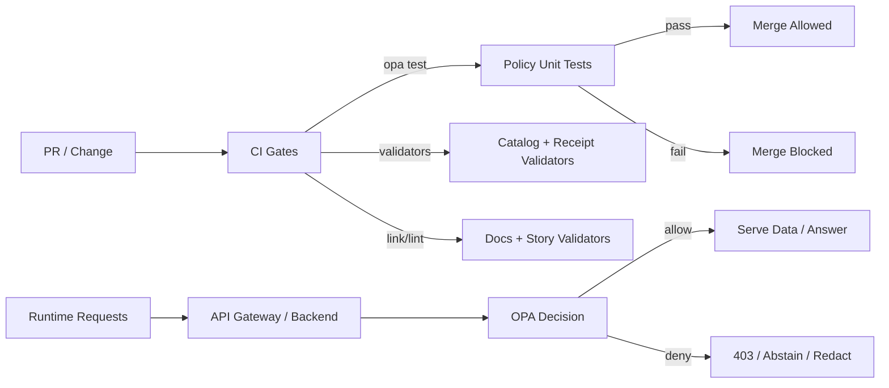

# Policy Test Suite (OPA/Rego)

This directory documents **how KFM policy is tested** (locally and in CI) and how to add/maintain policy test coverage.

KFM’s governance model is **fail‑closed**: if policy cannot be evaluated (missing bundle, bad input, missing evidence), the system must deny access/promotion rather than “best-effort allow.”

---

## Table of Contents

- [What This Covers](#what-this-covers)
- [How Policy Tests Fit Into KFM](#how-policy-tests-fit-into-kfm)
- [Repository Layout](#repository-layout)
- [Quickstart](#quickstart)
  - [Run the Unit Tests (OPA)](#run-the-unit-tests-opa)
  - [Run Conftest Checks (Optional)](#run-conftest-checks-optional)
- [CI Expectations](#ci-expectations)
- [Policy Surfaces and “Contracts”](#policy-surfaces-and-contracts)
  - [Common Input Shape](#common-input-shape)
  - [Common Decision Shape](#common-decision-shape)
- [Writing Policy Tests](#writing-policy-tests)
  - [Unit Tests (Rego)](#unit-tests-rego)
  - [Regression/Golden Tests](#regressiongolden-tests)
  - [Negative/Safety Tests (Sensitive Data)](#negativesafety-tests-sensitive-data)
- [Fixtures and Test Data Rules](#fixtures-and-test-data-rules)
- [Debugging](#debugging)
- [Pull Request Checklist](#pull-request-checklist)
- [FAQ](#faq)

---

## What This Covers

Policy tests in KFM exist to ensure:

- **Default deny** remains true everywhere, always.
- **Dataset promotion** is blocked unless required governance artifacts are present and valid.
- **Story Nodes and Focus Mode** obey “cite or abstain” constraints.
- **Sensitive records** are never leaked (including by accident or regression).
- **Audit integrity** requirements are enforced (e.g., an `audit_ref` must be produced for governed outputs).

If a policy rule changes behavior, the tests in this suite should make that change **explicit, reviewed, and merge-blocking**.

---

## How Policy Tests Fit Into KFM

Policy is the enforcement layer for the **trust membrane**. The UI and external clients must never bypass it.



Two complementary styles exist:

1. **OPA unit tests** (fast, deterministic) — validate Rego logic directly.
2. **Policy regression cases** (fixtures + golden tests) — keep “past leaks” fixed forever.

---

## Repository Layout

This README lives at `tests/policy/README.md` and documents policy testing end-to-end.

A **recommended** repo layout (adjust if your repo differs):

```text
.
├─ policy/
│  ├─ kfm/
│  │  ├─ ai.rego
│  │  ├─ ai_test.rego
│  │  ├─ promotion.rego
│  │  ├─ promotion_test.rego
│  │  ├─ access.rego
│  │  ├─ access_test.rego
│  │  └─ ...
│  └─ data/
│     ├─ sensitivity_levels.json
│     └─ ...
└─ tests/
   └─ policy/
      ├─ README.md
      ├─ fixtures/
      │  ├─ focus_mode/
      │  │  ├─ allow_with_citations.json
      │  │  ├─ deny_no_citations.json
      │  │  └─ deny_sensitive_not_ok.json
      │  ├─ promotion/
      │  │  ├─ ok_has_stac_dcat_prov.json
      │  │  └─ deny_missing_prov.json
      │  └─ redaction/
      │     └─ sensitive_location_precision.json
      └─ cases/
         └─ README.md
```

Notes:

- **`policy/` is the source of truth.** Policy modules live there and are tested by `opa test`.
- `tests/policy/fixtures/` holds structured JSON/YAML inputs used by unit tests and regression tests.
- `tests/policy/cases/` can hold higher-level “scenario packs” for CI regression.

---

## Quickstart

### Run the Unit Tests (OPA)

From the repository root:

```bash
opa test ./policy -v
```

Useful variants:

```bash
# Only a subpackage
opa test ./policy/kfm -v

# Run a single test file
opa test ./policy/kfm/ai_test.rego -v
```

If you don’t have `opa` installed locally, you can run the same command via Docker:

```bash
docker run --rm -v "$PWD":/work -w /work openpolicyagent/opa:latest \
  test ./policy -v
```

> ⚠️ **Recommended practice:** pin the OPA version used in CI (and ideally local tooling) so policy behavior is stable.

### Run Conftest Checks (Optional)

KFM often uses Conftest as a “policy harness” to test Rego against JSON/YAML artifacts (manifests, catalogs, etc.).

Example pattern:

```bash
conftest test \
  --policy ./policy \
  ./tests/policy/fixtures
```

If you standardize fixture structure, this becomes a quick way to confirm real artifacts still satisfy governance rules.

---

## CI Expectations

Policy tests should be **merge-blocking**.

A minimal CI job should run at least:

```bash
opa test ./policy -v
```

If you use Conftest regression tests, add them as a separate CI step (or include them in the `opa test` inputs via data files).

---

## Policy Surfaces and Contracts

KFM policy is typically evaluated in these contexts:

| Surface | Example decision | Failure mode | Test type |
|---|---|---|---|
| API access (roles/scopes) | allow/deny dataset/layer/story access | deny | unit + regression |
| Dataset promotion | allow promotion from work → processed | deny + explain | unit + conftest |
| Story Node publishing | allow publish only if citations resolve | deny | unit + validator integration |
| Focus Mode output | allow only if citations present AND sensitivity OK | abstain/deny | unit + gold regression |
| Redaction rules | return “generalized” output for sensitive locations | redact | regression |

### Common Input Shape

Use a **stable input schema** so policy is testable and the API boundary is well-defined. A common KFM shape is:

```json
{
  "actor": {
    "role": "public|reviewer|admin",
    "attributes": {}
  },
  "request": {
    "endpoint": "/api/v1/...",
    "context": {}
  },
  "resource": {
    "kind": "dataset|layer|story|ai_answer",
    "id": "...",
    "labels": {
      "sensitivity": "public|restricted|sensitive-location|aggregate-only"
    }
  },
  "answer": {
    "text": "...",
    "has_citations": true,
    "citations": [{"ref": "prov://..."}],
    "sensitivity_ok": true
  }
}
```

You can omit fields that do not apply to a surface, but keep naming consistent across the repo.

### Common Decision Shape

Policies should return a decision object that is easy to audit and test:

```json
{
  "allow": false,
  "reason": "missing_citations",
  "obligations": [
    {"kind": "abstain", "message": "No verified evidence available."}
  ]
}
```

Recommended conventions:

- `allow` must exist and default to `false`.
- `reason` should be a stable identifier suitable for metrics (e.g., `policy_denied_total{reason=...}`).
- `obligations` is where you describe required follow-up (abstain, redact, add audit event, etc.).

---

## Writing Policy Tests

### Unit Tests (Rego)

**Rule of thumb:** every non-trivial policy file must have a corresponding `*_test.rego`.

Example (minimal):

```rego
package kfm.ai

default allow := false

allow if {
  input.answer.has_citations == true
  input.answer.sensitivity_ok == true
}
```

Unit tests:

```rego
package kfm.ai

import future.keywords.if

test_allow_when_citations_and_sensitivity_ok if {
  allow with input as {
    "answer": {"has_citations": true, "sensitivity_ok": true, "citations": [{"id": "c1"}]}
  }
}

test_deny_when_missing_citations if {
  not allow with input as {
    "answer": {"has_citations": false, "sensitivity_ok": true, "citations": []}
  }
}

test_deny_when_sensitivity_not_ok if {
  not allow with input as {
    "answer": {"has_citations": true, "sensitivity_ok": false, "citations": [{"id": "c1"}]}
  }
}
```

### Regression/Golden Tests

Regression tests are for “this must never happen again” cases.

Patterns that should always have regression coverage:

- A previous **sensitive field leak** (owner name, exact site coordinates, small-count health data).
- A previous **Focus Mode citation failure** that produced an uncited factual answer.
- A previous **promotion bypass** that allowed publishing without PROV/DCAT/STAC artifacts.

Recommended approach:

1. Add a fixture input under `tests/policy/fixtures/<surface>/...`.
2. Add a unit test that evaluates the relevant rule with that fixture.
3. Keep the fixture **byte-stable** (do not rewrite historical fixtures unless you are intentionally changing requirements).

### Negative/Safety Tests (Sensitive Data)

At minimum, keep negative tests for:

- **Sensitive-location**: unauthorized callers must never receive high-precision coordinates.
- **Restricted**: field-level PII must be redacted or denied unless caller has explicit grants.
- **Aggregate-only**: small counts must be suppressed or thresholded.

If you add a new sensitivity class or new redaction rule, add:

- one allow test (authorized or generalized output)
- one deny test (unauthorized or too-precise output)
- one regression fixture

---

## Fixtures and Test Data Rules

Because policy tests can easily become a data-leak vector, fixtures must be treated as governed artifacts.

Rules:

- ✅ Prefer **synthetic** data.
- ✅ If you must use real data, strip PII and coordinates; keep only what is necessary to test semantics.
- ✅ Do not include secrets, tokens, API keys, or private endpoints.
- ✅ Use obviously fake identifiers for restricted entities (e.g., `parcel_id: "FAKE-123"`).
- ✅ If a fixture encodes a previously discovered leak, describe it in a short comment near the test.

---

## Debugging

When a test fails:

```bash
# Run with verbose output
opa test ./policy -v

# Evaluate a specific expression interactively
opa eval -d ./policy -I \
  'data.kfm.ai.allow' \
  --input ./tests/policy/fixtures/focus_mode/allow_with_citations.json
```

Helpful workflow:

1. Identify which package/rule failed.
2. Evaluate the rule with the fixture using `opa eval`.
3. Print intermediate rules (create temporary helper rules or use `trace()` if needed).
4. Update the policy and tests together.

---

## Pull Request Checklist

Policy changes are **behavior changes**. Use this checklist before requesting review:

- [ ] I ran `opa test ./policy -v` locally.
- [ ] Any new/changed rule has unit tests.
- [ ] Any security-sensitive change has a regression fixture.
- [ ] Default deny behavior still holds.
- [ ] Focus Mode outputs are **cite-or-abstain** (no uncited factual answers).
- [ ] Sensitive-location / restricted / aggregate-only rules were validated with negative tests.
- [ ] If this change affects publishing/promotion, I verified the promotion gate behavior.

---

## FAQ

### Why do we prefer OPA unit tests over “manual review” for policy?

Because policy is a **merge gate**. If humans are the only enforcement mechanism, the system will drift.

### What if policy needs to redact rather than deny?

Return an `obligations` entry (e.g., `{kind:"redact", fields:[...], precision:"1km"}`) and test that obligations are present.

### What if an endpoint cannot provide evidence for a Focus Mode answer?

The policy should require abstention in that case. Add a regression test that ensures an uncited answer is denied.

