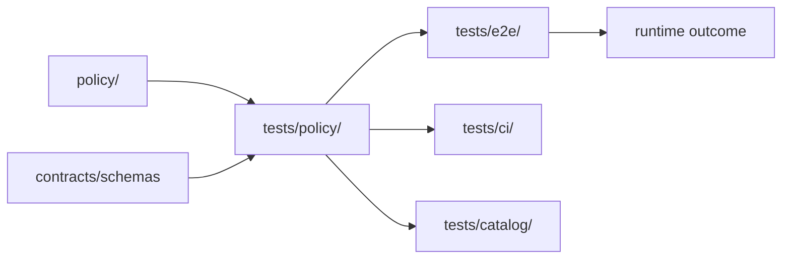

<!-- [KFM_META_BLOCK_V2]
doc_id: kfm://doc/NEEDS_VERIFICATION
title: tests/policy
type: standard
version: v1
status: draft
owners: @bartytime4life
created: NEEDS_VERIFICATION
updated: 2026-04-14
policy_label: public
related: [
  ../README.md,
  ../catalog/README.md,
  ../ci/README.md,
  ../contracts/README.md,
  ../e2e/README.md,
  ../integration/README.md,
  ../reproducibility/README.md,
  ../accessibility/README.md,
  ./genealogy/README.md,
  ../../policy/README.md,
  ../../contracts/README.md,
  ../../schemas/README.md,
  ../../.github/README.md,
  ../../.github/workflows/README.md
]
tags: [kfm, tests, policy, verification, deny-by-default]
notes: [
  "Updated to align with the full KFM test-lane model (catalog, ci, contracts, e2e).",
  "Preserves explicit subtree reality: tests/policy/ + genealogy/.",
  "Does not assume executable suites or workflow enforcement without repo evidence."
]
[/KFM_META_BLOCK_V2] -->

<a id="top"></a>

# `tests/policy/`

Repo-facing verification surface for **policy behavior**, **deny-by-default decisions**, and **runtime-visible trust outcomes** in KFM.

> **Status:** experimental  
> **Owners:** `@bartytime4life`  
> **Path:** `tests/policy/README.md`  
> **Quick jump:** [Scope](#scope) · [Repo fit](#repo-fit) · [Inputs](#accepted-inputs) · [Exclusions](#exclusions) · [Snapshot](#current-verified-snapshot) · [Usage](#usage) · [Diagram](#diagram) · [Tables](#tables) · [Task list](#task-list--definition-of-done)

---

## Scope

`tests/policy/` is where KFM proves:

> **policy decisions behave correctly when applied to real inputs**

This is **behavior verification**, not:

- policy definition  
- schema validation  
- helper logic  
- workflow orchestration  

### This lane proves:

- allow / deny / abstain / review outcomes
- reason code + obligation handling
- runtime outcome consistency
- correction-aware policy behavior
- domain-sensitive fail-closed logic

### This lane does NOT prove:

- how policy is authored (`policy/`)
- object shape (`tests/contracts/`)
- helper correctness (`tests/ci/`, `tests/catalog/`)
- whole-path execution (`tests/e2e/`)

---

## Repo fit

| Surface | Role |
|--------|------|
| `tests/` | governed verification surface |
| `tests/policy/` | policy behavior proof |
| `tests/policy/genealogy/` | domain-specific policy lane |
| `policy/` | policy law + bundles |
| `contracts/` / `schemas/` | object shape authority |
| `tests/e2e/` | whole-path trust proof |
| `.github/workflows/` | orchestration boundary |

### Key rule

| Layer | Owns what |
|------|----------|
| `policy/` | decision logic |
| `tests/policy/` | decision behavior |
| `tests/e2e/` | decision consequences |

---

## Current verified snapshot

From the current repo surface:

```text
tests/policy/
├── README.md
└── genealogy/
    └── README.md
```

### CONFIRMED

- policy test family exists
- genealogy sub-lane exists
- parent `tests/README.md` recognizes policy family
- CODEOWNERS assigns `/tests/` to `@bartytime4life`

### NOT PROVEN

- runnable test suites
- policy bundles mounted in repo
- merge-blocking workflow enforcement
- fixture inventory
- runtime wiring

---

## Accepted inputs

### What belongs here

| Type | Examples |
|------|---------|
| Policy outcome fixtures | allow / deny / restrict |
| Runtime outcome expectations | ANSWER / ABSTAIN / DENY / ERROR |
| DecisionEnvelope assertions | reason + obligation correctness |
| Correction behavior | withdrawn / superseded |
| Domain policy cases | genealogy, consent, sensitive data |

---

## Exclusions

| Does NOT belong | Goes to |
|----------------|--------|
| policy bundles | `policy/` |
| schemas | `contracts/` / `schemas/` |
| helper tests | `tests/ci/`, `tests/catalog/` |
| runtime orchestration | `tests/e2e/` |
| integration seams | `tests/integration/` |

---

## Usage

### When to use this lane

Use `tests/policy/` when:

- you are testing **decision correctness**
- not structure
- not execution
- not rendering

---

### Decision verification pattern

```yaml
input:
  actor_role: public
  sensitivity_class: public
  action: answer

expected:
  policy_result: allow
  runtime_outcome: ANSWER
  obligations:
    - REQUIRE_CITATION
```

---

### Required negative path

Every case must include at least one:

```yaml
expected:
  policy_result: deny
  reason_codes:
    - SENSITIVE_DATA
```

---

## Diagram


```mermaid
flowchart LR
    P[policy/] --> TP[tests/policy/]
    TP --> E2E[tests/e2e/]

    C[contracts/schemas] --> TP
    TP --> CI[tests/ci/]
    TP --> CAT[tests/catalog/]

    E2E --> OUT[runtime outcome]
```

---

## Tables

### Policy result grammar

| Result | Meaning |
|--------|--------|
| allow | safe to proceed |
| deny | blocked |
| generalize | allowed with transformation |
| restrict | allowed with limited scope |
| needs-review | human required |
| withdrawn | removed after release |
| superseded | replaced |

---

### Runtime outcomes

| Outcome | Meaning |
|--------|--------|
| ANSWER | full response |
| ABSTAIN | insufficient evidence |
| DENY | policy block |
| ERROR | system failure |

---

### What this lane must prove

| Concern | Requirement |
|--------|------------|
| determinism | same input → same result |
| fail-closed | invalid → deny |
| traceability | reason codes visible |
| parity | CI == runtime |
| visibility | correction state preserved |

---

## Task list / definition of done

- [ ] subtree verified against branch
- [ ] genealogy leaf acknowledged
- [ ] no overclaiming of runtime or CI
- [ ] negative path present
- [ ] reason codes asserted
- [ ] runtime outcome asserted
- [ ] correction behavior covered
- [ ] aligned with `tests/e2e/`
- [ ] aligned with `policy/`
- [ ] aligned with `contracts/`

---

## FAQ

### Does this lane define policy?

No.

It verifies behavior.

---

### Does this lane prove runtime?

No.

That is `tests/e2e/`.

---

### Why separate from `tests/contracts/`?

Because:

- contracts = shape  
- policy = meaning  

---

### Why separate from `tests/catalog/`?

Because:

- catalog = metadata closure  
- policy = decision semantics  

---

### What is the most important rule?

> Policy must fail closed and stay visible.

---

## Appendix

### Trust objects used here

- `DecisionEnvelope`
- `RuntimeResponseEnvelope`
- `EvidenceBundle`
- `CorrectionNotice`
- `ReleaseManifest`

---

### Rule of thumb

If the question is:

- **"Is this object valid?" → contracts**
- **"Is this decision correct?" → policy**
- **"Does this system behave end-to-end?" → e2e**

---

[Back to top](#top)
