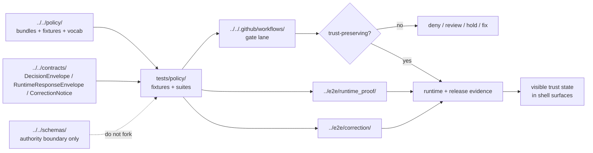

<!-- [KFM_META_BLOCK_V2]
doc_id: kfm://doc/<TODO_VERIFY_UUID>
title: tests/policy
type: standard
version: v1
status: draft
owners: @bartytime4life
created: <TODO_VERIFY_YYYY-MM-DD>
updated: <TODO_VERIFY_YYYY-MM-DD>
policy_label: <TODO_VERIFY_POLICY_LABEL>
related: [tests/README.md, policy/README.md, contracts/README.md, schemas/README.md, .github/workflows/README.md]
tags: [kfm]
notes: [owners grounded from current CODEOWNERS; doc_id/created/updated/policy_label need repo-backed verification; current public main shows tests/policy/README.md only]
[/KFM_META_BLOCK_V2] -->

# tests/policy

Focused policy-behavior verification lane for KFM deny-by-default decisions, runtime outcomes, and correction-visible trust states.

> **Status:** `experimental`
> **Owners:** `@bartytime4life`
> **Path:** `tests/policy/README.md`
> **Repo fit:** narrow policy-verification boundary inside `tests/`; upstream from [`../README.md`](../README.md), laterally coupled to [`../../policy/README.md`](../../policy/README.md), [`../../contracts/README.md`](../../contracts/README.md), and [`../../schemas/README.md`](../../schemas/README.md), and gate-adjacent to [`../../.github/workflows/README.md`](../../.github/workflows/README.md)
> **Quick jump:** [Scope](#scope) · [Repo fit](#repo-fit) · [Accepted inputs](#accepted-inputs) · [Exclusions](#exclusions) · [Current verified snapshot](#current-verified-snapshot) · [Directory tree](#directory-tree) · [Quickstart](#quickstart) · [Usage](#usage) · [Diagram](#diagram) · [Tables](#tables) · [Task list](#task-list--definition-of-done) · [FAQ](#faq) · [Appendix](#appendix)


> [!IMPORTANT]
> Keep **current public-branch evidence** separate from **doctrine-aligned target shape**.
> The strongest current repo-grounded claim is that `tests/policy/` exists and public `main` shows `README.md` only.
> This file should document the lane honestly without implying runnable suites, checked-in workflow YAML, or mounted policy bundles that the current branch does not prove.

---

## Scope

`tests/policy/` is the smallest repo-facing surface dedicated to proving that KFM policy remains operational under pressure.

Use this lane to answer questions such as:

- do policy-facing tests prove stable `allow`, `deny`, `generalize`, `restrict`, and review-bearing behavior?
- do request-time outcomes stay finite and inspectable instead of drifting into ambiguous prose?
- do correction-bearing states remain visible after release?
- do CI-facing policy checks and runtime-facing policy outcomes stay semantically aligned?

This is narrower than the whole `tests/` tree and narrower than the executable `policy/` tree. It is the boundary where **policy behavior becomes test evidence**.

### Evidence labels used here

| Label | Meaning in this README |
|---|---|
| **CONFIRMED** | Directly visible on the current public repo surface, or strongly anchored in the attached March 2026 KFM doctrine |
| **INFERRED** | Strongly suggested by adjacent repo docs or repeated doctrine, but not re-proven from a mounted checkout in this session |
| **PROPOSED** | Commit-ready structure or practice that fits KFM doctrine but is not asserted as current repo reality |
| **UNKNOWN** | Not supported strongly enough here to present as current branch fact |
| **NEEDS VERIFICATION** | Placeholder, path, or implementation detail that should be checked against the active checkout before merge |

### Working rule

`tests/policy/` should stay **small, explicit, and behavior-centered**.  
If a change mostly defines policy law, put it under `../../policy/`.  
If a change mostly defines canonical shape, put it under `../../contracts/`.  
If a change proves policy behavior against fixtures, routes, envelopes, or surface states, it belongs here.

[Back to top](#testspolicy)

## Repo fit

**Path:** `tests/policy/README.md`  
**Role in repo:** directory-level contract for policy-behavior verification.

### Upstream, lateral, and downstream links

| Direction | Surface | Why it matters |
|---|---|---|
| Upstream | [`../README.md`](../README.md) | Defines the broader `tests/` taxonomy and where policy tests fit relative to contract, integration, e2e, accessibility, and reproducibility families |
| Lateral | [`../../policy/README.md`](../../policy/README.md) | Owns executable policy bundles, policy fixtures, result grammar, and policy-lane doctrine |
| Lateral | [`../../contracts/README.md`](../../contracts/README.md) | Owns trust-bearing contract families such as `DecisionEnvelope`, `RuntimeResponseEnvelope`, and `CorrectionNotice` |
| Lateral | [`../../schemas/README.md`](../../schemas/README.md) | Keeps schema-home ambiguity visible and warns against growing a second authoritative registry |
| Downstream | [`../e2e/runtime_proof/`](../e2e/runtime_proof/) | End-to-end proof lane for request-time outcomes and evidence/runtime behavior |
| Downstream | [`../e2e/correction/`](../e2e/correction/) | End-to-end correction, supersession, rollback, and stale-visible drills |
| Gate-adjacent | [`../../.github/workflows/README.md`](../../.github/workflows/README.md) | Documents current workflow-lane visibility and future merge-gate expectations |

> [!CAUTION]
> Public `main` currently documents `.github/workflows/` as `README.md` only.
> Treat policy-gate references here as **required proof burden**, not as proof that merge-blocking YAML already exists.

[Back to top](#testspolicy)

## Accepted inputs

Content that belongs in `tests/policy/` should be **test-facing**, **execution-oriented**, and **narrowly scoped to policy behavior**.

| Input class | What belongs here | Typical examples |
|---|---|---|
| Policy outcome fixtures | Small positive and negative cases that exercise policy meaning | `allow`, `deny`, `generalize`, `restrict`, `needs-review` cases |
| Runtime outcome parity checks | Cases that prove policy semantics survive into runtime behavior | `ANSWER`, `ABSTAIN`, `DENY`, `ERROR` expectation packs |
| Decision-grammar checks | Tests that pressure stable reason/obligation handling | fixture assertions for `reason_codes`, `obligation_codes`, review-bearing exceptions |
| Correction-state policy drills | Cases where release trust state changes after publication | `withdrawn`, `superseded`, stale-visible, narrowed-visibility cases |
| CI/runtime parity notes | Tiny directory-local documentation that clarifies what the lane proves | short README fragments, fixture intent notes, review-facing test notes |

### Minimum bar for anything added here

- It proves behavior, not merely directory aesthetics.
- It names the seam being exercised: release, runtime, correction, review, or transform.
- It points back to shared contracts or vocab ownership instead of redefining them.
- It includes at least one **negative** case where failure is the trust-preserving result.
- It does not silently assume a particular runner or workflow until the active branch proves one.

## Exclusions

The following do **not** belong here as authoritative source-of-truth material:

| Does not belong here | Put it here instead | Why |
|---|---|---|
| Executable policy bundles or `.rego` source | [`../../policy/`](../../policy/) | Bundle law and test evidence are adjacent but not the same artifact |
| Canonical JSON Schema / OpenAPI / shared vocab definitions | [`../../contracts/`](../../contracts/) | Tests should consume shared contracts, not fork them |
| Documentary schema-home guidance | [`../../schemas/README.md`](../../schemas/README.md) | That lane owns the authority boundary for `schemas/` |
| Runtime bundle loaders, adapters, or request mediators | runtime package seam such as `packages/policy-runtime/` **if verified** | Execution glue is not the same thing as test evidence |
| API handlers, workers, or UI components | app or package boundary | Policy verification should not become shadow implementation |
| Release manifests, proof packs, or promoted artifacts as primary record | release / proof / e2e surfaces | This lane may test them, but does not authoritatively own them |
| Broad accessibility or full-shell screenshot suites | sibling `tests/accessibility/` or `tests/e2e/` lanes | Keep this directory focused on policy-behavior proof |

[Back to top](#testspolicy)

## Current verified snapshot

The strongest safe current-branch claim is still intentionally small:

- `tests/policy/` exists as a real directory.
- the public directory listing shows `README.md` only
- the current file content is still scaffold-level
- the parent `tests/README.md` already treats `./policy/` as the policy and governance behavior family
- exact runnable suite depth, runner/toolchain, and merge-blocking enforcement remain **UNKNOWN** from current public-tree evidence alone

> [!NOTE]
> This README is meant to close the gap between a visible directory boundary and a usable directory contract.
> It should not close that gap by pretending executable depth already exists.

## Directory tree

### Current verified snapshot (**CONFIRMED**)

```text
tests/
└── policy/
    └── README.md
```

### Doctrine-aligned target shape (**PROPOSED**)

```text
tests/
└── policy/
    ├── README.md
    ├── fixtures/
    └── suites/
```

### Outcome-oriented subshape (**PROPOSED**, non-binding starter)

```text
tests/
└── policy/
    ├── fixtures/
    │   ├── allow/
    │   ├── deny/
    │   ├── generalize/
    │   ├── restrict/
    │   ├── needs-review/
    │   └── correction/
    └── suites/
        ├── decision-grammar/
        ├── runtime-outcomes/
        └── ci-runtime-parity/
```

> [!TIP]
> Keep the tree above **illustrative, not mandatory**.
> The important part is the seam it makes visible:
> small fixtures, explicit negative paths, and one obvious place to prove policy behavior without duplicating contracts or bundles.

[Back to top](#testspolicy)

## Quickstart

### 1) Inspect the lane exactly as it exists

```bash
find tests/policy -maxdepth 4 -type f 2>/dev/null | sort
find tests/policy -maxdepth 4 -type d 2>/dev/null | sort
```

### 2) Inspect adjacent policy / contract / schema / workflow surfaces

```bash
find policy contracts schemas .github/workflows tests -maxdepth 4 -type f 2>/dev/null | sort
```

### 3) Check whether executable policy artifacts actually exist

```bash
find . -type f \
  \( -name '*.rego' -o -name '*policy*' -o -name '*reason*' -o -name '*obligation*' \) \
  | sort
```

### 4) Trace trust-bearing object names across repo surfaces

```bash
grep -RInE \
  'DecisionEnvelope|ReviewRecord|ReleaseManifest|ReleaseProofPack|EvidenceBundle|RuntimeResponseEnvelope|CorrectionNotice|reason_codes|obligation_codes|rights_class|sensitivity_class' \
  policy contracts schemas tests docs apps packages 2>/dev/null || true
```

### 5) Inspect visible workflow-lane contents before claiming merge-gate coverage

```bash
find .github/workflows -maxdepth 2 -type f 2>/dev/null | sort
```

### 6) Sanity-check runtime outcome grammar

```bash
grep -RInE \
  'ANSWER|ABSTAIN|DENY|ERROR|allow|deny|generalize|restrict|needs-review|STEWARD_REVIEW|withdrawn|superseded' \
  policy tests contracts docs apps packages 2>/dev/null || true
```

> [!CAUTION]
> These commands are discovery tools.
> They prove what is present, not whether the active branch already enforces the full KFM trust model.

[Back to top](#testspolicy)

## Usage

### Add a policy-behavior test

1. Start with the seam, not the filename:
   - release / review
   - runtime ask
   - generalization / restriction
   - correction / supersession
2. Decide whether the change belongs here or in `../../policy/` or `../../contracts/`.
3. Add at least one **happy path** and one **negative path**.
4. Prove the same meaning survives into downstream trust objects such as:
   - `DecisionEnvelope`
   - `ReviewRecord`
   - `RuntimeResponseEnvelope`
   - `CorrectionNotice`
5. Keep the result reviewable from the README alone.

### Prefer explicit outcome pairing

| If you are proving… | Pair it with… |
|---|---|
| `allow` | named obligations and downstream evidence/runtime expectation |
| `deny` | stable reason code and calm refusal expectation |
| `generalize` | visible transform consequence and receipt/reference expectation |
| `restrict` | narrower actor/surface mode and no silent public fallback |
| `needs-review` / `STEWARD_REVIEW` | explicit steward routing or review-bearing result |
| `withdrawn` / `superseded` | correction linkage and visible downstream state change |

### Illustrative starter fixture (**PROPOSED example**)

```yaml
name: public_focus_answer_allowed_when_release_is_public_safe
input:
  actor_role: public
  surface_class: focus
  action: answer
  release_id: rel.example.public.v1
  rights_class: open
  sensitivity_class: public
expected:
  policy_result: allow
  reason_codes:
    - PUBLIC_SAFE
  obligation_codes:
    - REQUIRE_CITATION
    - RECORD_AUDIT
  runtime_outcome: ANSWER
```

Use the example above as a shape starter only.  
It is **not** proof that the mounted repo already emits this exact payload.

### Keep CI/runtime parity visible

A strong `tests/policy/` lane should help answer:

- does CI prove the same decision grammar runtime is expected to honor?
- do runtime envelopes stop at `ANSWER`, `ABSTAIN`, `DENY`, or `ERROR`?
- does correction remain visible instead of being hidden behind a later deploy?
- does denial stay explicit when rights or sensitivity are unresolved?

[Back to top](#testspolicy)

## Diagram


```mermaid
flowchart LR
  PB["../../policy/<br/>bundles + fixtures + vocab"] --> TP["tests/policy/<br/>fixtures + suites"]
  C["../../contracts/<br/>DecisionEnvelope / RuntimeResponseEnvelope / CorrectionNotice"] --> TP
  S["../../schemas/<br/>authority boundary only"] -. do not fork .-> TP
  TP --> W["../../.github/workflows/<br/>gate lane"]
  TP --> RT["../e2e/runtime_proof/"]
  TP --> CO["../e2e/correction/"]
  W --> D{"trust-preserving?"}
  D -->|no| N["deny / review / hold / fix"]
  D -->|yes| R["runtime + release evidence"]
  RT --> R
  CO --> R
  R --> V["visible trust state<br/>in shell surfaces"]
```

Above: this lane sits between **policy law**, **contract shape**, **gate execution**, and **visible outcomes**.  
It should never become a second policy tree or a shadow schema registry.

[Back to top](#testspolicy)

## Tables

### What this lane should prove

| Policy seam | Minimum thing to prove here | Companion trust objects |
|---|---|---|
| Decision grammar | stable result + reason/obligation meaning | `DecisionEnvelope` |
| Runtime outcome parity | no uncited fifth outcome; explicit finite result | `RuntimeResponseEnvelope` |
| Review-bearing cases | machine gate routes ambiguous cases visibly | `ReviewRecord`, `DecisionEnvelope` |
| Generalization / restriction | transform or narrowing is explicit, not silent | `DecisionEnvelope`, `EvidenceBundle` |
| Correction visibility | withdrawal/supersession survives after release | `CorrectionNotice`, downstream runtime/surface state |
| CI/runtime parity | the same semantics survive both PR-time and request-time checks | workflow gate + runtime envelope evidence |

### Policy result grammar to pressure-test

| Result / state | Meaning | What a good test should assert |
|---|---|---|
| `allow` | request or release is policy-safe as scoped | obligations are present and downstream behavior continues visibly |
| `deny` | policy blocks the action | stable reason and no quiet fallback |
| `generalize` | exposure is allowed only after masking / aggregation / reduction | transformed state is visible and linked |
| `restrict` | surface narrows to actor, role, or mode | public path does not quietly inherit privileged view |
| `needs-review` / `STEWARD_REVIEW` | machine gate cannot safely finish alone | review routing is explicit and auditable |
| `withdrawn` / `superseded` | trust state changed after release | lineage remains visible after change |

### Runtime outcomes to pressure-test

| Outcome | Meaning | Minimum expectation |
|---|---|---|
| `ANSWER` | support is sufficient and policy-safe | evidence and trust cues survive |
| `ABSTAIN` | evidence is weak, stale, partial, conflicted, or unresolved | decline is explicit and inspectable |
| `DENY` | policy blocks the request | refusal is calm, accountable, and not disguised as absence |
| `ERROR` | reliable governed handling failed technically | failure is explicit; no fake policy/evidence success |

### Current evidence versus target maturity

| Concern | Current repo-grounded evidence | Target direction |
|---|---|---|
| Directory presence | `tests/policy/` exists | keep it as the focused policy verification lane |
| README maturity | current file is scaffold-only | replace with a usable directory contract |
| Executable suites | not proven from current public-tree evidence | add fixtures + suites only after inventory confirms real files |
| Workflow enforcement | public `.github/workflows/` shows `README.md` only | wire merge-blocking policy checks after current branch proves them |
| Schema ownership | unresolved between `contracts/` and `schemas/` | keep authoritative machine contracts singular |
| Bundle ownership | executable policy remains owned by `../../policy/` | keep tests here behavior-facing, not bundle-authoring |

[Back to top](#testspolicy)

## Task list / Definition of done

Treat this README as healthy only when it stays both readable and truthful.

- [ ] The active checkout was inspected and this file still matches the real `tests/policy/` inventory.
- [ ] `doc_id`, created date, updated date, and `policy_label` were replaced with repo-backed values.
- [ ] Owner routing was checked against the active `CODEOWNERS`, not only public `main`.
- [ ] This README does not imply runnable suites, `.rego` bundles, or workflow YAML that the branch does not prove.
- [ ] The relationship among `tests/policy/`, `../../policy/`, `../../contracts/`, and `../../schemas/` is still accurate.
- [ ] At least one negative-path example is documented for each seam the directory actually covers.
- [ ] If runtime parity is claimed, `ANSWER / ABSTAIN / DENY / ERROR` behavior is exercised somewhere verifiable.
- [ ] If correction behavior is claimed, `withdrawn` / `superseded` handling is exercised somewhere verifiable.
- [ ] If merge-blocking enforcement is claimed, the exact workflow file(s) and required checks are visible on the active branch.
- [ ] Any proposed subfolders in this README were reconciled against the real tree before merge.

[Back to top](#testspolicy)

## FAQ

### Does this README prove that runnable policy suites already exist?

No. The strongest current public-branch evidence proves the directory and its placeholder README, not executable depth.

### Should `.rego` bundles live here?

No. This lane is for **policy-behavior proof**, not for owning executable policy bundles.

### Should schemas or OpenAPI live here?

No. Shared shape belongs with the contract-authority surface, not in a behavior-test lane.

### Is `OPA/Rego` confirmed here as mounted implementation?

No. It is a doctrine-aligned starter direction elsewhere in the repo documentation, but this file should not harden it into fact unless the active branch proves it.

### Why keep this directory separate from `tests/e2e/`?

Because `tests/policy/` is the narrowest place to prove decision grammar, result semantics, and CI/runtime parity without forcing every policy assertion to become a full end-to-end drill.

[Back to top](#testspolicy)

## Appendix

<details>
<summary>Search seeds and trust objects</summary>

### Safe grep seeds

```text
DecisionEnvelope
ReviewRecord
ReleaseManifest
ReleaseProofPack
EvidenceBundle
RuntimeResponseEnvelope
CorrectionNotice
reason_codes
obligation_codes
rights_class
sensitivity_class
ANSWER
ABSTAIN
DENY
ERROR
allow
deny
generalize
restrict
needs-review
STEWARD_REVIEW
withdrawn
superseded
```

### Trust-bearing objects this lane will most often touch

| Object | Why it matters to `tests/policy/` |
|---|---|
| `DecisionEnvelope` | primary machine-readable policy result |
| `ReviewRecord` | proves review-bearing exceptions stay explicit |
| `ReleaseManifest` / `ReleaseProofPack` | proves policy meaning survives promotion |
| `EvidenceBundle` | proves downstream evidence state remains visible |
| `RuntimeResponseEnvelope` | proves request-time outcomes stay finite and inspectable |
| `CorrectionNotice` | proves post-release change preserves lineage |

### Reading rule

Prefer the **current repo’s visible names** over manual shorthand.  
Prefer **manual burden language** over folder aesthetics.

</details>

[Back to top](#testspolicy)
