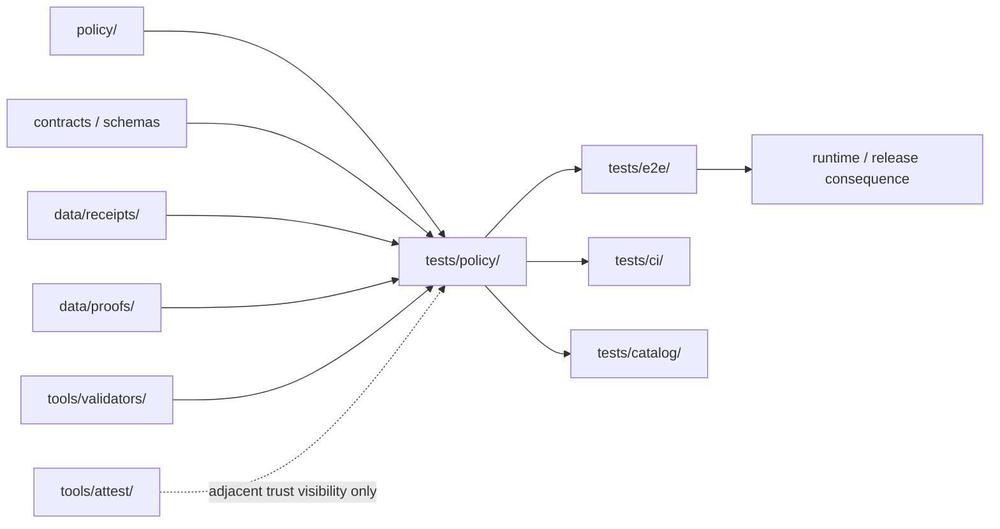

<!-- [KFM_META_BLOCK_V2]
doc_id: kfm://doc/NEEDS_VERIFICATION
title: tests/policy
type: standard
version: v1
status: draft
owners: @bartytime4life
created: NEEDS_VERIFICATION
updated: 2026-04-16
policy_label: public
related: [
  ../README.md,
  ../catalog/README.md,
  ../ci/README.md,
  ../contracts/README.md,
  ../e2e/README.md,
  ../integration/README.md,
  ../reproducibility/README.md,
  ../accessibility/README.md,
  ./genealogy/README.md,
  ../../policy/README.md,
  ../../contracts/README.md,
  ../../schemas/README.md,
  ../../data/receipts/README.md,
  ../../data/proofs/README.md,
  ../../tools/validators/README.md,
  ../../tools/validators/promotion_gate/README.md,
  ../../tools/attest/README.md,
  ../../.github/README.md,
  ../../.github/CODEOWNERS,
  ../../.github/workflows/README.md,
  ../../.github/watchers/README.md
]
tags: [kfm, tests, policy, verification, deny-by-default, runtime-outcomes, receipts, proofs]
notes: [
  "Updated to align with the fuller KFM test-lane model and the newer receipt/proof, validator, attestation, workflow, and watcher documentation.",
  "Preserves explicit subtree reality: tests/policy/ plus genealogy/.",
  "Does not assume executable suites, policy bundles, fixture density, or merge-blocking workflow enforcement without direct repo evidence."
]
[/KFM_META_BLOCK_V2] -->

<a id="top"></a>

# `tests/policy/`

Repo-facing verification surface for **policy behavior**, **deny-by-default decisions**, **finite runtime-visible trust outcomes**, and **correction-aware governance** in KFM.

> [!NOTE]
> **Status:** experimental  
> **Owners:** `@bartytime4life`  
> **Path:** `tests/policy/README.md`  
>         
> **Quick jump:** [Scope](#scope) · [Repo fit](#repo-fit) · [Accepted inputs](#accepted-inputs) · [Exclusions](#exclusions) · [Current verified snapshot](#current-verified-snapshot) · [Directory tree](#directory-tree) · [Quickstart](#quickstart) · [Usage](#usage) · [Diagram](#diagram) · [Tables](#tables) · [Task list / definition of done](#task-list--definition-of-done) · [FAQ](#faq) · [Appendix](#appendix)

> [!IMPORTANT]
> `tests/policy/` is where KFM proves **decision behavior**, not where it defines decision law.
>
> - `policy/` owns rule sources, deny-by-default logic, reason and obligation grammar, and policy bundles  
> - `tests/policy/` proves those rules behave correctly over reviewable inputs  
> - `tests/e2e/` proves broader runtime and release consequences  
> - `tests/contracts/` proves object shape  
> - `data/receipts/` and `data/proofs/` remain distinct governed trust surfaces

> [!TIP]
> Keep the KFM trust split visible here:
>
> **policy behavior ≠ contract authority ≠ receipt authority ≠ proof authority**
>
> This lane may exercise cases that include `DecisionEnvelope`, `RuntimeResponseEnvelope`, `EvidenceBundle`, `CorrectionNotice`, `run_receipt`, `ai_receipt`, attestation visibility, or release refs.  
> It should not silently relocate those surfaces into policy-test ownership.

> [!WARNING]
> Current documentary evidence proves the existence of the `tests/policy/` family and its `genealogy/` child lane.  
> It does **not** by itself prove:
>
> - executable test density
> - fixture inventory
> - mounted policy bundles on the active branch
> - merge-blocking workflow enforcement
> - local/CI runner parity
>
> Keep those claims at **UNKNOWN** or **NEEDS VERIFICATION** until the branch proves them directly.

---

## Scope

`tests/policy/` is where KFM proves:

> **policy decisions behave correctly when applied to real, reviewable inputs**

This is **behavior verification**, not:

- policy definition
- schema validation
- helper implementation
- workflow orchestration
- receipt storage
- proof storage
- attestation execution

### This lane proves

- allow / deny / abstain / review / restrict / generalized outcomes where policy law expects them
- reason-code and obligation handling
- finite runtime-outcome consistency
- correction-aware policy behavior
- domain-sensitive fail-closed logic
- negative-path visibility for restricted, ambiguous, or insufficiently supported inputs
- policy behavior over trust-bearing carriers without flattening those carriers into one generic artifact class

### This lane does **not** prove

- how policy is authored → `policy/`
- object shape → `tests/contracts/`
- helper correctness → `tests/ci/`, `tests/catalog/`
- whole-path execution → `tests/e2e/`
- validator or attestation mechanics → `tools/validators/`, `tools/attest/`
- receipt or proof storage rules → `data/receipts/`, `data/proofs/`

### Working question

> **Given a bounded input and declared policy context, does KFM produce the right governed decision, the right visible reasons/obligations, and the right finite outward outcome without silently widening trust?**

### Evidence markers used here

| Marker | Meaning here |
|---|---|
| **CONFIRMED** | Directly supported by visible repo docs, ownership files, or current KFM doctrinal surfaces |
| **INFERRED** | Conservative interpretation of adjacent repo evidence or repeated doctrine |
| **PROPOSED** | Recommended lane shape or practice consistent with the repo’s current direction |
| **UNKNOWN** | Not established strongly enough from the available evidence |
| **NEEDS VERIFICATION** | Branch-specific or platform-specific detail that should be checked before merge |

[Back to top](#top)

---

## Repo fit

`tests/policy/` sits between **policy law** and **runtime / release consequences**.

### Layer map

| Layer | Owns what |
|------|----------|
| `policy/` | decision logic, deny-by-default rules, reason codes, obligations, review semantics |
| `tests/policy/` | decision behavior proof |
| `tests/e2e/` | decision consequences across broader system paths |
| `tests/contracts/` | object shape and valid/invalid contract proof |
| `tools/validators/` | fail-closed consumers of policy, contract, and linkage results |
| `tools/attest/` | sign / verify helpers for higher-order trust objects |
| `data/receipts/` | process memory |
| `data/proofs/` | higher-order trust objects |

### Upstream and adjacent surfaces

| Surface | Role |
|--------|------|
| [`../README.md`](../README.md) | governed verification surface |
| [`../catalog/README.md`](../catalog/README.md) | catalog-helper proof lane kept separate from policy semantics |
| [`../ci/README.md`](../ci/README.md) | renderer-proof lane kept separate from decision correctness |
| [`../contracts/README.md`](../contracts/README.md) | contract-facing proof lane for shape, examples, and linkage carriers |
| [`../e2e/README.md`](../e2e/README.md) | whole-path runtime / release / correction proof |
| [`../integration/README.md`](../integration/README.md) | cross-boundary execution proof |
| [`../reproducibility/README.md`](../reproducibility/README.md) | replay, rerun, digest, and bounded-regression burden |
| [`../accessibility/README.md`](../accessibility/README.md) | trust-visible accessibility burden |
| [`./genealogy/README.md`](./genealogy/README.md) | domain-specific policy child lane |
| [`../../policy/README.md`](../../policy/README.md) | policy law + bundles |
| [`../../contracts/README.md`](../../contracts/README.md) | human-readable contract authority |
| [`../../schemas/README.md`](../../schemas/README.md) | schema boundary and machine-contract adjacency |
| [`../../data/receipts/README.md`](../../data/receipts/README.md) | process-memory boundary |
| [`../../data/proofs/README.md`](../../data/proofs/README.md) | proof boundary |
| [`../../tools/validators/README.md`](../../tools/validators/README.md) | fail-closed validator lane that consumes policy outcomes without owning them |
| [`../../tools/validators/promotion_gate/README.md`](../../tools/validators/promotion_gate/README.md) | release-facing validator that depends on explicit policy and trust-chain behavior |
| [`../../tools/attest/README.md`](../../tools/attest/README.md) | attestation lane that stays separate from policy behavior proof |
| [`../../.github/README.md`](../../.github/README.md) | gatehouse and governance boundary |
| [`../../.github/workflows/README.md`](../../.github/workflows/README.md) | orchestration boundary |
| [`../../.github/watchers/README.md`](../../.github/watchers/README.md) | watcher/receipt boundary |
| [`../../.github/CODEOWNERS`](../../.github/CODEOWNERS) | owner map |

### Working rule

Use `tests/policy/` when the main burden is:

- **decision correctness**
- **reason / obligation visibility**
- **finite outcome consistency**
- **deny-by-default behavior under ambiguity**
- **correction-aware policy state**

Do **not** use `tests/policy/` when the main burden is:

- shape correctness
- renderer correctness
- helper implementation correctness
- catalog closure correctness
- whole-path runtime or release orchestration
- receipt/proof storage behavior

[Back to top](#top)

---

## Accepted inputs

### What belongs here

| Type | Examples |
|------|---------|
| Policy outcome fixtures | `allow`, `deny`, `abstain`, `restrict`, `needs-review`, `withdrawn`, `superseded` |
| Runtime outcome expectations | `ANSWER`, `ABSTAIN`, `DENY`, `ERROR` |
| `DecisionEnvelope` assertions | reason + obligation correctness |
| Correction behavior | `withdrawn`, `superseded`, correction-visible state |
| Domain policy cases | genealogy, consent, living-person, DNA, provenance, sensitive data |
| Trust-bearing input carriers | `RuntimeResponseEnvelope`, `EvidenceBundle`, `CorrectionNotice`, `ReleaseManifest` where policy behavior depends on them |
| Receipt / proof refs when policy behavior depends on them | `run_receipt`, `ai_receipt`, `receipt_ref`, `proof_ref`, attestation visibility refs |
| Negative-path fixtures | missing reason codes, missing obligations, invalid review state, unresolved sensitive class, unsupported action |

### Input rules

1. Inputs should be explicit and reviewable.
2. Negative-path fixtures are first-class, not optional garnish.
3. If a case depends on a receipt or proof ref, keep that role explicit instead of burying it in a generic fixture blob.
4. If the policy burden is domain-specific, keep the parent lane lean and push domain detail into the child lane where possible.
5. Prefer tiny synthetic fixtures over copied production payloads.
6. Keep runtime outcomes and policy outcomes visibly distinct even when they are related.

[Back to top](#top)

---

## Exclusions

| Does NOT belong | Goes to |
|----------------|--------|
| policy bundles | [`../../policy/README.md`](../../policy/README.md) |
| schemas | [`../../contracts/README.md`](../../contracts/README.md) / [`../../schemas/README.md`](../../schemas/README.md) |
| helper tests | [`../ci/README.md`](../ci/README.md), [`../catalog/README.md`](../catalog/README.md) |
| runtime orchestration | [`../e2e/README.md`](../e2e/README.md) |
| integration seams | [`../integration/README.md`](../integration/README.md) |
| reproducibility checks | [`../reproducibility/README.md`](../reproducibility/README.md) |
| receipt storage | [`../../data/receipts/README.md`](../../data/receipts/README.md) |
| proof storage | [`../../data/proofs/README.md`](../../data/proofs/README.md) |
| validator or attestation implementation | [`../../tools/validators/README.md`](../../tools/validators/README.md), [`../../tools/attest/README.md`](../../tools/attest/README.md) |
| workflow sequencing / merge gates | [`../../.github/workflows/README.md`](../../.github/workflows/README.md) |

> [!IMPORTANT]
> A policy test may reference receipts, proofs, envelopes, or review refs.  
> That does **not** make this lane their authority or storage surface.

[Back to top](#top)

---

## Current verified snapshot

From the current repo-facing surface:

```text
tests/policy/
├── README.md
└── genealogy/
    └── README.md
```

### CONFIRMED

- policy test family exists
- genealogy sub-lane exists
- parent `tests/README.md` recognizes the policy family
- `tests/policy/genealogy/README.md` is a visible child lane
- `CODEOWNERS` assigns `/tests/` to `@bartytime4life`
- adjacent docs now explicitly distinguish receipts from proofs and validators from attestation helpers

### NOT PROVEN

- runnable test suites
- mounted policy bundles on the active branch
- merge-blocking workflow enforcement
- fixture inventory
- runtime wiring
- local/CI parity
- branch-specific receipt/proof-policy cases

> [!NOTE]
> The lane contract is stronger than the currently proven executable depth.
> Keep that distinction visible.

[Back to top](#top)

---

## Directory tree

### Current documented subtree

```text
tests/policy/
├── README.md
└── genealogy/
    └── README.md
```

### `PROPOSED` maturity shape

```text
tests/policy/
├── README.md
├── fixtures/
│   ├── allow/
│   ├── deny/
│   ├── abstain/
│   ├── review/
│   ├── correction/
│   └── trust_chain/
├── test_policy_outcomes.py
├── test_runtime_outcome_parity.py
├── test_reason_and_obligation_visibility.py
└── genealogy/
    ├── README.md
    ├── fixtures/
    └── test_genealogy_policy.py
```

### Reading rule

Use the first tree for **current documented truth**.  
Use the second tree as **target-shape guidance**, not as a claim about the active branch.

[Back to top](#top)

---

## Quickstart

### 1) Confirm what actually exists in your checkout

```bash
find tests/policy -maxdepth 4 -print 2>/dev/null | sort
find policy -maxdepth 4 -print 2>/dev/null | sort
```

### 2) Re-read parent and adjacent lane contracts

```bash
sed -n '1,260p' tests/README.md 2>/dev/null
sed -n '1,260p' tests/policy/README.md 2>/dev/null
sed -n '1,260p' tests/policy/genealogy/README.md 2>/dev/null
sed -n '1,260p' policy/README.md 2>/dev/null
sed -n '1,260p' tests/contracts/README.md 2>/dev/null
sed -n '1,260p' tests/e2e/README.md 2>/dev/null
sed -n '1,260p' data/receipts/README.md 2>/dev/null
sed -n '1,260p' data/proofs/README.md 2>/dev/null
sed -n '1,260p' tools/validators/README.md 2>/dev/null
sed -n '1,260p' tools/validators/promotion_gate/README.md 2>/dev/null
sed -n '1,260p' tools/attest/README.md 2>/dev/null
sed -n '1,260p' .github/workflows/README.md 2>/dev/null
sed -n '1,260p' .github/watchers/README.md 2>/dev/null
```

### 3) Search for policy-facing vocabulary before inventing new case names

```bash
rg -n "allow|deny|abstain|needs-review|restrict|generalize|withdrawn|superseded|reason_codes|obligations|run_receipt|ai_receipt|proof_ref|receipt_ref|DecisionEnvelope|RuntimeResponseEnvelope" \
  tests policy contracts schemas tools data docs .github -S 2>/dev/null
```

### 4) Inventory first, then claim maturity

```bash
find tests -maxdepth 3 -type f | sort 2>/dev/null | sed -n '1,240p'
```

> [!TIP]
> In KFM, an explicit “no executable suite yet” finding is stronger than a vague implication that policy coverage probably exists.

[Back to top](#top)

---

## Usage

### When to use this lane

Use `tests/policy/` when:

- you are testing **decision correctness**
- not structure
- not helper rendering
- not workflow sequencing
- not full end-to-end execution

### Decision verification pattern

```yaml
input:
  actor_role: public
  sensitivity_class: public
  action: answer

expected:
  policy_result: allow
  runtime_outcome: ANSWER
  obligations:
    - REQUIRE_CITATION
```

### Required negative path

Every meaningful case family should include at least one explicit negative path.

```yaml
expected:
  policy_result: deny
  reason_codes:
    - SENSITIVE_DATA
```

### Correction-aware pattern

```yaml
input:
  release_state: superseded
  correction_notice_ref: correction:floodplain-kansas-v1

expected:
  policy_result: restrict
  runtime_outcome: ABSTAIN
  obligations:
    - SHOW_CORRECTION_STATE
```

### Trust-chain-aware pattern

```yaml
input:
  action: promote_review
  run_receipt: receipt:promotion-123
  proof_ref: proof:bundle-123
  attestation_verified: false

expected:
  policy_result: needs-review
  reason_codes:
    - UNVERIFIED_TRUST_CHAIN
```

### Keep this split explicit

| Concern | Primary lane |
|---|---|
| “Is this object valid?” | `tests/contracts/` |
| “Is this decision correct?” | `tests/policy/` |
| “Does this helper render correctly?” | `tests/ci/` |
| “Does the catalog triplet align?” | `tests/catalog/` |
| “Does the system behave correctly end-to-end?” | `tests/e2e/` |

[Back to top](#top)

---

## Diagram


```mermaid
flowchart LR
    P[policy/] --> TP[tests/policy/]
    C[contracts / schemas] --> TP
    DR[data/receipts/] --> TP
    DP[data/proofs/] --> TP
    V[tools/validators/] --> TP
    A[tools/attest/] -. adjacent trust visibility only .-> TP

    TP --> E2E[tests/e2e/]
    TP --> CI[tests/ci/]
    TP --> CAT[tests/catalog/]

    E2E --> OUT[runtime / release consequence]
```

[Back to top](#top)

---

## Tables

### Policy result grammar

| Result | Meaning |
|--------|--------|
| `allow` | safe to proceed |
| `deny` | blocked |
| `generalize` | allowed with transformation |
| `restrict` | allowed with limited scope |
| `needs-review` | human review required |
| `withdrawn` | removed after release |
| `superseded` | replaced by later state |

### Runtime outcomes

| Outcome | Meaning |
|--------|--------|
| `ANSWER` | full response |
| `ABSTAIN` | insufficient evidence or constrained safe response |
| `DENY` | policy block |
| `ERROR` | system failure |

### What this lane must prove

| Concern | Requirement |
|--------|------------|
| determinism | same input → same result |
| fail-closed | invalid or unresolved policy state → deny / abstain / review, not silent allow |
| traceability | reason codes visible |
| obligation visibility | obligations preserved explicitly |
| parity | CI / local / runtime-facing expectation stays consistent where declared |
| visibility | correction state and trust-chain state preserved |
| boundary discipline | receipts remain process memory; proofs remain higher-order trust objects |

### Parent / child split

| Lane | Best fit |
|---|---|
| `tests/policy/` | general policy behavior, finite outcomes, reason/obligation visibility, correction-aware decisions |
| `tests/policy/genealogy/` | consent, living-person, DNA, provenance, and publication-control negative tests |

[Back to top](#top)

---

## Task list / definition of done

- [ ] subtree verified against the target branch
- [ ] genealogy leaf acknowledged and kept linked
- [ ] no overclaiming of runtime or CI enforcement
- [ ] negative path present for each meaningful case family
- [ ] reason codes asserted
- [ ] runtime outcome asserted where relevant
- [ ] correction behavior covered
- [ ] receipt/proof-aware cases added only where policy behavior truly depends on them
- [ ] aligned with `tests/e2e/`
- [ ] aligned with `policy/`
- [ ] aligned with `contracts/`
- [ ] merge-gate claims withheld unless workflow/platform evidence proves them

[Back to top](#top)

---

## FAQ

### Does this lane define policy?

No.

It verifies behavior.

### Does this lane prove runtime?

Not by itself.

That broader burden belongs to `tests/e2e/`, though this lane should still assert the finite runtime outcome a correct decision implies.

### Why separate from `tests/contracts/`?

Because:

- contracts = shape
- policy = meaning

### Why separate from `tests/catalog/`?

Because:

- catalog = metadata closure
- policy = decision semantics

### Why mention receipts and proofs here?

Because some governed decisions depend on visible trust-chain state. Mentioning them keeps the boundary explicit; it does not move their ownership into this lane.

### What is the most important rule?

> Policy must fail closed and stay visible.

[Back to top](#top)

---

## Appendix

<details>
<summary><strong>Trust objects that may appear in policy fixtures</strong></summary>

Depending on the case family, fixtures here may include or reference:

- `DecisionEnvelope`
- `RuntimeResponseEnvelope`
- `EvidenceBundle`
- `CorrectionNotice`
- `ReleaseManifest`
- `run_receipt`
- `ai_receipt`
- `receipt_ref`
- `proof_ref`

Use them only when they are part of the **decision behavior** under test, not as an excuse to relocate those surfaces here.

</details>

<details>
<summary><strong>Rule of thumb</strong></summary>

If the question is:

- **"Is this object valid?"** → contracts
- **"Is this decision correct?"** → policy
- **"Does this helper render correctly?"** → ci
- **"Does this metadata closure align?"** → catalog
- **"Does this system behave end-to-end?"** → e2e

</details>

[Back to top](#top)
