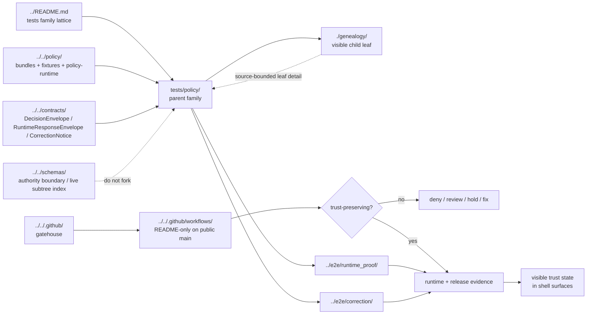

<!-- [KFM_META_BLOCK_V2]
doc_id: kfm://doc/<TODO_VERIFY_UUID>
title: tests/policy
type: standard
version: v1
status: draft
owners: @bartytime4life
created: <TODO_VERIFY_YYYY-MM-DD>
updated: <TODO_VERIFY_YYYY-MM-DD>
policy_label: <TODO_VERIFY_POLICY_LABEL>
related: [tests/README.md, tests/policy/genealogy/README.md, policy/README.md, contracts/README.md, schemas/README.md, .github/README.md, .github/workflows/README.md]
tags: [kfm]
notes: [owners confirmed from current public CODEOWNERS; doc_id/created/updated/policy_label need repo-backed verification; current public main now shows tests/policy/ containing README.md and genealogy/README.md; the earlier README-only inventory claim has been corrected in this revision]
[/KFM_META_BLOCK_V2] -->

# tests/policy

Repo-facing policy-behavior verification family for KFM deny-by-default decisions, runtime outcomes, and correction-visible trust states.

> **Status:** `experimental`
> **Owners:** `@bartytime4life`
> **Path:** `tests/policy/README.md`
> **Repo fit:** parent policy-verification family inside `tests/`; upstream from [`../README.md`](../README.md); local leaf currently at [`./genealogy/README.md`](./genealogy/README.md); laterally coupled to [`../../policy/README.md`](../../policy/README.md), [`../../contracts/README.md`](../../contracts/README.md), [`../../schemas/README.md`](../../schemas/README.md), [`../../.github/README.md`](../../.github/README.md), and [`../../.github/workflows/README.md`](../../.github/workflows/README.md); downstream into [`../e2e/runtime_proof/`](../e2e/runtime_proof/) and [`../e2e/correction/`](../e2e/correction/)
> **Quick jump:** [Scope](#scope) · [Repo fit](#repo-fit) · [Accepted inputs](#accepted-inputs) · [Exclusions](#exclusions) · [Current verified snapshot](#current-verified-snapshot) · [Directory tree](#directory-tree) · [Quickstart](#quickstart) · [Usage](#usage) · [Diagram](#diagram) · [Tables](#tables) · [Task list](#task-list--definition-of-done) · [FAQ](#faq) · [Appendix](#appendix)


> [!IMPORTANT]
> Keep **current public-tree evidence** separate from **doctrine-aligned target shape**.
>
> On current public `main`, `tests/policy/` is **not** README-only. The subtree now includes a checked-in child lane at [`./genealogy/README.md`](./genealogy/README.md), so this parent README has to index the live tree honestly without inflating executable depth.

> [!NOTE]
> Current public `main` directly exposes this README, the child `./genealogy/README.md`, the parent [`../README.md`](../README.md), [`../../.github/CODEOWNERS`](../../.github/CODEOWNERS), [`../../.github/README.md`](../../.github/README.md), and [`../../.github/workflows/README.md`](../../.github/workflows/README.md).
>
> That is stronger evidence than the earlier PDF-only inventory posture, but it still does **not** prove populated policy bundles, runnable suites, checked-in workflow YAML, or merge-blocking platform settings.

> [!WARNING]
> The visible genealogy leaf is itself intentionally source-bounded and marks many exact upstream paths, policy packaging conventions, and CLI details as **NEEDS VERIFICATION**. Do not let this parent index silently upgrade leaf-local proposals into repo-wide fact.

---

## Scope

`tests/policy/` is the repo-facing policy-behavior verification family inside KFM’s governed `tests/` surface.

This lane is no longer just a single README boundary. On current public `main`, it also has a visible child family at `./genealogy/`. That means this parent README now has two jobs:

- keep the shared placement rules, outcome grammar, and truth posture for policy-behavior proof visible
- index the live subtree honestly, so contributors do not confuse **README-only proof boundaries** with mounted executable depth

Use this family to answer questions such as:

- do policy-facing tests prove stable `allow`, `deny`, `generalize`, `restrict`, and review-bearing behavior?
- do request-time outcomes stay finite and inspectable instead of drifting into ambiguous prose?
- do correction-bearing states remain visible after release?
- do child policy families stay connected to shared contracts, workflow guardrails, and shell-visible trust states?

This family is narrower than the whole `tests/` tree and distinct from the top-level executable `../../policy/` lane. It is the place where **policy behavior becomes repo-facing test evidence**.

### Evidence labels used here

| Label | Meaning in this README |
|---|---|
| **CONFIRMED** | Directly visible on the current public repo surface, or strongly anchored in the attached March–April 2026 KFM doctrine |
| **INFERRED** | Strongly suggested by adjacent repo docs or repeated doctrine, but not re-proven from a mounted checkout in this session |
| **PROPOSED** | Commit-ready structure or practice that fits KFM doctrine but is not asserted as current repo reality |
| **UNKNOWN** | Not supported strongly enough here to present as current branch fact |
| **NEEDS VERIFICATION** | Placeholder, path, or implementation detail that should be checked against the active checkout before merge |

### Working rule

`tests/policy/` should stay **small, explicit, and behavior-centered**.

If a change mostly defines **policy law**, put it under [`../../policy/`](../../policy/).  
If it mostly defines **canonical shape**, put it under [`../../contracts/`](../../contracts/) or the singular authoritative schema home actually proved by the checked-out branch.  
If it proves **repo-facing policy behavior** against fixtures, routes, envelopes, or surface states, it belongs here.  
If it is domain-sensitive and needs its own fail-closed lane, add a child family like the visible `./genealogy/` leaf rather than overloading this parent README.

[Back to top](#testspolicy)

## Repo fit

**Path:** `tests/policy/README.md`  
**Role in repo:** directory-level guide for policy-behavior verification placement, shared result semantics, and local leaf indexing.

### Upstream, lateral, downstream, and local leaf links

| Direction | Surface | Why it matters |
|---|---|---|
| Upstream | [`../README.md`](../README.md) | Defines the broader `tests/` taxonomy and keeps `policy/` visible as its own verification family |
| Local leaf | [`./genealogy/README.md`](./genealogy/README.md) | Current public child lane for fail-closed genealogy admission and publication testing |
| Lateral | [`../../policy/README.md`](../../policy/README.md) | Owns executable policy bundles, fixtures, policy-runtime notes, and bundle-local tests |
| Lateral | [`../../contracts/README.md`](../../contracts/README.md) | Owns trust-bearing contract families such as `DecisionEnvelope`, `RuntimeResponseEnvelope`, and `CorrectionNotice` |
| Lateral | [`../../schemas/README.md`](../../schemas/README.md) | Keeps schema-home authority visible and warns against parallel machine-contract homes |
| Gatehouse | [`../../.github/README.md`](../../.github/README.md) | Documents the wider repo gatehouse, including local action scaffolding and README-only watcher/workflow lanes on current public `main` |
| Gate-adjacent | [`../../.github/workflows/README.md`](../../.github/workflows/README.md) | Documents current workflow-lane visibility and explicitly warns that public `main` is README-only there |
| Downstream | [`../e2e/runtime_proof/`](../e2e/runtime_proof/) | Whole-path proof lane for request-time runtime outcomes |
| Downstream | [`../e2e/correction/`](../e2e/correction/) | Whole-path proof lane for correction, supersession, replacement, and stale-visible state |

### Current public local leaf families

| Leaf | What it covers | Current public state |
|---|---|---|
| [`./genealogy/`](./genealogy/README.md) | Consent, living-person, DNA-sensitive, provenance-completeness, and publication fail-closed behavior | Directory is visible and currently exposes `README.md` only; the leaf README explicitly marks many exact paths and execution details as **PROPOSED** / **NEEDS VERIFICATION** |

> [!CAUTION]
> Public `main` still documents `.github/workflows/` as `README.md` only.
> Treat workflow references here as **required proof burden**, not as proof that merge-blocking YAML already exists on the checked-out branch.

[Back to top](#testspolicy)

## Accepted inputs

This parent family should stay compact. What belongs here falls into two groups: **current public surfaces that already exist** and **doctrine-aligned fill that may be added later**.

### Current public surfaces (**CONFIRMED**)

| Input class | What belongs here now | Typical examples |
|---|---|---|
| Parent directory contract | Shared placement rules, outcome grammar, and repo-fit guidance for the family | this `README.md` |
| Child policy-family docs | Narrow leaf-family README files when a rights-sensitive or domain-sensitive seam needs its own lane | `./genealogy/README.md` |
| Review-facing policy notes | Small local notes that clarify what the family proves without inventing machine truth | current public README surfaces only |

### Doctrine-aligned next fill (**PROPOSED**)

| Input class | What would belong here if materialized | Typical examples |
|---|---|---|
| Policy outcome fixtures | Small positive and negative cases that exercise policy meaning | `allow`, `deny`, `generalize`, `restrict`, `needs-review` cases |
| Runtime outcome parity checks | Cases that prove policy semantics survive into runtime behavior | `ANSWER`, `ABSTAIN`, `DENY`, `ERROR` expectation packs |
| Decision-grammar checks | Tests that pressure stable reason/obligation handling | assertions for `reason_codes`, `obligation_codes`, and review-bearing exceptions |
| Correction-state policy drills | Cases where release trust state changes after publication | `withdrawn`, `superseded`, stale-visible, narrowed-visibility cases |
| CI/runtime parity notes | Tiny local docs that clarify what the lane proves when workflow and runtime semantics converge | review-facing check notes, fixture intent notes |

### Minimum bar for anything added here

- It proves behavior, not merely directory aesthetics.
- It names the seam being exercised: release, runtime, correction, review, transform, or admission.
- It points back to shared contracts or vocab ownership instead of redefining them.
- It includes at least one **negative** case where failure is the trust-preserving result.
- It does not silently assume a particular runner, workflow, or policy engine until the active branch proves one.

## Exclusions

The following do **not** belong here as authoritative source-of-truth material:

| Does not belong here | Put it here instead | Why |
|---|---|---|
| Executable policy bundles or `.rego` source | [`../../policy/`](../../policy/) | Bundle law and repo-facing test evidence are adjacent but not the same artifact |
| Canonical JSON Schema / OpenAPI / shared vocab definitions | [`../../contracts/`](../../contracts/) or the singular authoritative schema home proved by the branch | Tests should consume shared contracts, not fork them |
| Documentary schema-home guidance | [`../../schemas/README.md`](../../schemas/README.md) | That lane exists specifically to keep schema-home ambiguity visible |
| Runtime bundle loaders, adapters, or request mediators | runtime package seam such as `packages/policy-runtime/` **if verified** | Execution glue is not the same thing as behavior proof |
| API handlers, workers, or UI components | app or package boundary | Policy verification should not become shadow implementation |
| Release manifests, proof packs, or promoted artifacts as primary record | release / proof / e2e surfaces | This family may test them, but does not authoritatively own them |
| Broad accessibility or whole-shell screenshot suites | sibling `tests/accessibility/` or `tests/e2e/` lanes | Keep this directory focused on policy-behavior proof |
| Domain-specific path claims that a child README itself marks as `PROPOSED` / `NEEDS VERIFICATION` | keep them inside the leaf README until the branch proves them | Parent indexing must not harden speculative local details into repo fact |

[Back to top](#testspolicy)

## Current verified snapshot

The strongest safe current-branch claim is intentionally bounded:

- `tests/policy/` exists as a real public directory.
- current public `main` shows two checked-in surfaces under this family: `README.md` and `genealogy/README.md`.
- the parent [`../README.md`](../README.md) treats `./policy/` as the policy and governance behavior family inside `tests/`.
- `.github/CODEOWNERS` confirms `/tests/` ownership under `@bartytime4life`.
- `.github/README.md` confirms a wider `.github/` gatehouse and states that `watchers/` and `workflows/` are README-only on current public `main`.
- `.github/workflows/README.md` remains the visible public workflow-lane artifact and explicitly says public `main` contains `README.md` only there.
- the visible local `./genealogy/README.md` is itself documentation-only and source-bounded; it does **not** by itself prove mounted policy bundles, runnable suites, or verified upstream genealogy paths.
- exact runnable suite depth, runner/toolchain, and merge-blocking enforcement remain **UNKNOWN** from current public-tree evidence alone.

> [!NOTE]
> This README should now function as both a **directory contract** and a **live subtree index**.
> Understating the checked-in tree is no longer safer; on current public `main`, it becomes a documentation bug.

## Directory tree

### Current verified snapshot (**CONFIRMED**)

```text
tests/
└── policy/
    ├── README.md
    └── genealogy/
        └── README.md
```

### Doctrine-aligned target shape (**PROPOSED**)

```text
tests/
└── policy/
    ├── README.md
    ├── genealogy/
    │   ├── README.md
    │   ├── fixtures/
    │   └── suites/
    ├── fixtures/
    └── suites/
```

### Outcome-oriented subshape (**PROPOSED**, illustrative only)

```text
tests/
└── policy/
    ├── fixtures/
    │   ├── allow/
    │   ├── deny/
    │   ├── generalize/
    │   ├── restrict/
    │   ├── needs-review/
    │   └── correction/
    ├── suites/
    │   ├── decision-grammar/
    │   ├── runtime-outcomes/
    │   └── ci-runtime-parity/
    └── genealogy/
        ├── fixtures/
        └── suites/
```

> [!TIP]
> Keep the trees above **illustrative, not mandatory**.
> The important part is the seam they make visible: small fixtures, explicit negative paths, and one obvious place to prove policy behavior without duplicating bundles, contracts, or schema authority.

[Back to top](#testspolicy)

## Quickstart

### 1) Inspect the lane exactly as it exists now

```bash
find tests/policy -maxdepth 4 -type f 2>/dev/null | sort
find tests/policy -maxdepth 4 -type d 2>/dev/null | sort
```

### 2) Inspect the visible child leaf directly

```bash
find tests/policy/genealogy -maxdepth 4 -type f 2>/dev/null | sort
sed -n '1,220p' tests/policy/genealogy/README.md 2>/dev/null
```

### 3) Inspect adjacent policy / contract / schema / workflow surfaces

```bash
find policy contracts schemas .github/workflows tests -maxdepth 4 -type f 2>/dev/null | sort
```

### 4) Check whether executable policy artifacts actually exist

```bash
find . -type f \
  \( -name '*.rego' -o -name '*policy*' -o -name '*reason*' -o -name '*obligation*' \) \
  | sort
```

### 5) Trace trust-bearing object names across repo surfaces

```bash
grep -RInE \
  'DecisionEnvelope|ReviewRecord|ReleaseManifest|ReleaseProofPack|EvidenceBundle|RuntimeResponseEnvelope|CorrectionNotice|reason_codes|obligation_codes|rights_class|sensitivity_class' \
  policy contracts schemas tests docs apps packages 2>/dev/null || true
```

### 6) Inspect visible workflow-lane contents before claiming merge-gate coverage

```bash
find .github/workflows -maxdepth 2 -type f 2>/dev/null | sort
```

### 7) Sanity-check runtime and policy outcome grammar

```bash
grep -RInE \
  'ANSWER|ABSTAIN|DENY|ERROR|allow|deny|generalize|restrict|needs-review|STEWARD_REVIEW|withdrawn|superseded' \
  policy tests contracts docs apps packages 2>/dev/null || true
```

> [!CAUTION]
> These commands are discovery tools.
> They prove what is present, not whether the active branch already enforces the full KFM trust model.

[Back to top](#testspolicy)

## Usage

### Update the parent lane

1. Start with the seam, not the filename:
   - release / review
   - runtime ask
   - generalization / restriction
   - correction / supersession
   - domain-sensitive admission
2. Decide whether the change belongs in this parent README, a child family such as [`./genealogy/`](./genealogy/README.md), the top-level [`../../policy/`](../../policy/), or [`../../contracts/`](../../contracts/).
3. Keep machine-contract and schema authority singular.
4. Add at least one **happy path** and one **negative path** for every behavior claim that hardens into implementation.
5. Keep the result reviewable from the README alone.

### Add or revise a child policy family

1. Use a child lane when the seam is narrow, sensitive, or domain-specific enough that it would otherwise overload the parent README.
2. Keep child README claims visibly bounded when upstream bundle paths, fixtures, or runtime loaders are not yet proven.
3. Pair leaf-local deny logic with downstream trust objects such as:
   - `DecisionEnvelope`
   - `ReviewRecord`
   - `RuntimeResponseEnvelope`
   - `CorrectionNotice`
4. Escalate whole-path proof into [`../e2e/runtime_proof/`](../e2e/runtime_proof/) or [`../e2e/correction/`](../e2e/correction/) instead of turning a leaf README into an e2e surrogate.

### Prefer explicit outcome pairing

| If you are proving… | Pair it with… |
|---|---|
| `allow` | named obligations and downstream evidence/runtime expectation |
| `deny` | stable reason code and calm refusal expectation |
| `generalize` | visible transform consequence and receipt/reference expectation |
| `restrict` | narrower actor/surface mode and no silent public fallback |
| `needs-review` / `STEWARD_REVIEW` | explicit steward routing or review-bearing result |
| `withdrawn` / `superseded` | correction linkage and visible downstream state change |

### Illustrative starter fixture (**PROPOSED example**)

```yaml
name: public_focus_answer_allowed_when_release_is_public_safe
input:
  actor_role: public
  surface_class: focus
  action: answer
  release_id: rel.example.public.v1
  rights_class: open
  sensitivity_class: public
expected:
  policy_result: allow
  reason_codes:
    - PUBLIC_SAFE
  obligation_codes:
    - REQUIRE_CITATION
    - RECORD_AUDIT
  runtime_outcome: ANSWER
```

Use the example above as a shape starter only.  
It is **not** proof that the checked-out repo already emits this exact payload.

### Keep CI/runtime parity visible

A strong `tests/policy/` family should help answer:

- does CI prove the same decision grammar runtime is expected to honor?
- do runtime envelopes stop at `ANSWER`, `ABSTAIN`, `DENY`, or `ERROR`?
- does correction remain visible instead of being hidden behind a later deploy?
- does denial stay explicit when rights or sensitivity are unresolved?
- do child policy families inherit the same truth posture instead of quietly drifting into unchecked convenience?

[Back to top](#testspolicy)

## Diagram


```mermaid
flowchart LR
  T["../README.md<br/>tests family lattice"] --> TP["tests/policy/<br/>parent family"]
  TP --> G["./genealogy/<br/>visible child leaf"]
  P["../../policy/<br/>bundles + fixtures + policy-runtime"] --> TP
  C["../../contracts/<br/>DecisionEnvelope / RuntimeResponseEnvelope / CorrectionNotice"] --> TP
  S["../../schemas/<br/>authority boundary / live subtree index"] -. do not fork .-> TP
  GH["../../.github/<br/>gatehouse"] --> W["../../.github/workflows/<br/>README-only on public main"]
  TP --> RT["../e2e/runtime_proof/"]
  TP --> CO["../e2e/correction/"]
  G -. source-bounded leaf detail .-> TP
  W --> D{"trust-preserving?"}
  D -->|no| N["deny / review / hold / fix"]
  D -->|yes| R["runtime + release evidence"]
  RT --> R
  CO --> R
  R --> V["visible trust state<br/>in shell surfaces"]
```

Above: this family sits between **policy law**, **contract shape**, **workflow expectations**, **local leaf families**, and **visible outcomes**.  
It should never become a second policy tree, a shadow schema registry, or a quiet place where README-only child lanes are mistaken for mounted executable proof.

[Back to top](#testspolicy)

## Tables

### What this family should prove

| Policy seam | Minimum thing to prove here | Companion trust objects |
|---|---|---|
| Decision grammar | stable result + reason/obligation meaning | `DecisionEnvelope` |
| Runtime outcome parity | no uncited fifth outcome; explicit finite result | `RuntimeResponseEnvelope` |
| Review-bearing cases | machine gate routes ambiguous cases visibly | `ReviewRecord`, `DecisionEnvelope` |
| Generalization / restriction | transform or narrowing is explicit, not silent | `DecisionEnvelope`, `EvidenceBundle` |
| Correction visibility | withdrawal/supersession survives after release | `CorrectionNotice`, downstream runtime/surface state |
| Child-family honesty | leaf README claims do not outrun visible repo evidence | local child lane docs + downstream proof surfaces |
| CI/runtime parity | the same semantics survive both PR-time and request-time checks | workflow gate expectations + runtime envelope evidence |

### Policy result grammar to pressure-test

| Result / state | Meaning | What a good test should assert |
|---|---|---|
| `allow` | request or release is policy-safe as scoped | obligations are present and downstream behavior continues visibly |
| `deny` | policy blocks the action | stable reason and no quiet fallback |
| `generalize` | exposure is allowed only after masking / aggregation / reduction | transformed state is visible and linked |
| `restrict` | surface narrows to actor, role, or mode | public path does not quietly inherit privileged view |
| `needs-review` / `STEWARD_REVIEW` | machine gate cannot safely finish alone | review routing is explicit and auditable |
| `withdrawn` / `superseded` | trust state changed after release | lineage remains visible after change |

### Runtime outcomes to pressure-test

| Outcome | Meaning | Minimum expectation |
|---|---|---|
| `ANSWER` | support is sufficient and policy-safe | evidence and trust cues survive |
| `ABSTAIN` | evidence is weak, stale, partial, conflicted, or unresolved | decline is explicit and inspectable |
| `DENY` | policy blocks the request | refusal is calm, accountable, and not disguised as absence |
| `ERROR` | reliable governed handling failed technically | failure is explicit; no fake policy/evidence success |

### Current public leaf inventory

| Surface | Current public evidence | What that proves | What it still does **not** prove |
|---|---|---|---|
| `tests/policy/README.md` | checked in and substantive | parent family boundary and placement guidance are real repo surfaces | that every claim in the current parent README matches the live subtree without review |
| `tests/policy/genealogy/README.md` | checked in and substantive | one child leaf family is already visible on public `main` | exact upstream bundle paths, fixture mechanics, policy engine choice, or runnable suite depth |
| generic parent `fixtures/` / `suites/` | not visible on current public `main` | nothing yet beyond doctrine-aligned target shape | mounted generic fixture or suite inventory |

### Current evidence versus target maturity

| Concern | Current repo-grounded evidence | Target direction |
|---|---|---|
| Directory presence | `tests/policy/` exists and current public tree shows `README.md` plus `genealogy/README.md` | keep this family as the focused repo-facing policy verification lane |
| Parent README maturity | the checked-in parent README is substantive but currently understates the live subtree | keep it synchronized with the real tree and avoid README-only claims that the tree disproves |
| Local leaf maturity | `genealogy/` is visible as a README-bearing child family | add fixtures and suites only after the active branch proves them |
| Executable suites | not proven from current public-tree evidence | add runnable cases only when checked-in files and tooling support them |
| Workflow enforcement | public `.github/workflows/` still shows `README.md` only; `.github/README.md` confirms broader gatehouse scaffolding but not checked-in workflow YAML | wire merge-blocking policy checks after the active branch proves them |
| Schema ownership | still unresolved between root `contracts/` and `schemas/` surfaces | keep authoritative machine-contract truth singular |
| Bundle ownership | executable policy remains owned by `../../policy/` | keep tests here behavior-facing, not bundle-authoring |

[Back to top](#testspolicy)

## Task list / Definition of done

Treat this README as healthy only when it stays both readable and truthful.

- [ ] The active checkout was inspected and this file still matches the real `tests/policy/` inventory.
- [ ] The current verified snapshot explicitly acknowledges the checked-in `./genealogy/README.md` leaf.
- [ ] Any badge, note, or table that previously implied “README only” for the whole family has been corrected or narrowly requalified.
- [ ] `doc_id`, created date, updated date, and `policy_label` were replaced with repo-backed values.
- [ ] Owner routing was checked against the active `CODEOWNERS`, not only public `main`.
- [ ] This README does not imply runnable suites, `.rego` bundles, or workflow YAML that the branch does not prove.
- [ ] The relationship among `tests/policy/`, `./genealogy/`, `../../policy/`, `../../contracts/`, and `../../schemas/` is still accurate.
- [ ] The current public `.github/README.md` and `.github/workflows/README.md` signals were reconciled against the checked-out branch before claiming automation depth.
- [ ] At least one negative-path example is documented for each seam the directory actually covers.
- [ ] If runtime parity is claimed, `ANSWER / ABSTAIN / DENY / ERROR` behavior is exercised somewhere verifiable.
- [ ] If correction behavior is claimed, `withdrawn` / `superseded` handling is exercised somewhere verifiable.
- [ ] If merge-blocking enforcement is claimed, the exact workflow file(s) and required checks are visible on the active branch.
- [ ] Any proposed parent or leaf subfolders in this README were reconciled against the real tree before merge.

[Back to top](#testspolicy)

## FAQ

### What is confirmed on current public `main`?

`tests/policy/` exists and currently exposes two checked-in surfaces: this parent `README.md` and the child `./genealogy/README.md`.

### Does this README prove that runnable policy suites already exist?

No. The strongest current public-branch evidence proves the family boundary, the local child leaf, and the adjacent governance surfaces — not executable depth.

### Is `./genealogy/` confirmed or proposed?

The directory and its `README.md` are **CONFIRMED** in the public tree. Many of that leaf README’s exact upstream path claims, tool names, and execution details are still explicitly marked **PROPOSED** / **NEEDS VERIFICATION** inside the leaf itself.

### Should `.rego` bundles live here?

No. This family is for **policy-behavior proof**, not for owning executable policy bundles.

### Should schemas or OpenAPI live here?

No. Shared shape belongs with the contract-authority surface, not in a behavior-test family.

### Is `OPA/Rego` confirmed here as mounted implementation?

Not as a repo-wide mounted fact for this family. It is described in adjacent policy docs as the starter engine, and the genealogy leaf uses OPA/Conftest in its proposed examples, but this parent README should not harden that into settled implementation unless the active branch proves it.

### Why keep this family separate from `../../policy/` and `../e2e/`?

Because `tests/policy/` is the narrowest place to prove repo-facing decision grammar, result semantics, and CI/runtime parity without turning every policy assertion into either bundle authorship or a full whole-path drill.

[Back to top](#testspolicy)

## Appendix

<details>
<summary>Search seeds, trust objects, and local leaf reminders</summary>

### Safe grep seeds

```text
DecisionEnvelope
ReviewRecord
ReleaseManifest
ReleaseProofPack
EvidenceBundle
RuntimeResponseEnvelope
CorrectionNotice
reason_codes
obligation_codes
rights_class
sensitivity_class
ANSWER
ABSTAIN
DENY
ERROR
allow
deny
generalize
restrict
needs-review
STEWARD_REVIEW
withdrawn
superseded
genealogy
consent
revoked
dna_sensitive
living_person
```

### Trust-bearing objects this family will most often touch

| Object | Why it matters to `tests/policy/` |
|---|---|
| `DecisionEnvelope` | primary machine-readable policy result |
| `ReviewRecord` | proves review-bearing exceptions stay explicit |
| `ReleaseManifest` / `ReleaseProofPack` | proves policy meaning survives promotion |
| `EvidenceBundle` | proves downstream evidence state remains visible |
| `RuntimeResponseEnvelope` | proves request-time outcomes stay finite and inspectable |
| `CorrectionNotice` | proves post-release change preserves lineage |

### Reading rule

Prefer the **current repo’s visible names** over manual shorthand.  
Prefer **manual burden language** over folder aesthetics.  
Prefer **leaf-local truth posture** over parent-level convenience when a checked-in child README marks details as proposed.

</details>

[Back to top](#testspolicy)
