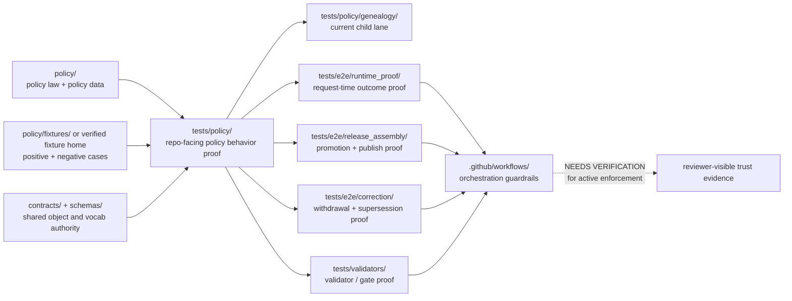

<!-- [KFM_META_BLOCK_V2]
doc_id: kfm://doc/<TODO_VERIFY_UUID>
title: tests/policy
type: standard
version: v1
status: draft
owners: @bartytime4life
created: <TODO_VERIFY_YYYY-MM-DD>
updated: <TODO_VERIFY_YYYY-MM-DD>
policy_label: <TODO_VERIFY_POLICY_LABEL>
related: [../README.md, ./genealogy/README.md, ../../policy/README.md, ../../contracts/README.md, ../../schemas/README.md, ../../.github/README.md, ../../.github/workflows/README.md]
tags: [kfm, tests, policy, verification, governance]
notes: [owners confirmed from surfaced public CODEOWNERS coverage for /tests; doc_id, created, updated, and policy_label need repo-backed verification; surfaced public-main evidence shows tests/policy/README.md and tests/policy/genealogy/README.md; executable depth, active runner, and merge-gate enforcement remain NEEDS VERIFICATION]
[/KFM_META_BLOCK_V2] -->

<a id="top"></a>

# `tests/policy`

Repo-facing policy-behavior verification family for KFM deny-by-default decisions, finite runtime outcomes, publication guards, and correction-visible trust states.

<div align="left">


</div>

> [!IMPORTANT]
> **Status:** experimental  
> **Owners:** `@bartytime4life`  
> **Path:** `tests/policy/README.md`  
> **Repo fit:** parent policy-verification family inside [`../README.md`](../README.md); local child lane currently indexed at [`./genealogy/README.md`](./genealogy/README.md); adjacent to policy law in [`../../policy/README.md`](../../policy/README.md), shared contracts in [`../../contracts/README.md`](../../contracts/README.md), schema-boundary guidance in [`../../schemas/README.md`](../../schemas/README.md), and workflow guardrails in [`../../.github/workflows/README.md`](../../.github/workflows/README.md).  
> **Quick jumps:** [Scope](#scope) · [Repo fit](#repo-fit) · [Accepted inputs](#accepted-inputs) · [Exclusions](#exclusions) · [Current verified snapshot](#current-verified-snapshot) · [Directory tree](#directory-tree) · [Quickstart](#quickstart) · [Usage](#usage) · [Diagram](#diagram) · [Operating tables](#operating-tables) · [Task list](#task-list--definition-of-done) · [FAQ](#faq) · [Appendix](#appendix)

> [!NOTE]
> This directory proves **policy behavior under pressure**.  
> It does not own policy law, shared schemas, runtime loaders, workflow orchestration, release artifacts, or hidden platform settings.

---

## Scope

`tests/policy/` is the repo-facing verification lane for policy outcomes that must stay inspectable after they cross a local rule boundary.

Its core question is:

> When KFM policy says **allow**, **deny**, **abstain**, **hold**, **restrict**, **withdraw**, or **supersede**, can the repo still prove that behavior without hiding the reason, obligation, review state, or downstream trust impact?

This is narrower than all tests and broader than local bundle assertions. It should prove that policy decisions remain visible in contexts such as runtime responses, release gates, correction drills, sensitive-publication controls, and domain-specific negative paths.

### Truth posture used here

| Label | Meaning in this README |
|---|---|
| **CONFIRMED** | Supported by surfaced repo-facing documentation or directly visible current-session workspace evidence. |
| **INFERRED** | Strongly supported by adjacent README patterns or KFM doctrine, but not directly verified as executable implementation here. |
| **PROPOSED** | Recommended target structure or test family not yet proven in the active checkout. |
| **UNKNOWN / NEEDS VERIFICATION** | Runner, workflow, branch protection, platform rule, bundle inventory, or executable depth not verified from the mounted repo in this session. |

[Back to top](#top)

---

## Repo fit

`tests/policy/` sits between executable policy law and whole-path proof.

| Direction | Surface | Why it matters |
|---|---|---|
| Parent | [`../README.md`](../README.md) | Defines the broader governed verification map for `tests/`. |
| Child | [`./genealogy/README.md`](./genealogy/README.md) | Current policy-behavior child lane for consent, living-person, DNA, provenance, and publication-control negative tests. |
| Policy law | [`../../policy/README.md`](../../policy/README.md) | Owns policy bundles, fixtures, runtime-policy notes, and checked-in policy data. |
| Contracts | [`../../contracts/README.md`](../../contracts/README.md) | Owns shared contract meaning that policy tests should consume rather than fork. |
| Schema boundary | [`../../schemas/README.md`](../../schemas/README.md) | Keeps schema-home ambiguity explicit and prevents test fixtures from becoming shadow schemas. |
| Runtime proof | [`../e2e/runtime_proof/README.md`](../e2e/runtime_proof/README.md) | Escalation lane when policy behavior must survive request-time `ANSWER`, `ABSTAIN`, `DENY`, and `ERROR` paths. |
| Release proof | [`../e2e/release_assembly/README.md`](../e2e/release_assembly/README.md) | Escalation lane when policy behavior affects promotion, publish-path proof, or release assembly. |
| Correction proof | [`../e2e/correction/README.md`](../e2e/correction/README.md) | Escalation lane when policy behavior affects withdrawal, supersession, stale visibility, or correction lineage. |
| Workflow guardrail | [`../../.github/workflows/README.md`](../../.github/workflows/README.md) | Documents workflow expectations; does not by itself prove active branch protection or merge-blocking checks. |

> [!WARNING]
> Do not collapse `policy/tests/` and `tests/policy/`.
>
> `policy/tests/` is the local assertion lane inside the policy authoring surface.  
> `tests/policy/` is the broader repo-facing verifier that checks whether policy behavior remains visible across KFM trust surfaces.

[Back to top](#top)

---

## Accepted inputs

Content belongs in `tests/policy/` when it proves policy behavior rather than merely documenting policy intent.

| Input class | What belongs here | Typical examples |
|---|---|---|
| Policy outcome cases | Small cases that exercise policy meaning in repo-facing terms | `allow`, `deny`, `restrict`, `needs-review`, `withdraw`, `supersede` cases |
| Negative-path fixtures | Failure cases where refusal or hold is the correct trust-preserving result | missing consent, restricted-publication attempt, missing provenance, unresolved citation |
| Runtime parity checks | Tests proving policy semantics survive into request-time envelopes | `ANSWER`, `ABSTAIN`, `DENY`, `ERROR` expectation packs |
| Release / promotion policy checks | Cases proving release gates respect policy decisions and review burden | public publish denied, review required, stale release held, no-change outcome visible |
| Correction-state drills | Cases where policy meaning changes after publication | withdrawn, superseded, narrowed visibility, stale-visible, correction notice required |
| Decision-grammar checks | Assertions that stable reason and obligation vocabularies are preserved | `reason_codes`, `obligation_codes`, review-bearing exceptions |
| Child lane indexes | Narrow README files for domain-specific policy behavior | `genealogy/README.md` and future domain-specific policy proof leaves |
| Review notes tied to tests | Short notes that clarify what a test proves and what it does not prove | fixture intent notes, runner caveats, branch-verification notes |

### Minimum bar for additions

Every new file or child lane should answer five questions:

1. Which governed seam is being exercised: admission, rights, sensitivity, review, runtime, release, export, or correction?
2. Which shared contract, schema, policy fixture, or vocabulary does it consume?
3. What negative case proves fail-closed behavior?
4. What outcome is expected, and where is the reason or obligation visible?
5. Does the behavior stay local, or must it also be mirrored in `../e2e/`?

[Back to top](#top)

---

## Exclusions

The following do **not** belong here as authoritative source-of-truth material.

| Does not belong here | Put it here instead | Why |
|---|---|---|
| Executable policy bundles or `.rego` source | [`../../policy/README.md`](../../policy/README.md), especially bundle lanes under `policy/` | Bundle law and repo-facing proof are adjacent, not identical. |
| Local bundle-only assertions | [`../../policy/tests/README.md`](../../policy/tests/README.md) | Keep seam-local policy checks close to policy bundles and fixtures. |
| Canonical JSON Schema, OpenAPI, or shared vocab definitions | [`../../contracts/README.md`](../../contracts/README.md) or the singular schema home verified by the branch | Tests should consume shared definitions, not fork them. |
| Schema-home doctrine | [`../../schemas/README.md`](../../schemas/README.md) | Schema-boundary ambiguity must stay visible in the schema lane. |
| Runtime loaders, adapters, request mediators, or API handlers | verified app/package runtime boundaries | Verification should not become shadow implementation. |
| Release manifests, proof packs, receipts, or promoted artifacts as primary records | release, proof, receipt, or `../e2e/` surfaces | This family may test them, but it does not own their lifecycle record. |
| Broad accessibility or shell screenshot suites | [`../accessibility/README.md`](../accessibility/README.md) or [`../e2e/README.md`](../e2e/README.md) | Keep this directory focused on policy-behavior proof. |
| Workflow YAML, branch protection, or required-check configuration | [`../../.github/workflows/README.md`](../../.github/workflows/README.md) and platform settings | Documentation about gates is not proof that those gates are active. |
| Secrets, credentials, private keys, or live source tokens | secret manager / host configuration | Sensitive operational material must not live in tests. |
| Domain-specific path claims marked as proposed by a child README | keep them in the child README until branch proof exists | Parent indexing must not harden speculative leaf details into repo fact. |

[Back to top](#top)

---

## Current verified snapshot

The strongest safe current-branch claim is intentionally bounded.

| Surface | Truth label | Current reading | Verification consequence |
|---|---:|---|---|
| `tests/policy/README.md` | **CONFIRMED** | Parent policy-verification README exists in surfaced public-main evidence. | This lane is real, but its executable depth still needs active-checkout verification. |
| `tests/policy/genealogy/README.md` | **CONFIRMED** | Genealogy-specific child README exists in surfaced public-main evidence. | Parent README should index it without inflating checked-in sibling test depth. |
| Checked-in sibling test files under `tests/policy/` | **UNKNOWN** | No broader sibling inventory is verified here. | Use safe inspection commands before naming files or runners. |
| Policy engine / runner | **UNKNOWN / NEEDS VERIFICATION** | OPA/Rego and Conftest appear as starter directions in adjacent docs, but this README must not invent current runner state. | Runner commands belong here only after active branch proof. |
| Workflow enforcement | **UNKNOWN / NEEDS VERIFICATION** | Workflow docs are relevant, but branch protection and checked-in YAML enforcement are not proven by this README alone. | Do not claim merge-blocking enforcement without branch/platform evidence. |
| Shared reason / obligation vocabulary | **INFERRED / NEEDS VERIFICATION** | KFM policy language depends on stable reason and obligation grammar. | Tests should reference canonical vocab once its home is confirmed. |

> [!CAUTION]
> Directory presence is not executable maturity.  
> This snapshot narrows what can be said honestly; it does not prove active policy gates, CI wiring, or branch protection.

[Back to top](#top)

---

## Directory tree

### Current public-main evidence

```text
tests/
└── policy/
    ├── README.md
    └── genealogy/
        └── README.md
```

### Target executable split — PROPOSED until branch-verified

```text
tests/
└── policy/
    ├── README.md
    ├── genealogy/
    │   ├── README.md
    │   ├── runtime_parity.md
    │   ├── release_parity.md
    │   ├── correction_parity.md
    │   └── fixtures/              # only if repo-facing verification truly needs local copies
    ├── runtime/
    │   └── README.md              # optional future cross-domain runtime policy parity
    ├── release/
    │   └── README.md              # optional future promotion/publication policy parity
    └── correction/
        └── README.md              # optional future correction-state policy parity
```

> [!IMPORTANT]
> Prefer the active checkout over this proposed tree.  
> If the branch already has stronger domain-specific lanes, preserve and extend them in place rather than creating parallel policy-proof homes.

[Back to top](#top)

---

## Quickstart

Use these commands to inspect the lane without assuming a runner.

```bash
# run from repo root
find tests/policy -maxdepth 4 -type f 2>/dev/null | sort

# inspect nearby policy-facing proof lanes
find tests/e2e tests/validators tests/contracts policy -maxdepth 3 -type f 2>/dev/null | sort

# inspect documentation guardrails before claiming workflow enforcement
sed -n '1,220p' .github/CODEOWNERS 2>/dev/null || true
sed -n '1,260p' .github/workflows/README.md 2>/dev/null || true

# trace governed outcome grammar and decision vocabulary
grep -RIn 'ANSWER\|ABSTAIN\|DENY\|ERROR\|ALLOW\|HELD\|QUARANTINED\|NO_CHANGE\|reason_codes\|obligation_codes' \
  tests/policy tests/e2e policy contracts schemas 2>/dev/null || true
```

### First review pass

1. Read [`../README.md`](../README.md), this README, and [`../../policy/README.md`](../../policy/README.md) together.
2. Inventory the active branch before adding runner-specific commands.
3. Add one negative case for every new policy seam.
4. Escalate runtime, release, and correction impacts to the matching `../e2e/` lane.
5. Keep shared contract and vocabulary definitions outside this directory.

[Back to top](#top)

---

## Usage

Use `tests/policy/` when the proof question is policy behavior in repo context.

### Place work here when…

- A policy decision must remain visible after a runtime, release, or correction boundary is exercised.
- A domain-specific sensitive lane needs negative-path proof before public or semi-public exposure.
- A fixture proves that denial, abstention, hold, or restricted handling is the correct outcome.
- A reason or obligation code must stay stable across local policy, runtime envelope, and reviewer-facing output.
- A child README needs to define a narrow policy-behavior proof family without becoming policy law.

### Escalate out when…

- The behavior is only local bundle correctness: use [`../../policy/tests/README.md`](../../policy/tests/README.md).
- The behavior is request-time end-to-end output: use [`../e2e/runtime_proof/README.md`](../e2e/runtime_proof/README.md).
- The behavior affects promotion or publication: use [`../e2e/release_assembly/README.md`](../e2e/release_assembly/README.md).
- The behavior affects withdrawal, supersession, stale visibility, or correction propagation: use [`../e2e/correction/README.md`](../e2e/correction/README.md).
- The behavior is contract drift: use [`../contracts/README.md`](../contracts/README.md).

### Working rule for change sets

A policy-significant test change should usually travel with:

1. the policy source or policy-data change under `../../policy/`
2. paired positive and negative fixtures in the verified fixture home
3. repo-facing proof here under `tests/policy/`
4. broader `../e2e/` proof when runtime, release, or correction behavior is affected
5. reviewer-facing notes that explain what failure means and why fail-closed behavior is expected

[Back to top](#top)

---

## Diagram


```mermaid
flowchart LR
    LAW["policy/\npolicy law + policy data"] --> TP["tests/policy/\nrepo-facing policy behavior proof"]
    FX["policy/fixtures/ or verified fixture home\npositive + negative cases"] --> TP
    CT["contracts/ + schemas/\nshared object and vocab authority"] --> TP

    TP --> GEN["tests/policy/genealogy/\ncurrent child lane"]
    TP --> RUN["tests/e2e/runtime_proof/\nrequest-time outcome proof"]
    TP --> REL["tests/e2e/release_assembly/\npromotion + publish proof"]
    TP --> COR["tests/e2e/correction/\nwithdrawal + supersession proof"]
    TP --> VAL["tests/validators/\nvalidator / gate proof"]

    RUN --> WF[".github/workflows/\norchestration guardrails"]
    REL --> WF
    COR --> WF
    VAL --> WF

    WF -. "NEEDS VERIFICATION\nfor active enforcement" .-> REVIEW["reviewer-visible trust evidence"]
```

[Back to top](#top)

---

## Operating tables

### Seam-to-proof map

| Policy seam | What `tests/policy/` should prove | Escalate when… |
|---|---|---|
| Admission | Missing or invalid prerequisite data fails closed with visible reason. | Source onboarding or ingest lifecycle proof is affected. |
| Rights / sensitivity | Public exposure is denied, restricted, generalized, or held when policy requires it. | Runtime output, publication, or export could expose restricted material. |
| Review | Review-required cases stay distinct from outright denial. | Reviewer state must appear in UI, release, or workflow evidence. |
| Runtime | Policy semantics survive into finite runtime outcomes. | The response envelope, Focus Mode, or governed API behavior is under test. |
| Release / export | Policy blocks or holds publish-like actions correctly. | Release manifests, proof packs, or export artifacts are involved. |
| Correction | Withdraw, supersede, stale-visible, and narrowed-scope states remain visible. | Correction propagation needs end-to-end proof. |

### Outcome grammar reference

| Outcome family | Expected test posture | Notes |
|---|---|---|
| `ALLOW` / `PROMOTED` | Positive path, but only after required evidence and policy conditions are present. | Happy paths should not be the only cases. |
| `DENY` / `QUARANTINED` | Negative path where publication or runtime exposure would be unsafe or unsupported. | Denial is a valid trust-preserving result. |
| `ABSTAIN` / `HELD` | Bounded uncertainty, unresolved evidence, review-required state, or insufficient support. | Abstention must not be flattened into failure noise. |
| `ERROR` | Tooling or system failure with no silent allow. | Error states should not publish or emit unsupported claims. |
| `NO_CHANGE` | No material change detected; no fake promotion proof should be emitted. | Use when no-op behavior must stay visible. |

### Boundary map

| Surface | Owns | `tests/policy/` relationship |
|---|---|---|
| `../../policy/` | executable policy law, policy data, fixtures, bundle-local tests | consume and pressure-test behavior; do not fork law |
| `../../contracts/` | shared object contracts and API shapes | consume contracts; do not redefine envelope or vocabulary shape |
| `../../schemas/` | schema-home boundary and machine schema scaffolds | respect schema-authority decisions |
| `../contracts/` | contract-facing test family | coordinate when policy behavior depends on schema validity |
| `../validators/` | validator and gate proof | coordinate when policy gates rely on validator outputs |
| `../e2e/runtime_proof/` | request-time finite outcome proof | escalate when behavior crosses runtime boundary |
| `../e2e/release_assembly/` | release and promotion proof | escalate when behavior affects publication |
| `../e2e/correction/` | correction and supersession proof | escalate when behavior affects post-release trust state |
| `../../.github/workflows/` | orchestration documentation and future CI gate burden | verify before claiming enforcement |

[Back to top](#top)

---

## Task list / Definition of done

Treat this README and directory as healthy only when it stays readable, truthful, and test-bearing.

- [ ] Current inventory in [Current verified snapshot](#current-verified-snapshot) matches the active branch.
- [ ] `tests/policy/` remains distinct from `policy/tests/`.
- [ ] New policy-behavior files include at least one negative path.
- [ ] Tests reference shared contracts, schemas, reason codes, obligation codes, and policy fixtures from their verified canonical homes.
- [ ] Child README files mark executable buildout as **PROPOSED** until files are visible on branch.
- [ ] Runtime-impacting policy tests are mirrored or escalated into [`../e2e/runtime_proof/`](../e2e/runtime_proof/).
- [ ] Release-impacting policy tests are mirrored or escalated into [`../e2e/release_assembly/`](../e2e/release_assembly/).
- [ ] Correction-impacting policy tests are mirrored or escalated into [`../e2e/correction/`](../e2e/correction/).
- [ ] Workflow and merge-gate claims are backed by actual workflow files and branch/platform settings.
- [ ] The KFM meta block has verified `doc_id`, `created`, `updated`, and `policy_label` values before publication.
- [ ] No secrets, credentials, raw sensitive source data, or restricted public examples are committed here.
- [ ] The diagram and relative links remain valid from `tests/policy/README.md`.

[Back to top](#top)

---

## FAQ

### Is `tests/policy/` the same thing as `policy/tests/`?

No.

`policy/tests/` is the bundle-local assertion lane inside the policy authoring surface. `tests/policy/` is the repo-facing policy-behavior verification lane that proves policy decisions remain visible across runtime, release, correction, and domain-specific negative paths.

### Does this README prove active merge-blocking policy enforcement?

No.

This README documents the policy-proof boundary. Active enforcement requires branch-local workflow files, runner configuration, required checks, or platform ruleset evidence.

### Is OPA, Rego, or Conftest confirmed as the active runner here?

No.

They are documented starter directions in adjacent policy materials. Runner-specific commands should stay out of this README unless the active checkout proves the exact bundle, fixture, and toolchain paths.

### Should shared fixtures live here?

Default to no.

Reusable or review-significant fixtures should live in the verified fixture home, usually under `policy/fixtures/` or another explicitly documented fixture lane. Keep local copies here only when repo-facing verification truly needs them and the duplication is explained.

### Why require negative cases?

Because in KFM, denial, abstention, hold, redaction, and quarantine can be correct results. A test suite that only proves happy paths does not prove governed behavior.

### Does the genealogy child lane own all sensitive-person policy?

No.

[`./genealogy/README.md`](./genealogy/README.md) is a child policy-behavior proof lane. It should consume policy, contracts, and connector doctrine from their owning surfaces rather than becoming the canonical home for genealogy law.

[Back to top](#top)

---

## Appendix

<details>
<summary><strong>Illustrative future maturity model — PROPOSED, not current branch fact</strong></summary>

A mature `tests/policy/` lane would usually make these reviewable together:

| Mature artifact | Purpose |
|---|---|
| `fixtures/` | local copies only where repo-facing proof needs stable cases distinct from policy bundle fixtures |
| `runtime/` | cross-domain policy-to-runtime outcome parity checks |
| `release/` | policy-to-promotion and publish-path parity checks |
| `correction/` | policy-to-correction and stale-visibility parity checks |
| `genealogy/` | domain-specific sensitive policy proof where current public evidence already exposes a child README |
| `README.md` files per leaf | truth-labeled scope, inputs, exclusions, and runner boundaries |
| reviewer summary notes | short explanation of expected allow/deny/hold/abstain behavior |

</details>

<details>
<summary><strong>Illustrative runner commands — use only after branch verification</strong></summary>

These are placement examples, not current runner proof.

```bash
# substitute verified bundle and fixture roots from the active checkout
POLICY_ROOT="<verify-on-checkout>"
FIXTURE_ROOT="<verify-on-checkout>"

opa test "$POLICY_ROOT" tests/policy

conftest test "$FIXTURE_ROOT/example.deny.json" \
  --policy "$POLICY_ROOT"

opa eval \
  --data "$POLICY_ROOT" \
  --input "$FIXTURE_ROOT/example.deny.json" \
  "data.kfm.policy.deny"
```

Before committing runner commands, verify:

- actual policy bundle home
- actual fixture home
- actual OPA / Conftest versions
- expected output schema
- workflow invocation path
- whether the test belongs here or in `policy/tests/`, `tests/validators/`, or `tests/e2e/`

</details>

<details>
<summary><strong>Open verification backlog</strong></summary>

- exact active-branch file inventory under `tests/policy/`
- whether additional child policy lanes already exist outside surfaced public-main evidence
- exact active policy runner and policy bundle roots
- canonical reason-code and obligation-code homes
- checked-in workflow YAML and required-check names
- branch protection or ruleset enforcement state
- whether policy fixtures should be consumed from `policy/fixtures/`, `tests/fixtures/`, domain-specific fixtures, or a shared verified fixture lane
- whether `tests/policy/` should add cross-domain runtime/release/correction leaves or continue using only `../e2e/` escalation lanes

</details>

**Bottom line:** `tests/policy/` should remain the smallest repo-facing place where KFM can prove that policy decisions are operational, fail-closed, and reviewable—without pretending to own policy law or claiming more executable depth than the active branch proves.

[Back to top](#top)
