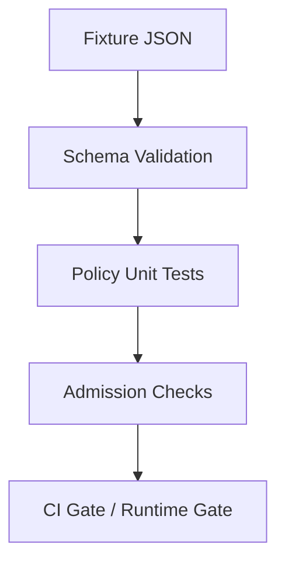
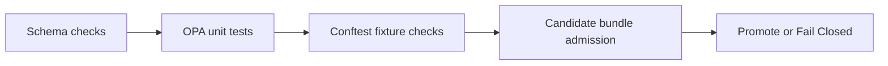
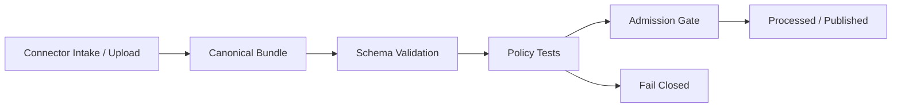

<!-- [KFM_META_BLOCK_V2]
doc_id: kfm://doc/PLACEHOLDER-GENEALOGY-POLICY-TESTS-README
title: Policy Tests: Genealogy
type: standard
version: v1
status: draft
owners: NEEDS VERIFICATION
created: 2026-03-29
updated: 2026-03-29
policy_label: restricted
related:
  - policy/genealogy/README.md
  - docs/connectors/genealogy/README.md
  - contracts/genealogy/
  - tests/policy/README.md
tags: [kfm, genealogy, policy, tests]
notes: Source-bounded; no mounted repo checkout in this session; live paths/workflows/owners NEED VERIFICATION before merge.
[/KFM_META_BLOCK_V2] -->

# Policy Tests: Genealogy

Purpose: governed negative-test and admission-test surface for genealogy policy bundles.

> [!IMPORTANT]
> **Truth posture:** **PROPOSED**
> **Evidence posture:** Source-bounded in this session; no mounted repo checkout; live paths, workflow names, policy packaging conventions, and fixture-loading mechanics **NEED VERIFICATION** before merge.
> **Architecture fit:** `tests/` is a governed verification surface, not a generic QA bucket. These tests prove fail-closed behavior for consent, living-person handling, DNA restrictions, provenance completeness, and publication controls.

## Impact

**Status:** `experimental`
**Owners:** `NEEDS VERIFICATION`
**Path:** `tests/policy/genealogy/README.md`
**Surface:** governed verification / fail-closed policy testing
**Upstream:** `policy/genealogy/`, `contracts/genealogy/`, connector receipts, normalized bundles
**Downstream:** CI promotion gates, runtime admission checks, release/publication blocking, audit/correction workflows


**Quick jumps:** [Scope](#scope) · [Repo fit](#repo-fit) · [Inputs](#inputs) · [Exclusions](#exclusions) · [Directory sketch](#directory-sketch) · [Quickstart](#quickstart) · [CLI examples](#cli-examples) · [Expected outcomes matrix](#expected-outcomes-matrix) · [CI integration](#ci-integration) · [Definition of done](#definition-of-done) · [Open verification items](#open-verification-items)

---

## Scope

This test surface validates the **genealogy policy bundle** for:

* consent enforcement
* revocation fail-closed behavior
* living-person redaction and publication blocking
* DNA-sensitive handling restrictions
* provenance completeness requirements
* release/publication admission decisions

These tests exist to prove that KFM does the correct thing when conditions are unsafe, incomplete, or rights-constrained.

This surface should heavily favor **negative tests** over happy-path demonstrations.

### What this test surface proves

| Proof target               | What must be demonstrated                                                             |
| -------------------------- | ------------------------------------------------------------------------------------- |
| Consent                    | Missing, invalid, revoked, or mismatched consent blocks admission                     |
| Trust membrane             | Public publication is denied when restricted genealogy content would cross boundaries |
| Living persons             | Living and unknown-living-status records do not leak to public surfaces               |
| DNA sensitivity            | Raw DNA, matches, and segments stay restricted                                        |
| Provenance                 | Incomplete evidence/provenance fails closed                                           |
| Runtime dependency posture | Missing revocation manifest or equivalent policy state blocks progression             |
| Policy composition         | Combined deny logic still behaves deterministically when multiple violations coexist  |

---

## Repo fit

**Proposed path:** `tests/policy/genealogy/README.md`

### Upstream

* `policy/genealogy/`
* `contracts/genealogy/*.schema.json`
* connector receipts and normalized bundles
* consent / revocation-state injection contract
* release candidate bundle inputs

### Downstream

* CI promotion gates
* runtime admission checks
* release/publish blocking
* audit and correction workflows

### Adjacent surfaces

| Path                                  | Role                                                              |
| ------------------------------------- | ----------------------------------------------------------------- |
| `policy/genealogy/`                   | Canonical genealogy policy bundle under test                      |
| `contracts/genealogy/`                | Schema contracts that should be validated before policy admission |
| `docs/connectors/genealogy/README.md` | Connector + ingest architecture                                   |
| `tests/contracts/genealogy/`          | Contract validation surface                                       |
| `tests/e2e/genealogy/`                | End-to-end admission / publish proofs                             |

> [!NOTE]
> Exact paths above are **PROPOSED** and **NEED VERIFICATION** against the live repo tree.

---

## Inputs

This test surface accepts:

* Rego policy modules
* JSON fixtures representing ingest and publish inputs
* optional release candidate JSON documents
* optional runtime-like context injection for revocation state and target visibility

### Minimum tested input sections

| Section             | Why it matters                           |
| ------------------- | ---------------------------------------- |
| `mode`              | Distinguishes ingest vs publish behavior |
| `target.visibility` | Determines public/restricted logic       |
| `artifact`          | Binds hash/class/source checks           |
| `consent`           | Consent validity and permissions         |
| `bundle`            | Living-person and DNA-content checks     |
| `provenance`        | Completeness enforcement                 |
| `runtime`           | Revocation-state fail-closed behavior    |

### Accepted inputs

| Input class                 | Typical format      | Notes                                  |
| --------------------------- | ------------------- | -------------------------------------- |
| Policy modules              | `.rego`             | OPA / Conftest compatible              |
| Fixtures                    | `.json`             | Minimal, explicit, reproducible        |
| Candidate admission bundles | `.json`             | Release/runtime-like evaluation inputs |
| Test wrappers               | Make/task/CI config | **NEEDS VERIFICATION** in live tree    |

---

## Exclusions

This test surface does **not**:

* validate GEDCOM parser correctness in depth
* test canonical schema semantics beyond policy-relevant structure
* prove connector OAuth logic
* prove media rights-clearing workflows
* replace schema contract tests
* replace end-to-end ingestion tests

Those belong in adjacent surfaces such as:

* `tests/contracts/genealogy/`
* `tests/e2e/genealogy/`
* connector-specific integration tests

---

## Directory sketch

```text
tests/
  policy/
    genealogy/
      README.md
      consent_test.rego
      living_persons_test.rego
      dna_sensitive_test.rego
      provenance_test.rego
      publication_test.rego
      fixtures/                 # optional local mirror if repo prefers test-local fixtures

policy/
  genealogy/
    helpers.rego
    consent.rego
    living_persons.rego
    dna_sensitive.rego
    provenance.rego
    publication.rego
    fixtures/
      valid_ingest.json
      missing_consent.json
      living_publish_leak.json
      dna_publication_leak.json
      revoked_consent.json
      missing_provenance.json
```

> [!WARNING]
> The layout above is a **PROPOSED** sketch only. Verify exact repo placement, filenames, and fixture-loading conventions before merge.

---

## Quickstart

Run the genealogy policy checks in three layers:

```bash
# 1) compile and run rego tests
opa test policy/genealogy tests/policy/genealogy

# 2) check known-good restricted fixture
conftest test policy/genealogy/fixtures/valid_ingest.json --policy policy/genealogy

# 3) inspect deny output for a known-bad public leak
opa eval \
  --data policy/genealogy \
  --input policy/genealogy/fixtures/dna_publication_leak.json \
  "data.kfm.genealogy.publication.deny"
```

> [!CAUTION]
> Command names, policy roots, and target package names are **NEEDS VERIFICATION** in the live repository.

---

## Test families

### 1) Consent tests

Focus: **admission is impossible without valid consent**.

Required negative cases:

* consent object missing
* consent present flag false
* invalid signature
* revoked consent
* artifact hash mismatch
* DNA content present but `allow_dna_processing=false`
* public publication attempted with `redistribution=false`

Representative assertions:

* `allow == false`
* `deny` contains explicit fail-closed reason
* warnings/obligations are present only when appropriate

---

### 2) Living-person policy tests

Focus: **no public leakage of living or unresolved-living-status persons**.

Required negative cases:

* living person in public publish bundle
* unknown living status in public publish bundle
* ingest containing living persons while consent forbids living-person processing

Required obligation/redaction cases:

* living person on restricted internal surface produces redaction obligation if pipeline design allows partial continuation
* unknown living status on public target yields deny, not warn-only

Representative assertions:

* public target denied
* redaction obligations emitted for affected `person_id`s
* deny text points to living-person restriction rather than a generic failure only

---

### 3) DNA-sensitive tests

Focus: **DNA data remains restricted**.

Required negative cases:

* raw DNA bundle on public target
* DNA kits on public target
* segment records on public target
* match records on public target
* DNA content present but consent denies DNA processing

Required obligation cases:

* restricted DNA bundle emits `dna_sensitive_restriction` obligation or equivalent

Representative assertions:

* public DNA publication denied
* segment leakage specifically denied
* match leakage specifically denied
* bundle labels such as `dna_sensitive` are respected even if arrays are empty but artifact class is DNA-related

---

### 4) Provenance tests

Focus: **authoritative genealogy bundles cannot proceed with incomplete evidence**.

Required negative cases:

* provenance block missing entirely
* completeness flag false
* missing field refs present
* record coverage below threshold
* authoritative records lacking evidence links

Representative assertions:

* denial on incomplete provenance
* denial text identifies provenance completeness
* coverage threshold failure is explicit and machine-readable if possible

---

### 5) Publication composition tests

Focus: **composed policy behavior remains deterministic**.

These tests combine multiple violations in one input, for example:

* public DNA bundle with revoked consent
* living-person public bundle with redistribution false
* public bundle with missing provenance and missing revocation manifest

Representative assertions:

* `allow == false`
* multiple deny reasons may coexist
* the presence of one deny does not suppress other critical deny outputs unless the repo intentionally short-circuits
* obligation output does not mask deny results

---

### 6) Runtime dependency tests

Focus: **policy state dependencies fail closed**.

Required negative cases:

* revocation manifest unavailable
* required target visibility missing
* required runtime context absent
* publication target shape malformed

Representative assertions:

* missing runtime dependency blocks progression
* failure reason is visible and not silently downgraded to warn

---

## Execution model

The most useful execution model has **three layers**:



### Layer 1: schema sanity

Validate fixtures or candidate bundles against JSON Schema first, where applicable.

### Layer 2: policy unit tests

Run Rego tests that directly assert deny/allow/obligation behavior on known fixtures.

### Layer 3: admission checks

Run `conftest` or `opa eval` against actual bundle-shaped inputs exactly as CI/runtime will.

This layered approach catches:

* malformed fixtures
* broken policy modules
* integration mismatches between modules and real input shapes

---

## CLI examples

### Run policy tests

```bash
opa test policy/genealogy tests/policy/genealogy
```

### Run Conftest against a fixture

```bash
conftest test policy/genealogy/fixtures/valid_ingest.json --policy policy/genealogy
```

### Evaluate allow decision directly

```bash
opa eval \
  --data policy/genealogy \
  --input policy/genealogy/fixtures/valid_ingest.json \
  "data.kfm.genealogy.publication.allow"
```

### Evaluate deny set directly

```bash
opa eval \
  --data policy/genealogy \
  --input policy/genealogy/fixtures/living_publish_leak.json \
  "data.kfm.genealogy.publication.deny"
```

### Example make-style wrapper (PROPOSED)

```bash
make test-policy-genealogy
```

---

## Fixture strategy

Fixtures should be **small, explicit, and single-purpose** unless testing policy composition.

### Fixture design rules

| Rule                                                    | Why                        |
| ------------------------------------------------------- | -------------------------- |
| Prefer one clear violation per negative fixture         | Easier diagnosis           |
| Keep fields minimal but realistic                       | Easier maintenance         |
| Include explicit `mode` and `target.visibility`         | Avoids ambiguous branching |
| Preserve stable identifiers                             | Reproducible assertions    |
| Use dedicated composition fixtures for multi-deny cases | Deterministic review       |

### Recommended fixture families

| Fixture                            | Purpose                        |
| ---------------------------------- | ------------------------------ |
| `valid_ingest.json`                | Known-good restricted ingest   |
| `missing_consent.json`             | Consent fail-closed            |
| `invalid_signature.json`           | Signature fail-closed          |
| `artifact_hash_mismatch.json`      | Binding fail-closed            |
| `revoked_consent.json`             | Revocation fail-closed         |
| `living_publish_leak.json`         | Public living-person block     |
| `unknown_living_publish.json`      | Public unknown-status block    |
| `dna_publication_leak.json`        | Public DNA block               |
| `dna_processing_not_allowed.json`  | DNA ingest blocked by consent  |
| `missing_provenance.json`          | Provenance fail-closed         |
| `missing_revocation_manifest.json` | Runtime dependency fail-closed |
| `multi_violation_publication.json` | Composed deny set              |

> [!TIP]
> Not all recommended fixtures above have been generated in this session. Treat several as **PROPOSED additions** to strengthen the suite.

---

## Expected outcomes matrix

| Scenario                               | Allow | Deny |  Warn |                           Obligation |
| -------------------------------------- | ----: | ---: | ----: | -----------------------------------: |
| valid restricted ingest                |   yes |   no | maybe |                                maybe |
| missing consent                        |    no |  yes |    no |                                   no |
| invalid signature                      |    no |  yes |    no |                                   no |
| revoked consent                        |    no |  yes |    no |                                   no |
| artifact hash mismatch                 |    no |  yes |    no |                                   no |
| public living-person bundle            |    no |  yes |    no |          optional redaction metadata |
| public unknown-living bundle           |    no |  yes |    no |          optional redaction metadata |
| public DNA bundle                      |    no |  yes |    no | maybe restricted-handling obligation |
| DNA ingest without DNA permission      |    no |  yes |    no |                                   no |
| incomplete provenance                  |    no |  yes |    no |                                   no |
| research-only restricted ingest        |   yes |   no |   yes |                                  yes |
| redistribution false on public publish |    no |  yes | maybe |                                   no |

---

## Suggested test file responsibilities

### `consent_test.rego`

Should cover:

* consent presence
* signature validity
* revocation handling
* artifact hash matching
* redistribution/publication interaction

### `living_persons_test.rego`

Should cover:

* public living-person denial
* public unknown-living denial
* restricted redaction obligations
* consent interaction for living-person processing

### `dna_sensitive_test.rego`

Should cover:

* public DNA denial
* segment prohibition
* match prohibition
* DNA consent gating
* DNA obligation emission

### `provenance_test.rego`

Should cover:

* complete vs incomplete provenance
* missing refs
* threshold checks
* missing provenance block entirely

### `publication_test.rego`

Should cover:

* composed deny aggregation
* final `allow` result
* deny set stability
* obligation propagation from child modules

---

## CI integration

Recommended CI sequence:



### Minimum CI gates

| Gate                                          | Required |
| --------------------------------------------- | -------- |
| Rego compilation succeeds                     | yes      |
| Unit tests pass                               | yes      |
| Known-bad fixtures denied                     | yes      |
| Known-good restricted fixture allowed         | yes      |
| Candidate publish bundle free of deny results | yes      |
| Evaluation errors treated as failures         | yes      |

### Fail-closed CI rule

Any of the following should fail the job:

* policy compile error
* test failure
* missing fixture required by test target
* runtime context not injected when required
* inability to load revocation state
* ambiguous `allow`/`deny` result due to input shape drift

---

## Diagram: where this surface sits



---

## Definition of done

A merge-ready genealogy policy test surface should satisfy all of the following:

* policy modules compile cleanly
* every deny family has at least one explicit negative test
* public living-person leakage is covered
* public DNA leakage is covered
* missing provenance is covered
* missing revocation state is covered
* at least one composition test exists
* one restricted, consent-valid ingest fixture passes
* CI wiring exists or is clearly stubbed and marked **NEEDS VERIFICATION**
* test docs explain how to reproduce failures locally

### Task list

* [ ] Verify live repo paths for `policy/genealogy/` and `tests/policy/genealogy/`
* [ ] Add missing negative fixtures for invalid signature and hash mismatch
* [ ] Add composition fixture covering multiple simultaneous denies
* [ ] Wire `opa test` into CI
* [ ] Wire `conftest test` candidate-bundle admission into CI
* [ ] Confirm deny message / obligation code stability expectations
* [ ] Add CODEOWNERS coverage if missing
* [ ] Mark all unverified paths and targets before merge

---

## Usage notes

### Prefer negative tests

This surface is trust-bearing. It is more important to prove **unsafe inputs are blocked** than to collect many happy-path examples.

### Keep deny messages stable

If downstream CI or receipts depend on deny strings or obligation codes, avoid churn. Prefer structured obligation codes where possible.

### Test exact publication targets

Public vs restricted behavior is central here. Do not rely on implicit defaults in fixtures.

### Treat missing context as unsafe

If the policy expects `runtime.revocation_manifest_loaded` and it is absent, tests should verify deny—not implicit permissive behavior.

---

## FAQ

### Why so many negative tests?

Because this surface handles rights-sensitive genealogy and DNA data. KFM doctrine allows negative outcomes as first-class valid behavior: deny, abstain, generalize, withdraw, supersede.

### Why test public vs restricted separately?

Because the trust membrane depends on that distinction. Restricted internal processing may be allowed while public release is still prohibited.

### Should these tests validate schema too?

Only lightly. Full schema conformance belongs in contract tests. Here, the goal is policy behavior over policy-relevant shapes.

### Should derived graph/search outputs be tested here?

Only if publication policy directly governs them. Otherwise, test them in their own derived-surface policy or e2e suites.

---

## Open verification items

These items are **NEEDS VERIFICATION** before merge:

* exact live path of the genealogy policy bundle
* whether policy fixtures live under `policy/` or `tests/`
* current OPA / Conftest versions in CI
* test naming conventions already used in `tests/policy/`
* whether deny/warn/obligation shapes match repo-wide policy standards
* whether release admission uses `publication.allow` or a different package entrypoint
* whether a Makefile, task runner, or CI workflow target already exists for policy tests
* current CODEOWNERS for `policy/` and `tests/policy/`

---

## Appendix: example local workflow

```bash
# compile and run tests
opa test policy/genealogy tests/policy/genealogy

# inspect a passing fixture
opa eval \
  --data policy/genealogy \
  --input policy/genealogy/fixtures/valid_ingest.json \
  "data.kfm.genealogy.publication.allow"

# inspect a failing fixture
opa eval \
  --data policy/genealogy \
  --input policy/genealogy/fixtures/missing_consent.json \
  "data.kfm.genealogy.publication.deny"
```

---

**Bottom line:** this test surface is the proof that genealogy policy is not aspirational prose. It is executable, reproducible, fail-closed enforcement at the exact boundary where consent, privacy, provenance, and publication risk meet.

[Back to top](#policy-tests-genealogy)
