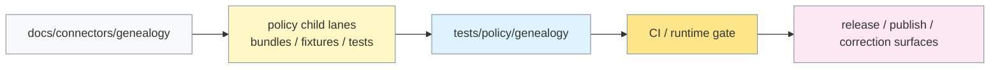

<!-- [KFM_META_BLOCK_V2]
doc_id: kfm://doc/PLACEHOLDER-GENEALOGY-POLICY-TESTS-README
title: Policy Tests: Genealogy
type: standard
version: v1
status: draft
owners: @bartytime4life
created: 2026-03-29
updated: 2026-04-04
policy_label: restricted
related:
  - tests/policy/README.md
  - tests/README.md
  - docs/connectors/genealogy/README.md
  - policy/README.md
  - .github/CODEOWNERS
  - .github/workflows/README.md
tags: [kfm, genealogy, policy, tests]
notes: Current public main confirms this README path and adjacent genealogy connector doc; executable genealogy-specific bundle and contract subpaths remain proposed or need verification.
[/KFM_META_BLOCK_V2] -->

# Policy Tests: Genealogy

Purpose: repo-facing verification contract for genealogy policy behavior, negative outcomes, and future parity checks.

> Status: `experimental`  
> Owners: `@bartytime4life` (current `/.github/CODEOWNERS` fallback for `/tests/`)  
> Path: `tests/policy/genealogy/README.md`  
> Repo fit: narrow genealogy-specific policy-verification surface under [`../README.md`](../README.md), paired with [`../../../docs/connectors/genealogy/README.md`](../../../docs/connectors/genealogy/README.md), and subordinate to the repo-wide policy and contract lanes in [`../../../policy/README.md`](../../../policy/README.md) and [`../../../contracts/README.md`](../../../contracts/README.md)  
> Quick jump: [Scope](#scope) · [Repo fit](#repo-fit) · [Inputs](#inputs) · [Exclusions](#exclusions) · [Directory tree](#directory-tree) · [Quickstart](#quickstart) · [Usage](#usage) · [Diagram](#diagram) · [Tables](#tables) · [Task list](#task-list--definition-of-done) · [FAQ](#faq) · [Appendix](#appendix)


> [!IMPORTANT]
> Current public `main` confirms this directory and this README. It does **not** currently expose checked-in sibling test files in `tests/policy/genealogy/`, and it does **not** prove a public `policy/genealogy/` or `contracts/genealogy/` subtree. This README therefore documents a **real repo path** with a **partly proposed executable target state**.

---

## Scope

`tests/policy/genealogy/` is the genealogy-specific edge of KFM’s policy-behavior proof lane.

The job of this directory is not to redefine policy law. Its job is to make policy behavior inspectable under pressure: consent failure, living-person restrictions, DNA-sensitive handling, provenance incompleteness, runtime dependency loss, and public-vs-restricted publication outcomes.

### Evidence boundary used here

| Label | What this README treats as settled |
|---|---|
| **CONFIRMED** | Current public `main` exposes `tests/policy/genealogy/README.md`, the parent verification lanes under `tests/`, the top-level `policy/` lane, the companion genealogy connector doc, and broad `CODEOWNERS` coverage for `/tests/` and `/policy/`. |
| **INFERRED** | Genealogy-specific proof needs should align with the repo’s broader `tests/policy/` and `policy/` taxonomy even when exact file placement is not yet branch-visible. |
| **PROPOSED** | Executable genealogy-specific bundle, fixture, contract, and parity artifacts that fit current doctrine but are not directly visible on public `main`. |
| **UNKNOWN / NEEDS VERIFICATION** | Checked-out branch contents beyond public `main`, exact OPA / Conftest versions, actual workflow YAML, private rulesets, and the final home of genealogy-specific bundle fixtures and contracts. |

### What this surface must prove

| Proof burden | What must be demonstrated |
|---|---|
| Consent | Missing, invalid, revoked, or mismatched consent blocks admission. |
| Trust membrane | Public publication is denied when restricted genealogy content would cross into outward-facing surfaces. |
| Living persons | Living and unknown-living-status records do not leak to public surfaces. |
| DNA sensitivity | Raw DNA, kits, matches, and segments remain restricted by default. |
| Provenance | Incomplete evidence, missing refs, or weak coverage fail closed. |
| Runtime dependency posture | Missing revocation state or missing runtime context blocks progression. |
| Composition | Multiple simultaneous violations still produce deterministic, visible outcomes. |

[Back to top](#policy-tests-genealogy)

---

## Repo fit

Path: `tests/policy/genealogy/README.md`  
Role in repo: directory-level contract for genealogy-specific policy verification.

### Current public-main snapshot

| Surface | Public `main` status | What that proves |
|---|---|---|
| `tests/policy/genealogy/README.md` | Present | This directory is real, checked in, and already documented. |
| Other files under `tests/policy/genealogy/` | Not visible on public `main` | The current public surface is README-only. |
| [`../README.md`](../README.md) | Present | The parent `tests/policy/` lane already defines repo-facing policy verification boundaries. |
| [`../../README.md`](../../README.md) | Present | The broader `tests/` taxonomy is already established. |
| [`../../../docs/connectors/genealogy/README.md`](../../../docs/connectors/genealogy/README.md) | Present | A companion genealogy intake/governance document already exists. |
| [`../../../policy/README.md`](../../../policy/README.md) | Present | Top-level policy ownership belongs upstream from this directory. |
| `../../../policy/bundles/`, `../../../policy/fixtures/`, `../../../policy/tests/` | Present as documented child lanes | Current repo shape favors top-level policy sublanes rather than a visible `policy/genealogy/` subtree. |
| `policy/genealogy/` | Not visible on public `main` | Any genealogy-specific bundle root under that exact path remains **PROPOSED**. |
| `contracts/genealogy/` | Not visible on public `main` | Any genealogy-specific contract sublane remains **PROPOSED**. |
| [`../../../.github/workflows/README.md`](../../../.github/workflows/README.md) | Present; workflow lane documented as README-only on public `main` | CI references here are proof burdens, not proof of checked-in merge-gate YAML. |
| [`../../../.github/CODEOWNERS`](../../../.github/CODEOWNERS) | Present | Broad ownership coverage exists for `/tests/` and `/policy/`. |

### Upstream, lateral, and downstream links

| Direction | Surface | Why it matters |
|---|---|---|
| Upstream | [`../README.md`](../README.md) | Defines the narrower `tests/policy/` verification boundary this directory extends. |
| Upstream | [`../../../docs/connectors/genealogy/README.md`](../../../docs/connectors/genealogy/README.md) | Defines connector/intake posture, source families, and publication risk. |
| Lateral | [`../../../policy/README.md`](../../../policy/README.md) | Owns executable policy law and top-level policy-lane structure. |
| Lateral | [`../../../contracts/README.md`](../../../contracts/README.md) | Owns machine-contract lanes that genealogy policy should eventually consume. |
| Lateral | [`../../../schemas/README.md`](../../../schemas/README.md) | Keeps schema-home authority explicit instead of duplicating it here. |
| Guardrail | [`../../../.github/workflows/README.md`](../../../.github/workflows/README.md) | Captures the current public workflow visibility boundary. |
| Downstream | release, runtime, and correction surfaces | This lane should prove behavior that later gates admission, publication, rollback, and trust-visible correction. |

> [!NOTE]
> Keep bundle law upstream and proof here. If a change mostly defines policy law, it belongs under the top-level `policy/` child lanes. If it proves policy behavior against realistic genealogy cases, it belongs here.

[Back to top](#policy-tests-genealogy)

---

## Inputs

Current public `main` does **not** yet show checked-in executable genealogy test artifacts here. The table below defines the intended input contract for this surface once it grows beyond README-only status.

| Input class | What belongs here | Status |
|---|---|---|
| Repo-facing outcome fixtures | Small, explicit cases that prove `allow`, `deny`, `restrict`, `generalize`, `needs-review`, or similar behavior for genealogy-specific inputs | **PROPOSED** |
| Runtime parity checks | Cases that prove release/runtime outcomes stay aligned with policy meaning | **PROPOSED** |
| Decision-grammar checks | Assertions over deny reasons, obligation codes, and stable outcome vocabularies | **PROPOSED** |
| Correction / withdrawal drills | Cases where trust state changes after publication and must remain visible | **PROPOSED** |
| Tiny seam notes | Minimal docs that explain fixture intent, parity expectations, or runner assumptions | **PROPOSED** |

### Minimum data shape for meaningful cases

| Section | Why it matters |
|---|---|
| `mode` | Distinguishes ingest vs publish behavior. |
| `target.visibility` | Separates public from restricted handling. |
| `artifact` | Binds class, source, and hash-sensitive checks. |
| `consent` | Carries validity, redistribution, and DNA-permission signals. |
| `bundle` | Carries living-person and DNA-sensitive content. |
| `provenance` | Carries completeness, refs, and coverage semantics. |
| `runtime` | Carries revocation-state and dependency posture where required. |

[Back to top](#policy-tests-genealogy)

---

## Exclusions

This directory should stay narrow.

| Does **not** belong here | Put it here instead | Why |
|---|---|---|
| Executable policy bundle law | [`../../../policy/README.md`](../../../policy/README.md) and its child lanes | Bundle law and repo-facing proof are adjacent, not identical. |
| Canonical contracts or shared schema definitions | [`../../../contracts/README.md`](../../../contracts/README.md) | This directory should consume contracts, not fork them. |
| Schema-home doctrine | [`../../../schemas/README.md`](../../../schemas/README.md) | Schema ownership should stay singular. |
| Connector intake architecture | [`../../../docs/connectors/genealogy/README.md`](../../../docs/connectors/genealogy/README.md) | Ingest design and test proof are different surfaces. |
| Runtime glue, loaders, or mediators | package/runtime seams verified elsewhere | Verification should not become shadow implementation. |
| End-to-end release artifacts as the authoritative record | broader `tests/e2e/` and release-proof surfaces | This lane may test those behaviors, but it does not own their primary record. |
| Generic GEDCOM parser correctness | contract, parser, or ingestion tests | Policy behavior is the focus here. |

[Back to top](#policy-tests-genealogy)

---

## Directory tree

### Current public branch

```text
tests/
  policy/
    genealogy/
      README.md
```

### Target executable split (PROPOSED)

```text
policy/
  bundles/
    genealogy/
      consent.rego
      living_persons.rego
      dna_sensitive.rego
      provenance.rego
      publication.rego
  fixtures/
    genealogy/
      valid_ingest.json
      missing_consent.json
      revoked_consent.json
      living_publish_leak.json
      dna_publication_leak.json
      missing_provenance.json
  tests/
    genealogy/
      bundle_outcomes.rego

tests/
  policy/
    genealogy/
      README.md
      runtime_parity.md
      release_parity.md
      correction_parity.md
      fixtures/   # only if repo-facing verification truly needs local copies
```

> [!WARNING]
> The target buildout above is intentionally aligned to the **current visible top-level `policy/` taxonomy** rather than to a non-visible `policy/genealogy/` subtree. Use the active checkout—not this README alone—to decide final placement.

[Back to top](#policy-tests-genealogy)

---

## Quickstart

### 1) Confirm the currently checked-in genealogy surfaces

```bash
# run from repo root
ls tests/policy/genealogy
ls docs/connectors/genealogy
ls policy
ls policy/bundles policy/fixtures policy/tests 2>/dev/null || true

# explicitly verify any branch-local genealogy-specific paths before using them
ls policy/genealogy 2>/dev/null || true
ls contracts/genealogy 2>/dev/null || true
ls tests/contracts/genealogy 2>/dev/null || true
ls tests/e2e/genealogy 2>/dev/null || true
```

### 2) Read the three docs that already define the seam

1. [`../README.md`](../README.md)
2. [`../../../docs/connectors/genealogy/README.md`](../../../docs/connectors/genealogy/README.md)
3. [`../../../policy/README.md`](../../../policy/README.md)

### 3) Only then wire executable targets

Add the first negative fixture only after the active checkout proves where bundle law, fixtures, and repo-facing assertions actually live.

> [!CAUTION]
> Do **not** paste path-specific `opa` or `conftest` commands into CI until you have reverified the real genealogy bundle root on the active branch.

[Back to top](#policy-tests-genealogy)

---

## Usage

Use this directory to prove behavior, not merely to declare aspirations.

### Working rule

If a new artifact mostly defines policy law, place it under the top-level `policy/` child lanes.  
If it proves that genealogy policy survives into repo-facing outcomes—release, runtime, correction, or public-vs-restricted parity—it belongs here.

### Core test families

| Family | Must fail closed on | Must expose clearly |
|---|---|---|
| Consent | missing consent, invalid signature, revoked consent, hash mismatch, redistribution/publication conflict | stable deny reason or obligation code |
| Living persons | living or unknown-living-status material on public targets; living-person processing blocked by consent | public deny, plus any permitted restricted redaction obligation |
| DNA sensitivity | raw DNA, kits, matches, segments, or DNA processing without permission | deny plus any explicit restricted-handling obligation |
| Provenance | missing provenance block, incomplete coverage, missing refs | provenance-specific deny behavior |
| Runtime dependency | missing revocation manifest, missing visibility target, absent runtime context | deny rather than silent warn-only downgrade |
| Composition | multiple simultaneous violations | deterministic multi-reason outcomes |

### Operating guidance

- Favor **negative** cases over happy-path accumulation.
- Keep public and restricted targets explicit in every consequential fixture.
- Prefer structured reason and obligation codes over prose-only assertions.
- Treat missing context as unsafe.
- Keep correction-bearing states visible; do not collapse `withdrawn`, `superseded`, or narrowed-visibility behavior into a generic pass/fail blur.

[Back to top](#policy-tests-genealogy)

---

## Diagram



**Reading rule:** on current public `main`, the connector doc and this README are directly visible; the top-level `policy/` lane is visible; genealogy-specific executable subpaths under that lane remain proposed until reverified on the active checkout.

[Back to top](#policy-tests-genealogy)

---

## Tables

### Expected outcomes matrix

| Scenario | Allow | Deny | Warn | Obligation |
|---|---:|---:|---:|---:|
| valid restricted ingest | yes | no | maybe | maybe |
| missing consent | no | yes | no | no |
| invalid signature | no | yes | no | no |
| revoked consent | no | yes | no | no |
| artifact hash mismatch | no | yes | no | no |
| public living-person bundle | no | yes | no | optional redaction metadata |
| public unknown-living bundle | no | yes | no | optional redaction metadata |
| public DNA bundle | no | yes | no | maybe restricted-handling obligation |
| DNA ingest without DNA permission | no | yes | no | no |
| incomplete provenance | no | yes | no | no |
| research-only restricted ingest | yes | no | yes | yes |
| redistribution false on public publish | no | yes | maybe | no |

### Minimum CI gates

| Gate | Required |
|---|---|
| Policy compiles cleanly | yes |
| Unit / bundle-local assertions pass | yes |
| Known-bad genealogy fixtures deny | yes |
| At least one restricted, consent-valid case passes | yes |
| Candidate publish input is free of deny results | yes |
| Evaluation errors fail closed | yes |

[Back to top](#policy-tests-genealogy)

---

## Task list / definition of done

A merge-ready genealogy policy proof surface should satisfy all of the following:

- [ ] Current public-main README-only state has been replaced by at least one real proof artifact on the active checkout.
- [ ] Bundle law, fixture placement, and repo-facing verification placement are reverified against the active branch.
- [ ] Every deny family has at least one explicit negative case.
- [ ] Public living-person leakage is covered.
- [ ] Public DNA leakage is covered.
- [ ] Missing provenance is covered.
- [ ] Missing revocation state is covered.
- [ ] At least one composition case exists.
- [ ] One restricted, consent-valid case passes.
- [ ] CI wiring exists or is explicitly stubbed and marked `NEEDS VERIFICATION`.
- [ ] The README explains how to reproduce failures without implying nonexistent paths.

[Back to top](#policy-tests-genealogy)

---

## FAQ

### Why keep so many negative cases?

Because genealogy and DNA surfaces are rights-sensitive. In KFM, `deny`, `abstain`, `generalize`, `withdraw`, and `supersede` are valid trust-preserving outcomes, not embarrassing edge cases.

### Why not author bundle law here?

Because the current repo already separates top-level `policy/` ownership from repo-facing proof under `tests/policy/`. This directory should prove behavior, not become a second policy-authority lane.

### Why separate public from restricted targets every time?

Because the trust membrane depends on that distinction. Restricted internal handling can still coexist with public denial.

### Why are so many paths still marked `NEEDS VERIFICATION`?

Because current public `main` proves this README and adjacent directory docs, but it does not yet prove the active branch’s exact executable genealogy bundle, fixture, or workflow layout.

[Back to top](#policy-tests-genealogy)

---

## Appendix

<details>
<summary><strong>Suggested seam names and responsibilities</strong></summary>

These names are kept stable here even if the active checkout shifts the exact file location.

| Seam | Responsibility |
|---|---|
| `consent` | consent presence, signature validity, revocation handling, artifact-hash binding, redistribution/publication interaction |
| `living_persons` | public living-person denial, unknown-status denial, restricted redaction obligations, consent interaction |
| `dna_sensitive` | public DNA denial, kit/match/segment prohibition, DNA consent gating, obligation emission |
| `provenance` | complete vs incomplete provenance, missing refs, threshold checks, missing provenance block entirely |
| `publication` | composed deny aggregation, final `allow` result, deny-set stability, obligation propagation |
| `runtime_dependency` | revocation manifest presence, target visibility presence, runtime context parity, malformed target-shape handling |

</details>

<details>
<summary><strong>Fixture starter list</strong></summary>

Use stable names even if the active checkout places fixtures under `policy/fixtures/genealogy/`, `tests/policy/genealogy/fixtures/`, or another verified lane.

| Fixture | Purpose |
|---|---|
| `valid_ingest.json` | Known-good restricted ingest |
| `missing_consent.json` | Consent fail-closed |
| `invalid_signature.json` | Signature fail-closed |
| `artifact_hash_mismatch.json` | Binding fail-closed |
| `revoked_consent.json` | Revocation fail-closed |
| `living_publish_leak.json` | Public living-person block |
| `unknown_living_publish.json` | Public unknown-status block |
| `dna_publication_leak.json` | Public DNA block |
| `dna_processing_not_allowed.json` | DNA ingest blocked by consent |
| `missing_provenance.json` | Provenance fail-closed |
| `missing_revocation_manifest.json` | Runtime dependency fail-closed |
| `multi_violation_publication.json` | Composed deny set |

</details>

<details>
<summary><strong>Illustrative local loop (PROPOSED after paths are verified)</strong></summary>

```bash
# substitute real verified paths from your checkout
OPA_BUNDLE_ROOT="<verify-on-checkout>"
FIXTURE_ROOT="<verify-on-checkout>"

opa test "$OPA_BUNDLE_ROOT" tests/policy/genealogy
conftest test "$FIXTURE_ROOT/valid_ingest.json" --policy "$OPA_BUNDLE_ROOT"

opa eval \
  --data "$OPA_BUNDLE_ROOT" \
  --input "$FIXTURE_ROOT/living_publish_leak.json" \
  "data.kfm.genealogy.publication.deny"
```

Use this only after confirming the actual bundle and fixture roots on the active branch.

</details>

<details>
<summary><strong>Open verification items</strong></summary>

- exact active-branch home of genealogy bundle law
- exact active-branch home of genealogy fixtures
- whether repo-facing genealogy wrappers should live here or under `policy/tests/`
- current OPA / Conftest versions
- current merge-blocking workflow YAML and required checks
- actual deny / warn / obligation shapes used by the active policy runtime
- whether genealogy-specific contract subpaths exist on the active branch
- whether end-to-end genealogy proof drills already exist elsewhere in the checkout

</details>

**Bottom line:** this directory should remain the smallest repo-facing proof that genealogy policy is operational, fail-closed, and reviewable—without pretending the active checkout exposes more executable surface than the current public evidence actually proves.

[Back to top](#policy-tests-genealogy)
