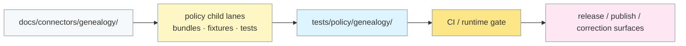

<!-- [KFM_META_BLOCK_V2]
doc_id: kfm://doc/tests/policy/genealogy/readme
title: tests/policy/genealogy
type: standard
version: v1
status: draft
owners: @bartytime4life
created: 2026-03-29
updated: 2026-04-16
policy_label: restricted
related: [
  ../README.md,
  ../../README.md,
  ../../../docs/connectors/genealogy/README.md,
  ../../../policy/README.md,
  ../../../contracts/README.md,
  ../../../schemas/README.md,
  ../../../.github/CODEOWNERS,
  ../../../.github/workflows/README.md
]
tags: [kfm, genealogy, policy, tests, consent, dna, publication-safety]
notes: [
  Current visible evidence confirms this README path and adjacent genealogy connector doc.
  Executable genealogy-specific policy bundles, fixtures, contracts, and workflow wiring remain partly proposed or need active-branch verification.
]
[/KFM_META_BLOCK_V2] -->

<a id="top"></a>

# `tests/policy/genealogy/`

Repo-facing verification contract for genealogy policy behavior, negative outcomes, and fail-closed publication control in KFM.

> [!NOTE]
> **Status:** `experimental`  
> **Owners:** `@bartytime4life`  
> **Path:** `tests/policy/genealogy/README.md`  
> **Posture:** policy-behavior proof · fail-closed · restricted sensitivity · public-main README-first  
> 
> 
> 
> 
> 
> 
> 
>
> **Quick jumps:** [Scope](#scope) · [Evidence posture](#evidence-posture) · [Repo fit](#repo-fit) · [Accepted inputs](#accepted-inputs) · [Exclusions](#exclusions) · [Directory tree](#directory-tree) · [Quickstart](#quickstart) · [Usage](#usage) · [Diagram](#diagram) · [Policy matrix](#policy-matrix) · [Task list](#task-list--definition-of-done) · [FAQ](#faq) · [Appendix](#appendix)

> [!IMPORTANT]
> This directory proves **policy behavior**, not policy authorship. Bundle law, contract authority, schema authority, and workflow enforcement should remain visible in their upstream homes.

> [!WARNING]
> Current public-facing evidence confirms this README path and adjacent genealogy docs, but it does **not** prove a mounted `policy/genealogy/` or `contracts/genealogy/` subtree, and it does **not** prove checked-in executable fixture files under this leaf. This document therefore stays explicit about what is **CONFIRMED** versus **PROPOSED**.

---

## Scope

`tests/policy/genealogy/` is the genealogy-specific edge of KFM’s policy-behavior proof lane.

Its job is to make policy behavior inspectable under pressure:

- missing or revoked consent
- living-person restrictions
- DNA-sensitive handling
- provenance incompleteness
- runtime dependency loss
- public-vs-restricted publication outcomes
- multi-violation composition

This leaf should help answer the question:

> “When genealogy material reaches a governed decision point, does policy fail closed, emit stable reasons or obligations, and preserve the trust membrane?”

### What this leaf must prove

| Proof burden | What must be demonstrated |
|---|---|
| Consent | missing, invalid, revoked, expired, or mismatched consent blocks progression |
| Trust membrane | public publication is denied when restricted genealogy content would cross outward-facing surfaces |
| Living persons | living and unknown-living-status records do not leak to public surfaces |
| DNA sensitivity | raw DNA, kits, matches, and segments remain restricted by default |
| Provenance | incomplete evidence, missing refs, or weak coverage fail closed |
| Runtime dependency posture | missing revocation state or missing runtime context blocks progression |
| Composition | multiple simultaneous violations still produce deterministic, inspectable outcomes |

### Truth labels used here

| Label | Meaning in this README |
|---|---|
| **CONFIRMED** | directly visible on the current repo-facing surface or strongly anchored by nearby authoritative docs |
| **INFERRED** | strongly suggested by adjacent docs and repeated KFM doctrine, but not re-proven here as mounted implementation |
| **PROPOSED** | commit-ready target shape consistent with current doctrine, not asserted as current branch fact |
| **UNKNOWN** | not supported strongly enough here to present as current fact |
| **NEEDS VERIFICATION** | specific path, workflow, owner, or executable placement that should be checked against the active checkout before merge |

[Back to top](#top)

---

## Evidence posture

| Surface or claim | Status | Why it matters |
|---|---|---|
| `tests/policy/genealogy/README.md` is a real checked-in repo path | **CONFIRMED** | this leaf is real, not hypothetical |
| Parent `tests/policy/` and broader `tests/` lanes already exist | **CONFIRMED** | genealogy policy proof belongs inside an existing verification taxonomy |
| Companion genealogy connector guidance already exists | **CONFIRMED** | this leaf should complement intake doctrine rather than duplicate it |
| Top-level `policy/` lane is the authority for policy law | **CONFIRMED** | this directory proves behavior and should not become a second policy-authority surface |
| Broad ownership coverage exists for `/tests/` and `/policy/` | **CONFIRMED / NEEDS NARROWER VERIFICATION** | current owner routing is supportable at broad scope, but narrower subpath routing should be rechecked on the active branch |
| Genealogy-specific bundle, fixture, and parity artifacts fit current doctrine | **INFERRED / PROPOSED** | these are sensible next steps but not proven here as mounted files |
| Public `policy/genealogy/` subtree | **NOT PROVEN / NEEDS VERIFICATION** | do not imply it as current fact |
| Public `contracts/genealogy/` subtree | **NOT PROVEN / NEEDS VERIFICATION** | do not imply it as current fact |
| Checked-in merge-gate workflow YAML for genealogy policy proof | **NEEDS VERIFICATION** | workflow proof belongs in actual YAML or workflow docs, not by implication here |

[Back to top](#top)

---

## Repo fit

**Path:** `tests/policy/genealogy/README.md`  
**Role in repo:** directory-level contract for genealogy-specific policy verification and negative-path proof.

### Path and neighboring surfaces

| Direction | Surface | Why it matters |
|---|---|---|
| Upstream | [`../README.md`](../README.md) | defines the narrower `tests/policy/` verification boundary this leaf extends |
| Upstream | [`../../README.md`](../../README.md) | keeps this lane subordinate to the broader `tests/` taxonomy |
| Domain intake | [`../../../docs/connectors/genealogy/README.md`](../../../docs/connectors/genealogy/README.md) | source families, ingest posture, and excluded connector behavior already live there |
| Policy authority | [`../../../policy/README.md`](../../../policy/README.md) | executable policy law and top-level policy-lane structure belong there |
| Contract authority | [`../../../contracts/README.md`](../../../contracts/README.md) | machine-contract lanes should remain singular there |
| Schema authority | [`../../../schemas/README.md`](../../../schemas/README.md) | schema-home caution remains visible there |
| Ownership | [`../../../.github/CODEOWNERS`](../../../.github/CODEOWNERS) | broad owner routing exists and should be rechecked for narrower subpath coverage |
| Workflow boundary | [`../../../.github/workflows/README.md`](../../../.github/workflows/README.md) | workflow expectations should be proven there or in actual YAML |

### Working placement rule

Put a change here when it primarily proves:

- deny-by-default behavior under genealogy pressure
- stable deny reasons or obligation codes
- public-vs-restricted handling parity
- correction-bearing or revocation-bearing policy consequences
- composition of multiple genealogy-specific violations

Move it elsewhere when it primarily defines:

- **policy law**
- **canonical machine shape**
- **connector implementation**
- **release proof**
- **runtime proof**

> [!TIP]
> Keep bundle law upstream and proof here. If a change mostly authors the rules, it belongs under the top-level `policy/` child lanes. If it proves those rules survive contact with realistic genealogy cases, it belongs here.

[Back to top](#top)

---

## Accepted inputs

Current public `main` does **not** show checked-in executable genealogy test artifacts here. The table below defines the intended input contract for this surface once it grows beyond README-only status.

| Input class | What belongs here | Status |
|---|---|---|
| Repo-facing outcome fixtures | small explicit cases that prove `allow`, `deny`, `restrict`, `generalize`, `needs-review`, or similar behavior for genealogy-specific inputs | **PROPOSED** |
| Runtime parity checks | cases that prove runtime outcomes stay aligned with policy meaning | **PROPOSED** |
| Release parity checks | cases that prove publish-path behavior remains policy-aligned | **PROPOSED** |
| Correction / withdrawal drills | cases where trust state changes after publication and must remain visible | **PROPOSED** |
| Decision-grammar checks | assertions over deny reasons, obligation codes, and stable outcome vocabularies | **PROPOSED** |
| Tiny seam notes | minimal docs explaining fixture intent, parity expectations, or runner assumptions | **PROPOSED** |

### Minimum data shape for meaningful cases

| Section | Why it matters |
|---|---|
| `mode` | distinguishes ingest vs publish vs review behavior |
| `target.visibility` | separates public from restricted handling |
| `artifact` | binds class, source, and hash-sensitive checks |
| `consent` | carries validity, redistribution, and DNA-permission signals |
| `bundle` | carries living-person and DNA-sensitive content |
| `provenance` | carries completeness, refs, and coverage semantics |
| `runtime` | carries revocation-state and dependency posture where required |

### Input rules

1. Favor **small negative fixtures** over broad happy-path accumulation.
2. Keep **public vs restricted targets explicit** in every consequential case.
3. Prefer **structured reason and obligation codes** over prose-only assertions.
4. Treat **missing context as unsafe**.
5. Keep **correction-bearing states visible**; do not blur `withdrawn`, `superseded`, or narrowed-visibility outcomes into generic pass/fail.
6. Keep **proof artifacts synthetic and reviewable**; do not normalize real family payloads into public test surfaces.

[Back to top](#top)

---

## Exclusions

| Does **not** belong here | Put it here instead | Why |
|---|---|---|
| Executable policy bundle law | [`../../../policy/README.md`](../../../policy/README.md) and its child lanes | bundle law and repo-facing proof are adjacent, not identical |
| Canonical contracts or shared schema definitions | [`../../../contracts/README.md`](../../../contracts/README.md), [`../../../schemas/README.md`](../../../schemas/README.md) | this directory should consume contracts and schemas, not fork them |
| Connector intake architecture | [`../../../docs/connectors/genealogy/README.md`](../../../docs/connectors/genealogy/README.md) | ingest design and policy proof are different surfaces |
| Runtime glue, loaders, or mediators | runtime/package seams verified elsewhere | verification should not become shadow implementation |
| End-to-end release artifacts as primary record | broader `tests/e2e/` and release-proof surfaces | this lane may test policy-bearing consequences, but it does not own the authoritative record |
| Generic GEDCOM parser correctness | parser, contract, or ingestion tests | policy behavior is the focus here |
| Raw genotype files, cleartext kit IDs, or direct vendor dumps | restricted intake lanes only | too sensitive and not necessary for repo-facing policy proof |
| Policy-vs-runtime authority settlement by prose | repo-wide policy/runtime docs | this leaf should stay honest about ownership boundaries |

[Back to top](#top)

---

## Directory tree

### Current public-facing claim

```text
tests/
  policy/
    genealogy/
      README.md
```

### Target executable split (`PROPOSED` / `NEEDS VERIFICATION`)

```text
policy/
  bundles/
    genealogy/
      consent.rego
      living_persons.rego
      dna_sensitive.rego
      provenance.rego
      publication.rego

  fixtures/
    genealogy/
      valid_ingest.json
      missing_consent.json
      revoked_consent.json
      living_publish_leak.json
      dna_publication_leak.json
      missing_provenance.json
      missing_revocation_manifest.json
      multi_violation_publication.json

  tests/
    genealogy/
      bundle_outcomes.rego

tests/
  policy/
    genealogy/
      README.md
      runtime_parity.md
      release_parity.md
      correction_parity.md
      fixtures/
```

### Why this proposed shape is conservative

| Proposed area | Why it is a sensible first wave |
|---|---|
| `policy/bundles/genealogy/` | aligns to the visible top-level `policy/` taxonomy instead of inventing a `policy/genealogy/` subtree |
| `policy/fixtures/genealogy/` | keeps policy-facing fixtures close to policy bundle evaluation |
| `policy/tests/genealogy/` | supports bundle-local assertions without collapsing proof into README prose |
| `tests/policy/genealogy/` parity notes | preserves repo-facing verification as a distinct surface from law authoring |

> [!WARNING]
> The layout above is intentionally aligned to the **visible top-level `policy/` taxonomy** rather than to an unproven `policy/genealogy/` subtree. Use the active checkout—not this README alone—to decide final placement.

[Back to top](#top)

---

## Quickstart

### 1) Confirm the currently checked-in genealogy surfaces

```bash
# run from repo root
find tests/policy/genealogy -maxdepth 3 -print 2>/dev/null | sort
find docs/connectors/genealogy -maxdepth 3 -print 2>/dev/null | sort
find policy -maxdepth 3 -print 2>/dev/null | sort

# explicitly verify any branch-local genealogy-specific paths before using them
find policy/genealogy -maxdepth 3 -print 2>/dev/null | sort || true
find contracts/genealogy -maxdepth 3 -print 2>/dev/null | sort || true
find tests/contracts/genealogy -maxdepth 3 -print 2>/dev/null | sort || true
```

### 2) Re-read the docs that already define the seam

```bash
sed -n '1,240p' tests/policy/README.md 2>/dev/null || true
sed -n '1,240p' docs/connectors/genealogy/README.md 2>/dev/null || true
sed -n '1,240p' policy/README.md 2>/dev/null || true
sed -n '1,220p' contracts/README.md 2>/dev/null || true
sed -n '1,220p' schemas/README.md 2>/dev/null || true
```

### 3) Reconfirm policy vocabulary before minting fixtures

```bash
grep -RIn \
  -e 'genealogy' \
  -e 'consent' \
  -e 'revocation' \
  -e 'living' \
  -e 'DNA' \
  -e 'deny' \
  -e 'obligation' \
  -e 'provenance' \
  tests policy contracts schemas docs 2>/dev/null || true
```

### 4) Add the first negative fixture only after path verification

A sensible first set is:

1. `missing_consent.json`
2. `living_publish_leak.json`
3. `dna_publication_leak.json`
4. `missing_provenance.json`
5. one consent-valid restricted case

### 5) Wire executable targets only after branch proof exists

Do **not** paste path-specific `opa` or `conftest` commands into CI until the active checkout proves the real genealogy bundle root, fixture root, and test root.

[Back to top](#top)

---

## Usage

Use this directory to prove behavior, not merely to declare aspirations.

### Core test families

| Family | Must fail closed on | Must expose clearly |
|---|---|---|
| Consent | missing consent, invalid signature, revoked consent, hash mismatch, redistribution/publication conflict | stable deny reason or obligation code |
| Living persons | living or unknown-living-status material on public targets; living-person processing blocked by consent | public deny, plus any permitted restricted redaction obligation |
| DNA sensitivity | raw DNA, kits, matches, segments, or DNA processing without permission | deny plus any explicit restricted-handling obligation |
| Provenance | missing provenance block, incomplete coverage, missing refs | provenance-specific deny behavior |
| Runtime dependency | missing revocation manifest, missing visibility target, absent runtime context | deny rather than silent warn-only downgrade |
| Composition | multiple simultaneous violations | deterministic multi-reason outcomes |

### Operating guidance

- Favor **negative cases** over happy-path accumulation.
- Keep **public** and **restricted** targets explicit in every consequential fixture.
- Prefer **reason and obligation codes** over prose-only assertions.
- Treat **missing context as unsafe**.
- Keep **withdrawal, supersession, and narrowed visibility** visible where policy meaning depends on them.

### Working rule

If a new artifact mostly defines policy law, place it under the top-level `policy/` child lanes.  
If it proves that genealogy policy survives into repo-facing outcomes—release, runtime, correction, or public-vs-restricted parity—it belongs here.

[Back to top](#top)

---

## Diagram



> [!NOTE]
> On the current visible surface, the connector doc, this README, the top-level `policy/` lane, and workflow-lane docs are real. Genealogy-specific executable subpaths under those lanes remain partly proposed until reverified on the active checkout.

[Back to top](#top)

---

## Policy matrix

### Expected outcomes matrix

| Scenario | Allow | Deny | Warn | Obligation |
|---|---:|---:|---:|---:|
| valid restricted ingest | yes | no | maybe | maybe |
| missing consent | no | yes | no | no |
| invalid signature | no | yes | no | no |
| revoked consent | no | yes | no | no |
| artifact hash mismatch | no | yes | no | no |
| public living-person bundle | no | yes | no | optional redaction metadata |
| public unknown-living bundle | no | yes | no | optional redaction metadata |
| public DNA bundle | no | yes | no | maybe restricted-handling obligation |
| DNA ingest without DNA permission | no | yes | no | no |
| incomplete provenance | no | yes | no | no |
| research-only restricted ingest | yes | no | yes | yes |
| redistribution false on public publish | no | yes | maybe | no |

### Minimum CI gates

| Gate | Required |
|---|---|
| Policy compiles cleanly | yes |
| Bundle-local assertions pass | yes |
| Known-bad genealogy fixtures deny | yes |
| At least one restricted, consent-valid case passes | yes |
| Candidate public publish input is free of deny results | yes |
| Evaluation errors fail closed | yes |

### Sensitivity cues that should remain explicit

| Cue | Why it matters |
|---|---|
| `living_status` | prevents quiet public exposure of living or unknown-living individuals |
| `consent` | prevents rights-sensitive handling from becoming implicit |
| `visibility` | keeps trust-membrane behavior machine-visible |
| `dna_permission` | separates family-tree handling from molecular-data handling |
| `provenance.refs` | keeps consequential claims tied to inspectable support |
| `revocation_state` | prevents stale permission assumptions from slipping through |

[Back to top](#top)

---

## Task list / Definition of done

A merge-ready genealogy policy proof surface should satisfy all of the following:

- [ ] Current README-only public-facing state has been rechecked against the active checkout.
- [ ] Bundle law, fixture placement, and repo-facing verification placement are reverified against the active branch.
- [ ] Every deny family has at least one explicit negative case.
- [ ] Public living-person leakage is covered.
- [ ] Public DNA leakage is covered.
- [ ] Missing provenance is covered.
- [ ] Missing revocation state is covered.
- [ ] At least one composition case exists.
- [ ] One restricted, consent-valid case passes.
- [ ] CI wiring exists or is explicitly stubbed and marked `NEEDS VERIFICATION`.
- [ ] The README explains how to reproduce failures without implying nonexistent paths.
- [ ] Relative links resolve in GitHub.

[Back to top](#top)

---

## FAQ

### Why keep so many negative cases?

Because genealogy and DNA surfaces are rights-sensitive. In KFM, `deny`, `abstain`, `generalize`, `withdraw`, and `supersede` are valid trust-preserving outcomes, not embarrassing edge cases.

### Why not author bundle law here?

Because the repo already separates top-level `policy/` ownership from repo-facing proof under `tests/policy/`. This directory should prove behavior, not become a second policy-authority lane.

### Why separate public from restricted targets every time?

Because the trust membrane depends on that distinction. Restricted internal handling can still coexist with public denial.

### Why are so many paths still marked `NEEDS VERIFICATION`?

Because the visible repo-facing surface proves this README and adjacent docs, but it does not yet prove the active branch’s exact executable genealogy bundle, fixture, or workflow layout.

### Does this README prove executable genealogy policy tests already exist?

No. It defines the proof burden, intended placement logic, and conservative target shape. Executable subpaths remain branch-verification work unless the active checkout proves more.

[Back to top](#top)

---

## Appendix

<details>
<summary><strong>Appendix A — suggested seam names and responsibilities</strong></summary>

| Seam | Responsibility |
|---|---|
| `consent` | consent presence, signature validity, revocation handling, artifact-hash binding, redistribution/publication interaction |
| `living_persons` | public living-person denial, unknown-status denial, restricted redaction obligations, consent interaction |
| `dna_sensitive` | public DNA denial, kit/match/segment prohibition, DNA consent gating, obligation emission |
| `provenance` | complete vs incomplete provenance, missing refs, threshold checks, missing provenance block entirely |
| `publication` | composed deny aggregation, final `allow` result, deny-set stability, obligation propagation |
| `runtime_dependency` | revocation manifest presence, target visibility presence, runtime context parity, malformed target-shape handling |

</details>

<details>
<summary><strong>Appendix B — fixture starter list</strong></summary>

Use stable names even if the active checkout places fixtures under `policy/fixtures/genealogy/`, `tests/policy/genealogy/fixtures/`, or another verified lane.

| Fixture | Purpose |
|---|---|
| `valid_ingest.json` | known-good restricted ingest |
| `missing_consent.json` | consent fail-closed |
| `invalid_signature.json` | signature fail-closed |
| `artifact_hash_mismatch.json` | binding fail-closed |
| `revoked_consent.json` | revocation fail-closed |
| `living_publish_leak.json` | public living-person block |
| `unknown_living_publish.json` | public unknown-status block |
| `dna_publication_leak.json` | public DNA block |
| `dna_processing_not_allowed.json` | DNA ingest blocked by consent |
| `missing_provenance.json` | provenance fail-closed |
| `missing_revocation_manifest.json` | runtime dependency fail-closed |
| `multi_violation_publication.json` | composed deny set |

</details>

<details>
<summary><strong>Appendix C — illustrative local loop (`PROPOSED` after paths are verified)</strong></summary>

```bash
# substitute real verified paths from your checkout
OPA_BUNDLE_ROOT="<verify-on-checkout>"
FIXTURE_ROOT="<verify-on-checkout>"

opa test "$OPA_BUNDLE_ROOT" tests/policy/genealogy
conftest test "$FIXTURE_ROOT/valid_ingest.json" --policy "$OPA_BUNDLE_ROOT"

opa eval \
  --data "$OPA_BUNDLE_ROOT" \
  --input "$FIXTURE_ROOT/living_publish_leak.json" \
  "data.kfm.genealogy.publication.deny"
```

Use this only after confirming the actual bundle and fixture roots on the active branch.

</details>

<details>
<summary><strong>Appendix D — open verification items</strong></summary>

- exact active-branch home of genealogy bundle law
- exact active-branch home of genealogy fixtures
- whether repo-facing genealogy wrappers should live here or under `policy/tests/`
- current OPA / Conftest versions
- current merge-blocking workflow YAML and required checks
- actual deny / warn / obligation shapes used by the active policy runtime
- whether genealogy-specific contract subpaths exist on the active branch
- whether end-to-end genealogy proof drills already exist elsewhere in the checkout

</details>

**Bottom line:** this directory should remain the smallest repo-facing proof that genealogy policy is operational, fail-closed, and reviewable—without pretending the active checkout exposes more executable surface than the current visible evidence actually proves.

[Back to top](#top)
