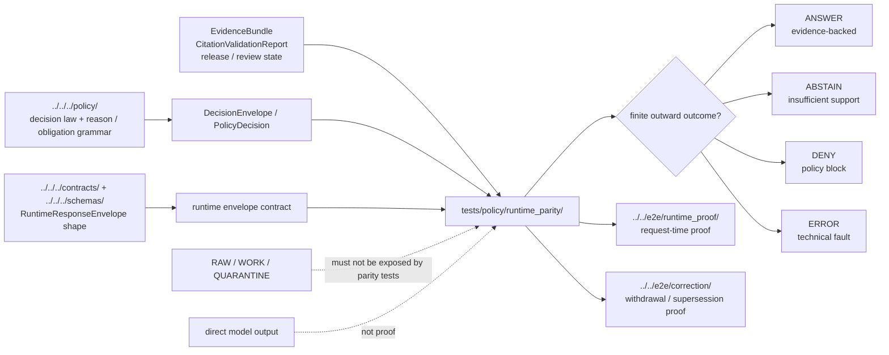

<!-- [KFM_META_BLOCK_V2]
doc_id: kfm://doc/NEEDS_VERIFICATION__tests_policy_runtime_parity_readme
title: tests/policy/runtime_parity
type: standard
version: v1
status: draft
owners: @bartytime4life
created: NEEDS_VERIFICATION__existing_file_created_before_2026-04-27
updated: 2026-04-27
policy_label: public
related: [../README.md, ../../README.md, ../../contracts/README.md, ../../e2e/README.md, ../../e2e/runtime_proof/README.md, ../../e2e/correction/README.md, ../../validators/README.md, ../../../README.md, ../../../policy/README.md, ../../../policy/policy-runtime/README.md, ../../../contracts/README.md, ../../../schemas/README.md, ../../../data/receipts/README.md, ../../../data/proofs/README.md, ../../../.github/CODEOWNERS, ../../../.github/workflows/README.md]
tags: [kfm, tests, policy, runtime-parity, runtime-response-envelope, decision-envelope, fail-closed]
notes: ["This README expands the existing runtime parity purpose without claiming executable fixtures or runner wiring.", "doc_id and created date require document-registry or active-checkout verification.", "Owner uses current broad CODEOWNERS fallback; narrower runtime-parity stewardship remains NEEDS VERIFICATION."]
[/KFM_META_BLOCK_V2] -->

<a id="top"></a>

# `tests/policy/runtime_parity/`

Cross-check runtime policy outcomes against contracts and schemas.

> [!IMPORTANT]
> **Status:** `experimental`  
> **Owners:** `@bartytime4life`  
> **Path:** `tests/policy/runtime_parity/README.md`  
> **Evidence posture:** doctrine-grounded · current executable depth **NEEDS VERIFICATION**  
> **Role:** focused policy-test leaf for proving that policy decisions, contract expectations, and outward runtime envelopes do not drift apart.  
>
> 
> 
> 
> 
> 
> 
>
> **Quick jump:** [Scope](#scope) · [Repo fit](#repo-fit) · [Inputs](#accepted-inputs) · [Exclusions](#exclusions) · [Directory tree](#directory-tree) · [Quickstart](#quickstart) · [Usage](#usage) · [Diagram](#diagram) · [Tables](#tables) · [Definition of done](#definition-of-done) · [FAQ](#faq) · [Appendix](#appendix)

> [!NOTE]
> Runtime parity does **not** mean “the runtime works end-to-end.”  
> It means this leaf can prove a narrower question: given a policy expectation and a runtime-facing contract, does KFM preserve the same governed meaning when the outcome becomes a `RuntimeResponseEnvelope`?

---

## Scope

`tests/policy/runtime_parity/` is the repo-facing test leaf for **policy-to-runtime meaning preservation**.

It should help reviewers answer:

| Question | Expected posture |
|---|---|
| Does policy intent survive into runtime-visible outcomes? | **Yes, with explicit fixtures and expected envelope fragments.** |
| Does the runtime stay finite? | **Only `ANSWER`, `ABSTAIN`, `DENY`, or `ERROR`.** |
| Does policy denial remain visible? | **Yes; do not flatten it into a generic failure or empty answer.** |
| Does insufficient evidence become unsupported confidence? | **No; prefer `ABSTAIN`.** |
| Does technical failure masquerade as policy denial? | **No; preserve `ERROR` when the system cannot safely decide.** |
| Do correction and rollback states remain inspectable downstream? | **Escalate to `tests/e2e/correction/` when parity alone is too narrow.** |

### Evidence labels used here

| Label | Meaning in this README |
|---|---|
| **CONFIRMED** | Directly visible in the current public repository view, active checkout, or strongly anchored in KFM doctrine. |
| **INFERRED** | Conservative placement or behavior conclusion from nearby docs and repeated KFM patterns. |
| **PROPOSED** | Commit-ready direction that fits KFM doctrine but is not asserted as current executable reality. |
| **UNKNOWN** | Not verified strongly enough to claim current runner, fixture, workflow, schema, or runtime behavior. |
| **NEEDS VERIFICATION** | Must be checked against the active branch, CI, platform settings, schema bodies, or runtime implementation before merge. |

[Back to top](#top)

---

## Repo fit

**Path:** `tests/policy/runtime_parity/README.md`  
**Parent:** [`../README.md`][tests-policy]  
**Broader test lattice:** [`../../README.md`][tests-root]  
**Primary downstream escalation:** [`../../e2e/runtime_proof/README.md`][runtime-proof] and [`../../e2e/correction/README.md`][correction-proof]

`runtime_parity/` sits between policy behavior tests and end-to-end runtime proof. Keep it narrow enough to review in a PR and strong enough to catch semantic drift before a broader runtime or release drill.

| Direction | Surface | Why it matters |
|---|---|---|
| Upstream | [`../README.md`][tests-policy] | Parent policy proof lane; owns placement rules for policy-behavior tests. |
| Upstream | [`../../README.md`][tests-root] | Root test taxonomy; keeps this leaf from becoming a catch-all. |
| Lateral | [`../../contracts/README.md`][tests-contracts] | Contract tests own object shape checks. Runtime parity consumes shape expectations but does not replace them. |
| Lateral | [`../../validators/README.md`][tests-validators] | Validator proof belongs here when the main burden is gate behavior rather than policy/runtime meaning. |
| Authority | [`../../../policy/README.md`][policy] | Policy owns decision law, reason codes, obligations, deny-by-default rules, and review semantics. |
| Authority | [`../../../contracts/README.md`][contracts] and [`../../../schemas/README.md`][schemas] | Contract/schema authorities define trust-bearing object shape. This leaf must not fork them. |
| Runtime-adjacent | [`../../../policy/policy-runtime/README.md`][policy-runtime] | Runtime-policy coordination notes belong there; parity cases may reference them. |
| Escalation | [`../../e2e/runtime_proof/README.md`][runtime-proof] | Whole request-time proof belongs there when actual runtime surfaces are exercised. |
| Escalation | [`../../e2e/correction/README.md`][correction-proof] | Correction, withdrawal, supersession, and rollback propagation belong there when the chain crosses surfaces. |
| Process memory | [`../../../data/receipts/README.md`][data-receipts] and [`../../../data/proofs/README.md`][data-proofs] | Receipts and proofs may be test inputs or expectations; this leaf does not own them. |
| Gatehouse | [`../../../.github/workflows/README.md`][workflows] | Workflows may run parity tests; checked-in docs alone do not prove merge-blocking enforcement. |

> [!WARNING]
> Do not let this directory become a second `policy/`, `contracts/`, `schemas/`, `data/receipts/`, or `tests/e2e/` tree.  
> Runtime parity is a **comparison burden**, not an authority surface.

[Back to top](#top)

---

## Accepted inputs

Use small, explicit, offline-first inputs that make policy/runtime agreement reviewable.

| Input class | Belongs here when… | Examples |
|---|---|---|
| Policy-decision fixtures | They show expected decision semantics before runtime wrapping. | `allow_public_answer.input.json`, `deny_unresolved_rights.input.json` |
| Runtime-envelope fragments | They assert finite outward outcome and trust-state shape without owning the full contract. | `expected.answer.runtime_response.json`, `expected.deny.runtime_response.json` |
| Reason / obligation checks | They prove stable meaning survives from policy into outward payloads. | `REQUIRE_CITATION`, `REDACT_EXACT_GEOMETRY`, `RECORD_AUDIT` |
| Evidence-state cases | They distinguish enough evidence, missing evidence, stale evidence, or unresolved EvidenceRefs. | `abstain_missing_evidence.json`, `deny_unreleased_bundle.json` |
| Correction-aware cases | They prove parity for withdrawn, superseded, or rollback-visible states before escalation. | `expected.superseded_visible.json` |
| Tiny harness notes | They explain how to run local checks without implying CI or runtime maturity. | `Makefile` target notes, Python/OPA command notes, README-only runner guidance |

### Minimum case anatomy

A useful runtime-parity case should identify:

| Field | Why it matters |
|---|---|
| `case_id` | Stable review anchor for diffs and failure reports. |
| `policy_input_ref` | What policy saw before runtime translation. |
| `expected_policy_result` | Expected decision grammar: `allow`, `deny`, `generalize`, `restrict`, `needs-review`, or equivalent repo-defined result. |
| `expected_runtime_outcome` | Expected outward result: `ANSWER`, `ABSTAIN`, `DENY`, or `ERROR`. |
| `reason_codes` | Why the result happened. |
| `obligation_codes` | What must happen next or what transform must already have happened. |
| `evidence_state` | Whether EvidenceRefs resolve, are stale, are restricted, or are missing. |
| `contract_refs` | Which contract/schema surface the runtime envelope claims to satisfy. |
| `notes` | Human-readable caveats; never a substitute for machine checks. |

[Back to top](#top)

---

## Exclusions

| Does **not** belong here | Put it instead | Why |
|---|---|---|
| Policy law, rule bundles, or reason-code authority | [`../../../policy/README.md`][policy] | This leaf proves behavior; it does not author policy. |
| Canonical schema or contract definitions | [`../../../contracts/README.md`][contracts] or [`../../../schemas/README.md`][schemas] | Runtime parity consumes contract truth; it must not fork it. |
| Pure shape validation | [`../../contracts/README.md`][tests-contracts] | Shape drift is a contract-test burden. |
| Validator mechanics or promotion-gate implementation | [`../../validators/README.md`][tests-validators] and [`../../../tools/validators/README.md`][tools-validators] | Gate behavior is adjacent but not the same as policy/runtime parity. |
| Full request-time runtime proof | [`../../e2e/runtime_proof/README.md`][runtime-proof] | Whole-path runtime proof is broader than this leaf. |
| Release assembly, proof-pack, and publish-path completion | [`../../e2e/release_assembly/README.md`][release-proof] | Publication proof requires manifests, receipts, proofs, and review artifacts. |
| Correction propagation across surfaces | [`../../e2e/correction/README.md`][correction-proof] | Correction lineage is broader than one runtime-envelope comparison. |
| Receipts, proofs, release manifests, or catalog records as authoritative artifacts | `data/` and `release/` surfaces | This leaf may compare fragments but must not own process memory or publication evidence. |
| Live source data, secrets, model endpoints, or credentials | Source registry, secret manager, or deployment configuration | Runtime parity tests must stay safe to clone and run offline. |
| UI, API, worker, or model-adapter implementation | `apps/`, `packages/`, or repo-native runtime homes | This leaf verifies expected behavior; it is not runtime glue. |

[Back to top](#top)

---

## Directory tree

### Current README-only shape

```text
tests/
└── policy/
    └── runtime_parity/
        └── README.md
```

> [!CAUTION]
> Treat the tree above as the current minimum surface for this README.  
> Re-run the [Quickstart](#quickstart) commands in the active checkout before claiming fixture files, executable tests, runner wiring, or CI enforcement.

### Target executable split (**PROPOSED**)

```text
tests/
└── policy/
    └── runtime_parity/
        ├── README.md
        ├── fixtures/
        │   ├── answer_public_safe.input.json
        │   ├── abstain_missing_evidence.input.json
        │   ├── deny_unresolved_rights.input.json
        │   └── error_schema_fault.input.json
        ├── expected/
        │   ├── answer_public_safe.runtime_response.json
        │   ├── abstain_missing_evidence.runtime_response.json
        │   ├── deny_unresolved_rights.runtime_response.json
        │   └── error_schema_fault.runtime_response.json
        ├── cases/
        │   └── README.md
        └── test_runtime_parity.py
```

### First useful fill

| File | Status | Why it is enough |
|---|---|---|
| `fixtures/answer_public_safe.input.json` | **PROPOSED** | Proves the happy path does not lose required citation/audit obligations. |
| `fixtures/abstain_missing_evidence.input.json` | **PROPOSED** | Proves insufficient evidence stays explicit. |
| `fixtures/deny_unresolved_rights.input.json` | **PROPOSED** | Proves policy denial is not flattened into `ERROR` or empty output. |
| `fixtures/error_schema_fault.input.json` | **PROPOSED** | Proves technical failure remains `ERROR`, not a false policy decision. |
| `expected/*.runtime_response.json` | **PROPOSED** | Makes outward runtime expectations diffable. |
| `test_runtime_parity.py` or repo-native equivalent | **PROPOSED** | Converts the README from placement guidance into executable proof. |

[Back to top](#top)

---

## Quickstart

Run from the repository root.

### 1) Inspect what this leaf actually contains

```bash
find tests/policy/runtime_parity -maxdepth 4 -type f 2>/dev/null | sort
find tests/policy/runtime_parity -maxdepth 4 -type d 2>/dev/null | sort
```

### 2) Inspect upstream and escalation surfaces

```bash
find tests/policy tests/e2e policy contracts schemas -maxdepth 3 -type f 2>/dev/null | sort
```

### 3) Trace the trust-bearing object names this leaf should compare

```bash
grep -RInE \
  'DecisionEnvelope|PolicyDecision|RuntimeResponseEnvelope|EvidenceBundle|EvidenceRef|CitationValidationReport|CorrectionNotice|reason_codes|obligation_codes' \
  tests/policy/runtime_parity tests/policy tests/e2e policy contracts schemas apps packages 2>/dev/null || true
```

### 4) Sanity-check finite runtime outcomes

```bash
grep -RInE \
  'ANSWER|ABSTAIN|DENY|ERROR|allow|deny|generalize|restrict|needs-review|withdrawn|superseded' \
  tests/policy/runtime_parity tests/policy tests/e2e policy contracts schemas 2>/dev/null || true
```

### 5) Run only the tools the active checkout actually supports

```bash
# Python-style runner, if present.
python -m pytest -q tests/policy/runtime_parity 2>/dev/null || true

# OPA/Conftest-style policy checks, if present and configured.
conftest test tests/policy/runtime_parity/fixtures --policy policy 2>/dev/null || true
```

> [!IMPORTANT]
> The commands above are discovery and local-proof helpers.  
> Passing them does **not** prove branch protection, workflow enforcement, production runtime behavior, or public-release readiness.

[Back to top](#top)

---

## Usage

### Add a runtime-parity case

1. Start with the trust seam: source admission, rights, sensitivity, review, release, runtime answer, correction, or rollback.
2. Identify the upstream policy expectation and contract family.
3. Add one tiny input fixture and one expected runtime-envelope fragment.
4. Assert that the runtime result is one of `ANSWER`, `ABSTAIN`, `DENY`, or `ERROR`.
5. Assert reason codes and obligation codes when they are policy-significant.
6. Keep evidence state explicit: resolved, unresolved, stale, restricted, or not released.
7. Escalate to `tests/e2e/runtime_proof/` when actual request handling is exercised.
8. Escalate to `tests/e2e/correction/` when withdrawal, supersession, or rollback must propagate beyond the envelope.

### Use stable case names

Prefer names that reveal the behavior under pressure:

```text
answer_public_safe
abstain_missing_evidence
deny_unresolved_rights
deny_sensitive_exact_geometry
error_schema_fault
restrict_released_scope
generalize_geometry_with_receipt
superseded_claim_visible
```

Avoid names that hide the reason:

```text
good_case
bad_case
runtime_1
policy_test
response_check
```

### Illustrative case card (**PROPOSED**)

```yaml
case_id: deny_unresolved_rights
policy_input_ref: fixtures/deny_unresolved_rights.input.json
expected_policy_result: deny
expected_runtime_outcome: DENY
required_reason_codes:
  - RIGHTS_UNRESOLVED
required_obligation_codes:
  - HOLD_PUBLIC_RELEASE
evidence_state:
  evidence_refs_resolve: true
  release_state: candidate
  rights_class: unknown
contract_refs:
  - ../../../contracts/README.md
  - ../../../schemas/README.md
notes:
  - This is a starter shape only.
  - Do not treat it as proof that the active branch already emits this payload.
```

[Back to top](#top)

---

## Diagram



This leaf compares **policy meaning** with **runtime-visible shape**.  
It should not become a hidden route into raw data, direct model traffic, unchecked evidence, or publication.

[Back to top](#top)

---

## Tables

### Runtime outcome grammar

| Runtime outcome | Meaning | Parity expectation |
|---|---|---|
| `ANSWER` | The runtime may answer from released, policy-safe, cited evidence. | Must carry citation/audit obligations and trust state. |
| `ABSTAIN` | The runtime lacks enough admissible support or scope to answer. | Must not sound like a confident answer. |
| `DENY` | Policy, rights, sensitivity, access, release state, or review state blocks the action. | Must preserve denial reason and next obligation. |
| `ERROR` | A technical fault prevents reliable interpretation. | Must not be converted into `ANSWER`, `ABSTAIN`, or policy denial. |

### Policy-to-runtime parity matrix

| Policy-side result | Runtime-side expectation | Notes |
|---|---|---|
| `allow` with released evidence and validated citations | `ANSWER` | Only if required obligations such as citation, audit, freshness, and review-state disclosure are met. |
| `allow` with transform obligation | `ANSWER` after transform evidence, otherwise `DENY` or `ABSTAIN` | Generalization or restriction must be visible, not implied. |
| `generalize` | `ANSWER` only with generalized output and transform receipt/ref | Exact unsupported geometry must not leak through. |
| `restrict` | `ANSWER` for allowed scope or `DENY` outside scope | Scope narrowing must be visible in the envelope. |
| `needs-review` / `hold` | usually `ABSTAIN` or `DENY` | Use `DENY` when the action is forbidden pending review; use `ABSTAIN` when support is insufficient. |
| `deny` | `DENY` | Do not flatten policy denial into `ERROR`. |
| missing EvidenceBundle / unresolved EvidenceRef | `ABSTAIN` or `DENY` | Use `DENY` when policy forbids exposure; otherwise abstain cleanly. |
| schema, adapter, validator, or service fault | `ERROR` | Technical failure should not pretend to be policy judgment. |
| withdrawn / superseded release state | `ABSTAIN`, `DENY`, or correction-visible `ANSWER` | Escalate to correction E2E proof when downstream visibility matters. |

### What this leaf should prove first

| Concern | Minimum proof |
|---|---|
| Finite outcomes | No runtime fixture or expected output includes a fifth outward state. |
| Reason stability | Denial, abstention, and restriction cases keep typed reason codes visible. |
| Obligation stability | Required next actions are not lost during runtime wrapping. |
| Evidence discipline | Missing or unresolved evidence never becomes a confident answer. |
| Policy denial | Policy block remains `DENY`, not `ERROR` or blank response. |
| Technical failure | System fault remains `ERROR`, not a fabricated policy result. |
| Correction visibility | Withdrawn or superseded states are visible enough here, then escalated to E2E if propagation is tested. |

### Common anti-patterns

| Anti-pattern | Why it is unsafe | Safer move |
|---|---|---|
| A fixture says only `"ok": true` | Hides the governed outcome. | Use finite outcomes and reason/obligation codes. |
| A denied policy case expects `ERROR` | Confuses policy judgment with technical failure. | Expect `DENY` with reason codes. |
| A missing evidence case expects `ANSWER` | Publishes unsupported confidence. | Expect `ABSTAIN` or `DENY`. |
| Runtime parity fixtures embed full source data | Turns a test leaf into data custody. | Use tiny synthetic, public-safe fixtures. |
| Test output stores a receipt as truth | Collapses receipt, proof, and expected output. | Reference receipts/proofs; do not own them here. |
| A README claims CI parity without workflow evidence | Turns documentation into fake enforcement. | Mark workflow enforcement `NEEDS VERIFICATION`. |

[Back to top](#top)

---

## Definition of done

This README is healthy when it stays both useful and honest.

- [ ] Current subtree inventory has been re-run in the active checkout.
- [ ] `doc_id` and `created` metadata are replaced with repo-backed values or deliberately retained as review placeholders.
- [ ] Owner remains valid against `.github/CODEOWNERS` or a narrower verified owner is recorded.
- [ ] At least one positive and one negative runtime-parity fixture exist before claiming executable depth.
- [ ] Every executable case has an expected finite runtime outcome.
- [ ] Denial, abstention, restriction, and technical-failure cases are all represented before broader runtime claims are made.
- [ ] Reason codes and obligation codes are asserted where they matter.
- [ ] EvidenceRef / EvidenceBundle state is explicit in each consequential case.
- [ ] No raw source data, secrets, credentials, direct model output, or publication artifacts are stored here.
- [ ] Runtime-proof or correction cases that exceed this leaf are linked to `tests/e2e/`.
- [ ] The README does not claim workflow enforcement, branch protection, or production runtime behavior unless independently verified.

[Back to top](#top)

---

## FAQ

### Does this directory define policy?

No. Policy law belongs in [`../../../policy/`][policy].  
This directory tests whether policy meaning survives into runtime-facing output.

### Does this directory prove the runtime works?

Not by itself. It proves a focused comparison.  
Request-time behavior belongs in [`../../e2e/runtime_proof/`][runtime-proof].

### Why not put this under `policy/tests/`?

`policy/tests/` is bundle-local.  
`tests/policy/runtime_parity/` is repo-facing proof that policy decisions remain aligned with runtime contracts and outward envelopes.

### Why keep `ERROR` separate from `DENY`?

Because `DENY` is a policy decision and `ERROR` is a technical failure.  
Collapsing them makes audit, review, rollback, and user-facing trust cues weaker.

### What should happen when evidence is missing?

Use `ABSTAIN` when KFM cannot support an answer.  
Use `DENY` when policy forbids exposure or action.

### Can this leaf use OPA/Rego?

Yes, if the active branch supports it.  
Do not present OPA/Rego, Conftest, or any runner as mounted adoption until the checkout proves it.

[Back to top](#top)

---

## Appendix

<details>
<summary><strong>Verification backlog</strong></summary>

| Item | Status | How to close |
|---|---|---|
| `doc_id` | **NEEDS VERIFICATION** | Assign from the repo document registry or documented ID process. |
| `created` date | **NEEDS VERIFICATION** | Confirm from Git history or document registry. |
| Fixture inventory | **UNKNOWN** | Run `find tests/policy/runtime_parity -maxdepth 4 -type f`. |
| Test runner | **UNKNOWN** | Inspect `pyproject.toml`, `package.json`, workflow YAML, or local test docs. |
| Policy engine | **UNKNOWN** | Inspect `policy/`, workflows, Makefile, and validator docs. |
| Schema body maturity | **UNKNOWN** | Inspect `contracts/` and `schemas/` before asserting required fields. |
| CI enforcement | **NEEDS VERIFICATION** | Inspect workflow YAML and repository branch/ruleset settings. |
| Runtime consumers | **UNKNOWN** | Inspect `apps/`, `packages/`, and governed API paths. |
| Release / correction propagation | **UNKNOWN** | Escalate to `tests/e2e/release_assembly/` and `tests/e2e/correction/`. |

</details>

<details>
<summary><strong>Starter review prompts</strong></summary>

Before merging a runtime-parity fixture or test, ask:

1. Is the expected runtime outcome one of `ANSWER`, `ABSTAIN`, `DENY`, or `ERROR`?
2. Does the case distinguish policy block from technical failure?
3. Does the case carry typed reasons and obligations where they matter?
4. Does the case make evidence state visible?
5. Does the case avoid raw data, secrets, and direct model output?
6. Does the case belong here, or is it really contract, validator, runtime-proof, release, or correction proof?
7. Does the README overclaim CI, workflow, or production behavior?
8. Can a reviewer understand the failure mode from the filename alone?

</details>

[Back to top](#top)

[tests-policy]: ../README.md
[tests-root]: ../../README.md
[tests-contracts]: ../../contracts/README.md
[tests-validators]: ../../validators/README.md
[e2e]: ../../e2e/README.md
[runtime-proof]: ../../e2e/runtime_proof/README.md
[release-proof]: ../../e2e/release_assembly/README.md
[correction-proof]: ../../e2e/correction/README.md
[policy]: ../../../policy/README.md
[policy-runtime]: ../../../policy/policy-runtime/README.md
[contracts]: ../../../contracts/README.md
[schemas]: ../../../schemas/README.md
[data-receipts]: ../../../data/receipts/README.md
[data-proofs]: ../../../data/proofs/README.md
[tools-validators]: ../../../tools/validators/README.md
[codeowners]: ../../../.github/CODEOWNERS
[workflows]: ../../../.github/workflows/README.md
