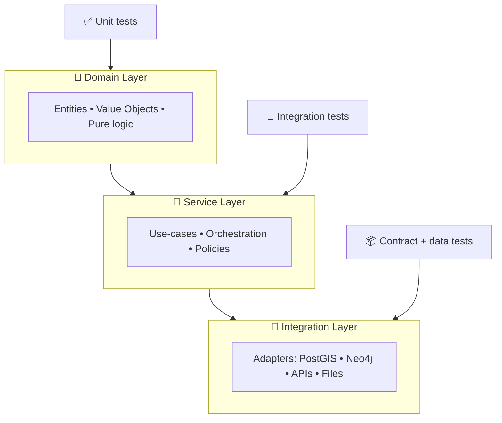

# 🧪 `tests/python/` — Python Test Suite (Kansas Frontier Matrix)


> [!NOTE]
> This README lives at **`tests/python/README.md`** and documents **how we test the Python parts** of the Kansas Frontier Matrix (KFM): API services, ETL/pipelines, metadata catalogs, and graph integrations.

---

## 🔗 Quick links

- [🚀 Quickstart](#-quickstart)
- [🏗️ What we test](#️-what-we-test)
- [🗂️ Folder layout](#️-folder-layout)
- [🧪 Running tests](#-running-tests)
- [📦 Test data rules](#-test-data-rules)
- [🗺️ Geospatial assertions](#️-geospatial-assertions)
- [🧾 Metadata & provenance tests](#-metadata--provenance-tests)
- [🕸️ Graph tests](#️-graph-tests)
- [⚡ Performance & scale checks](#-performance--scale-checks)
- [🔐 Security checks](#-security-checks)
- [✅ PR “Definition of Done”](#-pr-definition-of-done)
- [📚 Project reference shelf](#-project-reference-shelf)

---

## 🚀 Quickstart

### 1) Install deps + run unit tests

From **repo root**:

```bash
python -m venv .venv
source .venv/bin/activate   # Windows: .venv\Scripts\activate
python -m pip install -U pip

# Choose ONE depending on project packaging:
pip install -r requirements.txt
# or:
pip install -e ".[dev]"

pytest -q tests/python
```

> [!TIP]
> If you’re not sure which install path is correct, search for **`pyproject.toml`** vs **`requirements.txt`** at repo root and follow that.

---

### 2) (Optional) Bring up the integration stack (PostGIS / Neo4j / etc.)

If the repo includes Docker Compose:

```bash
docker compose up -d
pytest -q -m "integration or contract" tests/python
```

> [!IMPORTANT]
> Integration tests should **never** require production credentials. They must run against **ephemeral** local containers or safe mocks.

---

## 🏗️ What we test

KFM is a “data + graph + geospatial + web” system. Python tests cover these categories:

### ✅ Unit tests (fast, deterministic)
- Pure functions, parsing, transforms, math, geometry utilities
- “Domain logic” correctness (no DB, no network)

### 🔄 Integration tests (real services, still deterministic)
- API routes (FastAPI) + DB adapters (PostGIS)
- Knowledge graph adapters (Neo4j)
- Pipelines that touch the filesystem and validated small fixtures

### 📦 Contract + schema tests
- OpenAPI schemas (API contract snapshots)
- STAC/DCAT/PROV conformance & cross-link integrity
- “Data is code” checks: schema, invariants, logical consistency

### 🧱 Pipeline regression tests
- Golden outputs on tiny sample inputs
- “No regression in known metrics” checks for key aggregates & counts

### 🧨 Negative / adversarial tests
- Bad inputs, malformed GeoJSON, invalid CRS, missing metadata
- Security-related cases (injection attempts, path traversal, unsafe filenames)

---

## 🧠 Test philosophy

KFM’s credibility depends on **traceability** and **reproducibility**:

- **Provenance-first** 🔎  
  Every dataset/evidence artifact should be traceable end-to-end: raw inputs → pipeline run → processed outputs → catalog + graph references.

- **Scientific rigor** 🧪  
  For modeling/simulation/analytics code, tests must document:
  - assumptions
  - validation approach
  - expected operating range
  - uncertainty/tolerance

- **Deterministic by default** 🎯  
  If a test is flaky, we treat it as a bug.

- **“Data is a first-class citizen”** 🗃️  
  We test data schemas and metadata just like we test functions.

---

## 🧱 Architecture ↔ test placement



---

## 🗂️ Folder layout

> [!NOTE]
> Your repo may already have a structure. This shows the **intended** convention inside `tests/python/`.

```text
tests/
└── python/
    ├── README.md              👈 you are here
    ├── conftest.py            🧩 shared fixtures (db, tmp dirs, seeds)
    ├── unit/                  ✅ pure logic tests
    ├── integration/           🔄 DB/graph/API integration
    ├── contract/              📦 OpenAPI + schema checks
    ├── data/                  🗃️ tiny fixtures + golden outputs
    │   ├── fixtures/
    │   ├── golden/
    │   └── schemas/
    ├── property/              🎲 Hypothesis / property-based tests (optional)
    ├── perf/                  ⚡ benchmarks (usually off by default)
    └── security/              🔐 security-focused tests (optional)
```

---

## 🧪 Running tests

### Run everything (Python)
```bash
pytest tests/python
```

### Run fast unit tests only
```bash
pytest -q -m "unit" tests/python
```

### Run integration tests only
```bash
pytest -q -m "integration" tests/python
```

### Exclude slow tests
```bash
pytest -q -m "not slow" tests/python
```

### Coverage
```bash
pytest --cov --cov-report=term-missing tests/python
```

---

## 🏷️ Markers & naming conventions

**Naming**
- Files: `test_*.py`
- Tests: `test_<behavior>_<expected_outcome>()`
- Prefer “behavioral” names over “implementation” names.

**Recommended markers**

| Marker | Purpose | Runs in CI? |
|---|---|---|
| `unit` | No DB, no network | ✅ yes |
| `integration` | Real containers / local services | ✅ yes (often) |
| `contract` | OpenAPI + schema validation | ✅ yes |
| `data` | Data invariants, golden outputs | ✅ yes |
| `slow` | Long-running / heavy | ⛔ usually nightly |
| `perf` | Benchmarks | ⛔ usually nightly |

> [!TIP]
> If you introduce markers, register them in `pytest.ini` or `pyproject.toml` so CI doesn’t warn.

---

## 📦 Test data rules

### ✅ Do
- Keep committed fixtures **tiny** (think KB–a few MB).
- Prefer **synthetic** or **public-domain/clearly licensed** samples.
- Use deterministic generators for random data (fixed seeds).
- Store expected results as:
  - golden files (small)
  - snapshot JSON
  - summary stats (counts, hashes, bounds)

### ❌ Don’t
- Don’t commit large rasters/shapefiles unless explicitly allowed.
- Don’t include sensitive locations, private data, credentials, or tokens.
- Don’t make tests depend on a network call to a third-party API.

### 📌 Large assets
If you truly need larger assets:
- Use **DVC** or **Git LFS** (and make CI fetch them explicitly).
- Gate them behind `-m slow` or `-m perf`.

---

## 🗺️ Geospatial assertions

Geospatial tests tend to fail for *subtle* reasons. Always assert the basics:

### Geometry validity
- GeoJSON parses ✅
- `is_valid` ✅ (Shapely)
- No self-intersections for polygons (unless intentionally allowed)

### CRS + axis order
- Confirm CRS explicitly (avoid “assumed WGS84”)
- Ensure transforms preserve bounds & orientation

### Bounds and extents
- Bounding box exists and is sane
- Lat/Lon ranges are valid (lat ∈ [-90, 90], lon ∈ [-180, 180]) when using EPSG:4326

### Raster sanity checks
- dtype + nodata
- expected value range
- pixel dimensions and geotransform consistency

> [!IMPORTANT]
> For numeric/geospatial code, prefer **tolerance-based** assertions (e.g., `abs(a-b) < eps`) to avoid brittle tests.

---

## 🧾 Metadata & provenance tests

KFM treats metadata as *required infrastructure*, not “nice-to-have”.

### What we validate
- **STAC Collection + Item(s)** exist for assets
- **DCAT entry** exists for discovery
- **PROV bundle** exists for lineage
- Cross-links:
  - STAC → actual data assets
  - DCAT → STAC/distributions
  - PROV → raw inputs → intermediate → output
  - Graph → references catalog IDs (not bulky payloads)

### Typical checks
- JSON schema validation against project profiles
- Required fields present: title, description, license, spatial/temporal extent, provenance pointers
- “Metafile verification”: if a data file is added/changed, the metadata must be updated too

---

## 🕸️ Graph tests

If the repo uses Neo4j:

- Graph nodes should store **references** (STAC IDs, DOIs, stable catalog keys)
- Enforce constraints:
  - no orphan nodes without a catalog reference
  - no broken references (graph → catalog must resolve)
  - relationship semantics are consistent (edge labels, direction, multiplicity)

> [!TIP]
> Keep graph tests fast by loading a tiny fixture graph or using an ephemeral container dataset.

---

## 🌐 API tests (FastAPI)

Common patterns:
- Use FastAPI test clients for request/response checks
- Assert:
  - status codes
  - JSON shape
  - error envelope (consistency matters)
- Add OpenAPI contract tests:
  - schema exists
  - key endpoints documented
  - snapshot diffs are reviewed intentionally

---

## ⚡ Performance & scale checks

Performance is a feature (especially for geospatial + graph + DB queries).

Recommended approach:
- Use benchmark tests (gated behind `-m perf`)
- Track:
  - query runtime budgets
  - memory spikes
  - “N grows” behavior (small scaling checks)

> [!NOTE]
> Treat performance checks like scientific experiments: document hardware assumptions and keep comparisons fair.

---

## 🔐 Security checks

Security lives in tests + CI gates:

- Dependency checks (known CVEs)
- Static analysis / linting
- Secrets scanning
- Negative tests for:
  - SQL injection vectors
  - path traversal in file handling
  - unsafe deserialization

> [!IMPORTANT]
> If you add a new external integration (API, scraper, connector), add a **security regression test** for its input validation.

---

## ✅ PR “Definition of Done”

Before merging a Python-facing PR:

- [ ] ✅ `pytest tests/python` passes locally
- [ ] ✅ Markers used appropriately (`unit` vs `integration`)
- [ ] ✅ New/changed data artifacts have updated STAC/DCAT/PROV
- [ ] ✅ Golden outputs updated intentionally (not accidentally)
- [ ] ✅ No flaky tests introduced
- [ ] ✅ No secrets in fixtures, logs, or snapshots
- [ ] ✅ CI passes (tests + linters + security scans)

---

## 🧰 Troubleshooting

**GDAL/PROJ install pain** 😵‍💫  
- Prefer Docker/devcontainer workflows if available.
- Keep geospatial libs isolated in reproducible environments.

**Integration tests failing locally**  
- Verify containers are running (`docker compose ps`)
- Confirm env vars / connection strings point to **test** services

**Flaky numeric tests**  
- Fix seeds
- Relax tolerances where appropriate
- Assert invariants (bounds, monotonicity, conservation) instead of exact floats

---

## 📚 Project reference shelf

> [!NOTE]
> This project includes a deep “reference library” 📖. These documents inform our testing standards (scientific rigor, stats, geospatial correctness, scale, security, ethics).

<details>
<summary><strong>📚 Expand the full library list</strong></summary>

### 🧪 Scientific rigor, modeling, statistics
- 📘 **Scientific Modeling and Simulation_ A Comprehensive NASA-Grade Guide.pdf** — verification/validation mindset, reproducibility, uncertainty.
- 📗 **Understanding Statistics & Experimental Design.pdf** — test design, sampling, power, avoiding misleading metrics.
- 📙 **think-bayes-bayesian-statistics-in-python.pdf** — probabilistic validation, posterior sanity checks.
- 📕 **regression-analysis-with-python.pdf** — model evaluation, regression metrics, generalization checks.
- 📕 **Regression analysis using Python - slides-linear-regression.pdf** — quick reference for regression workflows.

### 🗺️ Geospatial, mapping, remote sensing, 3D
- 🗺️ **python-geospatial-analysis-cookbook.pdf** — PostGIS/Geo workflows; good integration test inspiration.
- 🧭 **making-maps-a-visual-guide-to-map-design-for-gis.pdf** — cartographic correctness; map output validation ideas.
- 📍 **Mobile Mapping_ Space, Cartography and the Digital - 9789048535217.pdf** — mobile context; UX implications for map-derived outputs.
- 🛰️ **Cloud-Based Remote Sensing with Google Earth Engine-Fundamentals and Applications.pdf** — remote sensing pipelines; reproducible processing.
- 🏛️ **Archaeological 3D GIS_26_01_12_17_53_09.pdf** — 3D GIS/heritage use cases; constraints + validation concerns.
- 🎮 **webgl-programming-guide-interactive-3d-graphics-programming-with-webgl.pdf** — rendering pipelines; useful for future visual regression tests.
- 🖼️ **compressed-image-file-formats-jpeg-png-gif-xbm-bmp.pdf** — raster formats & pitfalls (metadata, compression artifacts).

### 🧱 Data engineering, DB, scale
- 🐘 **PostgreSQL Notes for Professionals - PostgreSQLNotesForProfessionals.pdf** — SQL/Postgres reference; query correctness tests.
- 📈 **Database Performance at Scale.pdf** — performance testing discipline; bottleneck hunting.
- 🧬 **Scalable Data Management for Future Hardware.pdf** — systems/performance thinking; concurrency and hardware implications.
- 🧩 **Data Spaces.pdf** — governance, interoperability, trust & security as cross-cutting “testable” concerns.

### 🔐 Security & adversarial thinking
- 🛡️ **ethical-hacking-and-countermeasures-secure-network-infrastructures.pdf** — threat modeling; defensive testing patterns.
- 🐍 **Gray Hat Python - Python Programming for Hackers and Reverse Engineers (2009).pdf** — adversarial mindset; input hardening tests.

### 🧠 Systems, autonomy, ethics, governance
- 🤝 **Introduction to Digital Humanism.pdf** — transparency, accountability, algorithmic harms.
- ⚖️ **On the path to AI Law’s prophecies and the conceptual foundations of the machine learning age.pdf** — governance & compliance framing.
- 🧫 **Principles of Biological Autonomy - book_9780262381833.pdf** — systems thinking; “closure” and robustness metaphors.

### 🧰 Full-stack + general engineering references (compendiums)
- 📚 **A programming Books.pdf**
- 📚 **B-C programming Books.pdf**
- 📚 **D-E programming Books.pdf**
- 📚 **F-H programming Books.pdf**
- 📚 **I-L programming Books.pdf**
- 📚 **M-N programming Books.pdf**
- 📚 **O-R programming Books.pdf**
- 📚 **S-T programming Books.pdf**
- 📚 **U-X programming Books.pdf**
- 🌐 **responsive-web-design-with-html5-and-css3.pdf** — front-end correctness (useful when Python outputs feed UI).

### 🧭 Core KFM docs (project-specific)
- 🧾 **Kansas Frontier Matrix (KFM) – Comprehensive Technical Documentation.pdf** — system architecture, CI expectations, testing scope.
- 🧷 **MARKDOWN_GUIDE_v13.md.gdoc** — markdown + metadata standards, STAC/DCAT/PROV rules.
- 🧬 **Scientific Method _ Research _ Master Coder Protocol Documentation.pdf** — documentation + reproducibility protocol.
- 🗺️ **Kansas-Frontier-Matrix_ Open-Source Geospatial Historical Mapping Hub Design.pdf** — pipeline + catalog + CI design patterns.
- 📓 **Comprehensive Markdown Guide_ Syntax, Extensions, and Best Practices.docx** — doc/testing hygiene for markdown-heavy repos.
- 🧠 **Deep Learning for Coders with fastai and PyTorch - Deep.Learning.for.Coders.with.fastai.and.PyTorchpdf** — ML evaluation & reproducibility (if/when used).

</details>

---

🧭 **Goal:** Every PR leaves KFM more reliable, more reproducible, and more explainable. ✅
