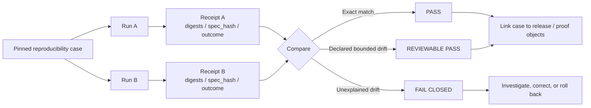

<!-- [KFM_META_BLOCK_V2]
doc_id: kfm://doc/<uuid-review-needed>
title: Reproducibility Tests
type: standard
version: v1
status: draft
owners: @bartytime4life
created: 2026-03-22
updated: 2026-04-27
policy_label: <policy-label-review-needed>
related: [../README.md, ../contracts/README.md, ../policy/README.md, ../e2e/README.md, ../integration/README.md, ../accessibility/README.md, ../unit/README.md, ../../contracts/README.md, ../../schemas/README.md, ../../policy/README.md, ../../.github/README.md, ../../.github/actions/README.md, ../../.github/watchers/README.md, ../../.github/workflows/README.md, ../../.github/CODEOWNERS, ../../pipelines/README.md, ../../pipelines/wbd-huc12-watcher/README.md, ../../pipelines/soils/gssurgo-ks/README.md]
tags: [kfm, tests, reproducibility, determinism, receipts, proof-objects]
notes: [doc_id and policy_label need registry-backed verification; created date is carried forward from surfaced repo-facing README history; updated date reflects this revision; owner is carried forward from surfaced /tests/ CODEOWNERS-backed documentation; active-branch executable depth, workflow YAML, fixture inventory, emitted receipts, and branch protection remain NEEDS VERIFICATION.]
[/KFM_META_BLOCK_V2] -->

<a id="top"></a>

# Reproducibility Tests

Determinism, rerun consistency, and receipt-backed rebuild checks for trust-bearing KFM artifacts.

> [!IMPORTANT]
> **Status:** experimental  
> **Owners:** `@bartytime4life`  
> **Path:** `tests/reproducibility/README.md`  
> **Repo fit:** child verification family under [`tests/`][parent-tests]; adjacent to contract, policy, integration, e2e, unit, and accessibility verification lanes; downstream of governed contracts, schemas, policy, receipts, proofs, and pipeline outputs.  
> **Quick jumps:** [Scope](#scope) · [Repo fit](#repo-fit) · [Inputs](#inputs) · [Exclusions](#exclusions) · [Current verified snapshot](#current-verified-snapshot) · [Directory tree](#directory-tree) · [Quickstart](#quickstart) · [Usage](#usage) · [Diagram](#diagram) · [Tables](#tables) · [Task list](#task-list--definition-of-done) · [FAQ](#faq) · [Appendix](#appendix)


> [!WARNING]
> This README defines the reproducibility lane contract. It does **not** claim that executable cases, fixtures, reports, scripts, emitted proof packs, merge-blocking workflows, or protected-branch gates already exist unless the active checkout proves them directly.

---

## Scope

`tests/reproducibility/` exists to answer one narrow question well:

**If KFM reruns the same trust-bearing work against the same declared scope, do the emitted artifacts, receipts, decisions, and visible outcomes remain identical — or stay inside an explicitly declared reproducibility envelope?**

That is narrower than “do the tests pass?” and stricter than “did the job succeed once?”. In KFM, reproducibility matters because release-bearing artifacts, runtime envelopes, policy decisions, citations, evidence links, and map-visible trust states are part of the public trust surface.

### Status vocabulary used here

| Label | Meaning in this README |
|---|---|
| **CONFIRMED** | Supported by surfaced repo-facing Markdown, attached KFM doctrine, or direct current-session evidence. |
| **INFERRED** | Conservative conclusion from KFM doctrine and the role of this test family. |
| **PROPOSED** | Recommended starter shape, case practice, or future test behavior not proven as executable coverage. |
| **UNKNOWN** | Not verified strongly enough from the available evidence. |
| **NEEDS VERIFICATION** | Requires active checkout inspection, runner confirmation, workflow inspection, emitted artifact review, or platform settings verification. |

> [!NOTE]
> Negative outcomes can be reproducible outcomes. A rerun that consistently returns `ABSTAIN`, `DENY`, `ERROR`, stale-state visibility, or generalized output may pass when that fail-closed result is the declared expectation.

[Back to top](#top)

---

## Repo fit

| Field | Value |
|---|---|
| **Path** | `tests/reproducibility/README.md` |
| **Directory** | `tests/reproducibility/` |
| **Primary burden** | Rerun consistency, digest stability, `spec_hash` stability, receipt comparison, and bounded-drift review. |
| **Upstream test index** | [`../README.md`][parent-tests] |
| **Adjacent test families** | [`../contracts/`][contracts-tests], [`../policy/`][policy-tests], [`../integration/`][integration-tests], [`../e2e/`][e2e-tests], [`../accessibility/`][accessibility-tests], [`../unit/`][unit-tests] |
| **Upstream governance surfaces** | [`../../contracts/`][root-contracts], [`../../schemas/`][root-schemas], [`../../policy/`][root-policy], [`../../.github/workflows/`][github-workflows] |
| **Likely first scouting lanes** | [`../../pipelines/wbd-huc12-watcher/`][wbd-pipeline] and [`../../pipelines/soils/gssurgo-ks/`][soils-pipeline], pending active-branch evidence of receipts and rerunnable harnesses. |
| **What this lane is not** | Not a generic regression bucket, not the release proof store, not a workflow authority, not raw data storage, and not a substitute for policy or contract validation. |

### Upstream/downstream handoff

```text
contracts / schemas / policy / source registry
        │
        ▼
governed run or pipeline candidate
        │
        ▼
receipts + artifacts + decisions + visible outcome state
        │
        ▼
tests/reproducibility/
        │
        ├─ exact match: PASS
        ├─ declared bounded drift: REVIEWABLE PASS
        └─ unexplained drift: FAIL CLOSED
```

[Back to top](#top)

---

## Inputs

Content that belongs in this directory is small, explicit, rerunnable, and comparison-oriented.

| Input type | Belongs here when... | Notes |
|---|---|---|
| Pinned reproducibility case definitions | The case declares scope, expected outputs, comparison basis, policy refs, and allowed drift. | Prefer `cases/*.yaml` or repo-native equivalent once runner conventions are verified. |
| Baseline fixtures | Inputs are public-safe, minimal, and designed for deterministic rerun checks. | Fixtures must not become raw source mirrors. |
| Reference receipt samples | They are used to compare stable fields, digests, `spec_hash`, outcome class, and audit links. | Receipts are process memory, not release proof objects. |
| Bounded-drift envelopes | Exact equality is not realistic, but the allowed drift is declared before the run. | Drift must be explainable and reviewable. |
| Comparison reports | Reports identify first differing field, pass/fail reason, and whether drift was allowed. | Reports should be human-readable and machine-readable when practical. |
| Negative-path reproducibility cases | The expected result is stable `ABSTAIN`, `DENY`, `ERROR`, stale, generalized, or partial-state behavior. | Fail-closed stability is a first-class success case. |
| Thin helper scripts | The helper is only for local comparison and has not yet been promoted into a shared tool lane. | Prefer promotion to `tools/` once reusable. |

[Back to top](#top)

---

## Exclusions

| Does not belong here | Better home | Reason |
|---|---|---|
| Generic unit checks | [`../unit/`][unit-tests] | Unit tests prove local deterministic behavior, not rerun artifact stability across a governed case. |
| Object-shape / schema validation only | [`../contracts/`][contracts-tests] or schema-side tests | Contract cases may feed reproducibility, but shape validation is not the main burden here. |
| Policy allow/deny semantics only | [`../policy/`][policy-tests] | Policy behavior belongs with policy tests unless the question is repeat-run stability of the decision. |
| Cross-boundary integration behavior | [`../integration/`][integration-tests] | Integration tests prove boundary wiring; reproducibility proves repeated governed result stability. |
| Full browser/API journeys | [`../e2e/`][e2e-tests] | Avoid turning this directory into a second end-to-end suite. |
| Large release artifacts | Published artifact storage, release bundles, or proof surfaces | Store references, digests, and comparison receipts here — not binary payload dumps. |
| RAW / WORK / QUARANTINE data | Governed lifecycle storage outside public test docs | Reproducibility tests must not bypass the lifecycle membrane. |
| Secrets, credentials, or live source tokens | Secret manager / secure CI settings | Reproducibility cases should run safely without embedding credentials. |
| One-off debugging notes | Runbooks, issue notes, or `docs/reports/` | This lane should remain stable, reviewable, and rerunnable. |
| Raw performance/load benchmarks | Dedicated performance surface, **UNKNOWN** | Reproducibility asks “same declared input, same governed result?”, not “fastest possible run?”. |

[Back to top](#top)

---

## Current verified snapshot

This snapshot is intentionally bounded.

| Surface | Current evidence posture | What it means |
|---|---|---|
| `tests/reproducibility/` | **CONFIRMED from surfaced repo-facing Markdown; NEEDS VERIFICATION in active checkout** | The directory is treated as a real test-family boundary. |
| `tests/reproducibility/README.md` | **CONFIRMED from surfaced repo-facing Markdown; NEEDS VERIFICATION in active checkout** | The surfaced public-main snapshot listed this README as the only visible file in the directory. |
| Sibling test families | **CONFIRMED from surfaced `tests/` README drafts** | Adjacent families include accessibility, contracts, e2e, integration, policy, and unit. |
| `/tests/` owner | **CONFIRMED from surfaced CODEOWNERS-backed docs** | Owner is carried forward as `@bartytime4life`; narrower ownership still needs direct recheck. |
| Workflow YAML | **UNKNOWN / NEEDS VERIFICATION** | Surfaced workflow docs described `.github/workflows/` as README-only on public `main`; active branch and platform rules must be inspected before claiming merge gates. |
| Executable cases | **UNKNOWN** | No checked-in case files, runner, reports, or scripts are proven by this README alone. |
| Emitted receipts/proofs | **UNKNOWN** | Nearby pipeline docs are useful scouting surfaces, but this README does not prove receipt-backed reruns exist. |
| Protected branch / required checks | **UNKNOWN** | Must be verified in repository and platform settings before claiming enforcement. |

> [!IMPORTANT]
> Treat this directory as a documented verification family until executable case depth is proven. Do not upgrade this README’s language to “enforced,” “merge-blocking,” “complete,” or “green in CI” without direct evidence.

[Back to top](#top)

---

## Directory tree

### Current confirmed snapshot

```text
tests/reproducibility/
└── README.md
```

### Proposed starter expansion shape

```text
tests/reproducibility/
├── README.md
├── cases/                        # pinned rerun case definitions
├── fixtures/                     # public-safe baseline / valid / invalid packs
│   ├── baseline/
│   ├── valid/
│   └── invalid/
├── receipts/                     # saved reference receipts for comparison
├── reports/                      # human-readable and machine-readable drift summaries
└── scripts/                      # local comparison helpers if not promoted elsewhere
```

### Directory design rule

Keep this directory **case-first**, not tool-first.

A good layout makes it obvious:

1. what was rerun,
2. what was compared,
3. what counted as stable,
4. what drift was allowed, and
5. what evidence explains the result.

[Back to top](#top)

---

## Quickstart

### Safe inspection commands

These commands inspect the active checkout without assuming a runner, workflow, or case inventory.

```bash
# Inspect the reproducibility surface.
find tests/reproducibility -maxdepth 4 -type d 2>/dev/null | sort
find tests/reproducibility -maxdepth 4 -type f 2>/dev/null | sort

# Inspect adjacent contract, schema, policy, and workflow-facing surfaces.
find .github contracts policy schemas tests -maxdepth 4 -type f 2>/dev/null \
  | sort \
  | sed -n '1,240p'

# Inspect ownership and workflow-lane clues.
sed -n '1,200p' .github/CODEOWNERS 2>/dev/null || true
sed -n '1,220p' tests/README.md 2>/dev/null || true
sed -n '1,220p' .github/README.md 2>/dev/null || true
sed -n '1,220p' .github/actions/README.md 2>/dev/null || true
sed -n '1,220p' .github/watchers/README.md 2>/dev/null || true
sed -n '1,220p' .github/workflows/README.md 2>/dev/null || true

# Inspect nearby pipeline lanes before inventing the first case.
sed -n '1,220p' pipelines/README.md 2>/dev/null || true
sed -n '1,220p' pipelines/wbd-huc12-watcher/README.md 2>/dev/null || true
sed -n '1,220p' pipelines/soils/gssurgo-ks/README.md 2>/dev/null || true
```

### Starter rerun flow

The real task runner, case filenames, and workflow hooks remain **NEEDS VERIFICATION**, so this is intentionally pseudocode.

```bash
# PSEUDOCODE — replace placeholders after active-checkout inspection.

# 1) Choose a pinned reproducibility case.
CASE="tests/reproducibility/cases/<case>.yaml"

# 2) Execute the same governed run twice against the same declared scope.
<repo-test-runner> reproducibility --case "$CASE" --out /tmp/kfm-run-a
<repo-test-runner> reproducibility --case "$CASE" --out /tmp/kfm-run-b

# 3) Compare receipts, spec hashes, artifact digests, and outcome class.
<repo-compare-tool> \
  /tmp/kfm-run-a/receipt.json \
  /tmp/kfm-run-b/receipt.json

# 4) Fail closed if drift is unexplained or outside the case's declared envelope.
```

> [!TIP]
> The smallest credible first case is usually a **single, public-safe thin slice** with strong place/time semantics and emitted receipts — not a sprawling multi-lane integration marathon.

[Back to top](#top)

---

## Usage

### 1. Define the case before running it

A good reproducibility case names:

- the released or candidate scope it is allowed to touch,
- the exact artifacts it expects,
- the policy/profile versions that matter,
- the fields that must match exactly,
- the fields that may drift in a bounded way,
- the expected result class, and
- the valid negative-path outcome if the case is expected to fail closed.

### 2. Pin the comparison basis

Pin what “same run” means for the case.

That usually includes:

- input scope,
- release reference,
- transform or `spec_hash`,
- environment class,
- seed values,
- policy/profile refs,
- expected artifact digests,
- expected governed outcome class, and
- receipt fields that must remain stable.

### 3. Run the case at least twice

A single green run proves the system worked once.

A reproducibility case proves more:

- repeat-run stability,
- explicit bounded drift when exact sameness is not realistic, and
- whether emitted proof objects are good enough to explain the difference.

### 4. Compare receipts before comparing prose

Human-facing output should not be the only comparison point.

Compare machine-level proof first:

- receipt header,
- release refs,
- policy refs,
- `spec_hash`,
- artifact digests,
- runtime outcome class,
- stale/generalized/partial flags,
- citation/evidence links, and
- audit linkage required by the case.

### 5. Treat unexplained drift as a real failure

A mismatch is not automatically a bug, but it is always work.

The report should say **which field drifted first**, whether that drift was allowed, and what changed:

- input scope,
- release scope,
- policy basis,
- transform logic,
- environment,
- source state, or
- runtime state.

Unexplained drift should fail closed.

### 6. Pick the first case conservatively

KFM doctrine is clearer about the **kind** of first proof slice than about the exact lane artifact that should lead.

Prefer a case that is:

- public-safe,
- fixture-backed or no-network by default,
- place/time explicit,
- receipt-bearing,
- small enough to inspect manually, and
- meaningful when it returns `ABSTAIN`, `DENY`, or `ERROR`.

[Back to top](#top)

---

## Diagram



[Back to top](#top)

---

## Tables

### What this directory should prove first

| Test slice | What must stay stable | Primary comparison objects | Pass rule | Status |
|---|---|---|---|---|
| Canonical identity rerun | Stable IDs, version semantics, and schema-valid emitted objects | `DatasetVersion`, validation outputs, baseline fixture refs | Exact match unless the case declares additive, reviewable drift | **CONFIRMED doctrine / PROPOSED local case** |
| Policy decision rerun | Same decision result, reasons, obligations, and audit linkage for the same policy basis | `DecisionEnvelope`, policy/profile refs | Exact match for fixed input and fixed policy version | **CONFIRMED doctrine / PROPOSED local case** |
| Projection rebuild rerun | Same release linkage and digest, or declared bounded rebuild rule | `ProjectionBuildReceipt`, artifact digests, stale-after policy | Exact digest match by default | **CONFIRMED doctrine / PROPOSED local case** |
| Runtime envelope rerun | Same governed outcome class and visible trust state | `RuntimeResponseEnvelope`, citation checks, surface state | Same `ANSWER` / `ABSTAIN` / `DENY` / `ERROR` class and same evidence basis | **CONFIRMED doctrine / PROPOSED local case** |
| Receipt comparison | Stable `spec_hash`, input refs, policy refs, digest refs, and outcome refs | `run_receipt` or repo-native equivalent | Exact match for pinned fields; bounded drift documented separately | **INFERRED / NEEDS VERIFICATION** |
| Rollback/correction drill | Same prior target selected and same audit linkage emitted | rollback card, correction notice, receipt refs | Valid rollback/correction path without mutating prior history | **PROPOSED** |

### Object boundary reminders

| Object family | Role in reproducibility | Do not confuse with |
|---|---|---|
| `run_receipt` | Process-memory record for one governed run. Useful for rerun comparison. | Release proof, catalog closure, or publication authority. |
| `EvidenceBundle` | Evidence resolution object that supports claims and citations. | Generated prose, map pixels, or UI selection state. |
| `DecisionEnvelope` | Structured policy/review/runtime decision output. | Informal log line or unstructured test assertion. |
| `ReleaseManifest` | Release scope and artifact linkage. | Raw artifact storage or arbitrary deployment state. |
| `ReleaseProofPack` | Release-grade evidence package. | Receipt folder or local test report. |
| `ProjectionBuildReceipt` | Record that a rebuildable projection/tile/search/graph derivative was built. | Canonical truth. |
| `RuntimeResponseEnvelope` | Request-time governed outcome and trust state. | Raw model output or direct API prose. |
| `CorrectionNotice` | Public correction/supersession signal. | Silent fixture update. |

### Drift handling

| Drift type | Allowed? | Required handling |
|---|---:|---|
| Stable digest changes with no declared reason | No | **FAIL CLOSED** and investigate first differing field. |
| Timestamp-only drift in a non-authoritative runtime log | Maybe | Allowed only if the case declares it as ignored or bounded. |
| Policy-version change | Maybe | Split into a new case or update expected decision with review note. |
| Source input change | Maybe | Requires new input scope, new `spec_hash`, or explicit source-state note. |
| Citation/evidence link change | Risky | Requires evidence-bundle comparison and review. |
| Outcome class change | Usually no | Treat as fail-closed unless the case explicitly tests changed policy behavior. |
| Exact-location generalization change | No by default | Requires sensitivity review and transform receipt. |

[Back to top](#top)

---

## Task list / definition of done

This lane is “done enough” to claim executable reproducibility coverage only when the following gates are satisfied.

- [ ] Active checkout confirms `tests/reproducibility/` inventory and owner mapping.
- [ ] At least one `cases/` entry exists with declared input scope, comparison basis, expected outcome, and allowed drift.
- [ ] At least one valid fixture and one invalid or negative-path fixture exist.
- [ ] The default case can run without network access unless the case explicitly declares and gates live source use.
- [ ] The rerun path runs the same case at least twice and compares machine-readable receipts before prose.
- [ ] The comparison report names the first differing field for any mismatch.
- [ ] Unexplained drift fails closed.
- [ ] `ABSTAIN`, `DENY`, and `ERROR` can be expected passing outcomes when declared.
- [ ] No RAW, WORK, QUARANTINE, credentials, or unpublished canonical data are exposed through this directory.
- [ ] The active workflow path is documented only after checked-in YAML or platform rules are verified.
- [ ] A rollback or correction route is documented for failed release-bearing reproducibility checks.
- [ ] Links from [`tests/README.md`][parent-tests] and adjacent lanes point here without duplicating this lane’s burden.

[Back to top](#top)

---

## FAQ

### Is reproducibility the same as regression testing?

No. Regression testing can ask whether behavior changed. Reproducibility asks whether rerunning the same declared trust-bearing scope produces the same governed result, or an explicitly bounded and explainable drift.

### Should contract validation cases live here?

Not as the primary burden. Contract validation belongs in [`../contracts/`][contracts-tests]. A contract case may participate in a broader rerun proof, but digest stability, receipt comparison, and bounded-drift review belong here.

### Should API endpoint tests live here?

Usually no. Route wiring and full runtime behavior belong in [`../integration/`][integration-tests] or [`../e2e/`][e2e-tests]. This lane may compare runtime envelopes if the case is specifically about repeat-run stability.

### Can a failing run pass a reproducibility case?

Yes, when the expected governed outcome is a stable fail-closed state such as `ABSTAIN`, `DENY`, `ERROR`, stale, partial, or generalized. The failure must be declared before the run and explained by evidence, policy, or review state.

### Why compare receipts before prose?

Because generated or rendered output can be fluent while hiding drift. Receipts, digests, `spec_hash`, policy refs, and outcome classes expose the machine-level trust basis first.

### Where should the first case come from?

A conservative first candidate should be small, public-safe, no-network by default, receipt-bearing, and place/time explicit. Surfaced docs point toward hydrology-like or soils-like watcher lanes as useful scouting surfaces, but active-branch emitted receipts and runnable harnesses remain **NEEDS VERIFICATION**.

[Back to top](#top)

---

## Appendix

<details>
<summary><strong>Evidence boundary and open verification items</strong></summary>

### Evidence boundary

This README is grounded in:

- surfaced repo-facing README drafts for `tests/`, `tests/reproducibility/`, workflow surfaces, and adjacent lanes;
- attached KFM doctrine for evidence-first, map-first, time-aware, policy-aware, receipt/proof/catalog separation;
- recurring KFM object-family language around `spec_hash`, `run_receipt`, `EvidenceBundle`, `DecisionEnvelope`, release manifests, proof packs, and finite runtime outcomes;
- current-session workspace inspection, which did not expose a mounted KFM repository checkout.

### Open verification items

Before stronger implementation claims are made, verify:

- active branch inventory under `tests/reproducibility/`;
- whether `cases/`, `fixtures/`, `receipts/`, `reports/`, or `scripts/` already exist;
- exact runner command or package entrypoint;
- exact comparison helper, if any;
- whether `.github/workflows/` contains checked-in YAML on the active branch;
- whether platform rules make any reproducibility check merge-blocking;
- where `run_receipt` and `ai_receipt` live canonically;
- whether nearby pipeline lanes emit stable receipts;
- whether proof packs, catalog closure objects, or rollback cards are already emitted anywhere;
- whether current branch links from `tests/README.md` and adjacent lanes are valid.

### Suggested first case card

| Field | Starter value |
|---|---|
| Case ID | `NEEDS_VERIFICATION__first_public_safe_receipt_rerun` |
| Scope | One public-safe, fixture-backed lane slice |
| Network | Off by default |
| Expected output | Stable receipt + stable digest refs + stable outcome class |
| Required comparison | `spec_hash`, input refs, policy refs, artifact digests, outcome class |
| Allowed drift | None until the case declares it |
| Failure mode | `FAIL CLOSED` on unexplained field drift |

</details>

[Back to top](#top)

[parent-tests]: ../README.md
[contracts-tests]: ../contracts/README.md
[policy-tests]: ../policy/README.md
[e2e-tests]: ../e2e/README.md
[integration-tests]: ../integration/README.md
[accessibility-tests]: ../accessibility/README.md
[unit-tests]: ../unit/README.md
[root-contracts]: ../../contracts/README.md
[root-schemas]: ../../schemas/README.md
[root-policy]: ../../policy/README.md
[github-readme]: ../../.github/README.md
[github-actions]: ../../.github/actions/README.md
[github-watchers]: ../../.github/watchers/README.md
[github-workflows]: ../../.github/workflows/README.md
[codeowners]: ../../.github/CODEOWNERS
[pipelines]: ../../pipelines/README.md
[wbd-pipeline]: ../../pipelines/wbd-huc12-watcher/README.md
[soils-pipeline]: ../../pipelines/soils/gssurgo-ks/README.md
