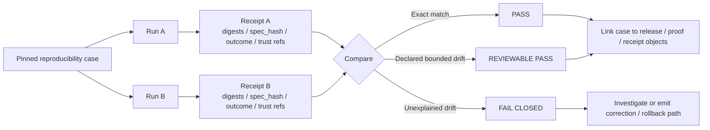

<!-- [KFM_META_BLOCK_V2]
doc_id: kfm://doc/NEEDS_VERIFICATION
title: reproducibility
type: standard
version: v1
status: draft
owners: @bartytime4life
created: 2026-03-22
updated: 2026-04-16
policy_label: NEEDS_VERIFICATION
related: [
  ../README.md,
  ../contracts/README.md,
  ../policy/README.md,
  ../validators/README.md,
  ../ci/README.md,
  ../catalog/README.md,
  ../integration/README.md,
  ../e2e/README.md,
  ../accessibility/README.md,
  ../../README.md,
  ../../contracts/README.md,
  ../../schemas/README.md,
  ../../schemas/contracts/README.md,
  ../../policy/README.md,
  ../../docs/README.md,
  ../../data/receipts/README.md,
  ../../data/proofs/README.md,
  ../../tools/validators/README.md,
  ../../tools/validators/promotion_gate/README.md,
  ../../tools/attest/README.md,
  ../../tools/ci/README.md,
  ../../tools/diff/README.md,
  ../../.github/README.md,
  ../../.github/actions/README.md,
  ../../.github/watchers/README.md,
  ../../.github/workflows/README.md,
  ../../.github/CODEOWNERS,
  ../../pipelines/README.md,
  ../../pipelines/wbd-huc12-watcher/README.md,
  ../../pipelines/soils/gssurgo-ks/README.md
]
tags: [kfm, tests, reproducibility, receipts, proofs, rerun, determinism, drift]
notes: [
  Created date reflects the last confirmed public-main path history supplied in the prior draft; updated date reflects this revision.
  Updated to align the reproducibility family with the fuller tests lattice, explicit receipt/proof separation, validator/attest adjacency, workflow and watcher boundary docs, and the newer trust-surface vocabulary used across the repo.
  Current public-main evidence still proves this directory mainly as a visible README-bearing family; executable suite depth, runner/toolchain, and merge-blocking automation remain bounded until checked directly on the working branch.
]
[/KFM_META_BLOCK_V2] -->

<a id="top"></a>

# `reproducibility`

Determinism, rerun consistency, bounded-drift checks, and receipt-backed rebuild proof for trust-bearing KFM artifacts.

> **Status:** experimental  
> **Owners:** `@bartytime4life`  
> **Path:** `tests/reproducibility/README.md`  
> **Badges:**         
> **Quick jumps:** [Scope](#scope) · [Repo fit](#repo-fit) · [Inputs](#inputs) · [Exclusions](#exclusions) · [Current verified snapshot](#current-verified-snapshot) · [Directory tree](#directory-tree) · [Quickstart](#quickstart) · [Usage](#usage) · [Diagram](#diagram) · [Tables](#tables) · [Task list](#task-list) · [FAQ](#faq) · [Appendix](#appendix)

> [!IMPORTANT]
> Reproducibility is not “did the job pass once?”
>
> It is:
>
> **did the same declared scope produce the same governed result, or stay inside an explicitly declared drift envelope, with enough receipts and trust cues to explain why?**

> [!TIP]
> Keep the KFM trust split visible here:
>
> **reproducibility proof ≠ runtime proof ≠ release proof ≠ correction proof ≠ validator proof ≠ receipt authority ≠ proof authority**
>
> - `tests/reproducibility/` proves rerun sameness or bounded drift
> - `tests/e2e/` proves whole-path runtime, release, or correction behavior
> - `tests/validators/` proves gate behavior
> - `tests/ci/` proves renderer behavior
> - receipts remain process memory
> - proofs remain higher-order trust objects

> [!WARNING]
> Current public `main` proves that `tests/reproducibility/` is real and currently exposes `README.md` only. The broader `tests/README.md` proves reproducibility is a first-class verification family, but public `main` does **not** yet prove checked-in reproducibility cases, fixtures, reports, scripts, required checks, or merge-blocking workflow YAML.
>
> Treat deeper layout, runner examples, and case patterns below as commit-planning scaffolds until a checked-out branch re-verifies them.

---

## Scope

This directory exists to answer one narrow question well:

> **If KFM reruns the same trust-bearing work against the same declared scope, do the emitted artifacts, receipts, proofs, and visible outcomes remain identical — or at least stay inside an explicitly declared reproducibility envelope?**

That is narrower than “do the tests pass?” and stricter than “did the job succeed once?”. In KFM, reproducibility matters because release-bearing artifacts, runtime envelopes, policy decisions, evidence-linked outputs, and trust cues are part of the trust surface, not just internal plumbing.

### What this family should prove

- stable rerun identity for the same declared scope
- exact-match behavior where exact sameness is realistic
- bounded-drift behavior where exact sameness is not realistic but must still be governed
- deterministic comparison of receipts, digests, refs, and outcome class
- replayability using process-memory artifacts instead of prose memory alone
- visibility of why a rerun passed, drifted within bounds, or failed closed
- explicit separation between machine outputs, process-memory receipts, higher-order proofs, and outward summaries when more than one appears in the same case

### What this family should not absorb

- whole-path runtime proof
- release-assembly proof
- correction-lineage proof
- validator-only proof
- renderer-only proof
- schema authority
- policy authorship
- receipt storage
- proof storage
- generic “rerun a script” theater without declared scope and comparison basis

### Status vocabulary used in this README

| Marker | Meaning in this README |
| --- | --- |
| **CONFIRMED** | Supported by current public-branch evidence or doctrinal material in hand |
| **INFERRED** | Strongly implied by KFM doctrine and this directory’s role, but not directly verified as checked-in executable coverage |
| **PROPOSED** | Recommended starter layout or practice for this directory |
| **UNKNOWN** | Not directly proven in the current session |
| **NEEDS VERIFICATION** | Specifically requires direct checkout, effective CI/platform inspection, or runner confirmation before being treated as implementation fact |

> [!IMPORTANT]
> Negative outcomes still count as reproducible outcomes.
>
> A rerun that correctly returns `ABSTAIN`, `DENY`, `ERROR`, or a visible stale/generalized/superseded state can be a passing case when that fail-closed behavior is the expected result.

[Back to top](#top)

---

## Repo fit

| Field | Value |
|---|---|
| **Path** | `tests/reproducibility/README.md` |
| **Directory** | `tests/reproducibility/` |
| **Role in repo** | README for rerun consistency, digest stability, `spec_hash` stability, receipt comparison, proof visibility, and bounded-drift checks |
| **Current public `main` snapshot** | The directory currently exposes `README.md` only. Broader family placement is defined by [`../README.md`](../README.md). |
| **Visible sibling test families** | `../accessibility/`, `../contracts/`, `../e2e/`, `../integration/`, `../policy/`, `../unit/`, `../validators/`, `../ci/`, `../catalog/` |
| **Upstream links** | [`../README.md`](../README.md), [`../../contracts/README.md`](../../contracts/README.md), [`../../schemas/README.md`](../../schemas/README.md), [`../../schemas/contracts/README.md`](../../schemas/contracts/README.md), [`../../policy/README.md`](../../policy/README.md), [`../../.github/workflows/README.md`](../../.github/workflows/README.md) |
| **Adjacent control-plane clues** | [`../../.github/README.md`](../../.github/README.md), [`../../.github/actions/README.md`](../../.github/actions/README.md), [`../../.github/watchers/README.md`](../../.github/watchers/README.md), [`../../.github/workflows/README.md`](../../.github/workflows/README.md) |
| **Trust-surface adjacencies** | [`../../data/receipts/README.md`](../../data/receipts/README.md), [`../../data/proofs/README.md`](../../data/proofs/README.md), [`../../tools/validators/README.md`](../../tools/validators/README.md), [`../../tools/validators/promotion_gate/README.md`](../../tools/validators/promotion_gate/README.md), [`../../tools/attest/README.md`](../../tools/attest/README.md), [`../../tools/ci/README.md`](../../tools/ci/README.md), [`../../tools/diff/README.md`](../../tools/diff/README.md) |
| **Nearby visible pipeline lanes** | [`../../pipelines/README.md`](../../pipelines/README.md), [`../../pipelines/wbd-huc12-watcher/README.md`](../../pipelines/wbd-huc12-watcher/README.md), [`../../pipelines/soils/gssurgo-ks/README.md`](../../pipelines/soils/gssurgo-ks/README.md) |
| **Downstream links** | Future reproducibility cases, baseline receipts, drift reports, and any workflow or release gate that consumes them. No checked-in downstream artifacts are currently visible in this directory on public `main`. |
| **Why this fits KFM** | KFM doctrine expects deterministic identity checks, stale-projection checks, invalid fixtures, policy grammar validation, runtime citation-negative behavior, and auditable run receipts. Reproducibility is where those expectations become repeat-run evidence instead of one-off confidence. |

### Boundary rule

Use this family when the core question is:

> **same declared scope, same governed result?**

Escalate elsewhere when the core question becomes:

- **what happened at runtime?** → `tests/e2e/runtime_proof/`
- **is this publishable with release lineage intact?** → `tests/e2e/release_assembly/`
- **did correction lineage remain visible?** → `tests/e2e/correction/`
- **did the validator decide correctly?** → `tests/validators/`
- **did the renderer format correctly?** → `tests/ci/`

[Back to top](#top)

---

## Inputs

Accepted inputs for this directory are the **smallest artifacts needed to rerun and compare a trust-bearing case**.

| Accepted input | What belongs here | Status |
|---|---|---|
| Pinned case manifests | A declared case with release scope, source scope, policy/profile refs, environment pins, and pass criteria | **INFERRED / PROPOSED** |
| Baseline receipts | Prior run receipts used as the comparison anchor | **INFERRED / PROPOSED** |
| Baseline proofs or proof refs | When higher-order trust visibility matters for rerun integrity | **INFERRED / PROPOSED** |
| Baseline digests | Expected artifact digests, `spec_hash` values, or bounded tolerances | **INFERRED / PROPOSED** |
| Stable fixtures | Valid/invalid fixture packs reused by rerun cases | **CONFIRMED as a tests-level input class; local inventory UNKNOWN** |
| Rerun reports | Machine-readable and human-readable comparison output explaining pass, bounded drift, or failure | **INFERRED / PROPOSED** |
| Environment pins | Seed values, version refs, runner flags, or other settings required to make a rerun meaningful | **INFERRED / PROPOSED** |
| Thin-slice evidence | Early lane proofs, especially the first hydrology-oriented thin slice if this directory becomes the home for rerun proofs on that path | **PROPOSED** |
| Trust-chain anchors | `release_ref`, `bundle_ref`, `receipt_ref`, `proof_ref`, attestation-visible state, or audit linkage when the case contract depends on them | **INFERRED / PROPOSED** |

### Input rules

1. The case must pin what “same run” means.
2. Reuse authoritative fixtures instead of cloning truth locally.
3. Compare machine artifacts before prose summaries.
4. Keep receipts as process memory and proofs as higher-order trust objects when both appear.
5. Any tolerated drift must be declared in the case definition, not accepted informally after the fact.
6. If the case depends on trust-chain visibility, keep receipts, proofs, decisions, and rendered summaries explicitly distinct.

[Back to top](#top)

---

## Exclusions

This directory should stay narrow. It is **not** the catch-all home for every test, script, or experiment note.

| Does **not** belong here | Put it here instead | Notes |
|---|---|---|
| General test strategy for the whole repo | [`../README.md`](../README.md) | That file is the broader tests entry point. |
| Pure contract/schema shape checks | [`../../contracts/README.md`](../../contracts/README.md), [`../../schemas/README.md`](../../schemas/README.md), [`../../schemas/contracts/README.md`](../../schemas/contracts/README.md) | Keep shape authority and contract-home rules close to the contract lane. |
| Policy rulepack-only checks | [`../../policy/README.md`](../../policy/README.md), [`../policy/README.md`](../policy/README.md) | Keep decision-grammar and rulepack ownership close to policy sources. |
| Accessibility-only audits | [`../accessibility/`](../accessibility/) | Reproducibility is about rerun stability, not broad accessibility coverage. |
| Unit-only local behavior checks | [`../unit/`](../unit/) | Keep narrow local logic checks out of trust-bearing rerun cases unless the case itself requires them. |
| Generic multi-step integration tests | [`../integration/`](../integration/) | Integration and reproducibility can overlap, but they are not the same question. |
| Full browser/API journey tests | [`../e2e/`](../e2e/) or a specific e2e leaf | Do not let reproducibility cases become a second home for generic journey tests. |
| Validator-only decision proofs | [`../validators/`](../validators/) | Keep gate semantics bounded when rerun sameness is not the primary burden. |
| Renderer-only checks | [`../ci/`](../ci/) | Formatting stability is not the same as governed rerun stability. |
| One-off debugging notes | Runbooks or issue-specific notes under [`../../docs/`](../../docs/) | Reproducibility cases should be stable, reviewable, and rerunnable — not scratchpads. |
| Exploratory notebooks that cannot run headlessly | Notebook or research workspace **NEEDS VERIFICATION** | Promote into this directory only after the rerun path is explicit. |
| Large release artifacts themselves | Release-bearing storage surface, with links back via receipts | Store references, digests, and proofs here; do not turn this directory into a binary dump. |
| Raw performance/load benchmarks | Dedicated performance surface **UNKNOWN** | Reproducibility asks “same declared input, same governed result?”, not “fastest possible run?”. |
| Receipt or proof storage | [`../../data/receipts/README.md`](../../data/receipts/README.md), [`../../data/proofs/README.md`](../../data/proofs/README.md) | This family consumes or compares them; it does not own them. |

## Current verified snapshot

The current public `main` branch proves the following:

- `tests/reproducibility/` exists as a real test-family directory.
- `tests/reproducibility/README.md` exists and is the only branch-visible file currently listed in this directory.
- The broader tests index includes `reproducibility/` as an explicit family under `tests/`.
- Visible sibling test families currently include `accessibility/`, `contracts/`, `e2e/`, `integration/`, `policy/`, and `unit/`.
- `/tests/` is assigned to `@bartytime4life` in `/.github/CODEOWNERS`.
- Public `.github/workflows/` currently shows `README.md` only, so checked-in workflow YAML merge gates are not proven from the public tree alone.
- Public `.github/watchers/` is presently docs-only on visible `main`.
- Public `.github/actions/` is real but placeholder-heavy on visible `main`; that is useful as a repo-shape clue, not proof of active reproducibility enforcement.
- Public `pipelines/` currently exposes a README and two visible child lane READMEs: `wbd-huc12-watcher/` and `soils/gssurgo-ks/`. Those are useful scouting surfaces for a first checked-out case, but public `main` alone does **not** prove emitted receipts or runnable reproducibility harnesses for either lane.
- Public `data/receipts/` and `data/proofs/` now exist as explicit boundary docs, which means rerun cases can and should describe trust continuity without flattening process memory and higher-order proofs into one generic “artifact”.
- Adjacent validator, attestation, diff, and CI lanes are now explicitly documented, which helps keep this family narrower and more honest.

> [!NOTE]
> What is still not proven here:
>
> - exact runner/toolchain
> - actual executable case depth
> - fixture density
> - required checks
> - protected-branch settings
> - emitted proof packs
> - rollback/correction drill history
> - mounted receipt/proof-aware rerun cases on the checked-out branch

## Directory tree

### Current confirmed snapshot

```text
tests/reproducibility/
└── README.md
```

### Proposed starter expansion shape (`PROPOSED` / `NEEDS VERIFICATION`)

```text
tests/reproducibility/
├── README.md
├── cases/                        # pinned rerun case definitions
├── fixtures/                     # baseline inputs / valid / invalid packs
│   ├── baseline/
│   ├── valid/
│   └── invalid/
├── receipts/                     # saved reference receipts for comparison
├── reports/                      # human-readable drift summaries
└── scripts/                      # comparison helpers if not promoted elsewhere
```

### Reading rule

Use the **current confirmed snapshot** for public-branch truth.

Use the **proposed starter expansion shape** only as a commit-planning scaffold.

Do not silently convert a proposed layout into claims of checked-in maturity, merge-blocking coverage, or exercised reproducibility proof.

### Directory design rule

Keep this directory **case-first**, not tool-first.

A good layout makes it obvious:

1. what was rerun,
2. what was compared,
3. what counted as stable,
4. what drift was allowed, and
5. what evidence explains the result.

## Quickstart

### Safe inspection commands

These commands are branch-safe because they inspect what is present without assuming a particular runner.

```bash
# inspect the visible reproducibility surface
find tests/reproducibility -maxdepth 4 -type d 2>/dev/null | sort
find tests/reproducibility -maxdepth 4 -type f 2>/dev/null | sort

# inspect adjacent contract, schema, policy, receipt, proof, and workflow-facing surfaces
find .github contracts policy schemas tests data tools -maxdepth 4 -type f 2>/dev/null | sort | sed -n '1,260p'

# inspect ownership and public workflow-lane clues
sed -n '1,200p' .github/CODEOWNERS 2>/dev/null || true
sed -n '1,220p' tests/README.md 2>/dev/null || true
sed -n '1,220p' tests/e2e/README.md 2>/dev/null || true
sed -n '1,220p' tests/integration/README.md 2>/dev/null || true
sed -n '1,220p' tests/validators/README.md 2>/dev/null || true
sed -n '1,220p' tests/ci/README.md 2>/dev/null || true
sed -n '1,220p' .github/README.md 2>/dev/null || true
sed -n '1,220p' .github/actions/README.md 2>/dev/null || true
sed -n '1,220p' .github/watchers/README.md 2>/dev/null || true
sed -n '1,220p' .github/workflows/README.md 2>/dev/null || true
sed -n '1,220p' data/receipts/README.md 2>/dev/null || true
sed -n '1,220p' data/proofs/README.md 2>/dev/null || true
sed -n '1,220p' tools/validators/README.md 2>/dev/null || true
sed -n '1,220p' tools/validators/promotion_gate/README.md 2>/dev/null || true
sed -n '1,220p' tools/attest/README.md 2>/dev/null || true
sed -n '1,220p' tools/ci/README.md 2>/dev/null || true
sed -n '1,220p' tools/diff/README.md 2>/dev/null || true

# inspect nearby visible pipeline lanes before inventing a first case
sed -n '1,220p' pipelines/README.md 2>/dev/null || true
sed -n '1,220p' pipelines/wbd-huc12-watcher/README.md 2>/dev/null || true
sed -n '1,220p' pipelines/soils/gssurgo-ks/README.md 2>/dev/null || true

# search for rerun and trust-chain vocabulary before inventing new case language
grep -RIn \
  -e 'spec_hash' \
  -e 'release_ref' \
  -e 'bundle_ref' \
  -e 'receipt_ref' \
  -e 'proof_ref' \
  -e 'run_receipt' \
  -e 'ai_receipt' \
  -e 'DecisionEnvelope' \
  -e 'RuntimeResponseEnvelope' \
  -e 'ReleaseManifest' \
  -e 'ReleaseProofPack' \
  -e 'ABSTAIN' \
  -e 'DENY' \
  -e 'ERROR' \
  tests contracts policy schemas docs .github data tools pipelines 2>/dev/null || true
```

### Starter rerun flow (`PSEUDOCODE`)

The real task runner, case filenames, and workflow hooks remain **NEEDS VERIFICATION**, so the snippet below is intentionally labeled as pseudocode.

```bash
# PSEUDOCODE — replace placeholders after direct checkout inspection

# 1) choose a pinned reproducibility case
CASE="tests/reproducibility/cases/<case>.yaml"

# 2) execute the same governed run twice against the same declared scope
<repo-test-runner> reproducibility --case "$CASE" --out /tmp/run-a
<repo-test-runner> reproducibility --case "$CASE" --out /tmp/run-b

# 3) compare receipts, proof refs, spec hashes, artifact digests, and outcome class
<repo-compare-tool> /tmp/run-a/receipt.json /tmp/run-b/receipt.json

# 4) fail closed if drift is unexplained or outside the case's declared envelope
```

> [!NOTE]
> The smallest credible first case is usually a **single, public-safe thin slice** with strong place/time semantics and emitted receipts — not a sprawling multi-lane integration marathon.

## Usage

### 1. Define the case

Start by writing down the case before you run it.

A good reproducibility case names:

- the released or candidate scope it is allowed to touch
- the exact artifacts it expects
- the policy/profile versions that matter
- the fields that must match exactly
- the fields that may drift in a bounded way
- the negative-path outcome that is valid if the case is expected to fail closed
- whether receipt/proof visibility is part of the trust contract for this rerun

### 2. Pin the comparison basis

Pin what “same run” means for this case.

That usually includes some combination of:

- input scope
- release reference
- transform or `spec_hash`
- environment class
- seed values
- policy/profile refs
- expected result class
- expected artifact digests
- receipt fields that must remain stable
- proof refs or attestation-visible state that must remain stable when relevant

### 3. Run the case at least twice

A single green run proves that the system worked once.

A reproducibility case proves more:

- repeat-run stability
- explicit bounded drift when exact sameness is not realistic
- whether the emitted proof objects are good enough to explain the difference
- whether process memory and higher-order proof visibility remain reconstructable across reruns

### 4. Compare receipts before comparing prose

In KFM, human-facing output should not be your only comparison point.

Compare the machine-level proof first:

- receipt header
- release refs
- policy refs
- `spec_hash`
- artifact digests
- runtime outcome class
- stale/generalized/partial flags
- receipt/proof visibility when relevant
- and any audit linkage required by the case

### 5. Treat unexplained drift as a real failure

A mismatch is not automatically a bug, but it is always work.

If a rerun differs, the report should say **which field drifted first**, whether that drift was allowed, and what changed:

- input scope
- release scope
- policy basis
- transform logic
- environment
- runtime state
- trust-chain visibility

Unexplained drift should fail closed.

### 6. Pick the first case conservatively

KFM doctrine is clearer about the **kind** of first proof slice than about the exact lane artifact that should lead:

- prefer a public-safe lane
- prefer a thin slice with explicit receipts and place/time semantics
- prefer a case whose failure states are already meaningful to maintainers
- prefer a case that keeps receipt/proof/process-memory distinctions explicit

That is why hydrology remains a strong first candidate in doctrine. On visible public `main`, the closest nearby lane surfaces are `pipelines/wbd-huc12-watcher/` and `pipelines/soils/gssurgo-ks/`, but lane choice still stays **NEEDS VERIFICATION** until a checked-out branch proves emitted receipts, stable comparison points, and a rerunnable harness.

## Diagram



## Tables

### What this directory should prove first

| Test slice | What must stay stable | Primary comparison objects | Pass rule | Status |
|---|---|---|---|---|
| Canonical identity rerun | Stable IDs, version semantics, and schema-valid emitted objects | `DatasetVersion`, validation outputs, baseline fixture refs | Exact match unless the case declares additive, reviewable drift | **CONFIRMED doctrine / PROPOSED local case** |
| Policy decision rerun | Same decision result, reasons, obligations, and audit linkage for the same policy basis | `DecisionEnvelope`, policy/profile refs | Exact match for fixed inputs and fixed policy version | **CONFIRMED doctrine / PROPOSED local case** |
| Projection rebuild rerun | Same release linkage and digest, or declared bounded rebuild rule | `ProjectionBuildReceipt`, artifact digests, stale-after policy | Exact digest match by default; bounded rule only if explicitly declared | **CONFIRMED doctrine / PROPOSED local case** |
| Runtime envelope rerun | Same governed outcome class and visible trust state | `RuntimeResponseEnvelope`, citation checks, surface state, decision ref | Same `ANSWER` / `ABSTAIN` / `DENY` / `ERROR` class and same required linkage | **CONFIRMED doctrine / PROPOSED local case** |
| Release proof rerun | Same public-safe release assembly | `ReleaseManifest` / `ReleaseProofPack`, docs/accessibility gate refs, rollback note | Reconstructed proof matches declared scope and digest expectations | **INFERRED / PROPOSED** |
| Trust visibility rerun | Same receipt/proof visibility and non-flattened trust-state semantics | `run_receipt`, `ai_receipt`, `receipt_ref`, `proof_ref`, attestation-visible state | Same declared trust cues or explicitly bounded drift | **INFERRED / PROPOSED** |

### Result classes for reproducibility cases

| Result | Meaning | What to do next |
|---|---|---|
| **PASS** | Receipts, digests, trust refs, and outcome class match exactly | Keep the case as a stable regression anchor |
| **REVIEWABLE PASS** | Drift occurred, but only inside a rule declared by the case | Keep the drift rule explicit and review whether it still belongs |
| **FAIL CLOSED** | A required field drifted without an allowed rule, or required proof/receipt visibility was missing | Investigate before treating the underlying job as trustworthy |
| **INVALID CASE** | The case itself did not pin enough scope to make comparison meaningful | Tighten the case manifest before rerunning it |

### Adjacent visible surfaces worth checking before adding a first case

| Surface | Current public signal | Why it matters here | Status |
|---|---|---|---|
| `tests/` family index | Reproducibility is a named sibling of accessibility, contracts, e2e, integration, policy, and unit | Confirms this directory is part of the formal verification surface, not an orphan note | **CONFIRMED** |
| `.github/workflows/` | README-only on visible `main` | Do not claim merge-blocking reproducibility automation from public inventory alone | **CONFIRMED constraint** |
| `.github/watchers/` | Docs-only on visible `main` | Do not assume autonomous watcher-triggered reruns yet | **CONFIRMED constraint** |
| `.github/actions/` | Real but placeholder-heavy | Composite action names are useful signals, but not proof of finished enforcement depth | **CONFIRMED as shape / UNKNOWN as exercised depth** |
| `data/receipts/` / `data/proofs/` | Explicit boundary docs now exist | Cases can now name trust continuity more clearly without flattening those surfaces | **CONFIRMED** |
| `pipelines/wbd-huc12-watcher/` | Visible README-bearing hydrology-adjacent lane | Plausible first-case scouting lane if a checked-out branch proves receipts and deterministic outputs | **CONFIRMED as visible neighbor / NEEDS VERIFICATION as repro case** |
| `pipelines/soils/gssurgo-ks/` | Visible README-bearing soils lane | Strong second scouting lane if hydrology-first proof is not yet checkout-ready | **CONFIRMED as visible neighbor / NEEDS VERIFICATION as repro case** |

## Task list

### Minimum credible definition of done

- [ ] One reproducibility case is checked in with a pinned scope, pinned comparison basis, and explicit pass criteria.
- [ ] The directory contains the minimum case assets needed to rerun and compare that case.
- [ ] The case can be run twice without changing its declared inputs.
- [ ] Both runs emit receipts that can be compared automatically.
- [ ] The comparison checks at least `spec_hash`, artifact digests, release refs, and outcome class.
- [ ] The comparison checks trust visibility when receipt/proof or attestation-visible state is part of the case contract.
- [ ] The comparison output identifies the first divergent field when the case fails.
- [ ] The case includes at least one expected negative-path or fail-closed example where relevant.
- [ ] Any tolerated drift is written as a bounded rule in the case definition, not accepted informally.
- [ ] `tests/README.md` and this README stay synchronized when the family meaning or visible inventory changes.
- [ ] Workflow documentation is updated if reproducibility checks become part of a merge or release gate.
- [ ] Receipts, proofs, decisions, and outward summaries remain distinct when they participate in the same rerun case.

### Review gates for maintainers

- [ ] Does the case prove something trust-bearing rather than just re-running a script?
- [ ] Could another maintainer reconstruct the case without tribal knowledge?
- [ ] Are large artifacts referenced by receipt and digest rather than copied here casually?
- [ ] Does the case preserve KFM’s fail-closed posture when evidence, policy, scope, or trust visibility is incomplete?
- [ ] Does the README keep current branch truth separate from proposed future inventory?
- [ ] If the case touches receipts or proofs, does it preserve their distinct roles instead of flattening them?

## FAQ

### What counts as “reproducible” here?

By default, **exact rerun sameness** is the goal. When exact sameness is unrealistic, the case must declare a **bounded reproducibility rule** up front.

### Is this the same as contract testing?

No. Contract tests prove object shape and validation rules. Reproducibility tests prove that repeated runs remain stable enough to trust.

### Can an `ABSTAIN` or `DENY` outcome pass?

Yes. In KFM, fail-closed behavior is part of the trust contract. If the case expects a valid denial or abstention, reproducing that outcome is a pass.

### Should this directory store full generated artifacts?

Usually no. Prefer manifests, receipts, digest baselines, proof refs, and comparison reports here. Keep heavyweight release artifacts in their release-bearing storage surface and link them through receipts.

### Does the current public branch prove runnable reproducibility coverage?

No. It proves directory presence and README content, not checked-in case assets, runner selection, required checks, external CI configuration, or exercised rollback/correction history.

### Why mention receipts and proofs here?

Because rerun trust is not only about bytes matching. Some cases depend on process-memory continuity, higher-order proof visibility, or explicit trust cues staying stable across runs. Mentioning them keeps those roles explicit; it does not move ownership into this family.

### What should be the first case?

A single thin slice with explicit receipts, fixed scope, and strong place/time semantics is better than a broad multi-surface case. Doctrine still leans hydrology-first, but the checked-out branch should win if it surfaces a cleaner, smaller, more receipt-rich candidate lane.

## Appendix

<details>
<summary><strong>Illustrative reproducibility case template</strong> (<strong>PROPOSED</strong>)</summary>

The example below is a template, not a claim about checked-in filenames or runner syntax.

```yaml
case_id: repro.<lane>.<artifact-family>.v1
status: proposed

goal: >
  Rerun the same declared scope twice and compare trust-bearing proof objects.

scope:
  release_ref: <release-ref-review-needed>
  lane: <lane-review-needed>
  surface_class: <surface-class-review-needed>
  policy_profile: <policy-profile-review-needed>

inputs:
  baseline_receipt: tests/reproducibility/receipts/<baseline>.json
  seed_values: []
  environment_class: <environment-review-needed>

compare:
  exact_fields:
    - spec_hash
    - result
    - release_ref
  digest_fields:
    - artifacts[].digest
  trust_fields:
    - receipt_ref
    - proof_ref
  bounded_fields: []

expected:
  result: ANSWER
  fail_closed_allowed: true

notes:
  - Replace placeholders after direct checkout inspection.
  - If bounded drift is allowed, declare the rule explicitly here.
```

</details>

<details>
<summary><strong>What a good failure report says</strong></summary>

A useful report should answer these questions immediately:

1. Which case failed?
2. Which two runs were compared?
3. Which field diverged first?
4. Was the field supposed to match exactly?
5. If bounded drift was allowed, which rule covered it?
6. If trust visibility drifted, which trust surface changed first?
7. If it was not allowed, which follow-up is expected: investigation, correction, rollback, or case rewrite?

</details>

---

[Back to top](#top)
