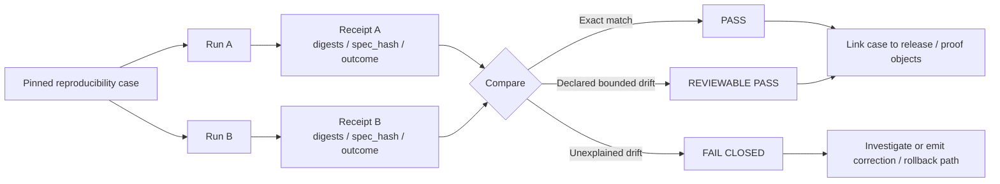

<!-- [KFM_META_BLOCK_V2]
doc_id: kfm://doc/<uuid-review-needed>
title: Reproducibility Tests
type: standard
version: v1
status: draft
owners: @bartytime4life
created: 2026-03-22
updated: 2026-03-24
policy_label: <policy-label-review-needed>
related: [../README.md, ../../contracts/README.md, ../../schemas/README.md, ../../policy/README.md, ../../.github/workflows/README.md]
tags: [kfm, tests, reproducibility]
notes: [Created/updated dates reflect current public path history on main; owner verified from /.github/CODEOWNERS; current public directory contents show README.md only.]
[/KFM_META_BLOCK_V2] -->

# Reproducibility Tests

Determinism, rerun consistency, and receipt-backed rebuild checks for trust-bearing KFM artifacts.

> **Status:** experimental  
> **Owners:** `@bartytime4life`  
> **Path:** `tests/reproducibility/README.md`  
> **Badges:**       
> **Quick jumps:** [Scope](#scope) · [Repo fit](#repo-fit) · [Inputs](#inputs) · [Exclusions](#exclusions) · [Current verified snapshot](#current-verified-snapshot) · [Directory tree](#directory-tree) · [Quickstart](#quickstart) · [Usage](#usage) · [Diagram](#diagram) · [Tables](#tables) · [Task list](#task-list) · [FAQ](#faq) · [Appendix](#appendix)

> [!WARNING]
> Current public `main` branch proves that `tests/reproducibility/` exists and currently lists `README.md` only. The broader `tests/README.md` establishes reproducibility as an explicit verification family, but the public branch does **not** yet prove checked-in reproducibility cases, fixtures, reports, scripts, required checks, or merge-blocking workflow YAML. Treat deeper layout and runner examples below as starter guidance until a live checkout and effective platform settings are re-verified.

---

## Scope

This directory exists to answer one narrow question well:

**If KFM reruns the same trust-bearing work against the same declared scope, do the emitted artifacts, receipts, and visible outcomes remain identical — or at least stay inside an explicitly declared reproducibility envelope?**

That question is narrower than “do the tests pass?” and stricter than “did the job succeed once?”. In KFM, reproducibility matters because release-bearing artifacts, runtime envelopes, policy decisions, and evidence-linked outputs are part of the trust surface, not just internal plumbing.

### Status vocabulary used in this README

- **CONFIRMED** — supported by current public-branch evidence or doctrinal material in hand.
- **INFERRED** — strongly implied by KFM doctrine and the role of this directory, but not directly verified as checked-in executable coverage.
- **PROPOSED** — recommended starter layout or practice for this directory.
- **UNKNOWN** — not directly proven in the current session.
- **NEEDS VERIFICATION** — specifically requires direct checkout, effective CI/platform inspection, or runner confirmation before being treated as implementation fact.

> [!IMPORTANT]
> Negative outcomes still count as reproducible outcomes. A rerun that correctly returns `ABSTAIN`, `DENY`, `ERROR`, or a visible stale/generalized state can be a passing case when that fail-closed behavior is the expected result.

## Repo fit

| Field | Value |
|---|---|
| **Path** | `tests/reproducibility/README.md` |
| **Directory** | `tests/reproducibility/` |
| **Role in repo** | README for rerun consistency, digest stability, `spec_hash` stability, receipt comparison, and bounded-drift checks. |
| **Current public `main` snapshot** | The directory currently exposes `README.md` only. Broader family placement is defined by [`../README.md`](../README.md). |
| **Upstream links** | [`../README.md`](../README.md), [`../../contracts/README.md`](../../contracts/README.md), [`../../schemas/README.md`](../../schemas/README.md), [`../../policy/README.md`](../../policy/README.md), [`../../.github/workflows/README.md`](../../.github/workflows/README.md) |
| **Downstream links** | Future reproducibility cases, baseline receipts, diff reports, and any workflow or release gate that consumes them. No checked-in downstream artifacts are currently visible in this directory on public `main`. |
| **Why this fits KFM** | KFM doctrine expects deterministic identity checks, stale-projection checks, invalid fixtures, policy grammar validation, runtime citation-negative behavior, and auditable run receipts. Reproducibility is where those expectations become repeat-run evidence instead of one-off confidence. |

## Inputs

Accepted inputs for this directory are the **smallest artifacts needed to rerun and compare a trust-bearing case**.

| Accepted input | What belongs here | Status |
|---|---|---|
| Pinned case manifests | A declared case with release scope, source scope, policy/profile refs, environment pins, and pass criteria. | **INFERRED / PROPOSED** |
| Baseline receipts | Prior run receipts used as the comparison anchor. | **INFERRED / PROPOSED** |
| Baseline digests | Expected artifact digests, `spec_hash` values, or bounded tolerances. | **INFERRED / PROPOSED** |
| Stable fixtures | Valid/invalid fixture packs reused by rerun cases. | **CONFIRMED as a tests-level input class; local inventory UNKNOWN** |
| Rerun reports | Machine-readable and human-readable comparison output explaining pass, bounded drift, or failure. | **INFERRED / PROPOSED** |
| Environment pins | Seed values, version refs, runner flags, or other settings required to make a rerun meaningful. | **INFERRED / PROPOSED** |
| Thin-slice evidence | Early lane proofs, especially the first hydrology-oriented thin slice if this directory becomes the home for rerun proofs on that path. | **PROPOSED** |

## Exclusions

This directory should stay narrow. It is **not** the catch-all home for every test, script, or experiment note.

| Does **not** belong here | Put it here instead | Notes |
|---|---|---|
| General test strategy for the whole repo | [`../README.md`](../README.md) | That file is the broader tests entry point. |
| Pure contract/schema shape checks | [`../../contracts/README.md`](../../contracts/README.md), [`../../schemas/README.md`](../../schemas/README.md) | Keep shape authority and contract-home rules close to the contract lane. |
| Policy rulepack-only checks | [`../../policy/README.md`](../../policy/README.md) | Keep decision-grammar and rulepack ownership close to policy sources. |
| Full browser/API journey tests | `../e2e/` or another explicit end-to-end surface once the branch defines it | Do not let reproducibility cases become a second home for generic journey tests. |
| One-off debugging notes | Runbooks or issue-specific notes under `../../docs/` | Reproducibility cases should be stable, reviewable, and rerunnable — not scratchpads. |
| Exploratory notebooks that cannot run headlessly | Notebook or research workspace **NEEDS VERIFICATION** | Promote into this directory only after the rerun path is explicit. |
| Large release artifacts themselves | Release-bearing storage surface, with links back via receipts | Store references, digests, and proofs here; do not turn this directory into a binary dump. |
| Raw performance/load benchmarks | Dedicated performance surface **UNKNOWN** | Reproducibility asks “same declared input, same governed result?”, not “fastest possible run?”. |

## Current verified snapshot

The current public `main` branch proves the following:

- `tests/reproducibility/` exists as a real test-family directory.
- `tests/reproducibility/README.md` exists and is the only branch-visible file currently listed in this directory.
- The broader tests index includes `reproducibility/` as an explicit family under `tests/`.
- `/tests/` is assigned to `@bartytime4life` in `/.github/CODEOWNERS`.
- Public `.github/workflows/` currently shows `README.md` only, so checked-in workflow YAML merge gates are not proven from the public tree alone.

> [!NOTE]
> What is still not proven here: exact runner/toolchain, actual executable case depth, fixture density, required checks, protected-branch settings, and whether rollback/correction drills have been exercised on a checked-out branch.

## Directory tree

### Current confirmed snapshot

```text
tests/reproducibility/
└── README.md
```

### Proposed starter expansion shape (`PROPOSED` / `NEEDS VERIFICATION`)

```text
tests/reproducibility/
├── README.md
├── cases/                        # pinned rerun case definitions
├── fixtures/                     # baseline inputs / valid / invalid packs
│   ├── baseline/
│   ├── valid/
│   └── invalid/
├── receipts/                     # saved reference receipts for comparison
├── reports/                      # human-readable drift summaries
└── scripts/                      # comparison helpers if not promoted elsewhere
```

### Reading rule

Use the **current confirmed snapshot** for public-branch truth.

Use the **proposed starter expansion shape** only as a commit-planning scaffold.

Do not silently convert a proposed layout into claims of checked-in maturity, merge-blocking coverage, or exercised reproducibility proof.

### Directory design rule

Keep this directory **case-first**, not tool-first.

A good layout makes it obvious:

1. what was rerun,
2. what was compared,
3. what counted as stable,
4. what drift was allowed, and
5. what evidence explains the result.

## Quickstart

### Safe inspection commands

These commands are branch-safe because they inspect what is present without assuming a particular runner.

```bash
# inspect the visible reproducibility surface
find tests/reproducibility -maxdepth 4 -type d 2>/dev/null | sort
find tests/reproducibility -maxdepth 4 -type f 2>/dev/null | sort

# inspect adjacent contract, schema, policy, and workflow-facing surfaces
find .github contracts policy schemas tests -maxdepth 4 -type f 2>/dev/null | sort | sed -n '1,240p'

# inspect ownership and public workflow-lane clues
sed -n '1,200p' .github/CODEOWNERS 2>/dev/null || true
sed -n '1,220p' tests/README.md 2>/dev/null || true
sed -n '1,220p' .github/workflows/README.md 2>/dev/null || true
```

### Starter rerun flow (`PSEUDOCODE`)

The real task runner, case filenames, and workflow hooks remain **NEEDS VERIFICATION**, so the snippet below is intentionally labeled as pseudocode.

```bash
# PSEUDOCODE — replace placeholders after direct checkout inspection

# 1) choose a pinned reproducibility case
CASE="tests/reproducibility/cases/<case>.yaml"

# 2) execute the same governed run twice against the same declared scope
<repo-test-runner> reproducibility --case "$CASE" --out /tmp/run-a
<repo-test-runner> reproducibility --case "$CASE" --out /tmp/run-b

# 3) compare receipts, spec hashes, artifact digests, and outcome class
<repo-compare-tool> /tmp/run-a/receipt.json /tmp/run-b/receipt.json

# 4) fail closed if drift is unexplained or outside the case's declared envelope
```

> [!NOTE]
> The smallest credible first case is usually a **single, public-safe thin slice** with strong place/time semantics and emitted receipts — not a sprawling multi-lane integration marathon.

## Usage

### 1. Define the case

Start by writing down the case before you run it.

A good reproducibility case names:

- the released or candidate scope it is allowed to touch,
- the exact artifacts it expects,
- the policy/profile versions that matter,
- the fields that must match exactly,
- the fields that may drift in a bounded way, and
- the negative-path outcome that is valid if the case is expected to fail closed.

### 2. Pin the comparison basis

Pin what “same run” means for this case.

That usually includes some combination of:

- input scope,
- release reference,
- transform or `spec_hash`,
- environment class,
- seed values,
- policy/profile refs,
- expected result class,
- expected artifact digests, and
- receipt fields that must remain stable.

### 3. Run the case at least twice

A single green run proves that the system worked once.

A reproducibility case proves more:

- repeat-run stability,
- explicit bounded drift when exact sameness is not realistic,
- and whether the emitted proof objects are good enough to explain the difference.

### 4. Compare receipts before comparing prose

In KFM, human-facing output should not be your only comparison point.

Compare the machine-level proof first:

- receipt header,
- release refs,
- policy refs,
- `spec_hash`,
- artifact digests,
- runtime outcome class,
- stale/generalized/partial flags,
- and any audit linkage required by the case.

### 5. Treat unexplained drift as a real failure

A mismatch is not automatically a bug, but it is always work.

If a rerun differs, the report should say **which field drifted first**, whether that drift was allowed, and what changed:

- input scope,
- release scope,
- policy basis,
- transform logic,
- environment,
- or runtime state.

Unexplained drift should fail closed.

## Diagram



## Tables

### What this directory should prove first

| Test slice | What must stay stable | Primary comparison objects | Pass rule | Status |
|---|---|---|---|---|
| Canonical identity rerun | Stable IDs, version semantics, and schema-valid emitted objects | `DatasetVersion`, validation outputs, baseline fixture refs | Exact match unless the case declares additive, reviewable drift | **CONFIRMED doctrine / PROPOSED local case** |
| Policy decision rerun | Same decision result, reasons, obligations, and audit linkage for the same policy basis | `DecisionEnvelope`, policy/profile refs | Exact match for fixed inputs and fixed policy version | **CONFIRMED doctrine / PROPOSED local case** |
| Projection rebuild rerun | Same release linkage and digest, or declared bounded rebuild rule | `ProjectionBuildReceipt`, artifact digests, stale-after policy | Exact digest match by default; bounded rule only if explicitly declared | **CONFIRMED doctrine / PROPOSED local case** |
| Runtime envelope rerun | Same governed outcome class and visible trust state | `RuntimeResponseEnvelope`, citation checks, surface state, decision ref | Same `ANSWER` / `ABSTAIN` / `DENY` / `ERROR` class and same required linkage | **CONFIRMED doctrine / PROPOSED local case** |
| Release proof rerun | Same public-safe release assembly | `ReleaseManifest` / `ReleaseProofPack`, docs/accessibility gate refs, rollback note | Reconstructed proof matches declared scope and digest expectations | **INFERRED / PROPOSED** |

### Result classes for reproducibility cases

| Result | Meaning | What to do next |
|---|---|---|
| **PASS** | Receipts, digests, and outcome class match exactly. | Keep the case as a stable regression anchor. |
| **REVIEWABLE PASS** | Drift occurred, but only inside a rule declared by the case. | Keep the drift rule explicit and review whether it still belongs. |
| **FAIL CLOSED** | A required field drifted without an allowed rule, or proof objects were missing. | Investigate before treating the underlying job as trustworthy. |
| **INVALID CASE** | The case itself did not pin enough scope to make comparison meaningful. | Tighten the case manifest before rerunning it. |

## Task list

### Minimum credible definition of done

- [ ] One reproducibility case is checked in with a pinned scope, pinned comparison basis, and explicit pass criteria.
- [ ] The directory contains the minimum case assets needed to rerun and compare that case.
- [ ] The case can be run twice without changing its declared inputs.
- [ ] Both runs emit receipts that can be compared automatically.
- [ ] The comparison checks at least `spec_hash`, artifact digests, release refs, and outcome class.
- [ ] The comparison output identifies the first divergent field when the case fails.
- [ ] The case includes at least one expected negative-path or fail-closed example where relevant.
- [ ] Any tolerated drift is written as a bounded rule in the case definition, not accepted informally.
- [ ] `tests/README.md` and this README stay synchronized when the family meaning or visible inventory changes.
- [ ] Workflow documentation is updated if reproducibility checks become part of a merge or release gate.

### Review gates for maintainers

- [ ] Does the case prove something trust-bearing rather than just re-running a script?
- [ ] Could another maintainer reconstruct the case without tribal knowledge?
- [ ] Are large artifacts referenced by receipt and digest rather than copied here casually?
- [ ] Does the case preserve KFM’s fail-closed posture when evidence, policy, or scope is incomplete?
- [ ] Does the README keep current branch truth separate from proposed future inventory?

## FAQ

### What counts as “reproducible” here?

By default, **exact rerun sameness** is the goal. When exact sameness is unrealistic, the case must declare a **bounded reproducibility rule** up front.

### Is this the same as contract testing?

No. Contract tests prove object shape and validation rules. Reproducibility tests prove that repeated runs remain stable enough to trust.

### Can an `ABSTAIN` or `DENY` outcome pass?

Yes. In KFM, fail-closed behavior is part of the trust contract. If the case expects a valid denial or abstention, reproducing that outcome is a pass.

### Should this directory store full generated artifacts?

Usually no. Prefer manifests, receipts, digest baselines, and comparison reports here. Keep heavyweight release artifacts in their release-bearing storage surface and link them through receipts.

### Does the current public branch prove runnable reproducibility coverage?

No. It proves directory presence and README content, not checked-in case assets, runner selection, required checks, external CI configuration, or exercised rollback/correction history.

### What should be the first case?

A single thin slice with explicit receipts, fixed scope, and strong place/time semantics is better than a broad multi-surface case. If the repo keeps the hydrology-first sequencing already favored in doctrine, that lane is a sensible first candidate.

## Appendix

<details>
<summary><strong>Illustrative reproducibility case template</strong> (PROPOSED)</summary>

The example below is a template, not a claim about checked-in filenames or runner syntax.

```yaml
case_id: repro.<lane>.<artifact-family>.v1
status: proposed

goal: >
  Rerun the same declared scope twice and compare trust-bearing proof objects.

scope:
  release_ref: <release-ref-review-needed>
  lane: <lane-review-needed>
  surface_class: <surface-class-review-needed>
  policy_profile: <policy-profile-review-needed>

inputs:
  baseline_receipt: tests/reproducibility/receipts/<baseline>.json
  seed_values: []
  environment_class: <environment-review-needed>

compare:
  exact_fields:
    - spec_hash
    - result
    - release_ref
  digest_fields:
    - artifacts[].digest
  bounded_fields: []

expected:
  result: ANSWER
  fail_closed_allowed: true

notes:
  - Replace placeholders after direct checkout inspection.
  - If bounded drift is allowed, declare the rule explicitly here.
```

</details>

<details>
<summary><strong>What a good failure report says</strong></summary>

A useful report should answer these questions immediately:

1. Which case failed?
2. Which two runs were compared?
3. Which field diverged first?
4. Was the field supposed to match exactly?
5. If bounded drift was allowed, which rule covered it?
6. If it was not allowed, which follow-up is expected: investigation, correction, rollback, or case rewrite?

</details>

---

[Back to top](#reproducibility-tests)
