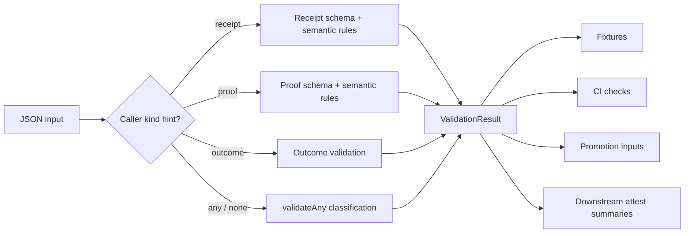

<!-- [KFM_META_BLOCK_V2]
doc_id: kfm://doc/NEEDS-VERIFICATION
title: Runtime Verification Validator
type: standard
version: v1
status: draft
owners: @bartytime4life
created: 2026-04-12
updated: 2026-04-12
policy_label: public
related: [../../contracts/runtime_verification/README.md, ../../schemas/runtime_verification/, ../../tests/runtime_verification/README.md, ../../tests/runtime_verification/fixtures/, ../../tools/attest/README.md, ../../policy/README.md]
tags: [kfm, attest, validator, runtime-verification, receipts, proofs, fail-closed]
notes: [Exact repo path, schema mount path, workflow wiring, and module format remain NEEDS VERIFICATION; this draft is aligned to corpus doctrine but not direct mounted implementation evidence.]
[/KFM_META_BLOCK_V2] -->

# Runtime Verification Validator

Deterministic, read-only validation helpers for runtime verification receipts, proofs, and outcomes.

> [!NOTE]
> **Status:** `draft`  
> **Owners:** `@bartytime4life`  
>       
> **Quick jumps:** [Purpose](#purpose) · [Repo fit](#repo-fit) · [Accepted inputs](#accepted-inputs) · [Interface](#interface) · [Rules](#rules) · [CLI shape](#cli-shape) · [Starter implementation](#starter-implementation) · [Merge checklist](#merge-checklist)

---

## Purpose

Provide one shared validator surface so the repo does **not** duplicate or drift validation logic across:

- fixtures
- CI workflows
- worker tests
- promotion inputs
- downstream attest summaries

This validator is intentionally:

- **read-only**
- **deterministic**
- **schema-aware**
- **fail-closed**

> [!IMPORTANT]
> This validator is a **narrow supporting tool**, not a replacement for KFM’s broader contract lattice or first schema wave. It should align with the wider proof-object discipline rather than silently redefining it.

[Back to top](#runtime-verification-validator)

---

## Repo fit

| Surface | Relationship | Status |
|---|---|---|
| `tools/attest/` | Intended home for reusable validator logic and thin CLI wrappers. | **PROPOSED** |
| `contracts/runtime_verification/` | Intended grammar and documentation home for this narrow runtime-verification object family. | **NEEDS VERIFICATION** |
| `schemas/runtime_verification/` | Intended schema authority for receipt / proof / outcome validation. | **NEEDS VERIFICATION** |
| `tests/runtime_verification/fixtures/` | Intended source of known-good and known-bad examples. | **NEEDS VERIFICATION** |
| `.github/workflows/` | Should call the validator rather than embedding ad hoc validation logic inline. | **PROPOSED** |
| Broader KFM proof-object wave | This validator should align with `spec_hash`, `run_receipt`, `ai_receipt`, attestation refs, and adjacent proof objects without claiming to be the whole schema wave. | **CONFIRMED doctrine / NEEDS VERIFICATION exact mapping** |

### Architectural guardrail

KFM’s wider attached doctrine repeatedly centers a broader contract family such as `SourceDescriptor`, `IngestReceipt`, `ValidationReport`, `DatasetVersion`, `DecisionEnvelope`, `ReviewRecord`, `ReleaseManifest`, `EvidenceBundle`, `RuntimeResponseEnvelope`, and `CorrectionNotice`. This validator should therefore remain a **supporting helper** beneath that broader wave, not become a silent substitute for it.

---

## Accepted inputs

This validator accepts:

- JSON objects intended to represent a runtime-verification **receipt**
- JSON objects intended to represent a runtime-verification **proof**
- JSON strings or values intended to represent a runtime-verification **outcome**
- `.json` fixture files and fixture directories used by tests and CI
- promotion-adjacent or attest-adjacent inputs that need deterministic shape and rule checks before later policy decisions

## Exclusions

This validator does **not**:

- approve releases
- decide policy allowability
- assign reviewer obligations
- resolve evidence bundles
- fetch manifests or artifacts
- compute network digests
- mutate receipts or proofs
- replace the broader KFM proof-object schema wave
- act as a public runtime response envelope or release manifest validator

---

## Diagram



---

## Interface

### Result shape

```ts
type ValidationSeverity = "error";

type ValidationKind = "receipt" | "proof" | "outcome" | "unknown";

type ValidationError = {
  code: string;
  message: string;
  path?: string;
  severity: ValidationSeverity;
};

type ValidationResult = {
  valid: boolean;
  kind: ValidationKind;
  errors: ValidationError[];
};
```

### Public API

```ts
validateOutcome(input: unknown): ValidationResult
validateReceipt(input: unknown): ValidationResult
validateProof(input: unknown): ValidationResult
validateAny(input: unknown): ValidationResult
```

### Classification model

| Kind | Meaning | Notes |
|---|---|---|
| `receipt` | A non-terminal runtime-verification object that records progress or observed state. | Narrow tool-local meaning. Wider KFM mapping remains **NEEDS VERIFICATION**. |
| `proof` | A terminal runtime-verification object that records verification outcome semantics. | Should remain distinct from release/policy objects. |
| `outcome` | A finite outcome value used by proof validation. | Must stay small, explicit, and deterministic. |
| `unknown` | The input could not be classified safely, or classified ambiguously. | Fail closed. |

---

## Rules

### Receipt rules

- must satisfy receipt schema
- must not include `outcome`
- must not include `proof_id`
- must include numeric `bytes_processed`
- if `partial_digest` exists, it must validate as a digest

### Proof rules

- must satisfy proof schema
- must not include `receipt_id`
- must not include `bytes_processed`
- must not include `checkpoint_index`
- must include valid finite `outcome`

### Outcome-specific proof rules

| Outcome | Required behavior |
|---|---|
| `VERIFIED` | requires both digests and they must be equal |
| `MISMATCH` | requires both digests and they must be unequal |
| `MISSING_DECLARATION` | must not fabricate `expected_digest` |
| `INTERRUPTED` | must not masquerade as completed verified proof |
| `ERROR` | may include `reason`; must not imply success |

### Guardrail rules

- same input must produce the same result
- object key order must not affect classification or result
- missing required information must fail closed
- ambiguous classification must fail closed
- validation helpers must not perform network access, writes, or hidden mutation
- schema failure order should be stable where practical

---

## Error codes

| Code | Meaning |
|---|---|
| `SCHEMA_INVALID` | schema validation failed |
| `INVALID_OUTCOME` | outcome not in allowed registry |
| `RECEIPT_HAS_OUTCOME` | receipt illegally contains outcome |
| `RECEIPT_HAS_PROOF_ID` | receipt illegally contains proof identifier |
| `RECEIPT_MISSING_BYTES` | receipt missing `bytes_processed` |
| `PROOF_HAS_RECEIPT_ID` | proof illegally contains receipt identifier |
| `PROOF_HAS_PROGRESS_FIELD` | proof illegally contains receipt-only progress field |
| `DIGEST_INVALID` | digest object malformed |
| `PROOF_MISSING_DIGEST` | required digest missing for outcome |
| `DIGEST_MISMATCH` | verified proof has unequal digests |
| `DIGEST_EQUAL_WHEN_MISMATCH` | mismatch proof has equal digests |
| `FABRICATED_EXPECTED_DIGEST` | missing-declaration proof includes expected digest |
| `AMBIGUOUS_INTERRUPTED_PROOF` | interrupted proof appears completed |
| `UNKNOWN_KIND` | object could not be classified safely |

---

## CLI shape

A thin CLI wrapper is recommended so workflows can call the validator directly.

### Suggested commands

```bash
node tools/attest/runtime_verification_validator.mjs validate-file path/to/file.json
node tools/attest/runtime_verification_validator.mjs validate-dir tests/runtime_verification/fixtures/receipts
node tools/attest/runtime_verification_validator.mjs validate-dir tests/runtime_verification/fixtures/proofs
node tools/attest/runtime_verification_validator.mjs summary tests/runtime_verification/fixtures
```

> [!TIP]
> A future refinement is to support an explicit `--kind receipt|proof|outcome|any` hint for callers and invalid-fixture directories. That refinement is **PROPOSED**, not assumed by this draft.

### Machine-readable output

```json
{
  "valid": false,
  "kind": "proof",
  "errors": [
    {
      "code": "PROOF_MISSING_DIGEST",
      "message": "VERIFIED proof requires both expected_digest and observed_digest.",
      "path": "/",
      "severity": "error"
    }
  ]
}
```

[Back to top](#runtime-verification-validator)

---

## Determinism and fail-closed behavior

This validator should preserve the following behaviors:

- same input must produce same result
- no random IDs, timestamps, or external calls
- object key order must not affect result
- failure ordering should be stable where practical
- unknown or ambiguous classification should be invalid, not silently tolerated
- malformed or missing required fields should be explicit deny conditions for later gates that depend on this validator

---

## Proposed file layout

```text
# Exact mount paths remain NEEDS VERIFICATION.

tools/
  attest/
    runtime_verification_validator.mjs
    runtime_verification_invalid_fixture_check.mjs
    README.md

schemas/
  runtime_verification/
    outcome.schema.json
    digest.schema.json
    receipt.schema.json
    proof.schema.json

tests/
  runtime_verification/
    README.md
    fixtures/
      receipts/
      proofs/
      invalid/
```

---

## Workflow simplification target

After this file lands, the workflow should stop embedding runtime-verification logic inline and instead call the validator.

```yaml
- name: Install validator dependencies
  run: npm install --no-save ajv ajv-formats

- name: Validate valid receipt fixtures
  run: node tools/attest/runtime_verification_validator.mjs validate-dir tests/runtime_verification/fixtures/receipts

- name: Validate valid proof fixtures
  run: node tools/attest/runtime_verification_validator.mjs validate-dir tests/runtime_verification/fixtures/proofs
```

For invalid fixtures, use a small negative-test wrapper or a dedicated script that asserts non-zero exit.

---

## Starter implementation

> [!WARNING]
> The implementation below is **illustrative starter code**, not a claim of mounted repository reality. Exact schema `$id` values, schema paths, package format, and workflow wiring remain **NEEDS VERIFICATION**.

<details>
<summary><code>tools/attest/runtime_verification_validator.mjs</code> — illustrative starter implementation</summary>

```js
#!/usr/bin/env node

import fs from "node:fs";
import path from "node:path";
import process from "node:process";
import Ajv from "ajv";
import addFormats from "ajv-formats";

const ROOT = process.cwd();

const OUTCOME_VALUES = new Set([
  "VERIFIED",
  "MISMATCH",
  "MISSING_DECLARATION",
  "INTERRUPTED",
  "ERROR"
]);

function makeError(code, message, path = "/") {
  return { code, message, path, severity: "error" };
}

function readJson(filePath) {
  return JSON.parse(fs.readFileSync(filePath, "utf8"));
}

function loadSchemas(baseDir = path.join(ROOT, "schemas", "runtime_verification")) {
  const files = {
    outcome: path.join(baseDir, "outcome.schema.json"),
    digest: path.join(baseDir, "digest.schema.json"),
    receipt: path.join(baseDir, "receipt.schema.json"),
    proof: path.join(baseDir, "proof.schema.json")
  };

  for (const p of Object.values(files)) {
    if (!fs.existsSync(p)) {
      throw new Error(`Missing schema file: ${p}`);
    }
  }

  const ajv = new Ajv({
    strict: false,
    allErrors: true,
    allowUnionTypes: true
  });
  addFormats(ajv);

  const schemas = {
    outcome: readJson(files.outcome),
    digest: readJson(files.digest),
    receipt: readJson(files.receipt),
    proof: readJson(files.proof)
  };

  ajv.addSchema(schemas.outcome, schemas.outcome.$id);
  ajv.addSchema(schemas.digest, schemas.digest.$id);
  ajv.addSchema(schemas.receipt, schemas.receipt.$id);
  ajv.addSchema(schemas.proof, schemas.proof.$id);

  return {
    ajv,
    schemas,
    validateOutcomeSchema: ajv.getSchema(schemas.outcome.$id),
    validateDigestSchema: ajv.getSchema(schemas.digest.$id),
    validateReceiptSchema: ajv.getSchema(schemas.receipt.$id),
    validateProofSchema: ajv.getSchema(schemas.proof.$id)
  };
}

const ctx = loadSchemas();

function schemaErrorsToValidationErrors(errors) {
  if (!errors || !errors.length) {
    return [makeError("SCHEMA_INVALID", "Unknown schema validation failure.", "/")];
  }

  return errors.map((err) =>
    makeError(
      "SCHEMA_INVALID",
      err.message ? `Schema validation failed: ${err.message}` : "Schema validation failed.",
      err.instancePath || "/"
    )
  );
}

function isObject(value) {
  return typeof value === "object" && value !== null && !Array.isArray(value);
}

function digestEqual(a, b) {
  return !!a && !!b && a.algorithm === b.algorithm && a.hex === b.hex;
}

function validateDigestSemantics(digest, labelPath) {
  const errors = [];

  if (!ctx.validateDigestSchema(digest)) {
    errors.push(
      ...schemaErrorsToValidationErrors(ctx.validateDigestSchema.errors).map((e) =>
        makeError("DIGEST_INVALID", e.message, labelPath)
      )
    );
    return errors;
  }

  if (digest.algorithm === "sha256" && digest.hex.length !== 64) {
    errors.push(
      makeError(
        "DIGEST_INVALID",
        "Digest hex must be exactly 64 characters for sha256.",
        `${labelPath}/hex`
      )
    );
  }

  if (digest.hex !== digest.hex.toLowerCase()) {
    errors.push(
      makeError("DIGEST_INVALID", "Digest hex must be lowercase.", `${labelPath}/hex`)
    );
  }

  return errors;
}

export function validateOutcome(input) {
  const errors = [];

  if (!ctx.validateOutcomeSchema(input)) {
    errors.push(...schemaErrorsToValidationErrors(ctx.validateOutcomeSchema.errors));
  }

  if (typeof input !== "string" || !OUTCOME_VALUES.has(input)) {
    errors.push(
      makeError(
        "INVALID_OUTCOME",
        "Outcome must be one of VERIFIED, MISMATCH, MISSING_DECLARATION, INTERRUPTED, ERROR.",
        "/"
      )
    );
  }

  return {
    valid: errors.length === 0,
    kind: "outcome",
    errors
  };
}

export function validateReceipt(input) {
  const errors = [];

  if (!ctx.validateReceiptSchema(input)) {
    errors.push(...schemaErrorsToValidationErrors(ctx.validateReceiptSchema.errors));
  }

  if (!isObject(input)) {
    return { valid: false, kind: "receipt", errors };
  }

  if ("outcome" in input) {
    errors.push(
      makeError(
        "RECEIPT_HAS_OUTCOME",
        "Receipt must not include final proof field `outcome`.",
        "/outcome"
      )
    );
  }

  if ("proof_id" in input) {
    errors.push(
      makeError(
        "RECEIPT_HAS_PROOF_ID",
        "Receipt must not include proof identifier `proof_id`.",
        "/proof_id"
      )
    );
  }

  if (typeof input.bytes_processed !== "number") {
    errors.push(
      makeError(
        "RECEIPT_MISSING_BYTES",
        "Receipt must include numeric `bytes_processed`.",
        "/bytes_processed"
      )
    );
  }

  if ("partial_digest" in input && input.partial_digest != null) {
    errors.push(...validateDigestSemantics(input.partial_digest, "/partial_digest"));
  }

  return {
    valid: errors.length === 0,
    kind: "receipt",
    errors
  };
}

export function validateProof(input) {
  const errors = [];

  if (!ctx.validateProofSchema(input)) {
    errors.push(...schemaErrorsToValidationErrors(ctx.validateProofSchema.errors));
  }

  if (!isObject(input)) {
    return { valid: false, kind: "proof", errors };
  }

  if ("receipt_id" in input) {
    errors.push(
      makeError(
        "PROOF_HAS_RECEIPT_ID",
        "Proof must not include receipt identifier `receipt_id`.",
        "/receipt_id"
      )
    );
  }

  if ("bytes_processed" in input) {
    errors.push(
      makeError(
        "PROOF_HAS_PROGRESS_FIELD",
        "Proof must not include receipt-only progress field `bytes_processed`.",
        "/bytes_processed"
      )
    );
  }

  if ("checkpoint_index" in input) {
    errors.push(
      makeError(
        "PROOF_HAS_PROGRESS_FIELD",
        "Proof must not include receipt-only progress field `checkpoint_index`.",
        "/checkpoint_index"
      )
    );
  }

  const outcomeResult = validateOutcome(input.outcome);
  if (!outcomeResult.valid) {
    errors.push(
      makeError(
        "INVALID_OUTCOME",
        "Proof must include a valid finite outcome.",
        "/outcome"
      )
    );
    return { valid: false, kind: "proof", errors };
  }

  if ("expected_digest" in input && input.expected_digest != null) {
    errors.push(...validateDigestSemantics(input.expected_digest, "/expected_digest"));
  }

  if ("observed_digest" in input && input.observed_digest != null) {
    errors.push(...validateDigestSemantics(input.observed_digest, "/observed_digest"));
  }

  switch (input.outcome) {
    case "VERIFIED": {
      if (!input.expected_digest || !input.observed_digest) {
        errors.push(
          makeError(
            "PROOF_MISSING_DIGEST",
            "VERIFIED proof requires both expected_digest and observed_digest.",
            "/"
          )
        );
      } else if (!digestEqual(input.expected_digest, input.observed_digest)) {
        errors.push(
          makeError(
            "DIGEST_MISMATCH",
            "VERIFIED proof requires equal expected and observed digests.",
            "/"
          )
        );
      }
      break;
    }

    case "MISMATCH": {
      if (!input.expected_digest || !input.observed_digest) {
        errors.push(
          makeError(
            "PROOF_MISSING_DIGEST",
            "MISMATCH proof requires both expected_digest and observed_digest.",
            "/"
          )
        );
      } else if (digestEqual(input.expected_digest, input.observed_digest)) {
        errors.push(
          makeError(
            "DIGEST_EQUAL_WHEN_MISMATCH",
            "MISMATCH proof requires unequal expected and observed digests.",
            "/"
          )
        );
      }
      break;
    }

    case "MISSING_DECLARATION": {
      if (input.expected_digest) {
        errors.push(
          makeError(
            "FABRICATED_EXPECTED_DIGEST",
            "MISSING_DECLARATION proof must not fabricate expected_digest.",
            "/expected_digest"
          )
        );
      }
      break;
    }

    case "INTERRUPTED": {
      if (
        input.expected_digest &&
        input.observed_digest &&
        digestEqual(input.expected_digest, input.observed_digest)
      ) {
        errors.push(
          makeError(
            "AMBIGUOUS_INTERRUPTED_PROOF",
            "INTERRUPTED proof must not appear equivalent to a completed verified proof.",
            "/"
          )
        );
      }
      break;
    }

    case "ERROR":
      break;
  }

  return {
    valid: errors.length === 0,
    kind: "proof",
    errors
  };
}

export function validateAny(input) {
  const receipt = validateReceipt(input);
  const proof = validateProof(input);

  if (receipt.valid && !proof.valid) return receipt;
  if (proof.valid && !receipt.valid) return proof;
  if (receipt.valid && proof.valid) {
    return {
      valid: false,
      kind: "unknown",
      errors: [
        makeError(
          "UNKNOWN_KIND",
          "Input ambiguously validated as both receipt and proof.",
          "/"
        )
      ]
    };
  }

  return {
    valid: false,
    kind: "unknown",
    errors: [...receipt.errors, ...proof.errors]
  };
}

function walkJsonFiles(targetPath) {
  const stat = fs.statSync(targetPath);
  if (stat.isFile()) return [targetPath];

  const out = [];
  for (const entry of fs.readdirSync(targetPath)) {
    const full = path.join(targetPath, entry);
    const st = fs.statSync(full);
    if (st.isDirectory()) out.push(...walkJsonFiles(full));
    else if (st.isFile() && full.endsWith(".json")) out.push(full);
  }
  return out.sort();
}

function summarizeResults(results) {
  return {
    total: results.length,
    valid: results.filter((r) => r.result.valid).length,
    invalid: results.filter((r) => !r.result.valid).length
  };
}

function main(argv) {
  const [, , command, target] = argv;

  if (!command || !target) {
    console.error("Usage:");
    console.error("  node tools/attest/runtime_verification_validator.mjs validate-file <file.json>");
    console.error("  node tools/attest/runtime_verification_validator.mjs validate-dir <dir>");
    console.error("  node tools/attest/runtime_verification_validator.mjs summary <dir>");
    process.exit(2);
  }

  if (!fs.existsSync(target)) {
    console.error(`Target does not exist: ${target}`);
    process.exit(2);
  }

  if (command === "validate-file") {
    const input = readJson(target);
    const result = validateAny(input);
    console.log(JSON.stringify(result, null, 2));
    process.exit(result.valid ? 0 : 1);
  }

  if (command === "validate-dir" || command === "summary") {
    const files = walkJsonFiles(target);
    const results = files.map((file) => {
      const input = readJson(file);
      return {
        file,
        result: validateAny(input)
      };
    });

    if (command === "validate-dir") {
      console.log(
        JSON.stringify(
          results.map((r) => ({
            file: r.file,
            ...r.result
          })),
          null,
          2
        )
      );
      process.exit(results.every((r) => r.result.valid) ? 0 : 1);
    }

    const summary = summarizeResults(results);
    console.log(JSON.stringify(summary, null, 2));
    process.exit(summary.invalid === 0 ? 0 : 1);
  }

  console.error(`Unknown command: ${command}`);
  process.exit(2);
}

if (import.meta.url === `file://${process.argv[1]}`) {
  main(process.argv);
}
```

</details>

[Back to top](#runtime-verification-validator)

---

## Negative fixture runner

<details>
<summary><code>tools/attest/runtime_verification_invalid_fixture_check.mjs</code> — illustrative negative-fixture helper</summary>

```js
#!/usr/bin/env node

import fs from "node:fs";
import path from "node:path";
import process from "node:process";
import { validateAny } from "./runtime_verification_validator.mjs";

function readJson(filePath) {
  return JSON.parse(fs.readFileSync(filePath, "utf8"));
}

function walkJsonFiles(targetPath) {
  const stat = fs.statSync(targetPath);
  if (stat.isFile()) return [targetPath];

  const out = [];
  for (const entry of fs.readdirSync(targetPath)) {
    const full = path.join(targetPath, entry);
    const st = fs.statSync(full);
    if (st.isDirectory()) out.push(...walkJsonFiles(full));
    else if (st.isFile() && full.endsWith(".json")) out.push(full);
  }
  return out.sort();
}

const target = process.argv[2];
if (!target) {
  console.error("Usage: node tools/attest/runtime_verification_invalid_fixture_check.mjs <dir>");
  process.exit(2);
}

const files = walkJsonFiles(target);
const failures = [];

for (const file of files) {
  const result = validateAny(readJson(file));
  if (result.valid) {
    failures.push(`${file} was expected to be invalid but passed`);
  }
}

if (failures.length) {
  for (const failure of failures) console.error(failure);
  process.exit(1);
}

console.log(`All invalid fixtures were correctly rejected: ${files.length}/${files.length}`);
```

</details>

> [!TIP]
> If invalid fixtures are later split by kind, a kind-aware wrapper is the cleanest next refinement.

---

## Merge checklist

- [ ] add validator file under `tools/attest/`
- [ ] add dependency note for `ajv` + `ajv-formats`
- [ ] refactor workflow to call validator file
- [ ] add negative-fixture runner
- [ ] align final schema mount paths and `$id` values
- [ ] add valid and invalid fixtures
- [ ] add tests for `validateReceipt`, `validateProof`, and `validateAny`
- [ ] decide whether callers need explicit `--kind` hints
- [ ] confirm how this helper maps into the broader proof-object family
- [ ] verify adjacent docs that should link here once the mounted repo is visible

---

## Open verification items

- Does this object family actually live under `contracts/runtime_verification/` and `schemas/runtime_verification/`, or under a different mounted path?
- Is `receipt` here intended as a narrow overlay, or should it align directly with a wider `run_receipt` / `ValidationReport` / `IngestReceipt` family?
- Are `proof` and `outcome` lane-local helper concepts, or shared proof-object carriers across multiple runtime surfaces?
- What are the final schema `$id` values and example fixtures?
- Which workflow or test surfaces should call `validateAny`, and which should require an explicit kind?
- Should runtime-verification examples become golden fixtures in CI?

---

## One-line summary

This validator gives KFM one deterministic, reusable, fail-closed helper for runtime-verification objects across fixtures, CI, and downstream attest surfaces—without claiming broader release authority it does not own.

[Back to top](#runtime-verification-validator)
