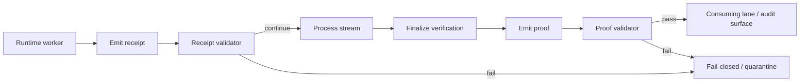

<!-- [KFM_META_BLOCK_V2]
doc_id: kfm://doc/NEEDS-VERIFICATION
title: Runtime Verification Test Suite
type: standard
version: v1
status: draft
owners: @bartytime4life
created: 2026-04-12
updated: 2026-04-12
policy_label: public
related: [../../contracts/runtime_verification/README.md, ../../schemas/runtime_verification/, ../../tools/attest/README.md, ../../tests/README.md, ../../policy/README.md]
tags: [kfm, tests, runtime-verification, fixtures, validation, e2e]
notes: [Target paths, related links, and exact contract names remain NEEDS VERIFICATION until the mounted repo surfaces schemas, fixtures, and CI wiring.]
[/KFM_META_BLOCK_V2] -->

# Runtime Verification Test Suite

Deterministic, fail-closed test surface for runtime verification receipts, proofs, fixtures, and end-to-end verification flows.

> [!NOTE]
> This document defines the **target** test surface for runtime verification. It preserves confirmed KFM verification doctrine, but it does **not** claim that the tree, schemas, fixtures, validators, or CI jobs below are already present in the mounted repository.

**Status:** `draft`  
**Owners:** `@bartytime4life`  
    

**Quick jumps:** [Scope](#scope) · [Repo fit](#repo-fit) · [Outcome grammar](#outcome-grammar-proposed) · [Test families](#test-families) · [Target tree](#target-tree) · [E2E matrix](#e2e-matrix) · [CI integration](#ci-integration)

---

## Scope

This suite exists to make runtime verification artifacts inspectable, machine-checkable, and safe to trust.

It focuses on four things:

- contract-valid fixture coverage
- explicit receipt vs proof separation
- finite, fail-closed verification outcomes
- deterministic end-to-end verification behavior

This suite is for **runtime verification artifacts** and their supporting fixtures. It is **not** the place to define broader release proof packs, full shell/UI trust-state coverage, or all promotion choreography across the repo.

[Back to top](#runtime-verification-test-suite)

## Repo fit

**Target path (INFERRED):** `tests/runtime_verification/README.md`

**Upstream references**
- [`../../contracts/runtime_verification/README.md`](../../contracts/runtime_verification/README.md)
- [`../../schemas/runtime_verification/`](../../schemas/runtime_verification/)
- [`../../policy/README.md`](../../policy/README.md)

**Adjacent or downstream references**
- [`../../tools/attest/README.md`](../../tools/attest/README.md)
- [`../../tests/README.md`](../../tests/README.md)

### Accepted inputs

This suite should accept:

- JSON Schemas for runtime verification receipt and proof objects
- valid and invalid receipt fixtures
- valid and invalid proof fixtures
- end-to-end simulation traces or replay inputs
- policy reason and obligation registries when verification results affect promotion

### Exclusions

This suite should **not** be the home for:

- release-significant proof-pack assembly
- general shell/UI evidence-drawer behavior
- domain-lane source onboarding or catalog closure tests
- signing workflow implementation details that properly belong under `tools/attest/` or release/promotion lanes

[Back to top](#runtime-verification-test-suite)

## Verification posture

The doctrinal center is stable; the local realization details remain partly open.

| Area | Posture | Meaning here |
| --- | --- | --- |
| Verification is cross-cutting | **CONFIRMED** | Runtime verification belongs inside the governed verification stack, not as an afterthought. |
| Negative outcomes are first-class | **CONFIRMED** | A failed or narrowed result is a valid inspected outcome, not an embarrassing edge case. |
| Invalid fixtures are required | **CONFIRMED** | Contract tests should prove both valid and invalid cases. |
| Receipt/proof split | **CONFIRMED doctrine / PROPOSED local rule shape** | KFM clearly separates receipt-like process memory from proof-like release-significant trust objects; exact runtime verification contract boundaries remain to be surfaced. |
| Exact runtime verification outcome enum below | **PROPOSED** | The finite outcome set in this file is a recommended contract surface, not a surfaced canonical enum from the mounted repo. |
| Tree, schema names, CI wiring | **NEEDS VERIFICATION** | Current mounted repo evidence did not surface those files directly. |

> [!IMPORTANT]
> In this file, a **receipt** is process-memory evidence emitted during runtime work, while a **proof** is the final verification artifact for one runtime stream or session. That distinction is deliberate: receipts and proofs must not quietly collapse into one object.

## Core contract boundaries

### Receipt

A runtime verification receipt is the process-memory object emitted during progress or checkpoint phases. It records observable state such as progress, bytes processed, checkpoint status, or stream continuity markers.

A receipt should **not** make the final verification claim.

### Proof

A runtime verification proof is the finalized verification artifact emitted once the runtime stream or session ends. It is the object that carries the final verification outcome and any required digest comparison.

### Release proof pack

A release proof pack is broader than this suite’s main concern. This README may reference it, but it should be tested elsewhere.

[Back to top](#runtime-verification-test-suite)

## Outcome grammar (proposed)

The exact finite outcome set below is a **proposed** runtime verification proof grammar. It is compatible with KFM’s confirmed fail-closed posture, but it is not presented here as a mounted, checked-in canonical enum.

| Outcome | Meaning | Minimum rule |
| --- | --- | --- |
| `VERIFIED` | Expected and observed verification values align. | Requires all mandatory declaration and observed fields. |
| `MISMATCH` | Verification completed, but expected and observed values differ. | Requires both expected and observed values. |
| `MISSING_DECLARATION` | Verification could not complete because an expected declaration was absent. | Must not fabricate the missing declaration. |
| `INTERRUPTED` | Stream or runtime work ended before final verification could complete. | Must not be upgraded to success. |
| `ERROR` | Technical failure prevented safe completion. | Must remain explicit and auditable. |

### Important distinction

These proof outcomes are **not** the same thing as the outward public response grammar used by broader runtime answer envelopes. A proof outcome describes the verification status of a runtime artifact or stream. A public response outcome describes what the system is allowed to say outwardly.

That distinction is intentional and should remain visible in tests, contracts, and docs.

## Target tree

```text
tests/
  runtime_verification/
    README.md
    fixtures/
      receipts/
      proofs/
      invalid/
    e2e/
    validators/
```

| Path | Intended role |
| --- | --- |
| `fixtures/receipts/` | Valid receipt objects and receipt-shape edge cases |
| `fixtures/proofs/` | Valid finalized proof objects |
| `fixtures/invalid/` | Known-bad payloads that must fail deterministically |
| `e2e/` | End-to-end flow simulations and replay tests |
| `validators/` | Contract assertions, semantic checks, and test helpers |

> [!WARNING]
> Treat this as a **target tree**, not a claim that these directories already exist in the mounted repo.

[Back to top](#runtime-verification-test-suite)

## Test families

| Family | What it proves | Minimum posture |
| --- | --- | --- |
| Schema validation | Objects conform to contract shape | Must include valid and invalid fixtures |
| Outcome enforcement | Final proof outcomes stay finite and explicit | Unknown or implicit success states fail |
| Receipt vs proof separation | Process-memory and final-claim objects do not blur | Receipt/proof boundaries stay enforceable |
| Digest semantics | Digests are syntactically valid and semantically interpretable | Success without required digest evidence fails |
| Fail-closed behavior | Missing, incomplete, or errored states do not become success | Negative states remain first-class |
| Determinism | Same inputs yield the same proof outcome and semantically equivalent proof | Replay is stable |

### 1) Schema validation

Ensures receipt and proof objects conform strictly to their schemas.

| Test | Expectation |
| --- | --- |
| valid receipt | passes |
| valid proof — verified | passes |
| valid proof — mismatch | passes |
| valid proof — missing declaration | passes |
| valid proof — interrupted | passes |
| missing required fields | fails |
| undeclared extra fields in closed schema | fails |
| invalid digest format | fails |

### 2) Outcome enforcement

Ensures the proof outcome grammar is finite, explicit, and case-stable.

| Test | Expectation |
| --- | --- |
| `VERIFIED` valid | passes |
| `MISMATCH` valid | passes |
| `MISSING_DECLARATION` valid | passes |
| `INTERRUPTED` valid | passes |
| `ERROR` valid | passes |
| unknown outcome value | fails |
| lowercase or mixed-case variant | fails |
| omitted outcome on finalized proof | fails |

### 3) Receipt vs proof separation

Ensures runtime receipts do not masquerade as final proofs and final proofs do not carry receipt-only process state by accident.

| Test | Expectation |
| --- | --- |
| receipt contains no final outcome | passes |
| receipt contains progress or checkpoint state only | passes |
| proof contains final outcome | passes |
| receipt masquerading as proof | fails |
| proof containing receipt-only checkpoint/process fields | fails |

### 4) Digest semantics

Ensures digest syntax and comparison semantics behave predictably.

| Test | Expectation |
| --- | --- |
| valid hex length (64) | passes |
| invalid hex characters | fails |
| `MISMATCH` with differing digests | passes |
| `VERIFIED` without both expected and observed digests | fails |
| fabricated expected digest under `MISSING_DECLARATION` | fails |

### 5) Fail-closed behavior

Ensures ambiguity never upgrades itself into success.

| Test | Expectation |
| --- | --- |
| missing expected digest | `MISSING_DECLARATION` |
| incomplete stream | `INTERRUPTED` |
| runtime exception during finalization | `ERROR` |
| truncated artifact | not `VERIFIED` |
| empty or free-text success string | fails |

### 6) Determinism

Ensures the proof surface is stable enough to be replayed, diffed, and trusted.

| Test | Expectation |
| --- | --- |
| same input → same proof outcome | passes |
| same input → semantically equivalent proof | passes |
| receipt replay → same finalized outcome | passes |
| field order irrelevant | passes |
| excluded volatile fields do not affect equality | passes |

[Back to top](#runtime-verification-test-suite)

## Fixture structure

### Naming convention

```text
<type>__<scenario>__<status>.json
```

Examples:

```text
receipt__checkpoint__valid.json
receipt__resumed__valid.json
proof__verified__valid.json
proof__mismatch__valid.json
proof__missing-declaration__valid.json
proof__interrupted__valid.json
proof__verified__missing-digest.json
receipt__pretending-proof__invalid.json
```

### Fixture categories

#### Valid receipts
- minimal receipt
- checkpoint receipt
- resumed receipt

#### Valid proofs
- verified proof
- mismatch proof
- missing declaration proof
- interrupted proof
- error proof

#### Invalid payloads
- missing required fields
- invalid outcome value
- invalid digest format
- proof missing digest
- receipt with final outcome field
- proof with receipt-only checkpoint fields

<details>
<summary><strong>Starter fixture inventory (proposed)</strong></summary>

```text
fixtures/
  receipts/
    receipt__minimal__valid.json
    receipt__checkpoint__valid.json
    receipt__resumed__valid.json
  proofs/
    proof__verified__valid.json
    proof__mismatch__valid.json
    proof__missing-declaration__valid.json
    proof__interrupted__valid.json
    proof__error__valid.json
  invalid/
    receipt__final-outcome__invalid.json
    proof__missing-digest__invalid.json
    proof__unknown-outcome__invalid.json
    proof__bad-digest-format__invalid.json
    proof__checkpoint-fields__invalid.json
```

</details>

## Validation rules

### Core assertions

All fixtures should be subject to:

- JSON Schema validation
- required field presence checks
- type validation
- enum validation
- deterministic field comparison rules where replay matters

### Proof-specific rules

- `VERIFIED` requires both expected and observed digest values.
- `MISMATCH` requires both expected and observed digest values.
- `MISSING_DECLARATION` must not fabricate a missing expected digest.
- `INTERRUPTED` must remain non-successful even if partial receipt evidence exists.
- `ERROR` must remain explicit and auditable.

### Receipt-specific rules

- must not include the final proof outcome
- should carry process-memory fields only
- should support deterministic replay and checkpoint assertions
- should remain distinguishable from finalized proof objects by shape alone

[Back to top](#runtime-verification-test-suite)

## E2E matrix

### Runtime flow coverage

| Scenario | Expected proof outcome |
| --- | --- |
| full stream verified | `VERIFIED` |
| digest mismatch | `MISMATCH` |
| missing declaration | `MISSING_DECLARATION` |
| interrupted stream | `INTERRUPTED` |
| worker or finalization error | `ERROR` |

### Behavioral assertions

| Behavior | Expectation |
| --- | --- |
| receipt emitted before proof | required |
| proof emitted once | required |
| progress monotonic | required |
| bytes processed non-decreasing | required |
| checkpoint intervals respected | required |
| interrupted runs never promoted to verified | required |

## Diagram



## CI integration

### Minimum CI checks

- validate all receipt and proof fixtures against schema
- ensure invalid fixtures fail deterministically
- enforce finite proof outcome grammar
- enforce receipt vs proof separation
- confirm deterministic replay for at least one golden fixture set

### Suggested CI outputs

- pass/fail per fixture
- semantic diff for proof mismatches
- deterministic replay summary
- outcome counts by proof type
- one compact receipt/proof validation summary suitable for PR review

## Validator interface (proposed)

```ts
type ValidationResult = {
  valid: boolean;
  errors: string[];
};

function validateReceipt(input: unknown): ValidationResult;
function validateProof(input: unknown): ValidationResult;
function validateOutcome(input: unknown): ValidationResult;
```

## Merge checklist

- [ ] Target tree is created or intentionally deferred with explanation
- [ ] Valid receipt fixtures added
- [ ] Valid proof fixtures added
- [ ] Invalid fixtures added
- [ ] Schema validation tests added
- [ ] Outcome enforcement tests added
- [ ] Receipt/proof separation tests added
- [ ] Determinism or replay test added
- [ ] CI wiring added or explicitly left `NEEDS VERIFICATION`
- [ ] Related contract, schema, and policy docs updated if behavior changed

## Definition of done

This document is materially complete when:

1. receipt and proof schemas are surfaced or linked directly
2. valid and invalid fixtures exist for each named test family
3. one replayable E2E path proves receipt emission, proof finalization, and fail-closed handling
4. CI rejects malformed fixtures and unexpected outcome drift
5. adjacent contract and policy docs reflect the same runtime verification vocabulary

---

## One-line summary

This suite makes runtime verification **deterministic, explicit, outcome-finite, and fail-closed** without pretending that current repo wiring has already been verified.

[Back to top](#runtime-verification-test-suite)
