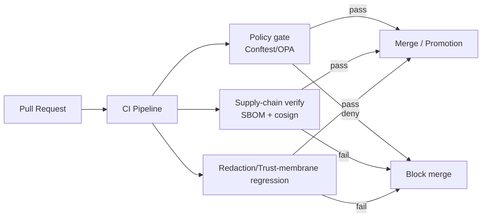

<!--
path: tests/security/README.md
purpose: Security & governance regression tests (fail-closed) for the KFM trust membrane.
-->

# tests/security — Security & Governance Test Suite 🔒🧾

**Status:** governed • CI-enforced • fail-closed  
**Scope:** policy-as-code regression, supply-chain evidence verification, redaction/authorization non-regression, and trust-membrane invariants.

> [!IMPORTANT]
> Changes to `tests/security/**` are **production-impacting**. These tests define what the system is allowed to *publish* and *serve* across the KFM trust membrane.

---

## Why this exists

KFM’s security posture is not “best effort.” It is **machine-checkable and enforced**:

- **Deny-by-default policies** (OPA/Rego via Conftest) should block merges/promotions when required evidence, licenses, provenance pointers, or governance labels are missing.
- **Supply-chain evidence** (SBOM + signatures/attestations) must be verifiable before promotion.
- **Policy regression** must ensure that any previously discovered leak (restricted fields, sensitive locations, etc.) **never returns**.

This directory holds the **tests and regression fixtures** that make those guarantees durable.

---

## What this suite enforces

### 1) Policy-as-code gates (OPA/Rego + Conftest)
Policy gates should fail-closed when required invariants are missing or invalid:

- required evidence fields (e.g., receipts/provenance pointers)
- license/rights and sensitivity labels
- “no insecure accessURL” / approved providers (deny-by-default patterns)
- “exceptions must cite governance ticket” (where applicable)

### 2) Supply-chain evidence verification (SBOM + attestations)
Tests verify that build artifacts (containers and/or dataset bundles) include:

- SBOM (SPDX or CycloneDX)
- signature verification passes
- attestations are present and satisfy policy

### 3) Redaction + authorization regression (trust membrane)
A policy regression suite that ensures:

- **golden leak queries** fail forever (non-regression)
- sensitive-location layers are not returned at high precision to unauthorized roles
- restricted/aggregate-only fields are redacted/suppressed as required
- every API response includes an audit reference and evidence bundle hash (audit integrity)

### 4) UI trust surfaces (no direct evidence fetch)
Tests should ensure UI clients do not fetch attestations/SBOMs directly from untrusted origins.
Evidence links must be resolved through a server-side verifier/proxy that verifies signatures and strips secrets.

---

## CI flow at a glance



---

## Directory layout

> [!NOTE]
> Some paths below are “recommended shape.” The contract is: **tests live here**, and they run in CI as required status checks.

```text
tests/security/
├─ README.md
├─ policy/                       # policy-as-code regression tests + fixtures
│  ├─ fixtures/
│  │  ├─ run_receipt.valid.json
│  │  ├─ run_receipt.invalid.missing_spec_hash.json
│  │  └─ ...
│  ├─ cases/                     # table-driven cases (YAML/JSON) for policy regression
│  │  └─ policy_regression_cases.yml
│  └─ runner/                    # small harness scripts to run conftest deterministically
│     └─ run_conftest.sh
├─ supply_chain/
│  ├─ fixtures/
│  │  ├─ sbom.cdx.json
│  │  ├─ slsa.att.json
│  │  └─ ...
│  └─ runner/
│     ├─ verify_cosign.sh
│     └─ verify_sbom_policy.sh
├─ redaction/
│  ├─ golden_queries/            # regression queries that must never leak restricted data
│  │  └─ golden_queries.yml
│  ├─ expected/                  # expected safe responses (snapshots)
│  │  └─ ...
│  └─ runner/
│     └─ run_redaction_regression.sh
└─ trust_membrane/
   ├─ invariants/                # tests for “no direct DB/storage access from UI”
   │  └─ ...
   └─ runner/
      └─ run_trust_membrane_checks.sh
```

---

## Test matrix

| Area | What it protects | Typical signal | Must fail closed when… |
|---|---|---|---|
| Policy gate regression | Governance invariants (licenses, receipts, required fields) | `conftest` denies | Any required evidence/governance label is missing/invalid |
| Supply chain verification | Artifact integrity + provenance | `cosign verify` + policy checks pass | Missing SBOM/attestation, signature invalid, or policy denies |
| Redaction non-regression | Sensitive fields/locations can’t leak | snapshot tests pass | Restricted field appears, sensitive location too precise, or auth bypass |
| Trust membrane invariants | Layer boundaries aren’t bypassed | static/integration checks pass | UI/clients bypass API boundary or evidence proxy |

---

## Running locally

### Prereqs (tooling)
Install the tooling used by CI (at minimum):

- `conftest` (OPA/Rego runner)
- `cosign` (signature/attestation verify)
- `syft` (SBOM generation) *(only needed if you generate fixtures locally)*

> [!IMPORTANT]
> **Pin versions** of security tooling in CI (and locally if possible). Toolchain drift can invalidate gates; regression tests exist to catch that drift.

### 1) Run policy regression (Conftest/OPA)

Example pattern (adjust paths to your repo’s policy pack location):

```bash
# Example: run against a run_receipt fixture (deny-by-default)
conftest test tests/security/policy/fixtures/run_receipt.valid.json -p policy/opa
```

### 2) Run supply-chain verification (SBOM + attestation)

Example pattern (mirrors a CI “fail-closed” skeleton):

```bash
# Build/pull image/digest first (CI typically sets $IMAGE)
syft "$IMAGE" -o cyclonedx-json > sbom.cdx.json
cosign attach sbom --sbom sbom.cdx.json "$IMAGE"
cosign attest --predicate slsa-provenance.json --type https://slsa.dev/provenance "$IMAGE"

cosign verify "$IMAGE"

# Policy gate (fail-closed)
conftest test slsa.att.json
conftest test sbom.cdx.json
```

### 3) Run redaction + authorization regression

These tests are usually integration-style (they call the API boundary, not storage directly).

```bash
# Example harness entrypoint
./tests/security/redaction/runner/run_redaction_regression.sh
```

Expected behavior:

- “golden leak queries” fail or return redacted/aggregated forms
- responses include audit reference + evidence bundle hash (where applicable)

---

## Adding a new regression case

### Policy regression (OPA/Conftest)

1. Add fixtures:
   - ✅ one **valid** example
   - ✅ one or more **invalid** examples (each targeting a specific invariant)
2. Add/update test cases in `tests/security/policy/cases/…`
3. Ensure the test name explains intent:
   - `deny_missing_spec_hash`
   - `deny_insecure_access_url`
   - `deny_missing_license`
4. If an exception is needed:
   - document it as a **governance-approved exception**
   - reference the governance ticket/record in the exception registry *(do not embed exceptions in tests without traceability)*

### Redaction regression

1. Add a golden query that previously leaked or could plausibly leak.
2. Add expected safe output snapshots (or assertions) for:
   - unauthorized role
   - authorized role (if allowed)
3. Make sure the case covers **precision constraints** for sensitive-location data.

---

## CI expectations

This suite should run in CI as **required status checks** for protected branches:

- policy gate tests (Conftest)
- supply-chain verification (SBOM + cosign verify + policy-gate)
- redaction/authorization regression
- trust-membrane invariant checks

> [!TIP]
> Keep these tests **fast** and **deterministic**. The point is to block unsafe promotion early, not to run full pen-test pipelines in every PR.

---

## Governance & sensitivity notes

- Do **not** commit real secrets, tokens, private URLs, or any sensitive location coordinates.
- Use synthetic fixtures and minimal samples.
- Treat receipts/logs as potentially sensitive; prefer structural logging and avoid embedding private fields in fixtures.

---

## Related governed docs

- `docs/security/README.md` (security governance overview, if present)
- `docs/security/vulns/README.md` (vulnerability registry & advisories, if present)
- Policy packs and validators:
  - `tools/validation/rego/` (policy-as-code packs, if present)
- CI workflows:
  - `.github/workflows/` (security/promotion gates, if present)
