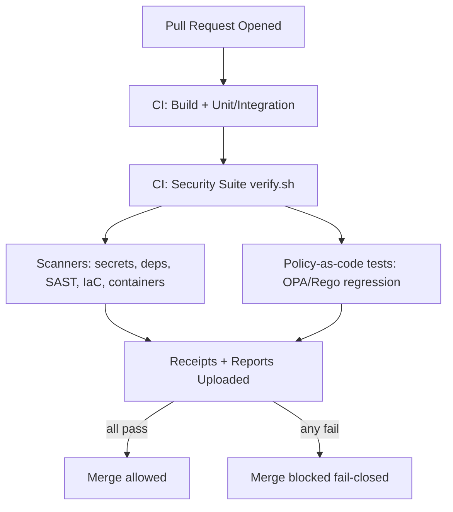

# Security and Governance Test Suite


> **Governed test surface.**
> This directory contains **merge-blocking security + governance tests** for KFM.
>
> **Rule:** when a check is uncertain, it **fails closed** (deny-by-default).  
> **Goal:** prevent unsafe access, sensitive data leakage, provenance gaps, and supply-chain drift from reaching the governed API/UI boundary.

---

## Table of Contents

- [Purpose](#purpose)
- [Non-Negotiables Enforced](#non-negotiables-enforced)
- [Directory Layout](#directory-layout)
- [How to Run](#how-to-run)
- [Security Gates](#security-gates)
- [Governance and Data Sensitivity Gates](#governance-and-data-sensitivity-gates)
- [Evidence Artifacts and Run Receipts](#evidence-artifacts-and-run-receipts)
- [CI Integration Requirements](#ci-integration-requirements)
- [Adding or Updating Checks](#adding-or-updating-checks)
- [Waivers and Exceptions](#waivers-and-exceptions)
- [Troubleshooting](#troubleshooting)
- [Glossary](#glossary)
- [References](#references)

---

## Purpose

KFM is an evidence-first system with a **trust membrane** (API + policy boundary) that must be enforced centrally. This security suite exists to ensure that:

- **Unsafe changes cannot merge** without explicit, reviewed governance decisions.
- **Security posture is testable** (not aspirational).
- **Evidence is produced** (receipts/attestations) as a normal part of development and CI.

This folder is intentionally scoped to **tests and enforcement**, not general security prose. For disclosure policy and reporting, use the repository `SECURITY.md` (if present).

---

## Non-Negotiables Enforced

These checks are aligned to KFM’s documented invariants:

### Trust membrane and policy enforcement

- The **frontend never talks to databases directly**.
- **Policy evaluation occurs on every request** for data, Story Nodes, and AI interactions.
- Backend logic follows clean boundaries (ports/interfaces) and does not bypass governance.

### Evidence-first publication

- **Promotion/publishing is blocked** unless required catalogs/provenance exist and validate.
- Focus Mode must **cite or abstain** and return an **audit reference**.

### Governance and safety

- Secrets, PII, and sensitive locations must not leak into public outputs.
- Classification cannot be “downgraded” through processing unless an approved redaction/de-identification step exists.
- Policy regression tests prevent “known-bad” leaks from ever reappearing.

---

## Directory Layout

> This is the expected layout for the KFM repo (top-level) and this suite (subtree). If your repository differs, align the structure and update this README and CI together.

### Repo top-level context

```text
.
├── .github/                # CI workflows, security policies, CODEOWNERS
├── docs/                   # Governed docs (guides, ADRs, templates)
├── schemas/                # JSON Schemas (STAC/DCAT/PROV/Story Nodes/etc.)
├── src/                    # Services, pipelines, adapters, infra implementations
├── data/                   # Raw/work/processed + catalogs (STAC/DCAT/PROV)
└── tests/
    └── security/           # ← you are here
```

### `tests/security/` subtree

```text
tests/security/
├── README.md                      # this document
├── scripts/                       # entrypoints + shared helpers (bash/python)
│   ├── verify.sh                  # canonical local/CI entrypoint (recommended)
│   └── lib/                       # shared helper functions
├── policy/                        # policy-as-code tests (OPA/Rego, Conftest)
│   ├── rego/                      # Rego policies
│   └── tests/                     # policy unit/regression tests
├── scanners/                      # tool configs (SAST, secrets, deps, IaC, etc.)
│   ├── secrets/                   # secret scanning configuration
│   ├── sast/                      # SAST rulesets (e.g., Semgrep) and baselines
│   ├── deps/                      # dependency & SBOM scanning config
│   ├── containers/                # container/image scanning config
│   └── iac/                       # IaC scanning config (K8s/Terraform/etc.)
├── fixtures/                      # safe test fixtures (synthetic; no real secrets)
├── reports/                       # human-readable reports (gitignored)
└── receipts/                      # machine-readable run receipts (gitignored)
```

**Repository hygiene rules for this folder**

- `reports/` and `receipts/` should be **.gitignored** (CI uploads artifacts instead).
- Fixtures must be **synthetic** and safe to publish.
- Any configuration that grants elevated permissions (CI tokens, runner config) must be reviewed via CODEOWNERS.

---

## How to Run

### Quick local run

Recommended canonical entrypoint:

```bash
./tests/security/scripts/verify.sh
```

If you prefer a task runner, keep the single entrypoint and call it:

```bash
make verify-security
# or
task verify:security
```

### Common execution modes

| Mode | Intended use | Expected runtime | Must be deterministic |
|---|---|---:|---|
| `fast` | pre-commit / quick local loop | minutes | Yes |
| `ci` | merge-blocking PR checks | medium | Yes |
| `release` | release-tag / publish gating | highest | Yes |

Recommended pattern (example flags — implement in `verify.sh`):

```bash
./tests/security/scripts/verify.sh --mode fast
./tests/security/scripts/verify.sh --mode ci
./tests/security/scripts/verify.sh --mode release
```

### Safety constraints

- **Never** point DAST or integration scans at production.
- Any scan requiring credentials must use **ephemeral tokens** via CI secret store and least privilege.

---

## Security Gates

These checks protect code, infrastructure, and supply chain integrity.

### Gate matrix

| Gate | What it prevents | Typical tools | Blocking rule |
|---|---|---|---|
| Secrets scanning | leaked API keys/tokens/passwords | gitleaks, git-secrets, GitHub secret scanning | **Always blocking** |
| Dependency vuln scan | known vulnerable packages | osv-scanner, Dependabot alerts, SCA tools | blocking at High/Critical (policy-defined) |
| SAST | insecure code patterns | Semgrep, CodeQL, language-specific linters | blocking at High/Critical (policy-defined) |
| Container scan | vulnerable base images/layers | trivy/grype | blocking at High/Critical (policy-defined) |
| IaC scan | insecure infra defaults | checkov/tfsec/kube-score/kubeconform | blocking at High/Critical (policy-defined) |
| CI hardening checks | unsafe workflow perms and action drift | pinned actions, least-privilege tokens | **Always blocking** |
| SBOM and provenance checks | untraceable builds/artifacts | syft + attestation verification | **Always blocking for release** |

### Minimum GitHub posture

This suite assumes the repository is using baseline GitHub security controls:

- Protected branches, PR review required, and CI checks required.
- Signed commits/tags as appropriate.
- Workflows pinned and least privilege token scopes.

> If your org/repo policy differs, treat that difference as a governance decision and document it.

---

## Governance and Data Sensitivity Gates

KFM requires CI to block merges that would leak sensitive content or break governance rules.

### Required scan categories

- **Secrets scanning** (credentials in code/config).
- **PII/sensitive data scanning** (prevent unintended personal identifiers).
- **Sensitive location checks** (prevent precise protected coordinates in public outputs).
- **Classification consistency** (prevent “downgrades” from restricted → public without approved redaction step).

### Non-regression policy suite

Policy regression tests must include “golden” queries and fixtures that represent previously observed leakage modes. These tests should fail forever if a leak reappears.

---

## Evidence Artifacts and Run Receipts

Every run of this suite should generate:

1) **A machine-readable receipt** (for audit + reproducibility)  
2) **A human-readable report** (for review/triage)

### Receipt requirements

A run receipt must include at least:

- Repository state: commit SHA, branch, CI run id
- Tool inventory: tool names + versions
- Outputs: result status per gate, with stable identifiers
- Artifact hashes: digests for reports/SBOMs (when generated)
- Fail-closed reason when a check is skipped (skips are explicit)

### Suggested receipt format

Write to:

```text
tests/security/receipts/security_run_receipt.json
```

Example:

```json
{
  "receipt_version": "1.0",
  "run_id": "2026-02-14T18:09:22Z__github__123456789",
  "mode": "ci",
  "git": {
    "repo": "kfm",
    "sha": "abcdef1234567890",
    "branch": "feature/policy-regression"
  },
  "tools": [
    {"name": "conftest", "version": "x.y.z"},
    {"name": "opa", "version": "x.y.z"},
    {"name": "gitleaks", "version": "x.y.z"},
    {"name": "osv-scanner", "version": "x.y.z"}
  ],
  "gates": [
    {"id": "secrets.scan", "status": "pass"},
    {"id": "policy.regression", "status": "pass"},
    {"id": "deps.vuln", "status": "fail", "severity": "high", "details_ref": "reports/deps-vuln.json"}
  ],
  "artifacts": [
    {"path": "reports/deps-vuln.json", "sha256": "…"},
    {"path": "reports/sbom.spdx.json", "sha256": "…"}
  ],
  "decision": {
    "merge_allowed": false,
    "fail_closed": true,
    "reason": "deps.vuln failed at severity=high"
  }
}
```

### Artifact handling

- CI should upload `reports/*` and `receipts/*` as job artifacts.
- Release pipelines should additionally upload (or attach) SBOM + provenance artifacts and verify signatures.

---

## CI Integration Requirements

### Merge-blocking

Security suite checks must be configured as **required status checks** on protected branches.

### Workflow hardening

- Default tokens should be **read-only** unless write access is strictly required.
- Third-party CI actions should be pinned to immutable references (e.g., commit SHAs).
- Secrets must be scoped to the minimal jobs that need them.
- Self-hosted runners, if used, must be treated as high-risk infrastructure and restricted.

### Expected CI flow



---

## Adding or Updating Checks

### Design rules for all checks

- **Deterministic:** same inputs → same outputs.
- **No network by default** unless the check is explicitly designed and documented to use it.
- **Fail-closed:** if a dependency/tool is unavailable, the suite fails with an actionable error.
- **Safe fixtures only:** never embed real secrets, real PII, or precise sensitive coordinates.

### Where to add what

| Change type | Folder | What to add |
|---|---|---|
| New Rego policy | `policy/rego/` | policy file + tests |
| New policy test | `policy/tests/` | conftest tests + fixtures |
| New scanner config | `scanners/<type>/` | config + baseline strategy |
| New script step | `scripts/` | add a new gate in `verify.sh` and output to receipt |

### Required documentation for new gates

Every new gate must update this README in one place:

- Add to the **Gate matrix**
- Document **blocking rules**
- Document **report output file name(s)**
- Document any **required secrets** and scope

---

## Waivers and Exceptions

Exceptions are governed and time-bounded. They must be explicit, reviewable, and expire.

### Rules

- Waivers are **never implicit**.
- Waivers must include: owner, justification, compensating controls, and expiry.
- Waivers must be approved by the appropriate security/governance reviewers (CODEOWNERS recommended).

### Suggested waiver record format

Store waivers as structured data (example path):

```text
tests/security/waivers/waivers.yml
```

Example entry:

```yaml
- id: waiver.deps.vuln.2026-02-14
  gate: deps.vuln
  scope:
    package: example-lib
    version: 1.2.3
  severity: high
  justification: "Upstream fix pending; constrained blast radius; service not internet-exposed."
  compensating_controls:
    - "WAF rule set enforced"
    - "Feature flag off by default"
  owner: "security-lead"
  approved_by: ["governance-reviewer", "security-reviewer"]
  expires_on: "2026-03-01"
```

The suite must validate:

- Waiver IDs are unique
- Expiry is in the future
- Scope matches actual findings
- Waivers do not override “always-blocking” gates (e.g., secrets)

---

## Troubleshooting

### Common failure modes

- **Tool not found:** install/pin tool versions in CI; do not “skip”.
- **Baselines too noisy:** fix rules or scope; never silence high-severity patterns globally.
- **Policy test drift:** update fixtures and regression tests together; avoid brittle tests by design.

### When you need help

1) Identify the failing gate in the run receipt.  
2) Open the corresponding report file.  
3) If the failure is a false positive, fix configuration/rules rather than adding broad allowlists.  
4) If an exception is warranted, file a waiver with expiry.

---

## Glossary

- **Fail-closed:** deny-by-default; if uncertain, block.
- **Trust membrane:** enforced boundary where policy and audit are unavoidable.
- **OPA/Rego:** policy engine and policy language for authorization/governance rules.
- **Conftest:** policy test runner for Rego rules.
- **SBOM:** Software Bill of Materials (what is in the build).
- **Provenance:** lineage and evidence of how artifacts were produced.
- **Sensitive-location:** coordinates that must be generalized/suppressed except for authorized roles.
- **Classification consistency:** restricted inputs cannot become public outputs without approved transformation + provenance.

---

## References

Primary internal anchors (governed):

- KFM Next-Generation Blueprint and Primary Guide (2026-02-12)
- KFM Comprehensive Data Source Integration Blueprint (2026-02-12)
- Integrating “New Ideas Feb-2026” Into Knowledge-First Management
- Software Security Guide for Developers (2026 Edition)

External standards and common baselines (use as guidance, not authority):

- OWASP (secure coding and verification guidance)
- SLSA (provenance expectations)
- SPDX (SBOM format)
- W3C PROV / DCAT and OGC STAC (provenance and catalog patterns used by KFM)

