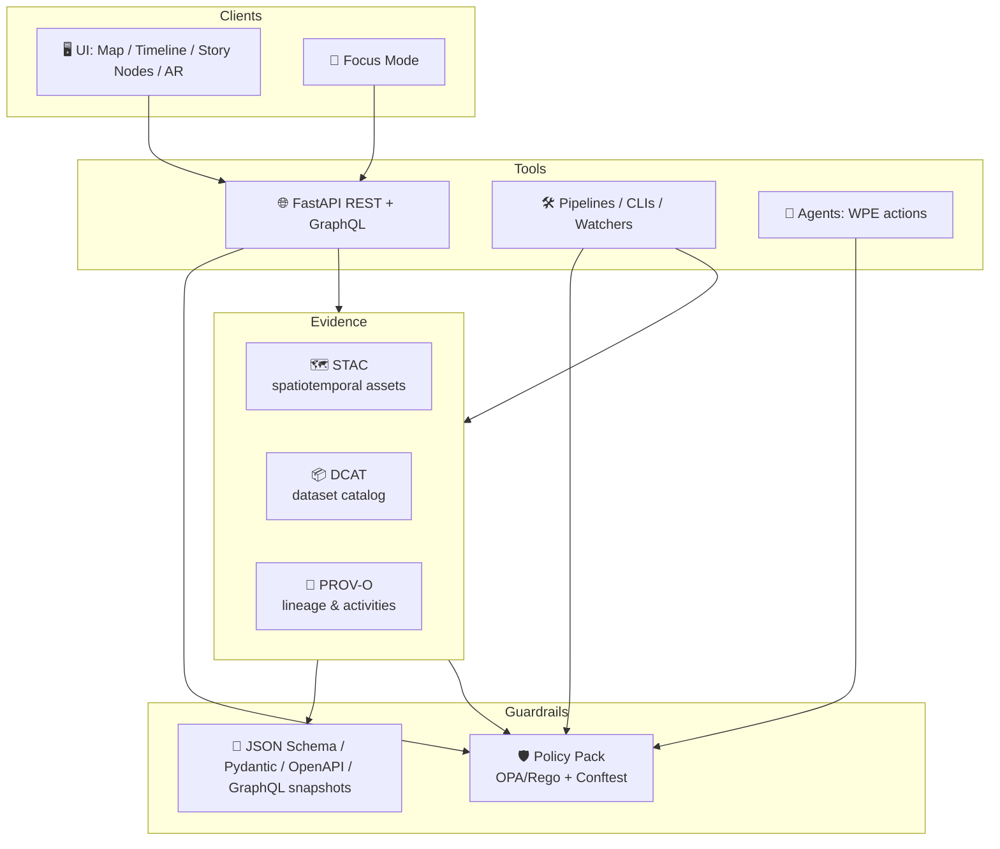

# 🧪 Tools Contract Tests — KFM (Kansas Frontier Matrix)


> **Goal:** ensure every “tool” in KFM (API, pipeline CLI, agent action, Story Node renderer, artifact fetcher) stays **schema-stable**, **policy-compliant**, **traceable**, and **safe** — before it reaches the UI or Focus Mode.

---

## 🧭 Why this folder exists

KFM is built around **contract-first + provenance-first** delivery:  
anything that appears in the **UI** (Map/Timeline/Story Nodes/AR) or **Focus Mode** must be **traceable back to cataloged evidence** and compliant with the **Policy Pack**.

This directory (`tests/tools_contract/`) provides **contract tests** that fail fast when a tool:

- breaks input/output schemas 🔧
- bypasses the evidence triplet (**STAC + DCAT + PROV**) 🧾
- leaks sensitive locations or violates role-based access 🔐
- returns “pretty text” without citations/evidence 🧠
- changes behavior without versioning (breaking changes) 🚨
- drifts from the API boundary rule (UI must call APIs, not raw data) 🧱

---

## 🧩 What counts as a “tool” in KFM?

A **tool** is any callable surface that produces or transforms KFM knowledge/data:

### 🌐 Runtime tools
- **REST endpoints** (FastAPI) → `GET /datasets/{id}`, `GET /api/v1/query?table=...`, etc.
- **GraphQL resolvers** → graph traversals over Neo4j (People/Places/Events/Datasets)
- **Map services** → GeoJSON, vector tiles, 3D Tiles (MapLibre + Cesium client expectations)
- **Focus Mode retrieval actions** → hybrid RAG + graph queries + spatial queries

### 🏗️ Build / pipeline tools
- ingestion pipelines → produce **STAC/DCAT/PROV** + load into PostGIS/Neo4j
- simulation/model runs → treated as evidence with uncertainty (still cataloged + provable)
- “watchers” (real-time/ETL) → GTFS-RT / sensor feeds with idempotency & caching headers
- artifact packaging → OCI artifacts (tiles/models/packs), signed + addressable by digest

### 🧾 Narrative tools
- Story Node authoring/rendering → `markdown.json` templates + evidence manifests
- evidence pack builders → compile datasets/docs into reproducible narrative bundles

---

## 🧱 Contract layers (what we test)



✅ **Contract tests** enforce each layer stays aligned.

---

## 📁 Expected layout

> Some of these folders may be “scaffolding targets” if we’re still building the suite. The README defines the *intended contract testing architecture*.

```text
🧪 tests/
  🧰 tools_contract/
    📄 README.md

    📦 contracts/                  # versioned tool contracts (schema + invariants)
      🧾 tools/
        focus_mode.answer.v1.json
        api.datasets.get.v1.json
        map.viewport.features.v1.json
        ingest.run_manifest.v1.json

    🧪 cases/                      # concrete “known-good” and “known-bad” fixtures
      focus_mode/
        happy_path.yaml
        missing_citations.yaml
      stac/
        collection_valid.json
        item_missing_bbox.json

    🧰 harness/                    # shared test harness + validators
      validators/
        geojson.py
        stac.py
        dcat.py
        prov.py
        oci.py
        policy_pack.py
      runners/
        http_runner.py
        cli_runner.py

    📸 snapshots/                  # golden snapshots (break-glass updates only)
      openapi.json
      graphql_schema.graphql
      tool_registry.json
```

---

## ⚡ Quickstart

### ✅ Mode A — “Offline” contracts (no services required)
Runs schema + fixture validations (fast, deterministic):

```bash
pytest -q tests/tools_contract -m contract
```

### 🌐 Mode B — “Integration” contracts (calls a running KFM)
Set a base URL and optional auth token:

```bash
export KFM_API_BASE_URL="http://localhost:8000"
export KFM_AUTH_TOKEN="..."
pytest -q tests/tools_contract -m contract_integration
```

### 🛡️ Policy Pack (OPA/Rego + Conftest)
If the repo includes a policy bundle, run policy gates explicitly:

```bash
conftest test <policy_bundle_dir> -d <data_dir_or_fixture_dir>
```

> 💡 Tip: treat policy tests as **non-negotiable gates**. If a tool output violates policy, we fail **closed**.

---

## 🧷 Core invariants (non-negotiables)

These are the “always true” rules across KFM tools.

### 1) 📐 Schema-valid I/O
- Requests must validate (types, ranges, required fields)
- Responses must validate (shape + required metadata blocks)
- Errors must be structured, not “mystery strings”

### 2) 🧾 Evidence triplet required for anything user-facing
- **STAC** for spatial/temporal indexing + assets
- **DCAT** for dataset discovery, licensing, distributions
- **PROV** for lineage (“how was this produced?”)

### 3) 🧬 Provenance-first (traceability)
- Every response that returns data must include:
  - dataset identifiers and versions
  - provenance references (links/IDs to PROV activities/entities)
  - timestamps where relevant (especially for real-time queries)

### 4) 🔐 Sensitivity & access control
- Sensitive layers must be:
  - hidden unless authorized, **or**
  - spatially generalized/redacted, **or**
  - returned only as aggregated summaries
- Role-based access must be enforceable at tool boundaries (API/pipeline outputs)

### 5) 🧠 Focus Mode must cite evidence
- Answers must include citations pointing back to cataloged sources  
- If evidence is insufficient → response must say so and avoid fabrication

### 6) 🧱 API boundary rule (UI must not bypass governance)
- UI consumes **tools/APIs**, not raw files
- Anything shown on the map/timeline/story should be produced via governed interfaces

### 7) 🧰 Versioning & compatibility
- Contracts are versioned (`v1`, `v2`, …)
- Breaking changes require new version + migration path
- Old versions stay supported until formally deprecated

---

## 🧰 Tool-type playbooks (what we test per category)

| Tool category | Examples | Contract checks ✅ |
|---|---|---|
| 🗺️ Map / Spatial query tools | “features in bbox”, “layer tiles”, “place geometry” | GeoJSON validity, CRS conventions, bbox filters, pagination, performance caps |
| 🧬 Catalog tools | STAC Collections/Items, DCAT dataset records | required fields, links across STAC↔DCAT↔PROV, license + distributions |
| 🕸 Graph tools | Neo4j traversals (“datasets related to event X”) | stable entity IDs, pagination, depth limits, ontology alignment fields |
| 🧠 Focus Mode tools | hybrid retrieval + summarization | evidence required, citations present, provenance references, safety redaction |
| 🏗️ Pipeline tools | ingest, transform, tile build | Run Manifest schema, idempotency keys, output catalogs updated, policy pack passes |
| 📦 Artifact tools | OCI packs (tiles/models/evidence packs) | digest addressability, signature presence, manifest fields, reproducibility metadata |
| 🧾 Story Node tools | `markdown.json` story nodes | schema + required narrative fields, evidence manifest presence, linkable entity IDs |

---

## 🧪 What we assert (examples)

### ✅ Example: API tool returning geometry
- returns **FeatureCollection**
- each feature has `id` and `properties.dataset_id`
- geometry is valid & non-empty
- provenance block includes references to DCAT/PROV
- respects sensitivity flags

### ✅ Example: Focus Mode answer tool
We do **not** snapshot the exact prose. We snapshot the **structure**:

- `answer_md` exists
- `citations[]` exists and is non-empty
- citations point to catalog IDs (dataset/doc IDs)
- if the user lacks access → tool returns redacted/denied with clear reason

### ✅ Example: pipeline run manifest tool
- produces a run manifest with:
  - `run_id`
  - `run_time`
  - `idempotency_key`
  - `canonical_digest`
  - `source_urls[]`
  - `tool_versions[]`
  - summary counts (records in/out/errors)
- digest is stable under canonicalization (RFC 8785-style normalization)

---

## 🧠 Handling LLM / non-determinism (Focus Mode)

To keep tests stable:

✅ assert **invariants**, not exact tokens  
✅ assert **citations & provenance**  
✅ assert **redaction & safety behavior**  
✅ assert **tool call trace** (when available)

Avoid:
- golden snapshots of the full natural-language answer text ❌
- tests that depend on external network calls (unless explicitly flagged) ❌

---

## 🛡️ Security & governance contracts (recommended “red team” set)

These contract tests catch high-risk failures:

- 🔎 **Injection-safe query surfaces** (search inputs sanitized / validated)
- 🧭 **GraphQL depth & pagination limits** (no runaway recursion)
- 🗺️ **Sensitive location leakage** (exact coordinates never returned when restricted)
- 🔐 **Role enforcement** (unauthorized calls fail closed with consistent errors)
- 🧾 **License compliance** (no dataset without license/distribution metadata is published)
- 🧬 **Audit trail completeness** (PROV always links “what came from what”)

---

## 🔄 Updating contracts (breaking changes)

1. Create `v2` contract file (don’t silently mutate `v1`)
2. Add migration notes + fixtures demonstrating both versions
3. Keep `v1` tests passing until deprecation window ends
4. Update snapshots only via deliberate “break-glass” PR (review required)

---

## ✅ PR checklist (for anything touching tools)

- [ ] Contract schema updated (or new version added) 🧾
- [ ] Cases added: happy + failure + edge cases 🧪
- [ ] Policy Pack still passes 🛡️
- [ ] Evidence triplet preserved (STAC/DCAT/PROV) 📦
- [ ] No sensitive data leakage 🔐
- [ ] OpenAPI / GraphQL / registry snapshots updated only when intended 📸
- [ ] CI green ✅

---

## 📚 Reference docs (project design ground truth)

These docs define the expectations that contract tests enforce:

- 🧭 **Architecture & features**: KFM comprehensive architecture + redesign blueprint
- 🧠 **AI system**: Focus Mode, hybrid retrieval, provenance + citations
- 🗺️ **UI system**: Map/Timeline/Story Nodes/AR, API-boundary rule
- 🧾 **Data intake**: evidence triplet (STAC/DCAT/PROV), policy pack, publishing gates
- 🌟 **Future proposals & QA**: testing strategy, security, watchers, governance
- 🧪 **Markdown & Story Nodes**: `markdown.json` templates + narrative invariants
- 📦 **Innovations**: OCI evidence packs, run manifests, pulse threads, attention nodes

> 📌 If you’re unsure what a tool *should* do, the answer is almost always: **find the contract**, then align implementation to it.

---

## 📦 Appendix: PDF Portfolio “libraries” (deep references)

Some project knowledge lives in **PDF Portfolios** (they contain multiple embedded books/docs). If you want to explore or extract them:

```bash
# List embedded docs
pdfdetach -list "docs/library/AI Concepts & more.pdf"
pdfdetach -list "docs/library/Maps-GoogleMaps-VirtualWorlds-Archaeological-Computer Graphics-Geospatial-webgl.pdf"
pdfdetach -list "docs/library/Data Managment-Theories-Architures-Data Science-Baysian Methods-Some Programming Ideas.pdf"
pdfdetach -list "docs/library/Various programming langurages & resources 1.pdf"

# Extract a specific embedded PDF (example: file #27)
pdfdetach -save 27 -o /tmp/clean_architecture_python.pdf "docs/library/Data Managment-Theories-Architures-Data Science-Baysian Methods-Some Programming Ideas.pdf"
```

These libraries inform:
- ✅ testing philosophy (CI/CD, clean architecture, contract boundaries)
- ✅ geospatial correctness (CRS/projections, map math, rendering constraints)
- ✅ AI/agent grounding (agent architecture, retrieval + evaluation patterns)
- ✅ polyglot implementation (TypeScript/Python/Node tooling and testing)

---
