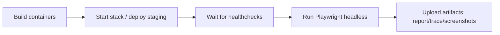

# KFM UI Tests (E2E) — `tests/ui/`

This folder contains **end-to-end (E2E) UI tests** for the KFM web application.

These tests are **governance-critical**: they validate user-visible behavior that is part of KFM’s “hard invariants,” including the **trust membrane** and **evidence-first UX** (citable provenance, resolvable citations, and safe deny-by-default behavior).  

> [!IMPORTANT]
> **Trust membrane invariant:** the **frontend must never talk to databases directly**. All data access must go through the governed API boundary where policy is enforced.:contentReference[oaicite:4]{index=4}

---

## Table of contents

- [What this suite is responsible for](#what-this-suite-is-responsible-for)
- [Non-negotiable invariants this suite enforces](#non-negotiable-invariants-this-suite-enforces)
- [Quickstart](#quickstart)
  - [1) Start a local stack](#1-start-a-local-stack)
  - [2) Install test dependencies](#2-install-test-dependencies)
  - [3) Run tests](#3-run-tests)
- [Configuration](#configuration)
  - [Environment variables](#environment-variables)
  - [Base URLs and ports](#base-urls-and-ports)
- [Test organization](#test-organization)
  - [Suggested directory layout](#suggested-directory-layout)
  - [Test tagging / naming](#test-tagging--naming)
- [Required test scenarios](#required-test-scenarios)
- [How to write new tests](#how-to-write-new-tests)
- [CI expectations](#ci-expectations)
- [Artifacts (what gets saved on failure)](#artifacts-what-gets-saved-on-failure)
- [Troubleshooting](#troubleshooting)
- [Security & data sensitivity notes](#security--data-sensitivity-notes)

---

## What this suite is responsible for

This UI test suite exists to prove, continuously, that the KFM web app:

1. **Loads and navigates** without regressions in core routes.
2. **Respects the trust membrane** (no UI → DB direct connections).
3. **Surfaces evidence** correctly:
   - citation references are **resolvable** via API endpoints (e.g., `prov://`, `stac://`, `dcat://`, `doc://`, `graph://`):contentReference[oaicite:5]{index=5}
   - “review evidence” UX works for map layers and Focus Mode answers:contentReference[oaicite:6]{index=6}
4. **Aligns with the documented runtime sequence** (UI → API Gateway → Policy → Stores → Policy validation → UI).:contentReference[oaicite:7]{index=7}

> [!NOTE]
> This suite is intentionally **E2E-first**. Unit/component tests live elsewhere (e.g., `web/` or `tests/unit/`), while `tests/ui/` focuses on cross-service, user-visible guarantees.

---

## Non-negotiable invariants this suite enforces

These are treated as **release gates**.

| Invariant | Why it matters | How we validate in UI tests |
|---|---|---|
| **Frontend never talks to databases directly**:contentReference[oaicite:8]{index=8} | Trust membrane / governance boundary | Network allowlist + DB-port denylist assertions; fail test on any DB host/port traffic |
| **Policy evaluation occurs on every data/story/AI request**:contentReference[oaicite:9]{index=9} | Fail-closed safety | Verify deny-by-default behaviors (403/empty states) without auth; verify authorized views with test token (when available) |
| **Citations are resolvable; evidence can be reviewed**:contentReference[oaicite:10]{index=10} | Evidence-first UX; reviewer trust | Click citations; ensure evidence view renders a resolver-backed record |
| **UI provenance views work** (E2E + static checks):contentReference[oaicite:11]{index=11} | Prevent “black box” UX | E2E verifies provenance panels; static checks prevent forbidden imports / endpoints |

---

## Quickstart

### 1) Start a local stack

KFM’s documented local workflow uses **Docker Compose**.:contentReference[oaicite:12]{index=12}

From the **repo root**:

```bash
cp .env.example .env
docker compose up --build
```

Default dev endpoints (documented):

- Web UI: `http://localhost:3000` :contentReference[oaicite:13]{index=13}
- API docs: `http://localhost:8000/docs` :contentReference[oaicite:14]{index=14}

> [!TIP]
> Keep the stack running in one terminal; run UI tests from another terminal.

---

### 2) Install test dependencies

From **this directory**:

```bash
cd tests/ui
npm ci
npx playwright install --with-deps
```

> [!NOTE]
> If your repo uses `pnpm` or `yarn`, use the equivalent install command. The test runner commands in this README use `npx` so they remain usable across package managers.

---

### 3) Run tests

#### Run all tests (headless)

```bash
cd tests/ui
npx playwright test
```

#### Run a single spec file

```bash
npx playwright test tests/ui/specs/smoke.spec.ts
```

#### Run headed (visible browser)

```bash
npx playwright test --headed
```

#### Debug mode (slow + inspector)

```bash
PWDEBUG=1 npx playwright test
```

#### Generate and open the HTML report

```bash
npx playwright show-report
```

---

## Configuration

### Environment variables

Set these in your shell or a `.env` file (preferred: `.env` in repo root for Compose + `.env` in `tests/ui/` for Playwright).

| Variable | Default | Meaning |
|---|---:|---|
| `KFM_WEB_BASE_URL` | `http://localhost:3000` | Where Playwright starts the browser |
| `KFM_API_BASE_URL` | `http://localhost:8000` | Used for API health checks / evidence resolver checks (if implemented) |
| `KFM_TEST_JWT` | _(empty)_ | Optional bearer token for authenticated flows |
| `KFM_UI_E2E_TRACE` | `on-first-retry` | Playwright trace behavior (`on`, `off`, `retain-on-failure`, etc.) |

> [!IMPORTANT]
> **Do not** place real credentials in this folder. Use a test identity provider / test tokens only.

---

### Base URLs and ports

The KFM blueprint’s local quickstart commonly uses:

- UI on `:3000`
- API docs on `:8000/docs`:contentReference[oaicite:15]{index=15}

If your environment differs, set `KFM_WEB_BASE_URL` and `KFM_API_BASE_URL` accordingly.

---

## Test organization

### Suggested directory layout

```text
tests/ui/
├─ README.md
├─ playwright.config.ts
├─ package.json
├─ specs/
│  ├─ smoke.spec.ts
│  ├─ trust-membrane.spec.ts
│  ├─ evidence-resolver.spec.ts
│  ├─ map-and-timeline.spec.ts
│  ├─ story-nodes.spec.ts
│  └─ focus-mode.spec.ts
├─ pages/                 # Page Objects (recommended)
│  ├─ appShell.page.ts
│  ├─ map.page.ts
│  ├─ story.page.ts
│  └─ focusMode.page.ts
├─ fixtures/
│  ├─ users.json          # test user handles only (no secrets)
│  └─ queries.json        # canonical queries for Focus Mode (if applicable)
└─ utils/
   ├─ netAssertions.ts
   ├─ selectors.ts
   └─ waiters.ts
```

> [!NOTE]
> File names above are **recommended** to keep the suite consistent and reviewable.

---

### Test tagging / naming

Use Playwright’s `test.describe()` grouping for stable tags:

- `@smoke` — minimal “site loads” checks (should run on every PR)
- `@governance` — trust membrane + evidence UX invariants (should be PR-gating)
- `@auth` — authenticated paths (may require `KFM_TEST_JWT`)
- `@visual` — optional screenshot diffs (treat as “allowed flaky” only if rendering nondeterminism exists)

Example:

```ts
import { test, expect } from "@playwright/test";

test.describe("@smoke", () => {
  test("home loads", async ({ page }) => {
    await page.goto("/");
    await expect(page.getByTestId("app-shell")).toBeVisible();
  });
});
```

---

## Required test scenarios

These scenarios align with KFM’s documented runtime flows (map layer requests, story node retrieval, Focus Mode queries with policy validation + audit logging).:contentReference[oaicite:16]{index=16}:contentReference[oaicite:17]{index=17}

### 1) Smoke: app loads and routes render

- Landing route renders shell
- Basic navigation works (no uncaught exceptions)
- Map container initializes (if applicable)

### 2) Trust membrane: network guardrails

At minimum:

- **Allowlist**: UI may call:
  - `KFM_WEB_BASE_URL` (self)
  - `KFM_API_BASE_URL` (API gateway boundary)
- **Denylist**: UI must not call DB ports directly (examples: 5432 Postgres/PostGIS, 7474 Neo4j HTTP, 9200 OpenSearch).  
  > This is a practical enforcement of “frontend never talks to databases directly.”:contentReference[oaicite:18]{index=18}

### 3) Authorization behavior (deny-by-default)

- Unauthenticated user attempts to open restricted resources:
  - expect “not authorized” UX (or empty state)
  - ensure API returns denial (e.g., 401/403) and UI handles it gracefully
- Authenticated user (with `KFM_TEST_JWT`) sees additional data (if policy allows)

### 4) Evidence resolver + provenance UX

KFM requires that every provenance/citation reference be resolvable and reviewable in the UI.:contentReference[oaicite:19]{index=19}

Minimum checks:

- A citation click opens an evidence view
- Evidence view renders:
  - a reference (e.g., `prov://...` / `stac://...` / `dcat://...` / `doc://...` / `graph://...`)
  - a human-readable summary (dataset title, provenance snippet, or doc locator)

### 5) Story Nodes

- Story list loads
- Story opens
- Citations are visible and resolvable (same resolver requirement as above)

### 6) Focus Mode (evidence-first Q&A)

- Enter a query that has evidence:
  - ensure answer includes citations and links resolve
- Enter a query that does *not* have evidence:
  - ensure UI shows an abstention / “no source available” state (no hallucinated claims)

---

## How to write new tests

### Design principles

- Prefer **stable selectors**:
  - Use `data-testid` attributes.
  - Avoid brittle CSS selectors based on layout/styling.
- Use **Page Objects** for complex flows.
- Make tests **fail-loud** for governance invariants.

### Minimal template for a new feature

Checklist (PR reviewer-friendly):

- [ ] E2E spec added under `tests/ui/specs/`
- [ ] Uses `data-testid` selectors (no layout selectors)
- [ ] Includes at least one negative case (deny-by-default)
- [ ] If citations appear in the UI, the test asserts **resolvability**
- [ ] Adds/updates fixtures (no secrets; sanitized only)
- [ ] Artifacts verified locally (report/trace created on failure)

---

## CI expectations

The UI suite should run in CI as a **headless browser test** against either:

1) a staging deployment, or  
2) an ephemeral environment spun up inside CI.

This matches KFM guidance that frontend integration tests can run headless and can be scripted with tools like Playwright/Cypress after deploy to staging or an ephemeral server.:contentReference[oaicite:20]{index=20}

### Minimal CI sequence (conceptual)



### Example GitHub Actions job (template)

```yaml
name: ui-e2e
on: [pull_request, push]
jobs:
  ui:
    runs-on: ubuntu-latest
    steps:
      - uses: actions/checkout@v4

      - name: Start stack
        run: |
          cp .env.example .env
          docker compose up -d --build

      - name: Install UI test deps
        working-directory: tests/ui
        run: |
          npm ci
          npx playwright install --with-deps

      - name: Run E2E (headless)
        working-directory: tests/ui
        env:
          KFM_WEB_BASE_URL: http://localhost:3000
          KFM_API_BASE_URL: http://localhost:8000
        run: npx playwright test

      - name: Upload Playwright report
        if: always()
        uses: actions/upload-artifact@v4
        with:
          name: playwright-report
          path: tests/ui/playwright-report
```

---

## Artifacts (what gets saved on failure)

Recommended outputs to keep triage fast:

- `playwright-report/` (HTML)
- `test-results/**/trace.zip` (when tracing enabled)
- failure screenshots
- network logs for trust-membrane failures (allowed/blocked destinations)

---

## Troubleshooting

### “Web UI isn’t reachable”

- Confirm the local stack is up:
  ```bash
  docker compose ps
  ```
- Confirm the UI is reachable:
  - `http://localhost:3000` (default)
- If ports are in use, stop the conflicting service or adjust compose port mappings.

### “Tests are flaky locally”

- Run one worker:
  ```bash
  npx playwright test --workers=1
  ```
- Increase timeouts for slow CI hosts (prefer targeted waits for known async boundaries).
- Use trace on first retry:
  ```bash
  KFM_UI_E2E_TRACE=on-first-retry npx playwright test
  ```

---

## Security & data sensitivity notes

- **No secrets** in repo under `tests/ui/`.
- Use **sanitized / non-sensitive fixtures** only.
- Do not script UI tests that reveal precise restricted locations or policy-protected details.
- Treat any new UI path that surfaces provenance/evidence as a **governed surface**:
  - tests must validate access rules (deny-by-default),
  - citations must resolve,
  - reviewers must be able to “review evidence” safely.:contentReference[oaicite:21]{index=21}

