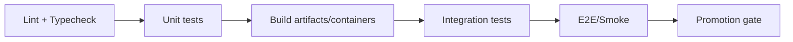

# Unit tests (`tests/unit`) 🧪


Unit tests are the **fastest feedback loop** in the KFM testing pyramid. They exist to validate **pure logic** and **in-process behavior** without relying on infrastructure (databases, external APIs, network, Kubernetes, etc.).

> [!IMPORTANT]
> **Unit tests must not cross the trust membrane.**
> - No direct database calls
> - No HTTP calls to real services
> - No reliance on live cloud credentials or “developer machine state”
>
> If your test needs PostGIS, tiles, real file stores, or HTTP services, it belongs in **integration / contract / e2e**, not here.

---

## What belongs in `tests/unit`

Unit tests here should focus on the “smallest meaningful unit” of behavior:

- **Domain rules / invariants** (pure functions, value objects, validation)
- **Use-case / service workflows** that operate against *ports* (interfaces) using *fakes*
- **GraphQL/REST handler logic** *only* when fully isolated (e.g., resolver logic with fake context)
- **Authorization decisions** (policy decision logic, not policy engine integration)
- **Batching/caching logic** (e.g., DataLoader batching behavior) using deterministic clocks

### What does *not* belong here

| If you need… | Put the test in… | Why |
|---|---|---|
| A real database (PostGIS/Postgres/SQLite file) | `tests/integration/` | DB behavior ≠ unit behavior |
| A running API service / HTTP calls | `tests/integration/` or `tests/contract/` | Network & service contracts |
| Schema breaking-change validation | `tests/contract/` | API compatibility gates |
| Map rendering / tile loading / UI regression | `tests/e2e/` | Requires browser/renderer & fixtures |
| Performance/load testing | `tests/perf/` | Different goals + tooling |

---

## Directory layout

Keep unit tests organized by **component boundary**, not by test framework:

```text
tests/
└── unit/
    ├── README.md
    ├── api/                    # resolver/handler unit tests (no DB, no HTTP)
    │   ├── resolvers/
    │   ├── authz/
    │   └── dataloader/
    ├── pipeline/               # pure transforms, ID normalization, catalog/prov shaping
    │   ├── transforms/
    │   ├── provenance/
    │   └── governance/
    ├── ui/                     # pure UI/component units (no map engine, no network)
    │   ├── components/
    │   └── hooks/
    └── shared/                 # shared utilities & libs (pure)
        ├── dates/
        ├── geometry/
        └── ids/
```

> [!NOTE]
> If the repo is a monorepo, mirror package boundaries:
> `tests/unit/<package-name>/...`

---

## Running unit tests locally

Use the command(s) configured by the repo. Common patterns:

### Node/TypeScript (example patterns)

```bash
# fastest loop
npm run test:unit

# watch mode
npm run test:unit -- --watch

# run a single file (depends on runner)
npm run test:unit -- path/to/file.test.ts
```

### Python (example patterns)

```bash
pytest tests/unit -q
pytest -q tests/unit/test_something.py::test_case_name
```

> [!TIP]
> Keep unit tests **fast enough to run on every save** (watch mode). If a test is “slow but important,” it likely belongs in integration.

---

## Golden rules ✅

### 1) No I/O in unit tests
- ❌ Network calls
- ❌ Real databases
- ❌ Real cloud services
- ⚠️ File I/O only if it’s `tmp`/in-memory and explicitly part of the unit

### 2) Prefer fakes over mocks
Use *fakes* (in-memory implementations) of ports/interfaces whenever possible.

✅ Good:
- In-memory repository implementing `DatasetRepositoryPort`
- Fake clock implementing `ClockPort`
- Fake policy decision provider implementing `AuthzDecisionPort`

⚠️ Use mocks/spies only when:
- You are verifying an **interaction contract** (e.g., “called with these arguments”)
- The dependency is too expensive to fake
- You are crossing a boundary intentionally (and you can’t redesign yet)

### 3) Determinism is a requirement
Unit tests must be stable across:
- OS differences
- timezones
- random seeds
- execution order

**Control time and randomness**:
- Inject clocks instead of calling `Date.now()` / `datetime.now()`
- Seed RNGs in tests
- Avoid relying on object key iteration order unless guaranteed

### 4) Test outcomes, not implementation
- Assert *observable behavior* (return values, emitted events, produced artifacts)
- Avoid brittle assertions on internal private structure unless it is a published contract

---

## Naming conventions

| Language | File naming | Test naming | Notes |
|---|---|---|---|
| TypeScript/JS | `*.test.ts` / `*.spec.ts` | `describe/it` | Prefer AAA (Arrange/Act/Assert) |
| Python | `test_*.py` | `test_*` | Keep tests pure + isolated |

---

## Unit-test templates

### TypeScript (runner-agnostic pattern)

```ts
describe("stableId()", () => {
  it("generates the same ID for the same canonical input", () => {
    // Arrange
    const input = { source: "kshs", externalId: "123", kind: "site" };

    // Act
    const a = stableId(input);
    const b = stableId(input);

    // Assert
    expect(a).toEqual(b);
  });
});
```

### Python (pytest pattern)

```py
def test_stable_id_is_deterministic():
    input_ = {"source": "kshs", "external_id": "123", "kind": "site"}
    assert stable_id(input_) == stable_id(input_)
```

---

## “Definition of Done” for adding a unit test

- [ ] Test is **deterministic** (no time/random/order flake)
- [ ] Test runs **without** DB/network/cloud
- [ ] Test validates **behavior**, not private implementation
- [ ] Uses **fakes** for ports/adapters (or explains why a mock was necessary)
- [ ] Includes regression coverage when fixing a bug (test fails before the fix)
- [ ] Adds/updates fixtures using **synthetic** or **non-sensitive** data only

> [!WARNING]
> Do **not** add real coordinates of sensitive sites, private-person data, or restricted cultural knowledge
> to unit-test fixtures. Use synthetic fixtures or redacted examples.

---

## CI expectations (unit tests)

Unit tests are expected to run early in CI (after lint/typecheck) and to provide quick “fail fast” feedback.



### Reports & artifacts
When CI runs, unit tests should emit:
- machine-readable results (JUnit XML if configured)
- coverage report (if configured)

> [!NOTE]
> CI should upload reports as **artifacts** for later inspection rather than relying on caches.

---

## Troubleshooting

<details>
<summary><strong>Tests pass locally but fail in CI</strong></summary>

Common causes:
- Hidden time dependency (timezone/clock)
- Hidden filesystem dependency
- Race conditions / ordering assumptions
- Tests depending on installed binaries or platform quirks

Fix approach:
1) Make the test deterministic (inject clock, seed RNG, remove order dependence)
2) Remove external dependencies (use fakes)
3) Re-run the smallest failing test repeatedly to confirm stability

</details>

<details>
<summary><strong>I need a database for this test</strong></summary>

That’s a strong sign it’s **not** a unit test.
Move it to `tests/integration/` and spin up the dependency in CI (e.g., PostGIS).

</details>

---

## References (KFM internal)

- Testing pyramid & CI sequencing: unit → integration → contract → e2e
- CI gates mindset: determinism, schema validation, provenance emission, policy checks

> Keep unit tests lean. Put complexity where it belongs: integration/contract/e2e.