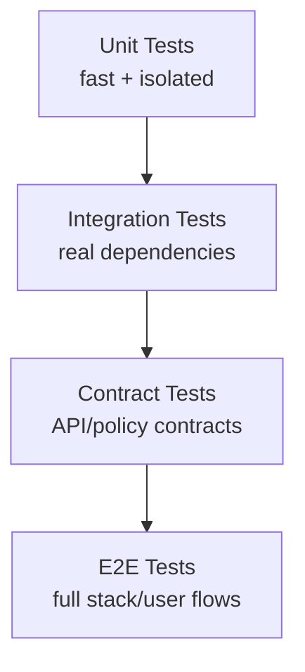

# 🧪 KFM Unit Tests (`tests/unit`)

Unit tests are KFM’s **fastest** and **most isolated** verification layer. They exist to prove that **core rules** (domain invariants, business logic, schema/geometry/time normalization, policy decisions, and redaction behaviors) behave correctly **without** databases, networks, containers, or external services.

> [!IMPORTANT]
> **Unit tests must be deterministic** and must not require PostGIS/Neo4j/OpenSearch/HTTP calls.  
> If you need any of those, you’re writing an **integration** (or higher) test — not a unit test.

---

## Table of contents

- [What counts as a unit test in KFM](#what-counts-as-a-unit-test-in-kfm)
- [What does *not* belong here](#what-does-not-belong-here)
- [Directory layout](#directory-layout)
- [How to run unit tests](#how-to-run-unit-tests)
  - [Run all unit tests](#run-all-unit-tests)
  - [Run a subset / single test](#run-a-subset--single-test)
  - [Run with coverage](#run-with-coverage)
- [Writing unit tests in KFM](#writing-unit-tests-in-kfm)
  - [Test design rules](#test-design-rules)
  - [Mocking & fakes](#mocking--fakes)
  - [Fixtures and test data](#fixtures-and-test-data)
  - [Time, randomness, and determinism](#time-randomness-and-determinism)
- [Governance and sensitivity rules](#governance-and-sensitivity-rules)
- [CI expectations](#ci-expectations)
- [Troubleshooting](#troubleshooting)
- [Appendix: unit vs integration vs contract vs e2e](#appendix-unit-vs-integration-vs-contract-vs-e2e)

---

## What counts as a unit test in KFM

A test belongs in `tests/unit/` if it verifies logic that is:

- ✅ **Pure or isolated** (no network, no DB, no filesystem dependencies outside temp dirs)
- ✅ **Fast** (target: milliseconds, not seconds)
- ✅ **Deterministic** (same input → same output, every run)
- ✅ **Local** (runs on developer laptop and in CI with minimal setup)

Typical KFM unit-test targets:

- **Domain invariants**: IDs, geometry/time constraints, “must-have” fields
- **Use-case/business rules** (with repositories mocked via interfaces)
- **Policy-as-code behaviors** (e.g., decision logic and redaction rules) tested via local policy/unit harness
- **Pipeline transforms**: schema mapping, type coercion, geometry validity helpers, timestamp sanity checks
- **Serialization / normalization**: canonical formats (WGS84, ISO 8601, canonical enums)
- **Focus Mode helpers**: citation selection/formatting utilities, “cite or abstain” decision logic (as pure functions)

---

## What does *not* belong here

Move the test up the pyramid if it needs:

- ❌ A running database (PostGIS, Neo4j) or migrations
- ❌ Containers or orchestration
- ❌ Real API calls (HTTP requests to the backend or external sources)
- ❌ Real filesystem reads of large datasets (use small fixtures instead)
- ❌ End-to-end UI interactions (browser tests)

> [!TIP]
> If you’re testing an adapter that talks to storage or external services, the unit-test boundary is:
> - **Unit tests** cover the adapter’s parsing/formatting logic using mocks.
> - **Integration tests** cover “adapter + real dependency”.

---

## Directory layout

This folder is intentionally organized around **test intent** (what you’re validating), not implementation details.

```text
tests/
└── unit/
    ├── README.md                 # you are here
    ├── _support/                 # shared helpers (builders, fakes, test-only utilities)
    ├── fixtures/                 # small, synthetic, safe test data (no secrets / no sensitive locations)
    ├── domain/                   # domain entities + invariants
    ├── use_cases/                # application/service workflows with mocked ports
    ├── pipelines/                # transform helpers: schema/time/geometry normalization
    ├── policy/                   # policy decision unit tests (deny/allow/redact logic)
    └── ui/                       # UI pure-function tests (formatters, reducers, selectors) if applicable
```

**Rules of thumb:**

- Put shared code in `tests/unit/_support/` only if it is reused in **2+** places.
- Prefer **small fixtures** in `tests/unit/fixtures/` over generating large blobs in test code.
- Keep folder names **stable**; move files only when necessary.

---

## How to run unit tests

KFM may contain multiple components (backend, UI, policy modules). Run the unit tests relevant to the component you changed.

> [!NOTE]
> Use the repository’s existing tooling if present (e.g., `Makefile`, `justfile`, `task`, `pnpm`, `poetry`, etc.).  
> The commands below are **canonical patterns** that work in most setups.

### Run all unit tests

#### Python-style (pytest)

```bash
python -m pytest -q tests/unit
```

#### Node/TypeScript-style (Jest/Vitest)

From the frontend package directory (commonly `web/` or similar):

```bash
npm test
# or
npm run test
```

If your test runner supports a path filter:

```bash
npm test -- tests/unit
```

#### OPA/Rego policy unit tests

If policies are tested via `opa test`:

```bash
opa test ./policy -v
```

> [!TIP]
> If you’re in a containerized workflow, you can run these inside the relevant service container
> (e.g., `docker compose run --rm <service> ...`). Keep unit tests **not requiring** the other services.

---

### Run a subset / single test

#### Pytest examples

```bash
# Run one file
python -m pytest -q tests/unit/use_cases/test_ingest_dataset.py

# Run one test by name (substring match)
python -m pytest -q tests/unit -k "test_rejects_future_dates"

# Run one folder
python -m pytest -q tests/unit/pipelines
```

#### Node examples

```bash
# Jest
npm test -- -t "rejects future dates"

# Vitest
npm run test -- -t "rejects future dates"
```

---

### Run with coverage

#### Pytest coverage

```bash
python -m pytest tests/unit --cov --cov-report=term-missing
```

Optional HTML report:

```bash
python -m pytest tests/unit --cov --cov-report=html
# open htmlcov/index.html
```

#### Node coverage (runner-dependent)

```bash
npm test -- --coverage
# or
npm run test -- --coverage
```

---

## Writing unit tests in KFM

### Test design rules

**✅ Do:**

- Use **Arrange → Act → Assert** (AAA) structure.
- Prefer **table-driven** tests when verifying many input variations.
- Assert **behavior and invariants**, not incidental implementation details.
- Keep tests readable: clear names, minimal noise, no magic constants without context.

**❌ Don’t:**

- Don’t hit any database/network.
- Don’t depend on time-of-day or system locale.
- Don’t assert on full object dumps when only a few fields matter (avoid brittle tests).

**Naming conventions:**

| Item | Convention | Example |
|---|---|---|
| Test file | `test_<thing>.py` / `<thing>.test.ts` | `test_geometry_validity.py` |
| Test name | behavior-focused | `test_redacts_sensitive_location_fields()` |
| Fixtures | small + explicit | `fixtures/wildfire_minimal.geojson` |

---

### Mocking & fakes

KFM follows a clean layering model. Unit tests should validate **domain and use-case logic** using **ports/interfaces**.

Preferred test double order:

1. **Fake** (simple in-memory implementation of an interface)
2. **Stub** (returns controlled values)
3. **Mock** (asserts calls/arguments)

> [!TIP]
> If you find yourself mocking deep internals, that’s a sign the code needs better boundaries.
> Introduce an interface/port and inject it.

#### Example: use-case test skeleton (language-agnostic)

```text
Arrange:
  - FakeRepo with known objects
  - Fixed clock / deterministic IDs
Act:
  - call UseCase.execute(input)
Assert:
  - output is correct
  - invariant preserved
  - expected repo methods called (only if behavior requires it)
```

---

### Fixtures and test data

All fixtures in `tests/unit/fixtures/` must be:

- ✅ **Small** (prefer kilobytes, not megabytes)
- ✅ **Synthetic or safely redacted**
- ✅ **Deterministic** (stable ordering; stable IDs)
- ✅ **License-safe** (no copying restricted datasets into tests)

**Allowed fixture patterns:**

- Minimal GeoJSON features for geometry validity tests
- Small JSON snippets for schema mapping tests
- Golden outputs for normalization routines (expected canonical representation)

**Disallowed fixture patterns:**

- Real user data
- Secret tokens, API keys, credentials
- Precise sensitive locations that could increase risk if leaked

---

### Time, randomness, and determinism

Unit tests must not “sometimes fail.”

**Time:**

- Prefer injecting a `Clock` / time provider.
- If that’s not possible, freeze time (test-runner technique) and document it.

**Randomness:**

- Set a fixed seed for any random-based behavior.
- Avoid depending on iteration order of hash maps/sets unless explicitly stabilized.

**Environment:**

- Ensure tests behave consistently across platforms by avoiding locale-dependent formatting.
- Prefer `UTC` handling for timestamps in tests unless you are explicitly testing timezone behavior.

---

## Governance and sensitivity rules

KFM is a governed system; tests are part of enforcement.

> [!IMPORTANT]
> **Unit tests are a governance gate.** If you change core behavior (policy, redaction, provenance formatting, evidence selection),
> update or add unit tests in the same PR.

Minimum governance expectations for unit tests:

- **Fail-closed** behavior is tested (deny-by-default for policies where applicable).
- **Redaction** is tested (restricted/sensitive fields must not leak).
- **Evidence-first** helpers are tested (when citation is required, output must include it; otherwise abstain/deny).
- Fixtures contain **no sensitive content** beyond what’s allowed for open-source/public collaboration.

---

## CI expectations

Unit tests must:

- Run on every PR (or at least on protected branches).
- Finish quickly (target: **minutes**, not tens of minutes).
- Produce actionable failures (clear assertion messages).

**When a unit test fails in CI:**

- Fix the logic or fix the test — do not “paper over” behavior changes.
- If behavior intentionally changed, update:
  - the test,
  - any golden fixtures,
  - and any policy expectations affected by the change.

---

## Troubleshooting

### “It passes locally but fails in CI”

Checklist:

- [ ] Are you relying on local environment state (files, env vars, system time)?
- [ ] Is ordering nondeterministic (set ordering, dict ordering, random)?
- [ ] Are you assuming a timezone/locale?
- [ ] Did you commit all updated fixtures/golden files?

### “Tests are slow”

- Move shared expensive setup into fixtures (but keep them small).
- Avoid repeated parsing of large fixture files.
- Replace integration-style behavior (DB/network) with a fake/stub.

### “I need a DB to test this”

You’re not writing a unit test. Write an **integration** test instead, and keep the unit test focused on the pure logic you can isolate.

---

## Appendix: unit vs integration vs contract vs e2e



**Quick decision guide:**

| If you are testing… | Write… |
|---|---|
| a pure function / rule / invariant | ✅ Unit test |
| a use case with mocked ports | ✅ Unit test |
| an adapter talking to PostGIS/Neo4j/OpenSearch | Integration test |
| an API response shape + provenance bundle | Contract test |
| UI + API + DB + policy end-to-end behavior | E2E test |

---

### Definition of Done ✅ (for any PR that changes core behavior)

- [ ] New/updated unit tests cover the changed behavior
- [ ] Tests are deterministic (no flakiness)
- [ ] Fixtures are minimal + safe
- [ ] No secrets or sensitive material added
- [ ] Local run instructions in this README remain accurate at a high level

---

