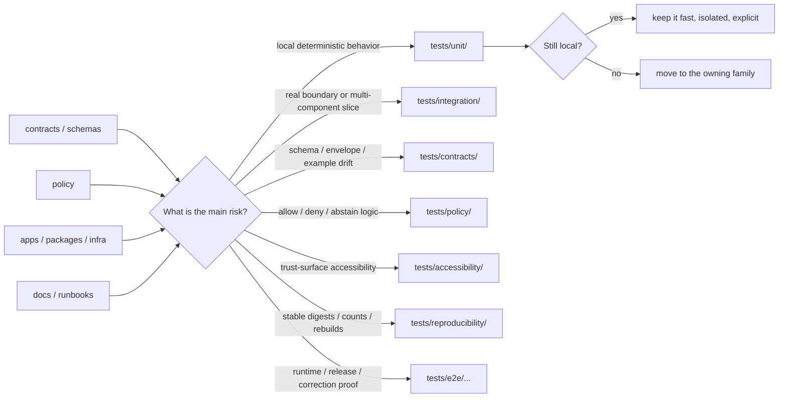

# unit

Deterministic local-behavior verification family for Kansas Frontier Matrix.

> **Status:** experimental  
> **Owners:** `@bartytime4life`  
> **Path:** `tests/unit/README.md`  
> **Repo fit:** smallest proof family under [`../README.md`](../README.md); current public `main` shows this directory containing `README.md` only  
> **Quick jump:** [Scope](#scope) · [Repo fit](#repo-fit) · [Accepted inputs](#accepted-inputs) · [Exclusions](#exclusions) · [Directory tree](#directory-tree) · [Quickstart](#quickstart) · [Usage](#usage) · [Diagram](#diagram) · [Tables](#tables) · [Task list / definition of done](#task-list--definition-of-done) · [FAQ](#faq) · [Appendix](#appendix)  
>      

> [!IMPORTANT]
> `tests/unit/` is where KFM should prove the smallest trustworthy behaviors first: fast, isolated, deterministic checks that fail loudly when local assumptions drift.

> [!WARNING]
> Current public `main` shows `tests/unit/` containing `README.md` only. Treat this directory as a documented family boundary, not as already-earned coverage or mature suite depth.

---

## Scope

`tests/unit/` is the narrowest proof surface inside KFM’s governed verification stack.

Its job is to prove behavior that should remain correct **before** a live store, network, renderer, workflow lane, or publication path enters the picture. In KFM terms, “unit” does not mean “anything small.” It means **local determinism is the main question**.

Illustrative examples of the kind of burden that fits here:

- pure normalization or canonicalization helpers
- local trust-state mappers that must not erase `generalized`, `partial`, `stale-visible`, `withdrawn`, or similar distinctions
- comparison, sorting, formatting, or time-window math that should be stable under small inputs
- helper-level negative cases for malformed input, missing fields, or impossible state combinations

Examples above are **illustrative placement guidance**, not claims about current implementation inventory.

### Evidence boundary used here

| Evidence layer | What this README treats as settled |
|---|---|
| **CONFIRMED — current public repo** | `tests/unit/` exists and the public directory listing currently shows `README.md` only. |
| **CONFIRMED — parent tests contract** | [`../README.md`](../README.md) defines `unit/` as the family for deterministic local behavior and separates it from integration, contract, policy, accessibility, reproducibility, and end-to-end proof burdens. |
| **CONFIRMED — ownership** | [`../../.github/CODEOWNERS`](../../.github/CODEOWNERS) assigns `/tests/` to `@bartytime4life`. |
| **CONFIRMED — workflow adjacency** | Public `main` currently shows [`../../.github/workflows/README.md`](../../.github/workflows/README.md) but no checked-in workflow YAML files in `.github/workflows/`, so merge-blocking automation is not proven from visible repo files alone. |
| **NEEDS VERIFICATION** | Actual runner/toolchain, executable case depth, local fixture inventory, required checks, and whether this family is exercised on the checked-out branch. |

### Status markers used here

| Marker | Meaning in this README |
|---|---|
| **CONFIRMED** | Visible on the current public branch or directly grounded in stable adjacent repo documentation |
| **INFERRED** | Strongly supported by repo doctrine and neighboring docs, but not re-proven from executable branch evidence in this revision |
| **PROPOSED** | Buildable guidance that fits KFM’s repo doctrine without claiming current implementation |
| **UNKNOWN** | Not verified strongly enough to describe as current repo reality |
| **NEEDS VERIFICATION** | Something that should be rechecked against the checked-out branch, GitHub settings, or runner configuration before merge |

## Repo fit

**Path:** `tests/unit/README.md`  
**Role:** directory README for the smallest, fastest, most deterministic proof family under `tests/`

| Relation | Path | Why it matters | Status |
|---|---|---|---|
| Parent family map | [`../README.md`](../README.md) | defines the current test-family lattice and names `unit/` as deterministic local behavior | **CONFIRMED** |
| Repo root | [`../../README.md`](../../README.md) | provides root posture and evidence-first repo framing | **CONFIRMED** |
| Contribution contract | [`../../CONTRIBUTING.md`](../../CONTRIBUTING.md) | keeps changes evidence-bounded and warns against guessing exact commands or workflow state | **CONFIRMED** |
| Ownership boundary | [`../../.github/CODEOWNERS`](../../.github/CODEOWNERS) | establishes review ownership for `/tests/` | **CONFIRMED** |
| Workflow adjacency | [`../../.github/workflows/README.md`](../../.github/workflows/README.md) | shows that visible workflow documentation exists while checked-in YAML inventory remains thin on public `main` | **CONFIRMED** |
| Sibling family | [`../integration/README.md`](../integration/README.md) | take boundary-crossing behavior here instead of stretching `unit/` too far | **CONFIRMED** |
| Sibling family | [`../contracts/README.md`](../contracts/README.md) | schema, envelope, and example drift belong there when that is the primary risk | **CONFIRMED** |
| Sibling family | [`../policy/README.md`](../policy/README.md) | allow / deny / abstain / obligation behavior belongs there when policy is the main question | **CONFIRMED** |
| Sibling family | [`../accessibility/README.md`](../accessibility/README.md) | accessibility-critical trust-surface behavior should stay explicit | **CONFIRMED** |
| Sibling family | [`../reproducibility/README.md`](../reproducibility/README.md) | digest, count, or bounded-rebuild stability belongs there | **CONFIRMED** |
| Local contents | [`./README.md`](./README.md) | currently the only confirmed file in this directory on public `main` | **CONFIRMED** |

## Accepted inputs

Content that belongs in `tests/unit/` includes:

| Belongs here | Why it belongs here |
|---|---|
| Pure helper tests with stable inputs and outputs | local determinism is the main burden |
| Negative cases for malformed or incomplete local input | fail-loud behavior should be visible early |
| Tiny local fixtures that do not pretend to be canonical examples | unit tests should stay cheap and isolated |
| Trust-state mapping helpers | local proof can prevent silent flattening of meaningful states before larger suites exist |
| Formatting / ordering / normalization helpers | correctness can be earned without touching real boundaries |
| Small serialization helpers | only when contract drift is **not** the primary question |

> [!NOTE]
> If the proof question becomes “does the real boundary behave correctly?” or “does the published contract still validate?”, you have already moved beyond `tests/unit/`.

## Exclusions

The following do **not** belong here as the primary source of proof:

| Does **not** belong here | Goes instead | Why |
|---|---|---|
| Schema validation, envelope examples, contract drift checks | [`../contracts/README.md`](../contracts/README.md) | the main risk is contract law, not local helper behavior |
| Allow / deny / abstain / obligation evaluation | [`../policy/README.md`](../policy/README.md) | policy behavior should stay reviewable as policy behavior |
| API, store, ingest, resolver, projection, or multi-component behavior | [`../integration/README.md`](../integration/README.md) | real boundaries matter |
| Runtime outcome proof, release assembly, rollback, supersession, or correction lineage | [`../e2e/README.md`](../e2e/README.md) | those are end-to-end burdens |
| Keyboard flow, trust-surface accessibility, reduced-motion, or inspectability behavior | [`../accessibility/README.md`](../accessibility/README.md) | accessibility is explicit in this repo’s test family map |
| Stable digests, counts, rebuild invariants, or bounded-regression baselines | [`../reproducibility/README.md`](../reproducibility/README.md) | reproducibility is its own proof surface |
| Canonical schemas, policy bundles, release evidence, or large raw fixtures | `../../contracts/`, `../../policy/`, governed artifact surfaces | unit tests should consume these, not replace them |

## Directory tree

### Current confirmed snapshot

```text
tests/unit/
└── README.md
```

No additional branch-visible files are confirmed in this directory during this revision.

<details>
<summary>What maturity would look like here (<strong>PROPOSED</strong>, not a current path claim)</summary>

As this family matures, it should accumulate executable local suites, tiny deterministic fixtures, and only the minimum runner-specific configuration that the checked-out branch actually uses. The point is not to make `unit/` look busy. The point is to make local correctness cheap to earn and cheap to keep.

</details>

[Back to top](#unit)

## Quickstart

### Safe inspection commands

These commands are safe because they inspect the current branch shape without assuming a specific runner.

```bash
# inspect current local inventory
find tests/unit -maxdepth 3 -type d 2>/dev/null | sort
find tests/unit -maxdepth 3 -type f 2>/dev/null | sort

# re-read the family boundary before adding new work
sed -n '1,260p' tests/README.md 2>/dev/null || true
sed -n '1,220p' tests/integration/README.md 2>/dev/null || true
sed -n '1,220p' tests/contracts/README.md 2>/dev/null || true
sed -n '1,220p' tests/policy/README.md 2>/dev/null || true
sed -n '1,220p' tests/accessibility/README.md 2>/dev/null || true
sed -n '1,220p' tests/reproducibility/README.md 2>/dev/null || true

# inspect ownership and workflow adjacency
sed -n '1,200p' .github/CODEOWNERS 2>/dev/null || true
find .github/workflows -maxdepth 2 -type f 2>/dev/null | sort
sed -n '1,220p' .github/workflows/README.md 2>/dev/null || true

# discover actual local test tooling before documenting it
find . -maxdepth 3 \( -name "package.json" -o -name "pyproject.toml" -o -name "Cargo.toml" \) 2>/dev/null | sort
grep -RIn "describe\\|it\\(|test\\(|pytest\\|vitest\\|jest\\|node --test\\|cargo test" . 2>/dev/null || true
```

### First local review pass

1. Confirm whether `tests/unit/` still contains only scaffolding or already has executable suites on the checked-out branch.
2. Confirm which runner or harness the repo actually uses before documenting a command.
3. Confirm whether the behavior under test is truly local and deterministic.
4. Confirm whether the same change also needs sibling proof in `integration/`, `contracts/`, `policy/`, `accessibility/`, `reproducibility/`, or `e2e/`.
5. Confirm that negative cases exist, not only happy-path confirmation.

> [!TIP]
> Inspection-first is safer than guessing a toolchain. Do not paste `npm test`, `pytest`, `cargo test`, or any other runner command into this README until the active branch proves that choice.

## Usage

### What `unit/` is

`tests/unit/` is:

- the smallest proof surface in the repo’s verification lattice
- the place for cheap, deterministic confidence work
- the family that should catch local logic drift before it grows into boundary or publication failures
- a protection against quietly smoothing away trust-critical state at helper level

### What `unit/` is not

`tests/unit/` is **not**:

- a substitute for contract, policy, or end-to-end proof
- a place to hide boundary complexity behind mocks and call it coverage
- a scratch bucket for ad hoc experiments
- a badge generator for CI theater
- proof that the repo has merge-blocking automation

### Working placement rule

Use `tests/unit/` only when the main question can be answered **without** a real boundary.

If the proof needs a live database, filesystem artifact tree, HTTP surface, policy decision point, release object, accessibility surface, or correction path, move outward to the family that owns that burden.

## Diagram


```mermaid
flowchart LR
    C["contracts / schemas"] --> Q{"What is the main risk?"}
    P["policy"] --> Q
    A["apps / packages / infra"] --> Q
    D["docs / runbooks"] --> Q

    Q -->|local deterministic behavior| U["tests/unit/"]
    Q -->|real boundary or multi-component slice| I["tests/integration/"]
    Q -->|schema / envelope / example drift| K["tests/contracts/"]
    Q -->|allow / deny / abstain logic| PO["tests/policy/"]
    Q -->|trust-surface accessibility| AX["tests/accessibility/"]
    Q -->|stable digests / counts / rebuilds| R["tests/reproducibility/"]
    Q -->|runtime / release / correction proof| E["tests/e2e/..."]

    U --> M{"Still local?"}
    M -->|yes| FAST["keep it fast, isolated, explicit"]
    M -->|no| MOVE["move to the owning family"]
```

## Tables

### Family boundary matrix

| If the main question is… | Put it here | Why |
|---|---|---|
| “Does this pure helper always return the right local result?” | `tests/unit/` | local determinism is the burden |
| “Does the real boundary behave correctly across components?” | `tests/integration/` | integration owns boundary proof |
| “Does the object still validate or drift against examples?” | `tests/contracts/` | contract law is primary |
| “Does policy still allow, deny, abstain, or hold correctly?” | `tests/policy/` | policy behavior should stay explicit |
| “Can a user still inspect the trust surface accessibly?” | `tests/accessibility/` | accessibility is a first-class family |
| “Do stable counts, digests, or bounded rebuild metrics stay fixed?” | `tests/reproducibility/` | reproducibility is its own burden |
| “Do runtime, release, or correction flows still hold together?” | `tests/e2e/...` | that is not local proof anymore |

### Quality bar for a KFM unit test

| Property | Minimum expectation |
|---|---|
| Determinism | stable inputs, stable outputs, no hidden dependency on external state |
| Isolation | no required network, service, or persistent store |
| Negative coverage | malformed, missing, contradictory, or impossible inputs should be exercised |
| Trust visibility | local code must not silently erase important states or caveats |
| Fixture size | keep fixtures tiny and local; do not smuggle canonical artifacts in here |
| Placement honesty | move the test if the proof question becomes boundary-heavy |
| Documentation honesty | do not claim runner, coverage, or merge-gate behavior without direct branch evidence |

[Back to top](#unit)

## Task list / definition of done

- [ ] The behavior under test is local, deterministic, and boundary-light.
- [ ] At least one negative or malformed-input case exists.
- [ ] The suite does not silently flatten trust-critical state or visible caveats.
- [ ] Any real boundary proof was placed in the sibling family that owns it.
- [ ] Fixtures stay tiny and local.
- [ ] Commands or runner references were verified from the checked-out branch.
- [ ] No claim of merge-blocking, coverage depth, or mature CI automation is made without direct evidence.
- [ ] Adjacent docs were updated if the boundary between families changed.

## FAQ

### Is `tests/unit/` currently a populated executable suite?

Not from the current public `main` evidence used for this revision. Public branch inspection shows `tests/unit/` with `README.md` only.

### Can I test `ABSTAIN`, `DENY`, or `ERROR` behavior here?

Only when the proof is purely local, such as a small mapper or formatter. End-to-end runtime outcome proof belongs under `../e2e/`, and policy decision proof belongs under `../policy/`.

### Should schema-example validation live here?

No. When schema or example drift is the main risk, place the work under `../contracts/`.

### Should I document a specific runner in this README?

Only after the checked-out branch proves the toolchain. This README should not guess.

## Appendix

<details>
<summary>Illustrative local burden examples (<strong>PROPOSED</strong> examples, not current inventory)</summary>

Possible unit-scale burdens that would fit this family once executable suites land:

- local time-window normalization
- stable sort / compare helpers for already-loaded records
- explicit trust-state label mapping
- small formatting helpers for citations, badges, or warning text
- canonicalization helpers for IDs, slugs, or display tokens
- local guards against impossible or contradictory state combinations

These are examples of **shape**, not claims that such helpers already exist in the repo.

</details>

<details>
<summary>Open verification items before claiming maturity</summary>

Before calling this family active or stable, verify:

1. the real runner and invocation surface
2. actual executable suite depth
3. whether any fixtures exist locally
4. whether unit work is wired into an effective merge gate
5. whether local proofs are paired correctly with integration, contract, policy, accessibility, reproducibility, or end-to-end proof where needed

</details>

[Back to top](#unit)
