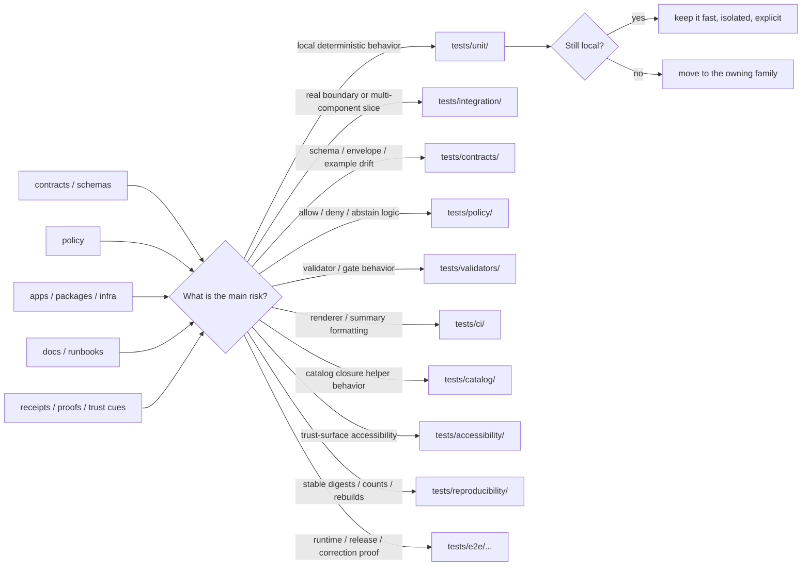

<!-- [KFM_META_BLOCK_V2]
doc_id: kfm://doc/NEEDS_VERIFICATION
title: unit
type: standard
version: v1
status: draft
owners: @bartytime4life
created: 2026-01-28
updated: 2026-04-16
policy_label: public
related: [
  ../README.md,
  ../contracts/README.md,
  ../policy/README.md,
  ../validators/README.md,
  ../ci/README.md,
  ../catalog/README.md,
  ../integration/README.md,
  ../e2e/README.md,
  ../reproducibility/README.md,
  ../accessibility/README.md,
  ../../README.md,
  ../../CONTRIBUTING.md,
  ../../.github/CODEOWNERS,
  ../../.github/README.md,
  ../../.github/workflows/README.md,
  ../../.github/watchers/README.md,
  ../../contracts/README.md,
  ../../schemas/README.md,
  ../../policy/README.md,
  ../../data/receipts/README.md,
  ../../data/proofs/README.md,
  ../../tools/validators/README.md,
  ../../tools/attest/README.md,
  ../../tools/ci/README.md,
  ../../tools/diff/README.md
]
tags: [kfm, tests, unit, verification, deterministic, local, receipts, proofs]
notes: [
  created date preserves the earliest visible public path history described in the prior draft,
  updated date reflects this revision,
  current public-main evidence still proves this lane mainly as a visible README-bearing family; executable suite depth, runner/toolchain, and merge-blocking automation remain bounded until checked directly on the working branch
]
[/KFM_META_BLOCK_V2] -->

<a id="top"></a>

# `unit`

Deterministic local-behavior verification family for Kansas Frontier Matrix.

> [!NOTE]
> The KFM meta block above keeps document-record fields reviewable.  
> The impact block below describes the **current maturity of the `tests/unit/` surface itself**, which remains experimental even though this README is a checked-in public document.

> **Status:** experimental  
> **Owners:** `@bartytime4life`  
> **Path:** `tests/unit/README.md`  
> **Public path history:** first visible create `2026-01-28` · latest visible public path update now reflected through this revision  
> **Repo fit:** smallest proof family under [`../README.md`](../README.md); current public `main` shows this directory containing `README.md` only  
> **Quick jump:** [Scope](#scope) · [Repo fit](#repo-fit) · [Accepted inputs](#accepted-inputs) · [Exclusions](#exclusions) · [Current verified snapshot](#current-verified-snapshot) · [Directory tree](#directory-tree) · [Public history signal](#public-history-signal) · [Quickstart](#quickstart) · [Usage](#usage) · [Diagram](#diagram) · [Tables](#tables) · [Task list / definition of done](#task-list--definition-of-done) · [FAQ](#faq) · [Appendix](#appendix)  
>        

> [!IMPORTANT]
> `tests/unit/` is where KFM should prove the **smallest trustworthy behaviors first**:
>
> - fast
> - local
> - deterministic
> - explicit about failure
>
> A unit proof is successful when it catches local drift **before** the question becomes about a real boundary, policy decision, release state, accessibility surface, or trust-chain workflow.

> [!TIP]
> Keep the KFM trust split visible here:
>
> **unit proof ≠ contract authority ≠ policy authority ≠ validator proof ≠ renderer proof ≠ receipt authority ≠ proof authority**
>
> - `tests/unit/` proves local deterministic behavior
> - `tests/contracts/` proves shape and valid/invalid examples
> - `tests/policy/` proves decision behavior
> - `tests/validators/` proves gate behavior
> - `tests/ci/` proves renderer behavior
> - `tests/integration/` proves real seams
> - `tests/e2e/` proves whole-path runtime, release, or correction behavior
> - receipts remain process memory
> - proofs remain higher-order trust objects

> [!WARNING]
> Current public `main` shows `tests/unit/` containing `README.md` only.  
> Treat this directory as a documented family boundary, not as already-earned executable coverage or mature suite depth.

---

## Scope

`tests/unit/` is the narrowest proof surface inside KFM’s governed verification stack.

Its job is to prove behavior that should remain correct **before** a live store, network, renderer, workflow lane, or publication path enters the picture. In KFM, “unit” does not mean “anything small.” It means:

> **local determinism is the main question**

Illustrative examples of the kind of burden that fits here:

- pure normalization or canonicalization helpers
- local trust-state mappers that must not erase `generalized`, `partial`, `stale-visible`, `withdrawn`, `superseded`, or similar distinctions
- comparison, sorting, formatting, or time-window math that should be stable under small inputs
- helper-level negative cases for malformed input, missing fields, or impossible state combinations
- tiny local transformations that consume trust-bearing inputs without silently flattening receipt/proof/decision/render distinctions

These examples are **placement guidance**, not claims about current checked-in executable inventory.

### What this family should prove

- deterministic local behavior
- explicit negative-path behavior
- no hidden reliance on external state
- no silent flattening of meaningful trust states
- tiny, reviewable fixtures
- stable local outputs that higher-order lanes can rely on safely

### What this family should not absorb

- live boundary behavior
- contract-shape authority
- policy grammar or decision law
- validator-only pass/fail gate semantics
- renderer-only formatting burden
- whole runtime/release/correction proof
- receipt/proof storage or archival continuity
- large fixture dumps that pretend to be canonical sources of truth

### Evidence boundary used here

| Evidence layer | What this README treats as settled |
|---|---|
| **CONFIRMED — current public repo** | `tests/unit/` exists and the public directory listing currently shows `README.md` only |
| **CONFIRMED — parent tests contract** | [`../README.md`](../README.md) defines `unit/` as the family for deterministic local behavior and separates it from integration, contract, policy, accessibility, reproducibility, validator, CI-renderer, catalog, and end-to-end proof burdens |
| **CONFIRMED — ownership** | [`../../.github/CODEOWNERS`](../../.github/CODEOWNERS) assigns `/tests/` to `@bartytime4life` |
| **CONFIRMED — workflow adjacency** | Public `main` currently shows [`../../.github/workflows/README.md`](../../.github/workflows/README.md) but no checked-in workflow YAML files in `.github/workflows/`, so merge-blocking automation is not proven from visible repo files alone |
| **CONFIRMED — watcher/process-memory adjacency** | Public `main` now shows [`../../.github/watchers/README.md`](../../.github/watchers/README.md), which sharpens process-memory and watcher-boundary language even for local proof placement |
| **CONFIRMED — trust-surface adjacency** | [`../../data/receipts/README.md`](../../data/receipts/README.md) and [`../../data/proofs/README.md`](../../data/proofs/README.md) now exist as explicit trust-boundary docs, which helps this lane describe what it must not flatten |
| **CONFIRMED — public path history** | Public history for `tests/unit/` includes scaffold, delete, recreate, and README-revision events; path age alone is therefore a weak maturity signal |
| **NEEDS VERIFICATION** | Actual runner/toolchain, executable case depth, local fixture inventory, required checks, and whether this family is exercised on the checked-out branch |

### Status markers used here

| Marker | Meaning in this README |
|---|---|
| **CONFIRMED** | Visible on the current public branch or directly grounded in stable adjacent repo documentation |
| **INFERRED** | Strongly supported by repo doctrine and neighboring docs, but not re-proven from executable branch evidence in this revision |
| **PROPOSED** | Buildable guidance that fits KFM’s repo doctrine without claiming current implementation |
| **UNKNOWN** | Not verified strongly enough to describe as current repo reality |
| **NEEDS VERIFICATION** | Something that should be rechecked against the checked-out branch, GitHub settings, or runner configuration before merge |

[Back to top](#top)

---

## Repo fit

**Path:** `tests/unit/README.md`  
**Role:** directory README for the smallest, fastest, most deterministic proof family under `tests/`

| Relation | Path | Why it matters | Status |
|---|---|---|---|
| Parent family map | [`../README.md`](../README.md) | defines the current test-family lattice and names `unit/` as deterministic local behavior | **CONFIRMED** |
| Repo root | [`../../README.md`](../../README.md) | provides root posture and evidence-first repo framing | **CONFIRMED** |
| Contribution contract | [`../../CONTRIBUTING.md`](../../CONTRIBUTING.md) | keeps changes evidence-bounded and warns against guessing exact commands or workflow state | **CONFIRMED** |
| Governance boundary | [`../../.github/README.md`](../../.github/README.md) | keeps workflow and ownership claims inside the repo gatehouse rather than inferred from convenience | **CONFIRMED** |
| Ownership boundary | [`../../.github/CODEOWNERS`](../../.github/CODEOWNERS) | establishes review ownership for `/tests/` | **CONFIRMED** |
| Workflow adjacency | [`../../.github/workflows/README.md`](../../.github/workflows/README.md) | shows that visible workflow documentation exists while checked-in YAML inventory remains thin on public `main` | **CONFIRMED** |
| Watcher adjacency | [`../../.github/watchers/README.md`](../../.github/watchers/README.md) | sharpens process-memory and watcher boundaries that local proofs should not silently cross | **CONFIRMED** |
| Sibling family | [`../integration/README.md`](../integration/README.md) | take boundary-crossing behavior here instead of stretching `unit/` too far | **CONFIRMED** |
| Sibling family | [`../contracts/README.md`](../contracts/README.md) | schema, envelope, and example drift belong there when that is the primary risk | **CONFIRMED** |
| Sibling family | [`../policy/README.md`](../policy/README.md) | allow / deny / abstain / obligation behavior belongs there when policy is the main question | **CONFIRMED** |
| Sibling family | [`../validators/README.md`](../validators/README.md) | gate and fail-closed validator semantics belong there when that is the primary burden | **CONFIRMED** |
| Sibling family | [`../ci/README.md`](../ci/README.md) | renderer and handoff formatting proof belongs there | **CONFIRMED** |
| Sibling family | [`../catalog/README.md`](../catalog/README.md) | metadata closure helper proof belongs there | **CONFIRMED** |
| Sibling family | [`../accessibility/README.md`](../accessibility/README.md) | accessibility-critical trust-surface behavior should stay explicit | **CONFIRMED** |
| Sibling family | [`../reproducibility/README.md`](../reproducibility/README.md) | digest, count, or bounded-rebuild stability belongs there | **CONFIRMED** |
| Trust boundaries | [`../../data/receipts/README.md`](../../data/receipts/README.md), [`../../data/proofs/README.md`](../../data/proofs/README.md) | local helpers may touch trust-bearing refs or objects, but they must not redefine process memory or proof storage roles | **CONFIRMED** |
| Adjacent helper lanes | [`../../tools/validators/README.md`](../../tools/validators/README.md), [`../../tools/attest/README.md`](../../tools/attest/README.md), [`../../tools/ci/README.md`](../../tools/ci/README.md), [`../../tools/diff/README.md`](../../tools/diff/README.md) | unit-scale helper proof should not drift into lane-owned behavior better proved elsewhere | **CONFIRMED** |
| Local contents | [`./README.md`](./README.md) | currently the only confirmed file in this directory on public `main` | **CONFIRMED** |

### Working placement rule

Use `tests/unit/` only when the main question can be answered **without a real boundary**.

If the proof needs a live database, filesystem artifact tree, HTTP surface, policy decision point, validator chain, release object, accessibility surface, or correction path, move outward to the family that owns that burden.

[Back to top](#top)

---

## Accepted inputs

Content that belongs in `tests/unit/` includes:

| Belongs here | Why it belongs here |
|---|---|
| Pure helper tests with stable inputs and outputs | local determinism is the main burden |
| Negative cases for malformed or incomplete local input | fail-loud behavior should be visible early |
| Tiny local fixtures that do not pretend to be canonical examples | unit tests should stay cheap and isolated |
| Trust-state mapping helpers | local proof can prevent silent flattening of meaningful states before larger suites exist |
| Formatting / ordering / normalization helpers | correctness can be earned without touching real boundaries |
| Small serialization helpers | only when contract drift is **not** the primary question |
| Tiny receipt/proof-aware local helpers | only when the question remains purely local and the test preserves role distinctions instead of collapsing them |

### Input rules

1. Keep fixtures tiny and local.
2. Keep the question deterministic and boundary-light.
3. Reuse authoritative shapes and vocabularies from their owning lanes instead of recreating them here.
4. If the helper touches receipts, proofs, machine decisions, or rendered cues, keep those roles explicit instead of flattening them.
5. Move outward immediately if the proof question becomes “does the real seam behave correctly?”

> [!NOTE]
> If the proof question becomes “does the real boundary behave correctly?” or “does the published contract still validate?”, you have already moved beyond `tests/unit/`.

[Back to top](#top)

---

## Exclusions

The following do **not** belong here as the primary source of proof:

| Does **not** belong here | Goes instead | Why |
|---|---|---|
| Schema validation, envelope examples, contract drift checks | [`../contracts/README.md`](../contracts/README.md) | the main risk is contract law, not local helper behavior |
| Allow / deny / abstain / obligation evaluation | [`../policy/README.md`](../policy/README.md) | policy behavior should stay reviewable as policy behavior |
| API, store, ingest, resolver, projection, or multi-component behavior | [`../integration/README.md`](../integration/README.md) | real boundaries matter |
| Runtime outcome proof, release assembly, rollback, supersession, or correction lineage | [`../e2e/README.md`](../e2e/README.md) | those are end-to-end burdens |
| Keyboard flow, trust-surface accessibility, reduced-motion, or inspectability behavior | [`../accessibility/README.md`](../accessibility/README.md) | accessibility is explicit in this repo’s test family map |
| Stable digests, counts, rebuild invariants, or bounded-regression baselines | [`../reproducibility/README.md`](../reproducibility/README.md) | reproducibility is its own proof surface |
| Validator-only gate behavior | [`../validators/README.md`](../validators/README.md) | gate semantics should stay bounded when local determinism is not the main burden |
| Renderer-only behavior | [`../ci/README.md`](../ci/README.md) | formatting and review-handoff proof are not unit-scale by default |
| Catalog-closure-only behavior | [`../catalog/README.md`](../catalog/README.md) | metadata closure is a distinct burden |
| Canonical schemas, policy bundles, release evidence, receipts, or proofs as authority | `../../contracts/`, `../../policy/`, `../../data/receipts/`, `../../data/proofs/`, governed artifact surfaces | unit tests should consume these, not replace them |

> [!IMPORTANT]
> A unit test may **touch** trust-bearing inputs or outputs.  
> It should not become the place where receipt/proof/process-memory boundaries are silently rewritten.

[Back to top](#top)

---

## Current verified snapshot

The current public `main` branch proves the following:

- `tests/unit/` exists as a real directory
- `tests/unit/` currently exposes `README.md` only
- the parent `tests/` surface currently exposes sibling families for `accessibility/`, `contracts/`, `e2e/`, `integration/`, `policy/`, `reproducibility/`, and `unit/`
- `tests/validators/`, `tests/ci/`, and `tests/catalog/` are also now explicit neighboring family docs that help keep placement honest
- `.github/workflows/` currently exposes `README.md` only on public `main`, so merge-blocking automation for this family is still **not** proven from visible tree state alone
- `.github/watchers/README.md` now exists publicly, which strengthens watcher/process-memory boundary language even for local-proof placement
- explicit trust-boundary docs now exist for `data/receipts/` and `data/proofs/`
- `/tests/` is assigned to `@bartytime4life` in `/.github/CODEOWNERS`

> [!CAUTION]
> Directory presence is not the same thing as executable proof depth. This snapshot is useful because it narrows what can be said honestly, not because it implies maturity.

[Back to top](#top)

---

## Directory tree

### Current confirmed snapshot

```text
tests/unit/
└── README.md
```

No additional branch-visible files are confirmed in this directory during this revision.

<details>
<summary>What maturity would look like here (<strong>PROPOSED</strong>, not a current path claim)</summary>

As this family matures, it should accumulate executable local suites, tiny deterministic fixtures, and only the minimum runner-specific configuration that the checked-out branch actually uses.

The point is not to make `unit/` look busy. The point is to make local correctness:

- cheap to earn
- cheap to rerun
- cheap to understand
- cheap to move outward when the boundary grows

</details>

[Back to top](#top)

---

## Public history signal

The public path history is useful here because it explains **why path presence should not be over-read**.

| Date | Public history signal | Why it matters |
|---|---|---|
| 2026-03-28 | `Add newline at end of README.md` | latest visible path update before this revision was editorial, not suite-depth proof |
| 2026-03-24 | `Enhance README.md for unit testing directory` | current family guidance was materially revised |
| 2026-03-22 | `Scaffold repository structure from README-defined layout` | current directory presence is compatible with scaffold-first growth |
| 2026-03-21 | `Delete tests/unit directory` | continuity on this path has breaks, so path age alone is a weak maturity signal |

> [!NOTE]
> Earlier public history also shows additional create, delete, scaffold, and README-focused updates. Read that history as a documentation-and-structure signal, not as proof that executable unit suites currently exist.

[Back to top](#top)

---

## Quickstart

### Safe inspection commands

These commands are safe because they inspect the current branch shape without assuming a specific runner.

```bash
# inspect current local inventory
find tests/unit -maxdepth 3 -type d 2>/dev/null | sort
find tests/unit -maxdepth 3 -type f 2>/dev/null | sort

# re-read the family boundary before adding new work
sed -n '1,260p' tests/README.md 2>/dev/null || true
sed -n '1,220p' tests/integration/README.md 2>/dev/null || true
sed -n '1,220p' tests/contracts/README.md 2>/dev/null || true
sed -n '1,220p' tests/policy/README.md 2>/dev/null || true
sed -n '1,220p' tests/validators/README.md 2>/dev/null || true
sed -n '1,220p' tests/ci/README.md 2>/dev/null || true
sed -n '1,220p' tests/catalog/README.md 2>/dev/null || true
sed -n '1,220p' tests/accessibility/README.md 2>/dev/null || true
sed -n '1,220p' tests/reproducibility/README.md 2>/dev/null || true
sed -n '1,220p' tests/e2e/README.md 2>/dev/null || true

# inspect ownership, watcher/workflow adjacency, and trust-boundary docs
sed -n '1,200p' .github/CODEOWNERS 2>/dev/null || true
find .github/workflows -maxdepth 2 -type f 2>/dev/null | sort
sed -n '1,220p' .github/README.md 2>/dev/null || true
sed -n '1,220p' .github/workflows/README.md 2>/dev/null || true
sed -n '1,220p' .github/watchers/README.md 2>/dev/null || true
sed -n '1,220p' data/receipts/README.md 2>/dev/null || true
sed -n '1,220p' data/proofs/README.md 2>/dev/null || true

# inspect local path history before claiming maturity or continuity
git log --oneline -- tests/unit 2>/dev/null | sed -n '1,20p'
git log --oneline -- tests/unit/README.md 2>/dev/null | sed -n '1,20p'

# discover actual local test tooling before documenting it
find . -maxdepth 3 \( -name "package.json" -o -name "pyproject.toml" -o -name "Cargo.toml" \) 2>/dev/null | sort
grep -RIn "describe\\|it\\(|test\\(|pytest\\|vitest\\|jest\\|node --test\\|cargo test" . 2>/dev/null || true
```

### First local review pass

1. Confirm whether `tests/unit/` still contains only scaffolding or already has executable suites on the checked-out branch.
2. Confirm which runner or harness the repo actually uses before documenting a command.
3. Confirm whether the behavior under test is truly local and deterministic.
4. Confirm whether the same change also needs sibling proof in `integration/`, `contracts/`, `policy/`, `validators/`, `ci/`, `catalog/`, `accessibility/`, `reproducibility/`, or `e2e/`.
5. Confirm that negative cases exist, not only happy-path confirmation.
6. Confirm whether current branch history changes the maturity story relative to public `main`.
7. Confirm whether any local helper under test touches receipt/proof/decision/rendered state and, if so, whether the test preserves those distinctions.

> [!TIP]
> Inspection-first is safer than guessing a toolchain. Do not paste `npm test`, `pytest`, `cargo test`, or any other runner command into this README until the active branch proves that choice.

[Back to top](#top)

---

## Usage

### What `unit/` is

`tests/unit/` is:

- the smallest proof surface in the repo’s verification lattice
- the place for cheap, deterministic confidence work
- the family that should catch local logic drift before it grows into boundary or publication failures
- a protection against quietly smoothing away trust-critical state at helper level

### What `unit/` is not

`tests/unit/` is **not**:

- a substitute for contract, policy, validator, renderer, catalog, integration, or end-to-end proof
- a place to hide boundary complexity behind mocks and call it coverage
- a scratch bucket for ad hoc experiments
- a badge generator for CI theater
- proof that the repo has merge-blocking automation

### Working placement rule

Use `tests/unit/` only when the main question can be answered **without** a real boundary.

If the proof needs a live database, filesystem artifact tree, HTTP surface, policy decision point, release object, accessibility surface, or correction path, move outward to the family that owns that burden.

### Trust-surface rule

Where a local helper consumes or emits trust-adjacent values:

- keep receipts as **process memory**
- keep proofs as **higher-order trust objects**
- keep machine decisions as **machine decisions**
- keep rendered summaries as **secondary outward aids**
- do not flatten all of them into one generic “status” value unless that flattening is the thing explicitly being rejected by the test

[Back to top](#top)

---

## Diagram


```mermaid
flowchart LR
    C["contracts / schemas"] --> Q{"What is the main risk?"}
    P["policy"] --> Q
    A["apps / packages / infra"] --> Q
    D["docs / runbooks"] --> Q
    T["receipts / proofs / trust cues"] --> Q

    Q -->|local deterministic behavior| U["tests/unit/"]
    Q -->|real boundary or multi-component slice| I["tests/integration/"]
    Q -->|schema / envelope / example drift| K["tests/contracts/"]
    Q -->|allow / deny / abstain logic| PO["tests/policy/"]
    Q -->|validator / gate behavior| V["tests/validators/"]
    Q -->|renderer / summary formatting| CI["tests/ci/"]
    Q -->|catalog closure helper behavior| CAT["tests/catalog/"]
    Q -->|trust-surface accessibility| AX["tests/accessibility/"]
    Q -->|stable digests / counts / rebuilds| R["tests/reproducibility/"]
    Q -->|runtime / release / correction proof| E["tests/e2e/..."]

    U --> M{"Still local?"}
    M -->|yes| FAST["keep it fast, isolated, explicit"]
    M -->|no| MOVE["move to the owning family"]
```

[Back to top](#top)

---

## Tables

### Family boundary matrix

| If the main question is… | Put it here | Why |
|---|---|---|
| “Does this pure helper always return the right local result?” | `tests/unit/` | local determinism is the burden |
| “Does the real boundary behave correctly across components?” | `tests/integration/` | integration owns boundary proof |
| “Does the object still validate or drift against examples?” | `tests/contracts/` | contract law is primary |
| “Does policy still allow, deny, abstain, or hold correctly?” | `tests/policy/` | policy behavior should stay explicit |
| “Does the validator or gate still behave correctly?” | `tests/validators/` | gate semantics are a distinct burden |
| “Does the renderer or handoff format still behave correctly?” | `tests/ci/` | renderer proof should stay explicit |
| “Does catalog closure still align?” | `tests/catalog/` | metadata closure is a distinct burden |
| “Can a user still inspect the trust surface accessibly?” | `tests/accessibility/` | accessibility is a first-class family |
| “Do stable counts, digests, or bounded rebuild metrics stay fixed?” | `tests/reproducibility/` | reproducibility is its own burden |
| “Do runtime, release, or correction flows still hold together?” | `tests/e2e/...` | that is not local proof anymore |

### Quality bar for a KFM unit test

| Property | Minimum expectation |
|---|---|
| Determinism | stable inputs, stable outputs, no hidden dependency on external state |
| Isolation | no required network, service, or persistent store |
| Negative coverage | malformed, missing, contradictory, or impossible inputs should be exercised |
| Trust visibility | local code must not silently erase important states or caveats |
| Fixture size | keep fixtures tiny and local; do not smuggle canonical artifacts in here |
| Placement honesty | move the test if the proof question becomes boundary-heavy |
| Documentation honesty | do not claim runner, coverage, or merge-gate behavior without direct branch evidence |
| History honesty | do not turn scaffold or README churn into claims of executable depth |
| Trust-role honesty | if receipts/proofs/decisions/rendered cues appear, preserve their distinct roles |

[Back to top](#top)

---

## Task list / definition of done

- [ ] The behavior under test is local, deterministic, and boundary-light.
- [ ] At least one negative or malformed-input case exists.
- [ ] The suite does not silently flatten trust-critical state or visible caveats.
- [ ] Any real boundary proof was placed in the sibling family that owns it.
- [ ] Fixtures stay tiny and local.
- [ ] Commands or runner references were verified from the checked-out branch.
- [ ] History was checked before claiming continuity, maturity, or suite depth.
- [ ] No claim of merge-blocking, coverage depth, or mature CI automation is made without direct evidence.
- [ ] Adjacent docs were updated if the boundary between families changed.
- [ ] If the helper touches receipts, proofs, machine decisions, or rendered summaries, the case preserves their distinct roles instead of flattening them.

[Back to top](#top)

---

## FAQ

### Is `tests/unit/` currently a populated executable suite?

Not from the current public `main` evidence used for this revision. Public branch inspection shows `tests/unit/` with `README.md` only.

### Why does this README mention public history at all?

Because public history for this path shows scaffold, delete, recreate, and README-focused edits. That makes history useful for **bounding claims**, even though it does not by itself prove executable depth.

### Can I test `ABSTAIN`, `DENY`, or `ERROR` behavior here?

Only when the proof is purely local, such as a small mapper or formatter. End-to-end runtime outcome proof belongs under `../e2e/`, and policy decision proof belongs under `../policy/`.

### Should schema-example validation live here?

No. When schema or example drift is the main risk, place the work under `../contracts/`.

### Should renderer formatting live here?

No. If the main burden is review rendering, summary formatting, or handoff structure, use `../ci/`.

### Should I document a specific runner in this README?

Only after the checked-out branch proves the toolchain. This README should not guess.

### Why mention receipts and proofs here?

Because even local helpers can accidentally flatten trust-critical distinctions. Mentioning them keeps local proof honest; it does not move ownership into this family.

[Back to top](#top)

---

## Appendix

<details>
<summary>Illustrative local burden examples (<strong>PROPOSED</strong> examples, not current inventory)</summary>

Possible unit-scale burdens that would fit this family once executable suites land:

- local time-window normalization
- stable sort / compare helpers for already-loaded records
- explicit trust-state label mapping
- small formatting helpers for citations, badges, or warning text
- canonicalization helpers for IDs, slugs, or display tokens
- local guards against impossible or contradictory state combinations
- local helpers that preserve `receipt_ref` and `proof_ref` distinctions instead of flattening them

These are examples of **shape**, not claims that such helpers already exist in the repo.

</details>

<details>
<summary>Open verification items before claiming maturity</summary>

Before calling this family active or stable, verify:

1. the real runner and invocation surface
2. actual executable suite depth
3. whether any fixtures exist locally
4. whether unit work is wired into an effective merge gate
5. whether local proofs are paired correctly with integration, contract, policy, validator, CI, catalog, accessibility, reproducibility, or end-to-end proof where needed
6. whether any local helper tests now need explicit trust-role assertions for receipts, proofs, machine decisions, or rendered summaries

</details>

[Back to top](#top)
