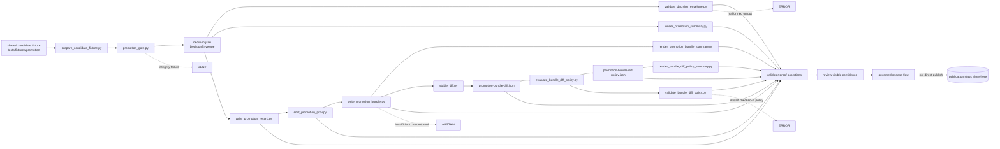

<!-- [KFM_META_BLOCK_V2]
doc_id: kfm://doc/NEEDS-VERIFICATION
title: validators
type: standard
version: v1
status: draft
owners: @bartytime4life
created: YYYY-MM-DD
updated: 2026-04-13
policy_label: public
related: [../README.md, ../../.github/README.md, ../../.github/CODEOWNERS, ../../.github/workflows/README.md, ../../tools/ci/README.md, ../../tools/attest/README.md, ../../tools/validators/promotion_gate/README.md, ../../contracts/README.md, ../../schemas/README.md, ../../schemas/promotion/decision-envelope.schema.json, ../../schemas/promotion/promotion-record.schema.json, ../../schemas/promotion/promotion-prov.schema.json, ../../schemas/promotion/promotion-bundle.schema.json, ../../schemas/promotion/promotion-bundle-diff-policy.schema.json, ../../policy/README.md, ../../policy/promotion_bundle_diff_policy.json, ../fixtures/promotion/, ../e2e/runtime_proof/README.md, ./test_promotion_gate_e2e.py, ./test_bundle_diff_policy.py, ./test_validate_bundle_diff_policy.py]
tags: [kfm, tests, validators, promotion, verification, fail-closed, diff-policy]
notes: [Updated as a child tests-lane README from adjacent repo documentation and KFM doctrine to reflect the fuller promotion-gate thin slice: bundle diff, checked-in diff-policy evaluation, policy schema validation, and reviewer handoff artifacts. Direct branch inventory for tests/validators/ still remains bounded where not re-enumerated from a mounted checkout.]
[/KFM_META_BLOCK_V2] -->

# validators

Validator- and gate-focused proof surface for KFM promotion decisions, derived trust objects, and adjacent fail-closed machine checks.

> [!IMPORTANT]
> **Status:** experimental  
> **Owners:** `@bartytime4life`  
> **Path:** `tests/validators/README.md`  
> **Repo fit:** child lane of `tests/`; primary current subject is `tools/validators/promotion_gate/`; renderer handoff belongs in `tools/ci/`; attestation support belongs in `tools/attest/`; canonical law remains upstream in `contracts/`, `schemas/`, and `policy/`  
> **Quick jumps:** [Scope](#scope) · [Repo fit](#repo-fit) · [Accepted inputs](#accepted-inputs) · [Exclusions](#exclusions) · [Current evidence snapshot](#current-evidence-snapshot) · [Directory tree](#directory-tree) · [Quickstart](#quickstart) · [Usage](#usage) · [Validator proof contract](#validator-proof-contract) · [Diagram](#diagram) · [Coverage matrix](#coverage-matrix) · [Definition of done](#definition-of-done) · [FAQ](#faq) · [Appendix](#appendix)


> [!WARNING]
> Recent adjacent documentation repeatedly references `tests/validators/test_promotion_gate_e2e.py`, `test_bundle_diff_policy.py`, and `test_validate_bundle_diff_policy.py`, but the directly surfaced top-level public-tree snapshot available in this review pass did not independently enumerate `tests/validators/`. This README therefore documents the lane conservatively and keeps broader inventory claims visibly bounded.

> [!NOTE]
> `tests/validators/` is not a generic bucket for “harder tests.”  
> In KFM, this lane should prove that validators, gated decisions, derived trust objects, and checked-in policy interpretations behave **deterministically**, **fail closed**, and remain **review-visible** without silently publishing anything.

---

## Scope

`tests/validators/` is the proof lane for validator-oriented behavior inside the broader `tests/` surface.

Use this lane when the subject under test is a validator or governed gate that must prove:

- finite machine outcomes
- schema-valid emitted objects
- explicit failure semantics
- stable negative-path behavior
- reviewer handoff artifacts that remain subordinate to upstream truth
- checked-in policy evaluation over already-produced machine artifacts
- schema validation of checked-in policy files that influence governed review

This lane is especially natural for the current promotion thin slice because the adjacent subject docs already describe a validator chain that moves from candidate preparation to a `DecisionEnvelope`, then onward to reviewer summaries and derived trust objects, then onward again to prior/current bundle comparison and diff-policy classification.

This lane is **not** the right home for:

- helper-rendering behavior owned by [`../../tools/ci/README.md`](../../tools/ci/README.md)
- contract-example and valid/invalid fixture authority owned by contract/schema surfaces
- broad request-time runtime proof packs better placed under `../e2e/`
- policy source files or release logic that should remain visible in their own governed homes

### Truth labels used in this README

| Label | Meaning here |
| --- | --- |
| **CONFIRMED** | Directly supported by surfaced repo-facing documentation or stable KFM doctrine in this session |
| **INFERRED** | Strongly suggested by adjacent docs, but not freshly re-proven as checked-out lane inventory |
| **PROPOSED** | Recommended lane shape or future coverage pattern consistent with current doctrine |
| **UNKNOWN** | Not surfaced strongly enough to describe as current repo fact |
| **NEEDS VERIFICATION** | Path, command, or implementation detail that should be rechecked against the working branch before merge |

[Back to top](#validators)

---

## Repo fit

**Path:** `tests/validators/README.md`  
**Role:** directory README for validator- and gate-focused proof surfaces inside the governed `tests/` boundary.

| Direction | Surface | Why it matters |
| --- | --- | --- |
| Parent | [`../README.md`](../README.md) | `tests/` is the governed proof surface; this lane stays subordinate to that contract |
| Governance | [`../../.github/README.md`](../../.github/README.md) | caller and review-routing boundary |
| Ownership | [`../../.github/CODEOWNERS`](../../.github/CODEOWNERS) | confirms current owner coverage for `/tests/` |
| Workflow boundary | [`../../.github/workflows/README.md`](../../.github/workflows/README.md) | orchestration belongs there, not in test prose |
| Primary subject lane | [`../../tools/validators/promotion_gate/README.md`](../../tools/validators/promotion_gate/README.md) | current documented thin slice for validator behavior |
| Renderer handoff | [`../../tools/ci/README.md`](../../tools/ci/README.md) | summaries are rendered there; this lane proves validator behavior instead |
| Attestation neighbor | [`../../tools/attest/README.md`](../../tools/attest/README.md) | attestation state may be consumed here, but signing/verification logic lives elsewhere |
| Canonical law | [`../../contracts/README.md`](../../contracts/README.md), [`../../schemas/README.md`](../../schemas/README.md), [`../../policy/README.md`](../../policy/README.md) | tests may validate against these surfaces, but must not quietly replace them |
| Promotion schemas | [`../../schemas/promotion/decision-envelope.schema.json`](../../schemas/promotion/decision-envelope.schema.json), [`../../schemas/promotion/promotion-record.schema.json`](../../schemas/promotion/promotion-record.schema.json), [`../../schemas/promotion/promotion-prov.schema.json`](../../schemas/promotion/promotion-prov.schema.json), [`../../schemas/promotion/promotion-bundle.schema.json`](../../schemas/promotion/promotion-bundle.schema.json) | current promotion thin slice emits trust objects validated against these schemas |
| Diff-policy schema | [`../../schemas/promotion/promotion-bundle-diff-policy.schema.json`](../../schemas/promotion/promotion-bundle-diff-policy.schema.json) | validator proof now includes schema validation of the checked-in bundle diff-policy file |
| Checked-in diff-policy | [`../../policy/promotion_bundle_diff_policy.json`](../../policy/promotion_bundle_diff_policy.json) | bundle drift interpretation now flows through a checked-in policy data surface rather than Python constants only |
| Shared fixtures | [`../fixtures/promotion/`](../fixtures/promotion/) | the current promotion slice already points to shared candidate fixtures there |
| Adjacent e2e lane | [`../e2e/runtime_proof/README.md`](../e2e/runtime_proof/README.md) | keeps request-time runtime proof distinct from validator-lane proof |

### Working rule

Reach for `tests/validators/` when the change needs to prove **machine-checkable gate behavior**.

Do **not** reach for it when the change is really about:

- helper rendering only
- schema authority
- policy ownership
- runtime API behavior
- publication itself
- one-off shell orchestration

---

## Accepted inputs

Content that belongs here should remain **test-facing**, **repeatable**, and **safe to review**.

### Typical accepted inputs

- validator-ready candidate fixtures
- shared promotion fixtures from `../fixtures/promotion/`
- declared schemas for emitted objects
- read-only policy inputs or compiled gate expectations
- checked-in policy data used by a validator/evaluator
- machine outputs such as `decision.json`, promotion records, PROV docs, bundle manifests, diff reports, and diff-policy reports
- compact renderer outputs used only to prove downstream handoff
- deterministic negative-path fixtures that isolate one failure reason cleanly

### Accepted input profile

| Input family | Typical examples | Keep it here when |
| --- | --- | --- |
| Candidate fixtures | `tests/fixtures/promotion/*.json` | the test needs a stable, reviewable candidate |
| Schema surfaces | `schemas/promotion/*.json` | the test proves emitted-object conformance |
| Policy schema surfaces | `schemas/promotion/promotion-bundle-diff-policy.schema.json` | the test proves checked-in policy files validate before use |
| Checked-in policy data | `policy/promotion_bundle_diff_policy.json` | the test proves interpretation data is reviewable and machine-valid |
| Validator outputs | `decision.json`, `promotion-record.json`, `promotion-prov.json`, `promotion-bundle.json` | the test asserts emitted shape and fail-closed semantics |
| Diff outputs | `promotion-bundle-diff.json` | the test proves prior/current change visibility feeds governed review correctly |
| Diff-policy outputs | `promotion-bundle-diff-policy.json` | the test proves changed-key classification remains finite and review-visible |
| Policy-facing inputs | declared labels, rights fields, gate fixtures | the test checks visible outcomes, not policy authorship |
| Reviewer-facing outputs | Markdown summaries | the test proves handoff compatibility without re-owning renderer logic |
| Trust-chain refs | attestation refs, prior release refs, rollback anchors | the test preserves visibility of trust-bearing state without becoming the attestation lane |

---

## Exclusions

| Does **not** belong here | Put it here instead | Why |
| --- | --- | --- |
| Validator implementation code | [`../../tools/validators/promotion_gate/README.md`](../../tools/validators/promotion_gate/README.md) and the helper path itself | `tests/validators/` proves behavior; it does not become the implementation lane |
| CI summary rendering rules | [`../ci/README.md`](../ci/README.md) and [`../../tools/ci/README.md`](../../tools/ci/README.md) | rendering is adjacent, not primary, here |
| Workflow sequencing, permissions, or branch rules | [`../../.github/workflows/README.md`](../../.github/workflows/README.md) | orchestration belongs at the gatehouse boundary |
| Canonical policy decisions | [`../../policy/README.md`](../../policy/README.md) | tests may assert decision output, but policy remains the source of truth |
| Authoritative schemas or contract meaning | [`../../contracts/README.md`](../../contracts/README.md), [`../../schemas/README.md`](../../schemas/README.md) | this lane validates chosen authority; it does not silently redefine it |
| Broad runtime-proof scenarios | [`../e2e/`](../e2e/) | keep this lane validator-focused |
| Unpublished or secret-bearing fixtures | governed secure data lanes | public test surfaces must remain safe to clone and review |
| Publication logic | release / publish surfaces | a passing validator test proves promotability, not publication |
| Policy-summary rendering logic | `tools/ci/` plus `tests/ci/` | this lane may consume policy-summary outputs, but should not own renderer contracts |

[Back to top](#validators)

---

## Current evidence snapshot

| Evidence item | Status | How this README uses it |
| --- | --- | --- |
| `tests/` is framed as a governed verification surface rather than a generic QA bucket | **CONFIRMED** | grounds the lane’s trust-bearing tone and fail-closed posture |
| Adjacent promotion-gate docs explicitly name `tests/validators/test_promotion_gate_e2e.py` as the current thin-slice proof surface | **CONFIRMED via adjacent documentation** | grounds the current lane around one concrete e2e validator test instead of a generic scaffold |
| The promotion-gate subject lane documents a fuller chain from decision to record to PROV to bundle to diff to diff-policy | **CONFIRMED via adjacent documentation** | justifies a validator-lane README that covers more than the base decision object |
| The local runner command `pytest -q tests/validators/test_promotion_gate_e2e.py` is documented | **CONFIRMED via adjacent documentation** | supports a concrete quickstart instead of guessed runner prose |
| Adjacent promotion-gate docs now also name `tests/validators/test_bundle_diff_policy.py` and `tests/validators/test_validate_bundle_diff_policy.py` | **CONFIRMED via adjacent documentation** | expands the lane’s documented proof surface beyond one e2e file |
| Checked-in bundle diff-policy data and a schema for it are now part of the adjacent promotion-gate contract | **CONFIRMED via adjacent documentation** | makes policy-file validation and diff-policy evaluation real validator concerns in this lane |
| Direct public-tree listing of `tests/validators/` was not independently surfaced in the top-level tests snapshot used in this pass | **NEEDS VERIFICATION** | keeps lane-inventory claims bounded |
| Additional validator families under this lane beyond promotion proof | **UNKNOWN / NEEDS VERIFICATION** | prevents overclaiming broader mounted coverage |
| ReviewRecord-oriented validator work exists in 2026 design notes | **PROPOSED** | informs future growth without being described as current repo fact |

> [!TIP]
> The discipline here is the same one KFM asks of the rest of the system: document the **smallest real thing** clearly, then show the growth path without upgrading possibility into fact.

---

## Directory tree

### Current documented thin slice

```text
tests/validators/
├── README.md
├── test_promotion_gate_e2e.py
├── test_bundle_diff_policy.py
└── test_validate_bundle_diff_policy.py
```

> [!NOTE]
> This is the **documented current lane shape** implied by adjacent validator docs. It is not a substitute for a fresh checked-out branch inventory.

### Documented adjacent subject surface

<details>
<summary><strong>Promotion-gate thin slice</strong> (<strong>current documented subject lane</strong>)</summary>

```text
tools/validators/promotion_gate/
├── prepare_candidate_fixture.py
├── promotion_gate.py
├── validate_decision_envelope.py
├── write_promotion_record.py
├── validate_promotion_record.py
├── emit_promotion_prov.py
├── validate_promotion_prov.py
├── write_promotion_bundle.py
├── validate_promotion_bundle.py
├── evaluate_bundle_diff_policy.py
├── validate_bundle_diff_policy.py
└── policies/*.rego

tools/ci/
├── render_promotion_summary.py
├── render_promotion_bundle_summary.py
├── render_diff_summary.py
└── render_bundle_diff_policy_summary.py

tools/attest/
├── sign_decision_envelope.py
└── verify_decision_envelope.py

tools/diff/
└── stable_diff.py

schemas/promotion/
├── decision-envelope.schema.json
├── promotion-record.schema.json
├── promotion-prov.schema.json
├── promotion-bundle.schema.json
└── promotion-bundle-diff-policy.schema.json

policy/
└── promotion_bundle_diff_policy.json

tests/fixtures/promotion/
└── *.json
```
</details>

### Possible stable growth shape

<details>
<summary><strong>PROPOSED</strong> future lane growth</summary>

```text
tests/validators/
├── README.md
├── test_promotion_gate_e2e.py
├── test_bundle_diff_policy.py
├── test_validate_bundle_diff_policy.py
├── test_<validator_name>.py
└── fixtures/
    └── <validator_name>/
```

Prefer shared fixtures under `../fixtures/` when they already express the truth-bearing artifact more clearly.
</details>

[Back to top](#validators)

---

## Quickstart

Start by rechecking what is actually mounted before extending this lane.

```bash
# Inspect the lane directly
find tests/validators -maxdepth 3 \( -type f -o -type d \) 2>/dev/null | sort

# Recheck parent and primary subject surfaces
sed -n '1,320p' tests/README.md
sed -n '1,420p' tools/validators/promotion_gate/README.md
sed -n '1,320p' tools/ci/README.md
sed -n '1,260p' tools/attest/README.md

# Recheck the shared promotion fixture seam
find tests/fixtures/promotion -maxdepth 3 -type f 2>/dev/null | sort

# Reconfirm documentary references before adding new tests
git grep -n "tests/validators\|test_promotion_gate_e2e\|test_bundle_diff_policy\|validate_bundle_diff_policy\|promotion_gate" -- . || true
```

When the checked-out branch still matches the current documented thin slice, the local runner set should remain:

```bash
pytest -q tests/validators/test_promotion_gate_e2e.py
pytest -q tests/validators/test_bundle_diff_policy.py
pytest -q tests/validators/test_validate_bundle_diff_policy.py
```

> [!WARNING]
> If the active branch uses a different test runner, wrapper, or package entrypoint, update this README to the real command rather than preserving a guessed convention.

---

## Usage

### Add a validator-focused test

Land a test here when all of the following are true:

1. the subject under test is a validator, gate, or emitted validator artifact
2. the expected outcome is finite and machine-readable
3. both success and failure semantics can be asserted deterministically
4. the test can run locally without hiding logic inside workflow YAML
5. the result helps reviewers trust a governed decision without implying publication already occurred

### Keep fixtures narrow and truth-preserving

Good `tests/validators/` fixtures usually look like:

- one candidate with one named success path
- one candidate with one named integrity failure
- one malformed artifact that should collapse to `ERROR`
- one insufficient-proof or insufficient-closure path that should collapse to `ABSTAIN`
- one emitted-object fixture per schema when the chain grows beyond the base decision
- one diff report with one clearly classifiable changed key
- one checked-in policy file pass/fail fixture pair for schema validation

Prefer:

- shared fixtures in `../fixtures/promotion/` before inventing a second source of truth
- explicit assertions on `decision`, `reason_codes`, `obligations`, and per-gate status
- one broken reason per failing fixture whenever possible
- deterministic negative paths over theatrical “coverage” language
- checked-in policy data over hard-coded classification constants when proving bundle-drift interpretation

Avoid:

- burying assertions in shell wrappers only
- mixing renderer expectations with validator authority
- treating emitted Markdown as the primary truth object
- claiming a test proves publication, promotion, or merge gating by itself
- letting checked-in policy data drift without a schema-validation test

### Boundary rule

Use the neighboring lanes intentionally:

- use [`../ci/README.md`](../ci/README.md) when the main burden is rendering helper output
- use [`../contracts/README.md`](../contracts/README.md) when the main burden is valid/invalid contract examples
- use [`../e2e/`](../e2e/) when the main burden is broader run-chain or runtime-proof behavior
- use [`../../tools/validators/promotion_gate/README.md`](../../tools/validators/promotion_gate/README.md) when the work is implementation, not proof

[Back to top](#validators)

---

## Validator proof contract

A validator test here should prove more than “the process exited.”

| Proof target | Minimum assertion |
| --- | --- |
| Finite decision grammar | output resolves only to the declared promotion outcomes |
| Gate status grammar | every gate status resolves only to the declared status set |
| Schema-valid decision | emitted decision object validates against the declared schema |
| Fail-closed negative path | broken input collapses to `DENY`, `ABSTAIN`, or `ERROR` for an explicit reason |
| Derived trust objects | record / PROV / bundle outputs preserve the decision state instead of inventing a new one |
| Prior/current change visibility | bundle diff is emitted deterministically over prior/current inputs |
| Checked-in diff-policy validity | policy file validates against the declared schema before policy evaluation continues |
| Checked-in diff-policy interpretation | changed keys classify into a finite review/blocking vocabulary |
| Reviewer handoff | downstream renderer inputs remain stable enough for CI summary helpers |
| Non-publication boundary | a pass proves promotability only; it does not prove publish side effects |

### Current promotion-oriented finite vocabularies

| Surface | Current documented values |
| --- | --- |
| Promotion decision | `PROMOTE`, `ABSTAIN`, `DENY`, `ERROR` |
| Per-gate status | `PASS`, `FAIL`, `SKIP`, `ERROR` |
| Bundle diff-policy classification | `informational`, `review`, `blocking` |

> [!IMPORTANT]
> Treat a missing object, malformed schema, invalid checked-in policy file, or ambiguous trust state as a **real test case**, not as something to wave away in comments.  
> KFM’s trust posture becomes visible only when negative outcomes are exercised on purpose.

---

## Diagram



---

## Coverage matrix

| Subject | Dominant proof object(s) | Current status |
| --- | --- | --- |
| Promotion-gate end-to-end thin slice | `decision.json`, reviewer summary, promotion record, promotion PROV, promotion bundle, bundle diff, diff-policy report | **CONFIRMED via adjacent documentation** |
| Bundle diff-policy evaluator | diff report + checked-in policy file + finite classification output | **CONFIRMED via adjacent documentation** |
| Bundle diff-policy schema validator | policy file + diff-policy schema | **CONFIRMED via adjacent documentation** |
| ReviewRecord validator pre-persistence checks | review-record payload + schema validation behavior | **PROPOSED / NEEDS VERIFICATION** |
| Additional focused leaf-validator tests | gate-specific fixtures for schema, catalog, policy, or signature substeps | **PROPOSED / NEEDS VERIFICATION** |

> [!NOTE]
> The matrix above is intentionally narrow. This lane should grow by proving one validator burden clearly at a time, not by becoming a vague “all validators” umbrella.

---

## Definition of done

Use this checklist when adding or revising a `tests/validators/` proof surface.

- [ ] the subject validator or gate is explicitly named
- [ ] the nearest authoritative schema or contract surface is linked
- [ ] the fixture is deterministic, tiny, and public-safe
- [ ] at least one representative success path exists
- [ ] at least one representative failure path exists
- [ ] the test asserts machine outputs, not only shell exit codes
- [ ] finite outcome vocabulary is asserted where relevant
- [ ] fail-closed behavior is visible and named
- [ ] emitted reviewer artifacts stay secondary to the primary machine object
- [ ] checked-in policy data is schema-validated before evaluator claims depend on it
- [ ] the local runner command is real for the checked-out branch
- [ ] this README is updated when the lane shape changes materially
- [ ] adjacent docs are updated when the validator chain changes materially

### Current thin-slice checklist status

- [x] `test_promotion_gate_e2e.py` thin-slice proof documented
- [x] `test_bundle_diff_policy.py` thin-slice proof documented
- [x] `test_validate_bundle_diff_policy.py` thin-slice proof documented
- [x] documented thin slice covers bundle diff and checked-in diff-policy validation burdens
- [ ] exact mounted lane inventory beyond the documented thin slice rechecked directly before widening claims further

[Back to top](#validators)

---

## FAQ

### Why is this not `tools/validators/`?

Because `tools/validators/` owns validator implementations. `tests/validators/` is the shared proof surface that demonstrates how those validators behave under governed conditions.

### Why is this not `tests/ci/`?

Because `tests/ci/` is the better fit for helper-rendering proofs. This lane is for validator behavior, emitted decision objects, checked-in policy interpretation over machine artifacts, and fail-closed gate semantics.

### Why is this not `tests/e2e/runtime_proof/`?

Because runtime-proof suites exercise request-time behavior and outward answer surfaces. `tests/validators/` stays centered on validator and promotion-gate proof.

### Does a passing validator test publish anything?

No. A pass here proves promotability or emitted-object correctness for the tested slice. Publication remains outside this lane.

### Should this lane duplicate shared promotion fixtures?

Prefer not to. Reuse `../fixtures/promotion/` when it already expresses the candidate truth clearly. Create lane-local fixtures only when that makes the contract smaller and easier to review.

### Why does this lane now include checked-in diff-policy validation?

Because prior/current bundle drift is now part of the documented promotion review path, and the checked-in policy file that interprets that drift is itself a trust-relevant machine input that must fail closed when malformed.

### Can this lane grow beyond promotion validation?

Yes, but only when the new validator surface is actually mounted, bounded, and documented in the same change. Keep the evidence snapshot and tree honest.

[Back to top](#validators)

---

## Appendix

<details>
<summary><strong>Documented current promotion invocation chain</strong></summary>

```text
prepare → gate → validate → render → record → prov → bundle → bundle-summary → bundle-diff → diff-policy → policy-validate
```

This is the current documented thin slice for validator-oriented promotion proof.
</details>

<details>
<summary><strong>First local review pass before merge</strong></summary>

1. confirm whether `tests/validators/` is present on the checked-out branch
2. confirm whether `test_promotion_gate_e2e.py` still exists at the documented path
3. confirm whether `test_bundle_diff_policy.py` and `test_validate_bundle_diff_policy.py` still exist at the documented paths
4. confirm whether the promotion-gate README still names the same helper chain
5. confirm whether shared fixtures still live under `tests/fixtures/promotion/`
6. confirm whether renderer helpers still belong to `tools/ci/`
7. confirm whether the checked-in diff-policy file and its schema still live at the documented paths
8. confirm whether any new validator family now deserves its own row in the coverage matrix
9. confirm whether required checks or rulesets changed in a way that affects this lane’s wording
10. keep visible incompleteness visible instead of smoothing it away

</details>
