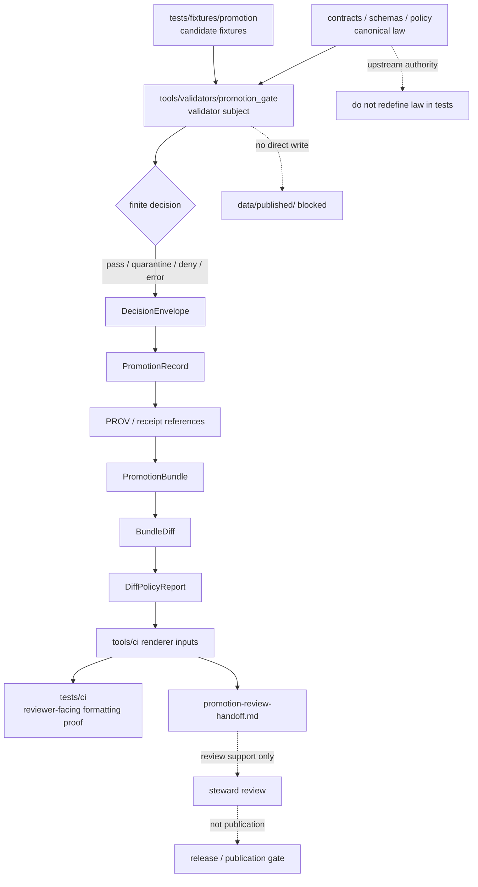

<!-- [KFM_META_BLOCK_V2]
doc_id: kfm://doc/NEEDS-VERIFICATION
title: validators
type: standard
version: v1
status: draft
owners: @bartytime4life
created: YYYY-MM-DD
updated: 2026-04-28
policy_label: public
related: [../README.md, ../../.github/README.md, ../../.github/CODEOWNERS, ../../.github/workflows/README.md, ../../tools/ci/README.md, ../../tools/attest/README.md, ../../tools/validators/promotion_gate/README.md, ../../contracts/README.md, ../../schemas/README.md, ../../policy/README.md, ../fixtures/promotion/, ../e2e/runtime_proof/README.md, ../ci/README.md, ./test_promotion_gate_e2e.py, ./test_bundle_diff_policy.py, ./test_validate_bundle_diff_policy.py, ../ci/test_render_promotion_review_handoff.py]
tags: [kfm, tests, validators, promotion, verification, fail-closed, diff-policy, review-handoff]
notes: [Draft revision for tests/validators/README.md; owner and policy label follow surfaced repo-facing drafts but should be rechecked against the active branch; doc_id UUID, created date, exact branch inventory, workflow enforcement, and any additional validator families remain NEEDS VERIFICATION.]
[/KFM_META_BLOCK_V2] -->

<a id="top"></a>

# validators

Validator- and gate-focused proof surface for KFM promotion decisions, derived trust objects, and adjacent fail-closed machine checks.

> [!IMPORTANT]
> **Status:** `experimental`  
> **Document status:** `draft`  
> **Owners:** `@bartytime4life` *(NEEDS VERIFICATION against active branch ownership rules)*  
> **Path:** `tests/validators/README.md`  
> **Repo fit:** child lane of [`../README.md`](../README.md); tests validator behavior for tools such as [`../../tools/validators/promotion_gate/`](../../tools/validators/promotion_gate/); stays downstream of [`../../contracts/`](../../contracts/), [`../../schemas/`](../../schemas/), and [`../../policy/`](../../policy/); stays separate from renderer proof in [`../ci/`](../ci/) and runtime proof in [`../e2e/`](../e2e/).  
> **Quick jumps:** [Scope](#scope) · [Repo fit](#repo-fit) · [Accepted inputs](#accepted-inputs) · [Exclusions](#exclusions) · [Current evidence snapshot](#current-evidence-snapshot) · [Directory tree](#directory-tree) · [Quickstart](#quickstart) · [Usage](#usage) · [Validator proof contract](#validator-proof-contract) · [Validator-to-review integration](#validator-to-review-integration-contract) · [Diagram](#diagram) · [Coverage matrix](#coverage-matrix) · [Review-path ladder](#review-path-coverage-ladder) · [Definition of done](#definition-of-done) · [FAQ](#faq) · [Appendix](#appendix)


> [!NOTE]
> `tests/validators/` is not a generic bucket for “harder tests.” In KFM, this lane proves that validators, gated decisions, derived trust objects, checked-in policy interpretations, and downstream review-path inputs behave **deterministically**, **fail closed**, and remain **review-visible** without silently publishing anything.

> [!WARNING]
> This README is conservative by design. Surfaced repo-facing drafts repeatedly reference promotion-gate validator tests, but the active checked-out branch inventory still needs re-verification before maintainers treat every path below as implemented.

---

## Scope

`tests/validators/` is the proof lane for validator-oriented behavior inside the broader `tests/` surface.

Use this lane when the subject under test is a validator or governed gate that must prove:

- finite machine outcomes
- schema-valid emitted objects
- explicit failure semantics
- stable negative-path behavior
- deterministic handling of checked-in policy expectations
- reviewer handoff inputs that remain subordinate to upstream truth
- downstream machine-artifact compatibility without re-owning renderer contracts

This lane is especially natural for the current promotion thin slice because the adjacent subject docs describe a validator chain that moves from candidate preparation to a `DecisionEnvelope`, then onward to promotion records, PROV, bundle outputs, prior/current bundle comparison, diff-policy classification, and reviewer-facing handoff artifacts.

### Truth labels used here

| Label | Meaning in this README |
| --- | --- |
| **CONFIRMED** | Directly supported by surfaced repo-facing documentation or stable KFM doctrine available to this revision |
| **INFERRED** | Strongly suggested by adjacent docs, but not freshly re-proven as checked-out lane inventory |
| **PROPOSED** | Recommended lane shape or future coverage pattern consistent with current KFM doctrine |
| **UNKNOWN** | Not surfaced strongly enough to describe as current repo fact |
| **NEEDS VERIFICATION** | Path, command, workflow wiring, owner, or implementation detail that must be rechecked against the active branch before merge |

[Back to top](#top)

---

## Repo fit

**Path:** `tests/validators/README.md`  
**Role:** directory README for validator- and gate-focused proof surfaces inside the governed `tests/` boundary.

| Direction | Surface | Why it matters |
| --- | --- | --- |
| Parent | [`../README.md`](../README.md) | `tests/` is the broader governed proof surface; this lane stays subordinate to that contract |
| Governance | [`../../.github/README.md`](../../.github/README.md) | caller, review-routing, and workflow boundary |
| Ownership | [`../../.github/CODEOWNERS`](../../.github/CODEOWNERS) | owner routing should be rechecked before merge |
| Workflow boundary | [`../../.github/workflows/README.md`](../../.github/workflows/README.md) | orchestration belongs there, not in test prose |
| Primary subject lane | [`../../tools/validators/promotion_gate/README.md`](../../tools/validators/promotion_gate/README.md) | current documented thin slice for promotion validator behavior |
| Renderer handoff | [`../../tools/ci/README.md`](../../tools/ci/README.md) | summaries and composed review handoff are rendered there; this lane proves validator behavior instead |
| Renderer proof neighbor | [`../ci/README.md`](../ci/README.md) | reviewer-facing Markdown and handoff rendering proof belongs there |
| Attestation neighbor | [`../../tools/attest/README.md`](../../tools/attest/README.md) | attestation state may be consumed here, but signing/verification logic lives elsewhere |
| Canonical law | [`../../contracts/README.md`](../../contracts/README.md), [`../../schemas/README.md`](../../schemas/README.md), [`../../policy/README.md`](../../policy/README.md) | tests validate against these surfaces; they do not silently replace them |
| Shared fixtures | [`../fixtures/promotion/`](../fixtures/promotion/) | stable candidate fixtures belong in fixture lanes, not copied ad hoc into validator tests |
| Adjacent runtime proof | [`../e2e/runtime_proof/README.md`](../e2e/runtime_proof/README.md) | request-time runtime behavior stays distinct from validator-lane proof |

### Working rule

Reach for `tests/validators/` when the change needs to prove **machine-checkable gate behavior**.

Do **not** reach for it when the change is really about:

- helper rendering only
- schema authority
- policy ownership
- runtime API behavior
- publication itself
- one-off shell orchestration

[Back to top](#top)

---

## Accepted inputs

Content that belongs here should remain **test-facing**, **repeatable**, and **safe to review**.

### Typical accepted inputs

- validator-ready candidate fixtures
- shared promotion fixtures from [`../fixtures/promotion/`](../fixtures/promotion/)
- declared schemas for emitted objects
- read-only policy inputs or compiled gate expectations
- machine outputs such as `decision.json`, promotion records, PROV docs, bundle manifests, bundle diffs, and diff-policy reports
- compact renderer inputs used only to prove downstream handoff compatibility
- deterministic negative-path fixtures that isolate one failure reason cleanly

### Accepted input profile

| Input family | Typical examples | Keep it here when |
| --- | --- | --- |
| Candidate fixtures | `../fixtures/promotion/*.json` | the test needs a stable, reviewable candidate |
| Schema surfaces | `../../schemas/promotion/*.schema.json` | the test validates emitted machine shape |
| Policy expectations | `../../policy/*.json`, policy test fixtures | the test asserts finite policy interpretation, not policy authorship |
| Validator outputs | `decision.json`, `promotion-bundle.json`, `promotion-bundle-diff.json` | the test proves machine state is valid and review-ready |
| Negative cases | invalid candidate, missing evidence, denied rights, sensitivity failure | the test proves fail-closed behavior without ambiguous causes |

[Back to top](#top)

---

## Exclusions

This lane must not become a hidden authority layer.

| Does **not** belong here | Put it here instead | Why |
| --- | --- | --- |
| Validator implementation | [`../../tools/validators/`](../../tools/validators/) | tests prove behavior; tools implement behavior |
| Policy source files | [`../../policy/`](../../policy/) | policy remains decision-sovereign and explicit |
| Schema or contract definitions | [`../../schemas/`](../../schemas/), [`../../contracts/`](../../contracts/) | tests validate chosen authority; they do not define it |
| Renderer Markdown assertions | [`../ci/`](../ci/) | reviewer-facing presentation belongs in CI proof |
| Runtime route proofs | [`../e2e/`](../e2e/) | request-time API behavior has a different proof burden |
| Publication logic | release / promotion surfaces | passing validator tests proves promotability, not publication |
| Secret-bearing or unpublished data | governed private data lanes | public test surfaces must remain safe to clone and review |
| Broad source ingestion fixtures | source-specific fixture lanes | validator tests should consume focused fixtures, not become source registries |

[Back to top](#top)

---

## Current evidence snapshot

| Evidence item | Status | How this README uses it |
| --- | --- | --- |
| `tests/validators/README.md` has surfaced as a repo-facing draft target | **CONFIRMED** | preserves its role, heading pattern, impact block style, and validator-proof language |
| `tests/validators/test_promotion_gate_e2e.py` is repeatedly referenced by adjacent promotion docs | **CONFIRMED via adjacent docs** | keeps the current center of gravity on promotion-gate proof |
| `test_bundle_diff_policy.py` and `test_validate_bundle_diff_policy.py` are referenced in fuller drafts | **INFERRED / NEEDS VERIFICATION** | includes them as documented thin-slice neighbors, not fresh branch inventory proof |
| `tests/ci/test_render_promotion_review_handoff.py` is referenced as adjacent renderer proof | **INFERRED / NEEDS VERIFICATION** | keeps rendering proof separate from validator proof |
| The promotion subject lane describes a chain from decision to record, PROV, bundle, diff, and review handoff | **CONFIRMED via adjacent docs** | justifies coverage beyond a single decision-envelope test |
| Broader validator families beyond promotion proof | **UNKNOWN** | avoids claiming additional validator coverage |
| Workflow merge-blocking enforcement | **NEEDS VERIFICATION** | docs name the intended boundary, not current branch protection |
| Active package manager / test runner | **UNKNOWN** | quickstart commands are command patterns, not verified current runner law |

> [!TIP]
> The discipline here is the same one KFM asks of the rest of the system: document the **smallest real thing** clearly, then show the growth path without upgrading possibility into fact.

[Back to top](#top)

---

## Directory tree

### Documented current thin slice

```text
tests/validators/
├── README.md
├── test_promotion_gate_e2e.py
├── test_bundle_diff_policy.py                 # NEEDS VERIFICATION
└── test_validate_bundle_diff_policy.py        # NEEDS VERIFICATION
```

> [!NOTE]
> This is the documented lane shape implied by surfaced validator docs. Re-run active-branch inventory before treating it as exhaustive.

### Adjacent subject and review surfaces

<details>
<summary><strong>Promotion-gate and review-path neighbors</strong></summary>

```text
tools/validators/promotion_gate/
├── prepare_candidate_fixture.py
├── promotion_gate.py
├── validate_decision_envelope.py
├── write_promotion_record.py
├── validate_promotion_record.py
├── emit_promotion_prov.py
├── validate_promotion_prov.py
├── write_promotion_bundle.py
├── validate_promotion_bundle.py
├── evaluate_bundle_diff_policy.py
├── validate_bundle_diff_policy.py
└── policies/*.rego

tools/ci/
├── render_promotion_summary.py
├── render_promotion_bundle_summary.py
├── render_diff_summary.py
├── render_bundle_diff_policy_summary.py
└── render_promotion_review_handoff.py

tools/attest/
├── sign_decision_envelope.py
└── verify_decision_envelope.py

tests/ci/
└── test_render_promotion_review_handoff.py
```

</details>

[Back to top](#top)

---

## Quickstart

Run these from the repository root after confirming the active branch contains the referenced files and runner configuration.

```bash
python -m pytest -q tests/validators/
```

Focused promotion-gate proof:

```bash
python -m pytest -q tests/validators/test_promotion_gate_e2e.py
```

Focused diff-policy proof:

```bash
python -m pytest -q \
  tests/validators/test_bundle_diff_policy.py \
  tests/validators/test_validate_bundle_diff_policy.py
```

Adjacent renderer-handoff proof belongs outside this lane:

```bash
python -m pytest -q tests/ci/test_render_promotion_review_handoff.py
```

> [!CAUTION]
> Do not turn quickstart commands into claims of current CI enforcement. Workflow wiring, required checks, and branch protection remain **NEEDS VERIFICATION** unless inspected directly.

[Back to top](#top)

---

## Usage

When adding or revising validator proof:

1. Identify the governed validator or gate under test.
2. Link the canonical contract, schema, and policy sources that define expected behavior.
3. Add the smallest valid fixture and the smallest invalid fixture needed to prove the rule.
4. Assert finite outcomes and reason codes, not vague success/failure text.
5. Assert emitted machine artifacts remain schema-valid.
6. Keep renderer wording, Markdown formatting, and steward-facing prose in `tests/ci/`.
7. Add a negative path before relying on a positive path.
8. Record every **UNKNOWN** or **NEEDS VERIFICATION** item in this README or the relevant backlog/register before merge.

A validator-lane test is strongest when it answers this question:

> “Could a steward or reviewer reconstruct exactly why the machine allowed, quarantined, denied, or errored without treating generated prose as truth?”

[Back to top](#top)

---

## Validator proof contract

Every validator-lane test should make the proof burden explicit.

| Proof requirement | Expected shape |
| --- | --- |
| Finite outcome | enum such as `pass`, `quarantine`, `deny`, `error`, or the lane-specific equivalent |
| Explicit reason | stable reason code or obligation list |
| Schema validity | emitted object validates against the declared schema |
| Fail-closed negative path | invalid, missing, restricted, or ambiguous input does not pass silently |
| No publication side effect | test does not write to `data/published/` or imply release |
| Review visibility | machine output can feed summary/handoff tools without becoming the source of truth |
| Deterministic identity | candidate identifiers, spec hashes, or equivalent anchors are stable when in scope |
| Boundary preservation | tests do not redefine schema, policy, publication, attestation, or renderer law |

### Common assertion targets

| Artifact | Why it matters | Typical proof |
| --- | --- | --- |
| `DecisionEnvelope` | finite decision and reason trail | validates against schema; denies unknown or unsupported candidates |
| `PromotionRecord` | reviewable state transition memory | contains candidate identity, decision, evidence pointers, and receipt references |
| `Promotion PROV` | provenance trace | remains machine-readable and linked to the candidate |
| `PromotionBundle` | bundled release candidate evidence | validates as a bundle without becoming publication |
| `PromotionBundleDiff` | prior/current drift | remains deterministic and machine-readable |
| `PromotionBundleDiffPolicy` | checked-in interpretation of drift | finite classification and review obligations |
| Reviewer inputs | downstream handoff readiness | enough machine state exists for renderer helpers without asserting Markdown prose here |

[Back to top](#top)

---

## Validator-to-review integration contract

This lane should prove not only that validator outputs are correct, but that they remain stable enough to feed the downstream governed review path without collapsing role boundaries.

### Expected downstream chain

For the current promotion thin slice, validator proof should remain compatible with this order:

1. promotion validator result
2. promotion bundle
3. prior/current bundle diff
4. bundle diff-policy report
5. CI renderer summaries
6. composed promotion review handoff

### What this lane should prove

| Concern | Proof burden here |
| --- | --- |
| validator outputs are finite | yes |
| emitted machine artifacts remain schema-valid | yes |
| prior/current bundle diff remains machine-readable | yes |
| checked-in diff-policy remains finite and reviewable | yes |
| downstream renderer inputs remain stable enough for composition | yes |
| renderer Markdown formatting details | no, that belongs in `tests/ci/` |

### Practical split with `tests/ci/`

Use the split intentionally:

- `tests/validators/` proves validator behavior and machine artifact compatibility.
- `tests/ci/` proves reviewer-facing rendering and composed handoff formatting.

### Minimal integration check pattern

A validator-facing integration test may safely assert:

- a promotion bundle is emitted or remains valid
- a bundle diff report exists in expected machine-readable form
- a diff-policy report exists in expected machine-readable form
- these outputs remain sufficient inputs for downstream renderer helpers

It should avoid asserting exact Markdown prose, heading order, or presentation wording from the CI lane.

[Back to top](#top)

---

## Diagram



[Back to top](#top)

---

## Coverage matrix

| Concern | Primary proof lane | Representative file or artifact | Status | Must prove |
| --- | --- | --- | --- | --- |
| Promotion decision correctness | `tests/validators/` | `test_promotion_gate_e2e.py` | **CONFIRMED via adjacent docs** | finite outcome, reason trail, schema-valid decision |
| Bundle creation / validation | `tests/validators/` | `promotion-bundle.json` and bundle validation test | **INFERRED** | bundle remains valid and review-ready |
| Bundle diff behavior | `tests/validators/` or adjacent validator proof | `promotion-bundle-diff.json` | **PROPOSED / NEEDS VERIFICATION** | prior/current drift is deterministic and machine-readable |
| Diff-policy validation | `tests/validators/` | `test_bundle_diff_policy.py`, `test_validate_bundle_diff_policy.py` | **INFERRED / NEEDS VERIFICATION** | checked-in policy interpretation stays finite and reviewable |
| Review handoff rendering | `tests/ci/` | `test_render_promotion_review_handoff.py` | **INFERRED / NEEDS VERIFICATION** | renderer output is readable; validator lane does not own prose |
| Attestation behavior | `tools/attest/` + tests when present | signed / verified envelopes | **PROPOSED / NEEDS VERIFICATION** | signing does not replace validator proof |
| Runtime request proof | `tests/e2e/` | runtime proof fixtures | **OUT OF SCOPE HERE** | API behavior is tested without weakening validator lane boundaries |

[Back to top](#top)

---

## Review-path coverage ladder

The current promotion thin slice is easiest to reason about when coverage is read as a ladder instead of one undifferentiated blob.

| Ladder step | Primary proof lane | Why |
| --- | --- | --- |
| validator result correctness | `tests/validators/` | finite machine decision belongs here |
| bundle validity | `tests/validators/` | release-candidate evidence must remain machine-valid |
| bundle diff correctness | `tests/validators/` or adjacent validator-proof surface | downstream review depends on stable machine drift |
| diff-policy correctness | `tests/validators/` | checked-in classification remains validator-facing |
| diff-summary rendering | `tests/ci/` | reviewer-facing Markdown belongs there |
| diff-policy-summary rendering | `tests/ci/` | reviewer-facing Markdown belongs there |
| promotion-review-handoff rendering | `tests/ci/` | composed steward-facing document belongs there |

### Rule of thumb

If a change breaks:

- machine meaning → prove it in `tests/validators/`
- reviewer presentation → prove it in `tests/ci/`

That split keeps the trust path inspectable instead of hiding everything under one broad “promotion test.”

[Back to top](#top)

---

## Definition of done

A `tests/validators/` change is ready for review when:

- [ ] The test subject is a validator or governed gate, not renderer prose or publication logic.
- [ ] The canonical contract, schema, or policy source is linked.
- [ ] At least one positive path and one negative path are covered when risk justifies both.
- [ ] Negative paths fail closed with stable reason codes or obligations.
- [ ] Emitted machine artifacts validate against the intended schema.
- [ ] Fixture data is safe to clone, review, and run without secrets.
- [ ] No live network call is required for the validator proof.
- [ ] No test writes to publication destinations or implies promotion is complete.
- [ ] Any renderer-facing proof is placed in `tests/ci/`, not hidden here.
- [ ] Any workflow or branch-protection claim is marked **NEEDS VERIFICATION** unless directly inspected.
- [ ] The README, related register, or backlog is updated if the validator family grows.

[Back to top](#top)

---

## FAQ

### Does a passing validator test publish anything?

No. A passing validator test proves that a candidate or derived trust object is valid enough for the next governed step. Publication remains a separate reviewed state transition.

### Can this lane test policy?

Yes, but carefully. `tests/validators/` may test policy **effects** over validator artifacts. It should not become the policy source or hide policy logic that belongs under `../../policy/`.

### Can this lane assert Markdown output?

Only when the Markdown is incidental to machine compatibility. Reviewer-facing formatting, headings, prose, and composed handoff documents belong in `../ci/`.

### Where do runtime API tests go?

Request-time API behavior belongs under `../e2e/` or another runtime-proof lane. `tests/validators/` should stay focused on validator outputs and gate behavior.

### What should happen when branch inventory disagrees with this README?

Prefer the active branch evidence. Update this README, preserve lineage where useful, and mark any stale path as superseded or removed rather than quietly pretending it still exists.

[Back to top](#top)

---

## Appendix

<details>
<summary><strong>Suggested active-branch inventory checks</strong></summary>

Run from the repository root before merging this README or relying on its path inventory.

```bash
find tests/validators -maxdepth 2 -type f | sort
find tests/ci -maxdepth 2 -type f | sort
find tools/validators/promotion_gate -maxdepth 2 -type f | sort
find tools/ci -maxdepth 2 -type f | sort
find schemas policy contracts -maxdepth 3 -type f | sort
```

Optional governance-oriented grep:

```bash
grep -RInE \
  "DecisionEnvelope|PromotionRecord|promotion-bundle|bundle-diff|diff-policy|review-handoff|fail.closed|fail-closed" \
  tests tools schemas policy contracts docs \
  2>/dev/null
```

</details>

<details>
<summary><strong>Boundary glossary</strong></summary>

| Term | Meaning here |
| --- | --- |
| **validator proof** | a repeatable test that proves a validator or gate emits correct machine-state outcomes |
| **renderer proof** | a test that proves reviewer-facing summaries or handoff documents render correctly |
| **promotion candidate** | a candidate for governed promotion; not a published object by itself |
| **DecisionEnvelope** | finite decision output with reason trail and policy-relevant state |
| **PromotionBundle** | grouped evidence / record material for promotion review |
| **BundleDiff** | prior/current comparison used to make drift visible |
| **DiffPolicyReport** | checked-in classification of bundle drift and review obligations |
| **review handoff** | steward-facing convenience artifact; never a substitute for underlying machine artifacts |

</details>

[Back to top](#top)
