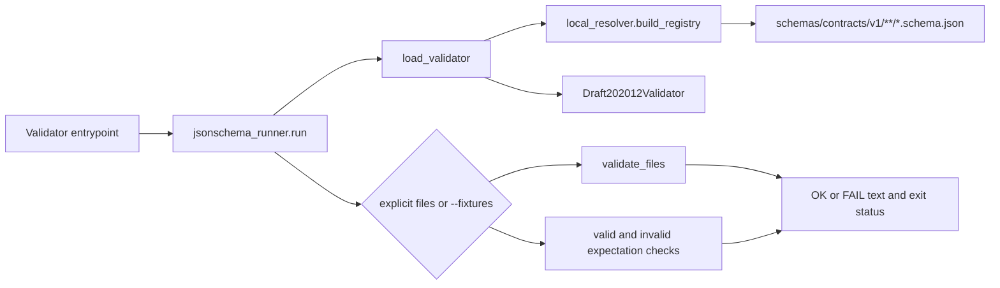

<!-- [KFM_META_BLOCK_V2]
doc_id: kfm://doc/tests-validators-readme
title: tests/validators/ — Validator Runtime, Entrypoint, and Fail-Closed Test Boundary
type: readme; directory-readme; validator-test-boundary; shared-runtime-tests; entrypoint-contract-tests
version: v0.2
status: draft; repository-grounded; direct-lane-readme-only; shared-validator-runtime-executable; five-entry-aggregate-ci-invoked; schema-fixture-tests-confirmed-elsewhere; dedicated-validator-unit-suite-not-established; coverage-partial; runner-contract-gaps-visible; no-network-by-default; fail-closed; non-authoritative
owners: OWNER_TBD — QA steward · Validator steward · Python tooling steward · Schema steward · Contract steward · Fixture steward · Policy steward · Evidence steward · Release steward · Security reviewer · CI steward · Domain stewards · Docs steward
created: 2026-07-07
updated: 2026-07-16
supersedes: v0.1 planning-oriented validator-test README
policy_label: public-doc; tests; validators; json-schema; entrypoints; fixtures; deterministic; no-network; fail-closed; coverage-aware; non-authoritative; correction-aware; rollback-aware
current_path: tests/validators/README.md
truth_posture: CONFIRMED target README and prior blob, canonical tests responsibility root, tools/validators implementation root, executable shared validator runtime under tools/validators/_common, local Draft 2020-12 schema registry, five hard-coded aggregate entrypoints, root Makefile schemas and test targets, schema-validation and validator-suite workflows, one explicit EvidenceBundle invalid-fixture canary, generic schema fixture tests, Hydrology alias tests, bounded exact-import inventory of seventeen validator scripts and two test modules, broader executable validators outside the aggregate, checked absence of representative direct tests/validators runner and test paths, and direct-lane README-only posture / PROPOSED dedicated helper unit tests, validator-entrypoint manifest, fixture polarity and nonempty assertions, deterministic structured result contract, stable exit-code and diagnostics contract, path and resource safety tests, full validator coverage map, dedicated CI artifact, required promotion dependency, correction tests, migration plan, and rollback drills / CONFLICTED parent tools/validators README uncertainty versus confirmed executable shared runtime; direct tests/validators ownership versus existing shape tests under tests/schemas; five-entry aggregate versus broader executable validator inventory; fixture-mode expected-invalid FAIL output versus successful aggregate exit; configured fail-closed intent versus empty fixture sets that can pass / UNKNOWN exhaustive validator and consumer inventory, ignored or generated tests, dynamic entrypoints, current total fixture count, current direct test count, pass rates, coverage, mutation score, flake rate, branch-protection requirements, production invocation, emitted ValidationReport objects, and release dependency / NEEDS VERIFICATION accepted owners, CODEOWNERS, stable public helper API, complete entrypoint registry, schema/contract/fixture bindings, reason-code vocabulary, artifact retention, CI ownership, resource budgets, package-extraction decision, deprecation window, and operational rollback execution
evidence_snapshot:
  repository: bartytime4life/Kansas-Frontier-Matrix
  repository_id: "1059091169"
  visibility: public
  base_ref: main
  base_commit: 52275a5710400a9f794a8fcf8e0945e0c21544e4
  target_prior_blob: e950df9fc3124c0f4a12b96dcb7f1e1b4c8859ce
  direct_lane_files_confirmed:
    - tests/validators/README.md
  checked_absent_paths:
    - tests/validators/conftest.py
    - tests/validators/test_validators.py
    - tests/validators/test_jsonschema_runner.py
    - tests/validators/pytest.ini
  adjacent_executable_surfaces:
    - tools/validators/_common/jsonschema_runner.py
    - tools/validators/_common/local_resolver.py
    - tools/validators/_common/run_all.py
    - tools/validators/validate_source_descriptor.py
    - tools/validators/validate_evidence_bundle.py
    - tools/validators/validate_runtime_response_envelope.py
    - tools/validators/validate_decision_envelope.py
    - tools/validators/validate_run_receipt.py
    - tools/validators/release/validate_promotion_decision.py
    - tests/schemas/test_common_contracts.py
    - tests/schemas/test_hydrology_alias_contracts.py
  execution_surfaces:
    - Makefile
    - .github/workflows/schema-validation.yml
    - .github/workflows/validator-suite.yml
  bounded_inventory_note: checked paths and bounded repository search establish only the inspected snapshot; historical, ignored, generated, branch-local, dynamically collected, package-local, domain-local, external, and uninspected tests or validators remain UNKNOWN
related:
  - ../README.md
  - ../schemas/README.md
  - ../contracts/README.md
  - ../fixtures/README.md
  - ../policy/README.md
  - ../release/README.md
  - ../schemas/test_common_contracts.py
  - ../schemas/test_hydrology_alias_contracts.py
  - ../../tools/validators/README.md
  - ../../tools/validators/_common/README.md
  - ../../tools/validators/_common/jsonschema_runner.py
  - ../../tools/validators/_common/local_resolver.py
  - ../../tools/validators/_common/run_all.py
  - ../../tools/validators/validate_source_descriptor.py
  - ../../tools/validators/validate_evidence_bundle.py
  - ../../tools/validators/validate_runtime_response_envelope.py
  - ../../tools/validators/validate_decision_envelope.py
  - ../../tools/validators/validate_run_receipt.py
  - ../../tools/validators/release/validate_promotion_decision.py
  - ../../pipelines/validate/README.md
  - ../../fixtures/contracts/v1/README.md
  - ../../docs/doctrine/directory-rules.md
  - ../../Makefile
  - ../../pyproject.toml
  - ../../.github/workflows/schema-validation.yml
  - ../../.github/workflows/validator-suite.yml
tags: [kfm, tests, validators, json-schema, pytest, fixtures, entrypoints, cli, exit-codes, diagnostics, no-network, fail-closed, coverage, correction, rollback]
notes:
  - "v0.2 replaces a planning-oriented validator-test guide with a commit-pinned account of the direct lane, working shared runtime, aggregate entrypoints, CI wiring, and known test gaps."
  - "The direct tests/validators lane is README-only in the bounded snapshot; no dedicated executable unit suite was established."
  - "Working validator code exists under tools/validators and is exercised by make schemas and two workflows; that execution must not be relabeled as direct tests/validators coverage."
  - "The current fixture runner prints expected invalid fixtures as FAIL during its first pass, then separately verifies that invalid fixtures fail and may return success."
  - "The current fixture mode does not assert that valid or invalid fixture sets are nonempty; an empty fixture family can therefore complete successfully."
  - "The aggregate runs five hard-coded top-level validators, while bounded search surfaced additional executable validators outside that list."
  - "This revision changes documentation only and creates no test, validator, fixture, schema, contract, policy, workflow behavior, data, receipt, proof, release record, runtime behavior, or public surface."
[/KFM_META_BLOCK_V2] -->

<a id="top"></a>

# `tests/validators/` — Validator Runtime, Entrypoint, and Fail-Closed Test Boundary

> **Purpose.** Define where KFM proves validator mechanics and validator entrypoints behave deterministically, reject unsupported inputs, preserve diagnostics, avoid side effects, and fail closed. A validator pass proves only the checks configured for the declared input and scope; it does not establish source authority, semantic truth, evidence closure, policy permission, release approval, publication, or production parity.

<p>
  
  
  
  
  
  
  
  
</p>

**Quick navigation:** [Status](#status-and-evidence-boundary) · [Purpose](#purpose-and-audience) · [Authority](#authority-and-repository-fit) · [Inventory](#confirmed-current-inventory) · [Runtime](#current-validator-runtime) · [Scope](#test-scope-and-non-scope) · [Routing](#placement-and-routing-law) · [Case contract](#minimum-validator-test-case-contract) · [Families](#required-test-families) · [Fixtures](#fixture-and-test-data-contract) · [Outcomes](#finite-outcomes-exit-codes-and-diagnostics) · [Determinism](#determinism-security-and-side-effects) · [Coverage](#coverage-zero-case-and-anti-tautology-controls) · [Execution](#current-execution-surfaces) · [CI](#ci-artifacts-and-promotion-boundary) · [Failures](#failure-interpretation) · [Passing](#what-passing-does-not-prove) · [Maintenance](#maintenance-and-fixture-update-rules) · [Done](#definition-of-done) · [Plan](#smallest-sound-implementation-sequence) · [Open](#open-verification-register) · [Evidence](#evidence-ledger) · [Rollback](#documentation-correction-and-rollback)

---

## Status and evidence boundary

> [!IMPORTANT]
> **Snapshot:** `main@52275a5710400a9f794a8fcf8e0945e0c21544e4`
> **Prior target blob:** `e950df9fc3124c0f4a12b96dcb7f1e1b4c8859ce`
> **Direct lane:** `tests/validators/README.md` only at the bounded snapshot
> **Checked absent:** `conftest.py`, `test_validators.py`, `test_jsonschema_runner.py`, and `pytest.ini`
> **Current `make test`:** runs `tests/schemas` and `tests/contracts`; it does not collect `tests/validators`
> **Current validator aggregate:** five hard-coded top-level entrypoints through `make schemas`

### Safe conclusion

`tests/validators/` is the correct responsibility lane for validator unit tests, shared-runtime tests, and validator-entrypoint contract tests. It is **not yet an established direct executable suite**.

The repository nevertheless contains working validator implementation and adjacent proof:

- `tools/validators/_common/local_resolver.py` builds a repository-local schema registry.
- `tools/validators/_common/jsonschema_runner.py` constructs Draft 2020-12 validators, validates explicit files, and supports fixture mode.
- `tools/validators/_common/run_all.py` invokes five hard-coded top-level validator scripts with `--fixtures` and stops on the first nonzero result.
- `make schemas` runs that aggregate.
- `.github/workflows/schema-validation.yml` runs `make schemas` on pushes and pull requests.
- `.github/workflows/validator-suite.yml` runs `make schemas` and separately confirms that one invalid EvidenceBundle fixture is rejected.
- `tests/schemas/test_common_contracts.py` exercises valid and invalid fixture polarity for selected schema families.
- `tests/schemas/test_hydrology_alias_contracts.py` exercises three domain alias validators through the shared loader.
- Bounded exact-import evidence records seventeen validator scripts and two test modules consuming the shared runner.
- Additional executable validators exist outside the five-entry aggregate, including release and MapLibre validator families.

These are meaningful implementation facts. They do **not** establish direct unit coverage for the shared helper branches, every entrypoint, every validator family, every fixture family, every exit code, or every diagnostic contract.

### Confirmed limitations

| Limitation | Current evidence | Consequence |
|---|---|---|
| No direct unit suite | Direct lane is README-only; representative runner/test paths are absent. | Helper branches and CLI behavior may change without focused tests. |
| Aggregate is hard-coded | `run_all.py` names five top-level wrappers. | Other executable validators may not run under `make schemas`. |
| Fixture mode prints expected invalids as `FAIL` | `validate_files()` evaluates valid and invalid files together before polarity checks. | Human logs can look failed while the process ultimately succeeds. |
| Empty fixture sets are accepted | Fixture mode has no nonempty valid/invalid assertion. | A missing or emptied fixture family can produce a green result. |
| `rc == 2` branch is unreachable from `validate_files()` | `validate_files()` returns only `0` or `1`. | The branch does not currently protect fixture mode as written. |
| No structured report | Current output is line-oriented `OK` / `FAIL` text and process status. | Stable machine interpretation and artifact review are not established. |
| Direct pytest and aggregate coverage differ | `make test` and `make schemas` execute different paths. | One green command cannot stand in for the other. |
| Broader validator inventory is not aggregated | Search surfaces release, domain, and MapLibre validators outside `run_all.py`. | Aggregate success is partial coverage, not complete validator proof. |

### Truth labels used here

| Label | Meaning in this README |
|---|---|
| `CONFIRMED` | Verified from repository files, executable code, workflow definitions, or bounded search at the pinned snapshot. |
| `PROPOSED` | A test, fixture, manifest, result format, command, CI gate, or migration not established as current implementation. |
| `CONFLICTED` | Current repository surfaces overlap or disagree in behavior, placement, claims, or coverage. |
| `UNKNOWN` | Not resolved from inspected evidence. |
| `NEEDS VERIFICATION` | Checkable, but not sufficiently verified to rely on for promotion or publication. |
| `DENY` | A prohibited authority or bypass interpretation. |

[Back to top](#top)

---

## Purpose and audience

This README is for:

- validator and Python tooling stewards;
- QA and fixture stewards;
- schema and contract stewards;
- domain maintainers authoring validator entrypoints;
- policy, evidence, release, correction, and rollback reviewers;
- CI maintainers deciding which validator checks matter for promotion;
- security reviewers evaluating path, resource, secret, network, and sensitive-data behavior.

The durable test question is:

> Can KFM prove that each validator and shared validator helper accepts supported inputs, rejects unsupported inputs, emits stable bounded diagnostics, preserves authority boundaries, has no unauthorized side effects, and cannot pass vacuously?

This lane should make validator behavior inspectable without moving implementation into `tests/` or treating validation as sovereign truth.

[Back to top](#top)

---

## Authority and repository fit

Directory Rules place executable checkers under implementation roots such as `tools/` or `pipelines/`, and enforceability proof under `tests/`. The existing path is therefore correctly placed and requires no move or new ADR for this documentation revision.

| Responsibility | Authority home | Role of `tests/validators/` |
|---|---|---|
| Validator implementation | `tools/validators/`, accepted packages, or owning pipeline/package roots | Exercise behavior; never duplicate implementation. |
| Shared validation pipeline support | `pipelines/validate/` | Test common pipeline validation behavior where implemented. |
| Validator unit and contract tests | `tests/validators/` | This lane. |
| Schema conformance tests | `tests/schemas/` | Own shape and fixture-schema assertions. |
| Semantic contract tests | `tests/contracts/` | Own semantic-contract assertions. |
| Policy behavior | `tests/policy/` and policy-owned tests | Own allow, restrict, hold, abstain, deny, and obligation behavior. |
| Domain validator behavior | `tests/domains/<domain>/`, package-local tests, or this lane when genuinely shared | Prefer the primary responsibility owner. |
| Cross-cutting reusable fixtures | `fixtures/` | Referenced; not copied here. |
| Test-local fixtures | `tests/fixtures/` | Small local examples only. |
| Machine shape | `schemas/` | Tested, not authored here. |
| Semantic meaning | `contracts/` | Tested, not redefined here. |
| Source registry and source authority | governed registry and control-plane homes | Synthetic references only. |
| Evidence, receipts, and proofs | governed evidence, receipt, and proof homes | Test-shaped examples only. |
| Release, correction, withdrawal, rollback | `release/` and accepted release roots | Tested, never decided here. |
| Runtime, API, UI, map, graph, and AI surfaces | accepted implementation roots | Downstream consumers; not test authority. |

> [!WARNING]
> `tests/validators/` must not become a second validator implementation root, schema mirror, contract mirror, policy bundle, fixture registry, source registry, evidence store, receipt store, release store, lifecycle store, generated-report archive, or public-serving path.

[Back to top](#top)

---

## Confirmed current inventory

### Direct lane

```text
tests/validators/
└── README.md
```

Checked representative paths did not establish:

```text
tests/validators/conftest.py
tests/validators/test_validators.py
tests/validators/test_jsonschema_runner.py
tests/validators/pytest.ini
```

This bounded map is not proof against ignored, generated, historical, branch-local, dynamically collected, package-local, domain-local, external, or uninspected tests.

### Shared runtime and aggregate

```text
tools/validators/_common/
├── README.md
├── jsonschema_runner.py
├── local_resolver.py
└── run_all.py
```

`run_all.py` currently invokes:

```text
tools/validators/validate_source_descriptor.py
tools/validators/validate_evidence_bundle.py
tools/validators/validate_runtime_response_envelope.py
tools/validators/validate_decision_envelope.py
tools/validators/validate_run_receipt.py
```

### Confirmed adjacent tests

| Test | Primary assertion | Why it is adjacent rather than direct lane coverage |
|---|---|---|
| `tests/schemas/test_common_contracts.py` | Selected schema families accept valid fixtures and reject invalid fixtures. | Primary authority is schema conformance and fixture polarity. |
| `tests/schemas/test_hydrology_alias_contracts.py` | Three Hydrology aliases accept one valid fixture each and reject added unknown properties. | Primary authority is domain schema alias behavior. |
| `validator-suite` invalid EvidenceBundle canary | One explicit invalid fixture must produce a nonzero validator result. | Workflow-level canary, not a unit suite for all helpers or validators. |

### Broader executable inventory

Bounded import search surfaced validator scripts beyond the five-entry aggregate, including:

- `tools/validators/release/validate_promotion_decision.py`;
- domain Hydrology wrappers;
- multiple MapLibre performance-governance validators;
- additional validator scripts importing the shared runner.

Do not infer that all such scripts are covered by `make schemas`, `make test`, or this direct lane.

[Back to top](#top)

---

## Current validator runtime

### Runtime flow



The diagram describes inspected code flow. It is not a claim that a rendered diagram was tested by repository tooling.

### Current helper behavior

| Surface | Confirmed behavior | Test requirement |
|---|---|---|
| `load_validator(schema_path)` | Reads JSON, builds local registry, constructs a Draft 2020-12 validator. | Test missing file, malformed schema, duplicate `$id`, unresolved `$ref`, dialect assumptions, and deterministic registry behavior. |
| `validate_files(validator, files)` | Parses each file, sorts errors by path, prints first error, returns `0` or `1`. | Test valid, invalid, malformed JSON, unreadable file, stable ordering, and bounded diagnostics. |
| explicit-file mode | Requires one or more files; no files returns `2`. | Pin the CLI contract and stderr text. |
| fixture mode | Collects JSON under `valid/` and `invalid/`, runs combined validation, then checks polarity. | Separate log semantics from expected polarity; require nonempty fixture sets. |
| aggregate mode | Runs five scripts sequentially and stops at first nonzero exit. | Test ordering, fail-fast behavior, missing scripts, subprocess errors, and coverage manifest drift. |

### Known fixture-mode conflict

The current fixture path does two different things:

1. validates **all** valid and invalid fixtures through `validate_files()`; then
2. separately confirms that valid fixtures have no errors and invalid fixtures have errors.

Expected-invalid files therefore produce `FAIL ...` lines during step 1 even when the overall fixture contract is satisfied and the process later returns `0`.

This is current behavior, not a recommended final output contract. Tests should pin it before any correction, then migrate deliberately to an explicit result model such as:

```text
VALID_PASS
INVALID_EXPECTED_FAILURE
UNEXPECTED_VALID_FAILURE
UNEXPECTED_INVALID_PASS
HARNESS_ERROR
```

The proposed vocabulary above is not current implementation and must not be presented as an accepted KFM outcome registry.

[Back to top](#top)

---

## Test scope and non-scope

### In scope

- shared schema registry and resolver unit tests;
- JSON Schema runner unit and CLI tests;
- aggregate runner unit and subprocess-contract tests;
- validator wrapper binding tests;
- valid and invalid fixture polarity;
- empty-fixture and zero-case rejection;
- stable exit codes, stdout, stderr, diagnostics, and reason codes;
- malformed JSON, missing files, missing schemas, duplicate `$id`, unresolved `$ref`, unsupported version, and exception behavior;
- no-network, filesystem, path, environment, secret, and side-effect controls;
- resource limits and pathological-input behavior where risk justifies it;
- entrypoint discovery or manifest completeness;
- validator-to-schema, validator-to-contract, validator-to-fixture, and validator-to-policy linkage checks;
- aggregate coverage and CI routing;
- correction, supersession, migration, and rollback behavior for validator contracts;
- public-safe sensitive fixture handling.

### Out of scope

- validator implementation code;
- canonical schema or contract authoring;
- policy evaluation logic unless testing a validator that wraps accepted policy inputs;
- source admission decisions;
- EvidenceBundle creation or evidence adequacy decisions;
- lifecycle promotion;
- release approval or publication;
- real source payloads, credentials, private endpoints, production logs, or exact sensitive locations;
- treating a test fixture or green check as evidence, truth, release state, or public permission;
- generated validation reports as authority records.

[Back to top](#top)

---

## Placement and routing law

Prefer the lane that owns the primary assertion.

| Primary assertion | Preferred test home |
|---|---|
| Shared JSON Schema helper behavior | `tests/validators/` |
| Validator wrapper binds correct schema and fixture root | `tests/validators/` or wrapper package tests |
| Schema accepts or rejects fixture shape | `tests/schemas/` |
| Contract meaning is correct | `tests/contracts/` |
| Policy allows, restricts, holds, abstains, or denies | `tests/policy/` |
| Source admission or source-role rule | `tests/source/` or owning connector/domain tests |
| Pipeline validation transition | `tests/pipelines/` or owning pipeline tests |
| Domain-specific validator semantics | `tests/domains/<domain>/` or package-local tests |
| Release validator semantics | `tests/release/` when the assertion is release governance; shared CLI mechanics may remain here |
| API or runtime boundary | application or runtime tests |
| UI trust-state validator | `tests/ui/` or component package tests |
| Cross-cutting validator runtime or entrypoint contract | `tests/validators/` |

A test belongs here only when validator mechanics, validator CLI behavior, or cross-cutting validator contracts are the primary subject. Do not move all “validation-related” tests here merely to centralize a topic.

[Back to top](#top)

---

## Minimum validator test case contract

Every substantive validator test should make its claim inspectable.

```text
ValidatorTestCase {
  case_id
  owner
  validator_id
  validator_path
  implementation_root
  mode                     # explicit-file | fixtures | aggregate | helper
  schema_refs[]
  contract_refs[]
  fixture_refs[]
  policy_refs[]
  input_class
  expected_exit_code
  expected_stdout[]
  expected_stderr[]
  expected_reason_codes[]
  expected_side_effects[]
  forbidden_side_effects[]
  network_posture
  filesystem_posture
  sensitivity_posture
  deterministic_controls
  negative_companion_ref
  correction_ref
  rollback_ref
}
```

This structure is **PROPOSED**. A repository-approved test manifest or dataclass may use different names, but it should preserve the same review questions.

### Required assertions

A validator test should state:

1. which implementation is under test;
2. which schema, contract, fixture, policy, or authority files are inputs;
3. what exact gate is exercised;
4. the expected finite process result;
5. the expected bounded diagnostic;
6. what side effects are allowed and forbidden;
7. whether the case is valid, invalid, denied, abstained, quarantined, or harness error;
8. what companion case prevents tautology;
9. what a pass does not prove;
10. how contract changes, corrections, and rollback are handled.

[Back to top](#top)

---

## Required test families

### Shared registry and resolver

| Family | Required behavior | Negative companion |
|---|---|---|
| schema registry builds | Valid local schema tree produces a registry. | Missing root, unreadable file, malformed schema. |
| duplicate `$id` rejected | Conflicting IDs fail visibly. | Distinct IDs load deterministically. |
| unresolved `$ref` rejected | Missing target cannot silently pass. | Local resolvable ref succeeds. |
| deterministic traversal | Same tree yields same registry and diagnostics. | Perturbed filesystem ordering does not change result. |
| no-network resolution | Remote fetch is never required in the default suite. | External-only ref fails closed or is explicitly unsupported. |

### JSON Schema runner

| Family | Required behavior | Negative companion |
|---|---|---|
| valid explicit file | Returns `0` and a bounded success line. | Invalid file returns nonzero. |
| invalid explicit file | Returns `1` and a bounded first-error diagnostic. | Valid file does not produce failure. |
| no explicit files | Returns `2` with clear stderr. | One valid file executes. |
| malformed JSON | Returns nonzero without traceback leakage or silent pass. | Well-formed JSON succeeds when shape-valid. |
| unreadable path | Returns nonzero with bounded path diagnostic. | Readable fixture succeeds. |
| stable error ordering | Multiple errors are ordered deterministically. | Input ordering changes do not alter selected first error. |
| exception containment | Expected parsing/resolution errors become bounded failures. | Programmer errors are not swallowed without visibility. |

### Fixture mode

| Family | Required behavior | Current gap |
|---|---|---|
| valid fixture polarity | Every `valid/*.json` must validate. | Covered indirectly; direct helper test absent. |
| invalid fixture polarity | Every `invalid/*.json` must fail validation. | Covered indirectly; logs label expected failures as `FAIL`. |
| nonempty valid set | At least one valid fixture is required when the family claims valid coverage. | Not currently asserted. |
| nonempty invalid set | At least one invalid fixture is required when the family claims fail-closed coverage. | Not currently asserted. |
| expected-error match | Invalid diagnostics match bounded expectations where specified. | Implemented in schema pytest harness, not shared CLI runner. |
| fixture-root missing | Missing root fails rather than passing empty globs. | Current fixture mode can pass. |
| mixed parse errors | Malformed fixture fails as harness error, not expected schema invalidity. | Direct contract not established. |

### Aggregate runner

| Family | Required behavior | Current gap |
|---|---|---|
| ordered invocation | Entry sequence is stable and reviewable. | Hard-coded list exists; direct test absent. |
| fail fast | First nonzero child stops aggregate and propagates status. | Code exists; direct subprocess test absent. |
| missing script | Aggregate fails clearly. | Not directly tested. |
| child signal/exception | Aggregate preserves a bounded failure result. | Not directly tested. |
| manifest completeness | Every validator intended for aggregate coverage is listed. | No accepted registry or coverage manifest. |
| exclusion rationale | Each executable validator outside the aggregate has a reason. | Not established. |
| zero-entry aggregate | Empty manifest cannot pass. | Not applicable to current hard-coded nonempty list, but should be guarded if refactored. |

### Entrypoint wrappers

| Family | Required behavior |
|---|---|
| schema binding | Wrapper points to the intended schema path. |
| fixture binding | Wrapper points to the intended fixture family. |
| repository root | Wrapper resolves paths independent of caller working directory where intended. |
| CLI propagation | Wrapper passes arguments and returns the shared runner status. |
| alias parity | Canonical and compatibility wrappers do not diverge silently. |
| no authority upgrade | Wrapper cannot convert schema pass into policy, evidence, release, or public permission. |

### Governed outcome cases

A mature validator-test portfolio should include examples for:

- valid supported input;
- invalid malformed or unsupported input;
- denied public use where a validator checks a deny precondition;
- abstained or held result where evidence/policy support is incomplete;
- quarantined lifecycle case where validation blocks progression;
- harness or internal error;
- stale or superseded schema/fixture/validator binding;
- correction and rollback case;
- sensitive input transformed to a public-safe fixture;
- missing dependency and unresolved reference;
- empty fixture family and zero collected cases.

Do not collapse governed business outcomes into pytest outcomes or process exit codes.

[Back to top](#top)

---

## Fixture and test data contract

### Fixture homes

| Home | Use | Guardrail |
|---|---|---|
| `fixtures/` | Reusable cross-cutting valid, invalid, golden, and snapshot fixtures. | Must remain non-authoritative and public-safe. |
| `tests/fixtures/` | Small fixtures local to a test area. | Must not become a parallel shared fixture registry. |
| tiny inline values | Minimal cases clearer inline than as files. | Avoid hiding full object semantics in test code. |

The current shared runner expects conventional schema fixture roots shaped like:

```text
fixtures/contracts/v1/<family>/<schema_name>/
├── valid/
│   └── valid_*.json
└── invalid/
    └── invalid_*.json
```

### Required fixture classes

| Class | Purpose |
|---|---|
| valid | Prove the configured gate accepts supported input. |
| invalid | Prove malformed or unsupported input fails. |
| denied | Prove a public or authority boundary cannot be bypassed where the validator owns that preflight. |
| abstained or held | Prove incomplete support does not become a pass. |
| quarantined | Prove lifecycle-blocked input remains outside processed/public readiness. |
| error | Prove harness, dependency, parse, or internal failures are distinguishable from expected invalidity. |
| correction | Prove corrected bindings or fixtures supersede prior ones visibly. |
| rollback | Prove a validator contract can be restored without rewriting shared history. |

### Rights and sensitivity

Validator fixtures must be:

- synthetic or legally reusable;
- public-safe for repository visibility;
- stripped of credentials, tokens, private endpoints, unpublished source payloads, and production logs;
- generalized or transformed for exact-location, archaeology, rare species, infrastructure, living-person, DNA/genomic, private parcel, or culturally sensitive cases;
- reviewed under the most restrictive applicable posture;
- clearly labeled as fixtures rather than source truth or evidence.

[Back to top](#top)

---

## Finite outcomes, exit codes, and diagnostics

### Current process contract

| Result | Current meaning | Boundary |
|---|---|---|
| exit `0` | Configured validation or fixture polarity completed successfully. | Does not prove semantic truth, evidence, policy, release, or publication. |
| exit `1` | One or more explicit files failed, a fixture polarity expectation failed, or a child validator returned nonzero. | Exact reason taxonomy is not formally standardized. |
| exit `2` | Explicit-file mode was called without files. | Current fixture-mode `rc == 2` guard is not reachable through `validate_files()`. |
| stdout `OK <file>` | Explicit file produced no schema errors. | Not a governed approval record. |
| stdout `FAIL <file>: <message>` | Explicit file or combined fixture pass produced an error or exception. | Expected-invalid fixtures also generate this text in current fixture mode. |

### Separate vocabularies

Do not conflate:

- **test framework:** pass, fail, error, skip, xfail;
- **process contract:** exit `0`, `1`, `2`;
- **validator finding:** valid, invalid, harness error, missing dependency, unsupported version;
- **runtime:** `ANSWER`, `ABSTAIN`, `DENY`, `ERROR`;
- **policy:** accepted PolicyDecision vocabulary and obligations;
- **lifecycle:** RAW, WORK, QUARANTINE, PROCESSED, CATALOG/TRIPLET, PUBLISHED;
- **release:** proposed, held, approved, released, corrected, superseded, withdrawn, or accepted repository vocabulary.

A future structured validator result should be schema-backed, versioned, deterministic, and explicit about whether it is a checker result, policy result, lifecycle result, or release result.

### Diagnostic requirements

Diagnostics should be:

- deterministic for the same input and repository state;
- bounded in length;
- free of secrets and sensitive payloads;
- explicit about validator identity, schema, file, and failure class;
- stable enough for tests without freezing incidental library wording unnecessarily;
- capable of distinguishing expected invalidity from harness failure;
- machine-readable when used as a CI artifact;
- subordinate to canonical schemas, contracts, policy, evidence, and release records.

[Back to top](#top)

---

## Determinism, security, and side effects

### Default controls

- No network access.
- No live API, tile, model, vendor, database, or source calls.
- No production credentials or secret-manager access.
- No writes to canonical stores, lifecycle roots, registry authority, evidence/proof roots, release roots, or public artifact roots.
- Temporary output only under test-owned temporary directories.
- Fixed fixture bytes, locale, timezone, and clock where relevant.
- Stable traversal and diagnostic ordering.
- Bounded file size, nesting, collection size, and runtime where risk justifies controls.
- No shell interpretation of fixture-controlled strings.
- No path escape outside repository/test roots.
- No publication, promotion, correction, withdrawal, or rollback action.

### Required security cases

| Risk | Test expectation |
|---|---|
| path traversal | Reject or safely contain `../`, absolute paths, symlink escapes, and unexpected roots. |
| oversized JSON | Fail predictably within resource budgets. |
| deeply nested object | Avoid uncontrolled recursion or memory use. |
| malicious `$ref` | No default remote fetch; unresolved or disallowed target fails closed. |
| secret leakage | Diagnostics do not echo token-shaped or credential values. |
| sensitive geometry | Tests use transformed examples and do not emit exact protected coordinates. |
| canonical-store writes | Filesystem assertions prove no mutation outside approved temporary roots. |
| subprocess injection | Aggregate and wrappers use explicit argument arrays and trusted script paths. |

[Back to top](#top)

---

## Coverage, zero-case, and anti-tautology controls

A validator suite is not meaningful merely because its command exits `0`.

### Required non-vacuity checks

- At least one test is collected for every declared direct test module.
- Every fixture family claiming valid coverage contains at least one valid fixture.
- Every fixture family claiming fail-closed coverage contains at least one invalid fixture.
- Every aggregate entrypoint resolves to a file.
- Every aggregate entrypoint has fixture coverage or an explicit exclusion.
- Every executable validator outside the aggregate has an owner and coverage posture.
- A deliberately invalid canary fails.
- A deliberately valid canary succeeds.
- Skips, xfails, empty globs, missing directories, and TODO-only steps are reported, not hidden.
- Coverage artifacts distinguish implemented, exercised, excluded, and unknown validators.

### Paired controls

| Positive assertion | Required companion |
|---|---|
| valid fixture succeeds | same object with one material violation fails |
| local `$ref` resolves | missing or disallowed ref fails |
| aggregate succeeds | one child forced nonzero propagates failure |
| wrapper binds schema | wrong or missing schema is detected |
| fixture mode succeeds | empty fixture root and malformed fixture fail |
| diagnostic is stable | sensitive or unbounded content is redacted/bounded |
| no side effects | attempted forbidden write is detected |

### Proposed coverage manifest

```text
ValidatorCoverageEntry {
  validator_id
  implementation_path
  owner
  aggregate_membership
  schema_refs[]
  contract_refs[]
  fixture_roots[]
  direct_test_paths[]
  workflow_refs[]
  valid_cases
  invalid_cases
  error_cases
  side_effect_cases
  sensitive_cases
  correction_cases
  rollback_cases
  status
  exclusions[]
}
```

This is a proposed review artifact, not current repository implementation.

[Back to top](#top)

---

## Current execution surfaces

### Confirmed commands

Run the five-entry aggregate:

```bash
make schemas
```

Run the aggregate directly:

```bash
python tools/validators/_common/run_all.py
```

Run one wrapper in fixture mode:

```bash
python tools/validators/validate_evidence_bundle.py --fixtures
```

Run one explicit valid or invalid file:

```bash
python tools/validators/validate_evidence_bundle.py \
  fixtures/contracts/v1/evidence/evidence_bundle/valid/valid_1.json

python tools/validators/validate_evidence_bundle.py \
  fixtures/contracts/v1/evidence/evidence_bundle/invalid/invalid_1.json
```

Run current schema and contract pytest coverage:

```bash
python -m pytest tests/schemas tests/contracts -q
```

### Proposed direct-lane command

```bash
python -m pytest tests/validators -q
```

The direct-lane command is **PROPOSED** until executable tests exist and collection is verified. Do not publish it as a current successful command.

### Command distinctions

| Command | Current coverage |
|---|---|
| `make schemas` | Five hard-coded validator wrappers in fixture mode. |
| `make test` | Pytest under `tests/schemas` and `tests/contracts`. |
| `make validate` | Runs `make schemas` followed by `make test`. |
| `validator-suite` workflow | `make schemas` plus one invalid EvidenceBundle canary. |
| `schema-validation` workflow | `make schemas`. |
| proposed `pytest tests/validators` | No direct suite established. |

[Back to top](#top)

---

## CI artifacts and promotion boundary

### Current workflows

| Workflow | Current behavior | What it does not prove |
|---|---|---|
| `schema-validation` | Installs the project and runs `make schemas`. | Complete validator inventory, direct helper tests, or promotion dependency. |
| `validator-suite` | Runs `make schemas` and confirms one invalid EvidenceBundle is rejected. | Every invalid fixture, every helper branch, every entrypoint, or complete fail-closed behavior. |
| `contracts-validate` | Runs `make test`. | Direct validator-unit coverage because `make test` omits this lane. |

### Required CI graduation

Before claiming a mature validator test lane, CI should:

1. collect direct validator tests and fail on zero tests;
2. run helper unit tests;
3. run wrapper binding tests;
4. validate a versioned entrypoint coverage manifest;
5. require nonempty valid and invalid fixture sets where declared;
6. execute aggregate success and forced-failure cases;
7. distinguish expected invalid fixtures from harness failures;
8. test no-network and forbidden side effects;
9. upload a bounded machine-readable test report;
10. expose skips, exclusions, flakes, and untested validators;
11. record correction and rollback posture;
12. become promotion-significant only through an explicit governed decision.

Workflow presence does not prove branch-protection significance or release dependency. Those remain `UNKNOWN` until ruleset or release-gate evidence is inspected.

[Back to top](#top)

---

## Failure interpretation

| Failure | Interpret as | Do not interpret as |
|---|---|---|
| helper unit test failure | Shared validator mechanics changed or are broken for the tested case. | Proof that source data or all domain claims are false. |
| wrapper binding failure | Schema, fixture, path, or argument binding drifted. | Automatic policy denial or release withdrawal. |
| valid fixture rejected | Contract/schema/fixture/validator alignment is broken or the fixture is stale. | Evidence that all real records are invalid. |
| invalid fixture accepted | Fail-closed coverage regressed for that case. | Permission to continue with publication. |
| empty fixture family | Coverage contract is missing or broken. | A clean pass. |
| aggregate child failure | One covered validator failed; remaining children may be unexecuted. | A complete inventory result. |
| unresolved `$ref` | Local schema closure is incomplete for the test. | Permission to fetch arbitrary remote schemas. |
| harness error | Test infrastructure failed. | Expected business invalidity. |
| CI failure | The checked branch did not satisfy that workflow. | Automatic production rollback unless governed release policy says so. |

Failures should preserve the candidate, fixtures, logs, and exact repository state needed for review while avoiding secret or sensitive-data leakage.

[Back to top](#top)

---

## What passing does not prove

A passing validator test or workflow does **not** prove:

- that every validator was discovered;
- that every helper branch was exercised;
- that fixture sets were nonempty unless asserted;
- that a schema is semantically correct;
- that a contract is complete;
- that a source is authoritative;
- that rights or sensitivity allow the requested use;
- that an EvidenceRef resolves to adequate EvidenceBundle support;
- that policy evaluated or approved the use;
- that lifecycle promotion occurred;
- that a release was approved, published, or deployed;
- that corrections and rollback were operationally executed;
- that production uses the same code, configuration, fixtures, or schema versions;
- that branch protection requires the check;
- that public clients may access canonical or internal stores;
- that AI-generated language is supported or authoritative.

Validation is one trust-spine gate. It does not collapse the gates around it.

[Back to top](#top)

---

## Maintenance and fixture-update rules

When validator code, schemas, contracts, fixture roots, diagnostics, or CLI behavior changes:

1. identify the owning validator and responsibility root;
2. update direct helper or entrypoint tests before changing shared behavior;
3. preserve or intentionally version exit codes and diagnostic contracts;
4. update valid, invalid, error, denied, abstained/held, quarantined, correction, and rollback cases where applicable;
5. require nonempty fixture polarity;
6. update aggregate membership or record an exclusion;
7. update schema, contract, policy, and fixture references without creating parallel authority;
8. run direct unit tests, aggregate validators, schema tests, and relevant domain/release tests;
9. inspect workflow artifacts and skipped cases;
10. document compatibility, deprecation, correction, and rollback;
11. keep sensitive fixtures public-safe;
12. never rewrite historical evidence to hide a validator regression.

### Shared-runtime review burden

Changes to `_common` helper signatures, output text, exit codes, registry behavior, file ordering, path handling, or exception behavior require broader review because many validator scripts and tests import the shared runner.

At minimum, review should include:

- validator steward;
- schema steward;
- test/fixture steward;
- Python tooling steward;
- security reviewer;
- CI steward;
- affected domain, evidence, policy, or release steward where behavior changes.

[Back to top](#top)

---

## Definition of done

The validator test lane is mature enough to claim direct executable coverage only when:

- [ ] direct test modules exist under an accepted home;
- [ ] the direct command collects a nonzero case count;
- [ ] shared resolver and runner branches are covered;
- [ ] explicit-file and fixture modes are covered;
- [ ] exit codes and diagnostics are versioned or pinned deliberately;
- [ ] expected invalid fixtures are distinguishable from harness failures;
- [ ] valid and invalid fixture sets cannot be empty silently;
- [ ] aggregate ordering, fail-fast behavior, missing scripts, and child failures are covered;
- [ ] a validator entrypoint registry or coverage manifest exists;
- [ ] validators outside the aggregate have explicit coverage or exclusions;
- [ ] schema, contract, fixture, and policy bindings are checked;
- [ ] no-network, path, resource, secret, sensitive-data, and side-effect tests pass;
- [ ] CI emits a reviewable machine artifact;
- [ ] skipped, xfailed, excluded, and unknown coverage is visible;
- [ ] correction, migration, deprecation, and rollback paths are tested;
- [ ] human owners and CODEOWNERS are accepted;
- [ ] promotion significance is explicitly governed rather than inferred from a green workflow.

[Back to top](#top)

---

## Smallest sound implementation sequence

### Phase 1 — Pin shared helper behavior

Add direct tests for:

- local registry creation;
- duplicate `$id` handling;
- local `$ref` resolution;
- explicit-file valid, invalid, malformed, unreadable, and no-file cases;
- deterministic error ordering;
- fixture polarity;
- current output and exit codes.

### Phase 2 — Fix non-vacuity and result semantics

Add tests first, then correct implementation so:

- fixture roots must exist;
- declared valid and invalid sets must be nonempty;
- expected invalid fixtures are not logged as generic unexpected failures;
- harness errors are distinct from expected invalidity;
- dead or unreachable branches are removed or made meaningful;
- output is deterministic and optionally machine-readable.

### Phase 3 — Test aggregate behavior

Cover:

- stable order;
- fail fast;
- missing entrypoint;
- child nonzero propagation;
- subprocess launch failure;
- empty manifest protection;
- entrypoint manifest drift.

### Phase 4 — Cover wrappers and broader validators

Build a manifest of executable validators, then add binding and fixture tests for:

- the five current aggregate wrappers;
- release validators;
- domain wrappers;
- MapLibre validators;
- compatibility/alias paths;
- validators intentionally excluded from aggregate runs.

### Phase 5 — Graduate CI

Add a substantive direct validator-test workflow, upload a bounded coverage/result artifact, expose exclusions and skips, and connect it to promotion only after governance acceptance.

Each phase should be a small, reversible PR with clear rollback and no authority collapse.

[Back to top](#top)

---

## Open verification register

| ID | Question | Status | Suggested owner |
|---|---|---|---|
| VAL-TST-001 | Who owns `tests/validators/` and its CODEOWNERS rule? | NEEDS VERIFICATION | QA + Validator steward |
| VAL-TST-002 | Should direct validator tests remain here or live package-locally with a parent index here? | NEEDS VERIFICATION | Repository architecture + Validator steward |
| VAL-TST-003 | What is the complete executable validator inventory? | UNKNOWN | Validator steward |
| VAL-TST-004 | Which validators are intended members of `make schemas`? | NEEDS VERIFICATION | Schema + Validator + CI stewards |
| VAL-TST-005 | Which executable validators are intentionally excluded, and why? | UNKNOWN | Validator owners |
| VAL-TST-006 | Is the shared helper API internal, compatibility-sensitive, or versioned public API? | UNKNOWN | Python tooling steward |
| VAL-TST-007 | What stable exit-code contract is accepted? | NEEDS VERIFICATION | Validator + CLI stewards |
| VAL-TST-008 | What stable diagnostic and reason-code vocabulary is accepted? | NEEDS VERIFICATION | Validator + Contracts stewards |
| VAL-TST-009 | Should fixture mode emit structured results? | PROPOSED / NEEDS VERIFICATION | Validator + CI stewards |
| VAL-TST-010 | Must every fixture family include both valid and invalid cases? | NEEDS VERIFICATION | Fixture + Schema stewards |
| VAL-TST-011 | How should empty or missing fixture families fail? | NEEDS VERIFICATION | Validator + Fixture stewards |
| VAL-TST-012 | Which schemas, contracts, fixtures, and policy refs pair with every entrypoint? | UNKNOWN | Object-family owners |
| VAL-TST-013 | What path and resource budgets are required? | NEEDS VERIFICATION | Security + Python tooling stewards |
| VAL-TST-014 | Which sensitive fixture classes require extra review? | NEEDS VERIFICATION | Sensitivity + Domain stewards |
| VAL-TST-015 | What machine-readable CI artifact and retention policy are accepted? | NEEDS VERIFICATION | CI + QA stewards |
| VAL-TST-016 | Are validator workflows required checks under branch protection? | UNKNOWN | Repository administrator |
| VAL-TST-017 | Does any release gate depend on validator-suite or schema-validation? | UNKNOWN | Release steward |
| VAL-TST-018 | Is the proposed schema-registry package extraction accepted? | UNKNOWN | Architecture + Schema stewards |
| VAL-TST-019 | What migration and deprecation window protects current imports? | NEEDS VERIFICATION | Python tooling + Consumer owners |
| VAL-TST-020 | Have correction and rollback drills been executed for shared helper changes? | UNKNOWN | QA + Release stewards |

[Back to top](#top)

---

## Evidence ledger

| Evidence | Status | Supports | Limits |
|---|---|---|---|
| Prior `tests/validators/README.md` | CONFIRMED | Existing lane intent, scope, anti-authority posture, and planning baseline. | Did not verify current implementation. |
| `tests/README.md` | CONFIRMED | Canonical tests root and validator-unit-test placement. | Parent still marks executable depth generally unresolved. |
| `tools/validators/README.md` | CONFIRMED | Validator implementation root and broad routing map. | Parent metadata understates now-verified executable shared runtime. |
| `tools/validators/_common/README.md` | CONFIRMED | Current implementation inventory, consumer count, workflows, and known conflicts. | Documentation is not a substitute for direct tests. |
| `jsonschema_runner.py` | CONFIRMED executable | Explicit-file and fixture-mode behavior, output, and exit paths. | No direct unit suite established. |
| `local_resolver.py` | CONFIRMED executable by adjacent README evidence | Local schema registry behavior. | Not directly reprinted or exhaustively tested in this revision. |
| `run_all.py` | CONFIRMED executable | Five-entry hard-coded aggregate and fail-fast subprocess behavior. | Not complete validator inventory. |
| five top-level wrappers | CONFIRMED through aggregate and files/search | Concrete schema/fixture bindings. | Wrapper-by-wrapper direct tests not established. |
| release promotion validator | CONFIRMED executable | Additional validator outside the aggregate. | One example does not exhaust broader inventory. |
| `tests/schemas/test_common_contracts.py` | CONFIRMED executable test code | Valid/invalid schema fixture polarity for selected families. | Shape coverage, not shared runtime unit coverage or complete inventory. |
| `tests/schemas/test_hydrology_alias_contracts.py` | CONFIRMED executable test code | Three domain alias positive/strictness cases. | Narrow domain coverage. |
| `Makefile` | CONFIRMED | `make schemas`, `make test`, and `make validate` routing. | Target names do not prove completeness. |
| `schema-validation.yml` | CONFIRMED | CI runs `make schemas`. | No direct validator-unit pytest. |
| `validator-suite.yml` | CONFIRMED | Aggregate plus one invalid EvidenceBundle canary. | One canary is not broad fail-closed coverage. |
| `pipelines/validate/README.md` | CONFIRMED boundary | Separates shared pipeline validation implementation from tests and authority roots. | Implementation depth under that lane remains mixed. |
| Directory Rules | CONFIRMED doctrine | Responsibility-root placement and no-parallel-authority rule. | Does not establish test completeness. |
| Checked absent direct files | CONFIRMED for exact paths | Representative direct runner/test files were not present. | Does not prove permanent or exhaustive absence. |

[Back to top](#top)

---

## No-loss assessment

The v0.1 README's strongest material is preserved and expanded:

- validator tests remain under `tests/`, while implementation remains under `tools/validators/` or accepted implementation roots;
- supported and unsupported cases must be paired;
- tests remain deterministic, synthetic, no-network, and fail-closed;
- missing schemas, unresolved refs, malformed payloads, unsupported versions, and boundary gaps must fail visibly;
- validator success does not imply evidence closure, policy approval, release approval, catalog truth, or publication;
- fixtures remain outside this test lane;
- reason codes and diagnostics remain reviewable;
- source, lifecycle, evidence, policy-input, receipt, proof, and release-preflight validator families remain in scope when validator behavior is the primary assertion.

The revision removes only unsupported planning assumptions and schematic filenames, replacing them with verified current implementation, explicit conflicts, bounded proposals, and current commands.

[Back to top](#top)

---

## Documentation correction and rollback

### Documentation correction

If evidence in this README becomes stale:

1. pin the correcting repository state;
2. identify the incorrect claim and supporting file or workflow;
3. update truth labels and evidence references;
4. preserve the previous version through normal Git history;
5. update related parent/child README links where necessary;
6. do not rewrite validator history, fixture history, or workflow outcomes to make prior claims appear correct.

### Rollback

Before merge, close the review branch or restore prior blob:

```text
e950df9fc3124c0f4a12b96dcb7f1e1b4c8859ce
```

After merge, revert the documentation commit through a reviewed pull request. Do not reset shared history.

Because this revision changes documentation only, rollback requires no validator, schema, contract, fixture, policy, data, evidence, receipt, proof, release, runtime, deployment, or production action.

[Back to top](#top)
