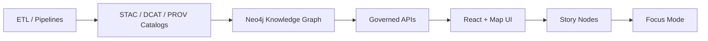

# 🧪🌐 KFM Web Test Suite (`tests/web`)


> **Purpose:** This folder houses automated tests for the **Kansas Frontier Matrix (KFM)** web experience: the **React + map UI**, **timeline/story mode**, and **Focus Mode (AI assistant)** — with a hard requirement that **anything shown to a user is traceable to governed evidence** 🧾🗺️

---

## ✨ What “good” looks like here

KFM isn’t “just a web app.” It’s a **provenance-first** geospatial + historical knowledge system. That means our web tests must validate:

- **UI correctness** ✅ (components, flows, interactions)
- **Map correctness** 🗺️ (layers, timeline, feature selection, rendering stability)
- **Evidence-first behavior** 🧾 (citations/metadata always present + clickable)
- **Governed narrative rendering** 📖 (Story Nodes: Markdown + front-matter)
- **Security + safety** 🛡️ (no unsafe rendering, no injection through narrative content)
- **Accessibility** ♿ (keyboard, contrast, focus, ARIA where relevant)
- **Performance budgets** ⚡ (fast enough to *explore*—not just load)

---

## 🧭 Quick links

- 📁 UI source: `web/`
- 🧪 You are here: `tests/web/README.md`
- 📚 Governed story content: `docs/reports/story_nodes/` (draft + published)
- 🗂️ Catalogs: `data/stac/`, `data/catalog/dcat/`, `data/prov/`
- 🧠 Graph: `src/graph/` (Neo4j)
- 🔌 API boundary: `src/server/` (contract-first APIs)

> If your paths differ, keep the **contracts** the same: the tests should still validate the same user-facing guarantees.

---

## 🧱 Test philosophy (KFM-flavored)

### 1) Evidence-first assertions 🧾
Every UI element that communicates a claim must expose:
- **Source identity** (dataset ID / record ID / doc reference)
- **Provenance link** (lineage / “how created”)
- **License/use constraints** (when applicable)
- **Timestamp / version** (so results are auditable)

### 2) Respect the canonical pipeline 🔁
We don’t test “shortcuts.” The UI should represent the pipeline:



✅ Tests should validate the UI is consuming **cataloged, contracted outputs** — not hidden/handwavy data.

### 3) Clean boundaries = testable boundaries 🧩
KFM’s layered architecture (domain → service → integration → infrastructure) is a feature: it gives us stable seams to mock, isolate, and test.

---

## 🚀 Running the web tests locally

> These commands are intentionally **tool-agnostic**. This repo may use Playwright, Cypress, or another runner — the goal is consistent execution.

### ✅ Prereqs
- Node.js (LTS recommended)
- A running KFM UI (`web/`) + API (`src/server/`) **or** a mocked/stubbed environment

### 🧰 Typical setup (Playwright style)
```bash
# from repo root
npm ci

# install browsers (if using Playwright)
npx playwright install --with-deps
```

### ▶️ Run tests
```bash
# smoke / fast
npm run test:web

# interactive UI runner (if supported)
npm run test:web:ui

# update snapshots (if used)
npm run test:web:update
```

### 🌎 Environment variables (suggested)
Create a `.env.test` or CI secrets:

```bash
KFM_BASE_URL=http://localhost:3000
KFM_API_URL=http://localhost:8000

# optional auth (if your UI needs it)
KFM_TEST_USER_EMAIL=test@example.com
KFM_TEST_USER_PASSWORD=********

# test behavior
KFM_TEST_SEED=1337
KFM_RECORD_TRACES=1
```

---

## 🗂️ Recommended folder layout

```text
tests/web/
  📄 README.md                     👈 you are here
  ⚙️ runner.config.(ts|js)          # playwright/cypress/webdriver config
  🧪 e2e/                           # end-to-end user journeys
  🧩 component/                     # component-level tests (optional)
  🧰 utils/                         # shared helpers (selectors, waits, seeds)
  🧱 fixtures/                      # deterministic test data + contracts
  🛰️ mocks/                         # API mocks (MSW/route interception)
  🖼️ snapshots/                     # visual baselines (if used)
  📊 reports/                       # html reports, traces, screenshots
```

---

## 🧪 Test types & what they protect

| Layer | What we test | Why it matters |
|------:|--------------|----------------|
| ✅ Unit | pure functions (formatters, selectors, validators) | fast feedback + stable |
| 🧩 Component | rendering + interaction | confidence in UI building blocks |
| 🔌 Contract | API schema + catalog integrity | stops silent breaking changes |
| 🌐 E2E | real journeys across UI + API | protects the real user experience |
| ♿ A11y | keyboard nav + ARIA patterns | KFM is for everyone |
| ⚡ Perf | load + interaction budgets | maps must stay interactive |
| 🛡️ Security | safe rendering + input handling | trust requires safety |

---

## 🗺️ Geospatial UI: “special sauce” test patterns

### ✅ Deterministic map checks
Map rendering can be nondeterministic across GPUs/browsers. Prefer:

- **State assertions** over pixel-perfect diffs  
  (example: which layers are enabled, current time slice, selected feature ID)
- **Loose visual diffs** only for critical map styles

### ✅ Map interactions to cover
- Pan / zoom / reset view
- Layer toggle (vector/raster overlays)
- Feature click → popup → metadata/provenance panel
- Timeline slider playback (historical year changes)
- Story Mode steps sync map view (camera/layers/time)
- Optional: 3D mode toggle (Cesium or equivalent)

### ✅ “Context loss” resilience (WebGL)
- Ensure the UI survives WebGL context loss gracefully (reload map, show fallback, or prompt)

---

## 🧠 Focus Mode (AI assistant): what tests must guarantee

Focus Mode is **advisory** and must be **source-backed**.

Minimum assertions per Focus Mode response:
- The UI visually labels responses as **AI-generated**
- The response includes **citations** (clickable)
- Clicking citations reveals underlying **datasets/documents/records**
- No “wild speculation”: if no evidence exists, the UI should say so

Example E2E spec names:
- `focus-mode.citations.e2e.ts`
- `focus-mode.no-evidence.e2e.ts`
- `focus-mode.context-selection.e2e.ts`

---

## 📖 Story Nodes (Map + Narrative): what tests must guarantee

Story mode is KFM’s “interactive storybook” 📚🗺️  
Tests should validate:

- Markdown renders correctly (and safely)
- Front-matter exists (title, version, status, care_label, etc.)
- Each story step:
  - activates expected layers
  - moves camera (lon/lat/zoom)
  - sets timeline year/time slice
- Citations/footnotes (if used) populate the UI evidence panel

Example spec names:
- `story-mode.dust-bowl.playback.e2e.ts`
- `story-mode.markdown-sanitize.e2e.ts`
- `story-mode.frontmatter.required-fields.spec.ts`

---

## 🧷 Selector rules (to keep tests stable)

✅ Prefer:
- `data-testid="..."` for non-user-facing anchors
- `getByRole()` and accessible names for user-facing controls
- stable IDs for datasets/layers/features (not display strings)

🚫 Avoid:
- CSS class selectors
- fragile text selectors (unless the text is a contract)

---

## 🛡️ Security & trust checks (defensive)

KFM’s reputation depends on safe presentation of untrusted content (documents, OCR, narratives).

Include tests for:
- Markdown sanitization (no script execution)
- “open in new tab” links are safe (`rel="noopener noreferrer"`)
- Input fields don’t reflect unsafe HTML
- Dependency scanning + SAST is enabled in CI (CodeQL / npm audit / etc.)

---

## ⚡ Performance budgets (web + map)

At minimum, track:
- first meaningful map render (time-to-interaction)
- timeline slider responsiveness
- Focus Mode answer render time (UI-side)
- tile request burst size during pan/zoom

Suggested tooling:
- Lighthouse CI (for basic budgets)
- Playwright tracing + network HAR for regressions
- “golden” performance runs in CI (nightly) 📈

---

## 🤖 CI expectations (GitHub Actions-ready)

Recommended CI behavior:
- Run on every PR
- Upload:
  - HTML report
  - trace/video/screenshot artifacts
  - network logs (optional)
- Enforce:
  - deterministic seeds
  - retries capped (don’t hide flaky tests)
  - timeouts sane (don’t mask performance regressions)

---

## 🧯 Troubleshooting

### Flaky map visuals?
- Assert **map state**, not pixels
- Fix test data (seed + fixtures)
- Disable animations where possible
- Prefer `page.waitForFunction()` on app state instead of `sleep()`

### CI headless differs from local?
- Ensure fonts are installed
- Pin browser versions
- Record trace on first retry for forensic debugging

---

## 📚 Project file → test coverage map (all project files)

<details>
<summary><strong>📦 Click to expand the full reference library mapping</strong></summary>

### 🧭 Core KFM governance + architecture
- **Kansas Frontier Matrix (KFM) – Comprehensive Technical Documentation.pdf** → clean architecture, provenance-first UI rules, Focus Mode + Story Mode behaviors  
- **MARKDOWN_GUIDE_v13.md.gdoc** → canonical pipeline + directory layout; governed docs expectations  
- **Comprehensive Markdown Guide_ Syntax, Extensions, and Best Practices.docx** → Markdown governance, front-matter patterns, citation rendering expectations  
- **Kansas-Frontier-Matrix_ Open-Source Geospatial Historical Mapping Hub Design.pdf** → MapLibre/Cesium direction, timeline slider guidance, CI ideas

### 🗺️ Mapping, GIS, and visualization
- **making-maps-a-visual-guide-to-map-design-for-gis.pdf** → legend/layout/readability checks; visual regression “what matters”
- **Mobile Mapping_ Space, Cartography and the Digital - 9789048535217.pdf** → mobile gestures, field use, offline-ish UX considerations
- **Archaeological 3D GIS_26_01_12_17_53_09.pdf** → 3D workflows & interpretation; 3D mode test coverage ideas
- **webgl-programming-guide-interactive-3d-graphics-programming-with-webgl.pdf** → WebGL reliability + context loss testing

### 🛰️ Remote sensing & geospatial compute
- **Cloud-Based Remote Sensing with Google Earth Engine-Fundamentals and Applications.pdf** → raster layers, time-series UI, remote processing expectations
- **python-geospatial-analysis-cookbook.pdf** → PostGIS/GeoJSON correctness, spatial query fixtures
- **PostgreSQL Notes for Professionals - PostgreSQLNotesForProfessionals.pdf** → backend query sanity expectations affecting UI
- **compressed-image-file-formats-jpeg-png-gif-xbm-bmp.pdf** → export/thumbnail correctness, tile/image pipeline sanity

### ⚙️ Data systems & scaling
- **Data Spaces.pdf** → federated sources + interoperability; UI/source attribution checks
- **Scalable Data Management for Future Hardware.pdf** → streaming/spatiotemporal workloads; realtime UI tests
- **Database Performance at Scale.pdf** → workload mixes; performance budgets + regression monitoring

### 🧠 Modeling, statistics, ML (for “evidence artifacts”)
- **Scientific Modeling and Simulation_ A Comprehensive NASA-Grade Guide.pdf** → verification/validation mindset; reproducibility UI tests
- **Regression analysis using Python - slides-linear-regression.pdf** → regression output display checks
- **regression-analysis-with-python.pdf** → model reporting + diagnostics UI expectations
- **Understanding Statistics & Experimental Design.pdf** → A/B flags, statistical reporting discipline
- **think-bayes-bayesian-statistics-in-python.pdf** → uncertainty/credible interval presentation tests
- **graphical-data-analysis-with-r.pdf** → chart rendering + visual QA patterns
- **Understanding Machine Learning: From Theory to Algorithms.pdf** → ML constraints; “no speculation” UI expectations
- **Deep Learning for Coders with fastai and PyTorch - Deep.Learning.for.Coders.with.fastai.and.PyTorchpdf** → leakage/bias awareness; model card + disclaimer testing

### 🧑‍⚖️ Ethics, law, and human-centered design
- **Introduction to Digital Humanism.pdf** → transparency + accountability UX tests
- **On the path to AI Law’s prophecies and the conceptual foundations of the machine learning age.pdf** → compliance-aware UX patterns (labels, disclaimers, traceability)
- **Principles of Biological Autonomy - book_9780262381833.pdf** → systems thinking; feedback loop + autonomy boundaries framing

### 🧩 Advanced/adjacent technical references (for future modules)
- **Spectral Geometry of Graphs.pdf** → graph analytics UI expectations (clusters, centrality views)
- **Generalized Topology Optimization for Structural Design.pdf** → optimization workflows & result visualization patterns

### 🧰 Programming anthologies (multi-book PDFs)
These are “grab bag” references used for tooling, patterns, scripts, and language-specific edge cases:
- **A programming Books.pdf**
- **B-C programming Books.pdf**
- **D-E programming Books.pdf**
- **F-H programming Books.pdf**
- **I-L programming Books.pdf**
- **M-N programming Books.pdf**
- **O-R programming Books.pdf**
- **S-T programming Books.pdf**
- **U-X programming Books.pdf**

### 🛡️ Security (defensive testing inspiration)
- **ethical-hacking-and-countermeasures-secure-network-infrastructures.pdf**
- **Gray Hat Python - Python Programming for Hackers and Reverse Engineers (2009).pdf**
- **concurrent-real-time-and-distributed-programming-in-java-threads-rtsj-and-rmi.pdf** (realtime patterns affect UI test strategy)

### 📱 UI/UX & responsiveness
- **responsive-web-design-with-html5-and-css3.pdf** → viewport coverage + responsive regression tests

</details>

---

## ✅ “Definition of Done” for new web test coverage

When adding or changing a feature, include:
- [ ] A test that proves the user-facing behavior
- [ ] A provenance check if the UI displays a claim or derived artifact
- [ ] A11y check for any new interactive control
- [ ] Screenshot/trace artifacts on CI failure
- [ ] Stable selectors (`data-testid` or roles)
- [ ] Deterministic fixtures (seeded)

---

## 🤝 Contributing tips

- Keep tests small and named like user stories
- Prefer “assert what the user can prove” over internal implementation details
- If you introduce a new UI that shows *any* claim, add a **citation / metadata affordance** and test it 🔍

---
