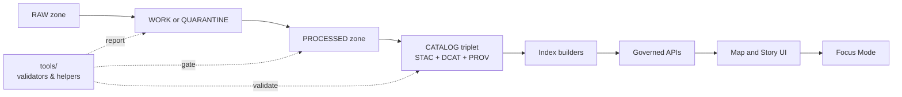

<!-- [KFM_META_BLOCK_V2]
doc_id: kfm://doc/222a8815-5493-4584-af4d-89f56dfb5e79
title: tools/ — Utility scripts, validators, and devops tools
type: standard
version: v1
status: draft
owners: TBD
created: 2026-02-22
updated: 2026-02-22
policy_label: public
related:
  - docs/MASTER_GUIDE_v13.md
  - docs/governance/ROOT_GOVERNANCE.md
  - docs/standards/KFM_*_PROFILE.md
tags: [kfm, tools, validators, devops, governance]
notes:
  - This README is a contract + inventory scaffold for the tools/ subtree. Populate the inventory table as tools land.
[/KFM_META_BLOCK_V2] -->

# tools/ — Utility scripts, validators, and devops tools

**Purpose:** a governed home for **utility tooling** (validators, release helpers, ops scripts) that supports KFM’s contract-first + evidence-first pipeline without bypassing policy boundaries.


---

## Quick navigation

- [What belongs in tools](#what-belongs-in-tools)
- [Non-goals](#non-goals)
- [Directory layout](#directory-layout)
- [How tools fit the canonical pipeline](#how-tools-fit-the-canonical-pipeline)
- [Tool contract](#tool-contract)
- [Tool inventory](#tool-inventory)
- [Governance and safety](#governance-and-safety)
- [Adding a new tool](#adding-a-new-tool)
- [CI integration checklist](#ci-integration-checklist)
- [Appendix: recommended CLI flags](#appendix-recommended-cli-flags)

---

## What belongs in tools

Use `tools/` for **standalone** utilities that:
- validate or lint boundary artifacts (STAC/DCAT/PROV, schemas, cross-links),
- provide operator/maintainer helpers (packaging, SBOM generation, diffing receipts),
- support governance enforcement (policy fixtures validation, redaction checks),
- provide dev ergonomics (local wrappers that *do not* duplicate core pipeline logic).

Use `src/` (especially `src/pipelines/`) for **first-class pipeline code** that produces canonical outputs.

> **Rule:** if it’s part of a domain ETL job, it should usually live in `src/pipelines/`. If it’s a reusable validator/helper invoked by CI or humans across domains, it can live in `tools/`.

[Back to top](#quick-navigation)

---

## Non-goals

- ❌ Re-implementing pipeline logic that already exists under `src/pipelines/`.
- ❌ “Hidden” data processing that writes directly into published surfaces.
- ❌ Tools that silently mutate RAW artifacts or skip provenance.
- ❌ UI shortcuts that bypass governed APIs.

[Back to top](#quick-navigation)

---

## Directory layout

> This is an **expected / recommended** layout. Treat it as a scaffold; keep subtrees small and cohesive.

```text
tools/
├─ README.md                       # you are here
├─ validation/
│  ├─ catalog/                     # STAC/DCAT/PROV validators + cross-link checks
│  ├─ schemas/                     # JSON Schema validation helpers (STAC/DCAT/PROV/story/ui)
│  └─ geo/                         # spatial sanity checks (bbox, CRS presence, geometry policy rules)
├─ policy/
│  ├─ fixtures/                    # policy decision fixtures (allow/deny + obligations)
│  └─ README.md
├─ ops/
│  ├─ release/                     # release packaging helpers (manifests, SBOM, digests)
│  ├─ watchers/                    # optional: watcher runners (registry may live in docs/ops/)
│  └─ README.md
└─ dev/
   ├─ README.md                    # local developer usage
   └─ scripts/                     # non-production convenience scripts (never used for promotion)
```

### Canonical “homes” reminder

- `tools/` — utilities (this folder)
- `src/pipelines/` — ETL jobs and catalog writers
- `schemas/` — schema sources of truth (JSON Schemas)
- `data/` — artifacts by zone (raw/work/processed) + catalog outputs
- `docs/` — governed documentation and runbooks

[Back to top](#quick-navigation)

---

## How tools fit the canonical pipeline



**Key idea:** tools should help enforce gates (fail-closed), validate boundary artifacts, and generate repeatable reports—without becoming a shadow pipeline.

[Back to top](#quick-navigation)

---

## Tool contract

Every tool in this directory MUST:

1. **Be deterministic**
   - Same inputs/config → same outputs (or explicitly declared non-determinism).
2. **Fail closed**
   - Non-zero exit code when validations fail or when required metadata is missing.
3. **Be provenance-aware**
   - Emit a machine-readable report and support linking to (or generating) a run receipt.
4. **Be automation-friendly**
   - CLI-first, stable exit codes, quiet-by-default with `--json` output.
5. **Respect policy labels**
   - If data is labeled restricted/sensitive/unclear, tools must not “helpfully” expose exact geometries or disallowed fields.

### Standard outputs (recommended)

- `*.report.json` — structured validation results (errors/warnings, file pointers, rule ids)
- `*.report.md` — optional human-readable summary for PRs
- `run-receipt.jsonld` — optional receipt artifact for pipeline or validation runs

[Back to top](#quick-navigation)

---

## Tool inventory

> Populate this table as tools are added. Keep it current—this is how maintainers discover what exists.

| Tool | Purpose | Inputs | Outputs | Deterministic | CI wired | Owner |
|---|---|---|---|---:|---:|---|
| (TBD) | (TBD) | (TBD) | (TBD) | (TBD) | (TBD) | (TBD) |

### Recommended categories

- **Catalog validators:** STAC/DCAT/PROV schema validation + cross-link integrity
- **Promotion gates:** identity/versioning checks, license checks, sensitivity checks, catalog checks
- **Ops + release:** build manifests, SBOM, artifact digests, environment capture
- **Dev helpers:** local wrappers only; must not be required for CI promotion

[Back to top](#quick-navigation)

---

## Governance and safety

### Default-deny when uncertain

If licensing, sensitivity classification, or provenance is unclear:
- route outputs to **QUARANTINE** (or equivalent),
- emit a report explaining what is missing,
- do not generate publishable artifacts.

### Sensitive or culturally restricted locations

Tools MUST support:
- geometry generalization (cell size / bounding box coarsening),
- attribute dropping,
- redaction “obligations” surfaced as machine-readable instructions.

### Tooling boundaries

- Tools may **validate** and **report** on `data/` artifacts.
- Tools must **not** write directly into runtime services (DBs, API stores) except via governed, audited interfaces.

[Back to top](#quick-navigation)

---

## Adding a new tool

### Minimal steps

1. Create a subdirectory under `tools/<category>/<tool-name>/`.
2. Add `README.md` with:
   - purpose,
   - inputs/outputs,
   - exit codes,
   - examples,
   - limitations.
3. Add tests (unit and/or golden fixtures).
4. Wire CI to run it where appropriate (PR gate or scheduled).
5. Ensure it emits a machine-readable report.

### “Definition of done” for a tool

- [ ] Deterministic (or documented exceptions)
- [ ] Fail-closed
- [ ] Produces `*.report.json`
- [ ] Has tests + fixtures
- [ ] Documented usage and contract
- [ ] Does not bypass governance boundaries

[Back to top](#quick-navigation)

---

## CI integration checklist

When a tool is intended as a gate, CI MUST:

- [ ] Run the tool on fixtures (minimum) and on changed artifacts (preferred).
- [ ] Upload the report as a build artifact.
- [ ] Fail the job on validation errors.
- [ ] Provide a concise PR annotation (summary table or markdown).

[Back to top](#quick-navigation)

---

## Appendix: recommended CLI flags

Tools SHOULD converge on a consistent CLI vocabulary:

```bash
# inputs and outputs
--in <path>            # input path (file or directory)
--out <path>           # output path (dir)
--config <path>        # config file (yaml/json)

# execution
--strict               # treat warnings as errors
--dry-run              # do not write outputs
--json                 # machine-readable output to stdout
--quiet                # suppress non-error logs

# provenance and audit
--run-id <id>          # caller-provided run id (optional)
--receipt <path>       # write run receipt jsonld (optional)
--env-capture <path>   # write environment capture bundle (optional)
```

> NOTE: This appendix is a recommendation. If a tool cannot comply, document why in that tool’s README.

[Back to top](#quick-navigation)
