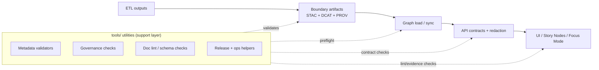

KFM Tools Directory (README)

Governed document. The `tools/` directory is the canonical home for **utility scripts, validators, and DevOps helpers** that support KFM’s reproducibility, contract enforcement, and governance checks. Tools are here to make the pipeline *verifiable* and *repeatable* — not to bypass it.

## 📘 Overview

### Purpose

The `tools/` directory exists to provide standalone utilities that:

- validate **STAC / DCAT / PROV** boundary artifacts against KFM profiles
- run **governance/sensitivity** checks (redaction, leakage prevention)
- generate or validate **operational artifacts** (telemetry, ledger updates, SBOM/release checks) when applicable
- lint governed docs (front-matter + heading registry) and enforce “Definition of Done” expectations
- provide small “glue” helpers used in CI or local workflows (without duplicating core pipeline logic)

### Scope

In scope (typical patterns):

- **validators & linters** (metadata schema checks, doc schema checks, link integrity checks)
- **preflight checks** for graph build, API contracts, UI layer registries
- **release/ops helpers** (ledger entries, telemetry export, SBOM validation, manifest generation)
- **governance checks** (e.g., coordinate masking / redaction enforcement)

Out of scope (should live elsewhere):

- Primary ETL pipelines (canonical home: `src/pipelines/etl/`)
- Graph build + migrations (canonical home: `src/graph/`)
- API runtime + contracts (canonical home: `src/server/`)
- UI runtime (canonical home: `web/`)

### Tooling principles (non-negotiable)

1. **Respect the canonical pipeline**  
   Tools must reinforce (not contradict) the ordered flow:  
   `ETL → STAC/DCAT/PROV → Graph → APIs → UI → Story Nodes → Focus Mode`

2. **No out-of-band publishing**  
   “Published” outputs must follow staging + boundary artifacts rules (see 📦 Data & Metadata). Tools may validate downstream systems, but should not “sneak” data into them.

3. **Deterministic + replayable**  
   Tools should be deterministic given pinned inputs/config. If non-determinism is unavoidable (timestamps, network calls), provide flags to pin behavior and log run context clearly.

4. **Provenance-first for any derived data**  
   If a tool produces a dataset-like artifact (including AI/analysis outputs), treat it as a first-class governed output:
   - store under `data/processed/...`
   - generate/refresh STAC/DCAT/PROV boundary artifacts
   - emit run logs / validation reports

5. **Safe by default**  
   Avoid leaking sensitive locations or personal data in logs, reports, or stdout. Prefer generalized outputs; fail closed if classification/sensitivity is unknown.

### Quick start

```bash
# See what tools exist
ls tools/

# Each tool should provide CLI help
python tools/<tool_name>.py --help

# (Optional) if a tool is packaged as a module
python -m tools.<tool_name> --help
```

### Tool inventory (maintainers: keep current)

> This table is intentionally “living”. Add a row whenever a tool is added, renamed, or removed.

| Tool / Path | Category | Description | Inputs | Outputs | Stage it supports | CI integration |
|---|---|---|---|---|---|---|
| (add tools here) | validate | Schema/profile validation for artifacts | files/dirs | reports + exit code | Catalogs | pre-commit / GH Actions |
| (add tools here) | governance | Sensitivity/redaction enforcement | data + metadata | pass/fail + report | Catalogs/API/UI | GH Actions |
| (add tools here) | devops | Ledger/telemetry/SBOM helpers | build artifacts | artifacts + report | Release/ops | GH Actions |

### Reference library (non-normative)

This project includes external reference texts (modeling/simulation, statistics & experimental design, GIS/geoprocessing, Google Earth Engine, WebGL/graphics, clean architecture, shell scripting, etc.). These are **implementation guidance only** and **do not override** KFM contracts/templates/governance.

## 🗂️ Directory Layout

### This document
- `tools/README.md` (this file)

### `tools/` scaffold (recommended)

Note: The structure below is a **recommended** layout to keep tooling organized by pipeline boundary.
If your repo uses different names, keep the same intent and update this tree accordingly.

    📁 tools/
    ├── 📄 README.md
    ├── 📁 bin/                                 # entrypoints (thin CLIs)
    │   ├── 📄 kfm-tools                         # bash/sh wrapper (example)
    │   └── 📄 kfm-tools.ps1                     # PowerShell wrapper (example)
    ├── 📁 validate/                             # validators (local + CI)
    │   ├── 📄 README.md
    │   ├── 📁 stac/
    │   │   ├── 📄 validate_stac.py
    │   │   └── 📄 README.md
    │   ├── 📁 dcat/
    │   │   ├── 📄 validate_dcat.py
    │   │   └── 📄 README.md
    │   ├── 📁 prov/
    │   │   ├── 📄 validate_prov.py
    │   │   └── 📄 README.md
    │   ├── 📁 storynodes/
    │   │   ├── 📄 validate_story_nodes.py
    │   │   └── 📄 README.md
    │   └── 📁 ui/
    │       ├── 📄 validate_ui_registry.py
    │       └── 📄 README.md
    ├── 📁 run/                                  # thin runners (call into src/*)
    │   ├── 📁 etl/
    │   │   └── 📄 run_etl.py
    │   ├── 📁 catalog/
    │   │   ├── 📄 build_stac.py
    │   │   ├── 📄 build_dcat.py
    │   │   └── 📄 build_prov.py
    │   ├── 📁 graph/
    │   │   └── 📄 load_graph.py
    │   └── 📁 api/
    │       └── 📄 contract_smoke_test.sh
    ├── 📁 dev/                                  # contributor ergonomics
    │   ├── 📄 bootstrap_env.sh
    │   ├── 📄 lint.sh
    │   └── 📄 precommit.sh
    └── 📁 config/                               # tooling templates (commit-safe)
        ├── 📄 .env.tools.example
        └── 📄 logging.yaml
```

### Suggested internal organization (optional)

If `tools/` grows large, consider grouping by intent (keep tooling discoverable):

- `tools/validate/` — schema/profile validators (STAC/DCAT/PROV, docs schema, link checks)
- `tools/governance/` — sensitivity + redaction checks, FAIR+CARE enforcement utilities
- `tools/devops/` — release helpers, SBOM/attestation checks, telemetry/ledger tasks
- `tools/docs/` — markdown lint helpers, heading registry checks

*(Folder names above are suggested; adapt to the repo’s existing structure.)*

## 🧭 Context

### Where tools fit in the pipeline

Tools exist to **support** the canonical pipeline stages:

- **ETL** produces transformed datasets and prepares publishable outputs.
- **Boundary artifacts** (STAC/DCAT/PROV) are generated and validated.
- Only then do **graph loads**, **API publication**, and **UI/story** consumption proceed.

Tools are commonly used as:
- local preflight checks (before committing changes)
- CI gates (blocking merges/promotions when validations fail)
- release/ops automation steps (ledger, telemetry, SBOM checks)

### Architectural boundaries you must not break

- The **UI consumes data via the API layer**, not by directly querying Neo4j or reading raw files.
- **Heavy computations happen in ETL**, not at request time in the API layer.
- Catalog metadata is the formal gatekeeper: **if it’s not valid catalog/prov, it doesn’t move forward.**

## 🗺️ Diagrams



## 📦 Data & Metadata

### IO rules (default)

- **Read:** Prefer reading from:
  - `data/raw/`, `data/work/`, `data/processed/`
  - `data/stac/`, `data/catalog/dcat/`, `data/prov/`

- **Write:** Prefer writing to:
  - `data/work/…` for intermediate/scratch outputs, OR
  - `docs/reports/…` for validation/audit reports, OR
  - `releases/…` for release artifacts (SBOM, telemetry, manifests) *(if present in this repo)*

Avoid:
- writing into `data/raw/` (raw is immutable by definition)
- direct mutation of Neo4j without using sanctioned graph build/sync mechanisms
- producing “orphan outputs” with no STAC/DCAT/PROV linkage

### Boundary artifacts required for publishable outputs

When a tool creates or materially changes a dataset-like output:

1. Write the output under `data/processed/<domain>/…`
2. Generate/refresh:
   - STAC Collection + Item(s) in `data/stac/...`
   - DCAT dataset record in `data/catalog/dcat/...`
   - PROV lineage bundle in `data/prov/...`
3. Run validators (preferably in strict mode)
4. Only then proceed to graph sync / API publication / UI exposure

## 🧱 Architecture

### Contract-first interfaces

Tools that touch contracts must treat the following as first-class artifacts:

- **Ontology**: stable labels/relations; changes require migrations.
- **OpenAPI / GraphQL**: versioned contracts; breaking changes require explicit versioning.
- **UI layer registry**: validate layer configs and redaction behavior.
- **Story Node templates**: evidence-linking rules must be enforced.

### Determinism & reproducibility expectations

When possible, tools should:

- accept explicit inputs/outputs via CLI flags
- emit machine-readable logs (JSON preferred)
- record:
  - tool/script version
  - dependency lock hash (if applicable)
  - git commit SHA
  - data snapshot identifiers
- exit with **non-zero** code on validation failure

## 🧪 Validation & CI/CD

### Common checks expected in CI

Depending on what changed, CI may run:

- Markdown lint + front-matter schema validation
- STAC/DCAT/PROV schema validation
- Graph integrity checks (ontology constraints, migration consistency)
- API contract tests (OpenAPI schema compatibility)
- UI checks (layer registry schema, accessibility)
- Governance checks (sensitivity, redaction, ledger/telemetry)

### Adding a new tool (checklist)

1. Create the tool under `tools/` with a clear, descriptive name.
2. Ensure it has `--help` and a minimal usage example.
3. Ensure it is deterministic (or documents why it is not and how to pin it).
4. Ensure IO follows staging layout + boundary artifacts requirements.
5. Add it to the Tool inventory table above.
6. Add/extend CI so the tool runs in the appropriate situations.
7. If it touches governance/sensitivity, implement **fail-closed** behavior and flag uncertain cases for governance review.

## ⚖ FAIR+CARE & Governance

Tools must support FAIR+CARE by:

- enforcing metadata completeness (license, spatial/temporal extents, attribution)
- preventing leakage of sensitive information (especially precise locations)
- recording governance outcomes in audit artifacts when applicable (ledger/telemetry)

If a tool processes content that might include:
- culturally sensitive locations
- personal data
- restricted archives

…default to **generalize/redact**, and require human governance review before promotion.

## 🕰️ Version History

| Version | Date | Notes |
|---|---|---|
| v1.0.0-draft | 2025-12-31 | Initial governed README for the `tools/` directory. |
