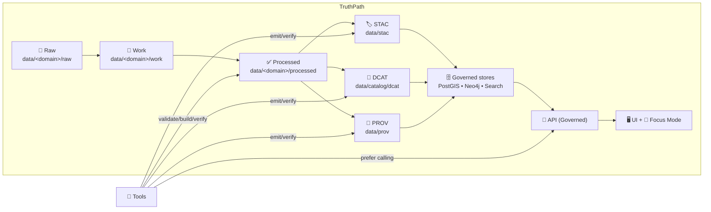
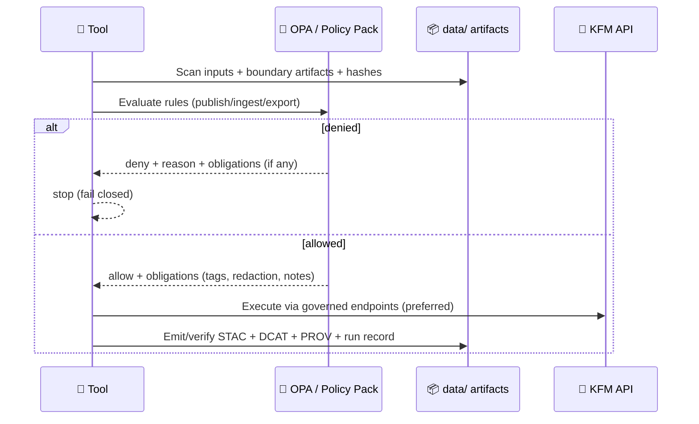

<div align="center">

<!-- 🧿 Optional: add the animated seal to the repo and update this path -->


# 🧰 KFM Tools — Dev + Ops Utilities

**Repeatable utilities for running, validating, and operating Kansas Frontier Matrix (KFM)**  
<sub><em>Tools are the “sharp knives” of the platform — powerful, audited, and governed.</em></sub>

<br/>


-1f6feb?style=for-the-badge)

<a href="#quickstart">🚀 Quickstart</a> •
<a href="#tool-philosophy-what-tools-must-and-must-not-do">🧭 Philosophy</a> •
<a href="#tool-index">🧰 Tool Index</a> •
<a href="#tool-standard-minimum-compliance-profile">✅ Tool Standard</a> •
<a href="#adding-a-new-tool">➕ Add a Tool</a>

</div>

---

> [!WARNING]
> 🚧 **Under construction:** the tooling layer is evolving quickly.  
> Expect utilities to move, consolidate, and gain stricter policy/provenance gates over time.

> [!IMPORTANT]
> **Tools must not bypass KFM’s trust membrane.**  
> Prefer **pipeline → boundary artifacts (STAC/DCAT/PROV) → governed stores → governed API** over direct DB edits.  
> If a tool must touch DB internals (rare), it must do so with explicit guardrails + an audit trail + provenance.

---

## 🧭 What belongs in `tools/`

In the KFM v13 layout, `tools/` is explicitly intended for **utility scripts, validators, and DevOps tools** — not for ad‑hoc experimentation.:contentReference[oaicite:1]{index=1}

`tools/` exists to keep operational work **repeatable**, **reviewable**, and **governed**.

### ✅ Belongs here
- 🔎 **Validation/QA:** schema checks, artifact completeness, geometry sanity, link integrity
- 🗂️ **Boundary artifact ops:** build/verify **STAC + DCAT + PROV**
- 🧬 **Provenance ops:** manifests, checksums, run receipts, bundle verification
- 🧱 **Data ops helpers:** exports, conversions, safe backfills (prefer pipeline-driven)
- 🐳 **Stack diagnostics:** health checks, dependency verification, port checks
- 🔐 **Policy utilities:** policy eval, fixture testing, “preflight” decisions (OPA/Conftest helpers)
- 📦 **Packaging:** dataset bundles, release stamping, artifact signing (when enabled)

### 🚫 Does *not* belong here
- One-off experiments with no repeatable interface  
  → use **`mcp/`** for runs/notebooks/model cards, and **`docs/reports/…`** for narrative outputs/story nodes.:contentReference[oaicite:2]{index=2}
- Manual hot-fixes that bypass governance/provenance
- Secrets, keys, private URLs, or restricted raw data

> [!NOTE]
> Some older KFM materials describe pipelines writing to `data/raw/`, `data/work/`, `data/processed/`.  
> In v13, the preferred layout is domain-first: `data/<domain>/{raw,work,processed}` plus shared boundary dirs (`data/stac`, `data/catalog/dcat`, `data/prov`).:contentReference[oaicite:3]{index=3}

---

## 🧭 Tool philosophy: what tools **must** (and must not) do

KFM is a governance system as much as it is a data system.

### ✅ Tools should:
- 🧾 **Preserve provenance** (stamp runs, inputs, outputs, hashes)
- 🔒 **Fail closed** (if boundary artifacts/policy/provenance is missing → stop)
- 🧱 **Prefer governed interfaces** (the API is the trust boundary; policy is the rulebook)
- ♻️ **Be re-runnable** (idempotent or explicitly versioned)
- 📦 **Produce reviewable artifacts** (manifests/logs/reports) that can be committed in PRs

### ⛔ Tools must not:
- “Quietly succeed” on partial or ungoverned outputs
- Make irreversible changes without a plan/dry-run mode
- Create or publish assets without STAC/DCAT/PROV alignment

---

## 🧬 Tools inside the KFM “Truth Path”



**Design intent:** Tools are accelerators — not shortcuts.  
If a tool “skips steps,” it’s usually a governance bug.

---

## 🚀 Quickstart

### ✅ Recommended: run tools “in stack context” 🐳
From repo root:

```bash
docker compose up -d
```

### 🧭 Discover API capabilities (source of truth)
Explore the live REST surface in Swagger:

- `http://localhost:8000/docs`

This page reflects the routes available on *your current branch* (and may differ from examples in docs).:contentReference[oaicite:4]{index=4}

### ▶️ Run tools
Run tools either:

**A) from your host (simple scripts):**
```bash
python tools/<tool>/run.py --help
```

**B) inside the API container (best for consistent GIS deps + DB connectivity):**
```bash
docker compose exec api bash
# inside container:
python tools/<tool>/run.py --help
```

> [!TIP]
> If a tool needs PostGIS/Neo4j/GDAL/PROJ or needs to consult policy decisions,
> prefer container execution so everyone runs the same dependencies.

---

## 📁 Tool index

> Tools are only “real” when discoverable ✅  
> Keep this list current; stale indexes cause unsafe re-runs and duplicate utilities.

### 🔎 Where tools live (v13 expectation)
`tools/` is an explicit top-level for scripts/validators/DevOps utilities.:contentReference[oaicite:5]{index=5}

### 🧩 “Front door” CLI (recommended pattern)
If your branch provides a consolidated CLI, document it here (example structure):

- **`tools/kfm/`** — helper CLI (ops + validation glue)  
  👉 See: `tools/kfm/README.md` (if present on your branch)

> [!NOTE]
> If `tools/kfm/` is not present yet, that’s OK. Prefer small, focused tools with consistent flags until consolidation happens.

### 🧱 Recommended categories (target structure)
```text
tools/
├─ validate/               ✅ schema + artifact completeness
├─ catalog/                🗂️ build/verify STAC + DCAT
├─ prov/                   🧬 build/verify PROV + manifests
├─ policy/                 🔐 policy eval + fixtures (OPA/Conftest helpers)
├─ ops/                    🐳 stack checks, backups, migrations (guarded)
└─ export/                 📦 safe exports (API-first)
```

---

## 🧯 Safety levels for tools (read this before running anything)

| Level | Name | Allowed behavior | Required features |
|---|---|---|---|
| 🟢 | Inspect | read-only checks, reports, diffs | `--help`, stable output, non-destructive |
| 🟡 | Plan | show intended changes, no writes | `--dry-run`/`--plan`, meaningful exit codes |
| 🔴 | Apply | writes/mutations (files/DB/services) | confirmations, run record, provenance stamp |

> [!IMPORTANT]
> Any 🔴 tool must create a **run record** (see below) and should default to 🟡 Plan mode.

---

## 🧾 Tool run records (provenance for operations)

Every tool that **creates or mutates** artifacts must emit a run record capturing:

- 📌 tool name + version
- 🧾 inputs (dataset IDs, file paths, hashes)
- ⚙️ parameters/flags
- 🧠 environment (git commit SHA, container image digest if known)
- 🧭 policy context (policy bundle hash / policy commit, decision ID if applicable)
- 🕰️ timestamps + duration
- ✅ outputs (paths, checksums) and a success/failure summary

**Recommended location (aligned with v13 provenance directory):**
```text
data/prov/tool-runs/<tool>/<timestamp>__<gitsha>.json
```

> [!TIP]
> Think of these as “receipts.” If we can’t reconstruct what happened, the operation didn’t happen (in KFM terms).

---

## 🔌 API-first operations (preferred pattern)

Tools should favor the governed API for actions like:
- dataset discovery
- metadata retrieval
- safe exports
- pipeline triggers (when enabled)
- policy decisions + redactions

### Handy endpoints
Swagger is the authoritative reference: `http://localhost:8000/docs` :contentReference[oaicite:6]{index=6}

Examples you may see (depending on branch):
- `GET /datasets` (if implemented):contentReference[oaicite:7]{index=7}
- `GET /features/{id}` or similar entity lookups:contentReference[oaicite:8]{index=8}

---

## 🔐 Policy-first tooling

If policy can’t decide, tools must **deny** (fail closed).

KFM’s governance model is explicitly “policy as code,” commonly implemented via **OPA + Rego** in a `policy/` directory, with **Conftest** used to enforce those rules in CI.:contentReference[oaicite:9]{index=9}

At runtime, the deployed system can also consult OPA to enforce access controls and AI/data rules, and it should record decisions alongside the **policy version/bundle hash** for auditability.:contentReference[oaicite:10]{index=10}

### Suggested preflight flow


---

## ✅ Tool standard: Minimum Compliance Profile

This is the baseline quality bar for anything we consider a **real** KFM tool.

### ✅ Required
- `--help` with examples
- deterministic output locations (or clearly documented)
- meaningful exit codes (0 success, non-zero failure)
- structured logging (timestamps; optional JSON logs)
- safe defaults (inspect/plan first)

### 🌟 Strongly recommended
- `--dry-run` / `--plan` mode
- `--json` output for automation
- `--output <dir>` (to keep artifacts in one place)
- provenance run record emission (see above)
- policy preflight / “explain deny” output

### 🔒 For destructive operations
- “danger zone” callout in README
- explicit confirmation flags (e.g., `--yes-i-mean-it`)
- backups or rollback notes

> [!NOTE]
> “MCP” in KFM usually refers to the **Master Coder Protocol** (coding + documentation rigor).
> Tools should meet MCP expectations while also meeting the tool compliance bar above.

---

## 🛠️ Troubleshooting

### 🧱 API / DB connectivity
```bash
docker compose logs api --tail=200
```

Common culprits include:
- port conflicts (e.g., host Postgres already on 5432; or other services colliding on common ports):contentReference[oaicite:11]{index=11}
- services not ready (restart stack; ensure dependencies start correctly)
- volume permissions on `data/` (container can’t write mounted dirs):contentReference[oaicite:12]{index=12}

### 🔁 Changes not reflected
```bash
docker compose up -d --build
```

### 🧾 “Missing license / sensitivity / PROV”
✅ This is expected. It means governance is working.  
Fix the dataset’s boundary artifacts and rerun the tool.

---

## ➕ Adding a new tool

### ✅ Standard scaffold
```text
tools/
└─ <tool-name>/
   ├─ README.md                  📚 purpose + usage + what it changes
   ├─ src/                       🧠 implementation
   ├─ tests/                     🧪 smoke tests + fixtures
   ├─ fixtures/                  🧊 sample inputs/outputs (optional)
   └─ bin/                       🏃 entrypoint (optional)
```

### 📌 Tool README must answer
- 🎯 What does it do?
- 🧾 What inputs does it consume?
- ✅ What artifacts does it produce (STAC/DCAT/PROV/run record)?
- 🔐 What policies/gates apply?
- 🧯 What can go wrong + how to recover?

### ✅ Add it to the index
Update: **Tool index** → [📁 Tool index](#tool-index)

---

<div align="center">

### 🧭 Tooling mantra
**Make it repeatable. Make it auditable. Make it governed.**  
If it can’t be traced, validated, and reproduced… it’s not a tool — it’s a risk. 🧾🛡️

</div>
